# jQuery

## 기본

#### HTML 문서를 구성하는 요소 - 태그와 속성

```javascript
<a href="http://..."> 링크 </a>
```

* `a` : 태그, element(요소)

* `href="http://..."` : 속성, attribute
  * 속성 이름
    * ex) id, class, name ...
  * 속성 값


#### HTML input type

```javascript
<html>
<head>
    <script src="/node_modules/jquery/dist/jquery.js"></script>
    <script>
        $(function() {
        });
    </script>
</head>
<body>
    <form action="#" method="get">
        성 : <input type="text" name="lastName"><br>
        이름 : <input type="text" name="firstName"><br>
        패스워드 : <input type="password" name="pw"><br>
        패스워드(확인) : <input type="password" name="pw2"><br>
        결혼여부 :
        <input type="radio" name="ismarried" value="Y"> 네
        <input type="radio" name="ismarried" value="N"> 아니오<br>
        좋아하는 색깔 :
        <input type="checkbox" name="color" value="red"> 빨강
        <input type="checkbox" name="color" value="blue"> 파랑
        <input type="checkbox" name="color" value="yellow"> 노랑<br>
        사진 : <input type="file" name="photo"><br>
        <input type="submit" value="전송">
    </form>
</body>
</html>
```

* password는 일반적인 text 입력창과는 다르게 입력하면 마스킹된다.

* radio 버튼은 배타적으로 선택된다. 동시에 선택되는 것을 radio 버튼을 쓰는 것은 안좋은 인터페이스이다.

* checkbox는 여러개를 선택할 수 있다. 동시에 멀티플하게 선택 가능


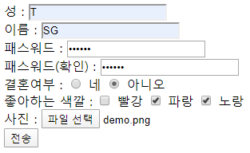


```URL
http://localhost:8080/test.html?lastName=T&firstName=SG&pw=abc123&pw2=abc123&ismarried=N&color=blue&color=yellow&photo=demo.png#
```

* 사용자가 입력하면 입력한 값이 어떤 name의 어떤 value 형태로 서버로 날아간다.

* 화면에서 T를 입력하면 브라우저 내에서 value에 T가 들어간다.


```URL
http://naver.com/abc/xyz/do.jsp?lastName=T&firstname=SG...
```

* `http` : 스킴
* `naver.com` : 호스트
* `/abc/xyz/do.jsp` : 경로
* `lastName=T&firstname=SG...` : 요청 파라미터


* HTTP 프로토콜을 이용하여 서버에 무언가를 전달할 때 사용하는 방식

  * Get 방식
    * 요청 파라미터를 URL 주소에 포함시켜서 전달하는 방식
    * URL에 이어붙이기 때문에 길이제한이 있어 많은 양의 데이터는 보내기 어렵다.
    * 가져오는 개념. 서버에서 어떤 데이터를 가져와 보여주는 용도(상태 변경 용도 X)
  * Post 방식
    * from을 이용하여 submit 하는 형태
    * 많은 양의 정보를 보내기에 적합하다. (단, 용량 제한은 존재)
    * 수행하는 개념. 서버의 값이나 상태를 바꾸기 위해 사용

  ```html
  <form action="#" method="get"></form>	-> get방식
  <form action="#" method="get"></form>	-> post방식
  ```

  

#### 속성 선택자

p426

* 속성 선택자는 기본 선택자 뒤에 붙여서 사용

```javascript
<html>
<head>
    <script src="/node_modules/jquery/dist/jquery.js"></script>
    <script>
        $(function() {
            // 성, 이름 입력창에 OOO을 입력하세요. 문장을 추가
            // $("#lastName").val('성을 입력하세요.');
            // $('input[type="text"]').val("입력하세요.");
            $('input[name="lastName"]').val("성을 입력하세요.");
            $('input[name="firstName"]').val("이름을 입력하세요.");         
        });
    </script>
</head>
<body>
    <form action="#" method="get">
        성 : <input type="text" name="lastName"><br>
        이름 : <input type="text" name="firstName"><br>
        패스워드 : <input type="password" name="pw"><br>
        패스워드(확인) : <input type="password" name="pw2"><br>
        결혼여부 :
        <input type="radio" name="ismarried" value="Y"> 네
        <input type="radio" name="ismarried" value="N"> 아니오<br>
        좋아하는 색깔 :
        <input type="checkbox" name="color" value="red"> 빨강
        <input type="checkbox" name="color" value="blue"> 파랑
        <input type="checkbox" name="color" value="yellow"> 노랑<br>
        사진 : <input type="file" name="photo"><br>
        <input type="submit" value="전송">
    </form>
</body>
</html>
```


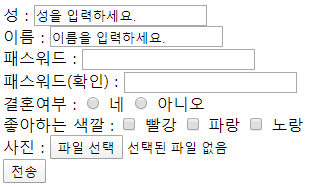


```javascript
<!DOCTYPE html>
<html>
<head>
    <script src="/node_modules/jquery/dist/jquery.js"></script>
    <script>
        $(function() {
            //  성, 이름 입력창에 OOO을 입력하세요. 문장을 추가
            //  $("#lastName").val('성을 입력하세요.');
            $('input[name="lastName"]').val("성을 입력하세요.");
            $('input[name="firstName"]').val("이름을 입력하세요.");
            /*  
                p426
                https://api.jquery.com/category/selectors/attribute-selectors/
                E[A=V]  속성값이 같은 문서 객체 선택
                E[A!=V] 속성값이 다른 문서 객체 선택
                E[A~=V] 속성값에 단어가 포함된 객체를 선택    
                E[A^=V] 속성값이 글자로 시작하는 객체를 선택
                E[A$=V] 속성값이 글자로 끝나느느 객체를 선택
                E[A*=V] 속성값에 글자를 포함한 객체를 선택
            */

            //  파일 선택창을 제외하고 나머지 입력창에 대해서 (필수입력) 표시
            $('input[type!="file"]').prev().append("(필수입력)").css('color', 'red');

            //  name 속성에 pw이 포함된 것을 검색
            $('input[name~="pw"]').css('background', 'red');

            //  name 속성이 pw로 시작하는 입력창
            $('input[name^="pw"]').css('border', '3px dotted blue');

            //  name 속성이 Name으로 끝나는 입력창
            $('input[name$="Name"]').css('border', '3px solid black');

            //  type 속성에 o가 들어가 있는 입력창을 삭제
            $('input[type*="o"]').hide();
        });
    </script>
</head>
<body>
<form action="#" method="get">
    <label>성</label>
    <input type="text" name="lastName" value=""><br>
    <label>이름</label>
    <input type="text" name="firstName"><br>
    <label>패스워드</label>
    <input type="password" name="pw"><br>
    <label>패스워드(확인)</label>
    <input type="password" name="pw2"><br>
    <label>결혼여부</label>
    <input type="radio" name="ismarried" value="Y"> 네
    <input type="radio" name="ismarried" value="N"> 아니오<br>
    <label>좋아하는 색깔</label>
    <input type="checkbox" name="color" value="red"> 빨강
    <input type="checkbox" name="color" value="blue"> 파랑
    <input type="checkbox" name="color" value="yellow"> 노랑<br>
    <label>사진</label>
    <input type="file" name="photo"><br>
    <input type="submit" value="전송">
</form>
</body>
</html>
```


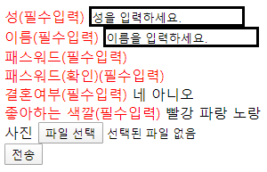


`append` : 원래 있던 내용에 추가

`hide` : 내용 숨기기

```html
<label style="color:red;"></label>
```


#### CSS 이용

```javascript
<!DOCTYPE html>
<html>
<head>
    <script src="/node_modules/jquery/dist/jquery.js"></script>
    <script>
        $(function() {
            //$("div").css('background','blue');
        });
    </script>
    <style>
        div {
            border: 1px solid black;
            padding: 10px;
            margin: 10px 20px;
            width: auto;
            height: auto;
            font-size: 30px;
            float: left;
        }
        div.num {
            background: gray;
        }
        div.char {
            background: greenyellow;
        }
        div.red {
            color: red;
        }
        div.blue {
            color: blue;
        }
        div.green {
            color: green;
        }
        div.yellow {
            color: yellow;
        }
        /* CSS 속성 선택자 
           ⇒ https://developer.mozilla.org/ko/docs/Web/CSS/Attribute_selectors 
        */
        div[class="char yellow"] {
            background: indigo;
        }
	  /* jQuery Selector에서는 가능하나 CSS에서는 불가 
        div[class="char"][class="yellow"] {
            border: 13px dotted red;
        }
        */
    </style>
</head>
<body>
    <div class="num red">1</div>
    <div class="num blue">2</div>
    <div class="num yellow">3</div>
    <div class="num green">4</div>

    <div class="char red">하나</div>
    <div class="char blue">둘</div>
    <div class="char yellow">셋</div>
    <div class="char green">넷</div>
</body>
</html>
```


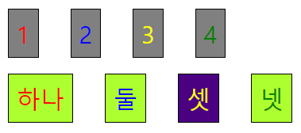


* class라는 것은 여러개를 나열할 수 있다.

* CSS 는 화면을 꾸미는 작업을 해주는 것이다.
* jQuery의 selector와 CSS의 selector의 형식이나 이름은 거의 유사하다.

* `<style>` 태그 아래에 있는 것이 CSS


* `padding` : 요소의 내부 공간. 내용과 테두리간의 여백

* `margin` : 외부 여백

* 태그가 있으면 한 라인을 다 차지하는 경우가 있고, 컨텐츠에 맞게 차지하는 경우가 있다.

* block 요소 : 한 줄을 다 차지하는 것

* `float` : block 요소를 한 줄을 다 차지하도록 하는 것이 아니라 컨텐츠 크기만큼 차지하게 하고 옆에 붙인다.
  * `left` : 왼쪽에 붙인다
  * `right` : 오른쪽에 붙인다. 역순으로 나온다.


```css
margin: top right bottom left
margin: 10px 20px 30px 40px
margin-top: 10px;
margin-right: 20px;
```

margin 뒤에 있는 값의 개수에 따라 적용되는 방식이 다르다. 하나만 있으면 전체 적용


여러개 중에서 순차적으로 가져와서 첫번째 가져오면 index는 0, item에는 그 내용이 들어간다.

이용할 때에는 `$(item)` 이용.

`attr('속성이름')` : 속성이름에 해당하는 속성값을 가져온다.


```javascript
<!DOCTYPE html>
<html>
<head>
    <script src="/node_modules/jquery/dist/jquery.js"></script>
    <script>
        $(function() {
            //$("div").css('background','blue');
            // num : 배경색을 회색
            // char : 배경색을 적당한 색
            // red, yellow, green, blue -> 글자색
            $('div.num').css('background', 'gray');
            $('div.char').css('background', '#105090');
            $('div.red').css('color', 'red');
            $('div.blue').css('color', 'blue');
            $('div.green').css('color', 'green');
            $('div.yellow').css('color', 'yellow');
            
            // console.log($('div.num'));
            $('div.num').each(function(index, item) {
                // console.log(item);
                console.log($(item).attr('class').substr(4));
            });
        });
    </script>
    <style>
        div {
            border: 1px solid black;
            padding: 10px;
            margin: 10px 20px;
            width: auto;
            height: auto;
            font-size: 30px;
            float: left;
        }
    </style>
</head>
<body>
    <div class="num red">1</div>
    <div class="num blue">2</div>
    <div class="num yellow">3</div>
    <div class="num green">4</div>

    <div class="char red">하나</div>
    <div class="char blue">둘</div>
    <div class="char yellow">셋</div>
    <div class="char green">넷</div>
</body>
</html>
```


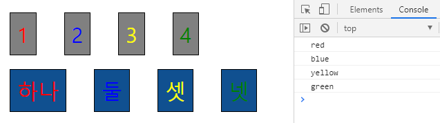


```javascript
<!DOCTYPE html>
<html>
<head>
    <script src="/node_modules/jquery/dist/jquery.js"></script>
    <script>
        $(function() {
            //$("div").css('background','blue');
            // num : 배경색을 회색
            // char : 배경색을 적당한 색
            // red, yellow, green, blue -> 글자색
            $('div.num').css('background', 'gray');
            $('div.char').css('background', '#105090');
            /*
            $('div.red').css('color', 'red');
            $('div.blue').css('color', 'blue');
            $('div.green').css('color', 'green');
            $('div.yellow').css('color', 'yellow');
            */
            
            // console.log($('div.num'));
            $('div.num').each(function(index, item) {
                // console.log(item);
                // console.log($(item).attr('class').substr(4));
                let color = $(item).attr('class').substr(4);
                $(item).css('color', color);
            });
        });
    </script>
    <style>
        div {
            border: 1px solid black;
            padding: 10px;
            margin: 10px 20px;
            width: auto;
            height: auto;
            font-size: 30px;
            float: left;
        }
    </style>
</head>
<body>
    <div class="num red">1</div>
    <div class="num blue">2</div>
    <div class="num yellow">3</div>
    <div class="num green">4</div>

    <div class="char red">하나</div>
    <div class="char blue">둘</div>
    <div class="char yellow">셋</div>
    <div class="char green">넷</div>
</body>
</html>
```


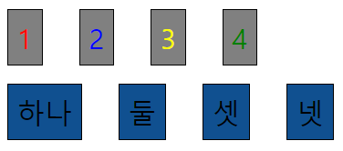


## 이벤트

p502


```javascript
<!DOCTYPE html>
<html>
<head>
    <script src="/node_modules/jquery/dist/jquery.js"></script>
    <script>
        $(function() {
            //$("div").css('background','blue');
            // num : 배경색을 회색
            // char : 배경색을 적당한 색
            // red, yellow, green, blue -> 글자색
            $('div.num').css('background', 'gray');
            $('div.char').css('background', '#105090');
            /*
            $('div.red').css('color', 'red');
            $('div.blue').css('color', 'blue');
            $('div.green').css('color', 'green');
            $('div.yellow').css('color', 'yellow');
            */
            
            // console.log($('div.num'));
            $('div.num').each(function(index, item) {
                // console.log(item);
                // console.log($(item).attr('class').substr(4));
                let color = $(item).attr('class').substr(4);
                $(item).css('color', color);
            });

            // 이벤트 핸들링
            $('div').click(function() {
                let value = $(this).text();
                console.log(value);
            });
        });
    </script>
    <style>
        div {
            border: 1px solid black;
            padding: 10px;
            margin: 10px 20px;
            width: auto;
            height: auto;
            font-size: 30px;
            float: left;
        }
    </style>
</head>
<body>
    <div class="num red">1</div>
    <div class="num blue">2</div>
    <div class="num yellow">3</div>
    <div class="num green">4</div>

    <div class="char red">하나</div>
    <div class="char blue">둘</div>
    <div class="char yellow">셋</div>
    <div class="char green">넷</div>
</body>
</html>
```


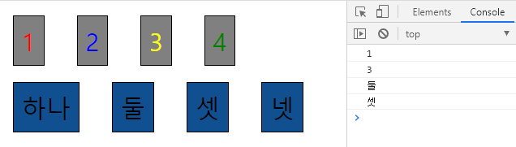


```javascript
<!DOCTYPE html>
<html>
<head>
    <script src="/node_modules/jquery/dist/jquery.js"></script>
    <script>
        $(function() {
            $('div.num').css('background', 'gray');
            $('div.char').css('background', '#105090');
            
            $('div.num').each(function(index, item) {
                let color = $(item).attr('class').substr(4);
                $(item).css('color', color);
            });

            // 이벤트 핸들링
            $('div').css('cursor', 'pointer').click(function() {
                let value = $(this).text();
                let attr = $(this).attr('class');
                console.log(value, attr);
            });
        });
    </script>
    <style>
        div {
            border: 1px solid black;
            padding: 10px;
            margin: 10px 20px;
            width: auto;
            height: auto;
            font-size: 30px;
            float: left;
        }
    </style>
</head>
<body>
    <div class="num red">1</div>
    <div class="num blue">2</div>
    <div class="num yellow">3</div>
    <div class="num green">4</div>

    <div class="char red">하나</div>
    <div class="char blue">둘</div>
    <div class="char yellow">셋</div>
    <div class="char green">넷</div>
</body>
</html>
```


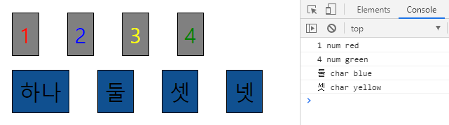


```javascript
<!DOCTYPE html>
<html>
<head>
    <script src="/node_modules/jquery/dist/jquery.js"></script>
    <script>
        $(function() {
            $('div.num').css('background', 'gray');
            $('div.char').css('background', '#105090');

            $('div.num').each(function(index, item) {
                let color = $(item).attr('class').substr(4);
                $(item).css('color', color);
            });

            // 이벤트 핸들링
            $('div#input div').css('cursor', 'pointer').click(function() {
                let value = $(this).text();
                let attr = $(this).attr('class');
                console.log(value, attr);
                $('#disp').append(value, attr);
            });
        });
    </script>
    <style>
        div {
            border: 1px solid black;
            padding: 10px;
            margin: 10px 20px;
            width: auto;
            height: auto;
            font-size: 30px;
            float: left;
        }
    </style>
</head>
<body>
    <div id="disp"></div>
    <div id="input">
        <div class="num red">1</div>
        <div class="num blue">2</div>
        <div class="num yellow">3</div>
        <div class="num green">4</div>
    
        <div class="char red">하나</div>
        <div class="char blue">둘</div>
        <div class="char yellow">셋</div>
        <div class="char green">넷</div>
    </div>
</body>
</html>
```


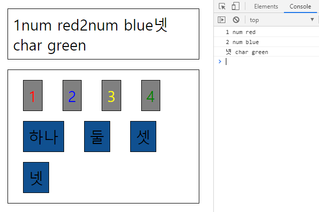


#### 실습 1

div 박스를 클릭하면 동일한 value가 있으면 다른 class의 박스를 숨김(hide), 없으면 다른 class의 박스를 보임(show)

```javascript
<!DOCTYPE html>
<html>
<head>
    <script src="/node_modules/jquery/dist/jquery.js"></script>
    <script>
        $(function() {
            // div 박스를 클릭하면 동일한 value가
            // 있으면 다른 class의 박스를 숨김(hide)
            // 없으면 다른 class의 박스를 보임(show)
            $('div').click(function() {
                let cls = $(this).attr('class');
                let val = $(this).attr('value');

                // 현재 클릭된 div와 value가 같고 class가 다른 div를 선택
                let div = $('div[value="'+val+'"][class!="'+cls+'"]');
                /*
                if (div.is(':visible')) {
                    div.hide();
                } else {
                    div.show();
                }
                */
                div.toggle();
            });
        });
    </script>
    <style>
        div {
            border: 1px solid black;
            padding: 10px;
            margin: 10px 20px;
            width: auto;
            height: auto;
            font-size: 30px;
            float: left;
        }
    </style>
</head>
<body>
    <div class="no" value="1">1</div>
    <div class="no" value="2">2</div>
    <div class="no" value="3">3</div>
    <div class="no" value="4">4</div>

    <div class="ch" value="1">one</div>
    <div class="ch" value="2">two</div>
    <div class="ch" value="3">three</div>
    <div class="ch" value="4">four</div>
</body>
</html>
```

`is(':visible')` : 보이면 반환하는 값이 `true`이다.

`toggle()` : 보였다 안보였다 반전시키는 역할.


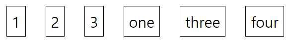

#### 실습2

숫자를 선택하면 해당하는 숫자의 구구단 출력

```javascript
<!DOCTYPE html>
<html>
<head>
    <script src="/node_modules/jquery/dist/jquery.js"></script>
    <script>
        $(function() {
            $('select').change(function() {
                //console.log($(this).val());
                //$('div').text('');
                $('div').empty();
                let dan = $(this).val();
                console.log(dan);
                if(dan !== ""){
                    for (let i = 1; i <= 9; i++) {
                        $('div').append(`${dan} * ${i} = ${dan * i}<br>`);
                    }                    
                }
            });
        });
    </script>
    <style>        
    </style>
</head>
<body>
    <select>
        <option value="">선택하세요.</option>
        <option value="1">1</option>
        <option value="2">2</option>
        <option value="3">3</option>
        <option value="4">4</option>
        <option value="5">5</option>
        <option value="6">6</option>
        <option value="7">7</option>
        <option value="8">8</option>
        <option value="9">9</option> 
    </select>
    <div></div>
</body>
</html>
```

 `val`은 해당 값만 가져오고, `text`는 전부 가져온다.


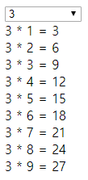


#### mouseover, mouseleave 이벤트 처리

```javascript
<!DOCTYPE html>
<html>
<head>
    <script src="/node_modules/jquery/dist/jquery.js"></script>
    <script>
        $(function() {
            // p430
            // 홀수번째 : red
            // 짝수번째 : blue
            // 첫번째 : yellow
            // 마지막 : green
            $('div:odd').css('background', 'red');
            $('div:even').css('background', 'blue');
            $('div:first').css('background', 'yellow');
            $('div:last').css('background', 'green');

            // div 태그 내부에 마우스가 들어가면 배경색을 검은색으로
            // 빠져나오면 원래 색깔로 변경
            /*
            $('div').mouseover(function() {
                console.log('진입');
            });
            $('div').mouseleave(function() {
                console.log('진출');
            });
            */
            let orgColor;
            $('div').mouseover(function() {
                orgColor = $(this).css('background');
                console.log(orgColor);
                $(this).css('background', 'black');
            }).mouseleave(function() {
                $(this).css('background', orgColor);
            });
        });
    </script>
    <style>
        div {
            width: 100px;
            height: 100px;
            border: 1px solid blue;
            float: left;
            margin: 20px;
        }
    </style>
</head>
<body>
    <div></div>
    <div></div>
    <div></div>
    <div></div>
</body>
</html>
```


* `getter` : 값을 가져오는 것. 값 이름만 들어가면 getter로 동작

* `setter` : 값을 설정하는 것. 값 이름과 값이 같이 들어가면 setter로 동작


* 파란색 div 태그 내부에 마우스가 들어간 경우

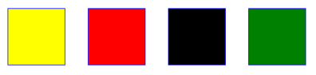

* 파란색 div 태그 내부에서 마우스가 나간 경우

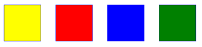


```javascript
            let orgColor;
            $('div').mouseover(function() {
                orgColor = $(this).css('background');
                console.log($(this).text());
                $(this).text('abcd');

                $(this).attr('test', 'testvalue');
                console.log($(this).attr('test'));
                
                $(this).css('background', 'black');
            }).mouseleave(function() {
                $(this).css('background', orgColor);
            });
```


p441

* `$`는 전역변수로, `jQuery`라는 단어가 저장되어있다.

* 변수로 쓸 수 있는 특수 기호는 2개밖에 없다. 언더바(_)와 달러($)

* Prototype 프레임워크에서도 식별자 $를 사용한다.

*  jQuery 프레임워크와 Prototype 프레임워크를 같이 쓰면 충돌이 날 수 있다.

* 충돌을 방지하는 방법

  ```javascript
  $.noConflict();
  var J = jQuery;
  ```

  

## jQuery UI

* https://jqueryui.com/

* 일반적으로 웹 사이트를 만들 때 사용되는 UI 기능들을 쉽게 만들 수 있도록 제공해준다.

* jQuery UI 설치

  ```bash
  C:\Users\HPE>cd /
  
  C:\>cd javascript
  
  C:\javascript>npm install jquery-ui
  npm WARN javascript@1.0.0 No description
  npm WARN javascript@1.0.0 No repository field.
  
  + jquery-ui@1.12.1
  added 1 package from 1 contributor and audited 2 packages in 1.418s
  found 0 vulnerabilities
  
  
  C:\javascript>npm install jquery-ui-css
  npm WARN javascript@1.0.0 No description
  npm WARN javascript@1.0.0 No repository field.
  
  + jquery-ui-css@1.11.5
  added 1 package from 1 contributor and audited 3 packages in 0.487s
  found 0 vulnerabilities
  ```

  

```javascript
<!DOCTYPE html>
<html>
<head>
    <script src="/node_modules/jquery/dist/jquery.js"></script>
    <script src="/node_modules/jquery-ui-css/jquery-ui.js"></script>
    <link rel="stylesheet" href="/node_modules/jquery-ui-css/jquery-ui.css">
    <script>
        $(function() {
            $("button, a").button();
        });
    </script>
    <style>
    </style>
</head>
<body>
    <button>클릭하세요.</button>
    <a href="#">클릭하세요.</a>
</body>
</html>
```


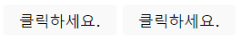


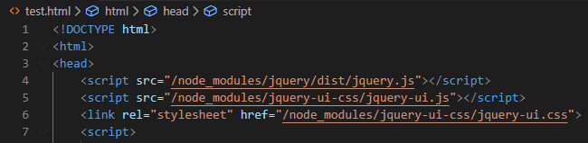

`Ctrl` + `"/node_modules/jquery-ui-css/jquery-ui.css"`링크 클릭


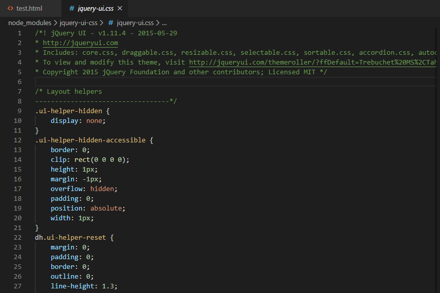


* 태마 : 스타일을 별도로 뽑아서 사용자 환경에 맞춰주는 것


```javascript
<!DOCTYPE html>
<html>
<head>
    <script src="/node_modules/jquery/dist/jquery.js"></script>
    <script>
        $(function() {
            $('div').mouseover(function() {
                $(this).attr('class', 'mycolor1');
            }).mouseleave(function() {
                $(this).attr('class', 'mycolor2');
            });
        });
    </script>
    <style>
        div { width: 100px; height: 100px; float: left; border: 1px solid red; }
        .mycolor1 { background: red; }
        .mycolor2 { background: blue; }
    </style>
</head>
<body>
    <div></div>
    <div></div>
</body>
</html>
```


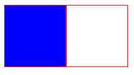


#### UI 태마 적용

https://jqueryui.com/themeroller/


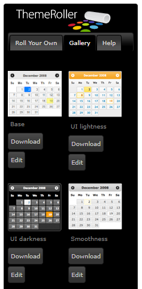

* 원하는 태마를 골라 Download 클릭

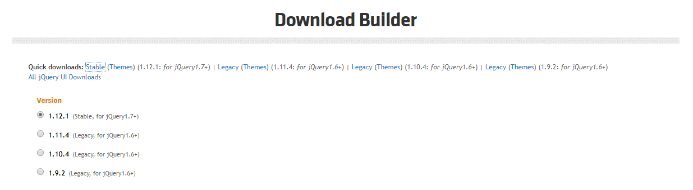

* Quick downloads -> Stable 클릭해서 Download


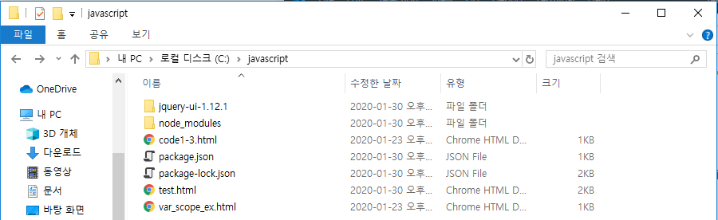

* 압축 해제 후 C:\javascript 에 다운받은 폴더 옮기기


https://jqueryui.com/themeroller/

Development -> Tabs -> view source

19~35줄 복사 -> 붙여넣기

사용하는 방법 : API Documentation 확인


```javascript
<!DOCTYPE html>
<html>
<head>
    <link rel="stylesheet" href="/jquery-ui-1.12.1/jquery-ui.css">
    <link rel="stylesheet" href="/jquery-ui-1.12.1/jquery-ui.theme.css">
    <script src="/jquery-ui-1.12.1/external/jquery/jquery.js"></script>
    <script src="/jquery-ui-1.12.1/jquery-ui.js"></script>
    <script>
        $(function() {
            $("#tabs").tabs();
        });
    </script>
    <style>        
    </style>
</head>
<body>    
    <div id="tabs">
        <ul>
          <li><a href="#matzip">맛집예약</a></li>
          <li><a href="#hospital">병원예약</a></li>
          <li><a href="#car">공유자동차예약</a></li>
        </ul>
        <div id="matzip">
          <p>맛집 예약과 관련한 컨텐츠</p>
        </div>
        <div id="hospital">
          <p>병원 예약과 관련한 컨텐츠</p>
        </div>
        <div id="car">
          <p>공유자동차 예약과 관련한 컨텐츠</p>
        </div>
    </div>
</body>
</html>
```


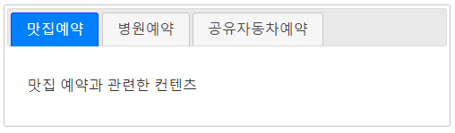


```javascript
<!DOCTYPE html>
<html>
<head>
    <link rel="stylesheet" href="/jquery-ui-1.12.1/jquery-ui.css">
    <link rel="stylesheet" href="/jquery-ui-1.12.1/jquery-ui.theme.css">
    <script src="/jquery-ui-1.12.1/external/jquery/jquery.js"></script>
    <script src="/jquery-ui-1.12.1/jquery-ui.js"></script>
    <script>
        $(function() {
            $("#tabs").tabs();
            $('input[name="userid"]').focusout(function() {
                if ($(this).val() == "") {
                    //alert("아이디를 입력하세요.");
                    $("#dialog").dialog();
                }
            })
        });
    </script>
    <style>        
    </style>
</head>
<body>    
    <div id="tabs">
        <ul>
          <li><a href="#matzip">맛집예약</a></li>
          <li><a href="#hospital">병원예약</a></li>
          <li><a href="#car">공유자동차예약</a></li>
        </ul>
        <div id="matzip">
          <p>맛집 예약과 관련한 컨텐츠</p>
        </div>
        <div id="hospital">
          <p>병원 예약과 관련한 컨텐츠</p>
        </div>
        <div id="car">
          <p>공유자동차 예약과 관련한 컨텐츠</p>
        </div>
    </div>

    <label>아이디</label>
    <input type="text" name="userid" />

    <div id="dialog" title="알림">
        <p>아이디를 입력하지 않았습니다.</p>
    </div>
</body>
</html>
```


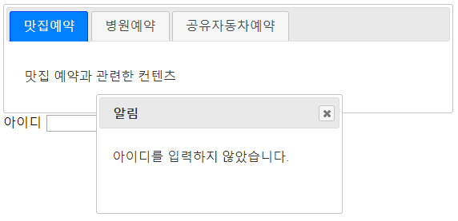


* 포커스는 윈도우 전체에서 단 한곳만 입력받을 수 있다.


#### toast.js 적용

https://github.com/kamranahmedse/jquery-toast-plugin/


```bash
C:\javascript>npm install jquery-toast-plugin
npm WARN javascript@1.0.0 No description
npm WARN javascript@1.0.0 No repository field.

+ jquery-toast-plugin@1.3.2
added 1 package and audited 4 packages in 0.483s
found 0 vulnerabilities
```


```javascript
<!DOCTYPE html>
<html>
<head>
    <script src="/jquery-ui-1.12.1/external/jquery/jquery.js"></script>
    <script src="/jquery-ui-1.12.1/jquery-ui.js"></script>
    <link rel="stylesheet" href="/jquery-ui-1.12.1/jquery-ui.css">
    <link rel="stylesheet" href="/jquery-ui-1.12.1/jquery-ui.theme.css">

    <script src="node_modules/jquery-toast-plugin/dist/jquery.toast.min.js"></script>
    <link rel="stylesheet" href="node_modules/jquery-toast-plugin/dist/jquery.toast.min.css">
    <script>
        $(function() {
            $("#tabs").tabs();
            $('input[name="userid"]').focusout(function() {
                if ($(this).val() == "") {
                    //$("#dialog").dialog();
                    $.toast({
                        text: "아이디를 입력하세요.",
                        showHideTransition: 'fade',
                        bgColor : '#E01A31'
                    });
                }
            })
        });
    </script>
    <style>        
    </style>
</head>
<body>    
    <div id="tabs">
        <ul>
          <li><a href="#matzip">맛집예약</a></li>
          <li><a href="#hospital">병원예약</a></li>
          <li><a href="#car">공유자동차예약</a></li>
        </ul>
        <div id="matzip">
          <p>맛집 예약과 관련한 컨텐츠</p>
        </div>
        <div id="hospital">
          <p>병원 예약과 관련한 컨텐츠</p>
        </div>
        <div id="car">
          <p>공유자동차 예약과 관련한 컨텐츠</p>
        </div>
    </div>

    <label>아이디</label>
    <input type="text" name="userid" />
</body>
</html>
```


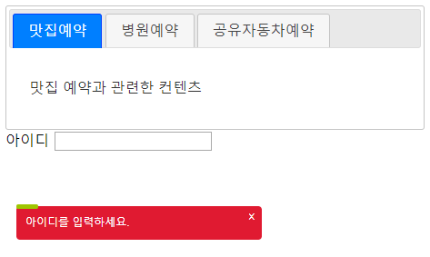


#### Colorbox 플러그인 사용

p588

https://www.jacklmoore.com/colorbox/


```bash
C:\javascript>npm install jquery-colorbox
npm WARN javascript@1.0.0 No description
npm WARN javascript@1.0.0 No repository field.

+ jquery-colorbox@1.6.4
added 1 package from 1 contributor and audited 6 packages in 0.597s
found 0 vulnerabilities
```


```javascript
<!DOCTYPE html>
<html>
<head>
    <link rel="stylesheet" href="/jquery-ui-1.12.1/jquery-ui.css">
    <script src="/jquery-ui-1.12.1/external/jquery/jquery.js"></script>
    <script src="/jquery-ui-1.12.1/jquery-ui.js"></script>

    <link rel="stylesheet" href="node_modules/jquery-colorbox/example1/colorbox.css">
    <script src="node_modules/jquery-colorbox/jquery.colorbox.js"></script>

    <script>
        $(function() {
            $('a').colorbox();
        });
    </script>
    <style>        
    </style>
</head>
<body>
    <a href="node_modules/jquery-colorbox/content/daisy.jpg">데이지</a>
    <a href="node_modules/jquery-colorbox/content/homer.jpg">호머</a>
</body>
</html>
```


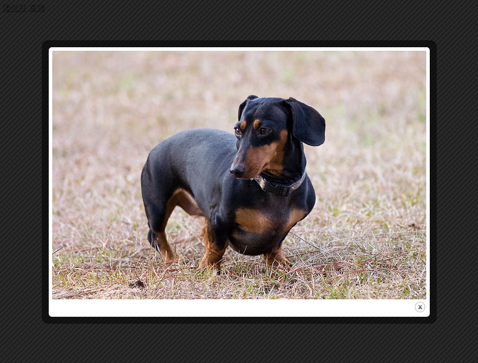

* 다른 페이지로 넘어가지 않고 같은 페이지에서 팝업창 형식으로 이미지를 보여준다.

* 해당하는 이미지를 colorbox를 이용해서 보여준다.


## Ajax


* 기존의 방식
  * 브라우저에서 링크를 누르거나 주소를 치면 서버에서는 새로운 문서 전체를 보내준다.
  * 페이지를 나눠서 보여주는 방식
* Ajax 방식
  * 기존 화면이 유지되면서 새로운 것들을 서버로부터 받아오는 방법. 사용자가 보는 화면은 계속 유지가 되는것이고, 필요하다면 서버에서 필요한 것들을 받아와 보여주는 형식.
  * javascript를 이용한 비동기 통신방식
  * 문서가 오는 것이 아니라 화면에 보여줄 데이터만 받으면 된다.
  * 대부분 JSON 형태로 온다.
  * 데이터를 넣어주는 방식이 있어야 하는데, 그 방식이 DOM Script이다.


* CSV 형식

  * 데이터를 콤마(,)를 기준으로 구분한다.
  * 데이터의 의미를 구분하기 힘들다.
  * 콤마가 한번 깨지면 전체 데이터가 다 깨진다.

* XML 형식

  * 데이터를 XML 형태로 나타낸다.

  * XML은 태그를 가지고 나타낸다.

  * 순서가 바껴도 된다.

  * 사람이 봤을 때에도 어떤 의미인지 알기 쉽다.

    ```xml
    <note>
       <to>Tove</to>
       <from>Jani</from>
       <heading>Reminder</heading>
       <body>Don't forget me this weekend!</body>
    </note>
    ```

  * 데이터 구조 안정적

  * 복잡해보인다.

  * 태그가 교차되면 안되고 포함관계를 지켜야하는 등 규칙이 있는데 사람이 하기에는 번거롭다.

* JSON 형식

  * CSV 형식과 XML 형식의 단점을 모두 극복한 형식

  * 자바스크립트에서 사용하는 객체 형태로 데이터를 표현하는 방법

  * 태그보다는 기호를 사용하기 때문에 사람이 작성하기에도 편하다.

  * 객체, 배열, 문자열, 숫자, 불, null만 들어갈 수 있다.

  * 문자열은 무조건 큰따옴표를 사용해야 한다.

  * 가독성이 좋고 XML보다 적은 용량으로 데이터 전달 가능

    ```json
    {"menu": {
      "id": "file",
      "value": "File",
      "popup": {
        "menuitem": [
          {"value": "New", "onclick": "CreateNewDoc()"},
          {"value": "Open", "onclick": "OpenDoc()"},
          {"value": "Close", "onclick": "CloseDoc()"}
        ]
      }
    }}
    ```

    

#### 브라우저에서 요청

C:\javascript 폴더에 students.json 파일 생성 (visual studio code에서 new file)

```json
{
    "students":
        [
            { "name": "홍길동", "age": 23, "score": "A+" },
            { "name": "길동홍", "age": 32, "score": "B+" },
            { "name": "동홍길", "age": 43, "score": "C+" }
        ]
}
```


```URL
http://localhost:8080/students.json
```


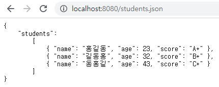


#### javascript로 요청

https://api.jquery.com/jQuery.ajax/


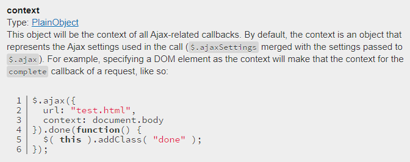


```javascript
<!DOCTYPE html>
<html>
<head>
    <script src="node_modules/jquery/dist/jquery.js"></script>
    <script>
        $(function() {
            $.ajax({
                url: "http://localhost:8080/students.json",
                //data: { userid: "aaa", userpw: "bbb" },
                type: "GET",
                dataType: "json"             
            })
            .done(function(res) {
                console.log(res);
                console.log(res.students);
                res.students.forEach(element => {
                    console.log(element);
                });
            });
        });
    </script>
    <style>        
    </style>
</head>
<body>
    
</body>
</html>
```


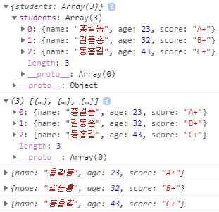


```javascript
<!DOCTYPE html>
<html>
<head>
    <script src="node_modules/jquery/dist/jquery.js"></script>
    <script>
        $(function() {
            $('button').click(function() {
                $.ajax({
                    url: "http://localhost:8080/students.json",
                    //data: { userid: "aaa", userpw: "bbb" },
                    type: "GET",
                    dataType: "json"             
                })
                .done(function(res) {
                    console.log(res);
                    console.log(res.students);
                    res.students.forEach(student => {
                        console.log(student);
                        console.log(student.name, student.age, student.score);
                        let x = `
                            <tr>
                                <td>${student.name}</td>
                                <td>${student.age}</td>
                                <td>${student.score}</td>
                            </tr>
                        `;
                        $('table').html($('table').html() + x);
                    });
                });
            });
        });
    </script>
    <style>        
    </style>
</head>
<body>
    <button>가져오기</button>
    <table border="1">
    </table>
</body>
</html>
```


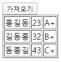


가져오기 버튼을 누르면 비동기적으로 데이터를 받아와 화면에 출력한다.

