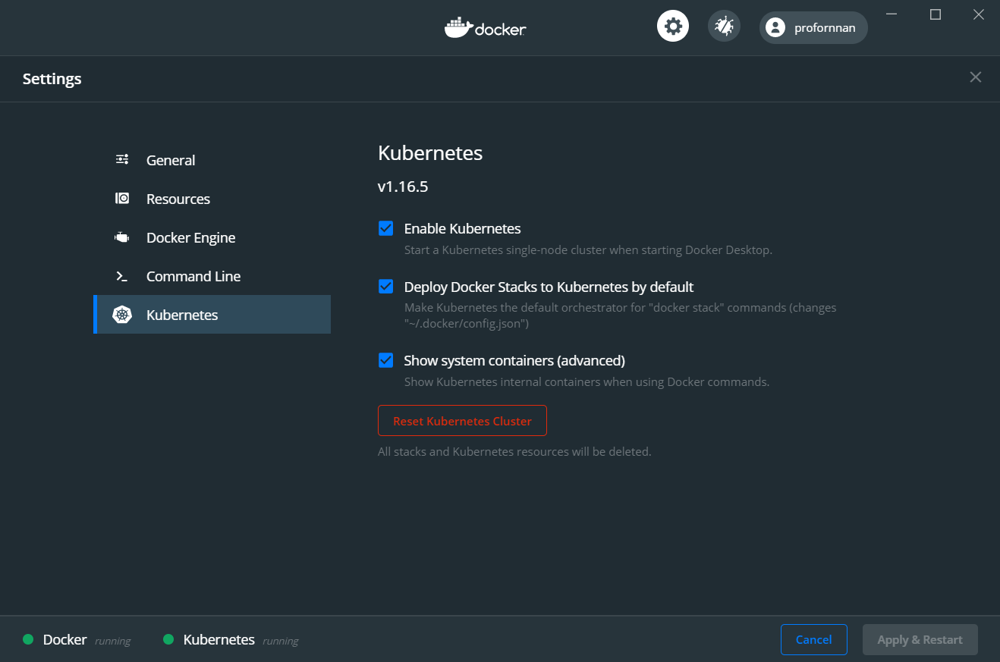
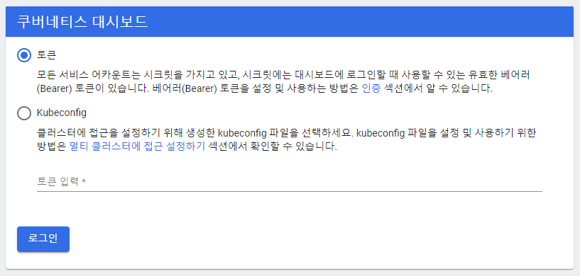
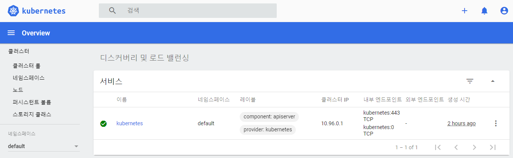
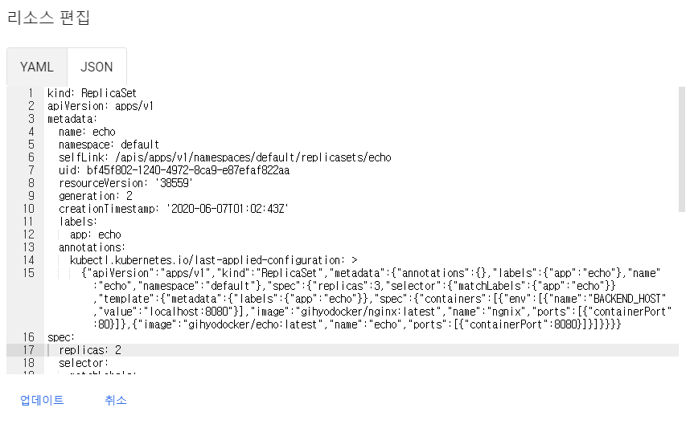

# 01. 쿠버네티스 입문

## 쿠버네티스란 무엇인가

* 쿠버네티스는 컨테이너 운영을 자동화하기 위한 컨테이너 오케스트레이션 도구로, 구글의 주도로 개발됐다.
* 많은 수의 컨테이너를 협조적으로 연동시키기 위한 통합 시스템이다.
* 컨테이너를 다루기 위한 API 및 명령행 도구등이 함께 제공된다.
* 컨테이너를 이용한 애플리케이션 배포 외에도 다양한 운영 관리 업무를 자동화 할 수 있다.
* 도커 호스트 관리, 서버 리소스의 여유를 고려한 컨테이너 배치, 스케일링, 여러 개의 컨테이너 그룹에 대한 로드 밸런싱, 헬스 체크 등의 기능을 갖추고 있다.
* 다양한 부품을 조합해 유연한 애플리케이션을 구축할 수 있다.


### 쿠버네티스의 역할

* 도커는 컨테이너를 관리하는 데몬인 dockerd와 명령행 도구로 구성된다.
* 스웜은 여러 대의 호스트를 묶어서 기초적인 컨테이너 오케스트레이션 기능을 제공하는 도커 관련 기술이다.
* 쿠버네티스는 스웜보다 충실한 기능을 갖춘 컨테이너 오케스트레이션 시스템이자 도커를 비롯해 여러 가지 컨테이너 런타임을 다룰 수 있다.
* 쿠버네티스는 컴포즈/스택/스웜의 기능을 통합해 더 높은 수준의 관리 기능을 제공하는 도구이다.


## 로컬 PC에서 쿠버네티스 실행

### 윈도우용 도커에 쿠버네티스 설치하기

* 이전에는 로컬 환경에서 쿠버네티스 환경을 구축하기 위해 Minikube를 많이 사용했지만, 윈도우용 도커의 쿠버네티스 연동 기능을 이용하면 기존에 로컬에 설치된 도커 환경에서도 쿠버네티스 환경을 구축할 수 있다.


#### 쿠버네티스 연동 설정

* 바탕화면의 트레이에서 도커 아이콘 오른쪽클릭 => 'Settings'




#### kubectl 설치

* kubectl은 쿠버네티스를 다루기 위한 명령행 도구다.
* https://storage.googleapis.com/kubernetes-release/release/v1.17.0/bin/windows/amd64/kubectl.exe 파일을 다운로드 하고, 파일의 경로를 PATH에 추가한다.


```bash
C:\Users\TTak>kubectl version
Client Version: version.Info{Major:"1", Minor:"16+", GitVersion:"v1.16.6-beta.0", GitCommit:"e7f962ba86f4ce7033828210ca3556393c377bcc", GitTreeState:"clean", BuildDate:"2020-01-15T08:26:26Z", GoVersion:"go1.13.5", Compiler:"gc", Platform:"windows/amd64"}
Server Version: version.Info{Major:"1", Minor:"16+", GitVersion:"v1.16.6-beta.0", GitCommit:"e7f962ba86f4ce7033828210ca3556393c377bcc", GitTreeState:"clean", BuildDate:"2020-01-15T08:18:29Z", GoVersion:"go1.13.5", Compiler:"gc", Platform:"linux/amd64"}
```

버전 확인


#### 대시보드 설치

* 대시보드는 쿠버네티스에 배포된 컨테이너 등에 대한 정보를 한눈에 보여주는 관리 도구다.
* kubectl을 이용해 설치


```powershell
PS C:\Users\TTak> kubectl apply -f https://raw.githubusercontent.com/kubernetes/dashboard/v2.0.0/aio/deploy/recommended.yaml
namespace/kubernetes-dashboard created
serviceaccount/kubernetes-dashboard created
service/kubernetes-dashboard created
secret/kubernetes-dashboard-certs created
secret/kubernetes-dashboard-csrf created
secret/kubernetes-dashboard-key-holder created
configmap/kubernetes-dashboard-settings created
role.rbac.authorization.k8s.io/kubernetes-dashboard created
clusterrole.rbac.authorization.k8s.io/kubernetes-dashboard created
rolebinding.rbac.authorization.k8s.io/kubernetes-dashboard created
clusterrolebinding.rbac.authorization.k8s.io/kubernetes-dashboard created
deployment.apps/kubernetes-dashboard created
service/dashboard-metrics-scraper created
deployment.apps/dashboard-metrics-scraper created
```


```powershell
PS C:\Users\TTak> kubectl get pod --namespace=kubernetes-dashboard -l k8s-app=kubernetes-dashboard
NAME                                   READY   STATUS    RESTARTS   AGE
kubernetes-dashboard-56484d4c5-2n9x4   1/1     Running   0          4m52s
```


```powershell
PS C:\Users\TTak> kubectl proxy
Starting to serve on 127.0.0.1:8001
```


http://localhost:8001/api/v1/namespaces/kubernetes-dashboard/services/https:kubernetes-dashboard:/proxy/





```powershell
PS C:\Users\TTak> kubectl get secrets
NAME                  TYPE                                  DATA   AGE
default-token-22b7n   kubernetes.io/service-account-token   3      151m
```


```powershell
PS C:\Users\TTak> kubectl describe secrets default-token-22b7n
```


여기서 확인한 token 정보를 이용해 로그인





## 쿠버네티스의 주요 개념

* 쿠버네티스로 실행하는 애플리케이션은 애플리케이션을 구성하는 다양한 리소스가 함께 연동해 동작한다.
* 쿠버네티스의 리소스란 애플리케이션을 구성하는 부품과 같은 것으로 노드, 네임스페이스, 파드 등을 가리킨다.
* 컨테이너와 리소스는 구성 요소로서의 수준이 다르다.


| 리소스               | 용도                                                         |
| -------------------- | ------------------------------------------------------------ |
| 노드                 | 컨테이너가 배치되는 서버                                     |
| 네임스페이스         | 쿠버네티스 클러스터 안의 가상 클러스터                       |
| 파드                 | 컨테이너의 집합 중 가장 작은 단위로, 컨테이너의 실행 방법을 정의한다. |
| 레플리카세트         | 같은 스펙을 갖는 파드를 여러 개 생성하고 관리하는 역할을 한다. |
| 디플로이먼트         | 레플리카 세트의 리비전을 관리한다.                           |
| 서비스               | 파드의 집합에 접근하기 위한 경로를 정의한다.                 |
| 인그레스             | 서비스를 쿠버네티스 클러스터 외부로 노출시킨다.              |
| 컨피그맵             | 설정 정보를 정의하고 파드에 전달한다.                        |
| 퍼시스턴트볼륨       | 파드가 사용할 스토리지의 크기 및 종류를 정의                 |
| 퍼시스턴트볼륨클레임 | 퍼시스턴트 볼륨을 동적으로 확보                              |
| 스토리지클래스       | 퍼시스턴트 볼륨이 확보하는 스토리지의 종류를 정의            |
| 스테이트풀세트       | 같은 스펙으로 모두 동일한 파드를 여러 개 생성하고 관리한다.  |
| 잡                   | 상주 실행을 목적으로 하지 않는 파드를 여러 개 생성하고 정상적인 종료를 보장한다. |
| 크론잡               | 크론 문법으로 스케줄링되는 잡                                |
| 시크릿               | 인증 정보 같은 기밀 데이터를 정의한다.                       |
| 롤                   | 네임스페이스 안에서 조작 가능한 쿠버네티스 리소스의 규칙을 정의한다. |
| 롤바인딩             | 쿠버네티스 리소스 사용자와 롤을 연결 짓는다.                 |
| 클러스터롤           | 클러스터 전체적으로 조작 가능한 쿠버네티스 리소스의 규직을 정의한다. |
| 클러스터롤바인딩     | 쿠버네티스 리소스 사용자와 클러스터롤을 연결 짓는다.         |
| 서비스 계정          | 파드가 쿠버네티스 리소스를 조작할 때 사용하는 계정           |


## 쿠버네티스 클러스터와 노드

* 쿠버네티스 클러스터는 쿠버네티스의 여러 리소스를 관리하기 위한 집합체를 말한다.
* 쿠버네티스 리소스 중에서 가장 큰 개념은 노드(node)다.
* 노드는 쿠버네티스 클러스터의 관리 대상으로 등록된 도커 호스트로, 컨테이너가 배치되는 대상이다.
* 쿠버네티스 클러스터 전체를 관리하는 서버인 마스터가 적어도 하나 이상 있어야 한다.
* 쿠버네티스는 마스터와 노드의 그룹으로 구성된다.


* 쿠버네티스는 노드의 리소스 사용 현황 및 배치 전략을 근거로 컨테이너를 적절하게 배치한다.
* 클러스터의 처리 능력은 노드에 의해 결정된다.


로컬 환경에 설치한 쿠버네티스에는 클러스터를 생성할 때 만든 가상 머신이 노드로 등록되어 있다.

kubectl get nodes 명령으로 현재 클러스터에 소속된 노드의 목록을 확인할 수 있다.

```powershell
PS C:\Users\TTak> kubectl get nodes
NAME             STATUS   ROLES    AGE     VERSION
docker-desktop   Ready    master   3h45m   v1.16.6-beta.0
```


### 마스터를 구성하는 관리 컴포넌트

| 컴포넌트명              | 역할                                                         |
| ----------------------- | ------------------------------------------------------------ |
| kube-apiserver          | 쿠버네티스 API를 노출하는 컴포넌트. kubectl로부터 리소스를 조작하라는 지시를 받는다. |
| etcd                    | 고가용성을 갖춘 분산 키-값 스토어. 쿠버네티스 클러스터의 백킹 스토어로 쓰인다. |
| kube-scheduler          | 노드를 모니터링하고 컨테이너를 배치할 적절한 노드를 선택한다. |
| kube-controller-manager | 리소스를 제어하는 컨트롤러를 실행한다.                       |


## 네임스페이스

* 쿠버네티스는 클러스터 안에 가상 클러스터를 또 다시 만들 수 있다.
* 클러스터 안의 가상 클러스터를 네임스페이스(namespace)라고 한다.
* 클러스터를 처음 구축하면 default, docker, kube-public, kube-system의 네임스페이스 4개가 이미 만들어져 있다.


현재 클러스터 안에 존재하는 네임스페이스 목록 확인

```powershell
PS C:\Users\TTak> kubectl get namespace
NAME                   STATUS   AGE
default                Active   4h23m
docker                 Active   4h21m
kube-node-lease        Active   4h23m
kube-public            Active   4h23m
kube-system            Active   4h23m
kubernetes-dashboard   Active   122m
```


* 네임스페이스마다 권한을 설정할 수 있다.


## 파드

* 파드(pod)는 컨테이너가 모인 집합체의 단위로, 적어도 하나 이상의 컨테이너로 이루어진다.
* 쿠버네티스를 도커와 함께 사용한다면 파드는 컨테이너 하나 혹은 컨테이너의 집합체가 된다.
* 쿠버네티스에서는 결합이 강한 컨테이너를 파드로 묶어서 일괄 배포한다.
* 컨테이너가 하나인 경우에도 파드로 배포한다.
* 같은 파드를 여러  노드에 배치할 수도 있고 한 노드에 여러 개 배치할 수도 있다.
* 한 파드 안의 컨테이너는 모두 같은 노드에 배치해야 한다.
* 파드 하나가 여러 노드에 걸쳐 배치될 수는 없다.
* 도커 스웜에서는 매니저 노드가 스웜 클러스터 전체를 제어하는 역할을 했다. 쿠버네티스에서는 관리용 서버인 마스터가 그 역할을 담당한다.


### 파드 생성 및 배포하기

* 파드 생성은 kubectl만 사용해도 가능하지만, 버전 관리 관점에서도 yaml 파일로 정의하는 것이 좋다.
* 쿠버네티스의 여러 가지 리소스를 정의하는 파일을 매니페스트 파일이라고 한다.


nginx와 echo 두 컨테이너로 구성되는 파드를 정의한 매니페스트 파일을 simple-pod.yml 이라는 이름으로 작성

simple-pod.yml

```yaml
apiVersion: v1
kind: Pod
metadata:
  name: simple-echo
spec:
  containers:
  - name: nginx
    image: gihyodocker/nginx:latest
    env:
    - name: BACKEND_HOST
      value: localhost:8080
    ports:
    - containerPort: 80
  - name: echo
    image: gihyodocker/echo:latest
    ports:
    - containerPort: 8080
```


* kind
  * 파일에서 정의하는 쿠버네티스 리소스의 유형을 지정하는 속성
  * 파드를 정의하는 파일이므로 속성값이 Pod다.
  * kind의 속성값에 따라 spec 아래의 스키마가 변화한다.
* metadata
  * 리소스에 부여되는 메타데이터
  * metadata.name 속성의 값이 이 리소스의 이름이 된다.
* spec
  * 리소스를 정의하기 위한 속성
  * 파드의 경우 파드를 구성하는 컨테이너를 containers 아래에 정의한다.

* containers 속성 아래 속성
  * name
    * 컨테이너 이름
  * image
    * 도커 허브에 저장된 이미지 태그값을 지정
    * 로컬에서 빌드한 이미지를 지정할 수도 있다.
  * ports
    * 컨테이너가 노출시킬 포트를 지정한다.
  * env
    * 환경 변수를 열거할 수 있다.


```powershell
PS C:\Work\docker> kubectl apply -f .\simple-pod.yml
pod/simple-echo created
```

파드를 로컬 쿠버네티스 클러스터에 배포

kubectl에서 -f 옵션으로 매니페스트 파일에 대한 경로를 지정하고 apply 명령을 사용한다.


### 파드 다루기

* 파드의 상태는 목록에서 확인할 수 있다.
* STATUS 칼럼이 Running이면 파드 안의 모든 컨테이너가 실행 중이라는 의미다.
* READY 칼럼값의 분모는 파드에 정의된 컨테이너의 수이고 분자는 실행 상태의 컨테이너 수이다.


```powershell
PS C:\Work\docker> kubectl get pod
NAME          READY   STATUS    RESTARTS   AGE
simple-echo   2/2     Running   0          14m
```


* kubectl을 사용해 컨테이너 안에 접근할 수도 있다.
* kubectl exec 명령을 실행한다.
* 파드 안의 컨테이너가 여러 개인 경우에는 -c 옵션에 컨테이너 명을 지정한다.


```powershell
PS C:\Work\docker> kubectl exec -it simple-echo sh -c nginx
#
```


* kubectl log 명령으로 파드 안에 있는 컨테이너의 표준 출력을 화면에 출력할 수 있다.
* -c 옵션으로 컨테이너명을 지정한다.


```powershell
PS C:\Work\docker> kubectl logs -f simple-echo -c echo
2020/06/06 23:03:19 start server
```


* 파드를 삭제하려면 kubectl delete pod 명령을 사용한다.
* kubectl delete 명령은 파드 외의 리소스에도 유효하다.
* 사용이 끝난 리소스를 삭제할 때 이 명령어를 사용


```powershell
PS C:\Work\docker> kubectl delete pod simple-echo
pod "simple-echo" deleted
```


* 매니페스트 파일로 파드를 삭제할 수도 있다.
* 이 방법을 사용하면 매니페스트에 작성된 리소스 전체가 삭제된다.


```powershell
PS C:\Work\docker> kubectl delete -f .\simple-pod.yml
pod "simple-echo" deleted
```


## 레플리카세트

* 파드를 정의한 매니페스트 파일로는 파드를 하나밖에 생성할 수 없다.
* 같은 파드를 여러 개 실행해 가용성을 확보해야 하는 경우가 생긴다.
* 이런 경우에 사용하는 것이 레플리카세트(ReplicaSet)다.
* 레플리카세트는 똑같은 정의를 갖는 파드를 여러 개 생성하고 관리하기 위한 리소스다.
* 파드의 정의 자체도 레플리카세트를 정의한 yaml 파일에 작성하므로 파드의 설정 파일을 따로 둘 필요 없이 파일 하나로 정의 가능


simple-replicaset.yml

```yaml
apiVersion: apps/v1
kind: ReplicaSet
metadata:
  name: echo
  labels:
    app: echo
spec:
  replicas: 3
  selector:
    matchLabels:
      app: echo
  template:
    metadata:
      labels:
        app: echo
    spec:
      containers:
      - name: ngnix
        image: gihyodocker/nginx:latest
        env:
        - name: BACKEND_HOST
          value: localhost:8080
        ports:
        - containerPort: 80
      - name: echo
        image: gihyodocker/echo:latest
        ports:
        - containerPort: 8080
```


* replicas
  * 레플리카세트에서 만들 파드의 복제본 수를 의미한다.
* template
  * 파드의 정의와 같다.
  * 레플리카세트는 이 정의를 따라 파드를 replicas에서 지정한 수만큼 만들어 파드 정의 및 파드 복제를 모두 수행한다.


```powershell
PS C:\Work\docker> kubectl apply -f .\simple-replicaset.yml
replicaset.apps/echo created
```


```powershell
PS C:\Work\docker> kubectl get pod
NAME         READY   STATUS    RESTARTS   AGE
echo-2z8pj   2/2     Running   0          98s
echo-bz5ft   2/2     Running   0          98s
echo-gh54l   2/2     Running   0          98s
```


* 레플리카세트를 배포하면 파드가 3개 만들어진 것을 확인할 수 있다.
* 같은 파드가 여러 개 복제된 것이므로 파드명에 무작위로 생성된 접미사가 붙는다.
* 레플리카세트를 조작해 파드의 수를 줄이면 줄인 개수만큼 파드가 삭제된다.


http://localhost:8001/api/v1/namespaces/kubernetes-dashboard/services/https:kubernetes-dashboard:/proxy/


레플리카 셋 => echo => 리소스 편집 => replicas를 2로 수정




```powershell
PS C:\Work\docker> kubectl get pod
NAME         READY   STATUS    RESTARTS   AGE
echo-2z8pj   2/2     Running   0          13m
echo-gh54l   2/2     Running   0          13m
```


* 생성한 레플리카세트를 매니페스트 파일을 이용해 삭제


```powershell
PS C:\Work\docker> kubectl delete -f .\simple-replicaset.yml
replicaset.apps "echo" deleted
```


## 디플로이먼트

* 레플리카세트보다 상위에 해당하는 리소스
* 디플로이먼트(deployment)는 애플리케이션 배포(deploy)의 기본 단위가 되는 리소스다.
* 레플리카세트는 똑같은 파드의 레플리케이션 개수를 관리 및 제어하는 리소스인데 비해, 디플로이먼트는 레플리카세트를 관리하고 다루기 위한 리소스다.


simple-deployment.yml

```yaml
apiVersion: apps/v1
kind: Deployment
metadata:
  name: echo
  labels:
    app: echo
spec:
  replicas: 3
  selector:
    matchLabels:
      app: echo
  template:
    metadata:
      labels:
        app: echo
    spec:
      containers:
      - name: nginx
        image: gihyodocker/nginx:latest
        env:
        - name: BACKEND_HOST
          value: localhost:8080
        ports:
        - containerPort: 80
      - name: echo
        image: gihyodocker/echo:latest
        ports:
        - containerPort: 8080
```


* 디플로이먼트의 정의는 레플리카세트의 정의와 크게 다르지 않다.
* 디플로이먼트가 레플리카세트의 리비전 관리를 할 수 있다는 차이점이 있다.
* 매니페스트 파일을 어떤 kubectl 명령을 실행했는지 기록을 남기는 옵션인 --record를 붙여 kubectl로 클러스터에 반영한다.


```powershell
PS C:\Work\docker> kubectl apply -f .\simple-deployment.yml --record
deployment.apps/echo created
```


* 디플로이먼트, 레플리카세트, 파드가 생성된 것을 확인할 수 있다.


```powershell
PS C:\Work\docker> kubectl get pod,replicaset,deployment --selector app=echo
NAME                        READY   STATUS    RESTARTS   AGE
pod/echo-59dfb6bdf7-qkth6   2/2     Running   0          14m
pod/echo-59dfb6bdf7-t67rv   2/2     Running   0          14m
pod/echo-59dfb6bdf7-xvxqq   2/2     Running   0          14m

NAME                              DESIRED   CURRENT   READY   AGE
replicaset.apps/echo-59dfb6bdf7   3         3         3       14m

NAME                   READY   UP-TO-DATE   AVAILABLE   AGE
deployment.apps/echo   3/3     3            3           14m
```


* 디플로이먼트의 리비전은 kubectl rollout history 명령으로 확인할 수 있다.
* 현재는 첫번째 반영이므로 REVISION=1 이다.


```powershell
PS C:\Work\docker> kubectl rollout history deployment echo
deployment.apps/echo
REVISION  CHANGE-CAUSE
1         kubectl.exe apply --filename=.\simple-deployment.yml --record=true
```


### 레플리카세트의 생애주기

* 쿠버네티스는 디플로이먼트를 단위로 애플리케이션을 배포한다.
* 실제 운영에서는 레플리카세트를 직접 다루기보다는 디플로이먼트 매니페스트 파일을 통해 다루는 경우가 대부분이다.
* 디플로이먼트가 관리하는 레플리카세트는 지정된 개수만큼 파드를 확보하거나 파드를 새로운 버전으로 교체하거나 이전 버전으로 롤백하는 등 중요한 역할을 한다.
* 디플로이먼트를 수정하면 레플리카세트가 새로 생성되고 기존 레플리카세트와 교체된다.


#### 파드 개수만 수정하면 레플리카세트가 새로 생성되지 않음

* 매니페스트 파일에서 replicas 값을 3에서 4로 수정 후 반영


```powershell
PS C:\Work\docker> kubectl apply -f .\simple-deployment.yml
deployment.apps/echo configured
```


* 원래 있던 파드는 그대로 있고, 컨테이너가 하나 새로 생성된 것을 알 수 있다.


```powershell
PS C:\Work\docker> kubectl get pod
NAME                    READY   STATUS    RESTARTS   AGE
echo-59dfb6bdf7-lch8m   2/2     Running   0          79s
echo-59dfb6bdf7-qkth6   2/2     Running   0          113m
echo-59dfb6bdf7-t67rv   2/2     Running   0          113m
echo-59dfb6bdf7-xvxqq   2/2     Running   0          113m
```


* replicas 값만 변경해서는 레플리카세트의 교체가 일어나지 않는다.


```powershell
PS C:\Work\docker> kubectl rollout history deployment echo
deployment.apps/echo
REVISION  CHANGE-CAUSE
1         kubectl.exe apply --filename=.\simple-deployment.yml --record=true
```


#### 컨테이너 정의 수정

* 컨테이너 이미지가 수정된 경우


simple-deployment.yml

```yaml
		:
      - name: echo
        image: gihyodocker/echo:patched
        ports:
        - containerPort: 8080
```


```powershell
PS C:\Work\docker> kubectl apply -f simple-deployment.yml --record
deployment.apps/echo configured
```


* 새로운 파드가 생성되고 기존 파드는 단계적으로 정지된다.


```powershell
PS C:\Work\docker> kubectl get pod
NAME                    READY   STATUS        RESTARTS   AGE
echo-59dfb6bdf7-qkth6   0/2     Terminating   0          119m
echo-59dfb6bdf7-t67rv   2/2     Terminating   0          119m
echo-59dfb6bdf7-xvxqq   2/2     Terminating   0          119m
echo-6c77cf9d47-54rgm   2/2     Running       0          31s
echo-6c77cf9d47-6jnj6   2/2     Running       0          46s
echo-6c77cf9d47-9rt8x   2/2     Running       0          46s
echo-6c77cf9d47-sthmb   2/2     Running       0          34s
```


* 디플로이먼트의 리비전 확인 => REVISION = 2
* kubectl apply를 실행했을 때 디플로이먼트의 내용이 변경된 경우 새로운 리비전이 생성된다.


```powershell
PS C:\Work\docker> kubectl rollout history deployment echo
deployment.apps/echo
REVISION  CHANGE-CAUSE
1         kubectl.exe apply --filename=.\simple-deployment.yml --record=true
2         kubectl.exe apply --filename=simple-deployment.yml --record=true
```


### 롤백 실행하기

* 디플로이먼트는 리비전 번호가 기록되므로 특정 리비전의 내용을 확인할 수 있다.


```powershell
PS C:\Work\docker> kubectl rollout history deployment echo --revision=1
deployment.apps/echo with revision #1
Pod Template:
  Labels:       app=echo
        pod-template-hash=59dfb6bdf7
  Annotations:  kubernetes.io/change-cause: kubectl.exe apply --filename=.\simple-deployment.yml --record=true
  Containers:
   nginx:
    Image:      gihyodocker/nginx:latest
    Port:       80/TCP
    Host Port:  0/TCP
    Environment:
      BACKEND_HOST:     localhost:8080
    Mounts:     <none>
   echo:
    Image:      gihyodocker/echo:latest
    Port:       8080/TCP
    Host Port:  0/TCP
    Environment:        <none>
    Mounts:     <none>
  Volumes:      <none>
```


* undo를 실행하면 디플로이먼트가 바로 직전 리비전으로 롤백된다.


```powershell
PS C:\Work\docker> kubectl rollout undo deployment echo
deployment.apps/echo rolled back
```


* 롤백 기능 덕분에 최신 디플로이먼트에 문제가 있을 경우 곧바로 이전 버전으로 돌아갈 수 있다.
* 애플리케이션의 이전 버전의 동작을 확인하려는 경우에도 활용할 수 있다.


```powershell
PS C:\Work\docker> kubectl delete -f .\simple-deployment.yml
deployment.apps "echo" deleted
```


* 매니페스트 파일을 이용해서 디플로이먼트 삭제
* 디플로이먼트 및 관련된 레플리카세트와 파드가 함께 삭제된다.


## 서비스

* 서비스는 쿠버네티스 클러스터 안에서 파드의 집합(주로 레플리카세트)에 대한 경로나 서비스 디스커버리를 제공하는 리소스다.
* 서비스의 대상이 되는 파드는 서비스에서 정의하는 레이블 셀렉터로 정해진다.


simple-replicaset-with-label.yml

```yaml
apiVersion: apps/v1
kind: ReplicaSet
metadata:
  name: echo-spring
  labels:
    app: echo
    release: spring
spec:
  replicas: 1
  selector:
    matchLabels:
      app: echo
      release: spring
  template:
    metadata:
      labels:
        app: echo
        release: spring
    spec:
      containers:
      - name: nginx
        image: gihyodocker/nginx:latest
        env:
        - name: BACKEND_HOST
          value: localhost:8080
        ports:
        - containerPort: 80
      - name: echo
        image: gihyodocker/echo:latest
        ports:
        - containerPort: 8080
---
apiVersion: apps/v1
kind: ReplicaSet
metadata:
  name: echo-summer
  labels:
    app: echo
    release: summer
spec:
  replicas: 2
  selector:
    matchLabels:
      app: echo
      release: summer
  template:
    metadata:
      labels:
        app: echo
        release: summer
    spec:
      containers:
      - name: nginx
        image: gihyodocker/nginx:latest
        env:
        - name: BACKEND_HOST
          value: localhost:8080
        ports:
        - containerPort: 80
      - name: echo
        image: gihyodocker/echo:latest
        ports:
        - containerPort: 8080
```

* 레플리카세트를 2개 정의
* 내용은 앞서 정의했던 echo 레플리카세트와 거의 같으나, release 속성값 spring과 summer로 나뉜다.


```powershell
PS C:\Work\docker> kubectl apply -f .\simple-replicaset-with-label.yml
replicaset.apps/echo-spring created
replicaset.apps/echo-summer created
```


* release 레이블이 spring과 summer인 파드가 각각 실행 중임을 알 수 있다.


```powershell
PS C:\Work\docker> kubectl get pod -l app=echo -l release=spring
NAME                READY   STATUS    RESTARTS   AGE
echo-spring-xl5h9   2/2     Running   0          2m56s
```


```powershell
PS C:\Work\docker> kubectl get pod -l app=echo -l release=summer
NAME                READY   STATUS    RESTARTS   AGE
echo-summer-b2v7b   2/2     Running   0          3m14s
echo-summer-xjx22   2/2     Running   0          3m14s
```


* release=summer인 파드만 접근할 수 있는 서비스를 생성


simple-service.yml

```yaml
apiVersion: v1
kind: Service
metadata:
  name: echo
spec:
  selector:
    app: echo
    release: summer
  ports:
    - name: http
      port: 80
```

* spec.selector 속성값으로 서비스 대상으로 삼을 파드의 레이블값을 설정한다.
* 파드의 레이블이 서비스에 정의된 셀렉터 값과 일치하면 해당 파드는 그 서비스의 대상이 되므로 서비스를 경유해 트래픽이 들어온다.


```powershell
PS C:\Work\docker> kubectl apply -f .\simple-service.yml
service/echo created
```


```powershell
PS C:\Work\docker> kubectl get svc echo
NAME   TYPE        CLUSTER-IP     EXTERNAL-IP   PORT(S)   AGE
echo   ClusterIP   10.98.121.44   <none>        80/TCP    3m45s
```


* 서비스는 기본적으로 쿠버네티스 클러스터 안에서만 접근할 수 있다.
* 쿠버네티스 클러스터 안에서 디버깅용 임시 컨테이너를 배포하고 curl 명령으로 HTTP 요청을 보내 확인


```powershell
PS C:\Work\docker> kubectl run -i --rm --tty debug --image=gihyodocker/fundamental:0.1.0 --restart=Never -- bash -il
If you don't see a command prompt, try pressing enter.
debug:/# curl http://echo/
Hello Docker!!debug:/# exit
logout
pod "debug" deleted
```


* 레이블이 summer인 파드의 로그 확인 => 'received request' 가 출력됨
* 레이블이 spring인 파드 => 로그가 출력되지 않는다.


```powershell
PS C:\Work\docker> kubectl get pod
NAME                READY   STATUS    RESTARTS   AGE
echo-spring-xl5h9   2/2     Running   0          33m
echo-summer-b2v7b   2/2     Running   0          33m
echo-summer-xjx22   2/2     Running   0          33m
PS C:\Work\docker> kubectl logs -f echo-summer-b2v7b -c echo
2020/06/07 06:48:02 start server
2020/06/07 07:13:37 received request
PS C:\Work\docker> kubectl logs -f echo-summer-xjx22 -c echo
2020/06/07 06:48:05 start server
PS C:\Work\docker> kubectl logs -f echo-spring-xl5h9 -c echo
2020/06/07 06:48:00 start server
```


### ClusterIP 서비스

* 서비스에도 여러 가지 종류가 있어서 그 종류를 yaml 파일에서 지정할 수 있다.
* 종류의 기본값은 ClusterIP 서비스다.
* ClusterIP를 사용하면 쿠버네티스 클러스터의 내부 IP 주소에 서비스를 공개할 수 있다.
* 이를 이용해 어떤 파드에서 다른 파드 그룹으로 접근할 때 서비스를 거쳐 가도록 할 수 있으며, 서비스명으로 네임레졸루션이 가능해진다. (다만, 외부로부터는 접근할 수 없다.)


### NodePort 서비스

* NodePort 서비스는 클러스터 외부에서 접근할 수 있는 서비스다.
* NodePort 서비스는 ClusterIP를 만든다는 점은 ClusterIP 서비스와 같다.
* 각 노드에서 서비스 포트로 접속하기 위한 글로벌 포트를 개방한다는 점이 차이점이다.


simple-service-nodeport.yml

```yaml
apiVersion: v1
kind: Service
metadata:
  name: echo
spec:
  type: NodePort
  selector:
    app: echo
  ports:
    - name: http
      port: 80
```


```powershell
PS C:\Work\docker> kubectl apply -f .\simple-service-nodeport.yml
service/echo created
```


```powershell
PS C:\Work\docker> kubectl get svc echo
NAME   TYPE       CLUSTER-IP      EXTERNAL-IP   PORT(S)        AGE
echo   NodePort   10.105.254.39   <none>        80:30596/TCP   19s
```


* 노드의 포트 30596를 통해 서비스에 접근할 수 있다.
* 이를 이용해 서비스를 쿠버네티스 클러스터 외부로 공개할 수 있다.


```powershell
PS C:\Work\docker> curl http://127.0.0.1:30596


StatusCode        : 200
StatusDescription : OK
Content           : Hello Docker!!
RawContent        : HTTP/1.1 200 OK
                    Connection: keep-alive
                    Content-Length: 14
                    Content-Type: text/plain; charset=utf-8
                    Date: Sun, 07 Jun 2020 08:40:20 GMT
                    Server: nginx/1.13.12

                    Hello Docker!!
Forms             : {}
Headers           : {[Connection, keep-alive], [Content-Length, 14], [Content-Type, text/plain; charset=utf-8], [Date, Sun, 07 Jun 2020 08:40:20 GMT]...}
Images            : {}
InputFields       : {}
Links             : {}
ParsedHtml        : mshtml.HTMLDocumentClass
RawContentLength  : 14
```


* 로컬에서 HTTP 요청을 전달할 수 있다.


### LoadBalancer 서비스

* LoadBalancer 서비스는 로컬 쿠버네티스 환경에서는 사용할 수 없는 서비스다.
* 주로 각 클라우드 플랫폼에서 제공하는 로드 밸런서와 연동하기 위해 사용된다.
* GCP의 Cloud Load Balancing, AWS의 Elastic Load Balancing을 지원한다.


### ExternalName 서비스

* ExternalName 서비스는 셀렉터도 포트 정의도 없는 특이한 서비스다.
* 쿠버네티스 클러스터에서 외부 호스트를 네임 레졸루션하기 위한 별명을 제공


simple-service-externalName.yml

```yaml
apiVersion: v1
kind: Service
metadata:
  name: gihyo
spec:
  type: ExternalName
  externalName: gihyo.jp
```

* 위와 같은 서비스를 생성하면 gihyo.jp를 gihyo로 참조할 수 있다.


## 인그레스

* 쿠버네티스 클러스터 외부로 서비스를 공개하려면 서비스를 NodePort로 노출시킨다.
* 이 방법은 L4 레벨까지만 다룰 수 있기 때문에 HTTP/HTTPS 처럼 경로를 기반으로 서비스를 전환하는 L7 레벨의 제어는 불가능하다.
* 이를 해결하기 위한 리소스가 인그레스다.
* 서비스를 이용한 쿠버네티스 클러스터 외부에 대한 노출과 가상 호스트 및 경로 기반의 정교한 HTTP 라우팅을 양립시킬 수 있다.
* HTTP/HTTPS 서비스를 노출하려는 경우에는 십중팔구 인그레스를 사용한다.


로컬 쿠버네티스 환경에서는 인그레스를 사용해 서비스를 노출시킬 수 없다.

클러스터 외부에서 온 HTTP 요청을 서비스로 라우팅하기 위한 ngnix_ingress_controller를 다음과 같이 배포한다.


```powershell
PS C:\Work\docker> kubectl apply -f https://raw.githubusercontent.com/kubernetes/ingress-nginx/nginx-0.24.1/deploy/mandatory.yaml
namespace/ingress-nginx created
configmap/nginx-configuration created
configmap/tcp-services created
configmap/udp-services created
serviceaccount/nginx-ingress-serviceaccount created
clusterrole.rbac.authorization.k8s.io/nginx-ingress-clusterrole created
role.rbac.authorization.k8s.io/nginx-ingress-role created
rolebinding.rbac.authorization.k8s.io/nginx-ingress-role-nisa-binding created
clusterrolebinding.rbac.authorization.k8s.io/nginx-ingress-clusterrole-nisa-binding created
deployment.apps/nginx-ingress-controller created
```


```powershell
PS C:\Work\docker> kubectl apply -f https://raw.githubusercontent.com/kubernetes/ingress-nginx/nginx-0.24.1/deploy/provider/cloud-generic.yaml
service/ingress-nginx created
```


* 네임스페이스 ingress-nginx에 서비스와 파드가 생성된다.
* 인그레스 리소스를 사용할 수 있다.


```powershell
PS C:\Work\docker> kubectl -n ingress-nginx get service,pod
NAME                    TYPE           CLUSTER-IP     EXTERNAL-IP   PORT(S)                      AGE
service/ingress-nginx   LoadBalancer   10.109.234.2   localhost     80:31948/TCP,443:31729/TCP   30s

NAME                                            READY   STATUS    RESTARTS   AGE
pod/nginx-ingress-controller-7754db565c-rqdr8   1/1     Running   0          77s
```


### 인그레스를 통해 접근하기

simple-service.yml

```yaml
apiVersion: v1
kind: Service
metadata:
  name: echo
spec:
  selector:
    app: echo
  ports:
    - name: http
      port: 80
```


* spec.type 값을 지정하지 않으면 ClusterIP 서비스가 생성된다.


```powershell
PS C:\Work\docker> kubectl apply -f .\simple-service.yml
service/echo created
```


simple-ingress.yml

```yaml
apiVersion: extensions/v1beta1
kind: Ingress
metadata:
  name: echo
spec:
  rules:
  - host: ch05.gihyo.local
    http:
      paths:
      - path: /
        backend:
          serviceName: echo
          servicePort: 80
```


```powershell
PS C:\Work\docker> kubectl apply -f .\simple-ingress.yml
ingress.extensions/echo created
```


```powershell
PS C:\Work\docker> kubectl get ingress
NAME   HOSTS              ADDRESS     PORTS   AGE
echo   ch05.gihyo.local   localhost   80      30s
```


* 인그레스는 L7 라우팅이 가능하므로 가상 호스팅 기능처럼 지정된 호스트 혹은 경로와 일치하는 서비스로 요청을 전달할 수 있다.


```powershell
PS C:\Work\docker> Invoke-RestMethod http://localhost -Headers @{'Host'='ch05.gihyo.local'}
Hello Docker!!
```


