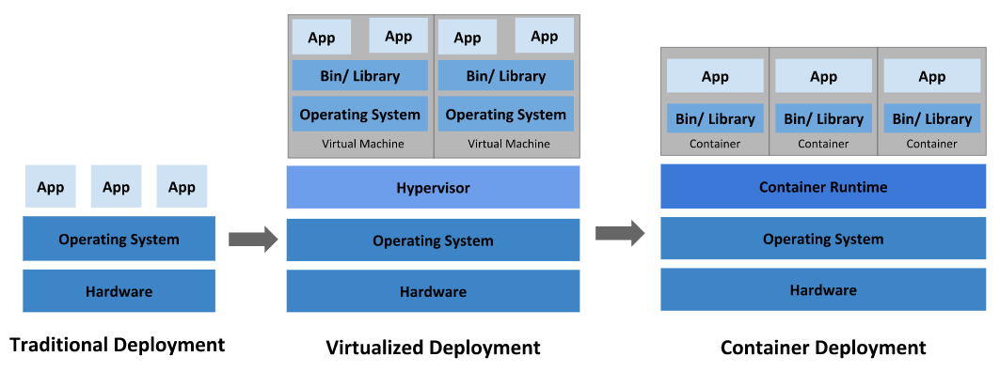

# 쿠버네티스란 무엇인가?

https://kubernetes.io/ko/docs/concepts/overview/what-is-kubernetes/

* 컨테이너화된 워크로드와 서비스를 관리하기 위한 이식성이 있고, 확장가능한 오픈소스 플랫폼이다.
* 선언적 구성과 자동화를 모두 용이하게 해준다.
* 크고, 빠르게 성장하는 생태계를 가지고 있다.
* 쿠버네티스란 명칭은 키잡이(helmsman)나 파일럿을 뜻하는 그리스어에서 유래했다.
* 구글이 2014년에 쿠버네티스 프로젝트를 오픈소스화했다.

### 전통적인 배포 시대

* 초기 조직은 애플리케이션을 물리 서버에서 실행했었다.
* 한 물리 서버에서 여러 애플리케이션의 리소스 한계를 정의할 방법이 없었기에, 리소스 할당의 문제가 발생
* 이에 대한 해결책은 서로 다른 여러 물리 서버에서 각 애플리케이션을 실행하는 것
* 물리 서버를 많이 유지하기 위해서 조직에게 많은 비용이 들었다.

### 가상화된 배포 시대

* 단일 물리 서버의 CPU에서 여러 가상 시스템 (VM)을 실행할 수 있게 한다.
* 가상화를 사용하면 VM간에 애플리케이션을 격리하고 애플리케이션의 정보를 다른 애플리케이션에서 자유롭게 액세스 할 수 없으므로, 일정 수준의 보안성을 제공할 수 있다.

### 컨테이너 개발 시대

* 컨테이너는 VM과 유사하지만 격리 속성을 완화하여 애플리케이션 간에 운영체제(OS)를 공유한다.
* 컨테이너는 가볍다고 여겨진다.
* VM과 마찬가지로 컨테이너에는 자체 파일 시스템, CPU, 메모리, 프로세스 공간 등이 있다.
* 기본 인프라와의 종속성을 끊었기 때문에, 클라우드나 OS 배포본에 모두 이식할 수 있다.

#### 컨테이너의 장점

* 기민한 애플리케이션 생성과 배포: VM 이미지를 사용하는 것에 비해 컨테이너 이미지 생성이 보다 쉽고 효율적임.
* 지속적인 개발, 통합 및 배포: 안정적이고 주기적으로 컨테이너 이미지를 빌드해서 배포할 수 있고 (이미지의 불변성 덕에) 빠르고 쉽게 롤백할 수 있다.
* 개발과 운영의 관심사 분리: 배포 시점이 아닌 빌드/릴리스 시점에 애플리케이션 컨테이너 이미지를 만들기 때문에, 애플리케이션이 인프라스트럭처에서 분리된다.
* 가시성은 OS 수준의 정보와 메트릭에 머무르지 않고, 애플리케이션의 헬스와 그 밖의 시그널을 볼 수 있다.
* 개발, 테스팅 및 운영 환경에 걸친 일관성: 랩탑에서도 클라우드에서와 동일하게 구동된다.
* 클라우드 및 OS 배포판 간 이식성: Ubuntu, RHEL, CoreOS, 온-프레미스, 주요 퍼블릭 클라우드와 어디에서든 구동된다.
* 애플리케이션 중심 관리: 가상 하드웨어 상에서 OS를 실행하는 수준에서 논리적인 리소스를 사용하는 OS 상에서 애플리케이션을 실행하는 수준으로 추상화 수준이 높아진다.
* 느슨하게 커플되고, 분산되고, 유연하며, 자유로운 마이크로서비스: 애플리케이션은 단일 목적의 머신에서 모놀리식 스택으로 구동되지 않고 보다 작고 독립적인 단위로 쪼개져서 동적으로 배포되고 관리될 수 있다.
* 리소스 격리: 애플리케이션 성능을 예측할 수 있다.
* 자원 사용량: 리소스 사용량: 고효율 고집적

## 쿠버네티스가 왜 필요하고 무엇을 할 수 있나

* 컨테이너는 애플리케이션을 포장하고 실행하는 좋은 방법이다.
* 프로덕션 환경에서는 애플리케이션을 실행하는 컨테이너를 관리하고 가동 중지 시간이 없는지 확인해야 한다.
* 쿠버네티스는 분산 시느템을 탄력적으로 실행하기 위한 프레임 워크를 제공한다.
* 애플리케이션의 확장과 장애 조치를 처리하고, 배포 패턴 등을 제공한다.

### 쿠버네티스의 특징

* 서비스 디스커버리와 로드 밸런싱
* 스토리지 오케스트레이션
* 자동화된 롤아웃과 롤백
* 자동화된 빈 패킹(bin packing)
* 자동화된 복구(self-healing)
* 시크릿과 구성 관리

