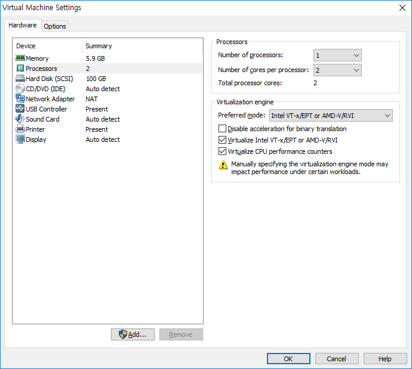

# OpenStack

## 1. 오픈스택 이해

로컬에 AWS와 유사한 클라우드 환경을 구축할 때 활용할 수 있는 오픈소스이다.

https://www.toast.com/kr

내부 클라우드 서비스나 일부 public 클라우드 형태의 서비스를 제공

가장 보편적인 서비스가 EC2와 비슷한 Compute 서비스이다.


Horizon : 대시보드 서비스

Swift : 오브잭트 스토리지 서비스


CLI의 장점은 스크립트를 할 수 있다.

대시보드는 interactive 한 방식이다.


### 1) 클라우드 컴퓨팅

* 클라우드 컴퓨팅
  * 사용자의 요청에 따라 공유된 컴퓨터의 자원이나 데이터를 사용자가 이용하는 컴퓨터 및 휴대폰과 같은 다양한 클라이언트 장치를 이용해서 인터넷 기반의 컴퓨팅 환경을 의미한다.
  * 'A-Z as a Service' 라고 불릴만큼 다양한 서비스 제공
  * Infrastructure as a Service (IaaS) : 시스템 자체가 필요한 경우 rental 해서 쓰는 방식. 주요 고객은 IT 관계자
  * Platfrom as a Service (PaaS) : 관리형 서비스. Provider가 밑단의 인프라를 자동으로 생성해서 Provider에서 관리하는 플랫폼으로 서비스할 수 있게끔 제공하는 서비스. 비용이 올라간다. 주요 고객은 개발자
  * Applicaion as a Service (SaaS) : 주요 고객은 End-user(개인, 기업)
  * 가상화의 장점은 굉장히 융통성있게 제공이 가능하다.
  * On-premise : 물리적 device를 소유해서 그 기반으로 구축하고 시스템을 올린다.
  * IaaS의 소비자가 PaaS, SaaS 제공자가 될 수 있다.
  * PaaS의 소비자가 SaaS 제공자가 될 수 있다.
  * 사용한 만큼 과금하는 형태의 요금제를 사용.


* Cloud Service Models
  * SaaS
    * 60%
    * End Users
    * Packaged Software OS & Application Stack Servers Storage Network
  * PaaS
    * 10%
    * Application Developers
    * 자동화 + 관리형
    * OS & Application Stack Server Storage Network
  * IaaS
    * 30%
    * Infrastructure & Network Architecture
    * D.I.Y
    * 저렴하지만 관리를 직접 소비자가 해야한다.
    * Server Storage Network


* Public Cloud vs Private Cloud
  * 누가 사용하느냐에 따라 Data 저장소 위치에 차이가 있다.
  * Public Cloud의 사용자는 Any(누구나)이다. 데이터가 Provider쪽 저장소에 저장된다.
  * Private Cloud는 제한적으로 접근해서 사용하도록 하는 배치 모델이다. 데이터가 기업체의 데이터센터 안에(local)에 저장된다. ex) 기업의 직원들
  * Hybrid Cloud = Public Cloud + Private Cloud
  * 수요 예측이 어려운 서비스가 Public Cloud 형태로 런칭을 많이 하고 있다.
  * 안정화되어 Private Cloud 또는 Hybrid Cloud 형태로 가고싶을 경우 사용하는 것이 Openstack이다.


### 2) 오픈스택 개요


2006년 AWS 시작. EC2, S3, SQS

클라우트 컴퓨팅 환경을 local에 구축하고 싶은데 이미 만들어진 소스를 가져다가 필요한 기능을 추가해 공개 -> 단기간 안에 빠른 성장을 이뤄낼 수 있다. 오픈소스 프로젝트

예전에는 close 형태의 소프트웨어를 가지고 시장 경쟁력을 높였다고 한다면, 요즘은 추세가 오픈소스이다. 그것을 사용하는 사용자가 많아지는 것을 경쟁력으로 해서 인수합병형태로 경쟁력을 높인다.


* 오픈스택 개요
  * 2010년 NASA와 Rackspace가 하던 프로젝트를 오픈소스화 함
  * 오픈소스를 기반으로 클라우드를 구축하고 운영하고자 하는 오픈소스 개발자, 회사, 이용자들로 이루어진 커뮤니티
  * IaaS를 구축하게 해주는 오픈소스 플랫폼
  * Public과 Private 클라우드를 구축하기 위한 오픈 소스
  * 컴퓨팅, 스토리지, 네트워크와 같은 자원들을 모으고 이들을 제어하고 운영하는 클라우드 운영체제


openstack 기반의 kubernetes도 지원해준다. (Magnum)

AWS도 클라우드 운영체제, 인터넷 운영체제라고 말할 수 있다.

대시보드 안에서 가상 인프라, 인스턴스 만들고 DB를 올리는 등 인프라(IT 자원들)를 구축할 수 있고, 사용한 만큼 과금을 하는 종량 과금제로 사용할 수 있다. 서버를 물리적으로 구축할 필요가 없다.


* 각 릴리즈별 서비스 종류 (p49)
  * Glance : 일종의 가상 머신의 루트디스크 이미지이다.
  * Nova : KVM이라는 하이퍼바이저를 가지고 있다. Compute 서비스
  * Horizon : 대시보드 서비스. 웹 기반의 유저 인터페이스를 제공한다. Openstack에 대한 콘솔을 제공.
  * Swift : 오브젝트 스토리지 서비스
  * Keystone : 보안을 향상시키기 위해서 인증 매커니즘이 결합되었다.
  * Quantum : 네트워킹 서비스
  * Neutron : 네트워킹 서비스. NFV, SDN등의 기능들을 지원하기 위해 확장됨.
  * Cinder : Block Storage Service. 추가적으로 Storage를 가상으로 연결해서 사용할 수 있도록 해준다.
  * Openstack의 인스턴스는 가상 머신이다.
  * Heat : Openstack의 자동화 서비스. 오케스트레이션 자동화 서비스이다. 한 두대의 물리적인 시스템이 아니라 수십개의 가상 머신을 가볍게 만들어서 서비스하는 구조로 바뀌었다. IaC (Infrastructure as a Code) 코드로 다 작성한 다음 자동으로 리소스를 배포할 수 있도록 하는 서비스. 클라우드 컴퓨팅의 꽃
  * Ceilometer : 각 사용자의 리소스 사용량을 계측하는 서비스이다.


* OpenStack Liberty 릴리즈 노트
  * https://wiki.openstack.org/wiki/ReleaseNotes/Liberty/ko
  * Mitaka 이후의 문서는 wiki에 올라오지 않는다.


https://docs.openstack.org/train/


OpenStack DNS (Designate)

AWS Route53 : 서비스 포트가 53번. 고가용성 100%

Manila : 인스턴스(가상 머신)들이 공유하는 파일 시스템 서비스


https://docs.openstack.org/rocky/

우리는 Rocky 버전을 사용할 것이다.


크게 Compute Service와 Stroage Service가 있다.

Swift는 Object Storage Service이다. 

Horizon : 대시보드 서비스. 사용자들이 쉽게 사용할 수 있도록 한다.


* Identity Service Keystone(Cont.)
  * 사용자 및 API에 대한 인증 및 권한 설정 서비스를 제공한다.
  * 사용자 인증을 통하여 물리 서버 내의 자원을 사용할 수 있도록 한다.
  * OpenStack 서비스들을 위한 통합 인증 시스템
  * API에 요청을 보내기 전의 인증 처리
    * 최종 사용자/컴포넌트는 API에 요청을 보내기 전에 Keystone으로부터 API 동작에 대한 토큰을 구한다.
    * 토큰을 획득하면 대상 API에 대한 URL이 Keystone에서 검색된다.


pdf (p18)

토큰 사용자가 인스턴스를 생성할 수 있는 권한이 있는지 확인을 하고 생성

토큰 ID를 가지고 각 서비스(Nova, Neutron 등)에 요청을 보냄


* Cloud Image Service Glance
  * 다양한 하이퍼바이저에서 사용할 수 있는 가상 머신 이미지를 관리하고 가상머신에 설치된 운영체제를 보관 및 관리


* Network Service Neutron
  * 소프트웨어 기반의 네트워킹 서비스를 제공한다.
  * Router, VPN, Firewall, LB


* Cloud Compute Service NOVA(Cont.) (AWS EC2)
  * 가상머신 라이프사이클 관리자
  * 사용자의 요청에 따라 컴퓨팅 자원을 제공하고 관리.
  * Nova가 지원하는 하이퍼 바이저
    * Qemu와 KVM
    * Qemu는 유저 레벨 코드에서 구현된 하이퍼 바이저이다.
    * KVM은 HW에 의존적이다. CPU 가상모드가 지원되는 시스템에서 사용할 수 있다. KVM(Kernel-based Virtual Machine)은 리눅스에서 주로 사용하는 하이퍼 바이저이다.
    * Hyper-V와 VMware, XenServer6.2
    * Baremetal과 docker, Xen via libvirt, LXC via libvirt
    * Baremetal : 물리적인 시스템을 인스턴스로 제공한다. Ironic
    * Zun/Magnum


* Blocked Storage Service Cinder
  * 범용의 저장장치를 기반으로 디스크 볼륨을 제공한다.
  * Cinder에 의해 생성된 가상 디스크 볼륨은 가상 머신에 마운트 되어 가상 머신 사용자의 데이터를 저장하는데 사용될 수 있다.
  * Nova에서 생성된 인스턴스에 확장하여 사용할 수 있는 저장 공간을 생성 및 삭제하고 인스턴스에 연결할 수 있는 기능을 제공한다.
  * 서버는 Cinder, 클라이언트는 Nova가 된다.


* Storage 유형
  * Block 기반 Storage
    * ex) Cinder, EBS, iscsi, SAN
    * Client의 접근 방식 : 장치 file 형태로 접근
  * Object 기반 Storage (Resource)
    * ex) Swift, S3, Ceph
    * Client의 접근 방식 : HTTP 기반 RESTful API(GET/PUT/POST/DELETE), CRUD (Create(생성), Read, Update, Delete)
  * File 기반 Storage
    * ex) Manila, EFS, NFS, glusterfs
    * Client의 접근 방식 : 특정 디렉토리와 연결해서 사용한다. 연결할 때 쓰는 명령어가 mount이다. 실상은 네트워크를 통해 다른 저장소에 저장된다.
  * Database 기반 Storage
    * ex) Trove, Dynamodb(RDS)
    * Client의 접근 방식 : SQL, NoSQL 접근 방식


2^10 : KiB -> 1024 ≒ 10^3 (1000KB)

2^20 : MiB				  10^6

2^30 : GiB 				  10^9

2^40 : TiB 				   10^12

2^50 : PiB					10^15


### 3) 오픈스택 구성


* Manual 설치
  * 서비스가 가능한 사내 클라우드 시스템 구축할 경우
  * 다양한 버전의 리눅스에 설치 제공
  * 오픈스텍의 컴포넌트를 하나하나 단계별로 설치해야함.
  * 자동 설치의 경우 리부팅 한 이후에도 사용하기 위해서는 시스템 설정에서 Enable 설정을 해야한다.
  * 메뉴얼 설치의 경우 설치시 자동으로 Enable 설정을 한다.


* 자동화 툴을 이용한 설치
  * CM(Configuration management) tool
  * Chef, ansible, puppet, salt


* 자동화 툴을 이용한 설치
  * Redhat Solutions
    * Packstack (puppet 툴로 작성됨)
  * Mirantis Solutions
    * 오픈스택을 H.A로 설치할 수 있게끔 제공하는 도구 (백단에 Ceph 도구를 사용)
  * Ubuntu
    * Devstack (Shell 스크립트로 작성)
  * openstack-helm


* Devstack을 통한 OpenStack 설치
  * 설치방법이 간단하며, 환경설정만으로 다양한 방법의 설치 및 설정 가능
  * 서버가 재부팅 되는 경우 서비스를 할 수 없는 단점
  * http://devstack.org/


Scale up : 성능 리소스 박스(물리적 시스템) 내에서 cpu나 메모리를 증설하는 방식

Scale out : 복제를 이용하여 박스 단위로 확장하는 방식


https://ubuntu.com/

ubuntu는 desktop용과 server용이 따로 있다.


packstack --gen-answer-file=answer.txt

파일에 필요로 하는 값을 수정. 기본 옵션을 이용한 answer file을 만든 다음 일부 수정해서 그대로 적용해 OpenStack을 만든다.


p39

가상 스위치가 만들어진다.

그 밑에 여러 목적의 스위치들을 생성한다.

br-ex -> 외부 통신을 위한 가상 스위치(bridge)

Cloud User Self-Service


---

#### 컨트롤러 준비 작업


CPU 2개, 메모리 6GB, Storage 100GB

Virtual Box, VMware player


VMware Workstation

File -> New Virtual Machine


3번째 옵션을 선택해야 설정 변경 가능


core를 늘리는 것이 좋다.


메모리는 6GB

대략 6024


NAT 선택. 인터넷을 사용하기위해서는 공인 IP가 필요한데 공인 IP로 바꿔주는 역할을 한다.


여러 파일로 분산시키면 관리하기 힘들다.


Next -> Finish


Processors 클릭




메모리 가상 기술

오류가 나면 해제하고 사용


ISO mapping 시키기


controller 클릭 후 Power on this virtual machine 클릭


위쪽 화살표 -> Enter


한국어 선택


소프트웨어 선택 -> 최소 설치

서버 형태로 올릴 경우에는 불필요한 file set을 올리면 안된다.


설치 대상 클릭

"파티션을 설정합니다" 버튼 클릭 -> 완료 버튼 클릭

"여기를 클릭하여 자동으로 생성~" 클릭


kernel이 boot 파티션에 설치된다.

openstack에서는 home 파티션이 필요없다 -> 용량 줄인다.

완료 버튼 클릭 -> 변경 사항 적용


네트워크 및 호스트명 클릭


VMware Edit탭 -> Virtual Network Editor

Change Settings -> VMnet8(NAT) 선택 -> 10.0.0.0 -> Apply


이더넷 켬

설정 -> IPv4 설정


주소 : 10.0.0.100

넷마스크 : 24

게이트웨이 : 10.0.0.2

DNS 서버 : 10.0.0.2


저장


호스트 이름을 controller로 변경

적용 -> 완료 -> 설치 시작


암호 : abc123


재부팅 버튼 클릭


```bash
$ root
$ yum update -y 
$ reboot
```

설치 완료 후 실행. OS 전체 업데이트. 커널이 업데이트 된다. 재부팅 반드시 해줘야 한다.


최적화 작업이 필요하다.


리눅스 배포판에 따라 방화벽 다르다.

6.x -> iptables

7.x -> firewalld


```bash
$ systemctl stop firewalld  # 사용중인 방화벽 중지. 리부팅하면 다시 실행된다.
$ systemctl disable firewalld  # 리부팅을 하더라도 startup 되지 않는다.
$ systemctl disable NetworkManager
$ systemctl stop NetworkManager
```


네트워크 서비스 2가지 종류가 있다.

network

NetworkManager : 프로파일을 만들어 미리 다르게 설정해두고 용도별로 다르게 적용. 모바일에 최적화. 네트워크 구성이 불안정해져 critical service에 방해된다.


Xshell


연결


VirtualBox -> 파일 -> 호스트 네트워크 관리자

10.0.0.1/24로 되어있는 것 삭제


연결 안 될 경우

VMware Edit탭 -> Virtual Network Editor

Change Settings -> VMnet8(NAT) 삭제 후 다시 생성


---


시간 동기화 작업

```bash
$ yum -y install chrony
```


```bash
$ vi /etc/hosts
```


```bash
127.0.0.1   localhost localhost.localdomain localhost4 localhost4.localdomain4
::1         localhost localhost.localdomain localhost6 localhost6.localdomain6
10.0.0.100 controller
10.0.0.101 compute1
```


```bash
$ yum install -y centos-release-openstack-rocky
```

openstack 패키지를 가지고 있는 서버 주소 추가


```bash
$ yum repolist
```

조회 및 패키지 추가


```bash
$ yum upgrade -y
```


이 이미지를 다시 다른 설정으로 재구성할 때 반복을 피하기 위해 디스크 이미지를 복사해서 사용할 것이다.

```bash
$ poweroff
```


C:\openstack

compute1 폴더 생성

controller 폴더 안에 있는 "controller.vmdk" 파일 복사 -> compute1 폴더에 붙여넣기 및 "compute1"으로 이름 변경

openstack 폴더에도 "controller.vmdk" 파일 붙여넣기


1Day


* Cloud Computing의 이해(On-premise vs. Cloud)
  * 사용자 요청에 따라 공유된 자원이나 데이터를 인터넷 기반으로 제공하는 기술로 여러 유형의 서비스를 사용한 만큼 지불하는 종량과금제로 제공되는 computing


* 클라우드 서비스 유형
  * IaaS/PaaS/SaaS
* 클라우드 배치 유형
  * Public/Private/hybrid/community Cloud


* 오픈스택이란?
  * https://wiki.openstack.org/wiki/ReleaseNotes/Juno/ko
* Core Service 이해
  * compute - Nova
  * image - Glance
  * object storage - Swift
  * block storage - Cinder
  * network - Neutron
  * dashboard - Horizon
  * Identity - Keystone
  * orchestration - Heat