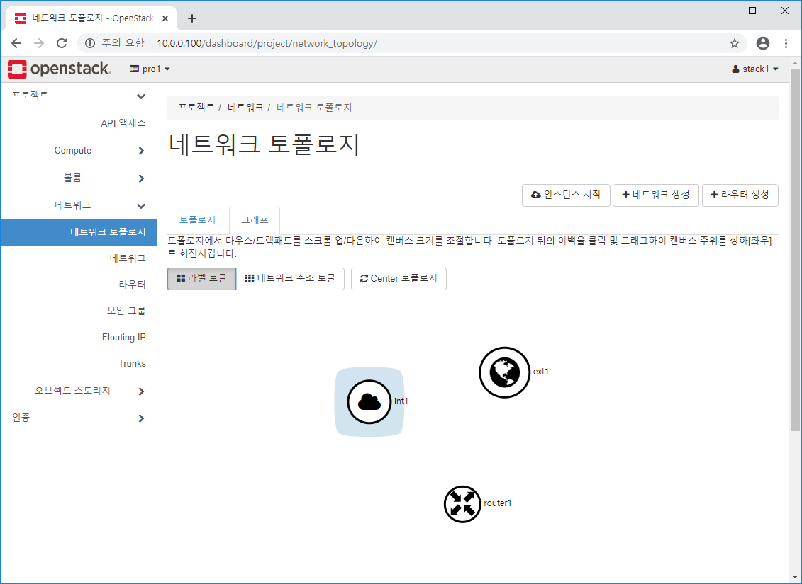

# OpenStack


### NTP 서버 구성

강의자료 p76, 책 p109


멀티 노드로 서비스를 제공하는 환경을 구축한다고 했을 때 시간을 동기화 한다는 것은 중요하다.

각각의 이벤트가 발생하는 시점에 로그가 들어간다. 다른 시스템에도 영향을 줄 수 있는데 시각이 달라지면 문제가 발생한다.

서비스 각각의 타임이 동기화가 안되면 서비스 fail이 되기 때문에 동기화가 중요하다.


```bash
#yum -y install chrony
```

네트워크를 통해서 time을 제공하는 서비스


```bash
#vi /etc/chrony.conf
```

설치하고 나서 /etc/chrony.conf 파일 확인


리눅스에서 타임서버 구축 시 패키지 2가지 선택 가능

* time server
  * ntp : 레거시. 예전부터 사용
  * chrony : ntp의 단점을 보완해서 나왔다.


수동으로 컨트롤러 내 time server 구축

allow라고 해서 클라이언트에 서비스하는 범위를 제한할 수 있다.

기존의 인터넷 기반 서버가 4대가 등록되어있다.

server : 자신의 로컬 클라우드 서버로 설정하기 위한 설정


```bash
$ getenforce
Enforcing
```

SELinux 기능을 켜서 사용하고 있는지 아닌지 확인하는 명령어.


* 보안 메커니즘으로 사용하는 것 2가지
  * 방화벽 : firewalld(7.x), iptables(6.x) 포트 기반 Access 제어
  * SELinux : Label 기반 Access 제어


* 방화벽
  * 서버쪽에 리눅스가 설치되어 있고 외부에 인터넷이 있어서 여러 클라이언트 사용자들이 접근한다. 내부망 내에서 해당 request를 받아서 처리하기 위한 port를 열어줘야한다.
  * httpd를 이용해 web 서버 구축 -> 80port
  * 80포트를 열어줘야 한다.
  * 호스트 기반의 방화벽 -> enable해서 사용하는 매커니즘 권장한다. 포트만 가지고 오픈되었는지 아닌지를 가지고 서비스에 대한 제어가 가능하다.
  * 기업에서는 호스트 기반 방화벽은 끄고 네트워크 방화벽을 두고 관리하는 방식이다.


리소스를 사용하는 주체는 프로세스와 사용자가 있다. 리소스는 파일, 디렉토리 등

사용자를 보는 명령어는 id -a 정보를 보면 사용자의 Label 정보를 볼 수 있다.

ps -efZ 프로세스별 label 확인

ls -lZ


```bash
$ id -a
uid=0(root) gid=0(root) groups=0(root) context=unconfined_u:unconfined_r:unconfined_t:s0-s0:c0.c1023
```


```bash
# ps -efZ|grep ssh
system_u:system_r:sshd_t:s0-s0:c0.c1023 root 1147    1  0 13:08 ?        00:00:00 /usr/sbin/sshd -D
unconfined_u:unconfined_r:unconfined_t:s0-s0:c0.c1023 root 1537 1147  0 13:09 ? 00:00:00 sshd: root@pts/0
unconfined_u:unconfined_r:unconfined_t:s0-s0:c0.c1023 root 1570 1541  0 13:30 pts/0 00:00:00 grep --color=auto ssh
```


```bash
ls -lZ /etc/ssh
-rw-r--r--. root root     system_u:object_r:etc_t:s0       moduli
-rw-r--r--. root root     system_u:object_r:etc_t:s0       ssh_config
-rw-r-----. root ssh_keys system_u:object_r:sshd_key_t:s0  ssh_host_ecdsa_key
-rw-r--r--. root root     system_u:object_r:sshd_key_t:s0  ssh_host_ecdsa_key.pub
-rw-r-----. root ssh_keys system_u:object_r:sshd_key_t:s0  ssh_host_ed25519_key
-rw-r--r--. root root     system_u:object_r:sshd_key_t:s0  ssh_host_ed25519_key.pub
-rw-r-----. root ssh_keys system_u:object_r:sshd_key_t:s0  ssh_host_rsa_key
-rw-r--r--. root root     system_u:object_r:sshd_key_t:s0  ssh_host_rsa_key.pub
-rw-------. root root     system_u:object_r:etc_t:s0       sshd_config
```


접근하려 했을 때 Label이 맞으면 접근이 가능하다.

포트는 허용이 되었다고 하더라도 Label이 맞지 않으면 missmatch가 나면서 접근할 수 없다.

허용하면 네트워크 기반 서비스들의 룰이나 Label들을 하나하나 설정하는 번거로운 작업들을 해줘야한다. 일반적으로 끄고, 네트워크 방화벽을 이용한다.


```bash
[root@controller ~]# setenforce
usage:  setenforce [ Enforcing | Permissive | 1 | 0 ]
[root@controller ~]# getenforce
Enforcing
[root@controller ~]# setenforce 0
[root@controller ~]# getenforce
Permissive
```

리눅스가 현재 사용중일 경우에만 적용된다.


```bash
[root@controller ~]# vi /etc/selinux/config
```


```bash
# This file controls the state of SELinux on the system.
# SELINUX= can take one of these three values:
#     enforcing - SELinux security policy is enforced.
#     permissive - SELinux prints warnings instead of enforcing.
#     disabled - No SELinux policy is loaded.
SELINUX=permissive
# SELINUXTYPE= can take one of three two values:
#     targeted - Targeted processes are protected,
#     minimum - Modification of targeted policy. Only selected processes are protected.
#     mls - Multi Level Security protection.
SELINUXTYPE=targeted

```

SELINUX=permissive로 변경 후 저장


---


```bash
vi /etc/chrony.conf
```


```bash
# Use public servers from the pool.ntp.org project.
# Please consider joining the pool (http://www.pool.ntp.org/join.html).
server 0.centos.pool.ntp.org iburst
server 1.centos.pool.ntp.org iburst
#server 2.centos.pool.ntp.org iburst
#server 3.centos.pool.ntp.org iburst
server 2.kr.pool.ntp.org iburst
server 127.127.1.0

allow 10.0.0.0/24
```

allow 안에 있는 클라이언트에만 제공하겠다. 저장하고 나오기


```bash
[root@controller ~]# systemctl restart chronyd
[root@controller ~]# chronyc sources
210 Number of sources = 4
MS Name/IP address         Stratum Poll Reach LastRx Last sample               
===============================================================================
^? 127.127.1.0                   0   6     0     -     +0ns[   +0ns] +/-    0ns
^+ dadns.cdnetworks.co.kr        2   6    17     5   -650us[ -650us] +/-   59ms
^* ec2-54-180-134-81.ap-nor>     2   6    17     8   +161us[ +377us] +/-   51ms
^- 210.183.236.141               2   6    17     9  -1468us[-1468us] +/-   41ms
```

위와 같은 과정을 거치면 컨트롤러가 클라이언트이자 서버가 된다.


```bash
#timedatectlset-time ‘2016-05-01 16:00:00’ or # ntpdatetime.nuri.net
#timedatectlset-ntptrue
#systemctlstart chronyd
#chronycsources
경우에따라
#iptables–F
#chkconfigiptablesoff
```

only 서버로 했을 경우 자신의 시간을 맞추는 작업을 해줘야한다. 우리는 클라이언트이자 서버로 했으므로 skip


강의자료 p77

NTP client 구성


강의자료 p80

NOVA 호스트 준비

2GB 컨트롤러를 복사했기 때문에 이름, IP 바꾸는 작업 필요하다.


```bash
yum install -y openstack-packstack*
```


p84

패키지를 화면 단위로 본다. packstack 자체가 대화 형태로 작업을 지원해준다.

gen-answer-file 생성하고 파라미터 수정


```bash
[root@controller ~]# packstack --gen-answer-file=/root/openstack.txt
Packstack changed given value  to required value /root/.ssh/id_rsa.pub
[root@controller ~]# cp /root/openstack.txt /root/openstack.old
[root@controller ~]# vi /root/openstack.txt
```

:set nu


```bash
     11 CONFIG_DEFAULT_PASSWORD=abc123
     46 CONFIG_CEILOMETER_INSTALL=n
     50 CONFIG_AODH_INSTALL=n
    326 CONFIG_KEYSTONE_ADMIN_PW=abc123
   1185 CONFIG_PROVISION_DEMO=n
    873 CONFIG_NEUTRON_OVS_BRIDGE_IFACES=br-ex:ens33
```

키스톤이라고 하는 서비스에 admin 권한으로 접근

비번들이 많이 필요한데 랜덤 비번을 다 기억할 수 없으니 사용하기 쉽게 변경

프로비전 데몬은 끈다. 간단하게 인스턴스 올릴 수 있게 해주는데 하나하나 인스턴스 올릴 작업을 할 것이므로 off

그 이후에 비번 요구하는 것이 있으면 abc123으로 해라

ceilometer를 끈다. 관련된 알람도 끈다

br-ex:ens33과 attach가 되어야 물리적인 통신이 가능하다. 스위치 하위 포트로 로컬의 인터페이스인 ens33을 mapping 시켜야 자동으로 할당이 된다.


/VISION_DEMO

D -> a


diff /root/openstack.txt /root/openstack.old

```bash
[root@controller ~]# diff /root/openstack.txt /root/openstack.old
11c11
< CONFIG_DEFAULT_PASSWORD=abc123
---
> CONFIG_DEFAULT_PASSWORD=
46c46
< CONFIG_CEILOMETER_INSTALL=n
---
> CONFIG_CEILOMETER_INSTALL=y
50c50
< CONFIG_AODH_INSTALL=n
---
> CONFIG_AODH_INSTALL=y
326c326
< CONFIG_KEYSTONE_ADMIN_PW=abc123
---
> CONFIG_KEYSTONE_ADMIN_PW=70532c98ce3241d1
873c873
< CONFIG_NEUTRON_OVS_BRIDGE_IFACES=br-ex:ens33
---
> CONFIG_NEUTRON_OVS_BRIDGE_IFACES=
1185c1185
< CONFIG_PROVISION_DEMO=n
---
> CONFIG_PROVISION_DEMO=y
```


time packstack --answer-file=/root/openstack.txt

```bash
[root@controller ~]# time packstack --answer-file=/root/openstack.txt
Welcome to the Packstack setup utility

The installation log file is available at: /var/tmp/packstack/20200108-144001-MD7iHX/openstack-setup.log

Installing:
Clean Up                                             [ DONE ]
Discovering ip protocol version                      [ DONE ]
Setting up ssh keys                                  [ DONE ]
Preparing servers                                    [ DONE ]

...

 **** Installation completed successfully ******

Additional information:
 * Time synchronization installation was skipped. Please note that unsynchronized time on server instances might be problem for some OpenStack components.
 * File /root/keystonerc_admin has been created on OpenStack client host 10.0.0.100. To use the command line tools you need to source the file.
 * To access the OpenStack Dashboard browse to http://10.0.0.100/dashboard .
Please, find your login credentials stored in the keystonerc_admin in your home directory.
 * The installation log file is available at: /var/tmp/packstack/20200108-144001-MD7iHX/openstack-setup.log
 * The generated manifests are available at: /var/tmp/packstack/20200108-144001-MD7iHX/manifests

real	14m16.235s
user	0m6.040s
sys	0m4.534s
```


/var/~

로그 파일 복사 -> 세션 하나 열기


tail -f /var/tmp/packstack/20200108-140818-q_skzr/openstack-setup.log

```bash
[root@controller ~]# tail -f /var/tmp/packstack/20200108-140818-q_skzr/openstack-setup.log
yum clean metadata
2020-01-08 14:08:36::INFO::shell::94::root:: [10.0.0.100] Executing script:
yum install -y puppet hiera openssh-clients tar nc rubygem-json
yum update -y puppet hiera openssh-clients tar nc rubygem-json
rpm -q --whatprovides puppet
rpm -q --whatprovides hiera
rpm -q --whatprovides openssh-clients
rpm -q --whatprovides tar
rpm -q --whatprovides nc
rpm -q --whatprovides rubygem-json
```


```bash
[root@controller ~]# ls
anaconda-ks.cfg  keystonerc_admin  openstack.old  openstack.txt
```

keystonerc_admin 파일이 생성된다.


```bash
[root@controller ~]# cat keystonerc_admin 
unset OS_SERVICE_TOKEN
    export OS_USERNAME=admin
    export OS_PASSWORD='abc123'
    export OS_REGION_NAME=RegionOne
    export OS_AUTH_URL=http://10.0.0.100:5000/v3
    export PS1='[\u@\h \W(keystone_admin)]\$ '
    
export OS_PROJECT_NAME=admin
export OS_USER_DOMAIN_NAME=Default
export OS_PROJECT_DOMAIN_NAME=Default
export OS_IDENTITY_API_VERSION=3
```

username과 password를 확인할 수 있다.


---


p89

parameter에 오타가 난 경우 수동으로 설정해야 한다.


잘 설정되어 있는지 확인


```bash
[root@controller ~]# cd /etc/sysconfig/network-scripts/
[root@controller network-scripts]# ls 
ifcfg-br-ex  ifdown-TeamPort  ifdown-ipv6  ifdown-routes  ifup-TeamPort  ifup-ippp  ifup-plusb   ifup-tunnel
ifcfg-ens33  ifdown-bnep      ifdown-isdn  ifdown-sit     ifup-aliases   ifup-ipv6  ifup-post    ifup-wireless
ifcfg-lo     ifdown-eth       ifdown-ovs   ifdown-tunnel  ifup-bnep      ifup-isdn  ifup-ppp     init.ipv6-global
ifdown       ifdown-ib        ifdown-post  ifup           ifup-eth       ifup-ovs   ifup-routes  network-functions
ifdown-Team  ifdown-ippp      ifdown-ppp   ifup-Team      ifup-ib        ifup-plip  ifup-sit     network-functions-ipv6
```

자동으로 생성되었다.


```bash
[root@controller network-scripts]# cat ifcfg-ens33 
DEVICE=ens33
NAME=ens33
DEVICETYPE=ovs
TYPE=OVSPort
OVS_BRIDGE=br-ex
ONBOOT=yes
BOOTPROTO=none
```

DEVICETYPE이 추가 되었다.

ONBOOT 이 yes로 설정되어야 부팅하면서 활성화된다.


```bash
[root@controller network-scripts]# cat ifcfg-br-ex 
DEFROUTE="yes"
UUID="709b9796-b767-46c9-9aa1-1061c8691874"
ONBOOT="yes"
IPADDR="10.0.0.100"
PREFIX="24"
GATEWAY="10.0.0.2"
DEVICE=br-ex
NAME=br-ex
DEVICETYPE=ovs
OVSBOOTPROTO="none"
TYPE=OVSBridge
OVS_EXTRA="set bridge br-ex fail_mode=standalone"
```

수동으로 할 경우 p89 빨간 글자대로 추가. 대문자 소문자 구분하므로 오타 주의


```bash
[root@controller network-scripts]# ip a s br-ex
6: br-ex: <BROADCAST,MULTICAST,UP,LOWER_UP> mtu 1500 qdisc noqueue state UNKNOWN group default qlen 1000
    link/ether 00:0c:29:c5:fd:e8 brd ff:ff:ff:ff:ff:ff
    inet 10.0.0.100/24 brd 10.0.0.255 scope global br-ex
       valid_lft forever preferred_lft forever
    inet6 fe80::24f1:9ff:fe6d:e948/64 scope link 
       valid_lft forever preferred_lft forever
```

특정 인터페이스만 보겠다 -> s + 인터페이스이름


```bash
[root@controller network-scripts]# ip a s ens33
2: ens33: <BROADCAST,MULTICAST,UP,LOWER_UP> mtu 1500 qdisc pfifo_fast master ovs-system state UP group default qlen 1000
    link/ether 00:0c:29:c5:fd:e8 brd ff:ff:ff:ff:ff:ff
    inet6 fe80::20c:29ff:fec5:fde8/64 scope link 
       valid_lft forever preferred_lft forever
```

ens33은 ip가 없어야 한다. 만약 존재하면 충돌 발생


```bash
[root@controller network-scripts]# ovs-vsctl show
d20af7c5-9852-41fc-ab7c-d6893a30832e
    Manager "ptcp:6640:127.0.0.1"
        is_connected: true
    Bridge br-int
        Controller "tcp:127.0.0.1:6633"
            is_connected: true
        fail_mode: secure
        Port br-int
            Interface br-int
                type: internal
        Port int-br-ex
            Interface int-br-ex
                type: patch
                options: {peer=phy-br-ex}
        Port patch-tun
            Interface patch-tun
                type: patch
                options: {peer=patch-int}
    Bridge br-ex
        Controller "tcp:127.0.0.1:6633"
            is_connected: true
        fail_mode: secure
        Port "ens33"
            Interface "ens33"
        Port phy-br-ex
            Interface phy-br-ex
                type: patch
                options: {peer=int-br-ex}
        Port br-ex
            Interface br-ex
                type: internal
    Bridge br-tun
        Controller "tcp:127.0.0.1:6633"
            is_connected: true
        fail_mode: secure
        Port br-tun
            Interface br-tun
                type: internal
        Port patch-int
            Interface patch-int
                type: patch
                options: {peer=patch-tun}
    ovs_version: "2.11.0"
```

br-ex 하위에 ens33


웹 브라우저

http://10.0.0.100/dashboard


오른쪽 위 admin -> 설정


인증 : keystone 서비스 사용


admin 역할을 부여받아야 관리 탭이 보인다.

클라우드 사용자가 로그인하면 프로젝트와 인증 메뉴만 보이는 상태로 로그인이 된다.


개요 : 각 프로젝트 별로 리소스 사용량을 확인할 수 있다.


하이퍼바이저, 리소스 정보 확인할 수 있다.

compute 호스트는 scale out 방식으로 계속 붙일 수 있다.


호스트 집합 : 가용성 존(AZ). 클라우드 사용자가 볼 수 없다. 관리 목적. 


인스턴스 : Nova가 제공하는 메뉴이다. 

이미지 : Glance

볼륨 : Cinder

네트워크 : Neutron


대시보드 서비스 자체는 Horizon이 한다.


시스템 -> 기본

가상화 시스템에는 기본 Quota(하드웨어 리소스 limit)가 설정되어 있다. limit 설정

클라우드 사용자가 요청하면 업데이트 기본을 눌러 수정 가능


하나의 주소 역할


Compute 서비스, 블록 스토리지 서비스, 네트워크 에이전트의 state가 Up상태여야 한다.

time 동기화가 안되었을 경우 down될 수 있다.


프로젝트

Compute -> 키 페어


---

### OpenStack 용어 정의


* 프로젝트
  * 클라우드 사용자 그룹에 Quota 적용
  * 리소스에 Quota가 적용된 것이다.


* Tenant
  * cloud 사용자 그룹(project)


인증 -> 그룹

리소스에 대한 접근 제어(ACL)를 할 때 개별 유저에 대해 접근제어를 하는 것은 어렵기 때문에 접근 제어를 편리하게 할 수 있도록 하는 것이 그룹이다.


* Flavor
  * 관리 -> Compute -> Flavor
  * Ephemeral 디스크 : 2번째 disk
  * Root 디스크는 장치명이 sda, Ephemeral 디스크는 sdb로 붙여진다.
  * 디스크가 추가적으로 더 필요한 경우(sdc가 필요한 경우) Cinder
  * 관리자가 원하는 스펙이 있으면 만들 수 있다. 일반 사용자는 만들 수 없다.


* Instance
  * VM


* Key pair
  * DER/PEM/X.509로 인코딩된 넷스케이프 인증서 사용자가 VM instance에 접속 시 사용
  * ssh 접속 시 인증 메커니즘


---

### OpenStack 서비스 사용하기


p110

인프라를 필요로하는 사용자가 만드는 것

현재 사용자는 admin 밖에 없다.

사용자는 특정 프로젝트 멤버여야 한다.

프로젝트 생성, 사용자 생성

4번부터는 Self Service

Flavor 생성. 관리자가 수행 가능

instance를 생성할 때 여러 리소스 필요하다. 바로 올릴 수 없다.


프로젝트 -> Compute -> 인스턴스 -> 인스턴스 시작

인스턴스를 최종적으로 만들기 전에 필요로 하는 리소스를 만들어도구 시작해야한다.


인증 -> 프로젝트 -> 프로젝트 생성


pro1


`+` 버튼 클릭 -> admin, member 선택

프로젝트 생성


Quotas 수정 클릭


사용자 -> 사용자 생성


관리 -> Compute -> Flavor-> Flavor 생성


a.nano는 접근 권한 설정하지 않는다.


mgr1 로 로그인


관리 탭이 보인다.


stack1 user로 로그인


관리 탭이 보이지 않는다.


public 망에 인스턴스가 올라가면 공인 IP가 할당된다.


* 인스턴스 IP
  * Fixed IP(사설 IP)
  * Floating IP(공인(static) IP) : EIP. 인스턴스가 start하거나 stop 해도 바뀌지 않는다.


stack1 user 로그인

네트워크 -> 생성


네트워크 생성


10.0.0.210,10.0.0.220


라우터 -> 라우터 생성


게이트웨이 설정 : 외부 네트워크와 연결하는 것


stack1 로그아웃, mgr1으로 로그인


관리 -> 네트워크 -> 네트워크

ex1 네트워크 편집

공유, 외부 네트워크 속성 주기

저장


관리자만 외부 네트워크 속성을 켤 수 있다.


stack1으로 들어가기

네트워크 -> 네트워크 토폴로지


라벨 토글

ext1이 지구모양, int1이 구름모양




라우터 클릭 -> 인터페이스 추가


라우터 -> 게이트웨이 설정


네트워크 토폴로지에서 확인


---


### Day2

----------------------------------------------------------
1. 컨트롤러 준비작업
   * os update
   * /etc/hosts
   * ntp server 구축
   * centos 최적화(filrewalld/NetworkManager/SELinux)
   * repository 추가

2. 오픈스택 설치(packstack on centos)

   * vi /etc/chrony.conf

     ```bash
     server 0.centos.pool.ntp.org iburst
     server 1.centos.pool.ntp.org iburst
     #server 2.centos.pool.ntp.org iburst
     #server 3.centos.pool.ntp.org iburst
     server 2.kr.pool.ntp.org iburst
     server 127.127.1.0 
     
     allow 10.0.0.0/24
     ```

   * vi openstack.txt

     ```bash
     326 CONFIG_KEYSTONE_ADMIN_PW=abc123
     1185 CONFIG_PROVISION_DEMO=n
     11 CONFIG_DEFAULT_PASSWORD=abc123
     46 CONFIG_CEILOMETER_INSTALL=n
      50 CONFIG_AODH_INSTALL=n
     873 CONFIG_NEUTRON_OVS_BRIDGE_IFACES=br-ex:ens33
     ```

3. packstack을 이용한 all-in-one 구성

4. 오픈스택 서비스 사용하기
   * Horizon 접속
   * Horizon 메뉴
   * Openstack 용어 정의
   * 프로젝트/사용자 /Flavor 생성 
5. 네트워크/라우터
   * Floating IP용: ext1->subext1->10.0.0.0/24,gw: 10.0.0.2, dns:10.0.0.2,dhcp X, 사용 IP pool(10.0.0.210,10.0.0.220),외부네트워크
   * Fixed IP 용: int1->subint1->192.168.0.0/24,gw:192.168.0.254,dns:10.0.0.2,dhcp 활성화)
     router1 생성
   * 외부 네트워크과 router간 연결: 게이트웨이 설정
   * 내부 네트워크와 router간 연결: 인터페이스 추가


