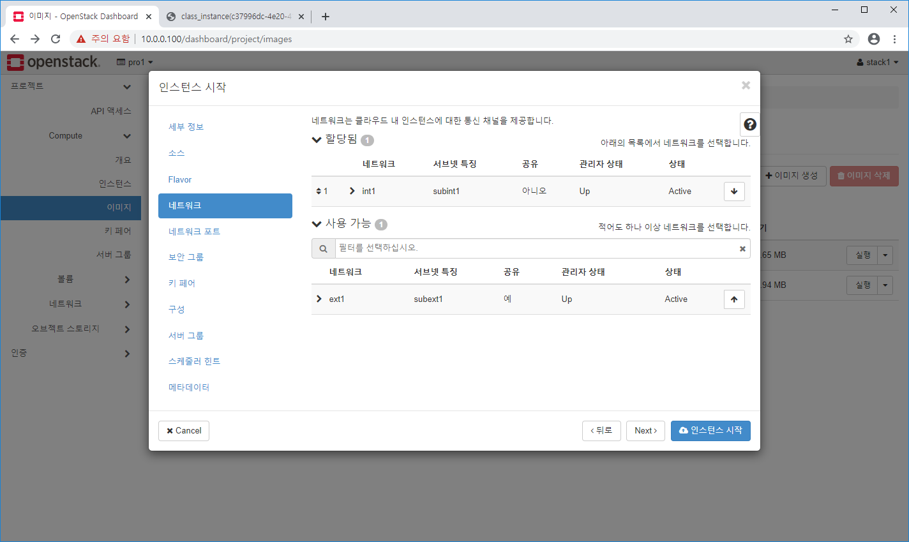

# OpenStack


가상 네트워크 인프라를 수동으로 구성했다.

하나의 시스템에 private cloud 구축

외부망 접속하기 위한 public 망으로 ext1을 구성

내부망에 배치하기 위해 내부 네트워크를 int1으로 만들었다.

네트워크 간에 패킷을 라우팅하기 위한 라우터를 가상으로 만든 다음 각각 네트워크 연결하는 작업 했다.


보안 그룹 : 호스트 기반 방화벽. 필요한 서비스 포트 오픈해줘야 한다.

방화벽 정책

다 open시켜두고 몇몇 서비스 deny -> 블랙리스트

다 close시키고 특정 포트 open -> 화이트리스트


우리가 한 것은 화이트리스트. 다 클로즈 된 상태로 서비스 할 포트들만 open


http -> 80

https -> 443

ssh -> 22

ping(ICMP)

목적에 맞게 포트를 열어주는 작업이 필요하다.


볼륨단위, VM단위 snapshot 생성

Swift 사용

메뉴얼 설치. 공식 홈페이지에 메뉴얼 설치 가이드를 가지고 있다.


---

### Security Group 생성

강의자료 p150


p152

나가는 것에 대해서는 아무데나 접근 가능하도록 허용.

외부에서 인스턴스에 요청하는 것은 close 되어있다. 인스턴스 입장에서는 outbound는 가능하지만 inbound는 불가.


p155

들어오는 패킷에 대한 것. 외부에서 패킷이 들어오는데 패킷의 구조를 보면 

CIDR -> 클릭하면 보안그룹 설정 가능

0.0.0.0/0 -> 누구나 들어오는 것 가능. 어디에서든지 들어오는 것 허용하겠다는 뜻이다.


데이터베이스를 외부에서 접근할 수 없도록, class 보안 그룹만 접근할 수 있도록 설정

웹을 통해서 내부적으로만 통신하는 시스템.

보안 그룹을 설정한다는 것은 내부 접속만 가능하도록 하는 것이다.


---


stack1 로그인


네트워크 -> 보안 그룹 -> 규칙 관리


CIDR 방식과 보안 그룹 방식이 있다.

default는 자기 자신을 의미한다.

default 보안 그룹을 적용한다면 인스턴스들이 default 보안 그룹 멤버가 되는 것이다. 그것들끼리 접속 가능. 내부 통신은 가능하나 외부에서 접근하는 것은 불가능하다.

포트 범위는 전체


보안 그룹 -> 보안 그룹 생성


class1 규칙관리 -> 규칙 추가

SSH, HTTP, ICMP 추가 (규칙 탭만 정하면 된다.)


SSH 접근 시 키 기반 인증을 하기 위한 key pair 생성

* console로 로그인 하는 방식
  * novncprotocol web 기반 console 접근
  * CLI


console로 접근한다는 것은 인스턴스가 네트워크 설정이 되지 않더라도 해당 시스템에 관리자로 접근이 가능한 상태이다.

정상적으로 네트워크 설정이 되었다면 remote에서 접속이 가능하다.


* remote 접속
  * SSH
  * telnet
  * rlogin


telnet과 rlogin은 보안이 안된다. 도청하는 프로그램으로 다 볼 수 있다.

ssh는 secure shell을 이용한다. 중간에 데이터가 암호화되서 주고받는다.


* 인증 방식
  * password 기반 인증 (default)
  * key 기반 인증 (비대칭 key)
    * public key(공개 key)
    * private key(개인 key)


key pair 생성. public key와 private key가 생성된다. 비대칭 키 알고리즘

대칭키 : 암호화된 키와 복호화 된 키 같다.

비대칭 키 : 암호화 된 키와 복호화된 키 다르다. 데이터를 암호화 할 때에도 사용하지만 인증할 때에도 사용한다.


p160

내부 망 인스턴스에 접근하기 위해서 사용한다. 인스턴스를 올리면 인스턴스가 서버가 되고 PC가 client가 된다. xshell을 이용해 ssh로 접근. 개인 key 이용. 서버 생성할 때 공개 key가 등록된다.

fingerprint가 일치하면 접속된다.

개인 키는 PC에 다운받아진다.


Compute -> 키 페어

기존에 존재하는 키를 업로드 해서 사용할 수 있다.

내가 공개키와 개인키를 가지고 있는데 여기서는 공개 키를 업로드 하는 것이다. 이미 가지고 있는 경우 공개키만 업로드

없으면 생성


키 패어 생성 -> 이름 설정


개인키는 다운받아졌다.

개인키 word로 열어보기


해당 인스턴스에 공인IP 할당

DB는 필요없고 web 서버는 필요하다. 외부 접속이 필요한 인스턴스에 Floating IP 할당

외부에서 직접적인 접근이 필요한 인스턴스용 Floating IP

외부에서 요청하기(들어오기) 위해서 공인 IP가 필요하다.


네트워크 -> Floating IP

pro1 프로젝트

프로젝트에 IP 할당 -> IP 할당


사용하지 않는 상태이다 -> 과금

running 상태에서 연결해서 쓰고 있다면 무료

필요하지 않으면 유동 IP 해제


---

### 이미지 생성

직접 만드는 방법도 있지만 다운 받아서 사용할 수도 있다.

https://download.cirros-cloud.net/


0.3.5 클릭

설치 이미지들은 CPU 아키텍처에 의존한다.

x86_64


cirros-0.3.5-x86_64-disk.img 다운


Compute -> 이미지 -> 이미지 생성

stack1에서만 볼 수 있다.


이미지 생성


---

### Instance 생성

p167


인스턴스 -> 인스턴스 시작

좌측에 step이 나와있다. `*` 표시 되어있는 것은 꼭 해야할 step

p170

`+` 버튼을 누르면 위로 올라간다.


* root-disk
  * NOVA
  * Cinder


Compute -> 인스턴스 -> 인스턴스 시작


NOVA로 생성


새로운 볼륨 생성

`예`라면 Cinder

`아니오`라면 NOVA

Access 성능은 local이 빠르다.


---

인스턴스 오류시


controller에 접속해서 작업(Xshell 이용)

```bash
$ yum install -y openstack-utils
```

openstack-utils 설치 시 openstack-status 명령어 사용가능. 서비스 상태 체크. fail이 뜨면 안 된다.

fail이면 개별 서비스 restart 해줘야 한다. systemctl은 개별 서비스 제어

openstack-service [status, start, stop] [glance, cinder, nova] 각각의 서비스마다 프로세스들이 있다. 서비스 프로세스들을 그룹으로 한꺼번에 제어하는 방식이다.


```bash
[root@controller ~]# openstack-status|grep vswitch
neutron-openvswitch-agent:              inactive
openvswitch:                            active
Warning keystonerc not sourced
```

neutron-openvswitch-agent inactive 라면 안 된다. -> systemctl start neutron-openvswitch-agent


```bash
systemctl start neutron-openvswitch-agent
```


```bash
[root@controller ~]# openstack-status|grep vswitch
neutron-openvswitch-agent:              active
openvswitch:                            active
Warning keystonerc not sourced
```


인스턴스 다시 생성

---

class_instance (인스턴스 이름) 클릭해서 들어가기

개요 확인. 설정한 대로 잘 올라갔는지 확인.


로그 탭 들어가기

아래쪽 cirros가 user,  cubswin:) 이 비번


콘솔 탭

`콘솔만 보려면 여기를 클릭하세요` 마우스 우클릭 -> 새 탭에서 링크 열기


로그인 : cirros / cubswin:)

```bash
$ hostname
$ lsblk
$ ip a
```


---

### 유동 IP 할당

 p177


compute -> 인스턴스 -> 작업 -> 유동 IP 연결


외부에서 접근이 필요한 인스턴스에 할당해준다. 외부에서 inbound가 필요한, 직접 접속이 필요한 인스턴스에 할당.


class_instance 클릭해서 들어가기

개요 부분 IP 주소 확인


만약 사용 안하겠다면 연결 해제 -> Floating IP에서 release 해야 과금이 안 된다.

(네트워크 -> Floating IP -> 연결 해제) 또는 (compute -> 인스턴스 -> 작업 -> 유동 IP 연결 해제)

지금은 해제하지 않는다.


네트워크 토폴로지


---

### Volume 생성

p187


인스턴스 -> class_instance -> 콘솔


디스크를 추가하는 작업

vdb로 붙도록


볼륨 -> 볼륨 -> 볼륨 생성


작업 -> 볼륨 연결 관리 


콘솔 창


```bash
$ lsblk
```

vdb로 붙은 것을 확인할 수 있다.


mount해서 사용

통으로 파티셔닝 하고 포맷 하려면 fdisk라는 utility를 가지고 파티션 할당할 것이다.


```bash
$ sudo sh
$ id
$ fdisk /dev/vdb
```


```bash
m
```


`


```bash
n # 기본으로
Enter (default p)
Enter
...
w
```

Last sector 주소를 줘서 통째로 하나의 파티션으로 assign


```bash
$ lsblk
```


```bash
$ mkfs -t ext4 /dev/vdb1
```

파일 시스템 포맷하기


```bash
$ mkdir /app
$ mount /dev/vdb1 /app
```


```bash
df -h
cp /etc/p* /app
ls /app
```


---

### Instance에 SSH로 접속하기


외부에서 라우터로 접속 -> 인스턴스로 접속


```bash
[root@controller ~]# ssh cirros@10.0.0.211
ssh: connect to host 10.0.0.211 port 22: No route to host
[root@controller ~]# ip netns
qrouter-a057f36d-27f0-44b9-b5d2-8a8cde77cf47 (id: 2)
qdhcp-6d379f41-147c-4fa1-bf16-742651879c50 (id: 1)
qdhcp-4e252b8b-2c4a-4a96-af37-4d636fbe1dea (id: 0)
[root@controller ~]# ip netns exec qrouter-a057f36d-27f0-44b9-b5d2-8a8cde77cf47 /bin/sh
sh-4.2# 
```

qrouter~ 복사


```bash
sh-4.2# ip a
1: lo: <LOOPBACK,UP,LOWER_UP> mtu 65536 qdisc noqueue state UNKNOWN group default qlen 1000
    link/loopback 00:00:00:00:00:00 brd 00:00:00:00:00:00
    inet 127.0.0.1/8 scope host lo
       valid_lft forever preferred_lft forever
    inet6 ::1/128 scope host 
       valid_lft forever preferred_lft forever
11: qr-0c36cb33-be: <BROADCAST,MULTICAST,UP,LOWER_UP> mtu 1450 qdisc noqueue state UNKNOWN group default qlen 1000
    link/ether fa:16:3e:86:7f:28 brd ff:ff:ff:ff:ff:ff
    inet 192.168.0.254/24 brd 192.168.0.255 scope global qr-0c36cb33-be
       valid_lft forever preferred_lft forever
    inet6 fe80::f816:3eff:fe86:7f28/64 scope link 
       valid_lft forever preferred_lft forever
12: qg-7071d95a-9f: <BROADCAST,MULTICAST,UP,LOWER_UP> mtu 1450 qdisc noqueue state UNKNOWN group default qlen 1000
    link/ether fa:16:3e:a9:e6:2f brd ff:ff:ff:ff:ff:ff
    inet 10.0.0.212/24 brd 10.0.0.255 scope global qg-7071d95a-9f
       valid_lft forever preferred_lft forever
    inet 10.0.0.211/32 brd 10.0.0.211 scope global qg-7071d95a-9f
       valid_lft forever preferred_lft forever
    inet6 fe80::f816:3eff:fea9:e62f/64 scope link 
       valid_lft forever preferred_lft forever
```


```bash
sh-4.2# ssh cirros@10.0.0.211
The authenticity of host '10.0.0.211 (10.0.0.211)' can't be established.
RSA key fingerprint is SHA256:0p9dstIJz7iYcvYMb9KpKqVDUFZptIqEzHxHxIfgv5c.
RSA key fingerprint is MD5:4d:6c:46:be:0b:1b:39:66:ee:13:d2:63:69:d7:fe:9c.
Are you sure you want to continue connecting (yes/no)? yes
Warning: Permanently added '10.0.0.211' (RSA) to the list of known hosts.
cirros@10.0.0.211's password: 
$ lsblk
NAME   MAJ:MIN RM    SIZE RO TYPE MOUNTPOINT
vda    253:0    0      1G  0 disk 
`-vda1 253:1    0 1011.9M  0 part /
vdb    253:16   0      1G  0 disk 
`-vdb1 253:17   0   1023M  0 part /app
```

cubswin:) 이 비번


---

### Key 기반 Instance에 접속


key가 windows에 다운받아져있다. -> controller 쪽으로 보내야 한다.


로컬디스크C 에 share 폴더 생성 후 share 폴더 안에 키 붙여넣기


VMware -> VM -> Settings -> Options -> Shared Folders


Always enabled -> Add -> Next -> 경로지정(share 폴더 선택) -> Next -> Finish


```bash
[root@controller ~]# vm
vm-support                 vmtoolsd                   vmware-namespace-cmd       vmware-user-suid-wrapper
vmcore-dmesg               vmware-checkvm             vmware-rpctool             vmware-vgauth-cmd
vmhgfs-fuse                vmware-guestproxycerttool  vmware-toolbox-cmd         vmware-vmblock-fuse
vmstat                     vmware-hgfsclient          vmware-user                vmware-xferlogs
[root@controller ~]# vmhgfs-fuse /mnt
fuse: mountpoint is not empty
fuse: if you are sure this is safe, use the 'nonempty' mount option
[root@controller share]# df -h
Filesystem           Size  Used Avail Use% Mounted on
devtmpfs             2.8G     0  2.8G   0% /dev
tmpfs                2.8G  4.0K  2.8G   1% /dev/shm
tmpfs                2.8G   45M  2.8G   2% /run
tmpfs                2.8G     0  2.8G   0% /sys/fs/cgroup
/dev/mapper/cl-root   60G  3.2G   57G   6% /
/dev/mapper/cl-home   10G   33M   10G   1% /home
/dev/sda1           1014M  180M  835M  18% /boot
tmpfs                567M     0  567M   0% /run/user/0
/dev/loop1           1.9G  6.1M  1.7G   1% /srv/node/swiftloopback
vmhgfs-fuse          931G  130G  802G  14% /mnt/hgfs
[root@controller ~]# cd /mnt/hgfs/
[root@controller hgfs]# ls
share
[root@controller hgfs]# cd share/
[root@controller share]# ls
stack1-key1.pem
[root@controller share]# cp stack1-key1.pem /root/
[root@controller share]# ip netns
qrouter-a057f36d-27f0-44b9-b5d2-8a8cde77cf47 (id: 2)
qdhcp-6d379f41-147c-4fa1-bf16-742651879c50 (id: 1)
qdhcp-4e252b8b-2c4a-4a96-af37-4d636fbe1dea (id: 0)
[root@controller share]# ip netns exec qrouter-a057f36d-27f0-44b9-b5d2-8a8cde77cf47 ssh -i /root/stack1-key1.pem cirros@10.0.0.211
```


```bash
[root@controller share]# ip netns exec qrouter-a057f36d-27f0-44b9-b5d2-8a8cde77cf47 ssh -i /root/stack1-key1.pem cirros@10.0.0.211
@@@@@@@@@@@@@@@@@@@@@@@@@@@@@@@@@@@@@@@@@@@@@@@@@@@@@@@@@@@
@         WARNING: UNPROTECTED PRIVATE KEY FILE!          @
@@@@@@@@@@@@@@@@@@@@@@@@@@@@@@@@@@@@@@@@@@@@@@@@@@@@@@@@@@@
Permissions 0755 for '/root/stack1-key1.pem' are too open.
It is required that your private key files are NOT accessible by others.
This private key will be ignored.
Load key "/root/stack1-key1.pem": bad permissions
cirros@10.0.0.211's password:
```

권한 문제로 pw 인증으로 바로 넘어간다.


```bash
[root@controller share]# chmod 600 /root/stack1-key1.pem 
[root@controller share]# ip netns exec qrouter-a057f36d-27f0-44b9-b5d2-8a8cde77cf47 ssh -i /root/stack1-key1.pem cirros@10.0.0.211
```

권한을 준 뒤 다시 접속하면 비밀번호를 입력하지 않고 key 기반으로 접속할 수 있다.


인스턴스에서는 공개키가 등록되어 있어야 key 기반 인증이 가능하다. 인스턴스 올릴 때 키가 설정되어 있으면 NOVA에서 자동으로 키를 내장시킨다. 내장으로 설정되어 있지 않으면 key 기반 인증 안된다.


Instance에 접속

```bash
$ ls .ssh
authorized_keys
$ cat .ssh/authorized_keys 
ssh-rsa AAAAB3NzaC1yc2EAAAADAQABAAABAQCuT9SXg/QoFKIwpR2Z8Rp+gw134a0BN5UD0wNoz1Q22mNAKzYdKQeBPXvYxljD02vwJrVg6kWylOy7SFYtuPwA3xqYOhvAxnboDuLomweTT+ZIaaV0Rpu+zgT7Kwm+Y12hfcL8Q4IUS146HxqhEdvQ30axdvG6e6/dz8Jp7kIflQZCP2zdFzTT4zP4df1jbs7JwIoLhOmEmyTZxCZkEufak8iPy+JNX/fxe1OtGFn9OEnvxtcHYxOE0M8hwhxfdTzLbYx5ZiwWs2ROEPsLA+EXCfYUiYWNpoPac68m87i/3qS0gzYzRwesv6MLs6QXIJNDSKaTh5HYHQVNqYw3tu5H Generated-by-Nova
```

이 파일이 없으면 key 기반 인증이 안 된다.


```bash
$ id
$ hostname
$ free # 메모리 정보 확인
$ lsblk
$ ip a
```


```bash
$ id
uid=1000(cirros) gid=1000(cirros) groups=1000(cirros)
$ hostname
class-instance
$ free
             total         used         free       shared      buffers
Mem:         50744        23280        27464            0         2132
-/+ buffers:              21148        29596
Swap:            0            0            0
$ lsblk
NAME   MAJ:MIN RM    SIZE RO TYPE MOUNTPOINT
vda    253:0    0      1G  0 disk 
`-vda1 253:1    0 1011.9M  0 part /
vdb    253:16   0      1G  0 disk 
`-vdb1 253:17   0   1023M  0 part /app
$ ip a
1: lo: <LOOPBACK,UP,LOWER_UP> mtu 16436 qdisc noqueue 
    link/loopback 00:00:00:00:00:00 brd 00:00:00:00:00:00
    inet 127.0.0.1/8 scope host lo
    inet6 ::1/128 scope host 
       valid_lft forever preferred_lft forever
2: eth0: <BROADCAST,MULTICAST,UP,LOWER_UP> mtu 1450 qdisc pfifo_fast qlen 1000
    link/ether fa:16:3e:48:d2:47 brd ff:ff:ff:ff:ff:ff
    inet 192.168.0.17/24 brd 192.168.0.255 scope global eth0
    inet6 fe80::f816:3eff:fe48:d247/64 scope link 
       valid_lft forever preferred_lft forever
```


---

### Snapshot 생성

p196

VM snapshot은 root-disk back up이다.

추가적인 snapshot은 volume snapshot을 이용한다.

VM snapshot을 이용하면 바로 새로운 instance를 올릴 수 있다.

volume snapshot을 이용하면 새로운 볼륨으로 만들 수 있다. 새 볼륨을 만들어서 다른 인스턴스에 붙일 수 있다.

똑같은 디스크를 연결해서 쓰는 상황이 된다.

root-disk 말고 Cinder라고 하는 storage는 네트워크를 타고 remote로 가상의 드라이브를 제공해준다. 인스턴스 입장에서 마치 local에 파일이나 data를 write하는 것처럼 쓰지만 실제로는 네트워크를 통해서 왔다갔다 한다.


unmount : 디렉토리 연결 해제 -> 어플리케이션에서 사용할 수 없다.

sudo umount /app


```bash
$ df -h
Filesystem                Size      Used Available Use% Mounted on
/dev                     21.3M         0     21.3M   0% /dev
/dev/vda1                23.2M     18.0M      4.0M  82% /
tmpfs                    24.8M         0     24.8M   0% /dev/shm
tmpfs                   200.0K     72.0K    128.0K  36% /run
/dev/vdb1              1006.9M     17.3M    938.5M   2% /app
$ sudo umount /app
$ df -h
Filesystem                Size      Used Available Use% Mounted on
/dev                     21.3M         0     21.3M   0% /dev
/dev/vda1                23.2M     18.0M      4.0M  82% /
tmpfs                    24.8M         0     24.8M   0% /dev/shm
tmpfs                   200.0K     72.0K    128.0K  36% /run
```


```bash
$ lsblk
NAME   MAJ:MIN RM    SIZE RO TYPE MOUNTPOINT
vda    253:0    0      1G  0 disk 
`-vda1 253:1    0 1011.9M  0 part /
vdb    253:16   0      1G  0 disk 
`-vdb1 253:17   0   1023M  0 part 
```


detach : 볼륨 -> 작업 -> 볼륨 연결 관리 -> 볼륨 연결 해제

```bash
$ lsblk
NAME   MAJ:MIN RM    SIZE RO TYPE MOUNTPOINT
vda    253:0    0      1G  0 disk 
`-vda1 253:1    0 1011.9M  0 part /
```

lsblk에서는 안보인다.


볼륨 -> 볼륨 -> 작업(vol1) -> 스냅샷 생성


작업 -> 볼륨 생성


Compute -> 인스턴스


Volume Snapshot과 VM Snapshot은 storage가 다르다.


스냅샷 생성


이미지 저장소로 자동으로 넘어간다. root-disk 이미지 백업. Glance로 넘어간다.


class-snap 실행 클릭





인스턴스 탭 가서 확인. IP 주소 : 192.168.0.6


볼륨 스냅샷 붙이기

vol1-snap


볼륨 -> 볼륨 -> 작업(new-vol1) -> 볼륨 연결 관리


CentOS(Xshell)

```bash
$ ip netns exec qrouter-a057f36d-27f0-44b9-b5d2-8a8cde77cf47 ssh -i /root/stack1-key1.pem cirros@192.168.0.6
```


```bash
$ df -h
Filesystem                Size      Used Available Use% Mounted on
/dev                     21.3M         0     21.3M   0% /dev
/dev/vda1                23.2M     18.0M      4.0M  82% /
tmpfs                    24.8M         0     24.8M   0% /dev/shm
tmpfs                   200.0K     72.0K    128.0K  36% /run
$ lsblk
NAME   MAJ:MIN RM    SIZE RO TYPE MOUNTPOINT
vda    253:0    0      1G  0 disk 
`-vda1 253:1    0 1011.9M  0 part /
vdb    253:16   0      1G  0 disk 
`-vdb1 253:17   0   1023M  0 part 
```


```bash
$ sudo sh
$ mkdir /app
$ mount /dev/vdb1 /app
```


```bash
$ df -h
Filesystem                Size      Used Available Use% Mounted on
/dev                     21.3M         0     21.3M   0% /dev
/dev/vda1                23.2M     18.0M      4.0M  82% /
tmpfs                    24.8M         0     24.8M   0% /dev/shm
tmpfs                   200.0K     72.0K    128.0K  36% /run
/dev/vdb1              1006.9M     17.3M    938.5M   2% /app
$ ls /app
lost+found  passwd      profile     protocols
```


---

### Object Storage (Swift)

p199


AWS의 bucket과 같은 개념


컨테이너 -> `+` 컨테이너


폴더 생성 -> 폴더 이름 클릭 -> 폴더 생성 -> 폴더 이름 클릭

파일 업로드, 다운로드 가능


logical partition 개념


Swift를 Glance와 연결해서 사용 -> Glance라는 컨테이너 안에 해당 이미지가 들어간다.


---

## OpenStack CLI로 관리하기

### Identity 서비스 (Keystone)

OpenStack이라는 플랫폼 안에 여러가지 서비스가 있다. 기본적으로 인증된 사용자가 사용하도록 한다. 대시보드 사용 시 login 한다. login을 해야 OpenStack 내의 서비스를 사용할 수 있다.

Keystone은 인증 서비스

사용자 관리 : 사용자와 그들의 권한을 추적한다.

서비스 카탈로그 : 자신의 API 엔드포인트로 사용가능한 서비스의 카탈로그를 제공한다.


* 사용자
  * 오픈스택 클라우드 서비스를 사용하는 사람이나 시스템 혹은 서비스의 디지털 표현이다.
* Credentials
  * ID, PW
* 인증
  * 사용자의 신원을 확인하는 행위. 인증에 대한 응답으로 토큰을 발급한다.
* 토큰
  * 자원에 접근하는데 사용되는 임의의 텍스트 bit이다.
  * 한정된 기간동안 유효하다.
* Tenant
  * 사용자 그룹인데, 리소스 limit이 적용된 것이다. 프로젝트라는 용어와 동일
  * 프로젝트 내 멤버들이 적용된 Quota 내에서 공유
* 서비스
* 엔드 포인트
  * 서비스로 접근하려고 하는, 보통 URL로 기술되는, 네트워크로 접근가능한 주소이다.
* 역할
  * 권한이 있어야 실제 사용 가능하다.
  * 권한에 따라 보여지는 메뉴가 다르다.


Keystone은 MariaDB로 관리한다.


controller에서 작업

```bash
ps -ef|grep mysql
rpm -qa|grep mysql
ps -ef|grep mariadb
rpm -qa|grep mariadb
mysql -uroot
```

백그라운드에서 작업하고 있는 것을 확인할 수 있다.

mysql에 root 계정으로 접속


```mysql
MariaDB [(none)]> show databases;
+--------------------+
| Database           |
+--------------------+
| cinder             |
| glance             |
| information_schema |
| keystone           |
| mysql              |
| neutron            |
| nova               |
| nova_api           |
| nova_cell0         |
| nova_placement     |
| performance_schema |
| test               |
+--------------------+
12 rows in set (0.02 sec)
```


```mysql
MariaDB [(none)]> use keystone
Reading table information for completion of table and column names
You can turn off this feature to get a quicker startup with -A

Database changed
MariaDB [keystone]> show tables;
+-----------------------------+
| Tables_in_keystone          |
+-----------------------------+
| access_token                |
| application_credential      |
| application_credential_role |
| assignment                  |
| config_register             |
| consumer                    |
| credential                  |
| endpoint                    |
| endpoint_group              |
| federated_user              |
| federation_protocol         |
| group                       |
| id_mapping                  |
| identity_provider           |
| idp_remote_ids              |
| implied_role                |
| limit                       |
| local_user                  |
| mapping                     |
| migrate_version             |
| nonlocal_user               |
| password                    |
| policy                      |
| policy_association          |
| project                     |
| project_endpoint            |
| project_endpoint_group      |
| project_tag                 |
| region                      |
| registered_limit            |
| request_token               |
| revocation_event            |
| role                        |
| sensitive_config            |
| service                     |
| service_provider            |
| system_assignment           |
| token                       |
| trust                       |
| trust_role                  |
| user                        |
| user_group_membership       |
| user_option                 |
| whitelisted_config          |
+-----------------------------+
44 rows in set (0.00 sec)
```

Keystone과 관련된 정보들이 table로 관리된다.


```bash
MariaDB [keystone]> select * from user
    -> ;
+----------------------------------+---------------------------------------------------------------------------+---------+----------------------------------+---------------------+----------------+-----------+
| id                               | extra                                                                     | enabled | default_project_id               | created_at          | last_active_at | domain_id |
+----------------------------------+---------------------------------------------------------------------------+---------+----------------------------------+---------------------+----------------+-----------+
| 3e612a5bbfb64172853de7ab1b220aca | {"email": "root@localhost"}                                               |       1 | NULL                             | 2020-01-08 05:31:03 | NULL           | default   |
| 58800e592c174e0098b49e10a8fa2808 | {"email": "placement@localhost"}                                          |       1 | NULL                             | 2020-01-08 05:48:43 | NULL           | default   |
| 6ea32b8e1327478d837c7a401f38adbb | {"description": "The admin user for the pro1", "email": "mgr1@localhost"} |       1 | ed59236cf7af4d8c99e77ed5f29a06f0 | 2020-01-08 07:11:09 | NULL           | default   |
| 7081be2b1c3442dfa6a360f6cc05fadd | {"email": "cinder@localhost"}                                             |       1 | NULL                             | 2020-01-08 05:46:30 | NULL           | default   |
| bb7971416bde462ba2a63105ec0719d8 | {"email": "nova@localhost"}                                               |       1 | NULL                             | 2020-01-08 05:47:31 | NULL           | default   |
| d2fa8b4ef1784b0296c6b312a471f31e | {"email": "glance@localhost"}                                             |       1 | NULL                             | 2020-01-08 05:45:59 | NULL           | default   |
| f2703b684dd94fdd901b0fec50379c24 | {"description": "The member of pro1", "email": "stack1@localhost"}        |       1 | ed59236cf7af4d8c99e77ed5f29a06f0 | 2020-01-08 07:09:36 | NULL           | default   |
| f55991fcab8e454e89da3714287ec9d5 | {"email": "swift@localhost"}                                              |       1 | NULL                             | 2020-01-08 05:49:39 | NULL           | default   |
| f806b4047ed448fd86c1c3f18a9b2c31 | {"email": "neutron@localhost"}                                            |       1 | NULL                             | 2020-01-08 05:49:07 | NULL           | default   |
+----------------------------------+---------------------------------------------------------------------------+---------+----------------------------------+---------------------+----------------+-----------+
9 rows in set (0.00 sec)
```

username이 없어서 email로 구분


```bash
MariaDB [keystone]> select * from role;
+----------------------------------+---------------+-------+-----------+
| id                               | name          | extra | domain_id |
+----------------------------------+---------------+-------+-----------+
| 009eced7be454cd391018dd76b9cd770 | reader        | {}    | <<null>>  |
| 00d42ce63c8f45bb8ac6fdd64ba920d5 | admin         | {}    | <<null>>  |
| 187292c11d6e4da79c76dc390d98f534 | SwiftOperator | {}    | <<null>>  |
| 25427e3f9d3441eeb616a3cc70afce97 | ResellerAdmin | {}    | <<null>>  |
| 9fe2ff9ee4384b1894a90878d3e92bab | _member_      | {}    | <<null>>  |
| a05eebeb3d8c411a8056b33fa53b0d90 | member        | {}    | <<null>>  |
+----------------------------------+---------------+-------+-----------+
6 rows in set (0.00 sec)
```

project, service 등도 검색


```bash
[root@controller ~]# ls
anaconda-ks.cfg  keystonerc_admin  openstack.old  openstack.txt  stack1-key1.pem
[root@controller ~]# cat keystonerc_admin 
unset OS_SERVICE_TOKEN
    export OS_USERNAME=admin  # export : 전역변수로 선언할 때 사용
    export OS_PASSWORD='abc123'
    export OS_REGION_NAME=RegionOne
    export OS_AUTH_URL=http://10.0.0.100:5000/v3
    export PS1='[\u@\h \W(keystone_admin)]\$ '  # PS1 : 프롬프트 모양 바꿀 때 사용
    
export OS_PROJECT_NAME=admin
export OS_USER_DOMAIN_NAME=Default
export OS_PROJECT_DOMAIN_NAME=Default
export OS_IDENTITY_API_VERSION=3
```


```bash
[root@controller ~]# . keystonerc_admin 
[root@controller ~(keystone_admin)]# openstack user list
+----------------------------------+-----------+
| ID                               | Name      |
+----------------------------------+-----------+
| 3e612a5bbfb64172853de7ab1b220aca | admin     |
| 58800e592c174e0098b49e10a8fa2808 | placement |
| 6ea32b8e1327478d837c7a401f38adbb | mgr1      |
| 7081be2b1c3442dfa6a360f6cc05fadd | cinder    |
| bb7971416bde462ba2a63105ec0719d8 | nova      |
| d2fa8b4ef1784b0296c6b312a471f31e | glance    |
| f2703b684dd94fdd901b0fec50379c24 | stack1    |
| f55991fcab8e454e89da3714287ec9d5 | swift     |
| f806b4047ed448fd86c1c3f18a9b2c31 | neutron   |
+----------------------------------+-----------+
```

PS1에 의해 프롬프트 모양이 바뀐다.


```bash
[root@controller ~(keystone_admin)]# openstack role list --user admin --project admin
Listing assignments using role list is deprecated. Use role assignment list --user <user-name> --project <project-name> --names instead.
+----------------------------------+-------+---------+-------+
| ID                               | Name  | Project | User  |
+----------------------------------+-------+---------+-------+
| 00d42ce63c8f45bb8ac6fdd64ba920d5 | admin | admin   | admin |
+----------------------------------+-------+---------+-------+
```


```bash
[root@controller ~(keystone_admin)]# openstack role list --user stack1 --project pro1
Listing assignments using role list is deprecated. Use role assignment list --user <user-name> --project <project-name> --names instead.
+----------------------------------+----------+---------+--------+
| ID                               | Name     | Project | User   |
+----------------------------------+----------+---------+--------+
| 9fe2ff9ee4384b1894a90878d3e92bab | _member_ | pro1    | stack1 |
+----------------------------------+----------+---------+--------+
```


```bash
[root@controller ~(keystone_admin)]# cp keystonerc_admin keystonerc_stack1
[root@controller ~(keystone_admin)]# ls
anaconda-ks.cfg  keystonerc_admin  keystonerc_stack1  openstack.old  openstack.txt  stack1-key1.pem
[root@controller ~(keystone_admin)]# vi keystonerc_stack1 
```


```bash
unset OS_SERVICE_TOKEN
    export OS_USERNAME=stack1
    export OS_PASSWORD='abc123'
    export OS_REGION_NAME=RegionOne
    export OS_AUTH_URL=http://10.0.0.100:5000/v3
    export PS1='[\u@\h \W(keystone_stack1)]\$ '
    
export OS_PROJECT_NAME=pro1
export OS_USER_DOMAIN_NAME=Default
export OS_PROJECT_DOMAIN_NAME=Default
export OS_IDENTITY_API_VERSION=3
```


```bash
[root@controller ~(keystone_admin)]# . keystonerc_stack1 
[root@controller ~(keystone_stack1)]# openstack service list
You are not authorized to perform the requested action: identity:list_services. (HTTP 403) (Request-ID: req-a7c2e1cf-750c-4629-9d0f-dd5a9dc2aa13)
[root@controller ~(keystone_stack1)]# openstack token issue
+------------+-----------------------------------------------------------------------------------------------------------------------------------------------------------------------------------------+
| Field      | Value                                                                                                                                                                                   |
+------------+-----------------------------------------------------------------------------------------------------------------------------------------------------------------------------------------+
| expires    | 2020-01-09T08:10:30+0000                                                                                                                                                                |
| id         | gAAAAABeFtHmvC0aOq3yBklG3-7bl41St5eZzt4vg64tP71OjtNwX0Ol_F9V74JujRnYaAeiu_NpOb-OPZFpOluUmegn9DTi3-A083U7s4I1pCyA6Rcyf22gzZpXl7noPslo3hai1NI1IboH2nKmXJXS_RiXmCyk89xJbjyvTbzy52hAM16hULc |
| project_id | ed59236cf7af4d8c99e77ed5f29a06f0                                                                                                                                                        |
| user_id    | f2703b684dd94fdd901b0fec50379c24                                                                                                                                                        |
+------------+-----------------------------------------------------------------------------------------------------------------------------------------------------------------------------------------+
```

권한이 없다. 토큰 재발급은 가능하다.

인증 오류 -> id, pw 또는 프로젝트 명이 잘못 된 경우

권한 오류 -> 실제 권한이 없는 것이다.

일반 사용자가 관리자 명령을 수행하면 권한 오류가 뜬다.


---

#### demo 사용자 생성

p219


```bash
[root@controller ~(keystone_stack1)]# . keystonerc_admin 
[root@controller ~(keystone_admin)]# openstack project create --description "Demo Project" demo
+-------------+----------------------------------+
| Field       | Value                            |
+-------------+----------------------------------+
| description | Demo Project                     |
| domain_id   | default                          |
| enabled     | True                             |
| id          | 2f9522eaa35e48bb9bf6117ad1d7d020 |
| is_domain   | False                            |
| name        | demo                             |
| parent_id   | default                          |
| tags        | []                               |
+-------------+----------------------------------+
```


```bash
[root@controller ~(keystone_admin)]# openstack user create --password abc123 --project demo demo
+---------------------+----------------------------------+
| Field               | Value                            |
+---------------------+----------------------------------+
| default_project_id  | 2f9522eaa35e48bb9bf6117ad1d7d020 |
| domain_id           | default                          |
| enabled             | True                             |
| id                  | ae98d0c1aea24f6fb24e3cd411a4616f |
| name                | demo                             |
| options             | {}                               |
| password_expires_at | None                             |
+---------------------+----------------------------------+
```


```bash
[root@controller ~(keystone_admin)]# openstack role add --project demo --user demo _member_
[root@controller ~(keystone_admin)]# openstack role list --project demo --user demo
Listing assignments using role list is deprecated. Use role assignment list --user <user-name> --project <project-name> --names instead.
+----------------------------------+----------+---------+------+
| ID                               | Name     | Project | User |
+----------------------------------+----------+---------+------+
| 9fe2ff9ee4384b1894a90878d3e92bab | _member_ | demo    | demo |
+----------------------------------+----------+---------+------+
```


웹 브라우저 대시보드에서 demo 사용자로 로그인


demo 사용자에 대한 환경 파일도 만들어야 한다.


```bash
[root@controller ~(keystone_admin)]# cp keystonerc_admin keystonerc_demo
[root@controller ~(keystone_admin)]# vi keystonerc_demo 
```


:%s/admin/demo/ -> 전체 문서 admin 패턴을 demo  패턴으로 대체


```bash
unset OS_SERVICE_TOKEN
    export OS_USERNAME=demo
    export OS_PASSWORD='abc123'
    export OS_REGION_NAME=RegionOne
    export OS_AUTH_URL=http://10.0.0.100:5000/v3
    export PS1='[\u@\h \W(keystone_demo)]\$ '

export OS_PROJECT_NAME=demo
export OS_USER_DOMAIN_NAME=Default
export OS_PROJECT_DOMAIN_NAME=Default
export OS_IDENTITY_API_VERSION=3
```


```bash
[root@controller ~(keystone_admin)]# . keystonerc_demo 
[root@controller ~(keystone_demo)]# openstack token issue
+------------+-----------------------------------------------------------------------------------------------------------------------------------------------------------------------------------------+
| Field      | Value                                                                                                                                                                                   |
+------------+-----------------------------------------------------------------------------------------------------------------------------------------------------------------------------------------+
| expires    | 2020-01-09T09:11:46+0000                                                                                                                                                                |
| id         | gAAAAABeFuBClaUKwPaAwBpHM8SvkRwaVpOE52eYzEDQLt8RAcQasYB-iMUVJCOck4rvCjvwgQ5R8pZpT8bBj9PnycLnTyVany8qR74VoSg9PYzUznzWUWtMn6zzHVM8caijVzkvDPmIO88ZmN8BW77jeLtGTBF09gibDYIE4Yi3tpMNL078NuA |
| project_id | 2f9522eaa35e48bb9bf6117ad1d7d020                                                                                                                                                        |
| user_id    | ae98d0c1aea24f6fb24e3cd411a4616f                                                                                                                                                        |
+------------+-----------------------------------------------------------------------------------------------------------------------------------------------------------------------------------------+
```


---

### Image Service (Glance)


https://docs.openstack.org/rocky

Installation Guide


https://docs.openstack.org/install-guide/overview.html

Overview


Controller, Compute, Block Storage등 각 노드에 설치할 것들이 다르다.

컨트롤러에 올라가는 주요 서비스 컴포넌트

컴포넌트에 이러한 서비스를 올릴 것이다.

가장 많이 올라가는 것이 Controller Node


수동으로 설치할 경우 Networking 방식을 정해야한다.

Provider networks 인지 Self-service networks 인지

Self-service networks는 L3 Agent를 통해서 라우터를 제공한다.

Provider networks는 내부 네트워크를 구성할 수 없다. public으로 올린다. 물리적인 망을 구성

Self-service networks는 내부 네트워크를 구성할 수 있도록 라우터를 제공


Envirenment 탭 클릭

단계가 많다. 8개 단계


Security 클릭

openssl

```bash
[root@controller ~(keystone_demo)]# openssl rand -hex 10
16d06afa1f31c9249f59
[root@controller ~(keystone_demo)]# ls
anaconda-ks.cfg  keystonerc_admin  keystonerc_demo  keystonerc_stack1  openstack.old  openstack.txt  stack1-key1.pem
[root@controller ~(keystone_demo)]# grep PW openstack.txt 
# this with CONFIG_RH_PW.
CONFIG_RH_PW=
CONFIG_RH_PROXY_PW=
CONFIG_SATELLITE_PW=
CONFIG_SATELLITE_PROXY_PW=
CONFIG_AMQP_NSS_CERTDB_PW=PW_PLACEHOLDER
CONFIG_AMQP_AUTH_PASSWORD=PW_PLACEHOLDER
CONFIG_MARIADB_PW=7a218c53a92a4984
CONFIG_KEYSTONE_DB_PW=c9a4f56ee54d48ac
CONFIG_KEYSTONE_ADMIN_PW=abc123
CONFIG_KEYSTONE_DEMO_PW=691571c4077d4f08
CONFIG_GLANCE_DB_PW=097612dbd92b4d92
CONFIG_GLANCE_KS_PW=8d60d04d916a4a09
CONFIG_CINDER_DB_PW=1c5aa4c050d345a2
CONFIG_CINDER_KS_PW=b7431c87a97e4806
CONFIG_IRONIC_DB_PW=PW_PLACEHOLDER
CONFIG_IRONIC_KS_PW=PW_PLACEHOLDER
CONFIG_NOVA_DB_PW=8854a5d97ccf4a3f
CONFIG_NOVA_KS_PW=6f4547f2c0bb439f
CONFIG_NEUTRON_KS_PW=af30600d05884938
CONFIG_NEUTRON_DB_PW=b21f006371654a3f
CONFIG_NEUTRON_METADATA_PW=8c3b44dce2a64bbf
CONFIG_MANILA_DB_PW=PW_PLACEHOLDER
CONFIG_MANILA_KS_PW=PW_PLACEHOLDER
CONFIG_SWIFT_KS_PW=cea71850db6f4fbc
CONFIG_HEAT_DB_PW=PW_PLACEHOLDER
CONFIG_HEAT_KS_PW=PW_PLACEHOLDER
CONFIG_HEAT_DOMAIN_PASSWORD=PW_PLACEHOLDER
CONFIG_PROVISION_TEMPEST_USER_PW=PW_PLACEHOLDER
CONFIG_GNOCCHI_DB_PW=PW_PLACEHOLDER
CONFIG_GNOCCHI_KS_PW=PW_PLACEHOLDER
CONFIG_CEILOMETER_KS_PW=PW_PLACEHOLDER
CONFIG_AODH_KS_PW=PW_PLACEHOLDER
CONFIG_AODH_DB_PW=PW_PLACEHOLDER
CONFIG_PANKO_DB_PW=PW_PLACEHOLDER
CONFIG_PANKO_KS_PW=PW_PLACEHOLDER
CONFIG_TROVE_DB_PW=PW_PLACEHOLDER
CONFIG_TROVE_KS_PW=PW_PLACEHOLDER
CONFIG_TROVE_NOVA_PW=PW_PLACEHOLDER
CONFIG_SAHARA_DB_PW=PW_PLACEHOLDER
CONFIG_SAHARA_KS_PW=PW_PLACEHOLDER
CONFIG_MAGNUM_DB_PW=PW_PLACEHOLDER
CONFIG_MAGNUM_KS_PW=PW_PLACEHOLDER
```

비밀번호 생성 용도. 랜덤으로


Host networking

빨간색은 openstack 맴버들간 통신하기 위한 internal line

초록색은 외부 internet 통신용

원래는 분리하는 것이 맞지만 우리는 같이 쓴다.


각 노드에 대한 네트워크 설정 가이드


Controller node


systemctl restart network

이 명령어를 이용하면 재부팅 하지 않고 작업할 수 있다.


VMware -> File -> New Virtual Machine

Custom -> Next


manual-controller


기존 controller IP와 충돌난다. -> IP 변경


vi /etc/sysconfig/network-scripts/ifcfg-ens33

100으로 되어있는 것을 11번으로 변경한다.


VVID 주석

IPADDR="10.0.0.11"


```bash
$ systemctl restart network
$ ip a
```


10.0.0.11 확인


---

### Day 3


* 보안그룹 / Floating IP 생성
* Keypair 생성
* 이미지


내부 통신만 가능한 보안그룹. 화이트리스트 정책으로 추가.

외부 통신을 위한 공인 IP가 필요한데 Floating IP가 공인 IP 개념이다.


SSH 프로토콜은 해당 인스턴스에 remote 터미널을 제공하는 프로토콜이다. -> PW 기반, Key 기반 인증 필요

나는 개인키를 가지고 있고 인스턴스에는 public key를 가지고 있어야 한다. -> .ssh/authorized_keys에 키가 있어야 한다.


