# 01. Python IDE 구축(Anaconda+PyCharm)

## 파이썬 설치

https://wikidocs.net/2824

파이썬 설치 파일은 크게 두 가지로 구분된다.

* 파이썬 공식 홈페이지에서 제공하는 설치 파일
* 배포판이라고 불리는 설치 파일

### 아나콘다 설치 파일 다운로드

아나콘다는 Anaconda라는 곳에서 만든 파이썬 배포판으로, 수백 개의 파이썬 패키지를 포함하고 있다. 또한 회사 내에서도 상업용으로 무료로 사용할 수 있다는 장점이 있다.

파이썬은 현재 2.7 버전과 3.7 버전이 있는데, 이 책에서는 파이썬 3.7을 사용한다.

https://www.anaconda.com/distribution

파이썬 3.7 버전에도 다시 윈도우 64비트용 설치 파일과 32비트용 설치 파일이 있다.

보통은 사용 중인 PC에 64비트 윈도우가 설치돼 있으면 64비트용 설치 파일을 내려받고, 32비트 윈도우가 설치돼 있다면 32비트용 설치 파일을 내려받으면 된다.

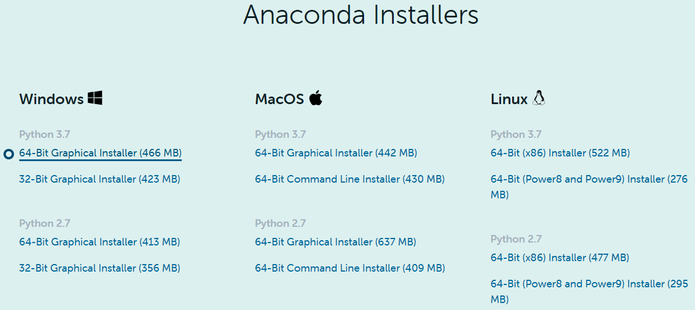

### 아나콘다 설치

Anaconda3-2020.02-Windows-x86_64.exe 파일 마우스 오른쪽 클릭 => 관리자 권한으로 실행

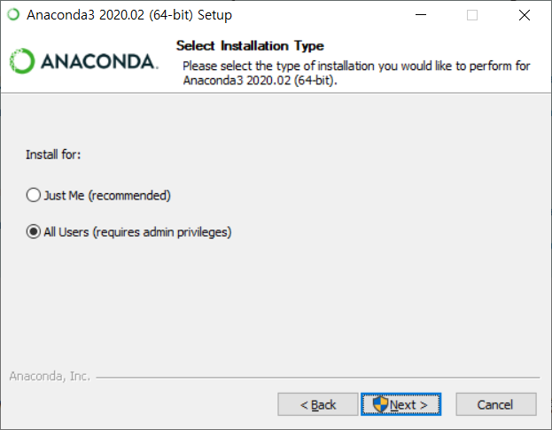

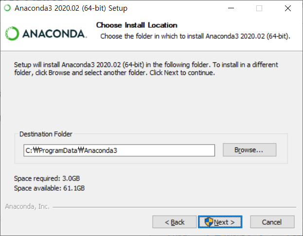

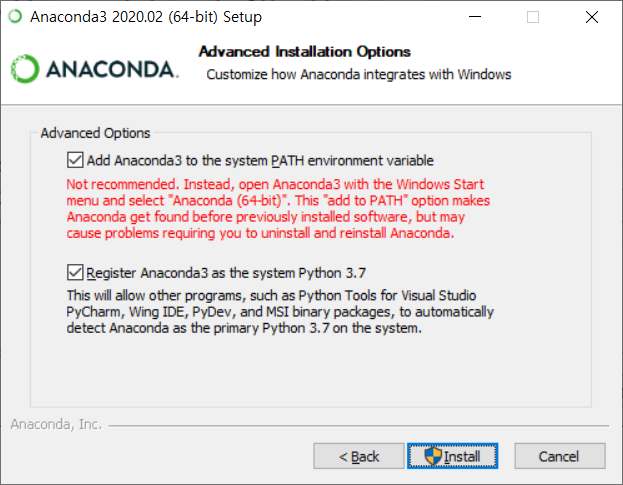

## 파이썬 IDLE 이용하기

C:\ProgramData\Anaconda3\Lib\idlelib

idle.bat 파일 마우스 오른쪽 버튼 클릭 → [보내기(N)] → [바탕 화면에 바로 가기 만들기]

IDLE(Integrated DeveLopment Environment)

## PyCharm을 이용한 개발 환경 구축

https://wikidocs.net/3517

전문 개발자는 보통 통합 개발 환경이라고 하는 IDE(Integrated Development Environment)를 이용해 프로그램을 개발한다.

IDE는 변수나 함수 이름을 자동으로 완성하는 기능을 제공하고 있어 개발자가 더욱 빠르게 코드를 작성할 수 있게 한다.

또한 코드의 실행과 결과 확인을 IDE를 통해 한 번에 처리할 수 있어 편리하다.

작성한 프로그램이 정상적으로 동작하지 않을 때는 디버거(debugger)를 이용해 코드를 쉽게 분석할 수 있는 기능도 제공한다.

최근에는 SVN이나 Git과 같은 버전 관리 시스템도 지원하고 있어 프로그램 개발의 전반적인 과정을 IDE를 통해 모두 처리할 수 있다.

* PyCharm: https://www.jetbrains.com/pycharm/download/

### PyCharm 설치 프로그램 다운로드

PyCharm 다운로드 페이지로 이동 => Community Edition 다운로드

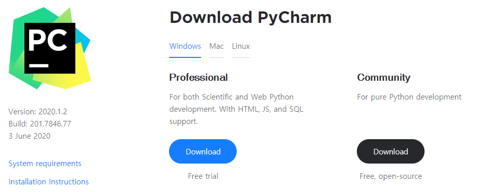

PyCharm은 유료 버전인 Professional Edition과 무료 버전인 Community Edition이 있다.

Professional Edition이 더 많은 기능을 지원하지만 Community Edition도 기본적인 프로그램을 개발하기에는 충분한 기능을 제공한다.

### PyCharm 설치

다운로드한 Community Edition 설치 파일 실행

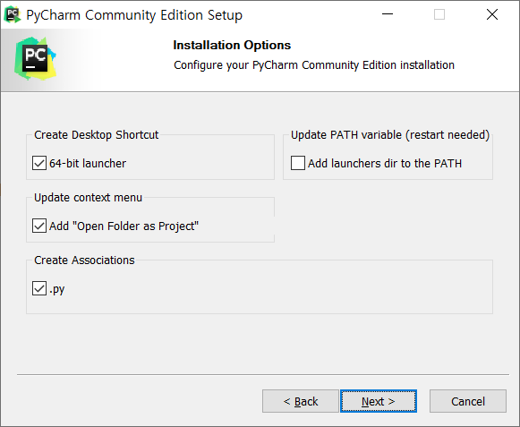

필요한 항목에 체크한 후 [Next] 버튼 클릭

`Create Desktop Shortcut`은 바탕화면에 PyCharm 아이콘을 생성해주는 옵션이다.

`Update context menu`는 마우스 오른쪽 버튼을 누를 때 PyCharm 관련 메뉴가 나타나게 해준다.

`Create Associations`는 확장자가 py인 파일에 대해서 PyCharm으로 실행되도록 해준다.

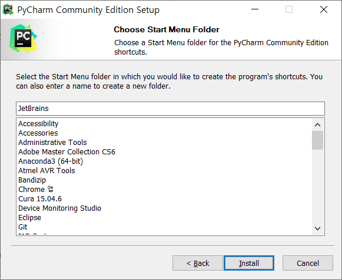

### PyCharm 초기 설정

PyCharm 실행

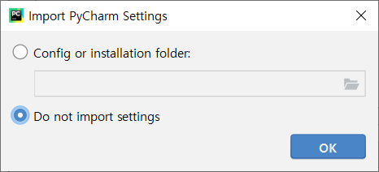

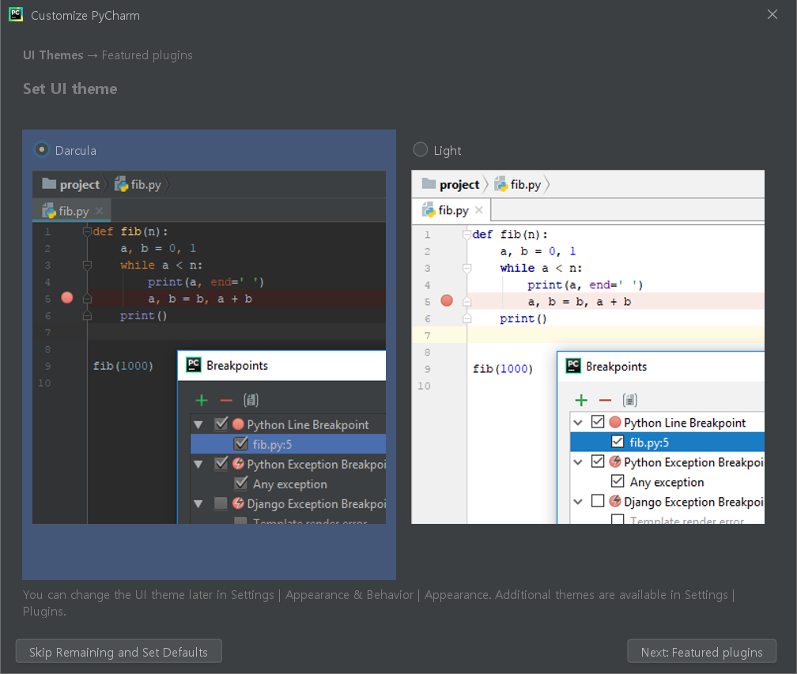

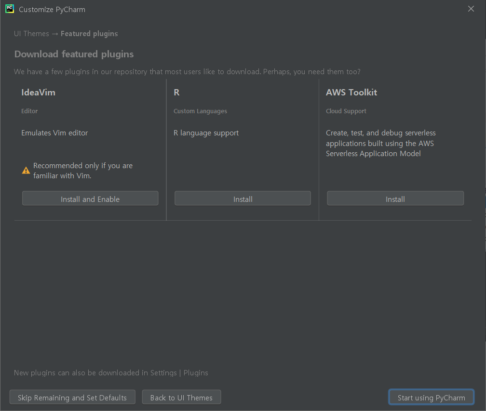

### 프로젝트 생성

PyCharm은 다른 IDE와 마찬가지로 프로젝트 단위로 소스 파일을 관리한다.

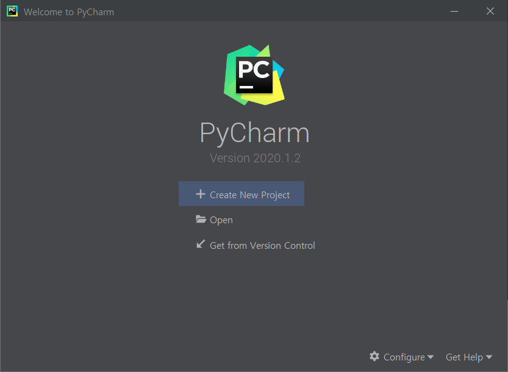

[Create New Project] 클릭

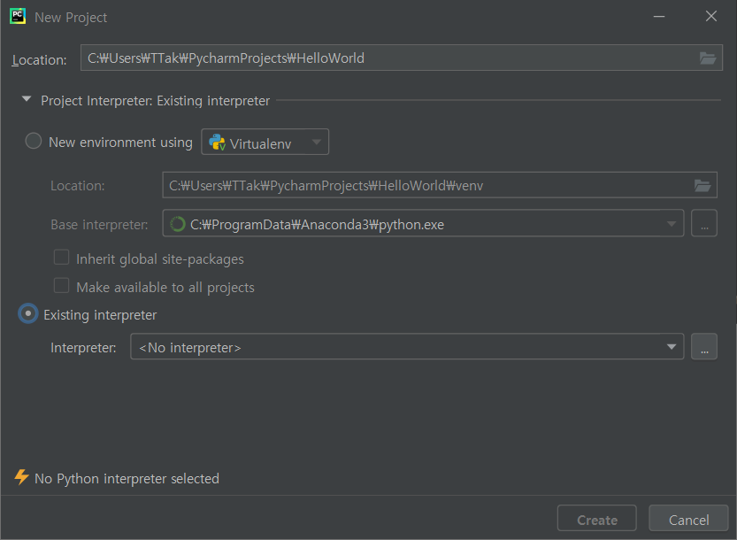

프로젝트 저장 위치와 파이썬 인터프리터를 설정하는 화면

[Location]의 마지막 부분을 ‘HelloWorld’라는 이름으로 변경

Project Interpreter 항목 클릭

Existing interpreter 항목 선택 후 [...] 버튼 클릭

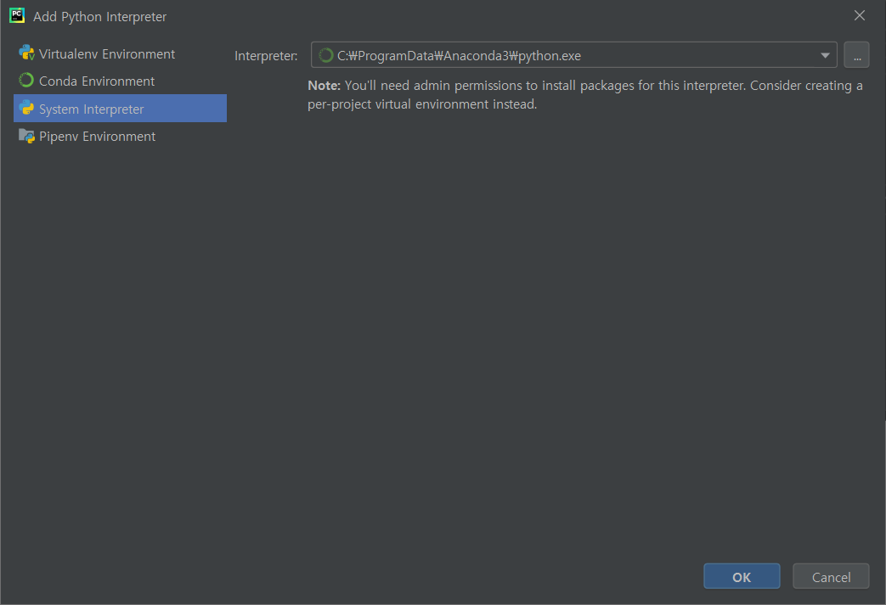

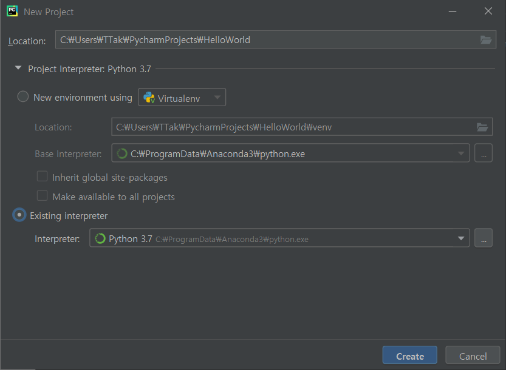

[Create] 버튼을 눌러 프로젝트 생성

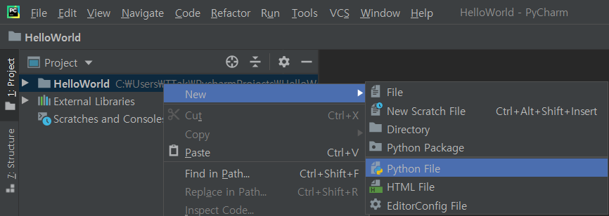

프로젝트에 파이썬 파일 추가

프로젝트명에 마우스 오른쪽 버튼을 클릭한 후 [New]와 [Python File]을 순서대로 클릭

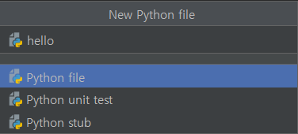

hello.py 파일이 프로젝트에 추가된다.

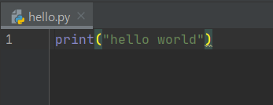

파이썬 코드 작성

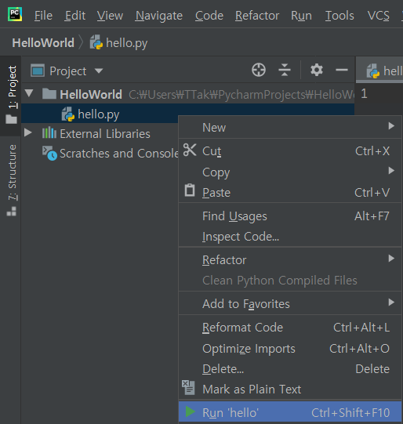

소스코드 마우스 오른쪽 버튼 => [Run]

단축키 Ctrl + Shift + F10

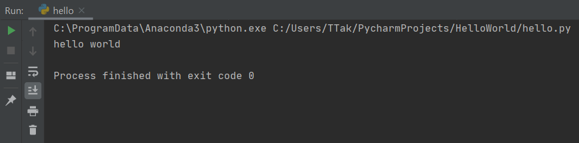

### PyCharm 기타 설정

PyCharm에서 파이썬 인터프리터를 사용하는 기능

[Tools] => [Python of Debug Console]

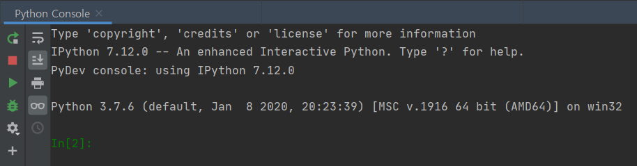

PyCharm의 하단부에 Python IDLE와 같은 파이썬 콘솔(Python Console)이 나타난다.

