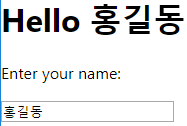

# JavaScript & React review

## JavaScript

#### 식별자

#### 속성, 메소드

#### 속성 : 객체가 가지고 있는 변수


#### 문자열

```javascript
<script>
    console.log('John\'s car');
    console.log("John's car");
    console.log(`John's car`);
</script>
```


#### 비교 연산자

```javascript
console.log(300>200>100);
console.log(300>200 && 200>100);
```


#### Boolean() 함수

0, NaN, null, undefined, '' => false로 변환


```javascript
<script>
    let score = {
        korean : 90,
        math : 100,
        science : 80,
        sum : function() {
            return this.korean + this.math + this.science;
        },
        average : function() {
            return this.sum() / 3;
        }
    };

    console.log(`총점: ${score.sum()}, 평균: ${score.average()}`);
</script>
```


#### 전개 연산자

```javascript
<script>
    function sum(i, j, k, l = 10, m = 20, n = 30) {
        return i + j + k + l + m + n;
    }

    let data = [ 1, 2, 3 ];

    console.log(sum(...data));                // ==> 1 + 2 + 3 + 10 + 20 + 30 = 66
    console.log(sum(...data, ...data));       // ==> 1 + 2 + 3 + 1 + 2 + 3 = 12
    console.log(sum(4, 5, ...data));          // ==> 4 + 5 + 1 + 2 + 3 + 30 = 45
</script>
```


#### jQuery

```javascript
<script>
    // 두번째 xyz의 글자색을 붉은색으로 만드는 jQuery 코드는?
    $(function() {
        $('#a2').css('color', 'red');
        $('#abc #a2').css('color', 'red');
        $('p#a2').css('color', 'red');
        $('.b:odd').css('color', 'red');
        $('div#abc p#a2').css('color', 'red');
    });

    // 문서가 준비되면 콜백 함수를 수행하시오.
    $(document).ready(function() { ... });
    jQuery(document).ready(function() { ... });
    $(function() { ... });
    jQuery(function() { ... });
</script>

<div id="abc">
    <p id="a1" class="b">xyz</p>
    <p id="a2" class="b">xyz</p>
    <p id="a3" class="b">xyz</p>
</div>
```


## React

JSX문법 그대로는 사용 못한다 => 바꿔주는 것이 바벨

웹팩 : 묶어주는 역할

외부 라이브러리(패키지)들을 가져와서 써야한다. 이러한 작업들을 쉽게 할 수 있도록 리액트에서 제공하는 것이 crate-react-app => 웹팩이나 바벨같은 외부패키지로 인한 어려움을 해결하기 위해 제공하는 패키지


p21

npm start : 내가 만든 리액트 앱을 개발 모드로 동작시킴

npm run build : 내가 만든 리액트 앱을 빌드하는 것이다. 배포할 수 있는 형태로 빌드


JSX 구문


부모 컴포넌트로부터 전달된 값을 이용할 때에는 props를 사용한다.

```js
class Car extends React.Component {
    render() {
      return <div>It's { this.props.color } color.</div>;
    }
}

ReactDOM.render(<Car color="red"/>, document.getElementById("root"));

// It's red color. 출력되게 하려면 ___에 어떻게 코딩해야 할까?
```


```js
import React from 'react';
import Todo from './Todo';

class Car extends React.Component {
    render() {
      return <h2>{ this.props.brand.name } { this.props.brand.model }</h2>
    }
}

class Garage extends React.Component {
  render() {
    const carinfo = { name: "SM5", model: "2019" };
    return (
      <div><Car brand={carinfo}/></div>
    );
  }
}

ReactDOM.render(<Garage/>, document.getElementById("root"));

// <div><h2>SM5 2019년식</h2></div>

export default App;
```


---


```js
<form>
    <h1>Hello _____</h1>
    <p>Enter your name: </p>
    <input type="text">
</form>
```


App.js

```js
import React from 'react';

class App extends React.Component {
  state = {
    name: ''
  };
  onChange = e => {
    const name = e.target.value;
    this.setState({name});
  };
  render() {
    return (
      <form>
        <h1>Hello {this.state.name}</h1>
        <p>Enter your name:</p>
        <input type="text" onChange={this.onChange}></input>
      </form>
    );
  }
}

export default App;
```





```js
import React from 'react';

class App extends React.Component {
  state = {
    name: ''
  };
  changeHandler = (event) => {
    const name = event.target.value;
    this.setState({ name });
  }
  render() {
    return (
      <form>
        <h1>Hello {this.state.name}</h1>
        <p style={{ color: 'red', backgroundColor: 'yellow' }}>Enter your name</p>
        <input type="text" onChange={this.changeHandler}></input>
      </form>
    );
  }
}

export default App;
```


title index of

w3school => react 공부


TodoList

플러스 버튼을 눌러 일정 추가 가능

체크박스 누르면 취소선

마이너스 버튼 누르면 화면에서 사라짐

