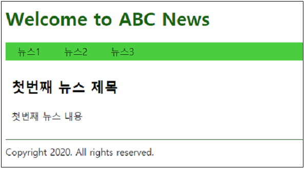
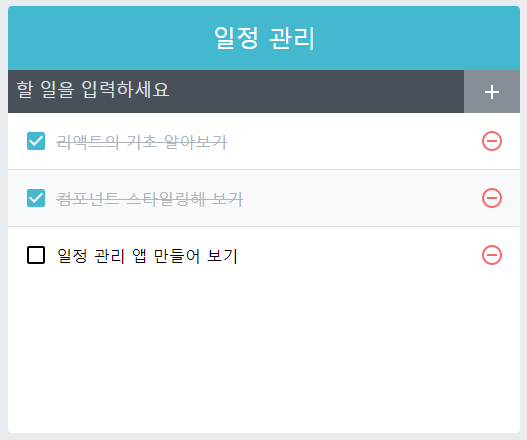

# JavaScript & React Exam


Child.js

```js
import React from 'react';

class Child extends React.Component{
    render(){
        const props = this.props 
        return (
            <p><input value={props.name} onChange={props.onChange} /></p>
        );
    }
}
 
export default Child;
```


```js
import React from 'react';

function Child({name, onChange}) {
    return <p><input value={name} onChange={onChange} /></p>
}
 
export default Child;
```


Parent.js

```js
import React from 'react';
import Child from './Child.js';

class Parent extends React.Component {
    state = {
        name : ''
    };
    
    onChange = e => {
        let { name } = this.state;
        name = e.target.value;
        this.setState( { name } );
    };
    render() {
        return (
            <>
                <h1>My Name is {this.state.name}</h1>
                <Child name={this.state.name} onChange={this.onChange}/>
            </>
        );
    }
}

export default Parent;
```


App.js

```js
import React from 'react';
import Parent from './Parent';

class App extends React.Component {
  render(){
    return (
      <Parent/>
    );
  }
}
export default App;
```


프로젝트 파일 => package.json

```json
{
  "name": "hello-react2",
  "version": "0.1.0",
  "private": true,
  "dependencies": {
    "@testing-library/jest-dom": "^4.2.4",
    "@testing-library/react": "^9.4.0",
    "@testing-library/user-event": "^7.2.1",
    "react": "^16.12.0",
    "react-dom": "^16.12.0",
    "react-scripts": "3.3.1"
  },
  "scripts": {
    "start": "react-scripts start",
    "build": "react-scripts build",
    "test": "react-scripts test",
    "eject": "react-scripts eject"
  },
  "eslintConfig": {
    "extends": "react-app"
  },
  "browserslist": {
    "production": [
      ">0.2%",
      "not dead",
      "not op_mini all"
    ],
    "development": [
      "last 1 chrome version",
      "last 1 firefox version",
      "last 1 safari version"
    ]
  }
}
```

"scripts"

npm start 하면 실제로 "react-scripts start"가 실행된다. => node_modules 아래에 있다.


start : 개발 환경에서 react app을 동작시키는 것

build : 웹 브라우저에서 실행될 수 있도록 하기 위해서는 JSX 문법으로는 사용할 수 없다. js 파일로 바꿔줘야 한다. 형태를 바꾸고 묶어주는 작업을 해야한다. 운영 환경에서 돌아갈 수 있도록 코드를 만들어준다. product 환경

test : 테스트 코드를 실행

eject : react-scripts는 create-react-app에서 정해놓은 구조를 계속 유지해야 한다. 다른 패키지를 더 깔아 쓴다거나 할 때 바꾸는 것이 까다롭다. 바벨은 미리 정해둔 형태가 있다. 내가 프로젝트 환경을 소스코드, 라이브러리, 설정 등을 내 입맛에 맞게 바꾸기 위해서는 create-react-app의 구조를 깨야한다. => eject. 설정 등을 풀어버리는 것.

config와 script라는 디렉터리가 생긴다.

* config
  * Babel
  * WebPack

* script
  * build.js
  * start.js
  * test.js

기능들이 개별 파일로 빠진다.


```js
function hello() {
    return "Hello";
}

let hello = function () {
    return "Hello";
};

let hello = () => {
    return "Hello";
};

let hello = () => "Hello";

hello();
```


return 안에 들어가는 구문은 JSX 구문

JSX 구문은 기본적으로 HTML 태그와 모양이 비슷한데, 거기에 자바스크립트나 값, 연산을 해주려 하면 중괄호를 써야한다. 중괄호를 쓰고 변수, 자바스크립트 문법을 쓴다.

```js
class MyHeader extends React.Compnent {
    render() {
        return (
            <div>
                <h1 style={{color:'red'}}>This color is RED</h1>
			</div>
        );
    }
}
```

밖에 있는 괄호는 JSX 표현식에 사용하는 중괄호.

가운데에 있는 중괄호는 자바스크립트의 객체

```html
<h1 style="color:red; background:black;">This color is RED</h1>
```


필기 시험

5, 13, 16

console.log(undefined == false);

**참고** ⇒ http://www.ecma-international.org/ecma-262/5.1/#sec-11.9.3

---


## Test1

### [실습1] 웹 퍼블리셔를 위한 프론트엔드 기초

\#1 최초 접속 시 뉴스1의 내용을 출력



\#2 메뉴 클릭 시 해당 메뉴의 내용을 출력


test1.html

```html
<html>
<head>
    <script src="https://code.jquery.com/jquery-3.4.1.js"></script>
    <script src="/jquery-ui-1.12.1/external/jquery/jquery.js"></script>
    <script src="/jquery-ui-1.12.1/jquery-ui.js"></script>
    <script>
        $(function() {
            //  TODO #1 "Welcome to ABC News" 텍스트의 색깔을 darkgreen으로 설정
            
            //  TODO #2 뉴스 링크를 클릭하면 해당 뉴스 내용만 표시되도록 기능 추가
            //     <a href="#news1">뉴스1</a> 링크를 클릭하면 
            //     <article id="news1" class="news"> ... </article> 내용만 화면에 표시
            
            //  TODO #3 문서가 로딩되면 뉴스1 메뉴를 클릭하는 코드 추가

            $("body").tabs();
            $("#title").css('color', 'darkgreen');
            $("#tab1").click(function(){
                $("#tab1").css('background-color','darkgreen');
                $("#tab2").css('background-color','limegreen');
                $("#tab3").css('background-color','limegreen');
            });
            $("#tab2").click(function(){
                $("#tab1").css('background-color','limegreen');
                $("#tab2").css('background-color','darkgreen');
                $("#tab3").css('background-color','limegreen');
            });
            $("#tab3").click(function(){
                $("#tab1").css('background-color','limegreen');
                $("#tab2").css('background-color','limegreen');
                $("#tab3").css('background-color','darkgreen');
            });
        });
    </script>
    <style>
        header h1 { font-size: 32px; }
        .menu { background: limegreen; }
        .menu ul { margin: 0; padding: 0; list-style: none;}
	.menu li { float: left; width: auto; }
	.menu ul:after { content: ""; display: block; clear: both; }
	.menu li a { display: block; padding: 5px 20px; color: #000; text-decoration: none; }
        .news { margin: 30px 10px; }
	.news h1 { font-size: 24px; }
	.copyright { border-top: 1px solid darkgreen; padding-top: 10px; }          
    </style>
</head>
<body>
    <header>
        <h1 id="title">Welcome to ABC News</h1>
    </header>
    <nav class="menu">
        <ul>
            <li id="tab1"><a href="#news1">뉴스1</a></li>
            <li id="tab2"><a href="#news2">뉴스2</a></li>
            <li id="tab3"><a href="#news3">뉴스3</a></li>            
        </ul>
    </nav>
    <section id="content">
        <article id="news1" class="news">
            <h1>첫번째 뉴스 제목</h1>
            <p>첫번째 뉴스 내용</p>
        </article>
        <article id="news2" class="news">
            <h1>두번째 뉴스 제목</h1>
            <p>두번째 뉴스 내용</p>
        </article>
        <article id="news3" class="news">
            <h1>세번째 뉴스 제목</h1>
            <p>세번째 뉴스 내용</p>
        </article>
    </section>
    <footer class="copyright">Copyright 2020. All rights reserved.</footer>
</body>
<html>
```


## Test2

### [실습2] 리액트 프로그래밍

지금까지 배운 내용을 기반으로 아래의 조건을 만족하는 프로그램을 완성하시오.

참고 ⇒ https://velopert.com/3480


\#1 프로그램 로딩 시 보유하고 있는 할 일 목록의 내용을 아래와 같은 형식으로 출력




\#2 할 일을 입력하고 (+) 버튼을 클릭하면 할 일이 목록에 추가

#3 할 일 목록에서 (-) 버튼을 클릭하면 해당 일정을 삭제

#4 할 일 목록에서 체크 박스를 클릭하면 해당 할 일을 비활성화(disable) 처리


MyComponent.js

```js
import React from 'react';
import './MyComponent.css';

class MyComponent extends React.Component {
    state = {
        desc: '',
        currentId: 1, 
        todoList: [],
        checked: []
    };

    onAdd = () => {
        const { desc, currentId, todoList, checked } = this.state;
        const todo = { id: currentId, desc, };
        this.setState({
            desc: '',
            currentId: currentId + 1, 
            todoList: [ ...todoList, todo ],
            checked: [ ...checked, false ]
        });
    };

    onDelete = e => {
        const { todoList } = this.state;
        const id = Number(e.target.dataset.id);
        const newTodoList = todoList.filter(todo => todo.id !== id);
        this.setState({ todoList: newTodoList });
    };

    onChangeDesc = e => {
        // this.setState({ desc: e.target.value });
        const desc = e.target.value;
        this.setState({ desc });
    };

    onToggle = e => {
        const { checked } = this.state;
        const id = Number(e.target.dataset.id);
        let selected = checked[id - 1];
        selected = !selected;
        console.log(checked)
        console.log(selected);
        this.setState({
            checked: [
                ...checked.slice(0, id - 1), selected, ...checked.slice(id, checked.length)
            ]
        });
        console.log(this.checked);
    }
    render() {
        const { desc, todoList, checked } = this.state;
        return (
            <main className="todo-list-template">
                <div>
                    <h3 className="title">일정 관리</h3>
                    <section className="from-wrapper">
                    <div className="form">
                        <input type="text" value={desc} onChange={this.onChangeDesc} />
                        <button className="create-button" onClick={this.onAdd}>+</button>
                    </div>
                    </section>
                    <section className="todos-wrapper">
                        <ul>
                            {
                                todoList.map(todo => { 
                                    return (
                                        <ul className='todo-item' key={todo.id}>
                                            <input data-id={todo.id} type='checkbox' onClick={this.onToggle}></input>
                                            <span className={checked[todo.id - 1] ? "checked" : "todo-text"}>{todo.desc}</span>
                                            <button className='create-button' data-id={todo.id} onClick={this.onDelete}>-</button>
                                            <br/>
                                        </ul>
                                    );
                                })
                            }
                        </ul>
                    </section>
                </div>
            </main>
        );
    }
}

export default MyComponent;
```


MyComponent.css

```js
/* TodoListTemplate */

.todo-list-template {
    background: white;
    width: 512px;
    box-shadow: 0 3px 6px rgba(0,0,0,0.16), 0 3px 6px rgba(0,0,0,0.23);
    margin: 0 auto;
    margin-top: 4rem;
  }
  
  .title {
    padding: 2rem;
    font-size: 2.5rem;
    text-align: center;
    font-weight: 100;
    background: #22b8cf;;
    color: white;
  }
  
  .form-wrapper {
    padding: 1rem;
    border-bottom: 1px solid #22b8cf;
  }
  
  .todos-wrapper {
    min-height: 5rem;
  }

/* Form */

  .form {
    display: flex;
  }
  
  .form input {
    flex: 1; /* 버튼을 뺀 빈 공간을 모두 채워줍니다 */
    font-size: 1.25rem;
    outline: none;
    border: none;
    border-bottom: 1px solid #c5f6fa;
  }
  
  .create-button {
    padding-top: 0.5rem;
    padding-bottom: 0.5rem;
    padding-left: 1rem;
    padding-right: 1rem;
    margin-left: 1rem;
    background: #22b8cf;
    border-radius: 3px;
    color: white;
    font-weight: 600;
    cursor: pointer;
  }
  
  .create-button:hover {
    background: #3bc9db;
  }


  /* TodoItem */

  .todo-item {
    padding: 1rem;
    display: flex;
    align-items: center; /* 세로 가운데 정렬 */
    cursor: pointer;
    transition: all 0.15s;
    user-select: none;
  }
  
  .todo-item:hover {
    background: #e3fafc;
  }
  
  /* todo-item 에 마우스가 있을때만 .remove 보이기 */
  .todo-item:hover .remove {
    opacity: 1;
  }
  
  /* todo-item 사이에 윗 테두리 */
  .todo-item + .todo-item {
    border-top: 1px solid #f1f3f5;
  }
  
  
  .remove {
    margin-right: 1rem;
    color: #e64980;
    font-weight: 600;
    opacity: 0;
  }
  
  .todo-text {
    flex: 1; /* 체크, 엑스를 제외한 공간 다 채우기 */
    word-break: break-all;
  }
  
  .checked {
    flex: 1; /* 체크, 엑스를 제외한 공간 다 채우기 */
    text-decoration: line-through;
    color: #adb5bd;
  }
  
  .check-mark {
    font-size: 1.5rem;
    line-height: 1rem;
    margin-left: 1rem;
    color: #3bc9db;
    font-weight: 800;
  }
```


App.js

```js
import React from 'react';
import MyCompoenet from './MyComponent';

class App extends React.Component {
  render(){
    return (
      <MyCompoenet/>
    );
  }
}
export default App;
```


npm run eject를 하기 전 git add . => git commit -m 'commit_message'

