# React

## 진화된 함수형 컴포넌트 : 리액트 훅

5장


Hooks are a new addition in React 16.8. They let you use state and other React features without writing a class.

함수형 컴포넌트에서도 컴포넌트의 **상태값을 관리**할 수 있고, 컴포넌트의 **생명 주기 함수를 이용**할 수 있음


함수로 컴포넌트를 만들면 상태 변수를 가져갈 수 없다는 것과 라이프 사이클 함수를 쓸 수 없다는 것이 걸린다.

리액트 훅은 함수형 컴포넌트에서 클래스형 컴포넌트의 기능을 쓸 수 있도록 해준다.


### React.useState 훅

p217

네이밍이 use로 시작하면 훅이다.


#### 입력창에 입력한 내용(이름)을 화면에 출력하는 프로그램


App.js

```js
import React from 'react';
import Profile from './Profile';

class App extends React.Component {
  render() {
    return <Profile/>
  }
}

export default App;
```


클래스형 컴포넌트 (Profile.js)

```js
import React from 'react';

class Profile extends React.Component {
    state = { name: '' };
    onChange = e => this.setState({ name: e.target.value });
    render() {
        return (
            <>
                <p>{`My name is ${this.state.name}`}</p>
                <p><input type="text" value={this.state.name} onChange={this.onChange}/></p>
            </>
        );
    }
}

export default Profile;
```


함수형 컴포넌트 (Profile.js)

```js
import React, { useState } from 'react';

function Profile() {
    // state = { name: '' };
    // [ 상태값, 상태값변경함수 ] = React.useState(초기값);
    const [ name, setName ] = useState('');
    
    // onChange = e => this.setState({ name: e.target.value });
    return (
        <>
            <p>{`My name is ${name}`}</p>
            <p><input type="text" value={name} onChange={e => setName(e.target.value)}/></p>
        </>
    );
}

export default Profile;
```

상태변수처럼 쓰인다 => 값이 변경되면 렌더링이 된다.


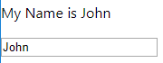


---

#### 아래의 클래스형 컴포넌트를 함수형 컴포넌트로 변경하세요.


클래스형 컴포넌트 (Profile.js)

```js
import React from 'react';

class Profile extends React.Component {
    state = { name: '', age: 0 };
    onChangeName = e => this.setState({ name: e.target.value });
    onChangeAge = e => this.setState({ age: e.target.value });
    render() {
        return (
            <>
                <p>{`이름: ${this.state.name}`}</p>
                <p>{`나이: ${this.state.age}`}</p>
                <p>
                    <input type="text" value={this.state.name} onChange={this.onChangeName}/>
                    <input type="text" value={this.state.age} onChange={this.onChangeAge}/>
                </p>
            </>
        );
    }
}

export default Profile;
```


##### 방법1

함수형 컴포넌트 (Profile.js)

```js
import React, { useState } from 'react';

function Profile() {
    // state = { name: '', age: 0 };
    // [ 상태값, 상태값변경함수 ] = React.useState(초기값);
    const [ name, setName ] = useState('');
    const [ age, setAge ] = useState(0);
    // onChangeName = e => this.setState({ name: e.target.value });
    // onChangeAge = e => this.setState({ age: e.target.value });
    return (
        <>
            <p>{`이름: ${name}`}</p>
            <p>{`나이: ${age}`}</p>
            <p>
                <input type="text" value={name} onChange={e => setName(e.target.value)}/>
                <input type="text" value={age} onChange={e => setAge(e.target.value)}/>
            </p>
        </>
    );
}

export default Profile;
```


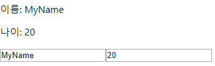


##### 방법2

함수형 컴포넌트 (Profile.js)

```js
import React, { useState } from 'react';

function Profile() {
    /*
        state = { name: '', age: 0 }
    */
    const [ state, setState ] = useState({ name: '', age: 0 });
    return (
        <>
            <p>{`이름: ${state.name}`}</p>
            <p>{`나이: ${state.age}`}</p>
            <p>
                <input type="text" value={state.name} onChange={e => setState({ ...state, name: e.target.value})}/>
                <input type="text" value={state.age} onChange={e => setState({ ...state, age: e.target.value })}/>
            </p>
        </>
    );
}

export default Profile;
```


### React.useEffect 훅

p220


useEffect 훅을 통해서 함수형 컴포넌트에서도 생명 주기 함수를 이용할 수 있다.

코드의 중복이 줄어들고 간략화된다.


p124

componentDidMount

처음으로 렌더링 되었을 때 호출


#### 생명주기 함수를 이용해서 DOM 이외에 상태변수의 값을 출력


##### 클래스형 컴포넌트에서 생명주기 함수를 이용하면 부득이 코드 중복이 발생할 수 있다.

Profile.js

```js
import React from 'react';

class Profile extends React.Component {
    state = { count : 0 };
    onClick = () => { 
        this.setState({ count: this.state.count + 1 });
    };
    componentDidMount() {
        document.title = `현재 클릭 수 : ${this.state.count}`;
    }
    componentDidUpdate() {
        document.title = `현재 클릭 수 : ${this.state.count}`;
    }
    render() {
        return(
            <div>
                <p>현재 클릭 수 : {this.state.count}</p>
                <p><button onClick={this.onClick}>클릭</button></p>
            </div>
        );
    }
}

export default Profile;
```


##### userEffect 훅을 사용하면 코드 중복을 줄이고 간결하게 만들 수 있다.


Profile.js

```js
import React, { useState, useEffect } from 'react';

function Profile () {
    const [ count, setCount ] = useState(0);
    // 렌더링 결과가 실제 돔에 반영된 후 호출되는 훅
    useEffect(() => {
        document.title = `현재 클릭 수 : ${count}`;
    });
    return(
        <div>
            <p>현재 클릭 수 : {count}</p>
            <p><button onClick={() => setCount(count+1)}>클릭</button></p>
        </div>
    );
}

export default Profile;
```


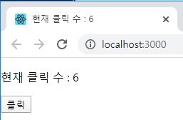


#### 이벤트 처리 함수를 등록, 해제 하는 경우

p222


##### 생명주기 함수를 이용하면 등록과 해제가 분리되어 코드 누락이 발생할 수 있다.

```js
import React, { useState, useEffect } from 'react';

class Profile extends React.Component {
    state = { width: window.innerWidth };

    onResize = () => { 
        this.setState({ width: window.innerWidth });
    };
    //  resize 이벤트 리스너를 등록
    componentDidMount() {
        window.addEventListener('resize', this.onResize);
    }
    //  resize 이벤트 리스너를 해제
    componentWillUnmount() {
        window.removeEventListener('resize', this.onResize);
    }
    render() {
        return <div>{`width is ${this.state.width}`}</div>;
    }
}

export default Profile;
```

resize 이벤트 리스너를 화면이 완성되었을 경우 등록하고, 해당 컴포넌트가 사라졌을 때 해제해야한다.

=> 코드가 길어지면 코드 누락이 발생할 수 있다.


**훅으로 구현**

```js
import React, { useState, useEffect } from 'react';

function Profile() {
    const [ width, setWidth ] = useState(window.innerWidth);
    useEffect(() => {
        const onResize = () => setWidth(window.innerWidth);
        window.addEventListener('resize', onResize);
        return () => window.removeEventListener('resize', onResize);
    }, []);
    return <div>{`width is ${width}`}</div>;
}

export default Profile;
```


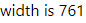


p223

useEffect의 첫 번째 함수 인자의 반환값은 해당 컴포넌트가 사라질 때 마지막에 반환된다.

=> 정상적으로 종료된 경우 호출되는 것이 보장된다.


#### 생명주기 함수에서 API를 호출하는 경우

p221

**MyComponent.js : 클래스형 컴포넌트**

```js
import React from 'react';

class MyComponent extends React.Component {
    state = { user: null };
    //  최초 렌더링 시에 API 호출 
    componentDidMount() {
        const { userId } = this.props;
        getUserApi(userId).then(data => this.setState({ user: data }));
    }
    //  이후 렌더링 시에 API 호출 → 동일한 기능을 중복해서 작성
    componentDidUpdate(prevProps) {
        const { userId } = this.props;
        if (userId !== prevProps.userId) {
            getUserApi(userId).then(data => this.setState({ user: data }));
        }
    }
    render() {
        const { user } = this.state;
        return (
            <div>
                { !user && <p>사용자 정보를 가져오는 중 ...</p> }
                { user && (
                    <>
                        <p>{`name is ${user.name}`}</p>
                        <p>{`age is ${user.age}`}</p>
                    </>
                ) }
            </div>
        );
    }
}
function getUserApi(userId) {
    return Promise.resolve({userId: 123, name: '홍길동', age: 23});
}

export default MyComponent;
```


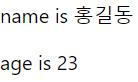


**훅으로 구현**

```js
import React, { useState, useEffect } from 'react';

function MyComponent ({userId}) {
    const [ user, setUser ] = useState(null);
    useEffect(
        () => {
            getUserApi(userId).then(data => setUser(data));
        },
        [ userId ]  // userId가 변경된 것만 호출
    );
    return (
        <div>
            { !user && <p>사용자 정보를 가져오는 중 ...</p> }
            { user && (
                <>
                    <p>{`name is ${user.name}`}</p>
                    <p>{`age is ${user.age}`}</p>
                </>
            ) }
        </div>
    );

}
function getUserApi(userId) {
    return Promise.resolve({userId: 123, name: '홍길동', age: 23});
}

export default MyComponent;
```


useEffect는 생명 주기 함수 대신 사용할 수 있는 API

=> 코드의 중복을 줄일 수 있다.

=> 반드시 생성, 해제가 들어가야 되는 경우에, 해제가 누락되지 않고 반드시 실행되는 것을 보장해준다.


useEffect 훅의 두 번째 매개변수로 배열을 입력하면, 배열의 값이 변경되는 경우에만 함수가 호출된다.


#### 다음 클래스형 컴포넌트를 함수형 컴포넌트로 변경하시오.

Profile.js

```js
import React from 'react';

class Profile extends React.Component {
    state = { user: null, width: window.innerWidth };
    onResize = () => {
        this.setState({ width: window.innerWidth });
    }
    componentDidMount() {
        const { userId } = this.props;
        getUserApi(userId).then(data => this.setState({ user: data }));
        window.addEventListener('resize', this.onResize);
    }
    componentWillUnmount() {
        window.removeEventListener('resize', this.onResize);
    }
    componentDidUpdate(prevProps) {
        const { userId } = this.props;
        if (userId !== prevProps.userId) {
            getUserApi(userId).then(data => this.setState({ user: data }));
        }
    }
    render() {
        const { user, width } = this.state;
        return (
            <div>
                { !user && <p>사용자 정보를 조회 중 입니다.</p> }
                { user && (
                    <>
                        <p>{`user name is ${user.name}`}</p>
                        <p>{`user age is ${user.age}`}</p>
                    </> 
                )}
                <p>{`window width is ${width}`}</p>
            </div>
        );
    }
}
function getUserApi(userId) {
    return Promise.resolve({userId: 123, name: '홍길동', age: 22});
}
export default Profile;
```


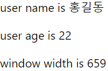


**함수형 컴포넌트로 전환**

Profile.js

```js
import React, { useEffect, useState } from 'react';
 
function Profile ({ userId }) {
    const [ user, setUser ] = useState(null);
    const [ width, setWidth ] = useState(window.innerWidth);

    useEffect(
        () => {
            getUserApi(userId).then(data => setUser(data));
        }, 
        [ userId ]  // userId가 변경된 것만 호출
    );
    useEffect(
        () => { 
            const onResize = () => setWidth(window.innerWidth);
            window.addEventListener('resize', onResize);
            return () => window.removeEventListener('resize', onResize);
        }
    );
    return (
        <div>
            { !user && <p>사용자 정보를 조회 중 입니다.</p> }
            { user && (
                <>
                    <p>{`user name is ${user.name}`}</p>
                    <p>{`user age is ${user.age}`}</p>
                </> 
            )}
            <p>{`window width is ${width}`}</p>
        </div>
    );

}
function getUserApi(userId) {
    return Promise.resolve({userId: 123, name: '홍길동', age: 22});
}
export default Profile;
```


### 커스텀 훅

p225

훅 이름은 "use"로 시작


**창의 너비를 관리하는 커스텀 훅**

useWindowWidth.js

```js
import { useEffect, useState } from 'react';

function useWindowWidth() {
    const [ width, setWidth ] = useState(window.innerWidth);
    useEffect(
        () => {
            const onResize = () => { setWidth(window.innerWidth); };
            window.addEventListener('resize', onResize);
            return () => window.removeEventListener('resize', onResize);
        }
    );
    return width;
}

export default useWindowWidth;
```


Profile.js

```js
import React, { useState } from 'react';
import useWindowWidth from './useWindowWidth';

function Profile ({ userId }) {
    const width = useWindowWidth();
    const [ name, setName ] = useState('');
    return (
        <div>
            <p>{`name is ${name}`}</p>
            <p>{`width is ${width}`}</p>
            { width < 600 && <br/> }
            <input type="text" value={name} onChange={e => setName(e.target.value)} />
        </div>
    );
}
export default Profile;
```


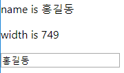


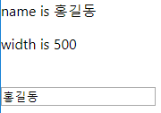


#### 컴포넌트 마운트 여부를 알려주는 훅

useHasMounted.js

```js
import { useEffect, useState } from 'react';

function useHasMounted() {
    const [ hasMounted, setHasMounted ] = useState(false);
    useEffect(
        () => setHasMounted(true)
    );
    return hasMounted;
}

export default useHasMounted;
```


#### useContext 훅

p230

Profile.js

```js
import React from 'react';

function Profile ({ userId }) {
    const user = { name: '홍길동', age: 23 };
    return (
        <div>
            <ParentComponent user={user}/>
        </div>
    );
}

function ParentComponent({user}) {
    return (
        <div><ChildComponent user={user}/></div>
    );
}

function ChildComponent({user}) {
    return (
        <>
        	<p>{`name is ${user.name}`}</p>
        	<p>{`age is ${user.age}`}</p>
        </>
    );
}

export default Profile;
```


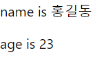


Profile.js

```js
import React, { useContext } from 'react';

const UserContent = React.createContext();

function Profile () {
    const user = { name: '홍길동', age: 23 };
    return (
        <div>
            <UserContent.Provider value={user}>
                <ParentComponent/>
            </UserContent.Provider>
        </div>
    );
}

function ParentComponent() {
    return (
        <div>
            <ChildComponent />
            <ChildComponentWithHook />
        </div>
    );
}

function ChildComponent() {
    return (
        <UserContent.Consumer>
            { user => (
                <>
                	<p>{`name is ${user.name}`}</p>
                	<p>{`age is ${user.age}`}</p>
                </>
            )}
        </UserContent.Consumer>
    );
}

function ChildComponentWithHook() {
    const user = useContext(UserContent);
    return (
        <>
        	<p>{`name is ${user.name}`}</p>
        	<p>{`age is ${user.age}`}</p>
        </>
    );
}

export default Profile;
```


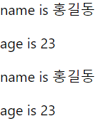


### useRef 훅

p231

ref : DOM 요소를 직접 access 할 때 사용


**클래스형 컴포넌트**

```js
import React from 'react';

class Profile extends React.Component {
    inputEl1 = React.createRef();
    inputEl2 = React.createRef();
    onClick = () => {
        if (this.inputEl1.current) {
            this.inputEl1.current.focus();
        }
    };
    componentDidMount() {
        if (this.inputEl2.current) {
            this.inputEl2.current.focus();
        }
    };
    render() {
        return(
            <div>
                <input ref={this.inputEl1} type="text" value="inputEl1" />
                <input ref={this.inputEl2} type="text" value="inputEl2" />
                <button onClick={this.onClick}>inputEl1으로 포커스 이동</button>
            </div>
        );
    };
}

export default Profile;
```


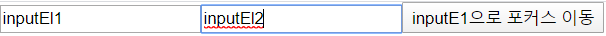


**함수형 컴포넌트**

```js
import React, { useEffect } from 'react';

function Profile () {
    const inputEl1 = React.useRef();
    const inputEl2 = React.useRef();
    const onClick = () => {
        if (inputEl1.current) {
            inputEl1.current.focus();
        }
    };
    useEffect(() => {
        if (inputEl2.current) {
            inputEl2.current.focus();
        }
    });
    return(
        <div>
            <input ref={inputEl1} type="text" value="inputEl1" />
            <input ref={inputEl2} type="text" value="inputEl2" />
            <button onClick={onClick}>inputE1으로 포커스 이동</button>
        </div>
    );

}

export default Profile;
```


포커스를 보내는 것처럼 제어를 할 때 ref를 사용


### react router

설치

npm install react-router-dom


샘플

```js
import React from "react";
import {
    BrowserRouter as Router,
    Switch,
    Route,
    Link
} from "react-router-dom";
import Todo from './Todo';
export default function App() {
    return (
        <Router>
            <div>
                <Link to="/">Home</Link>
                | <Link to="/about">About</Link>
                | <Link to="/users">Users</Link>
                | <Link to="/todo">할일목록</Link>

                <Switch>
                    <Route path="/about"><About /></Route>
                    <Route path="/users"><Users /></Route>
                    <Route path="/todo"><Todo /></Route>
                    <Route path="/"><Home /></Route>
                </Switch>
            </div>
        </Router>
    );
}

function Home() {
    return <h2>Home</h2>;
}

function About() {
    return <h2>About</h2>;
}

function Users() {
    return <h2>Users</h2>;
}
```


