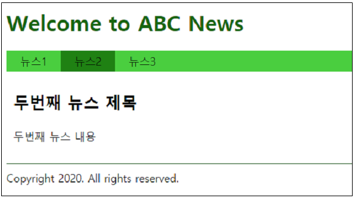

# [실습1] 웹 퍼블리셔를 위한 프론트엔드 기초

제공되는 코드를 이용하여 다음과 같은 기능을 완성하시오.


```html
<html>
<head>
    <script src="https://code.jquery.com/jquery-3.4.1.js"></script>
    <script>
        $(function() {
            //  TODO #1 "Welcome to ABC News" 텍스트의 색깔을 darkgreen으로 설정
            
            //  TODO #2 뉴스 링크를 클릭하면 해당 뉴스 내용만 표시되도록 기능 추가
            //     <a href="#news1">뉴스1</a> 링크를 클릭하면 
            //     <article id="news1" class="news"> ... </article> 내용만 화면에 표시
            
            //  TODO #3 문서가 로딩되면 뉴스1 메뉴를 클릭하는 코드 추가

        });
    </script>
    <style>
        header h1 { font-size: 32px; }
        .menu { background: limegreen; }
        .menu ul { margin: 0; padding: 0; list-style: none;}
	  .menu li { float: left; width: auto; }
	  .menu ul:after { content: ""; display: block; clear: both; }
	  .menu li a { display: block; padding: 5px 20px; color: #000; text-decoration: none; }
        .news { margin: 30px 10px; }
	  .news h1 { font-size: 24px; }
	  .copyright { border-top: 1px solid darkgreen; padding-top: 10px; }          
    </style>
</head>
<body>
    <header>
        <h1>Welcome to ABC News</h1>
    </header>
    <nav class="menu">
        <ul>
            <li><a href="#news1">뉴스1</a></li>
            <li><a href="#news2">뉴스2</a></li>
            <li><a href="#news3">뉴스3</a></li>            
        </ul>
    </nav>
    <section id="content">
        <article id="news1" class="news">
            <h1>첫번째 뉴스 제목</h1>
            <p>첫번째 뉴스 내용</p>
        </article>
        <article id="news2" class="news">
            <h1>두번째 뉴스 제목</h1>
            <p>두번째 뉴스 내용</p>
        </article>
        <article id="news3" class="news">
            <h1>세번째 뉴스 제목</h1>
            <p>세번째 뉴스 내용</p>
        </article>
    </section>
    <footer class="copyright">Copyright 2020. All rights reserved.</footer>
</body>
<html>
```


\#1 최초 접속 시 뉴스1의 내용을 출력


\#2 메뉴 클릭 시 해당 메뉴의 내용을 출력




### [실습1] 문제 풀이


\#1 "Welcome to ABC News" 텍스트의 색깔을 darkgreen으로 설정

\##1 CSS를 이용하는 방법

```css
header h1 { font-size: 32px; color: darkgreen; }
```


\##2 jquery의 css() 메소드를 이용하는 방법

```javascript
$('header h1').css('color', 'darkgreen');
```


\#2 뉴스 링크를 클릭하면 해당 뉴스 내용만 표시되도록 기능 추가

\##1 show/hide 메소드 이용

```javascript
$('a').click(function() {
    $('.news').hide();
    $($(this).attr('href')).show();
});
```


\##2 스타일 이용

```javascript
$('a').click(function() {
    $('.news').css('display','none');
    $($(this).attr('href')).css('display','');
});
```


\#3 문서가 로딩되면 뉴스1 메뉴를 클릭하는 코드 추가

##1 필터 사용

```javascript
$('a:first').trigger('click');
```


\##2 속성 선택자 사용

```javascript
$('a[href="#news1"]').trigger('click');
```

