# React


* 프로퍼티(props) -> 속성
  * 부모 컴포넌트가 자식 컴포넌트에게 물려준 값
* 상태(state)
  * 자신이 가지고 있는 값


* 객체(class)
  * 속성(property)
  * 동작(method)


* 모든 class들은 자기 내부에 값(state)을 가지고 있다.


* 데이터만 교환해 클라이언트(브라우저)에서 사용자에게 보여준다.
* 클라이언트 화면에서 쉽게 데이터를 가져오고 가져온 데이터를 보여주는 프레임워크, 라이브러리가 나오게 되었다.
* 리액트는 UI에 특화. 사용자가 데이터를 입력하고, 입력된 데이터를 보는 것에 특화되어있다.
* 그 이외의 기능들은 개발자가 다 해줘야한다.
* UI를 제외한 나머지는 개발자가 다 해야 하니까 개발 공수가 많아진다. 처음 리액트를 시작하는 사람에게는 어려움으로 다가온다. 진입 장벽이 높다.


* create-react-app : 리액트의 진입 장벽을 낮추기 위해 제공. 쉽게 리액트를 쓸 수 있도록 도와준다.


* create-react-app을 쓰지 않고 React 아랫단에 있는 라이브러리를 가지고 직접 코딩해보기


### 작업 디렉터리 생성

##### 1 명령 프롬프트(cmd.exe) 실행


##### 2 작업 디렉터리 생성 및 이동

```bash
C:\Users\HPE>mkdir C:\react

C:\Users\HPE>cd C:\react

C:\react>
```


##### 3 Visual Studio Code 실행


##### 4 File > Open Folder … > C:\react 를 선택 후 Open


##### 5 create-react-app 패키지 설치

```bash
C:\react>npm install -g create-react-app
C:\Users\HPE\AppData\Roaming\npm\create-react-app -> C:\Users\HPE\AppData\Roaming\npm\node_modules\create-react-app\index.js
+ create-react-app@3.3.1
added 99 packages from 47 contributors in 9.907s
```


##### 6 create-react-app으로 리액트 프로젝트 생성

```bash
C:\react>create-react-app hello-react
...
Success! Created hello-react at C:\react\hello-react
Inside that directory, you can run several commands:

  npm start
    Starts the development server.

  npm run build
    Bundles the app into static files for production.

  npm test
    Starts the test runner.

  npm run eject
    Removes this tool and copies build dependencies, configuration files
    and scripts into the app directory. If you do this, you can’t go back!

We suggest that you begin by typing:

  cd hello-react
  npm start

Happy hacking!
```


* 개발 환경 실행, 빌드, 테스트...

* p21~25

* create-react-app

* `npm start` : 개발 서버 띄우기. 개발 서버로 동작. 자동으로 웹 브라우저를 실행해준다.

* `npm run build` : 자바 스크립트를 빌드. 자바 스크립트는 브라우저에 있으면 로딩되어서 실행된다. 리액트를 사용하면 자바 스크립트에 여러 버전이 있는데 실행 환경에 맞도록 바꿔주는 역할을 한다. transcompiler

* `npm run eject` : 분리하는 것. 파일이 크면 그 파일을 다 내려받아서 로딩하는데 시간이 많이 걸리니까 필요한 만큼 나누는 작업을 한다.


##### 7 디렉터리 이동 후 실행

```bash
C:\react>cd hello-react
C:\react>npm start
```


* boot-strap : 뭔가를 하려 할 때 기본이 되는 요소, 환경들을 잡아주는 작업. 마중물


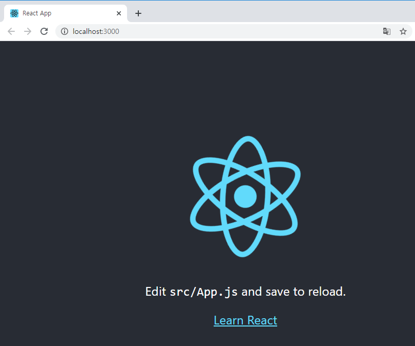


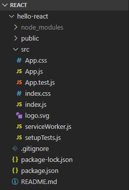


* create-react-app을 이용해 boot-strap 한다. 디렉터리 구조, react를 사용하기 위한 기본적인 라이브러리도 가져오고, 개발에 도움되는 sample code도 가져온다. App.js 파일을 수정하면 쉽게 앱을 만들 수 있다.


* `App.js`
  * 함수가 반환하는 것이 우리가 알고 있는 HTML 문서처럼 보인다.
  * 기존에는 없던 중괄호가 곳곳에 보인다는 차이점이 있다.
  * 이러한 문법을 jsx 라고 한다. jsx 표기법을 이용해 만들어진 코드


* UI란 어떤 화면의 상태. 값이 바뀌었을 때 랜더링 되어서 화면에 보여지는 것.

* 사용자가 action을 가했을 때 상태가 바뀐다. 마우스를 누르거나 키보드 입력, ajax 통신을 통해 데이터를 가져왔을 때.

* 바뀐 상태를 쉽게 적용할 수 있도록 하는 것이 react이다.


* p2

* 가상돔. DOM. 문서 객체 모델

* 문서를 통으로 다 업데이트 하는 것이 아니라 전체 문서 중 변경된 부분만 감지해서 바꿔치기한다. 문서 전체에 대한 변경보다는 빠르고 효율적으로 변경을 반영할 수 있다.


### 리액트 개발 환경 직접 구축 => 외부 패키지를 사용하지 않고 리액트 웹 페이지 제작

p3

##### 1 작업 디렉터리 생성 

C:\react\hello-world


##### 2 리액트 라이브러리 다운로드 -> C:\react\hello-world 디렉터리 아래에 저장 

https://unpkg.com/react@16.12.0/umd/react.development.js

https://unpkg.com/react@16.12.0/umd/react.production.min.js

https://unpkg.com/react-dom@16.12.0/umd/react-dom.development.js

https://unpkg.com/react-dom@16.12.0/umd/react-dom.production.min.js


4개 파일 모두 다운로드

마우스 오른쪽 클릭 -> 다른 이름으로 저장 -> C:\react\hello-world 에 저장


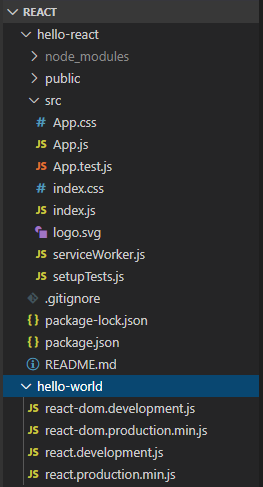


파일의 유형이 2가지로 나눠진다.

`development` : 개발 환경 용도이다.

개발 환경에서 사용한다는 것은 애러 메시지와 같은 것들이 확인 가능하다.

문제를 쉽게 찾을 수 있도록 해준다.


`development` : 개발 환경에서 사용하는 파일 → 에러 메시지 확인이 가능

`production` : 실행(배포) 환경에서 사용하는 파일


`react` : 플랫폼 구분 없이 공통으로 사용되는 파일 (리액트 코어)

`react-dom` : 웹 환경에서 사용되는 파일


##### 3 c:\react\hello-world\sample1.html, c:\react\hello-world\sample1.js 파일 생성

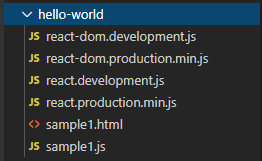


##### 4 아래 화면과 같은 출력을 제공하는 sample1.html 작성

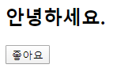


"좋아요" 상태에서 버튼을 클릭하면 "좋아요 취소"로 변경


sample1.html

```html
<!-- P5 코드 1-1 -->
<html>
    <body>
        <h2>안녕하세요. 이 프로젝트가 마음에 드시면 좋아요 버튼을 눌러 주세요.</h2>
        <div id="react-root"></div>
        <script src="react.development.js"></script>
        <script src="react-dom.development.js"></script>
        <script src="sample1.js"></script>
    </body>
</html>
```


##### 4-1 react를 사용하지 않고 처리

```html
<!-- P5 코드 1-1 -->
<html>
    <body>
        <h2>안녕하세요. 이 프로젝트가 마음에 드시면 좋아요 버튼을 눌러 주세요.</h2>
        <div id="react-root">
            <button>좋아요</button>
        </div>
        <script src="react.development.js"></script>
        <script src="react-dom.development.js"></script>
        <script src="sample1.js"></script>
    </body>
</html>
```


##### 5 http-server를 실행해서 확인

##### 5-1 http-server 실행 ⇒ C:\react>npx http-server -c-1

##### 5-2브라우저로 접속 ⇒ http://localhost:8080/hello-world/sample1.html

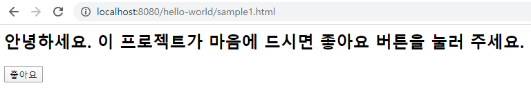


https://jquery.com/

download -> Google CDN -> jQuery -> 3.x snippet

https://developers.google.com/speed/libraries#jquery

```html
<!-- P5 코드 1-1 -->
<html>
    <body>
        <h2>안녕하세요. 이 프로젝트가 마음에 드시면 좋아요 버튼을 눌러 주세요.</h2>
        <div id="react-root">
            <button>좋아요</button>
        </div>
        <!--
            <script src="react.development.js"></script>
            <script src="react-dom.development.js"></script>
            <script src="sample1.js"></script>
        -->
        <script src="https://ajax.googleapis.com/ajax/libs/jquery/3.4.1/jquery.min.js"></script>
        <script>
            $(function() {
                $('button').click(function() {
                    if($(this).text() == '좋아요'){
                        $(this).text('좋아요 취소');
                    } else {
                        $(this).text('좋아요');
                    }
                });
            });
        </script>
    </body>
</html>
```


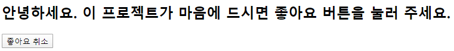


화면에 가지고 있는 어떤 값이 바꼈을 때 그에 따라 화면 출력을 다르게 해주는 것은 복잡할 수 있다.


```javascript
<!-- P5 코드1-1 -->
<html>
    <body>
        <h2>프로젝트가 마음에 들면 좋아요 버튼을 클릭해 주세요</h2>
        <div id="react-root">
            <button>좋아요</button> <!-- #1 -->
        </div>

        <!-- jQuery 기반으로 구현 -->
        <script src="https://ajax.googleapis.com/ajax/libs/jquery/3.4.1/jquery.min.js"></script>
        <script>
            $(function() {
                //  liked 변수의 값이 false 이면 좋아요 취소
                //                   true 이면 좋아요 
                //  버튼을 클릭하면 liked 변수의 값은 토글
                let liked = false; /* #2 */
                $('button').click(function() {
                    liked = !liked;
                    if (liked) $(this).text('좋아요');
                    else $(this).text('좋아요 취소');
                });
                    
                $('button').trigger('click'); /* #3 */
            });  
        </script>
    </body>
</html>

```

⇒ 상태값(#1)과 사용자 화면(#2)의 불일치가 발생

⇒ 이를 보완하기 위해 #3와 같은 코드가 추가되어야 함


버튼을 클릭하면 true이기 때문에 좋아요가 된다.

화면에 표시되는 좋아요라는 상태와 가지고 있는 값이 맞지 않아서 오류가 발생했었다. 해당하는 코드가 가지고 있는 상태와 사용자 화면에 보이는 UI가 맞아 떨어지지 않는다. 상태는 false값을 가지고 있는데 화면에는 좋아요가 표시되는 경우가 있다. 처음 화면을 만들 때 클릭을 하도록 만들어서 현재 liked의 상태를 가지고 화면이 다시 구성 되도록 할 수 있다.

```html
<button>좋아요</button>
...
let liked = false;
```

상태 값에 따라 사용자 화면이 다르게 보인다. 랜더링 된다.(render)

기존 방식대로 하면 보여지는 화면과 값 자체가 따로 놀아서 불일치가 발생할 수 있다.

상태와 화면의 불일치. 이런 것들을 바로잡아주기 위해서 추가적인 코드라 필요하다.

이런 것들을 보완하기 위해서 상태와 화면을 하나로 묶어서 상태가 바뀌면 화면이 자동으로 랜더링 되도록 하는 기능을 리액트가 제공한다.


데이터와 동작이 같이 움직이도록 하자. 동작 중 하나가 사용자 화면에 보여주는 것. render.

데이터가 바뀌면 render를 통해 화면을 바꾼다. 상태가 예기치 않게 바뀌더라도 화면에는 상태에 맞는 값이 보여질 수 있다.


p6 코드 1-2

React.Component를 상속받아 LikeButton라는 class를 만들었다.

앞에서는 변수는 변수대로, 변수의 상태를 바꿔주는 것은 이벤트 핸들러가 해주고, 변수의 상태에 따라 화면을 랜더링하는 등 따로 놀았다.

render 함수가 하나로 묶여있다. -> class

class 형태로 정의되어있는 형태를 컴포넌트라고 한다. 데이터와 데이터에 대한 처리를 한번에 묶어 둔 것

class라는 키워드를 이용해 컴포넌트를 정의한다.


React.Component에 기본적인 동작 수행들이 다 정의되어 있다. react가 정의해 둔 것을 확장해서 LikeButton을 만든다.


constructor : 생성자

LikeButton이 처음 생성될 때 한 번 호출된다. 일반적으로 생성자는 초기화 모듈이 들어간다. 컴포넌트에 정의되어 있는 값을 최초로 실행해 주는 것.

super는 내가 extent한 상위 컴포넌트를 초기화해준다. 내가 초기화되기 위해서는 항상 부모 컴포넌트부터 초기화

state라는 변수를 정의.

`props` : 부모로 부터 전달받은 값

`state` : 자기 자신이 가지고 있는 값

render는 사용자 화면에 보여주는 내용들이다. return 해서 던지는 것이 element는 요소(태그)이다. 태그를 만들어준다. 리액트에서 태그를 만들어서 주는 것이 createElement이다. 첫 번째 매개변수는 일반적으로 문자열이나 리액트 컴포넌트이다.

랜더링이 되어지는 시점에 만들어진 text -> 버튼 사이에 들어가는 값이 '좋아요' 또는 '좋아요 취소'가 된다.

상태 변수의 값을 바꿀 때에는 setState라는 매소드를 이용해야한다.

상태 변수의 liked라는 값을 false에서 true로 바꾼다.

이것을 사용자 화면에 뿌려줘야 한다. ReactDOM.render 함수를 이용. 화면에 보여줄 element가 거기에 들어간다.

해당하는 문서에서 id가 react-root인 것을 가져온다. 즉, 해당하는 문서에 LikeButton을 만들어 집어넣는다.


계속 토글되게 하려면 가지고 있는 상태변수 값만 바꾸면 된다.


```javascript
<!-- P5 코드 1-1 -->
<html>
    <body>
        <h2>안녕하세요. 이 프로젝트가 마음에 드시면 좋아요 버튼을 눌러 주세요.</h2>
        <div id="react-root"></div>
        <script src="react.development.js"></script>
        <script src="react-dom.development.js"></script>
        <script>
            // P6 코드1-2
            class LikeButton extends React.Component {
                constructor(props) {
                    super(props);
                    this.state = { liked: false };
                }
                render() {
                    const text = this.state.liked ? '좋아요 취소' : '좋아요';
                    return React.createElement(
                        'button',
                        /*
                        { onClick: () => this.setState({ liked: true }) },
                        */
                        { onClick: () => this.setState({ liked: !this.state.liked }) },
                        text,
                    );
                }
            }
            const domContainer = document.querySelector('#react-root');
            ReactDOM.render(React.createElement(LikeButton), domContainer);
        </script>
    </body>
</html>
```


onClick : 객체의 속성. createElement의 두 번째 인자의 메소드

화살표 함수. 리액트에서는 함수형 프로그래밍을 쓰는 것이 좋다.


```javascript
<!-- P5 코드 1-1 -->
<html>
    <body>
        <h2>안녕하세요. 이 프로젝트가 마음에 드시면 좋아요 버튼을 눌러 주세요.</h2>
        <div id="react-root"></div>
        <script src="react.development.js"></script>
        <script src="react-dom.development.js"></script>
        <script>
            // P6 코드1-2
            class LikeButton extends React.Component {
                constructor(props) {
                    super(props);
                    this.state = { liked: false };
                }
                render() {
                    const text = this.state.liked ? '좋아요 취소' : '좋아요';
                    return React.createElement(
                        'button',
                        /*
                        { onClick: () => this.setState({ liked: true }) },
                        */
                        { onClick: () => {
                            console.log(this.state.liked);
                            this.setState({ liked: !this.state.liked });
                        } },
                        text,
                    );
                }
            }
            const domContainer = document.querySelector('#react-root');
            ReactDOM.render(React.createElement(LikeButton), domContainer);
        </script>
    </body>
</html>
```


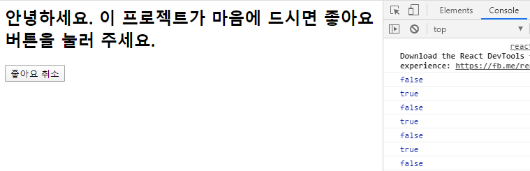

상태와 render가 같이 움직인다.


##### 6 여러 개의 돔 요소를 랜더링

p7 하단

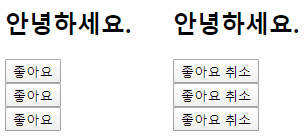


##### 6-1 jQuery를 이용한 구현 (#4-1 코드를 응용)


```javascript
<html>
    <body>
        <h2>프로젝트가 마음에 들면 좋아요 버튼을 클릭해 주세요</h2>
        <div id="react-root">
            <button id="btn1">좋아요</button><br>
            <button id="btn2">좋아요</button><br>
            <button id="btn3">좋아요</button>
        </div>

        <!-- jQuery 기반으로 구현 -->
        <script src="https://ajax.googleapis.com/ajax/libs/jquery/3.4.1/jquery.min.js"></script>
        <script>
            $(function() {
                //  liked 변수의 값이 false 이면 좋아요 취소
                //                   true 이면 좋아요 
                //  버튼을 클릭하면 liked 변수의 값은 토글
                let liked1 = false;
                let liked2 = false;
                let liked3 = false;
                $('button#btn1').click(function() {
                    liked1 = !liked1;
                    if (liked1) $(this).text('좋아요');
                    else $(this).text('좋아요 취소');
                });
                $('button#btn2').click(function() {
                    liked2 = !liked2;
                    if (liked2) $(this).text('좋아요');
                    else $(this).text('좋아요 취소');
                });
                $('button#btn3').click(function() {
                    liked3 = !liked3;
                    if (liked3) $(this).text('좋아요');
                    else $(this).text('좋아요 취소');
                });
                    
                $('button#btn1').trigger('click');
                $('button#btn2').trigger('click');
                $('button#btn3').trigger('click');
            });  
        </script>
    </body>
</html>
```


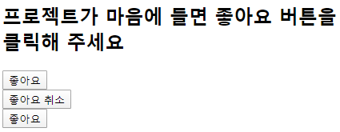


jQuery를 이용했을 때 동일한 코드를 반복해야 하는 문제가 있다.


```javascript
<!-- P5 코드 1-1 -->
<html>
    <body>
        <h2>안녕하세요. 이 프로젝트가 마음에 드시면 좋아요 버튼을 눌러 주세요.</h2>
        <div id="react-root1"></div>
        <div id="react-root2"></div>
        <div id="react-root3"></div>
        <script src="react.development.js"></script>
        <script src="react-dom.development.js"></script>
        <script>
            // P6 코드1-2
            class LikeButton extends React.Component {
                constructor(props) {
                    super(props);
                    this.state = { liked: false };
                }
                render() {
                    const text = this.state.liked ? '좋아요 취소' : '좋아요';
                    return React.createElement(
                        'button',
                        /*
                        { onClick: () => this.setState({ liked: true }) },
                        */
                        { onClick: () => this.setState({ liked: !this.state.liked }) },
                        text,
                    );
                }
            }
            ReactDOM.render(React.createElement(LikeButton), document.querySelector('#react-root1'));
            ReactDOM.render(React.createElement(LikeButton), document.querySelector('#react-root2'));
            ReactDOM.render(React.createElement(LikeButton), document.querySelector('#react-root3'));
        </script>
    </body>
</html>
```

LikeButton라는 개별적인 인스턴스를 집어넣어주기만 하면 데이터나 함수를 개별적으로 동작시키는 것이 가능

component 기반

기존의 코딩하는 방식과 리액트를 기반으로 했을 때의 코딩 방식의 차이점을 인식하자.


#### 바벨(babel) 사용

p9

* 자바스크립트 코드를 변환해주는 컴파일러이다.
* 기존에 있던 자바스크립트 문법을 이용하려 하면 굉장히 복잡해지는 것이 있는데, 그런 것들을 쉽게 하기 위해서 새로운 형태의 문법을 만드는 경우가 있다.
* 새로운 형태의 문법을 만들면 이 문법이 자바스크립트가 동작하는 환경에서 사용하려면 해석을 해야한다. 해당하는 실행 환경들이 커진다. 항상 표준이 있고 응용이 있다. 응용들이 표준에 맞도록 바꿔지기만 한다면 실행 환경은 표준에 맞는 실행 환경만 있으면 된다. 바벨이 그런 역학들을 한다. 어떤 표준 자바스크립트 포맷이 있으면 표준 자바스크립트로 표현하기 어려운 것들을 새로운 문법으로 만든다. 그것을 표준에 맞게 바꿔주는 것이 바벨. 버전이 높은 것들로 만들었을 떄, 낮은 버전에서도 돌아가게 만들어주는 것이 바벨이다. 실행환경, 런타임에 맞게 바꿔주는 것이 바벨이다.
* 바벨 : 여러가지 다양한 구현 언어들을 특정 시점의 실행 환경으로 맞춰주는 것
* 바벨을 이용하면 브라우저에서 지원하지 않는 새로운 문법들도 사용할 수 있다.
* 코드에서 주석을 제거하거나 코드를 압축하는 용도로 사용될 수 있다.
* 일반적인 컴파일러는 바이너리 코드를 만드는 것을 컴파일러라고 한다.
* 여기서는 형태가 바뀌는 것이다.
* 바벨은 높은 버전(ES6...)의 자바스크립트나 다른 형태의 자바스크립트(TypeScript) 코드를 현재 많이 쓰는 환경(ES5)에서 돌아가도록 해준다. 형태를 바꾼다. 바꾸는 과정에서 코드가 실행되는데 불필요한 요소를 제거할 수 있다. 주석문, 공백 제거
* React, JSX 문법을 이용해 표준 자바스크립트 문법으로 바꿔버린다.
* 프리셋(p13)
* 바벨에다가 원본을 해석할 수 있는 것을 꽂는다. 그것을 플러그인 이라고 한다.


##### 1 증가, 감소 버튼으로 count 상태값을 변경하는 코드를 작성

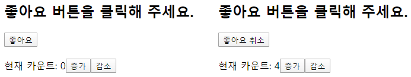


```javascript
<div id="react-root">
	<H1>좋아요 버큰을 클릭해 주세요.</H1>
	<div>
		<button …> … </button> ⇐ LikeButton
		<div>
			<span>현재 카운트: </span>
			<span>0</span>
			<button>증가</button>
			<button>감수</button>
		</div>
	</div> ⇐ Container
</div>
```


##### 1-1 템플릿

```javascript
<html>
    <body>
        <h2>프로젝트가 마음에 들면 좋아요 버튼을 클릭해 주세요</h2>
        <div id="react-root"></div>

        <script src="react.development.js"></script>
        <script src="react-dom.development.js"></script>
        <script>
            class LikeButton extends React.Component {
                constructor(props) {
                    super(props);
                    this.state = { liked: false };
                }
                render() {
                    const text = this.state.liked ? '좋아요 취소' : '좋아요';
                    return React.createElement(
                        'button', 
                        { onClick: () => this.setState({ liked: !this.state.liked }) },
                        text,
                    );
                }
            }

            ReactDOM.render(
                React.createElement(LikeButton), 
                document.querySelector('#react-root')
            );
        </script>
    </body>
</html>
```


##### 1-2 React.createElement 메소드를 이용해서 구현

→ 문서의 구조 및 엘리먼트의 포함 관계 등을 이해하기 어려움

→ 문서의 구조와 엘리먼트의 포함 관계를 쉽게 표현하고 파악할 수 있는 표현식이 필요 ⇒ JSX

⇒ JSX로 작성한 코드를 바벨을 이용해서 React.createElement 메소드 형식으로 트랜스 컴파일

```javascript
<html>
    <body>
        <h2>프로젝트가 마음에 들면 좋아요 버튼을 클릭해 주세요</h2>
        <div id="react-root"></div>

        <script src="react.development.js"></script>
        <script src="react-dom.development.js"></script>
        <script>
            class LikeButton extends React.Component {
                constructor(props) {
                    super(props);
                    this.state = { liked: false };
                }
                render() {
                    const text = this.state.liked ? '좋아요 취소' : '좋아요';
                    return React.createElement(
                        'button', 
                        { onClick: () => this.setState({ liked: !this.state.liked }) },
                        text,
                    );
                }
            }
            // P9 코드1-6 참조
            class Container extends React.Component {
                constructor(props) {
                    super(props);
                    this.state = { count: 0 };
                }
                render() {
                    return React.createElement(
                        'div',
                        null, 
                        React.createElement(LikeButton), 
                        React.createElement(
                            'div',
                            { style: { marginTop: 20 } }, 
                            React.createElement('span', null, '현재 카운트: '),
                            React.createElement('span', null, this.state.count), 
                            React.createElement(
                                'button', 
                                { onClick: () => this.setState({ count: this.state.count + 1 })},
                                '증가',
                            ),
                            React.createElement(
                                'button', 
                                { onClick: () => this.setState({ count: this.state.count -1 })},
                                '감소',
                            ),
                        ),
                    );
                }
            }
            ReactDOM.render(
                React.createElement(Container), 
                document.querySelector('#react-root')
            );
        </script>
    </body>
</html>
```


##### 1-3 JSX 버전으로 변경

C:\react\hello-world\sample4.html

```javascript
<html>
    <body>
        <h2>프로젝트가 마음에 들면 좋아요 버튼을 클릭해 주세요</h2>
        <div id="react-root"></div>

        <script src="react.development.js"></script>
        <script src="react-dom.development.js"></script>
        <script src="sample4.js"></script>
    </body>
</html>
```


C:\react\hello-world\src\sample4.js (수정 전: #1-2 코드 일부를 이전)

```javascript
class LikeButton extends React.Component {
    constructor(props) {
        super(props);
        this.state = { liked: false };
    }
    render() {
        const text = this.state.liked ? '좋아요 취소' : '좋아요';
        return React.createElement(
            'button', 
            { onClick: () => this.setState({ liked: !this.state.liked }) },
            text,
        );
    }
}
// P9 코드1-6 참조
class Container extends React.Component {
    constructor(props) {
        super(props);
        this.state = { count: 0 };
    }
    render() {
        return React.createElement(
            'div',
            null, 
            React.createElement(LikeButton), 
            React.createElement(
                'div',
                { style: { marginTop: 20 } }, 
                React.createElement('span', null, '현재 카운트: '),
                React.createElement('span', null, this.state.count), 
                React.createElement(
                    'button', 
                    { onClick: () => this.setState({ count: this.state.count + 1 })},
                    '증가',
                ),
                React.createElement(
                    'button', 
                    { onClick: () => this.setState({ count: this.state.count -1 })},
                    '감소',
                ),
            ),
        );
    }
}

ReactDOM.render(
    React.createElement(Container), 
    document.querySelector('#react-root')
);
```


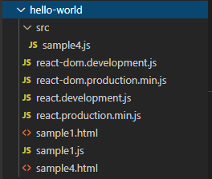


p11 code 1-7 참고


C:\react\hello-world\src\sample4.js (JSX 구문으로 수정 후)

```javascript
class LikeButton extends React.Component {
    constructor(props) {
        super(props);
        this.state = { liked: false };
    }
    render() {
        const text = this.state.liked ? '좋아요 취소' : '좋아요';
        return React.createElement(
            'button', 
            { onClick: () => this.setState({ liked: !this.state.liked }) },
            text,
        );
    }
}
// P11 코드1-7 참조
class Container extends React.Component {
    constructor(props) {
        super(props);
        this.state = { count: 0 };
    }
    render() {
        return (
            <div>
                <LikeButton/>
                <div style={{ marginTop: 20 }}>
                    <span>현재 카운트: </span>
                    <span>{this.state.count}</span>
                    <button onClick={() => this.setState({ count: this.state.count + 1 })}>증가</button>
                    <button onClick={() => this.setState({ count: this.state.count - 1 })}>감소</button>
                </div>
            </div>
        );
    }
}

ReactDOM.render(
    React.createElement(Container), 
    document.querySelector('#react-root')
);
```


태그를 그대로 이용했기 때문에 문서의 구조나 형태, 의미를 잘 파악할 수 있다.

브라우저는 이런 형태의 코드를 처리를 못하기 때문에 이것을 그대로 실행 불가. 바벨을 이용해서 브라우저가 이해할 수 있도록 바꿔준다.


##### 2 바벨 패키지를 설치하고 자바스크립트를 변환(컴파일) - P13

```bash
C:\react\hello-world>npm install @babel/core @babel/cli @babel/preset-react
npm WARN saveError ENOENT: no such file or directory, open 'C:\react\hello-world\package.json'
npm notice created a lockfile as package-lock.json. You should commit this file.
npm WARN enoent ENOENT: no such file or directory, open 'C:\react\hello-world\package.json'
npm WARN hello-world No description
npm WARN hello-world No repository field.
npm WARN hello-world No README data
npm WARN hello-world No license field.
npm WARN optional SKIPPING OPTIONAL DEPENDENCY: fsevents@1.2.11 (node_modules\fsevents):
npm WARN notsup SKIPPING OPTIONAL DEPENDENCY: Unsupported platform for fsevents@1.2.11: wanted {"os":"darwin","arch":"any"} (current: {"os":"win32","arch":"x64"})

+ @babel/preset-react@7.8.3
+ @babel/core@7.8.4
+ @babel/cli@7.8.4
added 191 packages from 117 contributors and audited 2395 packages in 16.244s

3 packages are looking for funding
  run `npm fund` for details

found 0 vulnerabilities
```


preset : 개별 형태에 맞도록 만들어 놓은 모듈

react 구문을 해석할 수 있는 바벨 preset을 다운받은 것이다.


```bash
C:\react\hello-world>npx babel --watch ./src --out-dir ./ --presets @babel/preset-react
Successfully compiled 1 file with Babel.
```

babel 모듈을 실행한다. 바벨이 동작하는데 현재 디렉터리 아래에 있는 ./src에 변화가 생기면 컴파일을 해라. 컴파일 결과는 현재 디렉터리로 바꿔라. C:\react\hello-react로. 해석하는 과정에서 babel/preset-react를 사용해라.


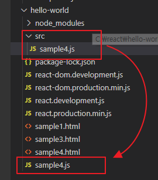

⇒ 두개의 sample4.js 내용을 비교


##### 브라우저를 통해서 확인

http://localhost:8080/hello-world/sample4.html


#### 웹팩(webpack)

p14

* 자바스크립트로 만든 프로그램을 배포하기 좋은 형태로 묶어주는 툴

* 내가 필요로 하는 시점에 필요로 하는 파일이 내려오면 좋다. -> 필요로 하는 파일을 묶어야 한다.

* 서비스에 사용하는 리소스들을 묶어주는 역할을 한다. 효율적으로 리소스를 전달하기 위해서.


* 자바스크립트에서는 ES6부터 모듈 시스템이 언어 차원에서 지원한다.
* commonJS


sample4.html


캐시 : 성능 향상을 위해 어떤 데이터를 일정 시간동안 가지고 있는 것.

개발을 할 때에는 수시로 내용을 바꾸는데, 캐시 컨트롤을 안해주면 계속해서 일정 기간동안 가지고 있다.


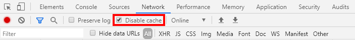


수정한 내용이 반영되지 않을 경우 cache control을 해야한다.

Network 탭에서 cache를 사용하지 않도록 설정


p15 ESM 예제


모듈

// file1.js

```js
export default function func1() { … }
export function func2() { … }
export const variable1 = 123;
export let variable2 = 'hello';
```

다른 파일에서 이 기능들을 쓸 수 있도록 하기 위해서는 export 키워드를 사용


// file2.js

```js
import myFunc1, { func2, variable1, variable2 } from './file1.js';
```

가져와서 쓰는 것은 import를 사용한다. from : 이 파일로부터

file1에서 export하는 이름을 명시해야한다.


default로 지정한 것은 중괄호로 묶지 않아도 쓸 수 있게 한다. func1을 이름을 바꿔서 바로 사용 가능


// file3.js

```js
import { func2 as myFunc2 } from './file1.js';
```

모듈에서 제공하는 기능들을 다른 이름으로 사용하려면 위와 같은 방법을 이용해야 한다.

default로 하면 이런 구문 없이 바로 사용 가능하다.


cmd

```bash
C:\react\hello-world>cd c:\react
c:\react>mkdir webpack-test
c:\react>cd webpack-test
c:\react\webpack-test>npm init -y
Wrote to c:\react\webpack-test\package.json:

{
  "name": "webpack-test",
  "version": "1.0.0",
  "description": "",
  "main": "index.js",
  "scripts": {
    "test": "echo \"Error: no test specified\" && exit 1"
  },
  "keywords": [],
  "author": "",
  "license": "ISC"
}
c:\react\webpack-test>mkdir src
```

npm init -y : 노드 기반의 프로젝트를 만들 때 탬플릿을 만들어준다.


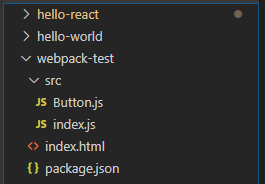


##### 2 외부 패키지를 설치

```bash
c:\react\webpack-test>npm install webpack webpack-cli react react-dom
npm notice created a lockfile as package-lock.json. You should commit this file.
npm WARN webpack-test@1.0.0 No description
npm WARN webpack-test@1.0.0 No repository field.
npm WARN optional SKIPPING OPTIONAL DEPENDENCY: fsevents@1.2.11 (node_modules\fsevents):
npm WARN notsup SKIPPING OPTIONAL DEPENDENCY: Unsupported platform for fsevents@1.2.11: wanted {"os":"darwin","arch":"any"} (current: {"os":"win32","arch":"x64"})

+ react-dom@16.12.0
+ react@16.12.0
+ webpack@4.41.5
+ webpack-cli@3.3.10
added 393 packages from 217 contributors and audited 5310 packages in 31.652s

3 packages are looking for funding
  run `npm fund` for details

found 0 vulnerabilities
```

webpack : webpack 코어

webpack-cli : 커맨드 창에서 webpack 을 쓸 수 있도록 도와주는 도구

react, react-dom : react와 react-dom 소스 코드를 가져온다.


##### 3 코드 작성

\#3-1 C:\react\webpack-test\index.html

```html
<html>
    <body>
        <h2>좋아요 버튼을 클릭해 주세요</h2>
        <div id="react-root"></div>
        <!-- dist/main.js : 웹팩으로 자바스크립트 파일을 결합하면 생성 -->
        <script src="dist/main.js"></script>
    </body>
</html>
```


\#3-2 C:\react\webpack-test\src\index.js

```js
import React from 'react';
import ReactDOM from 'react-dom';
import Button from './Button.js';

// 함수형 컴포넌트
function Container() {
    return React.createElement(
        'div',
        null,
        React.createElement('p', null, '버튼을 클릭하세요'),
        React.createElement(Button, { label: '좋아요' }),
        React.createElement(Button, { label: '싫어요' }),
    );
}

ReactDOM.render(
    React.createElement(Container),
    document.querySelector('#react-root')
);
```


import : 모듈을 읽어들이는 것이다.

`함수형 컴포넌트`는 일반적으로 상태를 관리하지 않는다. 단순히 화면 출력에 중점을 둘 때 사용한다.

값의 변화를 관리한다면 `class형 컴포넌트` 사용.


\#3-3 C:\react\webpack-test\src\Button.js

```js
import React from 'react';

function Button(props) {
    return React.createElement('button', null, props.label);
}

export default Button;
```


props : 속성 => 부모 컴포넌트가 전달

state : 상태 => 자기(해당 컴포넌트) 보유값


모듈로 만들다 보니 여러 개의 파일로 분할된다.

`Webpack` : 코드의 중복이나 의존성의 문제(선행, 후행)를 해결하면서 리소스들을 하나로 뭉쳐서 효율적으로 사용할 수 있도록 한다.


##### 4 웹팩을 이용해서 두개의 자바스크립트 파일을 하나로 결합

cmd

```bash
c:\react\webpack-test>npx webpack
Hash: 0e261edf06aff3d2d9b8
Version: webpack 4.41.5
Time: 2568ms
Built at: 2020-02-04 16:03:15
  Asset     Size  Chunks             Chunk Names
main.js  128 KiB       0  [emitted]  main
Entrypoint main = main.js
[7] ./src/index.js + 1 modules 681 bytes {0} [built]
    | ./src/index.js 524 bytes [built]
    | ./src/Button.js 147 bytes [built]
    + 7 hidden modules

WARNING in configuration
The 'mode' option has not been set, webpack will fallback to 'production' for this value. Set 'mode' option to 'development' or 'production' to enable defaults for each environment.
You can also set it to 'none' to disable any default behavior. Learn more: https://webpack.js.org/configuration/mode/
```


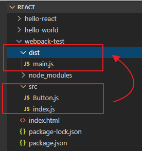


브라우저를 통해 access할 파일은 index.html 파일 하나이다.


##### 5 브라우저를 통해서 확인

http://localhost:8080/webpack-test/index.html


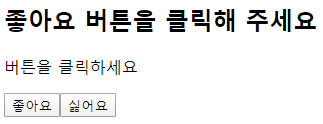


파일을 묶어주니까 기존에 하나씩 import 할 경우 발생할 수 있는 중복, 순서 문제를 해결해준다.

필요로 하는 라이브러리 순서대로


JSX문법을 사용하면 바로 실행이 안 되고 바벨을 써야한다. 그 이후 웹팩 사용


create-react-app을 이용하면 환경적인 요소들을 전혀 신경 안써도 쉽게 개발할 수 있다.


#### create-react-app 으로 시작하기

p18

* 리액트로 웹 애플리케이션을 만들기 위한 환경을 제공
* 디렉터리 구조, 필요로 하는 라이브러리 등을 미리 구성을 잡아준다.
* 바벨과 웹팩도 포함되어 있다.
* 테스트 용이, HMR(Hot-Module-Replacement), ES6+ 문법, CSS 후처리 등을 제공


##### 1 개발 환경 설정

HMR : 개발 환경에서 소스 코드의 변경이 빈번한데 변경될 때마다 컴파일하고 묶는 과정을 자동으로 해준다.

```bash
c:\react\webpack-test>cd c:\react
c:\react>npx create-react-app cra-test
...
Success! Created cra-test at c:\react\cra-test
Inside that directory, you can run several commands:

  npm start
    Starts the development server.

  npm run build
    Bundles the app into static files for production.

  npm test
    Starts the test runner.

  npm run eject
    Removes this tool and copies build dependencies, configuration files
    and scripts into the app directory. If you do this, you can’t go back!

We suggest that you begin by typing:

  cd cra-test
  npm start

Happy hacking!
C:\react>cd cra-test
```


##### 2 개발 서버 실행

```bash
C:\react\cra-test>npm start
```

⇒ 브라우저가 자동으로 http://localhost:3000/ 접속


App.js 파일 열기


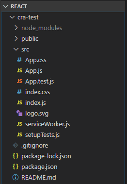


```js
import React from 'react';
import logo from './logo.svg';
import './App.css';

function App() {
  return (
    <div className="App">
      <header className="App-header">
        
        <p>
          Hello!!
        </p>
        <a
          className="App-link"
          href="https://reactjs.org"
          target="_blank"
          rel="noopener noreferrer"
        >
          Learn React
        </a>
      </header>
    </div>
  );
}

export default App;
```


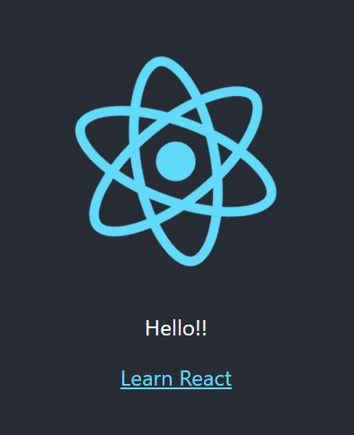


소스만 건드려도 바로 개발 서버에 반영되어 결과를 볼 수 있다. => HMR

태그를 그대로 쓰고있다 -> JSX 문법


p21

특별한 이유가 없다면 index.html에 직접 연결하는 것보다는 src 폴더 밑에서 import 키워드를 사용해서 포함시키는 게 좋다. -> 그래야 자바스크립트 파일이나 CSS 파일의 경우 빌드 시 자동으로 압축된다.


웹팩에서 해시값을 이용해서 url을 생성해주기 때문에 파일의 내용이 변경되지 않으면 브라우저 캐싱 효과를 볼 수 있다.


```bash
c:\react\cra-test>npm run build

> cra-test@0.1.0 build c:\react\cra-test
> react-scripts build

Creating an optimized production build...
Compiled successfully.

File sizes after gzip:

  39.84 KB  build\static\js\2.f7d9adf0.chunk.js
  776 B     build\static\js\runtime-main.1ea2a3fa.js
  583 B     build\static\js\main.6fae7b55.chunk.js
  556 B     build\static\css\main.d1b05096.chunk.css

The project was built assuming it is hosted at the server root.
You can control this with the homepage field in your package.json.
For example, add this to build it for GitHub Pages:

  "homepage" : "http://myname.github.io/myapp",

The build folder is ready to be deployed.
You may serve it with a static server:

  npm install -g serve
  serve -s build

Find out more about deployment here:

  bit.ly/CRA-deploy
```


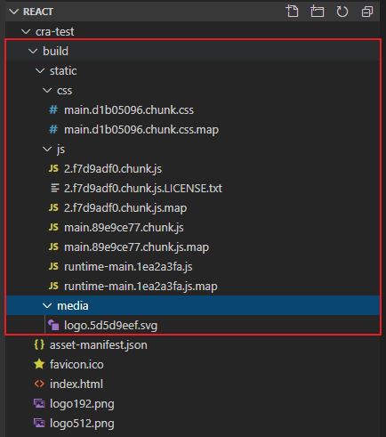


자바스크립트 파일에서 import 키워드를 이용해서 가져온 CSS 파일 -> build/static/css/main.{해시값}.chunk.css 파일에 모두 저장

자바스크립트 파일에서 import 키워드를 이용해서 가져온 폰트, 이미지 등의 리소스 파일 -> build/static/media 폴더에 저장 (10kb 이하의 작은 파일은 data url 형식으로 자바스크립트 파일에 저장)


파일명에 해쉬값이 있다. 웹팩은 CSS 파일에 대한 해시를 뽑아 새로운 형태의 파일을 만들어준다. CSS 파일에 변경이 생기면 해쉬값이 달라진다. 입력이 달라지면 그 출력도 달라진다. 파일 내용이 변경되었다는 것은 입력이 달라진 것 -> 해쉬 값도 달라진다 -> 파일명이 바뀐다. -> 내려가는 파일도 달라진다. 수정이 되지 않으면 동일한 파일 사용. 기존 파일 재사용 -> 캐시 컨트롤 할 수 있다.


Data URL

이미지는 binary일 가능성이 높다. binary 데이터를 이미지를 요청해서 가져올 수도 있지만 하나의 문자열로 포함시킬 수도 있다. 가지고 있는 데이터를 요청해서 가져오는 것이 아니라 하나의 URL 형태로 만든다. 인코딩이라는 방법을 이용해 주소 형태로 바꿔서 넣는다.


* 해쉬(hash)
  * 임의 크기 입력 -> 고정 크기 출력
  * 유일성 보장 a ≠ b => H(a) ≠ H(b)
    * 무결성 보장 : 바뀌지 않았다는 것을 보장. 해당하는 내용은 권한을 가지고 있는 사용자가 인가된 절차에 의해 바꾼것을 보장한다. 원래 그 데이터를 바꿀 수 있는 사람만 그 데이터를 조작
    * 어떤 데이터가 있으면 그 데이터가 무결한지 안한지를 그 데이터의 해쉬값을 같이 뽑아둔다.
    * 그 데이터가 전달, 해쉬 값도 전달
  * 단방향성 = 일방향성 a => H(a) ≠> a
    * 인증(Authentication) 정보 저장 및 처리에 사용
  * 빠른 연산
  * 충돌 회피 -> 입력이 더 크기 때문에 수학적으로 같은 것이 나올 수 있지만 빈번하게 발생하면 안 된다.


* 식별 : 자기만의 고유한 정보를 주어야한다.

* 인증 : 식별 정보가 사용자의 정보가 맞는지 아닌지 확인하는 것. 내가 제시한 인증 정보가 내가 맞다는 것을 확인하는 작업
  * Type 1 : 지식 기반. 그 사람만 알고있는 정보를 기반으로 인증. PW
  * Type 2 : 소유 기반. 나만 가지고 있는 것. 공인인증서, OTP 카드, 스마트폰(통신사에 등록되어 있는 고유한 기기 ID), 주민등록증
  * Type 3 : 특징 기반. 생체적인 특징(홍채, 지문, 정맥 등. 바이오인증), 서명
* 인가 : 권한이 있는지 없는지 확인하는 것. 권한 있는 사용자에게만 기능을 사용할 수 있도록 한다.


인증 정보를 저장하고 처리할 때 해쉬를 쓴다. -> 해시의 단방향성 이용

PW, 바이오 정보는 단방향 해시 알고리즘을 이용해서 저장해야 한다.


개인정보를 제외한 나머지들은 해쉬는 무결성과 관련해서 많이 사용한다.


구글 이미지 검색 -> 큰 이미지, 작은 이미지 각각 C:\react\cra-test\src 로 다운로드


```javascript
import React from 'react';
import logo from './logo.svg';
import './App.css';
import a from './a.png';
import b from './b.jpg';

function App() {
  return (
    <div className="App">
      <header className="App-header">
        
        
        <p>
          Hello!!
        </p>
        <a
          className="App-link"
          href="https://reactjs.org"
          target="_blank"
          rel="noopener noreferrer"
        >
          Learn React
        </a>
      </header>
    </div>
  );
}

export default App;
```


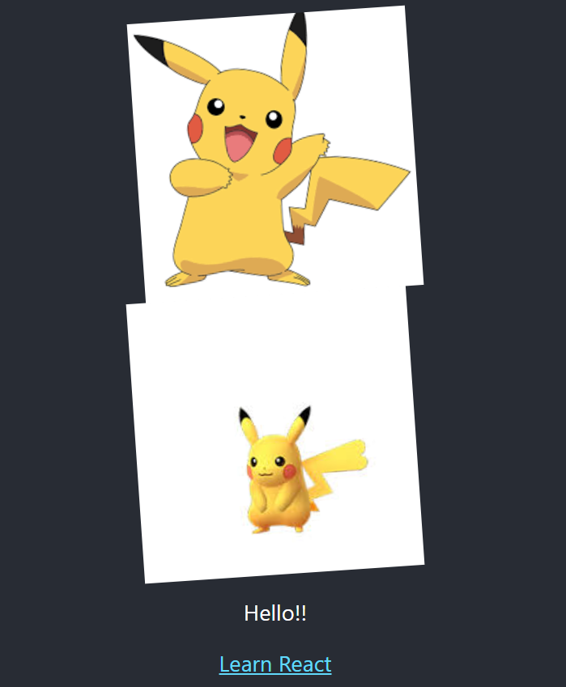


이미지 크기가 작으면 Data URL 형식으로, 크면 이름 자체에 해시값이 포함되어 보인다.


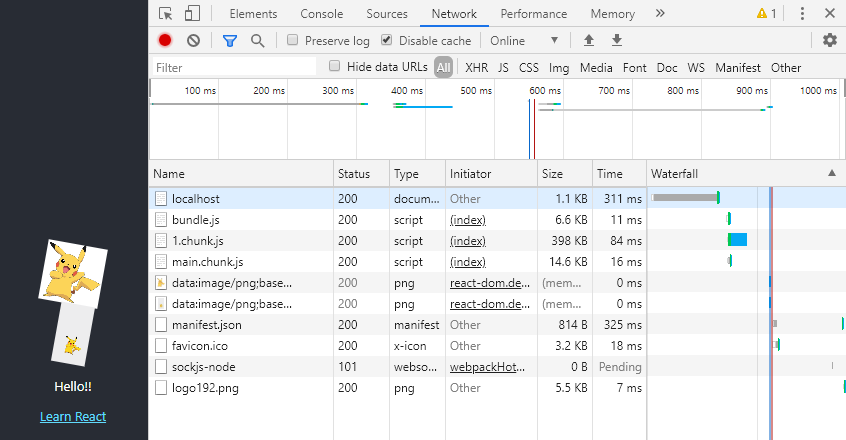


* BASE64
  * 데이터를 64개의 글자로 만든다.
  * 6bit 단위로 데이터를 자른다. 0~63까지 숫자로 만들 수 있다.
    * 0->a, 1->b, ...
    * A~Z
    * 0~9
    * a~z


Data URL -> 서버로의 불필요한 이미지 요청을 줄일 수 있다.


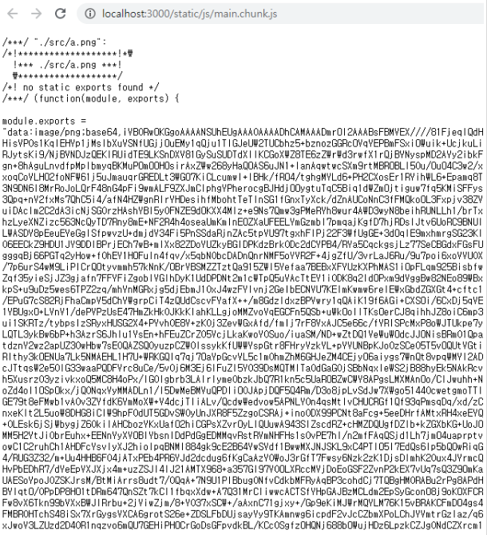


b.png는 용량이 크다 -> b.해시값.png


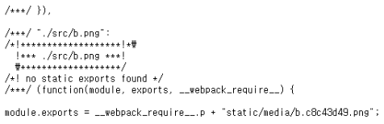

