# React

### 코드 분할하기(code splitting)

p27


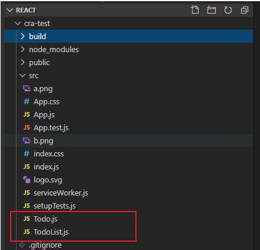


"할일추가" 버튼을 클릭하면 할일+일련번호가 추가


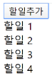


#### 1 코드를 분할하지 않고 하나의 파일로 구성

C:\react\cra-test\src\Todo.js

```js
// P27 코드1-20
import React from 'react';

function Todo({ title }) {
    return <div>{title}</div>
}

export default Todo;
```

React는 default로 선언되어 있기 때문에 중괄호 없이 사용할 수 있다.

Todo라는 함수를 다른 모듈에서 사용할 수 있도록 하고싶다 -> export

div 안에 데이터가 들어가는데, title이라는 파라미터로 넘어온 값이 들어간다.

title은 다른 모듈 컴포넌트에서 전달되는 값이다. props

Todo는 TodoList에서 사용된다.


C:\react\cra-test\src\TodoList.js

```js
// P27 코드1-21
import React, { Component } from 'react';
import Todo from './Todo.js';

class TodoList extends Component {
    //  상태 변수 = 해당 컴포넌트 내에서 사용(유지)되는 값
    state = { 
        todos: [], 
    };

    doClick = () => {
        const { todos } = this.state;
        const position = todos.length + 1;
        const newTodo = <Todo title={`할 일 ${position}`} />;
        this.setState({ todos: [...todos, newTodo] });
    };

    render() {
        const { todos } = this.state;
        return (
            <div>
                <button onClick={this.doClick}>할 일 추가</button>
                {todos}
            </div>
        );
    }
}

export default TodoList;
```

리액트와 컴포넌트 모듈 사용

React는 default로 선언되어 있기 때문에 중괄호 안에 넣지 않아도 된다.

state는 todos라는 배열 가지고 있고, 배열의 값은 선언되어 있지 않다. state는 상태 변수이다.

상태 변수 : 해당 컴포넌트 내에서 사용, 유지되는 값이다.


doClick

현재 목록을 가져오고 그 목록의 크기에 1을 더한다.

Todo를 호출하는데, title이라는 값으로 문자열을 넘긴다.

기존에 있는 것에 새롭게 추가된 newTodo를 넣어준다.


render : react 컴포넌트에 선언되어 있다. 화면을 그려주는 역할


원래의 HTML은 대소문자를 구분하지 않는다. 하지만 JSX 문법은 대소문자를 구분한다.

camel expression : 여러 단어로 된 변수 이름을 지정할 때 첫 번째 글자는 소문자로 쓰고 나머지 각 단어의 첫 글자를 대문자로 써서 구별하는 방법


C:\react\cra-test\src\App.js

```js
import React from 'react';
import TodoList from './TodoList';

function App() {
  return (
    <div className="App">
      <TodoList/>
    </div>
  );
}

export default App;
```

index.js에서 App를 사용한다.


cmd

```bash
C:\react\cra-test>npm start
```


```URL
http://localhost:3000/
```


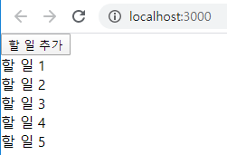


react.js, react-dom.js, index.js, App.js, TodoList.js, Todo.js 등이 하나의 파일(main.chunck.js)로 묶여서 내려옴

→ 첫 화면 로딩에 부하가 발생

⇒ 불필요한 부하를 줄이기 위해 코드 분할이 필요

크롬 개발자도구의 Network 탭에서 확인 가능


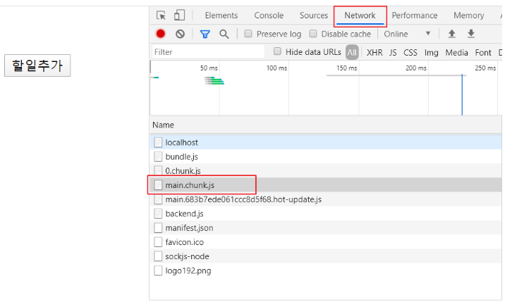


```URL
http://localhost:3000/static/js/main.chunk.js
```

main.chunk.js 파일에 Todo.js 파일의 내용이 들어가 있다. (바벨기능이나 웹팩 기능을 자동으로 해주기 때문)

버튼을 누른 시점에 Todo.js가 내려오면 된다. -> 동적으로 가져오도록 만든다.

main.chunk.js 필요한 시점에 따로 가져올 수 있도록 -> 코드 분할


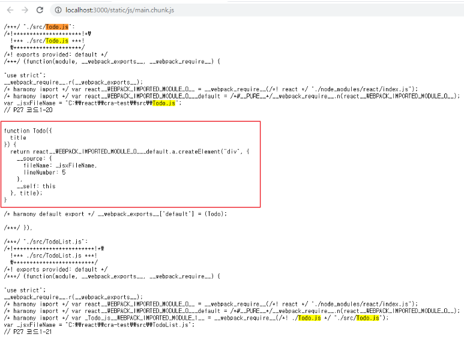


Todo.js는 버튼을 누르기 전에는 필요 없다. 버튼을 눌렀을 때(onClick 되었을 때) 필요한데, 첫 페이지를 보여주는데 포함되어 온다. -> 첫 페이지 로딩이 시간이 오래 걸린다.

불필요한 파일을 포함시키지 않고 필요한 시점에 가져오도록 할 수 있다.


#### 2 코드 분할을 통해서 동적으로 자바스크립트 파일을 로딩

C:\react\cra-test\src\Todo.js

```js
import React from 'react';

export function Todo({ title }) {
    return <div>{title}</div>
}
```


C:\react\cra-test\src\TodoList.js

```js
// P27 코드1-21
import React, { Component } from 'react';
//import Todo from './Todo.js';

class TodoList extends Component {
    //  상태 변수 = 해당 컴포넌트 내에서 사용(유지)되는 값
    state = { 
        todos: [], 
    };

    doClick = () => {
        import('./Todo.js').then(({ Todo }) => {
            const { todos } = this.state;
            const position = todos.length + 1;
            const newTodo = <Todo title={`할 일 ${position}`} />;
            this.setState({ todos: [...todos, newTodo] });
        });
    };
    render() {
        const { todos } = this.state;
        return (
            <div>
                <button onClick={this.doClick}>할 일 추가</button>
                {todos}
            </div>
        );
    }
}

export default TodoList;
```


main.chunk.js 파일을 확인해보면 Todo.js 본문은 포함되어 있지 않다.


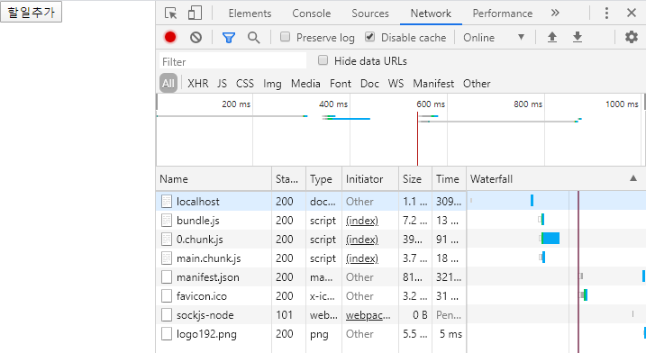


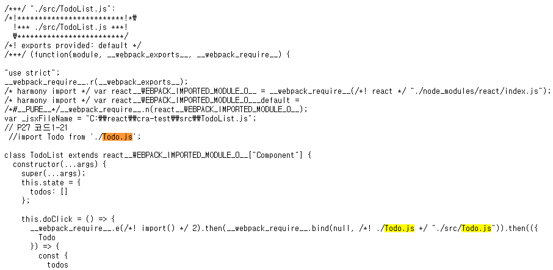


버튼을 클릭하면 2.chunk.js가 생긴다. -> Todo.js 본문이 내려온다.

또 누르면 그때부터는 cache를 사용한다.


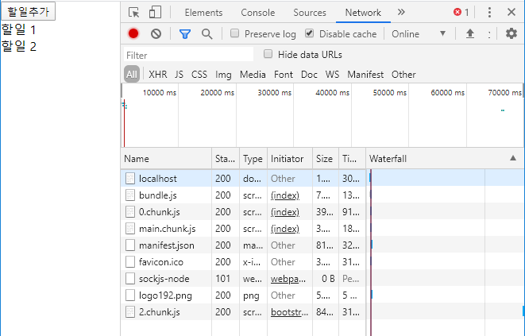


2.chunk.js 파일

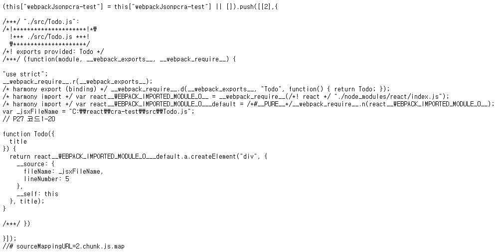


⇒ main.chunck.js 파일에 Todo.js 파일의 본문이 포함되지 않음

→ "할일추가" 버튼을 클릭하면 2.chunck.js 파일(Todo.js 파일의 본문 내용을 포함)이 내려옴

→ 2.chunck.js 파일은 최초 한번만 다운로드


var로 선언된 것들은 최상위로 올라가 사용되기 때문에 의도하지 않은 결과가 나올 수 있다. 가급적이면 let이나 const를 사용. 호이스팅 문제


### 단축 속성명(shorthand property names)

p58 

C:\react\es6.html 생성

C:\react>npx http-server

http://localhost:8080/es6.html 주소로 결과 확인


단축 속성명 : 속성의 이름만 가지고 변수의 값과 바인딩을 시켜준다.

속성 이름과 속성 값의 변수 명이 같다. -> 단축 속성명의 특징을 이용해 함수 간소화 가능

```javascript
<script>
{
    const obj_old = {
        age: 21, 
        name: 'mike',
        getName: function () { return this.name; },        
    }
    console.log(obj_old.getName()); // mike

    //  단축 속성명
    const name = 'mike';
    const obj_new = {
        age: 21, 
        name,                                   // ⇐ 단축 속성명
        getName() { return this.name; },        // ⇐ 단축 메소드명(Shorthand Method Names) 
    };
    console.log(obj_new.getName()); // mike
}

//  단축 속성명을 사용하지 않은 코드와 사용한 코드를 비교
{
    function makePerson_old(age, name) {
        return { age: age, name: name };
    }
    console.log(makePerson_old(12, 'mike'));    // {age: 12, name: "mike"}
    
    function makePerson_new(age, name) {
        return { age, name };
    }
    console.log(makePerson_new(12, 'mike'));    // {age: 12, name: "mike"}
}

//  콘솔 로그 출력시 단축 속성명 활용
{
    const name = 'John';
    const age = 21;
    console.log('name = ', name, ', age = ', age);  // name =  John , age =  21
    console.log({ name, age });                     // {name: "John", age: 21}
}
</script>
```


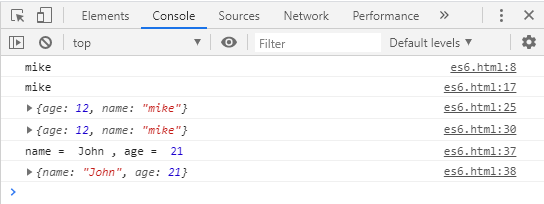


### 계산된 속성명(computed property names)

p59

계산된 속성명 : 객체의 속성명을 동적으로 결정한다.

```javascript
<script>
{
    function makeObject_unsed(key, value) {
        const obj = {};
        obj[key] = value;
        return obj;
    }
    console.log(makeObject_unsed("name", "John"));

    //  계산된 속성명 = 객체의 속성명을 동적으로 결정
    function makeObject_used(key, value) {
        return { [key] : value };
    }
    console.log(makeObject_used("name", "John"));    

    let i = 0;
    let obj = {
        ["val" + i++ ] : i, 
        ["val" + i++ ] : i, 
        ["val" + i++ ] : i, 
    };
    console.log(obj.val0, obj.val1, obj.val2);  // 1, 2, 3

    let param = 'size';
    let config = {
        [param]: 12, 
        ["mobile" + param.charAt(0).toUpperCase() + param.slice(1)]: 4
    };
    /*
        { size: 12, mobileSize: 4 }
    */
    console.log(config);    // { size: 12, mobileSize: 4 }
}
</script>
```

obj라는 객체가 가지고 있는 여러 속성 중 val0, val1, val2가 있다.

연산식이나 변수 값을 가지고 해당하는 객체의 속성을 만들 수 있다.


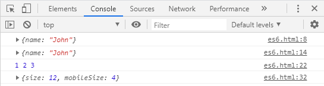


```javascript
state = {
    count1: 0,
    count2: 0,
    count3: 0,
};

onClick = index => {
    const key = `count${index}`;
    const value = this.state[key];
    this.setState({ [key]: value + 1 });
}
```

규칙성을 가지고 있는 것들

기존 방식을 이용한다면 어떤 값을 넣어주는 코드들을 짜야 한다.

계산된 속성을 사용하면 키 값 자체에 변수 형태의 속성 값이 들어갈 수 있고, 그것을 이용해 값을 생성 및 수정 가능


### 전개 연산자(spread operator)

p60


```javascript
<script>
// 전개 연산자를 이용해서 함수의 매개변수를 입력
{
    console.log(Math.max(1, 3, 7, 9));  // 9

    const numbers = [ 1, 3, 7, 9 ];
    console.log(Math.max(...numbers));  // 9
}
// 전개 연산자를 이용해서 배열과 객체를 복사
{
    let arr1 = [ 1, 2, 3 ];
    let arr2 = [ ...arr1 ];
    let arr3 = arr1;
    console.log(arr1);  // 동일한 결과
    console.log(arr2);
    console.log(arr3);

    arr1[0] = 10;
    console.log(arr1);  // [10, 2, 3]
    console.log(arr2);  // [ 1, 2, 3]
    console.log(arr3);  // [10, 2, 3]

    let obj1 = { age: 23, name: "Mike" };
    let obj2 = { ...obj1 };
    let obj3 = obj1;

    console.log(obj1);
    console.log(obj2);
    console.log(obj3);

    obj1["age"] = 30;
    console.log(obj1);  // {age: 30, name: "Mike"}
    console.log(obj2);  // {age: 23, name: "Mike"}
    console.log(obj3);  // {age: 30, name: "Mike"}
}
</script>
```


```javascript
<script>
// 배열에서 전개 연산자를 사용하면 배열 요소의 순서가 유지
{
    console.log([1, ...[2, 3], 4]);  // [1, 2, 3, 4]
    
    console.log(new Date(2020, 0, 12));
    console.log(new Date(...[2020, 0, 12]));  // Sun Jan 12 2020 00:00:00 GMT+0900 (한국 표준시)

    let today = [ 2020, 0, 12 ];
    console.log(new Date(today[0], today[1], today[2]));
    console.log(new Date(...today));
}

// 전개 연산자를 이용한 두 객체 병합
{
    const obj1 = { age: 21, name: "Mike" };
    const obj2 = { hobby: 'soccer' };
    const obj3 = { ...obj1, ...obj2 };
    console.log(obj3);  // {age: 21, name: "Mike", hobby: "soccer"}
}

// 객체 리터럴에서 중복된 속성명 사용이 가능
{
    const obj1 = { x: 1, x: 2, y: 'a' };  // {x: 2, y: "a"}
    console.log(obj1);

    obj1["x"] = 3;
    obj1["z"] = 4;
    console.log(obj1);  // {x: 3, y: "a", z: 4}

    const obj2 = { ...obj1, y: 'b' };
    console.log(obj2);  // {x: 3, y: "b", z: 4}
}
</script>
```


obj1에 값이 있으면 값을 바꾸는 것이고, 값이 없으면 값을 추가해준다.


### 배열 비구조화(array destructuring)

p61

배열의 여러 속성값을 변수로 쉽게 할당할 수 있는 문법

배열 요소들을 쪼개서 하나씩 값을 할당

배열의 index 순서대로 가져다둔다.

```javascript
<script>
// 배열 비구조화
{    
    const arr = [ 1, 2 ];
    
    // const c = arr[0];
    // const d = arr[1];

    const [ a, b ] = arr;
    console.log(a);  //1
    console.log(b);  //2
}
// 배열 비구조화를 이용한 변수 값 할당
{
    let a, b;
    console.log(a, b);  // undefined, undefined
    
    // a = 0;
    // b = 1;
    [ a, b ] = [ 0, 1 ];
    console.log(a, b);  // 0, 1
}
// 배열 비구조화를 이용한 기본값 설정
{
    const arr = [ 1 ];
    const [ a = 10, b ] = arr;
    console.log(a);  // 1
    console.log(b);  // undefined

    const [ c = 10, d = 20 ] = arr;
    console.log(c);  // 1
    console.log(d);  // 20
}
// 배열 비구조화를 이용한 값 교환
{
    let a = 10;
    let b = 20;
    console.log(a, b);  // 10, 20

    // a, b의 값을 교환
    /*
    let temp = a;
    a = b;
    b = temp;
    console.log(a, b);  // 20, 10
    */
    [ a, b ] = [ b, a ];
    console.log(a, b);  // 20, 10
}
// 쉼표를 이용해서 일부 속성값을 건너뛸 수 있음
{
    const arr = [ 1, 2, 3, 4 ];
    // let a = arr[0];
    // let b = arr[2];
    const [ a, , b ] = arr;
    console.log(a);  // 1
    console.log(b);  // 3
}
// 나머지 값을 별도의 배열로 만들기
{
    const arr = [ 1, 2, 3 ];

    const [ first, ...rest ] = arr;
    console.log(first);  // 1
    console.log(rest);  // [ 2, 3 ]

    const [ a, b, c, ...rest2 ] = arr;
    console.log(rest2);  // []
}
</script>
```


### 객체 비구조화(object destructuring)

p63

객체의 여러 속성값을 변수로 쉽게 할당할 수 있는 문법

객체는 배열과 다르게 index가 아니라 속성 이름을 가지고 변수에 할당한다.

객체의 속성 이름과 변수 이름이 동일해야 한다.

배열에서는 index를 기준으로 차곡차곡 쌓이는 구조이지만, 객체는 이름을 단위로 하기 때문에 순서가 바껴도 상관없다.

이름이 같지 않으면 mapping 되지 않는다.

객체 비구조화에서는 이름이 중요하다. 변수 명을 임의로 가져갈 수 없다. 객체명과 변수명이 동일해야한다.


```javascript
<script>
// 객체 비구조화에서는 속성이름이 중요
{
    const obj1 = { age: 21, name: "Mike" };

    const { age, name } = obj1;
    console.log(age);  // 21
    console.log(name);  // Mike
}
{
    const obj1 = { age: 21, name: "Mike" };

    const { name, age } = obj1;
    console.log(age);  // 21
    console.log(name);  // Mike
}
{
    const obj1 = { age: 21, name: "Mike" };

    const { a, b } = obj1;
    console.log(a);  // undefined
    console.log(b);  // undefined
}
// 객체 비구조화에서 별칭 사용
{
    const obj1 = { age: 21, name: "Mike" };

    const { age: a, name: b } = obj1;
    console.log(a);  // 21
    console.log(b);  // Mike
}
{
    const obj1 = { age: 21, name: "Mike" };

    const { name: b, age: a } = obj1;
    console.log(a);  // 21
    console.log(b);  // Mike
}
// 객체 비구조화에서 기본값 설정
{
    const obj = { age: undefined, name: null, grade : 'A' };
    const { age = 0, name = 'noname', grade = 'F' } = obj;
    console.log(age);  // 0
    console.log(name);  // null
    console.log(grade);  // 'A'
}
// 기본값과 별칭을 동시에 사용
{
    const obj = { age: undefined, name: "Mike" };
    const { age: newAge = 0, name } = obj;
    console.log(newAge);  // 0
    //console.log(age);  // Error -> 별칭을 통해 가져오면 mapping을 하기 위한 키로서 활용될 뿐 변수로서 사용할 수 없다.
}
// 함수를 이용한 기본값
{
    function getDefaultAge() {
        return 0;
    }

    const obj1 = { age: 21, grade: 'A' };
    const { age = getDefaultAge(), grade } = obj1;
    console.log(age);  // 21
    console.log(grade);  // 'A'
}
{
    function getDefaultAge() {
        return 0;
    }

    const obj1 = { age: undefined, grade: 'A' };
    const { age = getDefaultAge(), grade } = obj1;
    console.log(age);  // 0 -> 기본값을 함수의 실행 결과로 가져올 수 있다.
    console.log(grade);  // 'A'
}
// 객체 비구조화에서 나머지 속성들을 별도의 객체로 생성
{
    const obj = { age: 21, name: "Mike", grade: "A" };
    const { age, ...rest } = obj;
    console.log(rest);  // {name: "Mike", grade: "A"}
}
{
    const obj = { age: 21, name: "Mike", grade: "A" };
    const { name, ...rest } = obj;
    console.log(rest);  // {age: 21, grade: "A"}
}
{
    const obj = { age: 21, name: "Mike", grade: "A" };
    const { age, grade, ...rest } = obj;
    console.log(rest);  // {name: "Mike"}
}
// for 문에서 객체 비구조화를 활용
{
    const people = [
        { age: 21, name: "Mike" },
        { age: 22, name: "John" },
    ];
    /*
    for (i of people) {
        console.log(i.age, i.name);
        console.log(i["age"], i["name"]);
    }
    */
    for (i of people) {
        let age = i.age;
        let name = i.name;
        console.log(age, name);
    }
    for ({ age, name } of people) {
        console.log(age, name);
    }
}
</script>
```


### 비구조화 심화 학습

p65

```javascript
<script>
//  중첩된 객체의 비구조화
{
    const obj = { name: "Mike", mother: { name: "Sara" } };
    const { name, mother: { name: motherName } } = obj;
    console.log(name);              // Mike
    console.log(motherName);        // Sara
}
{
    const obj = { name: "Mike", mother: { name: "Sara" } };
    const { name, mother } = obj;
    console.log(name);              // Mike
    console.log(mother["name"]);    // Sara
}
{
    const obj = { name: "Mike", mother: { motherName: "Sara" } };
    const { name, mother: { motherName } } = obj;
    console.log(name);              // Mike
    console.log(motherName);        // Sara
}
//  비구조화에서 기본값은 변수 단위가 아니라 패턴 단위로 적용
{
    //  우측 배열이 비어 있기 때문에 객체 기본값을 이용
    const [ { prop: x1 } = { prop: 123 } ] = [ ];
    console.log(x1);        // 123
}
{
    //  우측 배열이 비어 있지 않기 때문에 객체 기본값을 이용하지 않음
    const [ { prop: x1 } = { prop: 123 } ] = [ {} ];
    console.log(x1);        // undefined
}
//  객체 비구조화에서 계산된 속성명을 사용
//  객체 비구조화에서 계산된 속성명을 사용할 때는 반드시 별칭을 입력해야 함
{
    const index = 1;
    // const { key1 } = { key1: 123 };
    const { [`key${index}`]: valueOfTheIndex } = { key1: 123 };
    console.log(valueOfTheIndex);   // 123
}
//  별칭을 이용해서 다른 객체와 배열의 속성값 할당
{
    const obj = {};
    const arr = [];
    const res = { foo: obj.prop, bar: arr[0] } = { foo: 123, bar: true };
    console.log(obj);   // { prop: 123 }
    console.log(arr);   // [ true ]
}
</script>
```


### 매개변수 기본값

p67

함수의 인자값을 지정해 주지 않으면 사용되는 값을 함수의 매개변수 기본값이라고 한다.

```javascript
<script>
//  매개변수 기본값 설정
{
    function printLog(a = 1) {
        console.log(a);
        console.log({ a });          // <== 단축 속성명
    }
    printLog();         //  1           <== 매개변수의 기본값이 사용
                        //  { a: 1 }
    printLog(2);        //  2
                        //  { a: 2 }
}
//  매개변수 기본값으로 함수를 호출
{
    function getDefault() {
        return 1;
    }
    function printLog(a = getDefault()) {
        console.log({ a });
    }
    printLog();         // { a: 1 }
    printLog(2);        // { a: 2 }
}
//  매개변수 기본값을 이용해서 필수입력 여부를 표현
{
    function required() {
        throw new Error('필수입력입니다.');
    }
    function printLog(a = required()) {
        console.log({ a });
    }
    printLog(2);        // { a: 2 }
    printLog();         // Uncaught Error: 필수입력입니다.
}
</script>
```


### 나머지 매개변수(rest parameter)

p68

```javascript
<script>
// 나머지 매개변수를 사용하는 코드
{
    function printLog(a, ...rest) {
        console.log({ a, rest });
    }
    printLog(1, 2);         // {a: 1, rest: [2]}
    printLog(1, 2, 3);      // {a: 1, rest: [2, 3]}
    printLog(1, 2, 3, 4);   // {a: 1, rest: [2, 3, 4]}
}
// arguments 키워드를 이용해서 구현하는 경우
{
    function printLog() {
        let a = Array.from(arguments).slice(0, 1);
        let rest = Array.from(arguments).slice(1);
        console.log({ a, rest });
    }
    printLog(1, 2);         // {a: 1, rest: [2]}
    printLog(1, 2, 3);      // {a: 1, rest: [2, 3]}
    printLog(1, 2, 3, 4);   // {a: 1, rest: [2, 3, 4]}
}
</script>
```


### 명명된 매개변수(named parameter)

p69

```javascript
<script>
// 명명된 매개변수의 사용 여부에 따라서 가독성이 달라짐
{
    const numbers = [ 10, 20, 30, 40 ];

    const result1 = getValues(numbers, 5, 25);
    const result2 = getValues({ numbers, greaterThan: 5, lessThan: 25 });  // ==> 가독성이 향상됨
}
// 명명된 매개변수를 사용하면 사용하지 않는 매개변수를 생략하는 것도 가능
{
    const result1 = getValues(number, undefined, 25);
    const result2 = getValues({ number, greaterThan: 5 });
    const result3 = getValues({ number, lessThan: 25 });
}
</script>
```


### 화살표 함수(arrow function)

p70

```javascript
<script>
{
    //  함수 표현식을 이용한 함수 정의 (익명 함수)
    const add1 = function (a, b) { return a + b; };

    //  화살표 함수 
    const add2 = (a, b) => { return a + b; };

    //  화살표 함수에서 중괄호로 감싸지 않으면 화살표 오른쪽의 계산 결과를 반환
    const add3 = (a, b) => a + b;

    console.log(add1(1, 2));        // 동일한 결과를 반환
    console.log(add2(1, 2));
    console.log(add3(1, 2));

    //  매개변수가 하나이면 매개변수를 감싸고 있는 소괄호도 생략이 가능
    const add5 = a => a + 5;
    console.log(add5(10));          // 15

    //  객체를 반환하는 경우 소괄호로 감싸야 함
    const addAndReturnObject = (a, b) => ({ result: a + b });
    console.log(addAndReturnObject(10, 20));        // { result: 30 }
    console.log(addAndReturnObject(10, 20).result); // 30
}

//  화살표 함수의 코드가 여러 줄인 경우
//  전체를 중괄호로 묶고, 반환값에는 return 키워드를 사용
{
    const add = (a, b) => {
        if (a <= 0 || b <= 0) {
            throw new Error("양수만 입력하세요");
        }
        return a + b;
    };
    console.log(add(10, 20));       // 30
}

//  화살표 함수에서 나머지 매개변수를 사용
//  화살표 함수는 일반 함수와 달리 this와 arguments가 바인딩되지 않음
//  ⇒ P71 일반 함수에서 this는 호출 시점에 사용된 객체로 바인딩
//  ⇒ 객체에 정의된 일반함수를 다른 변수에 할당해서 호출하면 버그가 발생할 수 있다.
{
    const obj = {
        value1: 1, 
        value2: 1, 
        increase: function() {
            //console.log(this);
            if (this.value1 !== undefined)
                this.value1 ++;
            else 
                this.value1 = 10;
        }, 
        add: () => {
            //console.log(this);
            if (this.value2 !== undefined)
                this.value2 ++
            else 
                this.value2 = 10;
        }
    };

    console.log('-----------------');

    console.log(obj.value1);            // 1
    console.log(globalThis.value1);     // undefined

    obj.increase();
    console.log(obj.value1);            // 2
    console.log(globalThis.value1);     // undefined

    const increase = obj.increase;
    increase();
    console.log(obj.value1);            // 2
    console.log(globalThis.value1);     // 10

    obj.increase();
    increase();
    console.log(obj.value1);            // 3
    console.log(globalThis.value1);     // 11

    console.log('-----------------');

    console.log(obj.value2);            // 1
    console.log(globalThis.value2);     // undefined

    obj.add();
    console.log(obj.value2);            // 1
    console.log(globalThis.value2);     // 10

    const add = obj.add;
    add();
    console.log(obj.value2);            // 1
    console.log(globalThis.value2);     // 11

    obj.add();
    add();
    console.log(obj.value2);            // 1
    console.log(globalThis.value2);     // 13
}
</script>
```


화살표 함수의 this는 해당하는 객체에 바인딩 되는 것이 아니라 global에 바인딩된다.

전역 객체 : 브라우저 환경에서는 window 객체, node에서는 global 객체


#### 생성자 함수 내부에서 정의된 화살표 함수의 this는 생성된 객체를 참조

p71

객체의 구조를 반환하는데, new라는 키워드와 만나서 객체를 생성하는데 사용하는 함수 => 생성자 함수

```javascript
<script>
{
    function Something() {
        this.value = 1;
        this.increase = () => {
            console.log(this);
            this.value ++;
        };
    }
 
    const obj = new Something();
    obj.increase();
    console.log(obj.value);         // 2
 
    const increase = obj.increase;
    increase();
    console.log(obj.value);         // 3
}
</script>
```


```javascript
<script>
{
    function Something1() {
        this.value = 1;
        setInterval(
            function increase() {
                if (this.value !== undefined)
                    this.value ++;
                else 
                    this.value = 1;
                console.log(this.value);
            }, 
            1000
        );
    }
    //  const obj1 = new Something1();
 
    function Something2() {
        this.value = 1;
        let that = this;
        setInterval(
            function increase() {
                that.value ++;
                console.log(that.value);
            }, 
            1000
        );
    }
    //  const obj2 = new Something2();
 
    function Something3() {
        this.value = 1;
        setInterval(
            () => {
                this.value ++;
                console.log(this.value);
            }, 
            1000
        );
    }
    const obj3 = new Something3();
}
</script>
```


