# React

### 프로미스(promise)

p74

비동기 상태를 값으로 다룰 수 있는 객체

프로미스 이전에는 콜백 패턴을 많이 사용

* 프로미스 상태
  * 대기중(pending) → 결과를 기다리는 상태
  * 이행됨(fulfilled) → 수행이 정상적으로 끝났고 결과값을 갖고 있는 상태
  * 거부됨(rejected) → 수행이 비정상적으로 끝난 상태
  * 이행됨, 거부됨 상태를 처리됨(settled) 상태라고 함
* 프로미스는 처리됨(settled) 상태가 되면 더 이상 다른 상태로 변경되지 않으며, 대기중 상태에서만 이행됨, 거부됨 상태로 변경될 수 있음


```javascript
<script>
    // 프로미스를 생성하는 방법
    
    // new 키워드를 사용해서 프로미스를 생성
    // 이렇게 생성된 프로미스는 대기중 상태가 됨
    // 생성자에 입력된 함수는 resolve와 reject라는 콜백 함수를 매개변수로 가지며, 
    // 비동기로 작업 수행 후 성공했을 때 resolve를 호출하고, 실패했을 때 reject를 호출
    const p1 = new Promise((resolve, reject) => {
        // ...
        // resolve(data)
        // or
        // reject('error message')
    });
 
    // new 키워드를 사용하지 않고, 
    // Promise.reject를 호출하면 거부됨 상태의 프로미스가 생성
    const p2 = Promise.reject('error message');
 
    // Promise.resolve를 호출해도 프로미스가 생성
    // 입력값이 프로미스이면 그 객체가 그대로 반환되고, 
    // 프로미스가 아니라면 이행됨 상태의 프로미스가 반환
    const p3 = Promise.resolve(param);
</script>
```


```javascript
<script>
    // P77 Promise.resolve 반환값

    // Promise.resolve 입력값이 프로미스가 아니면 이행된 상태의 프로미스가 반환
    const p1 = Promise.resolve(123);
    console.log(p1);  // Promise {<resolved>: 123}
    
    // Promise.resolve 입력값이 프로미스이면 그 객체가 그대로 반환
    const p2 = new Promise(resolve => setTimeout(() => resolve(10), 1));
    console.log(Promise.resolve(p2) === p2);    //true
    console.log(p2);                            // Promise {<pending>}
</script>
```


동기 처리 : 결과가 올 때 까지 기다렸다가 다음으로 넘어가는 것

비동기 처리 : 시켜놓고 다른 일을 하다가 응답이 오면 그 일을 처리. 어떤 일을 던지고 다른 일을 하는 것


```javascript
<script>
    // P77 프로미스 이용하기 : then
    // 프로미스가 처리됨 상태가 되면 then 메서드의 인수로 전달된 함수가 호출
    const p1 = Promise.resolve(123).then(data => console.log("#1", data));  // (3) #1 123
    console.log(p1 !== 123);    // (1) true
    console.log(p1);            // (2) Promise {<pending>}
    p1.then(data => console.log("#1-1", data));     // (4) #1-1 undefined
</script>
```


프로미스를 이용해 callback보다 효율적으로 비동기 처리를 할 수 있다.


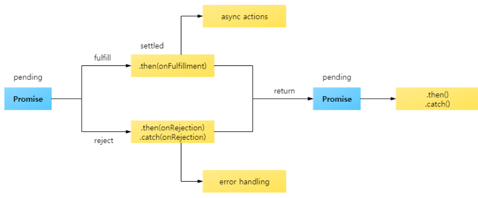


`then`은 성공과 실패에 대해서, `catch`는 실패에 대해서 처리

`setTimeout()` : 지정된 시간동안 멈춰있다가 그 시간 이후에 지정된 기능을 수행한다. 자바스크립트의 내장 함수

`Promise.resolve(프로미스)`인 형태에서는 반환 값이 프로미스

`then` : 생성한 프로미스의 결과를 받아볼 때 사용


```javascript
<script>
    const p1 = Promise.resolve(123);
    console.log(p1 === 123);    // false
    console.log(p1);            // Promise{<resolved>: 123}
    
    // new Promise(resolve, reject);
    const p2 = new Promise(
        resolve => { setTimeout(() => resolve("1초 경과"), 1000) },
        reject => { return "error" }
    );
    console.log(p2 === Promise.resolve(p2));    // true
    console.log(p2);            // Promise{<pending>}
    //console.log(Promise.resolve(p2));           // Promise{<pending>}
    p2.then(data => {
        console.log(p2);        // Promise{<resolved>: "1초 경과"}
        console.log(data);      // '1초 경과'
    });
</script>
```


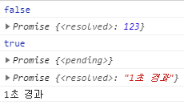


동기식으로 하면 1초가 지나야 다른 작업을 할 수 있다.

비동기식에서는 다른 작업을 하고, `then`이라는 매서드로 호출이 온다.

프로미스를 반환하는 함수들이 많이 있다. 반드시 `.then` 해서 반환하는 값들을 다루게 된다.


reject 상태의 프로미스가 던져지면 reject 함수가 있는 곳까지 간다.

앞부분은 성공을 처리하는 부분이고, 뒷부분은 실패를 처리하는 부분이다.

reject를 한 번 거치면 다시 resolve 상태로 간다.

error message를 출력하고 싶으면 파라미터로 받아서 사용하면 된다.


```javascript
<script>
    Promise.reject("error message")
    .then(() => console.log("#1"))
    .then(() => console.log("#2"))
    .then(
        () => console.log("#3-1"),
        (data) => {
            console.log("#3-2", data);  // reject가 처리되면 reject가 resolve 상태로 바뀐다. 만약 다음 resolve 상태에 전달할 값이 있다면 return 해줘야한다.
            return "hello";
        }
    )
    .then((data) => console.log("#4-1", data), () => console.log("#4-2"));
</script>
```


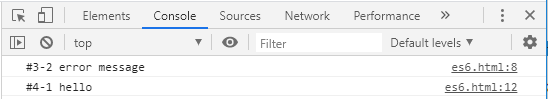


```javascript
<script>
	Promise.resolve("message")
    .then((data) => { console.log("#1", data); return "message2"; })
    .then((data) => console.log("#2", data))
    .then(
        () => console.log("#3-1"), 
        (data) => {
            console.log("#3-2", data);
            return "hello";
        }
    )
    .then((data) => console.log("#4-1", data), () => console.log("#4-2"));
</script>
```


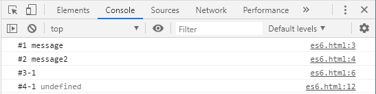


```javascript
<script>
    /*
    #1 100
    #2 200
    #3 300
    #4 error
    */
    Promise.resolve(100)
    .then((data) => {
        console.log("#1", data);
        data += 100;
        return data;
    })
    .then((data) => {
        console.log("#2", data);
        data += 100;
        return data;
    })
    .then((data) => {
        console.log("#3", data);
        return Promise.reject("error");
    })
    .then(null, (data) => console.log("#4", data));
</script>
```


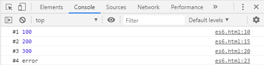


일반적으로 catch에서 잡는 것은 error이기 떄문에 변수 이름을 보통 error로 한다.

오류(프로미스에서 던진 reject)를 처리하는 방법 -> 가독성 측면에서 catch를 사용하는 것이 좋다.


```javascript
<script>
    // 예외 처리를 catch 구문을 이용해야하는 이유
    // 1. 가독성이 좋다.
    Promise.reject("error1").then(null, reject => { console.log(reject) });
    Promise.reject("error2").catch(error => console.log(error));

    // 2. resolve 함수 내에서 발생하는 예외를 처리
    Promise.resolve("data")
        .then(
            (data) => {
                console.log("#1", data);
                throw new Error("Error Occured");   // Uncaught (in promise) Error: Error Occured
            },
            (data) => {
                console.log("#2", data);
            }
        );
</script>
```


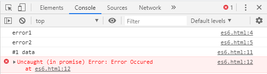


resolve 함수 안에서 발생하는 오류를 처리하기 위해서는 then을 한번 더 잡으면 된다.


```javascript
<script>
    // 예외 처리를 catch 구문을 이용해야하는 이유
    // 1. 가독성이 좋다.
    Promise.reject("error1").then(null, reject => { console.log(reject) });
    Promise.reject("error2").catch(error => console.log(error));

    // 2. resolve 함수 내에서 발생하는 예외를 처리
    Promise.resolve("data")
        .then(
            (data) => {
                console.log("#1", data);
                throw new Error("Error Occured");
            },
            (data) => {
                console.log("#2", data);
            }
        )
        .then(
            null,
            (data) => {
                console.log("#3", data);
            }
        );
</script>
```


```javascript
<script>
    // 예외 처리를 catch 구문을 이용해야하는 이유
    // 1. 가독성이 좋다.
    // Promise.reject("error1").then(null, reject => { console.log(reject) });
    // Promise.reject("error2").catch(error => console.log(error));

    // 2. resolve 함수 내에서 발생하는 예외를 처리
    // Promise.resolve("data")
    //     .then(
    //         (data) => {
    //             console.log("#1", data);
    //             throw new Error("Error Occured");   // Uncaught (in promise) Error: Error Occured
    //         },
    //         (data) => {
    //             console.log("#2", data);
    //         }
    //     )
    //     .then(
    //         null,
    //         (data) => {
    //             console.log("#3", data);
    //         }
    //     );
    
    Promise.resolve("data")
        .then(
            (data) => {
                console.log("#1", data);
                throw new Error("Error Occured");
            },
        )
        .catch(data => console.log("#4", data));
</script>
```


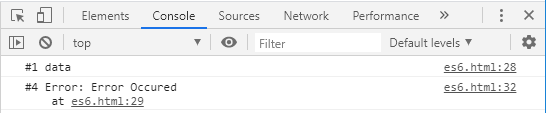


프로미스를 처리할 때 성공은 then, 예외 사항은 catch를 이용하자.


```javascript
<script>
    Promise.reject(10)
        .then(data => {
            console.log("then1", data);
            return 20;
        })
        .catch(data => {
            console.log("catch", data); // catch 10
            return 30;
        })
        .then(data => {
            console.log("then2", data); // then2 30
        });
</script>
```

reject이고, 첫 번째 then에는 reject가 없으므로 catch 절로 가서 10을 찍고 30을 return 한다. 다음 then으로 넘어간다. 


```javascript
<script>
    // P80 finally 메소드는 새로운 프로미스를 생성하지 않음
    function sendLogToServer(msg) {
        console.log("sendLogToServer", msg);
    }

    function requestData() {
        let url = "http://localhost:8080/es6.html";
        return fetch(url) 
            .then(resolve => {
                console.log("#1", resolve);
                return resolve;
            })
            .catch(error => {
                console.log("#2", error);
                return error;
            })
            // finally 대신 then 을 사용했을 때 차이를 확인
            .finally(data => {
                console.log("#3");
                sendLogToServer("requestData Finished");
                //return data;
            }); 
    }
    requestData().then(resolve => console.log("#4", resolve));
</script>
```


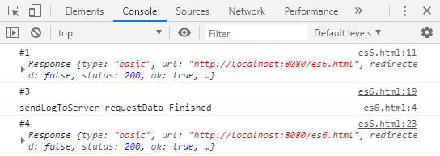


requestData는 프로미스를 반환하기 때문에 then을 이용해 잡았다.

fetch라는 함수도 프로미스를 return 하기 때문에 then, catch, finally를 해줬다.

성공하면 resolve에 url을 통해서 가져온 정보들이 들어가게 된다.

가져온 것을 return 한다. 오류가 발생하지 않으면 catch를 타지 않고 finally로 간다.

finally는 #3를 찍어주고, sendLogToServer를 호출해 메시지를 출력한다.

finally는 새로운 프로미스를 생성하지 않는다. 프로미스 체인의 가장 마지막에 사용된다. 이전에 반환한 프로미스를 그대로 반환한다.

마지막에 return 된 값을 받게 된다.


```javascript
<script>
    // P80 finally 메소드는 새로운 프로미스를 생성하지 않음
    function sendLogToServer(msg) {
        console.log("sendLogToServer", msg);
    }

    function requestData() {
        let url = "http://localhost:8080/es6.html";
        return fetch(url)
            .then(resolve => {
                console.log("#1", resolve);
                return resolve;
            })
            .catch(error => {
                console.log("#2", error);
                return error;
            })
            .then((data) => {
                console.log("#3");
                sendLogToServer("requestData Finished");
                return data;
            });
    }
    requestData().then(resolve => console.log("#4", resolve));
</script>
```

finally 대신 then을 사용하면 undefined가 반환된다.

then과 catch 다음에는 새로운 프로미스가 만들어진다. then을 이용해 앞에서 전달 받은 값을 함수를 호출한 쪽에 전달하기 위해서는 return 해줘야 한다.

finally를 하면 성공했을 때 상태의 프로미스 또는 실패했을 때 상태의 프로미스를 호출한 함수에 전달한다.

finally를 사용한 경우와 then을 사용한 경우의 차이점을 잘 알아야 한다.


```javascript
<script>
    // 의존관계가 있는 업무는 순차적으로 비동기 처리
    // requestData1() 업무가 끝나야 requestData2() 업무를 처리할 수 있는 경우
    // 예) 데이터를 가져와야 데이터를 파싱할 수 있다.
    function requestData1() {
        return Promise.resolve("requestData1 called");
    }
    function requestData2() {
        return Promise.reject("requestData2 called");
    }
    requestData1()
        .then(data => {
            console.log("#1", data);
            return requestData2();
        })
        .then(data => {
            console.log("#2", data);
        })
        .catch(error => {
            console.log("ERROR", error);
        });
</script>
```


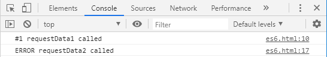


requestData1을 호출해서 성공하면 requestData2를 호출하고, 결과를 다음 then에 넘겨준다.

requestData2는 reject를 반환하기 때문에 catch 쪽으로 간다.

순차적으로 진행된다.

requestData1와 requestData2의 데이터가 의존성이 있다면 이러한 구조를 이용해야 한다.

원하는 데이터로 가공하는 것은 DB로부터 가져오는 것이 성공해야 한다. => 순차적으로 하는 것이 맞다.

A라는 일과 B라는 일이 전혀 관계없이 동작하는 경우도 있다. => 개별 업무를 병렬적으로 처리


```javascript
<script>
    // 의존관계가 없는 업무는 병렬로 처리
    function requestData1() {
        return Promise.resolve("requestData1 called");
    }
    function requestData2() {
        return Promise.reject("requestData2 called");
    }
    requestData1().then(data => console.log("#1", data), error => console.log("#2", error));
    requestData2().then(data => console.log("#3", data), error => console.log("#4", error));

    Promise.all([requestData1(), requestData2()])
        .then(([data1, data2]) => {
            console.log("#1", data1, data2);
        }, ([data1, data2]) => {
            console.log("#2", data1, data2);
        })
        .then(
            () => console.log("모든 프로미스가 처리된 상태"),
            () => console.log("프로미스 중 하나 이상이 거부된 상태")
        );
</script>
```


job을 만드는데 서로 업무간에 연관이 없는 경우. 개별 호출에 대한 상태 처리를 일일이 처리해야 한다.

Promise.all을 이용하는 경우 날라온 결과에 대한 처리를 한다. 모든 job들이 성공하면 "모든 프로미스가 처리된 상태"가 뜬다. 병렬 실행 가능한 job들을 동시에 실행하고 처리할 때 사용


### 리액트를 다루는 기술

https://velopert.com/3613


#### create-react-app을 이용해서 프로젝트 생성

```bash
C:\react>create-react-app hello-react2
c:\react>cd hello-react2
c:\react\hello-react2>npm start
```

http://localhost:3000 ⇐ 브라우저를 통해서 확인


**c:\react\hello-react2\src\App.js**

import : 다른 파일에 있는 모듈을 가져온다. 나중에 웹팩이 묶어줄 때 해당하는 소스에 포함시켜준다. 캐시 관리도 해준다.

컴포넌트를 선언할 때에는 함수형으로 선언하는 것과 class 형으로 선언된 것이 있다.

App.js는 함수 형태로 컴포넌트를 선언하고 있다.

**함수 형태로 컴포넌트를 선언**

```js
import React from 'react';
import logo from './logo.svg';
import './App.css';

// 함수 형태로 컴포넌트를 선언
function App() {
  return (
    <div className="App">
      <header className="App-header">
        
        <p>
          Edit <code>src/App.js</code> and save to reload.
        </p>
        <a
          className="App-link"
          href="https://reactjs.org"
          target="_blank"
          rel="noopener noreferrer"
        >
          Learn React
        </a>
      </header>
    </div>
  );
}

export default App;
```


**클래스 형태로 컴포넌트를 선언 → render 함수를 포함**

```js
import React from 'react';
import logo from './logo.svg';
import './App.css';

// 클래스 형태로 컴포넌트를 선언 → render 함수를 포함
class App extends React.Component {
  render() {
    return (
      <div className="App">
        <header className="App-header">
          
          <p>
            Edit <code>src/App.js</code> and save to reload.
          </p>
          <a
            className="App-link"
            href="https://reactjs.org"
            target="_blank"
            rel="noopener noreferrer"
          >
            Learn React
          </a>
        </header>
      </div>
    );
  }
}

export default App;
```


`함수 형태` : 사용자에게 보여줄 UI 화면만 보여주는 경우(정의한 경우)

`클래스 형태` : 화면도 보여주면서 화면에 출력해주는 값을 유지하면서, 값에 따라 화면의 출력이 달라져야 한다면 값을 가지고 있어야 한다. => 클래스 형태로 컴포넌트를 선언. 상태 변수를 가지고 있어야 하는 경우 반드시 클래스형으로 선언해야한다.


index.js에서 App 모듈을 사용한다.

/src/index.js의 'root' => /public/index.html의 'root'

App라는 컴포넌트를 정의할 때 클래스로 정의할 수도 있고, 함수로 정의할 수도 있다.


App.js

```js
import React from 'react';

class App extends React.Component {
  render() {
    return (
      <div>
        
      </div>
    );
  }
}

export default App;
```


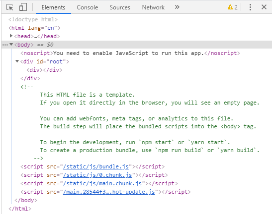


HTML에서는 닫는 태그가 존재하지 않는(필수가 아닌) 태그들이 존재한다. 꼭 닫지 않아도 된다.

```html
<input type="text">
<br>
<hr>
```


JSX 문법에서는 반드시 열고 닫는 태그가 짝을 이뤄야 한다. JSX에서는 반드시 닫는 태그를 사용해야 한다.

```jsx
<input type="text"/>
<input type="text"></input>
<br/>
<br></br>
```


JSX에서는 반드시 하나의 태그(엘리먼트)로 감싸져 있어야 한다.


[ 잘못된 예 ]

```jsx
<div> … </div>
<div> … </div>
```

위와 같이 `<div>`가 병렬로 존재하면 안된다.


[ 올바른 예 ]

```jsx
<div>
	<div> … </div>
	<div> … </div>
</div>

<>
	<div> … </div>
	<div> … </div>
</>
```

위와 같이 하나의 `<div>`로 묶어줘야 한다.

가장 바깥쪽의 `<div>`는 그냥 묶어주는 용도로 사용하기에 태그 이름 없이 괄호만 사용해도 된다.


* 엘리먼트를 묶어줄 때 다른 태그(`<div>`)를 사용하는 경우

```javascript
import React from 'react';

class App extends React.Component {
  render() {
    return (
      <div>
        <div>
          abc
        </div>
        <div>
          xyz
        </div>
      </div>
    );
  }
}

export default App;
```


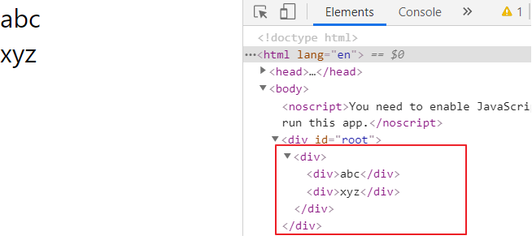


2개의 `<div>` 엘리먼트를 묶어주는 역할의 `<div>`가 생성 → 불필요한 DOM 객체가 사용(생성)됨


* `<></>` 또는 `<Fragment></Fragment>`를 사용해서 엘리먼트를 묶을 수 있음

```javascript
import React from 'react';

class App extends React.Component {
  render() {
    return (
      <>          { /* 또는 <Fragment> */ }
        <div>
          abc
        </div>
        <div>
          xyz
        </div>    { /* 또는 </Fragment> */ }
      </>
    );
  }
}

export default App;
```


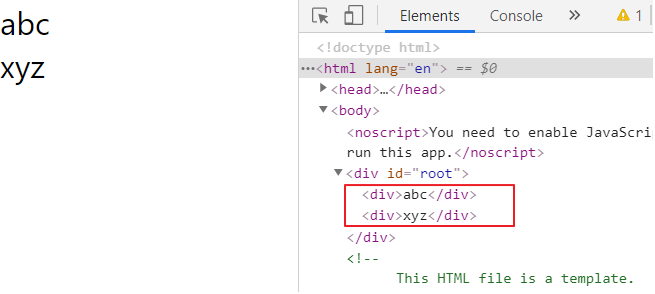

불필요한 DOM 요소가 생성되지 않았음

불필요한 DOM 요소 생성을 방지할 수 있음


#### JSX 안에 자바스크립트 사용

```javascript
import React from 'react';

class App extends React.Component {
  render() {
    const name = 'react';
    return (
      <div>Hello {name}!</div>
    );
  }
}

export default App;
```


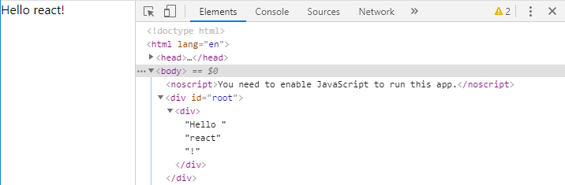


```javascript
import React from 'react';

class App extends React.Component {
  render() {
    const name = '리액트';
    return (
      <div>
        {
          name == 'react' ? 'Hello react' : '안녕 리액트'
        }          
      </div>
    );
  }
}

export default App;
```


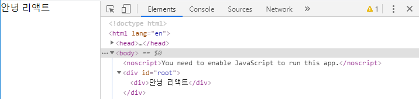


```javascript
import React from 'react';

class App extends React.Component {
  render() {
    const value = 1;
    return (
      <div>
        {
          (function() {
            if (value == 1) return <div>하나</div>;
            if (value == 2) return <div>둘</div>;
          })()
        }          
      </div>
    );
  }
}

export default App;
```


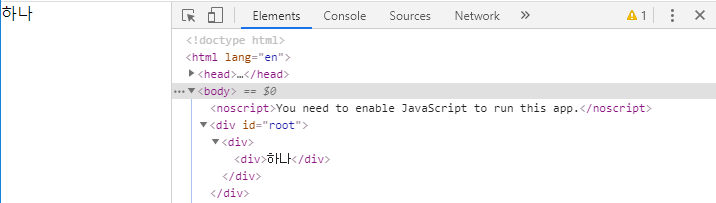


함수를 정의하고 실행하는 것도 중괄호 안에 넣으면 된다.


#### Style


```js
import React from 'react';

class App extends React.Component {
  render() {
    const styles = {
      backgroundColor: 'black',
      padding: '16px',
      color: 'white',
      fontSize: '12px'
    };
    return (
      <div style={styles}>
        안녕하세요.
      </div>
    );
  }
}

export default App;
```


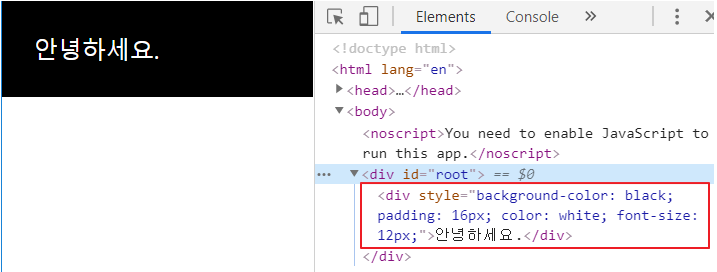


여러 개의 스타일을 정의할 때 객체 형식으로 정의한다. 여러 객체의 요소를 나열할 때에는 콤마를 사용


중괄호 한 개는 JSX에서 자바스크립트를 쓰기 위한 것

두 번째 중괄호는 객체를 넘겨주는 것


App.css 파일에 내가 만드는 요소의 스타일을 지정할 수 있다.

`.App` : class 이름이 App인 것의 속성을 정한다.


App.css

```css
.App {
  background: black;
  color: aqua;
  font-size: 20px;
  padding: 1rem;
  font-weight: 600;
}
```


App.js

```js
import React from 'react';
import './App.css';

class App extends React.Component {
  render() {
    const styles = {
      backgroundColor: 'black',
      padding: '16px',
      color: 'white',
      fontSize: '12px'
    };
    return (
      <>
        <div style={styles}>
          안녕하세요.
        </div>
        <div className="App">
          또 안녕하세요.
        </div>
      </>
    );
  }
}

export default App;
```

JSX에서는 className으로 쓰는 것을 권장한다.

class에 적용될 것들을 css에 정의해서 사용할 수 있다.


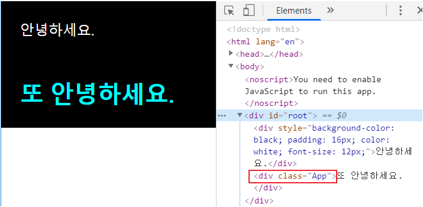


render()라는 메소드를 통해서 return 되는, JSX 구문이 해석되서 나온 최종 산출물, 랜더링 된 결과를 브라우저가 보여준다. 보여주는 과정에서 css가 결합되어 화면에 보여진다.

변수를 선언해두고, style이라는 속성을 통해 전달하는 것은 랜더링하는 과정에서 문장으로 들어가게 되고, 그 문장을 브라우저가 해석해서 보여줄 때 css가 결합되어 화면에 보여진다.


#### 주석

```js
import React from 'react';
import './App.css';

class App extends React.Component {
  render() {
    const styles = {
      backgroundColor: 'black',
      padding: '16px',
      color: 'white',
      fontSize: '12px'
    };
    return (
      <>
        { /* 이것은 주석입니다. */ }
        { // 이것도 주석입니다. 
        }
        <div /* 이것도 주석입니다. */ 
          // 이것도 주석입니다. 
          style={styles}       
        >
          // 이것은 주석이 아닙니다.
          안녕하세요.
          /* 이것은 주석이 아닙니다. */
        </div>
        <div className="App">
          또 안녕하세요.
        </div>
      </>
    );
  }
}

export default App;
```


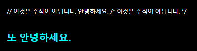


### 컴포넌트 생성

c:\react\hello-react2\src\MyName.js 파일을 생성


MyName.js

```js
/*
import React from 'react';
class MyName extends React.Component {
    ...
}
*/

import React, { Component } from 'react';
class MyName extends Component {
    render() {
        return (
            <div>
                안녕하세요.
            </div>
        );
    }
}

export default MyName;
```


index.js

```js
import React from 'react';
import ReactDOM from 'react-dom';
import './index.css';
import App from './App';
import * as serviceWorker from './serviceWorker';

import MyName from './MyName';

ReactDOM.render(<MyName />, document.getElementById('root'));

// If you want your app to work offline and load faster, you can change
// unregister() to register() below. Note this comes with some pitfalls.
// Learn more about service workers: https://bit.ly/CRA-PWA
serviceWorker.unregister();
```


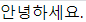


---


MyName.js

```js
import React, { Component } from 'react';
class MyName extends Component {
    render() {
        return (
            <div>
                안녕하세요.
            </div>
        );
    }
}

export default MyName;
```


App.js

```js
import React from 'react';
import './App.css';
import MyName from './MyName';

class App extends React.Component {
  render() {
    return <MyName/>
  }
}

export default App;
```


index.js

```js
import React from 'react';
import ReactDOM from 'react-dom';
import './index.css';
import App from './App';
import * as serviceWorker from './serviceWorker';

import MyName from './MyName';

ReactDOM.render(<App />, document.getElementById('root'));

// If you want your app to work offline and load faster, you can change
// unregister() to register() below. Note this comes with some pitfalls.
// Learn more about service workers: https://bit.ly/CRA-PWA
serviceWorker.unregister();
```


---


props : 자식 컴포넌트가 부모 컴포넌트로부터 받은 값


MyName.js

```js
import React, { Component } from 'react';
class MyName extends Component {
    render() {
        return (
            <div>
                안녕하세요.
                나는 <b>{ this.props.whoami }</b> 입니다.
            </div>
        );
    }
}

export default MyName;
```


App.js

```js
import React from 'react';
import './App.css';
import MyName from './MyName';

class App extends React.Component {
  render() {
    return (
      <>
        <MyName whoami="홍길동"/>
        <MyName whoami="리액트"/>
        <MyName whoami="땡땡땡"/>
      </>
    );
  }
}

export default App;
```


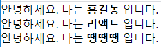


---


부모로부터 어떤 값을 받아서 처리해야 하는데 깜빡 잊고 넣지 않은 경우를 방지하기 위해 default 값을 설정한다.


MyName.js

```js
import React, { Component } from 'react';
class MyName extends Component {
    // 부모 컴포넌트에서 props 값이 전달되지 않았을 때
    // 사용할 기본값을 정의
    static defaultProps = {
        whoami: 'OOO'
    };
    render() {
        return (
            <div>
                안녕하세요.
                나는 <b>{ this.props.whoami }</b> 입니다.
            </div>
        );
    }
}

export default MyName;
```


App.js

```js
import React from 'react';
import MyName from './MyName';

class App extends React.Component {
  render() {
    return (
      <>
        <MyName whoami="홍길동"/>
        <MyName whoami="리액트"/>
        <MyName/>
      </>
    );
  }
}

export default App;
```


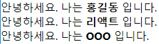


컴포넌트의 장점은 재사용 가능하다는 점이다.

컴포넌트와 컴포넌트 간의 값의 교환, 컴포넌트와 부모 간의 값의 교환이 필요하다.


### 함수형 컴포넌트

MyName.js 파일을 복사해 MyName2.js 생성

상태변수 : 해당 컴포넌트에서 가지고 있는 값.

LifeCycle : 생명주기. 컴포넌트가 생성되고 소멸될 때 까지 여러가지 상태를 가질 수 있다.

LifeCycle 별로 어떤 처리를 해야하거나 값에 따라 동작해야 한다고 하면 function 타입의 컴포넌트 생성은 불가능하다.


MyName2.js

```js
import React from 'react';

// state(상태변수), LifeCycle 개념이 빠져 있음
function MyName2({ whoami, age }) {
    return (
        <div>
            안녕하세요.
            나는 <b>{ whoami }</b> 이고,
            나이는 <b>{ age }</b>살 입니다.
        </div>
    );
}

export default MyName2;
```


App.js

```js
import React from 'react';
import MyName from './MyName';
import MyName2 from './MyName2';

class App extends React.Component {
  render() {
    return (
      <>
        <MyName whoami="홍길동"/>
        <MyName whoami="리액트"/>
        <MyName/>
        <MyName2 whoami="또길동" age="23"/>
      </>
    );
  }
}

export default App;
```


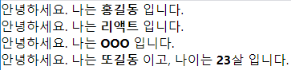


#### 스타일 적용


MyName2.js

```js
import React from 'react';
import './App.css';

// state(상태변수), LifeCycle 개념이 빠져 있음
function MyName2({ whoami, age }) {
    let redColor = {
        color: 'red'
    };
    return (
        <div>
            안녕하세요.
            나는 <b>{ whoami }</b> 이고,
            {/*
            나이는 <b className="red">{ age }</b>살 입니다.
            나이는 <b style={{color: 'red'}}>{ age }</b>살 입니다.
            */}
            나이는 <b style={redColor}>{ age }</b>살 입니다.
        </div>
    );
}

export default MyName2;
```


App.css

```css
.red {
  color: red;
}
```


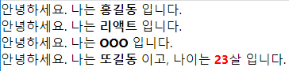


### state

상태(state) : 화면 출력에 관여하는 컴포넌트가 가지고 있는 고유한 값

setState라는 함수를 통해 값을 바꾼다. -> state 값이 변경되면 스스로 랜더링을 한다.

상태변수의 변화는 setState 함수를 이용해야 한다.


C:\react\hello-react2\src\Counter.js 파일을 생성


Counter.js

```js
import React from 'react';

class Counter extends React.Component {
    // Counter 클래스의 필드 문법을 이용해서 state를 정의
    state = {
        number: 0
    };
    /* 생성자에서 state 변수를 선언        
    constructor(props) {
        super(props);
        this.state = {
            number: 0
        };
    }
    */
    // 컴포넌트에서 발생한 이벤트를 처리할 메소드를 정의
    // onXXXXX
    // handleXXXX
    onIncrease = () => {
        // 상태 변수의 값을 변경할 때는 직접 변경하면
        // 값은 바뀔지라도 화면에 갱신(업데이트)이 되지 않음
        // this.state.number = this.state.number + 1;
        // 상태 변수의 값은 setState() 메소드를 이용해서 변경
        this.setState({number: this.state.number + 1})
    };
    onDecrease = () => {
        this.setState({number: this.state.number - 1})
    };
    render() {
        return (
            <div>
                <h1>카운터</h1>
                <div>값 : { this.state.number }</div>
                <button onClick={this.onIncrease}>+</button>
                <button onClick={this.onDecrease}>-</button>
            </div>
        );
    }
}

export default Counter;
```


App.js

```js
import React from 'react';
import Counter from "./Counter";

class App extends React.Component {
  render() {
    return <Counter/>
  }
}

export default App;
```


필드 : class가 가지고 있는 변수

메소드 : class가 가지고 있는 함수


Counter.js

```js
import React from 'react';

class Counter extends React.Component {
    // Counter 클래스의 필드 문법을 이용해서 state를 정의
    state = {
        number: 0,
        name: "홍길동"
    };
    /* 생성자에서 state 변수를 선언        
    constructor(props) {
        super(props);
        this.state = {
            number: 0
        };
    }
    */
    // 컴포넌트에서 발생한 이벤트를 처리할 메소드를 정의
    // onXXXXX
    // handleXXXX
    onIncrease = () => {
        // 상태 변수의 값을 변경할 때는 직접 변경하면
        // 값은 바뀔지라도 화면에 갱신(업데이트)이 되지 않음
        // this.state.number = this.state.number + 1;
        // 상태 변수의 값은 setState() 메소드를 이용해서 변경
        /*
        let number = this.state.number;
        let name = this.state.name;
        number += 1;
        name += number;
        this.setState({
            number, name
        });
        */
        let number = this.state.number;
        number += 1;
        this.setState({ number: number });
    };
    onDecrease = () => {
        let {number, name} = this.state;
        name += number;
        this.setState({
            number: number - 1
        });
    };
    render() {
        return (
            <div>
                <h1>카운터</h1>
                <div>값 : { this.state.number }</div>
                <button onClick={this.onIncrease}>+</button>
                <button onClick={this.onDecrease}>-</button>
            </div>
        );
    }
}

export default Counter;
```


```js
방법0
this.setState({ number: this.state.number + 1 });

방법1 상태변수의 값을 지역변수에 할당해서 처리
let number = this.state.number;
number += 1;
this.setState({ number: number });

방법2 객체 비구조화를 이용해서 상태변수의 값을 지역변수에 할당
let { number } = this.state;
number += 1;
this.setState({ number: number });

방법3 단축속성명을 이용해서 상태변수의 값을 변경
let { number } = this.state;
number += 1;
this.setState({ number });
```


### Todo 기능 구현

#### UI 라이브러리를 사용하지 않는 코드

p106

C:\react\hello-react2\todo.html 파일을 생성

```bash
C:\react\hello-react2>npx http-server
```

http://localhost:8080/hello-react2/todo.html → 실행 확인


```html
<html>
    <body>
        <div class="todo">
            <h3>할 일 목록</h3>
            <ul class="list"></ul>
            <input class="desc" type="text" />
            <button onclick="onAdd()">추가</button>
            <button onclick="onSaveToServer()">서버에 저장</button>
        </div>
        <script>
            let currentId = 1;
            const todoList = [];
            function onAdd() {
                const inputEl = document.querySelector('.todo .desc');
                const todo = { id: currentId, desc: inputEl.value };
                todoList.push(todo);
                currentId ++;
                const elemList = document.querySelector('.todo .list');
                const liEl = makeTodoElement(todo);
                console.log(liEl);
                elemList.appendChild(liEl);
            }
            function makeTodoElement(todo) {
                const liEl = document.createElement('li');
                const spanEl = document.createElement('span');
                const buttonEl = document.createElement('button');
                spanEl.innerHTML = todo.desc;
                buttonEl.innerHTML = '삭제';
                buttonEl.dataset.id = todo.id;
                buttonEl.onclick = onDelete;
                liEl.appendChild(spanEl);
                liEl.appendChild(buttonEl);
                return liEl;
            }
            function onDelete(e) {
                const id = Number(e.target.dataset.id);
                const index = todoList.findIndex(item => item.id === id);
                if (index >= 0) {
                    todoList.splice(index, 1);
                    const elemList = document.querySelector('.todo .list');
                    const liEl = e.target.parentNode;
                    elemList.removeChild(liEl);
                }
            }
            function onSaveToServer() {
                //  todoList 전송
            }
        </script>
    </body>
</html>
```


#### 동일한 기능을 리액트로 작성

p107

C:\react\hello-react2\src\MyComponent.js 파일을 생성


탬플릿

```js
import React from 'react';

class MyComponent extends React.Component {
    state = {
        desc: '', 
        currentId: 1, 
        todoList: [],
    };

    onAdd = () => {

    };

    onDelete = e => {

    };

    onSaveToServer = () => {

    };

    onChangeDesc = e => {

    };

    render() {
        const { desc, todoList } = this.state;
        return (
            <div>
                <h3>할 일 목록</h3>
                <ul>
                    {

                    }
                </ul>
                <input type="text" value={desc} onChange={this.onChangeDesc} />
                <button onClick={this.onAdd}>추가</button>
                <button onClick={this.onSaveToServer}>서버에 저장</button>
            </div>
        );
    }
}

export default MyComponent;
```


MyComponent.js

```js
import React from 'react';

class MyCompoenet extends React.Component {
    state = { desc: '', currentId: 1, todoList: [] };
    onAdd = () => {
        const { desc, currentId, todoList } = this.state;
        const todo = { id: currentId, desc };
        this.setState({
            currentId: currentId + 1,
            todoList: [...todoList, todo],
        });
    };
    onDelete = e => {
        const { todoList } = this.state;
        const id = Number(e.target.dataset.id);
        const newTodoList = todoList.filter(todo => todo.id !== id);
        this.setState({ todoList: newTodoList });
    };
    onSaveToServer = () => {
        // todoList 전송
    };
    onChangeDesc = e => {
        const desc = e.target.value;
        this.setState({ desc });
    };
    render() {
        const { desc, todoList } = this.state;
        return (
            <div>
                <h3>할 일 목록</h3>
                <ul>
                    {todoList.map(todo => (
                        <li key={todo.id}>
                            <span>{todo.desc}</span>
                            <button data-id={todo.id} onClick={this.onDelete}>
                                삭제
                            </button>
                        </li>
                    ))}
                </ul>
                <input type="text" value={desc} onChange={this.onChangeDesc} />
                <button onClick={this.onAdd}>추가</button>
                <button onClick={this.onSaveToServer}>서버에 저장</button>
            </div>
        );
    }
}

export default MyCompoenet;
```

화면을 그리고 그린 화면에 action을 넣는다.

버튼을 눌렀을 때 어떤 함수를 호출 할 것인지

가급적이면 쉽게 넣어주기 위해 상태변수 이름과 동일한 변수명 사용


App.js

```js
import React from 'react';
import MyComponent from './MyComponent';

class App extends React.Component {
  render() {
    return <MyComponent/>
  }
}

export default App;
```


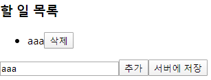


todoList가 가지고 있는 상태변수들을 화면에 표현

map을 사용. 배열이 있으면 배열 요소 하나하나를 가지고 와서 지정해 놓은 규칙에 따라 새로운 배열을 만들어준다.

화살표 함수에서 반환하는 내용이 객체일 경우에는 소괄호로 묶어줘야한다.

내가 가지고 있는 todoList는 객체 배열이다. 그 객체 배열을 `<li>` 태그로 만들고, 최종 결과물을 return 한다.


MyComponent.js

```javascript
import React from 'react';

class MyCompoenet extends React.Component {
    state = {
        desc: '',
        currentId: 1,
        todoList: [],
    };
    onAdd = () => {
        const { desc, currentId, todoList } = this.state;
        const todo = { id: currentId, desc };
        this.setState({
            currentId: currentId + 1,
            todoList: [...todoList, todo],
            desc: '',
        });
    };
    onDelete = e => {
        const { todoList } = this.state;
        const id = Number(e.target.dataset.id);
        console.log(id);
        // filter : 뒤에 명시하고 있는 조건을 만족하는 것들로 다시 배열을 만들 때 사용
        const newTodoList = todoList.filter(todo => todo.id !== id);
        this.setState({ todoList: newTodoList });
    };
    onSaveToServer = () => {
        // todoList 전송
        console.log(this.state.todoList);
    };
    onChangeDesc = e => {
        // this.setState({ desc: e.target.value });
        const desc = e.target.value;
        this.setState({ desc });
    };
    render() {
        const { desc, todoList } = this.state;
        return (
            <div>
                <h3>할 일 목록</h3>
                <ul>
                    {
                        todoList.map(todo => {
                            console.log(todo);
                            return (
                            <li key={todo.id}>
                                <span>{todo.desc}</span>
                                <button data-id={todo.id} onClick={this.onDelete}>
                                    삭제
                                </button>
                            </li>
                            );
                        })
                    }
                </ul>
                <input type="text" value={desc} onChange={this.onChangeDesc} />
                <button onClick={this.onAdd}>추가</button>
                <button onClick={this.onSaveToServer}>서버에 저장</button>
            </div>
        );
    }
}

export default MyCompoenet;
```


https://developer.mozilla.org/ko/docs/Web/JavaScript/Reference/Global_Objects/Array/map

map : 배열을 하나씩 가져와서 뒤에 정해놓은 함수의 조건을 가지고 다른 배열을 만든다.

```js
const array1 = [1, 4, 9, 16];
const map1 = array1.map(x => x * 2);
console.log(map1);	// [2, 8, 18, 32]
```


배열은 인덱스를 기반으로 해서 그 값을 하나씩 접근할 수 있지만 객체는 그렇지 않다.


filter : 뒤에 명시하고 있는 조건을 만족하는 것들로 다시 배열을 만들 때 사용


### 컴포넌트의 상태값을 사용하는 코드

p109

#### LAB1

C:\react\hello-react2\src\App.js

```js
import React from 'react';

//  좋아요 버튼을 클릭하면 배경색을 붉은색에서 파란색으로 변경
class App extends React.Component {
  state = { 
    color: 'red'
  }; 

  onClick = () => {
    this.setState({ color: 'blue' });
  };

  render() {
    return (
      <button style={{backgroundColor: this.state.color}} onClick={this.onClick}>좋아요</button>
    );
  }
}

export default App;
```


#### LAB2

App.js

```js
import React from 'react';

// "좋아요" 버튼을 클릭하면 배경색이 붉은색이면 파란색으로, 파란색이면 붉은색으로 변경
class App extends React.Component {
  state = {
    color: 'red'
  };
  onClick = () => {
    let { color } = this.state;
    color = color === 'red' ? 'blue' : 'red';
    this.setState({ color });
  };
  render() {
    return (
      <button style={{backgroundColor: this.state.color}} onClick={this.onClick}>좋아요</button>
    );
  }
}

export default App;
```


#### LAB3

##### 방법1

```js
import React from 'react';

//  "좋아요" 버튼을 클릭하면 배경색을 붉은색으로, 버튼 라벨을 "싫어요"로 변경
//  "싫어요" 버큰을 클릭하면 배경색을 파란색으로, 버튼 라벨을 "좋아요"로 변경
class App extends React.Component {
  state = { 
    color: 'red',
    text: '싫어요'
  }; 

  onClick = () => {
    let { color, text } = this.state;
    color = color === 'red' ? 'blue' : 'red';
    text = text === '좋아요' ? '싫어요' : '좋아요';
    this.setState({ color, text });
  };

  render() {
    return (
      <button style={{backgroundColor: this.state.color}} onClick={this.onClick}>{this.state.text}</button>
    );
  }
}

export default App;
```


##### 방법2

```js
import React from 'react';

//  "좋아요" 버튼을 클릭하면 배경색을 붉은색으로, 버튼 라벨을 "싫어요"로 변경
//  "싫어요" 버큰을 클릭하면 배경색을 파란색으로, 버튼 라벨을 "좋아요"로 변경
class App extends React.Component {
  state = { 
    color: 'red',
    text: '싫어요', 
    liked: false
  }; 

  onClick = () => {
    let { color, text, liked } = this.state;
    liked = !liked;
    if (liked) {
      color = 'blue';
      text = '좋아요';
    } else {
      color = 'red';
      text = '싫어요';
    }
    this.setState({ color, text, liked });
  };

  render() {
    return (
      <button style={{backgroundColor: this.state.color}} onClick={this.onClick}>{this.state.text}</button>
    );
  }
}

export default App;
```


### 부모 컴포넌트에서 속성값을 내려 주는 코드

p110

#### LAB1

**증가 버튼을 클릭하면 "현재 카운트는 OOOO입니다."를 출력**

버튼을 클릭하면 몇 번 클릭했는지 count 해주는 컴포넌트

```react
<App>
    <Todo>
        <Title title="0000">
            <p>0000</p>
        </Title>
        <button>증가</button>
    </Todo>
</App>
```

증가 버튼을 클릭하면 "현재 카운트는 0000입니다."를 출력


App.js

```js
import React from 'react';
import Todo from './Todo';

class App extends React.Component {
  render() {
    return <><Todo/><Todo/><Todo/><Todo/><Todo/></>
  }
}

export default App;
```


Todo.js 파일 생성

```js
import React, { Fragment } from 'react';
import Title from './Title';

class Todo extends React.Component {
    state = {
        count: 0
    };
    onClick = () => {
        this.setState({ count: this.state.count + 1 });
    };
    render() {
        return (
            <Fragment>
                <Title title={`현재 카운트는 ${this.state.count} 입니다.`}/>
                <button onClick={this.onClick}>증가</button>
            </Fragment>
        );
    }
}

export default Todo;
```


Title.js 파일 생성

```js
import React from 'react';

function Title(props) {
    return <p>{props.title}</p>
}

export default Title;
```


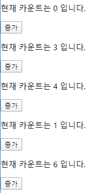


버튼 클릭 시 개별적으로 증가


---

#### LAB2

버튼 클릭 횟수가 10 이상이면 글자색을 붉은색으로 변경


색을 변경하는 것은 버튼을 누르는 것과 별개의 동작

새로운 컴포넌트를 만들어 컴포넌트를 조립해 쓰면 된다.


Todo.js

```js
import React, { Fragment } from 'react';
import Title from './Title';

class Todo extends React.Component {
    state = {
        count: 0
    };
    onClick = () => {
        this.setState({ count: this.state.count + 1 });
    };
    render() {
        return (
            <Fragment>
                <Title count={this.state.count} title={`현재 카운트는 ${this.state.count} 입니다.`}/>
                <button onClick={this.onClick}>증가</button>
            </Fragment>
        );
    }
}

export default Todo;
```


Title.js

```js
import React from 'react';

function Title(props) {
    if (props.count < 10)  
        return <p>{props.title}</p>
    else 
        return <p style={{color: 'red'}}>{props.title}</p>
}

export default Title;
```


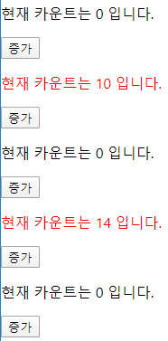


