# React


Chrome 웹 스토어 -> React Developer Tools -> Chrome에 추가


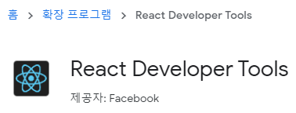


### React.memo, React.PureComponent 사용

p111


자식 컴포넌트는 부모 컴포넌트가 렌더링될 때 함께 렌더링된다.

`증가2` 버튼을 클릭했을 때 자식 컴포넌트도 함께 렌더링된다. => 불필요한 렌더링이 발생한다.

=> 방지하기 위해서는 React.memo, React.PureComponent를 사용


##### App.js

```js
import React from 'react';
import Todo from './Todo';

class App extends React.Component {
  render() {
    return <><Todo /></>
  }
}

export default App;
```


##### Todo.js

```js
import React, { Fragment } from 'react';
import Title from './Title';

class Todo extends React.Component {
    state = { count1: 0, count2: 0 };
    onClick1 = () => {
        this.setState({ count1: this.state.count1 + 1 });
    };
    onClick2 = () => {
        this.setState({ count2: this.state.count2 + 1 });
    };
    render() {
        return (
            <div>
                <Title title={`현재 카운트: ${this.state.count1}`}></Title>
                <p>{this.state.count2}</p>
                <button onClick={this.onClick1}>증가1</button>
                <button onClick={this.onClick2}>증가2</button>
            </div>
        );
    }
}

export default Todo;
```


##### Title.js

```js
import React from 'react';

function Title(props) {
    console.log(props);
    return <p>{props.title}</p>
}

export default Title;
```


증가1을 누르면 count1이 증가한다. count1은 자식에게 넘어가기 때문에 갱신되는 것이 맞다.

=> 부모가 가지고 있는 값이 자식에게 전달되기 때문에 갱신되는 것이 맞다


증가2는 count2를 증가시킨다. 자식에게 전달되는 값이 아니고 부모 쪽에서 가지고 있는 값이다. 하지만 값이 계속 바뀐다. 렌더링 된다.


불필요한 랜더링이 발생할 수 있다.


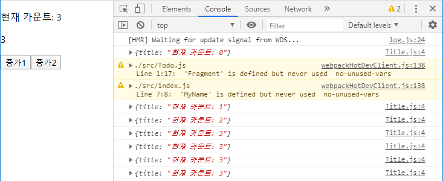


증가1 3번, 증가2 3번 클릭한 경우


##### Title.js - React.memo 사용

```js
import React from 'react';

function Title(props) {
    console.log(props);
    return <p>{props.title}</p>
}

export default React.memo(Title);
```


함수형 컴포넌트인 경우에는 React.memo를 이용해서 자식 컴포넌트의 불필요한 렌더링을 줄일 수 있음

props 값이 변경되는 경우에만 호출되는 것을 확인할 수 있음


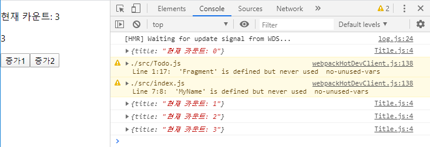


증가1 3번, 증가2 3번 클릭한 경우


##### Title.js - React.PureComponent 사용

```js
import React from 'react';

class Title extends React.PureComponent {
    constructor(props) {
        super(props);
    }
    render() {
        console.log(this.props);
        return <p>{this.props.title}</p>
    }
}

export default Title;
```

클래스형 컴포넌트인 경우, React.PureComponent를 이용하면 자식 컴포넌트의 불필요한 렌더링을 줄일 수 있음


### setState

p112

클래스형 컴포넌트에서 상태값을 변경할 때 호출하는 메소드

setState 메소드로 입력된 객체는 기존 상태값에 병합(merge)됨


App.js

```js
import React from 'react';

class App extends React.Component {
  state = { count1: 0, count2: 0 };
  onClick = () => {
    this.setState({ count1: this.state.count1 + 1 });
  };
  render() {
    const { count1, count2 } = this.state;
    return (
      <div>
        <p>{count1}, {count2}</p>
        <button onClick={this.onClick}>증가</button>
      </div>
    );
  }
}

export default App;
```


증가 버튼을 누르면 앞에 있는 숫자만 증가하는 것을 확인할 수 있다.

setState를 호출

count1만 계속해서 증가하고 count2는 그대로 유지된다.


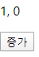


### setState 메소드를 연속해서 호출하면 발생하는 문제점

p113

리액트는 효율적인 렌더링을 위해서 여러개의 setState 메서드를 배치로 처리

→ state 변수와 화면(UI)간 불일치가 발생할 수 있음


setState는 성능을 위해 실행 결과들을 모아서 반영을 한다. 하나씩 수행하고 렌더링하고 수행하고 렌더링하는 것이 아니라 같이 돌아간다.

하나씩 수행했으면 1 -> 2 -> 3이 되는데, 모아서 수행을 하니 그 상황에서 state(count1의 값)는 0이기 때문에 count1이 1이 된다.

count1이 하나씩만 증가한다.

화면에 보이는 내용과 내가 생각하는 내용의 불일치가 발생한다.


App.js

```js
import React from 'react';

class App extends React.Component {
    state = { count1: 0, count2: 0 };
    onClick = () => {
      // count1 값이 1만 증가
      this.setState({ count1: this.state.count1 + 1 });
      this.setState({ count1: this.state.count1 + 1 });
      this.setState({ count1: this.state.count1 + 1 });
    };
    render() {
      const { count1, count2 } = this.state;
      return (
        <div>
          <p>{count1}, {count2}</p>
          <button onClick={this.onClick}>증가</button>
        </div>
      );
    }
}

export default App;
```


#### 방법1. 호출 직전의 상태값을 매개변수로 받아서 처리


App.js

```js
import React from 'react';

class App extends React.Component {
    state = { count1: 0, count2: 0 };
    onClick = () => {
      // count1 값이 1만 증가
      this.setState({ count1: this.state.count1 + 1 });
      this.setState({ count1: this.state.count1 + 1 });
      this.setState({ count1: this.state.count1 + 1 });

      this.setState(prevState => ({ count2: prevState.count2 + 1 }));
      this.setState(prevState => ({ count2: prevState.count2 + 1 }));
      this.setState(prevState => ({ count2: prevState.count2 + 1 }));
    };
    render() {
      const { count1, count2 } = this.state;
      return (
        <div>
          <p>{count1}, {count2}</p>
          <button onClick={this.onClick}>증가</button>
        </div>
      );
    }
}

export default App;
```

count2는 바로 직전값을 받아와서 그 값에 1을 더한다. -> 뒤에 있는 숫자는 3씩 증가한다.


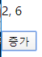


#### 방법2. 상태값 로직을 분리해서 사용


init을 호출하면 count가 0이 된다.

increment는 전달된 상태 값을 증가시키고, decrement는 전달된 상태 값을 감소시킨다.

함수 정의를 외부로 빼서 외부에서 state 정보를 관리한다.


App.js

```js
import React from 'react';

const actions = {
  init() {
    return { count: 0 };
  },
  increment(state) {
    return { count: state.count + 1 };
  },
  decrement(state) {
    return { count: state.count - 1 };
  },
};

class App extends React.Component {
  state = actions.init();
  onIncrement = () => {
    this.setState(actions.increment);
    /*
    this.setState(prevState => ({ count : this.state.count + 1 }))
    */
  };
  onDecrement = () => {
    this.setState(actions.decrement);
  };
  render() {
    return (
      <div>
        <p>{this.state.count}</p>
        <button onClick={this.onIncrement}>증가</button>
        <button onClick={this.onDecrement}>감소</button>
      </div>
    );
  }
}

export default App;
```


### setState 메소드는 비동기로 처리되지만 호출 순서는 보장된다.

p114


setState는 비동기적으로 처리된다.

비동기 처리 되지만 실행 순서는 보장이 된다. -> count1이 증가하고 count2가 증가한다.


항상 count1은 count2보다 크거나 같을 수 밖에 없다.


App.js

```js
import React from 'react';

class App extends React.Component {
  state = { count1: 0, count2: 0 };

  onClick = () => {
    let { count1, count2 } = this.state;
    count1 += 1;
    count2 += 1;
    this.setState({ count1 });
    this.setState({ count2 });
  };

  render() {
    const { count1, count2 } = this.state;
    const result = count1 >= count2;
    return (
      <div>
        <p>{count1} >= {count2}</p>
        <p>{String(result)}</p>
        <button onClick={this.onClick}>증가</button>
      </div>
    );
  }
}

export default App;
```


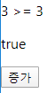


### setState 메소드의 두번째 매개변수는 처리가 끝났을 때 호출되는 콜백 함수

p115

https://ko.reactjs.org/docs/react-component.html#setstate


두번째 매개변수는 setState의 실행이 완료되고 컴포넌트가 다시 렌더링된 뒤에 실행될 함수에 대한 콜백

(componentDidUpdate()의 사용을 권장)


App.js

```js
import React from 'react';

class App extends React.Component {
  state = { count1: 0, count2: 0 };

  onClick = () => {
    let { count1, count2 } = this.state;
    count1 += 1;
    count2 += 1;
    this.setState({ count1 }, () => console.log(`count1 = ${count1}`));
    this.setState({ count2 }, () => console.log(`count2 = ${this.state.count2}`));
  };

  render() {
    console.log(`render is called`);
    const { count1, count2 } = this.state;
    const result = count1 >= count2;
    return (
      <div>
        <p>{count1} >= {count2}</p>
        <p>{String(result)}</p>
        <button onClick={this.onClick}>증가</button>
      </div>
    );
  }
}

export default App;
```


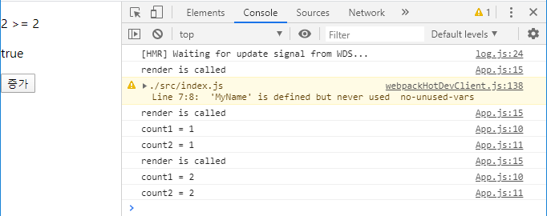


상태변수를 업데이트 하면 업데이트 되고 그것이 화면에 반영되고 console.log가 호출된다.


## 리액트 요소와 가상DOM

p116


p7 createElement 이해하기

#### 리액트 요소의 구조

p116

App.js

```js
import React from 'react';

class App extends React.Component {
  render() {
    const code3_16 = <a href="http://www.google.com">click here</a>;
    console.log(code3_16);
    const code3_17 = <a key="key1" style={{width:100}} href="http://google.com">click here</a>;
    console.log(code3_17);
    const code3_18 = <h1>제 나이는 {20+5} 세입니다.</h1>;
    console.log(code3_18);
    return(<div></div>);
  }
}

export default App;
```


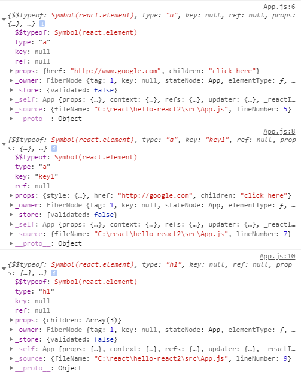


p117

```js
const element = (
    <a key="key1" style={{ width: 100 }} href="http://google.com">
    	click here
    </a>
);
console.log(element);
const consoleLogResult = {
    type: 'a',
    key: 'key1',
    ref: null,
    props: {
        href: 'http://google.com',
        style: {
            width: 100,
        },
        children: 'click here',
    },
    // ...
}
```

내부적으로는 이런 구조를 가지고 있다.

type : 문자열이면 html 태그를 나타내고, 함수라면 우리가 작성한 컴포넌트를 나타낸다.

key : element의 특정 값을 빠르게 access하기 위해 사용

ref : 상태변수만 가지고는 제어가 안되는 것이 있다. 직접적으로 화면의 element에 access하기 위해 사용

props : 나머지 속성들이 여기에 들어간다.


코드 3-18

```js
const element = <h1>제 나이는 {20 + 5}세 입니다.</h1>;
console.log(element);
const consoleLogResult = {
	type: 'h1', 
	props: { children: [ '제 나이는 ', 25, '세 입니다.' ] },
	// … 
};
```

JSX 코드에서 태그와 태그 사이에 중괄호가 있는 표현식이 들어가면, 리액트 요소에는 이 표현식이 여러 개로 분할되어 들어간다.


#### 리액트 요소가 돔 요소로 만들어지는 과정

p119

리액트에서 데이터 변경에 의한 화면 업데이트는 렌더 단계(render phase)와 커밋 단계(commit phase)를 거친다.

렌더 단계는 실제 돔에 반영할 변경 사항을 파악하는 단계이고, 커밋 단계는 파악된 변경 사항을 실제 돔에 반영하는 단계이다.

렌더 단계에서는 변경 사항을 파악하기 위해 가상 돔을 이용한다.


Todo.js

```js
import React, { Fragment } from 'react';
import Title from './Title';

class Todo extends React.Component {
    state = { priority: 'high' };
    onClick = () => {
        let { priority } = this.state;
        priority = priority === 'high' ? 'low' : 'high';
        this.setState({ priority });
    };
    render() {
        const { title, desc } = this.props;
        const { priority } = this.state;
        const element = (
            <div>
                <Title title={title}/>
                <p>{desc}</p>
                <p>{priority === 'high' ? '우선순위 높음' : '우선순위 낮음'}</p>
                <button onClick={this.onClick}>우선순위 변경</button>
            </div>
        );
        console.log(element);
        return element;
    }
}

export default Todo;
```


App.js

```js
import React from 'react';
import Todo from './Todo';

class App extends React.Component {
  render() {
    const element = <Todo title="리액트 공부하기" desc="실전 리액트를 열심히 읽는다"></Todo>;
    console.log(element);
    return (element);
  }
}

export default App;
```


Title.js

```js
import React from 'react';

class Title extends React.PureComponent {
    constructor(props) {
        super(props);
    }
    render() {
        const { title } = this.props;
        const element = <p style={{color: 'blue'}}>{title}</p>;
        console.log(element);
        return element;
    }
}

export default Title;
```


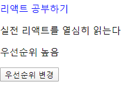


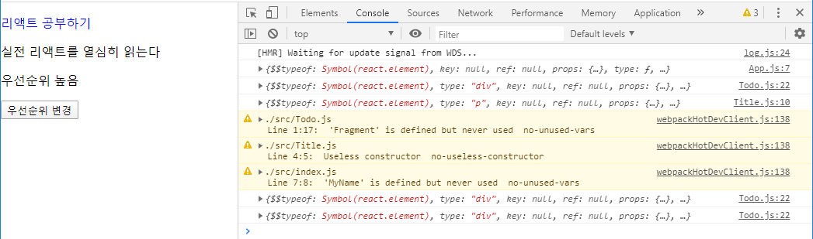


p121

리액트 요소 트리가 실제 돔으로 만들어지기 위해서는 모든 리액트 요소의 type 속성값이 문자열이어야 한다.

이는 type 속성값이 문자열이어야 HTML 태그로 변환할 수 있기 때문이다.


p122

가상 돔 : 실제 돔을 만들 수 있는 리액트 요소 트리

가상돔을 이용해 변경된 부분을 찾는다.


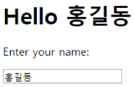


https://www.w3schools.com/react/default.asp


## 생명 주기 메서드

p124

http://projects.wojtekmaj.pl/react-lifecycle-methods-diagram/

초기화 단계는 최초에 컴포넌트 객체가 생성될 때 한 번 수행된다.

p126


App.js

```js
import React from 'react';
import Counter from './Counter';

class App extends React.Component {
  render() {
    return <Counter/>
  }
}

export default App;
```


Counter.js

```js
import React from 'react';

class Counter extends React.Component {
    state = { number: 0 };
    onIncrease = () => {
        this.setState({ number: this.state.number + 1 });
    }
    constructor(props) {
        //  P126 constructor 메소드 내부에서는 반드시 super 함수를 호출해야 한다.
        super(props);
        console.log("constructor");
    }
    static getDerivedStateFromProps(props, state) {
        console.log("getDerivedStateFromProps");
    }
    render() {
        console.log("render");
        return (
            <div>
                <h1>Counter</h1>
                <div>Value : {this.state.number}</div>
                <button onClick={this.onIncrease}>+</button>
            </div>
        );
    }
    componentDidMount() {
        console.log("componentDidMount");
    }
}

export default Counter;
```


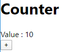


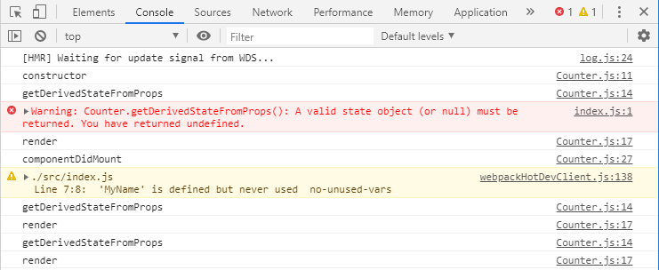


#### componetDidMount 메소드

C:\react\hello-react2\src\Box.js


문서가 랜더링이 다 되면 특정 함수가 호출된다. -> componentDidMount()

해당하는 컴포넌트가 생성되어서 사용자에게 보여진 시점에서 값들을 지정할 필요가 있을 때 componentDidMount() 함수를 이용한다.

랜더링된 결과(div의 width)를 여기서 가져와야 한다.

컴포넌트가 다 로딩되었을 때 수행해야 할 작업들을 기술한다.

랜더링된 div를 직접 access하기 위해서는 ref라는 속성을 추가해줘야 한다.

key : element에 쉽게 access 하기 위해 부여

ref : DOM 요소를 직접 access 하기 위해 부여


App.js

```js
import React from 'react';
import Box from './Box';

class App extends React.Component {
  render() {
    return <Box/>
  }
}

export default App;
```


Box.js

```js
import React from 'react';

class Box extends React.Component {
    state = {
        boxWidth: 0
    };
    divRef = React.createRef();
    componentDidMount() {
        const rect = this.divRef.current.getBoundingClientRect();
        this.setState({ boxWidth: rect.width });
    }
    render() {
        const { boxWidth } = this.state;
        const backgroundColor = boxWidth < 400 ? 'red': 'blue';
        return (
            <div ref={this.divRef} style={{ width: '100%', height: '100px', backgroundColor }}>box</div>
        );
    }
}

export default Box;
```


box 크기가 작은 경우


box 크기가 큰 경우


#### shouldComponentUpdate, getSnapshotBeforeUpdate

p140

Box.js

```js
import React, { Fragment } from 'react';
class Box extends React.Component {
    state = {
        items: []
    };
    divRef = React.createRef();

    //  짝수번째에 렌더링
    shouldComponentUpdate(nextProps, nextState) {
        return nextState.items.length % 2 === 0;
    }
    
    getSnapshotBeforeUpdate(prevProps, prevState) {
        console.log("getSnapshotBeforeUpdate()");
        const { items } = this.state;
        if (prevState.items.length < items.length) {
            const rect = this.divRef.current.getBoundingClientRect();
            console.log("getSnapshotBeforeUpdate() 반환값", rect.height);
            return rect.height; // componentDidUpdate 함수의 세번째 파라미터(snapshot)로 전달
        }
        return null;
    }
    componentDidUpdate(prevProps, prevState, snapshot) {
        console.log("componentDidUpdate()");
        if (snapshot !== null) {
            const rect = this.divRef.current.getBoundingClientRect();
            console.log(rect.height);
            if (rect.height !== snapshot) {
                console.log(`높이가 ${snapshot}에서 ${rect.height}으로 변경되었습니다.`);
            }
        }
    }
    onClick = () => {
        console.log('onClick()');
        const { items } = this.state;
        this.setState( { items: [...items, `${items.length+1}'s items`] });
    };
    render() {
        console.log('render()');
        const { items } = this.state;
        return (
            <Fragment>
                <button onClick={this.onClick}>추가하기</button>
                <div ref={this.divRef} style={{ width: '100%' }}>
                    {
                        items.map(item => <p style={{ height: 50 }}>{item}</p>)
                    }                
                </div>
            </Fragment>
        );
    }
}
export default Box;
```


버튼을 누르면 상태변수 items에 새로운 값이 들어간다.

버튼을 한 번 누르면 화면에 아무것도 나타나지 않는다.

버튼을 두 번 눌러야 화면에 1's items 와 2's items 이 뜬다.


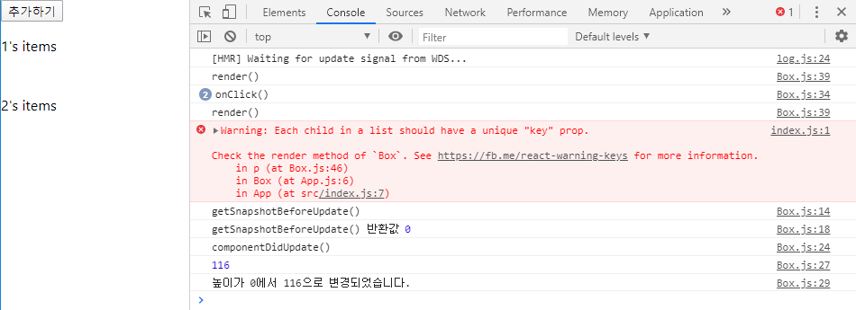


shouldComponentUpdate : update를 할지 말지 결정. false를 return 하면 렌더링을 하지 않는다.

상태값이 바뀌거나 속성 값이 바꼈는데 렌더링을 안하는 이유 => 성능 문제 때문

ex) 버스 시간 조회. 버스 위치는 초단위로 바뀌는데 그것을 화면에 계속 업데이트 할 필요는 없다. 1분 단위로 refresh


#### 자식 컴포넌트에서 발생한 예외를 부모 컴포넌트에서 처리

p145


ErrorBoundary.js

```js
// P145 코드 3-52 참조
import React from 'react';

class ErrorBoundary extends React.Component {
    state = { error: null };

    // P144 
    //  에러 정보를 상태값에 저장
    static getDerivedStateFromError(error) {
        console.log("getDerivedStateFromError()", error);
        return { error };
    }
    //  에러 정보를 서버로 전송하는 용도로 사용
    componentDidUpdate(error, info) {
        console.log("componentDidUpdate()", error, info);
    }
    render() {
        const { error } = this.state;
        if (error) {
            return <div>{error.toString()}</div>
        } else
        return this.props.children;
    }
}

export default ErrorBoundary;
```


Counter.js

```js
import React from 'react';
class Counter extends React.Component {
    state = { number: 0 };
    onIncrease = () => {
        this.setState({ number: this.state.number + 1 });
    }    
    render() {
        const { number } = this.state;
        if (number >= 3) {
            throw new Error("에러 발생!!!");
        }
        return <div onClick={this.onIncrease}>{`${number}번째 클릭입니다.`}</div>
    }
}
export default Counter;
```


App.js

```js
import React from 'react';
import ErrorBoundary from './ErrorBoundary';
import Counter from './Counter';

class App extends React.Component {
  render() {
    return <ErrorBoundary><Counter></Counter></ErrorBoundary>;
  }
}
export default App;
```


증가하다가 number가 3 이상이라면 에러가 발생


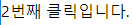

2번 클릭한 경우


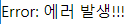

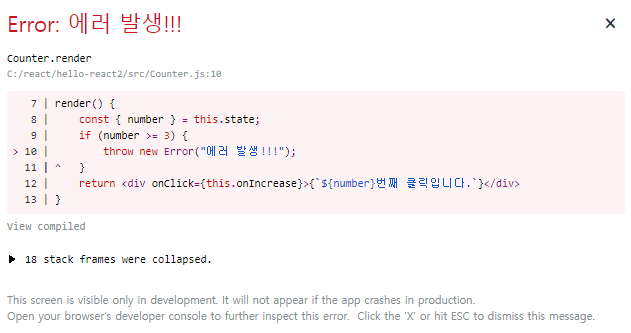

3번 클릭한 경우


child에서 발생한 에러를 부모가 잡을 때에는 getDerivedStateFromError() 함수나 componentDidUpdate() 함수를 사용한다.


#### 컨텍스트 API

p148

상위 컴포넌트에서 하위에 있는 모든 컴포넌트로 직접 데이터 전달이 가능


```js
<App>
	<div>
		<div>상단 메뉴</div>
		<Profile />
		<div>하단 메뉴</div>
	</div>
</App>

<Profile>
	<div>
		<Greeting />
	</div>
</Profile>

<Greeting>
	<p>OOO님 안녕하세요.</p>
</Greeting>
```


##### 컨텍스트 API를 사용하지 않으면 속성값(pros)로 전달

App.js

```js
import React from 'react';

class App extends React.Component {
  render() {
    return (
      <div>
        <div>상단 메뉴</div>
        <Profile username="홍길동"/>
        <div>하단 메뉴</div>
      </div>
    );
  }
}

function Profile({username}) {
  return (
    <div>
      <Greeting username={username}/>
    </div>
  );
}

function Greeting({username}) {
  return (
    <p>{`${username}님 안녕하세요.`}</p>

  );
}

export default App;
```


##### 컨텍스트 API를 사용

컨텍스트 API : 상위 컴포넌트에서 하위에 있는 모든 컴포넌트로 직접 데이터를 전달할 수 있는 방법


App.js

```js
import React from 'react';

// unknown : 기본값 ⇒ 
// <UserContext.Provider> 정의되어 있지 않으면 <UserContext.Consumer>에서 사용하는 값
const UserContext = React.createContext('unknown');

class App extends React.Component {
  render() {
    return (
      <div>
        <UserContext.Provider value="홍길동">
          <div>상단 메뉴</div>
          <Profile />
          <div>하단 메뉴</div>
        </UserContext.Provider>
      </div>
    );
  }
}

function Profile() {
  return <div><Greeting /></div>;
}

function Greeting() {
  return (
    <UserContext.Consumer>
      { 
        username => <p>{`${username}님 안녕하세요.`}</p> 
      }
    </UserContext.Consumer>
  );
}

export default App;
```


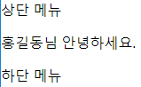


##### 중간 컴포넌트의 렌더링 여부에 상관없이 Provider 컴포넌트의 값이 바뀌면 Consumer 컴포넌트가 렌더링을 수행하는 것을 보장


App.js

```js
import React from 'react';

const UserContext = React.createContext('unknown');

class App extends React.Component {
  state = { username: '' };
  onChange = e => {
    const username = e.target.value;
    this.setState({ username });
  };
  render() {
    const { username } = this.state;
    return (
      <div>
          <UserContext.Provider value={username}>
            <div>상단 메뉴</div>
            <Profile />
            <div>하단 메뉴</div>
          </UserContext.Provider>
          <input type="text" value={username} onChange={this.onChange} />        
      </div>
    );
  }
}

class Profile extends React.Component {
  shouldComponentUpdate() {
    return false;
  }
  render() {
    console.log("Profile's render() called");
    return <div><Greeting /></div>;
  }
}

function Greeting() {
  console.log("Greeting() called");
  return (
    <UserContext.Consumer>
      { 
        username => <p>{`${username}님 안녕하세요.`}</p> 
      }
    </UserContext.Consumer>
  );
}

export default App;
```


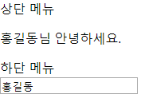


##### 여러 컨텍스트를 중첩해서 사용

p150


App.js

```js
import React from 'react';

const UserContext = React.createContext('unknown');
const ThemeContext = React.createContext('dark');

class App extends React.Component {
  state = { username: '' };
  onChange = e => {
    const username = e.target.value;
    this.setState({ username });
  };
  render() {
    const { username } = this.state;
    return (
      <div>
        <ThemeContext.Provider value="light">
          <UserContext.Provider value={username}>
            <div>상단 메뉴</div>
            <Profile />
            <div>하단 메뉴</div>
          </UserContext.Provider>
        </ThemeContext.Provider>
        <input type="text" value={username} onChange={this.onChange} />        
      </div>
    );
  }
}

class Profile extends React.Component {
  shouldComponentUpdate() {
    return false;
  }
  render() {
    console.log("Profile's render() called");
    return <div><Greeting /></div>;
  }
}

function Greeting() {
  console.log("Greeting() called");
  return (
    <ThemeContext.Consumer>
      { theme => (
        <UserContext.Consumer>
          { 
            username => (
              <p style={{ color: theme === 'dark' ? 'gray' : 'green' }}>{`${username}님 안녕하세요.`}</p>
            ) 
          }
        </UserContext.Consumer>
      ) }
    </ThemeContext.Consumer>
  );
}

export default App;
```


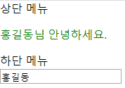


