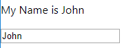
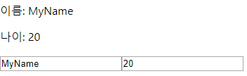
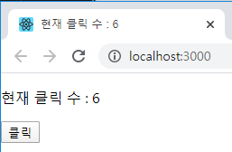
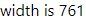

# React

## 진화된 함수형 컴포넌트 : 리액트 훅

5장


Hooks are a new addition in React 16.8. They let you use state and other React features without writing a class.

함수형 컴포넌트에서도 컴포넌트의 **상태값을 관리**할 수 있고, 컴포넌트의 **생명 주기 함수를 이용**할 수 있음


함수로 컴포넌트를 만들면 상태 변수를 가져갈 수 없다는 것과 라이프 사이클 함수를 쓸 수 없다는 것이 걸린다.

리액트 훅은 함수형 컴포넌트에서 클래스형 컴포넌트의 기능을 쓸 수 있도록 해준다.


### React.useState 훅

p217

네이밍이 use로 시작하면 훅이다.


#### 입력창에 입력한 내용(이름)을 화면에 출력하는 프로그램


Profile.js (클래스형 컴포넌트)

```js
import React from 'react';

class Profile extends React.Component {
    state = { name: '' };
    onChange = e => this.setState({ name: e.target.value });
    render() {
        return (
            <>
                <p>{`My name is ${this.state.name}`}</p>
                <p><input type="text" value={this.state.name} onChange={this.onChange}/></p>
            </>
        );
    }
}

export default Profile;
```


App.js

```js
import React from 'react';
import Profile from './Profile';

class App extends React.Component {
  render() {
    return <Profile/>
  }
}

export default App;
```


Profile.js (함수형 컴포넌트)

```js
import React, { useState } from 'react';

function Profile() {
    // state = { name: '' };
    // [ 상태값, 상태값변경함수 ] = React.userState(초기값);
    const [ name, setName ] = useState('');
    
    // onChange = e => this.setState({ name: e.target.value });
    return (
        <>
            <p>{`My name is ${name}`}</p>
            <p><input type="text" value={name} onChange={e => setName(e.target.value)}/></p>
        </>
    );
}

export default Profile;
```

상태변수처럼 쓰인다 => 값이 변경되면 렌더링이 된다.





---

#### 아래의 클래스형 컴포넌트를 함수형 컴포넌트로 변경하세요.


클래스형 컴포넌트

Profile.js

```js
import React from 'react';

class Profile extends React.Component {
    state = { name: '', age: 0 };
    onChangeName = e => this.setState({ name: e.target.value });
    onChangeAge = e => this.setState({ age: e.target.value });
    render() {
        return (
            <>
                <p>{`이름: ${this.state.name}`}</p>
                <p>{`나이: ${this.state.age}`}</p>
                <p>
                    <input type="text" value={this.state.name} onChange={this.onChangeName}/>
                    <input type="text" value={this.state.age} onChange={this.onChangeAge}/>
                </p>
            </>
        );
    }
}

export default Profile;
```


##### 방법1

함수형 컴포넌트

Profile.js

```js
import React, { useState } from 'react';

function Profile() {
    //state = { name: '', age: 0 };
    const [ name, setName ] = useState('');
    const [ age, setAge ] = useState(0);
    //onChangeName = e => this.setState({ name: e.target.value });
    //onChangeAge = e => this.setState({ age: e.target.value });
    return (
        <>
            <p>{`이름: ${name}`}</p>
            <p>{`나이: ${age}`}</p>
            <p>
                <input type="text" value={name} onChange={e => setName(e.target.value)}/>
                <input type="text" value={age} onChange={e => setAge(e.target.value)}/>
            </p>
        </>
    );
}

export default Profile;
```





##### 방법2

함수형 컴포넌트

Profile.js

```js
import React, { useState } from 'react';

function Profile() {
    /*
        state = { name: '', age: 0 }
    */
    const [ state, setState ] = useState({ name: '', age: 0 });
    return (
        <>
            <p>{`이름: ${state.name}`}</p>
            <p>{`나이: ${state.age}`}</p>
            <p>
                <input type="text" value={state.name} onChange={e => setState({ ...state, name: e.target.value})}/>
                <input type="text" value={state.age} onChange={e => setState({ ...state, age: e.target.value })}/>
            </p>
        </>
    );
}

export default Profile;
```


### React.useEffect 훅

p220


useEffect 훅을 통해서 함수형 컴포넌트에서도 생명 주기 함수를 이용할 수 있다.

코드의 중복이 줄어들고 간략화된다.


p124

componentDidMount

처음으로 렌더링 되었을 때 호출


#### 생명주기 함수를 이용해서 DOM 이외에 상태변수의 값을 출력


##### 클래스형 컴포넌트에서 생명주기 함수를 이용하면 부득이 코드 중복이 발생할 수 있다.

Profile.js

```js
import React from 'react';

class Profile extends React.Component {
    state = { count : 0 };
    onClick = () => { 
        this.setState({ count: this.state.count + 1 });
    };
    componentDidMount() {
        document.title = `현재 클릭 수 : ${this.state.count}`;
    }
    componentDidUpdate() {
        document.title = `현재 클릭 수 : ${this.state.count}`;
    }
    render() {
        return(
            <div>
                <p>현재 클릭 수 : {this.state.count}</p>
                <p><button onClick={this.onClick}>클릭</button></p>
            </div>
        );
    }
}

export default Profile;
```


##### userEffect 훅을 사용하면 코드 중복으르 줄이고 간결하게 만들 수 있다.


Profile.js

```js
import React, { useState, useEffect } from 'react';

function Profile () {
    const [ count, setCount ] = useState(0);
    // 렌더링 결과가 실제 돔에 반영된 후 호출되는 훅
    useEffect(() => {
        document.title = `현재 클릭 수 : ${count}`;
    });
    return(
        <div>
            <p>현재 클릭 수 : {count}</p>
            <p><button onClick={() => setCount(count+1)}>클릭</button></p>
        </div>
    );
}

export default Profile;
```





#### 이벤트 처리 함수를 등록, 해제 하는 경우

p222


##### 생명주기 함수를 이용하면 등록과 해제가 분리되어 코드 누락이 발생할 수 있다.

```js
import React, { useState, useEffect } from 'react';

class Profile extends React.Component {
    state = { width: window.innerWidth };

    onResize = () => { 
        this.setState({ width: window.innerWidth });
    };
    //  resize 이벤트 리스너를 등록
    componentDidMount() {
        window.addEventListener('resize', this.onResize);
    }
    //  resize 이벤트 리스너를 해제
    componentWillUnmount() {
        window.removeEventListener('resize', this.onResize);
    }
    render() {
        return <div>{`width is ${this.state.width}`}</div>;
    }
}

export default Profile;
```

resize 이벤트 리스너를 화면이 완성되었을 경우 등록하고, 해당 컴포넌트가 사라졌을 때 해제해야한다.

=> 코드가 길어지면 코드 누락이 발생할 수 있다.


**훅으로 구현**

```js
import React, { useState, useEffect } from 'react';

function Profile() {
    const [ width, setWidth ] = useState(window.innerWidth);
    useEffect(() => {
        const onResize = () => setWidth(window.innerWidth);
        window.addEventListener('resize', onResize);
        return () => window.removeEventListener('resize', onResize);
    }, []);
    return <div>{`width is ${width}`}</div>;
}

export default Profile;
```





p223

useEffect의 첫 번째 함수 인자의 반환값은 해당 컴포넌트가 사라질 때 마지막에 반환된다.

=> 정상적으로 종료된 경우 호출되는 것이 보장된다.


