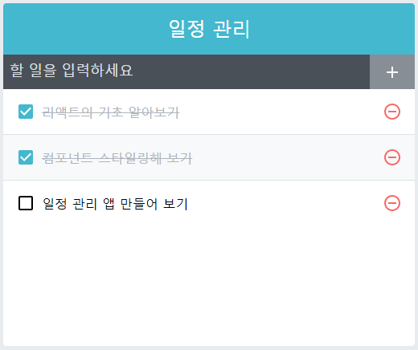
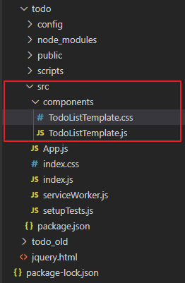
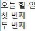

# [실습2] 리액트 프로그래밍


지금까지 배운 내용을 기반으로 아래의 조건을 만족하는 프로그램을 완성하시오.

참고 ⇒ https://velopert.com/3480


#1 프로그램 로딩 시 보유하고 있는 할 일 목록의 내용을 아래와 같은 형식으로 출력





\#2 할 일을 입력하고 (+) 버튼을 클릭하면 할 일이 목록에 추가

#3 할 일 목록에서 (-) 버튼을 클릭하면 해당 일정을 삭제

#4 할 일 목록에서 체크 박스를 클릭하면 해당 할 일을 비활성화(disable) 처리


### [실습2] 문제 풀이


cmd

```bash
c:\react>create-react-app projects
c:\react>cd projects
c:\react\projects>npm run eject
c:\react\projects>mkdir common
```


c:\react\projects 폴더 아래의 config, public, scripts, src, package.json 폴더와 파일을

c:\react\projects\common 폴더로 이동


```js
c:\react\projects>mkdir todo
```


c:\react\projects\common 폴더 아래의 모든 폴더와 파일을 c:\react\projects\todo 폴더 아래로 복사


```bash
c:\react\projects\toto>npm start
```


**프로젝트 작업 디렉터리 ⇒ c:\react\projects\todo**


**c:\react\projects\todo\src\App.js 파일 수정**

App.css, App.test.js, logo.svg 파일 삭제

create-react-app 에서 제공한 내용 중 불필요하나 내용을 삭제 및 클래스형 컴포넌트로 변경


App.js

```js
import React from 'react';
import TodoListTemplate from './components/TodoListTemplate';

class App extends React.Component {
  render() {
    return (
      <div>
        <TodoListTemplate/>
      </div>
    );
  }
}

export default App;
```


**c:\react\projects\todo\src\ 디렉터리 아래에 components 디렉터리 생성**

**c:\react\projects\todo\src\components\TodoListTemplate.js**

**c:\react\projects\todo\src\components\TodoListTemplate.css 파일 생성**





**c:\react\projects\todo\src\components\TodoListTemplate.js**

```js
import React from 'react';

/*
function TodoListTemplate() { ... }
const TodoListTemplate = () => { ... };
*/

const TodoListTemplate = () => {
    return (
        <main className="todo-list-template">
            <div className="title">
                오늘 할 일
            </div>
            <section className="from-wrapper">
                첫 번째
            </section>
            <section className="todos-wrapper">
                두 번째
            </section>
        </main>
    );
};

export default TodoListTemplate;
```





중간중간 확인하면서 작업하기


**c:\react\projects\todo\src\components\TodoListTemplate.css**

```css
.todo-list-template {
    background: white;
    width: 512px;
    box-shadow: 0 3px 6px rgba(0,0,0,0.16), 0 3px 6px rgba(0,0,0,0.23); /* 그림자 */ 
    margin: 0 auto; /* 페이지 중앙 정렬 */
    margin-top: 4rem;
}

.title {
    padding: 2rem;
    font-size: 2.5rem;
    text-align: center;
    font-weight: 100;
    background: #22b8cf;;
    color: white;
}

.form-wrapper {
    padding: 1rem;
    border-bottom: 1px solid #22b8cf;
}

.todos-wrapper {
    min-height: 5rem;
}
```


* 함수형 컴포넌트
  * 상태 변수를 가질 수 없다.
  * 라이프사이클 함수를 쓸 수 없다.


파라미터로 받아온 값 => props


**c:\react\projects\todo\src\components\TodoListTemplate.js**

```js
import React from 'react';
import './TodoListTemplate.css';

/*
function TodoListTemplate() { ... }
const TodoListTemplate = () => { ... };
*/

const TodoListTemplate = ({form, children}) => {
    return (
        <main className="todo-list-template">
            <div className="title">
                오늘 할 일
            </div>
            <section className="form-wrapper">
                {form}
            </section>
            <section className="todos-wrapper">
                {children}
            </section>
        </main>
    );
};

export default TodoListTemplate;
```


**src/components/Form.css**

```css
.form {
  display: flex;
}

.form input {
  flex: 1; /* 버튼을 뺀 빈 공간을 모두 채워줍니다 */
  font-size: 1.25rem;
  outline: none;
  border: none;
  border-bottom: 1px solid #c5f6fa;
}

.create-button {
  padding-top: 0.5rem;
  padding-bottom: 0.5rem;
  padding-left: 1rem;
  padding-right: 1rem;
  margin-left: 1rem;
  background: #22b8cf;
  border-radius: 3px;
  color: white;
  font-weight: 600;
  cursor: pointer;
}

.create-button:hover {
  background: #3bc9db;
}
```


**App.js**

```js
import React from 'react';
import TodoListTemplate from './components/TodoListTemplate';
import Form from './components/Form';

class App extends React.Component {
  render() {
    return (
      <div>
        <TodoListTemplate form={<Form/>}/>
      </div>
    );
  }
}

export default App;
```


Form이라는 컴포넌트를 넘긴다.


**src/components/Form.js**

```js
import React from 'react';
import './Form.css';

const Form = ({value, onChange, onKeyPress, onCreate}) => {
    return (
        <div className="form">
            <input value={value} onChange={onChange} onKeyPress={onKeyPress}/>
            <div className="create-button" onClick={onCreate}>
                추가
            </div>
        </div>
    );
};

export default Form;
```


**components/TodoItemList.js**

```js
import React, { Component } from 'react';
import TodoItem from './TodoItem';

class TodoItemList extends Component {
    render() {
        const { todos, onToggle, onRemove } = this.props;
        return(
            <div>
                <TodoItem text="안녕"/>
                <TodoItem text="리액트" />
                <TodoItem text="반가워" />
            </div>
        );
    }
}

export default TodoItemList;
```


**components/TodoItem.js**

```js
import React from 'react';
import './TodoItem.css';

class TodoItem extends React.Component {
    render() {
        const { text, checked, id, onToggle, onRemove } = this.props;
        return (
            <div className="todo-item" onClick={() => onToggle(id)}>
                <div className="remove" onClick={(e) => { e.stopPropagation(); onRemove(id); }}>&times;</div>
                <div className={`todo-text ${checked && 'checked'}`}>
                    <div>{text}</div>
                </div>
                {
                    checked && (<div className="check-mark"></div>)
                }
            </div>
        );
    }
}

export default TodoItem;
```


**componets/TodoItem.css**

```css
.todo-item {
  padding: 1rem;
  display: flex;
  align-items: center; /* 세로 가운데 정렬 */
  cursor: pointer;
  transition: all 0.15s;
  user-select: none;
}

.todo-item:hover {
  background: #e3fafc;
}

/* todo-item 에 마우스가 있을때만 .remove 보이기 */
.todo-item:hover .remove {
  opacity: 1;
}

/* todo-item 사이에 윗 테두리 */
.todo-item + .todo-item {
  border-top: 1px solid #f1f3f5;
}


.remove {
  margin-right: 1rem;
  color: #e64980;
  font-weight: 600;
  opacity: 0;
}

.todo-text {
  flex: 1; /* 체크, 엑스를 제외한 공간 다 채우기 */
  word-break: break-all;
}

.checked {
  text-decoration: line-through;
  color: #adb5bd;
}

.check-mark {
  font-size: 1.5rem;
  line-height: 1rem;
  margin-left: 1rem;
  color: #3bc9db;
  font-weight: 800;
}
```


**App.js**

```js
import React from 'react';
import TodoListTemplate from './components/TodoListTemplate';
import Form from './components/Form';
import TodoItemList from './components/TodoItemList';

class App extends React.Component {
  render() {
    return (
      <div>
        <TodoListTemplate form={<Form/>}>
          <TodoItemList/>
        </TodoListTemplate>
      </div>
    );
  }
}

export default App;
```


DOM은 HTML이라는 최상위로부터 밑에 포함 관계를 다 가지고 있다.

계속해서 뻗어나가는 구조를 가지고 있다.

그냥 나열하면 수평 구조(동급 레벨)가 된다. 옆에 어떤 것이 있는지 어려워지는 구조이다.

수직 구조를 가지고 있으면 위, 아래에 어떤 것이 있는지 알기 쉽다.


다른 컴포넌트끼리 직접 데이터를 전달하는 것은 `ref`를 사용하여 할 수 있지만 비효율적인 방법이다.

`ref`를 쓰면 변화를 바로 전달할 수 있지만 수평으로 움직이는 것은 좋지 않다.

부모가 대부분의 처리할 함수와 데이터를 가지고 있고, 그것을 props를 통해 자식에게 전달한다.


https://velopert.com/3480 => `2. 상태관리 하기` 참고


초기값을 App.js에 정의

Form.js에서 필요한 기능 정의 (onChange, onKeyPress, onCreate)


onCreate는 추가 버튼을 클릭했을 때 동작한다.

=> 입력된 내용을 todos 형식에 맞춰 데이터를 만들어 넣어줘야 한다.

=> 추가하면 입력창의 내용을 지워줘야 한다.


**App.js**

```js
import React from 'react';
import TodoListTemplate from './components/TodoListTemplate';
import Form from './components/Form';
import TodoItemList from './components/TodoItemList';

class App extends React.Component {
  id = 3;  // todos의 길이

  state = {
    input: '',
    todos: [
      { id: 0, text: '리액트 소개', checked: false },
      { id: 1, text: '리액트 소개', checked: true },
      { id: 2, text: '리액트 소개', checked: false },
    ]
  }

  // Form 컴포넌트에서 필요한 기능을 정의
  // onCreate, onKeyPress, onChange

  // 추가 버튼을 클릭했을 때 처리
  // --> 입력창의 내용을 지우고, 할 일 목록을 추가
  onCreate = () => {
    const { input, todos } = this.state;
    /*
    const todo = { id: this.id++ , text: input , checked: false };
    todos.push(todo);
    input = '';
    this.state({ input, todos });
    */
    this.setState({
      input: '',
      todos: todos.concat({
        id: this.id++,
        text: input,
        checked: false,
      })
    });
  };

  // 키보드를 눌렀을 때 발생
  // --> 엔터키가 눌러지면 "추가" 버튼을 클릭한 것과 동일한 처리
  onKeyPress = e => {
    if (e.key === 'Enter') {
      this.onCreate();
    }
  };

  // 입력창에 내용이 바뀌면 호출
  // --> 상태 변수 input의 값을 변경
  onChange = e => {
    this.setState({
      input: e.target.value
    });
  };
  
  render() {
    const { input } = this.state;
    const { onKeyPress, onCreate, onChange } = this;
    return (
      <div>
        <TodoListTemplate 
          form={
            <Form value={input} 
              onKeyPress={onKeyPress} 
              onCreate={onCreate} 
              onChange={onChange} />
          }>
          <TodoItemList/>
        </TodoListTemplate>
      </div>
    );
  }
}

export default App;
```


**할일을 목록에 보져지는 기능**

**App.js**

```js
import React from 'react';
import TodoListTemplate from './components/TodoListTemplate';
import Form from './components/Form';
import TodoItemList from './components/TodoItemList';

class App extends React.Component {
  id = 0;   // todos의 길이
  state = {
    input: '', 
    todos: []
  }

  //  Form 컴포넌트에서 필요한 기능을 정의

  //  추가 버튼을 클릭했을 때 처리 
  //  --> 할일 목록을 추가하고, 입력창의 내용을 지운다.
  onCreate = () => {
    const { input, todos } = this.state;
    this.setState({
      input: '', 
      todos: todos.concat({
        id: this.id++, 
        text: input, 
        checked: false, 
      })
    });
  };

  //  키보드를 눌렀을 때 발생 
  //  --> 엔터키가 눌러지면 "추가" 버튼을 클릭한 것과 동일한 처리
  onKeyPress = e => {
    if (e.key === 'Enter') {
      this.onCreate();
    }
  };

  //  입력창에 내용이 바뀌면 호출
  //  --> 상태 변수 input의 값을 변경
  onChange = e => {
    this.setState({
      input: e.target.value
    });
  };

  render() {
    const { input, todos } = this.state;
    const { onKeyPress, onCreate, onChange } = this;
    return (
      <div>
        <TodoListTemplate 
          form={
            <Form value={input} 
              onKeyPress={onKeyPress} 
              onCreate={onCreate} 
              onChange={onChange} />
          }>
          <TodoItemList todos={todos}/>
        </TodoListTemplate>
      </div>
    );
  }
}

export default App;
```


**TodoItemList.js**

```js
import React, { Component } from 'react';
import TodoItem from './TodoItem';

class TodoItemList extends Component {
    render() {
        const { todos, onToggle, onRemove } = this.props;
        return(
            <div>
                {
                    todos.map(
                        ({ id, text, checked }) => (
                            <TodoItem text={text}
                                checked={checked} id={id}
                                onToggle={onToggle} onRemove={onRemove}/>
                        )
                    )
                }
            </div>
        );
    }
}

export default TodoItemList;
```


**App.js**

```js
import React from 'react';
import TodoListTemplate from './components/TodoListTemplate';
import Form from './components/Form';
import TodoItemList from './components/TodoItemList';

class App extends React.Component {
  id = 0;   // todos의 길이
  state = {
    input: '', 
    todos: []
  }

  //  Form 컴포넌트에서 필요한 기능을 정의

  //  추가 버튼을 클릭했을 때 처리 
  //  --> 할일 목록을 추가하고, 입력창의 내용을 지운다.
  onCreate = () => {
    const { input, todos } = this.state;
    this.setState({
      input: '', 
      todos: todos.concat({
        id: this.id++, 
        text: input, 
        checked: false, 
      })
    });
  };

  //  키보드를 눌렀을 때 발생 
  //  --> 엔터키가 눌러지면 "추가" 버튼을 클릭한 것과 동일한 처리
  onKeyPress = e => {
    if (e.key === 'Enter') {
      this.onCreate();
    }
  };

  //  입력창에 내용이 바뀌면 호출
  //  --> 상태 변수 input의 값을 변경
  onChange = e => {
    this.setState({
      input: e.target.value
    });
  };

  //  TodoItem에서 사용하는 기능을 정의

  //  할일을 클릭했을 때
  //  선택되지 않았을 때는 선택된 것으로
  //  선택되었을 때는 선택되지 않은 것으로 변경
  onToggle = (id) => {
    const { todos } = this.state;

    // id와 일치하는 배열의 인덱스를 조회
    const index = todos.findIndex(todo => todo.id === id);
    // 일치하는 할일 정보(객체)를 추출
    const selected = todos[index];

    // 배열을 복사
    const nextTodos = [...todos];
    nextTodos[index] = {
      ...selected, checked: !selected.checked
    };
    this.setState({ todos: nextTodos });
  };

  //  할일에서 삭제 아이콘(x)을 클릭했을 때 호출
  //  상태변수 todos에서 해당 항목을 삭제(제거)  
  onRemove = (id) => {
    const { todos } = this.state;
    const newTodos = todos.filter(todo => todo.id !== id);
    this.setState({ todos: newTodos });
  };

  render() {
    const { input, todos } = this.state;
    const { onKeyPress, onCreate, onChange, onToggle, onRemove } = this;
    return (
      <div>
        <TodoListTemplate 
          form={
            <Form value={input} 
              onKeyPress={onKeyPress} 
              onCreate={onCreate} 
              onChange={onChange} />
          }>
          <TodoItemList todos={todos} onToggle={onToggle} onRemove={onRemove}/>
        </TodoListTemplate>
      </div>
    );
  }
}

export default App;
```


filter : 조건을 만족하는 것으로 배열을 재구성


**TodoItemList.js**

```js
import React, { Component } from 'react';
import TodoItem from './TodoItem';

class TodoItemList extends Component {
    // 불필요한 렌더링 방지
    shouldComponentUpdate(nextPros, nextState) {
        return this.props.todos !== nextPros.todos;
    }
    render() {
        const { todos, onToggle, onRemove } = this.props;
        return(
            <div>
                {   console.log("TodoItemList") }
                {
                    todos.map(
                        ({ id, text, checked }) => (
                            <TodoItem text={text} key={id}
                                checked={checked} id={id} 
                                onToggle={onToggle} onRemove={onRemove} />
                        )
                    )
                }
            </div>
        );
    }
}

export default TodoItemList;
```


**TodoItem.js** (참고)

```js
import React from 'react';
import './TodoItem.css';

class TodoItem extends React.Component {
    /*
    shouldComponentUpdate(nextPros, nextState) {
        return this.props.todos !== nextPros.todos;
    }
    */
    render() {
        const { text, checked, id, onToggle, onRemove } = this.props;
        return (
            <div className="todo-item" onClick={() => onToggle(id)}>
                { console.log("TodoItem") }
                <div className="remove" onClick={(e) => { e.stopPropagation(); onRemove(id); }}>&times;</div>
                <div className={`todo-text ${checked && 'checked'}`}>
                    <div>{text}</div>
                </div>
                {
                    checked && (<div className="check-mark"></div>)
                }
            </div>
        );
    }
}

export default TodoItem;
```


참고 : react sample/example code/source/app

https://reactjs.org/community/examples.html

https://react.rocks/


