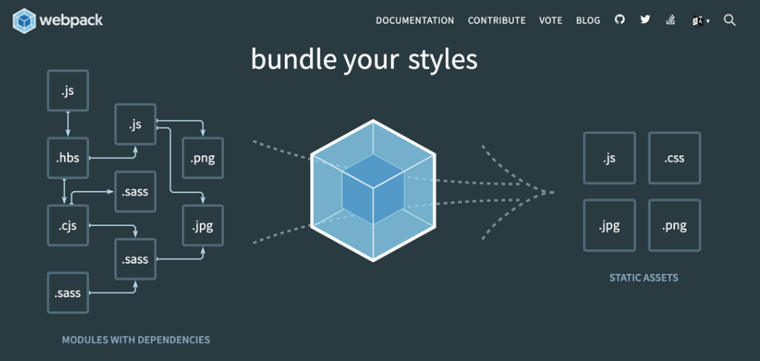
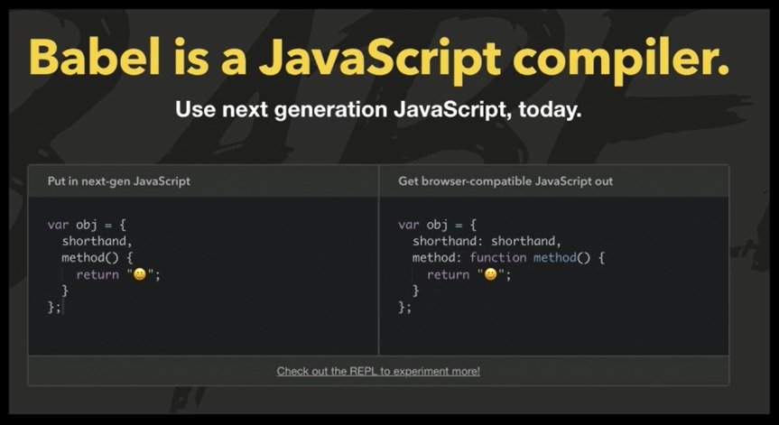
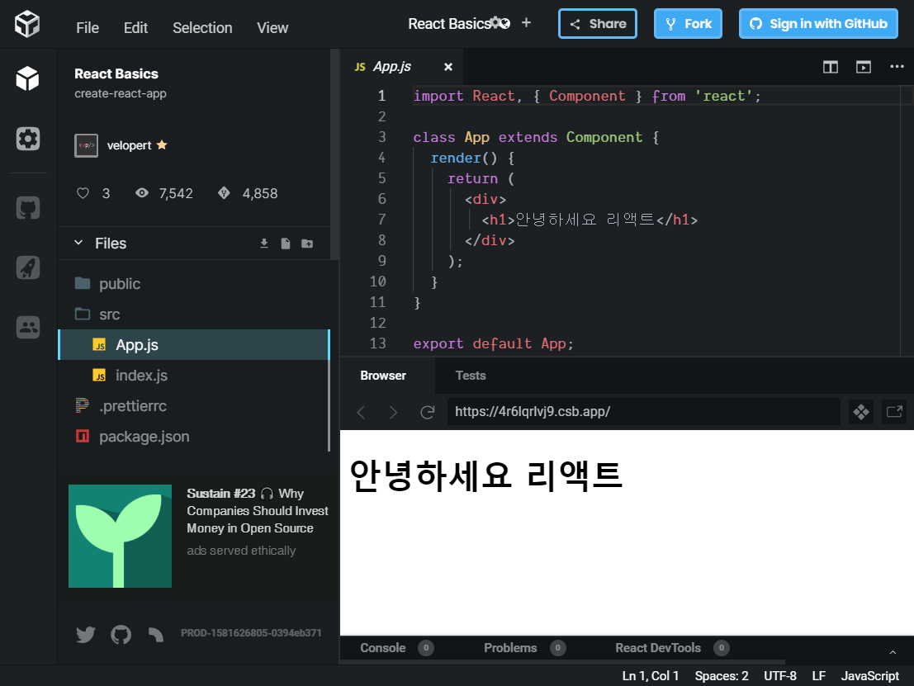

# #1 리액트 프로젝트 시작하기


## 리액트 프로젝트 시작하기

#### Webpack과 Babel

Webpack



코드들을 의존하는 순서대로 잘 합쳐서 하나 또는 여러개의 파일로 결과물을 만들어낸다.

프로젝트를 만들 때 파일을 하나하나 만든 것들을 일일이 html 상에서 불러오는 것이 아니라, 예를 들어서 Javascript 파일에서 png를 사용하겠다고 import 라는 구문으로 불러올 수 있다. 그렇게 하면 빌드, 번들링 작업을 하게될 때 특정 확장자마다 어떠한 처리 작업을 하도록 준비를 해주는 것이다.

이 과정에서 이미지들을 압축하고 그 결과물로는 특정 경로의 특정 이름으로 따로 저장하게끔 해줄 수 있다.

자바스크립트 파일에서 import를 한다. 자바스크립트에서 png를 불러오려고 한다면 나중에 빌드 되었을 때 사용될 경로가 문자열로 들어오게 된다.

png를 불러왔는데, 불러온 것을 조회하려면 실제로 저장된 경로가 문자열로써 받아와진다. 그것을 특정 부분에서 보여준다는 식으로 사용할 수 있다.

자바스크립트 파일을 여러개 만들었을 때, 나중에 하나하나 합쳐서 하나의 파일로 만들어준다.

기본적으로는 하나의 파일을 만들어주는데, 나중에 원한다면 규칙에 따라 분리시켜줄 수도 있다.

ES6. 모던자바스크립트를 사용

일부 새로운 자바스크립트 문법들은 구형 브라우저에서 지원이 안된다. 그래서 새로운 문법을 사용할 수 있게끔 Babel을 사용할 것이다.

자바스크립트도 변하는 과정을 거쳐서 빌드를 해주면 자바스크립트 파일이 여러 종류의 브라우저에서 실행이 될 수 있다.

스타일의 경우 sass나 alias를 사용한다면 웹팩에 연동을 시켜서 컴파일 시킨 다음 하나의 css 파일, 혹은 여러개의 css 파일로 변환을 해서 따로 저장을 해준다.

나중에 결과적으로는 어떤 html 파일에서 그것들을 불러와서 사용할 수 있게끔 자동으로 처리를 해줄 수 있다.


우리가 웹 프로젝트를 만들 때 전체적으로 파일들을 관리해주는 도구


Babel



자바스크립트 변환 도구이다.

자바스크립트는 계속해서 새로운 문법이 도입되고 있고, 계속해서 더 좋아지고 있다.

하지만 Node.js나 브라우저의 자바스크립트 엔진에서 그 모든 문법을 지원하지는 않는다.

예를 들어 개발자들이 이런 문법이 있으면 편하겠다고 제시를 하면, 그 문법을 이전 자바스크립트로 변환하는 플러그인을 작성하고, 나중에 실제 자바스크립트에 그것이 도입이 되거나 말거나 하는 것이다.


Babel 홈페이지

https://babeljs.io/


다양한 문법들이 나타난다.

직접 클릭하면 입력해볼수도 있다.


React에서는 JSX라는 React Component를 작성할 때 사용하는 문법이 있다.

그것을 사용할 때에도 Babel이라는 도구가 사용된다.


초기 단계에서는 Babel과 Webpack을 직접 건드릴 일은 없다.

일단 지금 단계에서는 이러한 도구가 사용되고 있다는 정도만 이해


## 본격적인 리액트 코드 작성하기

CodeSandBox (Online web application editor)

https://codesandbox.io/


리액트 프로젝트 시작하기

https://bit.ly/beginreact


React 말고도 Angular, Vue 같은 프로젝트도 바로 실행 가능

파일 목록, 코드 수정, 자동완성, 화면 미리보기 등




상단의 Fork 버튼 클릭 => 직접 코드 수정


App.js 파일을 보면 class라는 문법이 사용되어있다.


```react
import React, { Component } from 'react';	// #1

class App extends Component {				// #2
  render() {								// #3
    return (
      <div>
        <h1>안녕하세요 리액트</h1>
      </div>
    );
  }
}

export default App;
```

#1

React 모듈이 설치되어 있는데, 그것을 불러와서 사용하겠다는 의미

React를 사용할 때 꼭 React를 불러와줘야 한다.


#2

class라는 문법이 사용됨

컴포넌트를 만드는 방법에는 2가지가 있는데, 첫 번째 방식은 class를 이용해 만드는 것이다.

또 다른 방법으로는 함수를 통해서 컴포넌트를 만드는 방법이 있다.


#3

render() 메서드에는 꼭 JSX 형태의 코드를 return 해줘야 한다.

