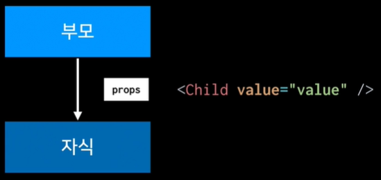
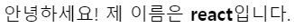
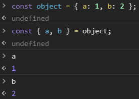
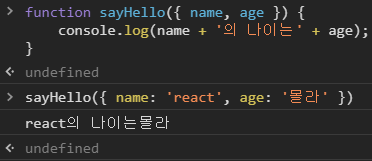
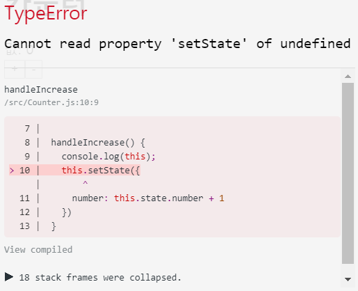
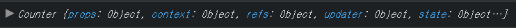

# #3 props와 state

props와 state는 React에서 데이터를 다룰 때 사용되는 개념이다.


## Props를 사용하는 방법

props는 부모 컴포넌트가 자식 컴포넌트한테 값을 전달할 때 사용된다.




컴포넌트를 만들게 되면 그것을 불러와서 사용할 수 있다.

만약 어떤 값을 컴포넌트를 렌더링 할 때 전달해주고 싶으면 위와 같은 방식(value="value")으로 넣어주게 된다.

이 과정에서 값을 넣어주는 것을 props라고 한다. value가 하나의 props인 것이다. 부모가 자식한테 넘겨주는 값이 props이다.


컴포넌트 만들기

src 디렉터리에 새로운 컴포넌트를 만들 것이다. MyName.js 를 생성

MyName.js

```react
import React, { Component } from 'react';

class MyName extends Component {
  render() {
    return (
      <div>
        안녕하세요! 제 이름은 <b>{this.props.name}</b>입니다.
      </div>
    );
  }
}

export default MyName;
```


App.js

```react
import React, { Component } from 'react';
import MyName from './MyName';

class App extends Component {
  render() {
    return <MyName name="리액트" />;
  }
}

export default App;
```


name 값을 실수로 빠뜨릴 경우가 있다. props가 안들어가지게 되었을 때, default props를 사용해서 기본값을 설정할 수 있다.

기본값은 컴포넌트 내에서 static defaultProps를 사용해 설정


MyName.js

```react
import React, { Component } from 'react';

class MyName extends Component {
  static defaultProps = {
    name: '기본이름'
  }
  render() {
    return (
      <div>
        안녕하세요! 제 이름은 <b>{this.props.name}</b>입니다.
      </div>
    );
  }
}

export default MyName;
```


App.js

```react
import React, { Component } from 'react';
import MyName from './MyName';

class App extends Component {
  render() {
    return <MyName />;
  }
}

export default App;
```


defaultProps 를 설정할 때에는 static 값을 class 내부에 선언하면 된다.


또다른 방식

class 하단에서 기본값 설정


MyName.js

```react
import React, { Component } from 'react';

class MyName extends Component {
  render() {
    return (
      <div>
        안녕하세요! 제 이름은 <b>{this.props.name}</b>입니다.
      </div>
    );
  }
}

MyName.defaultProps = {
  name: 'react'
};

export default MyName;
```


App.js

```react
import React, { Component } from 'react';
import MyName from './MyName';

class App extends Component {
  render() {
    return <MyName />;
  }
}

export default App;
```





두가지 방식 

class 내부에서 선언하는 것과 class 외부에서 선언하는 것은 완전히 똑같은 코드

내부에서 static으로 선언했던 것이 더 최신 자바스크립트의 문법이다.

그렇게 적어주고 나면 나중에 Babel이 해당 코드를 변환하는 과정에서 아래로 내려준다.

결과적으로는 똑같은 코드

앞으로 기본값을 설정할 때 class 내부에서 static을 이용


컴포넌트를 만들 때 class를 사용해서 만드는데, 또 다른 방법이 있다.

함수형 컴포넌트


함수형 컴포넌트는 단순히 props만 받아와서 보여주는 경우, 지금처럼 딱히 기능이 없이 그대로 뭔가를 받아와서 보여주기만 하는 경우에는 주로 함수형 컴포넌트로 작성한다.


MyName.js (함수형 컴포넌트)

```react
import React from 'react';

const MyName = ({ name }) => {
  return <div>안녕하세요! 제 이름은 <b>{name}</b>입니다.</div>;
};

MyName.defaultProps = {
  name: 'react'
};

export default MyName;
```


함수형 컴포넌트를 만들게 되면 더 이상 코드의 상단에서 Component를 불러오지 않아도 된다.

내부적으로 JSX가 만들어질 때에는 React를 사용하기 때문에 React를 불러오는 코드는 계속 유지해줘야 한다.


비구조화 할당 문법

https://developer.mozilla.org/ko/docs/Web/JavaScript/Reference/Operators/Destructuring_assignment


개발자 도구를 열어서 확인

```javascript
const object = { a: 1, b: 2 };
// const a = object.a; const b = object.b;
const { a, b } = object;
a
b
```





```javascript
function sayHello({ name, age }) {
    console.log(name + '의 나이는' + age);
}

sayHello({ name: 'react', age: '몰라' })
```





전달해준 객체의 name 값과 age 값을 하나하나 추출해서 넣어주게 된다.


하나의 객체 형태의 파라미터인데, 객체 내부에 있는 name 값을 props로 받아와 그 값을 사용하는 구조이다.


함수형 컴포넌트와 클래스형 컴포넌트의 주요 차이점은 state라는 기능이 없고, LifeCycle 기능도 빠져있다.


함수형 컴포넌트는 초기 mount 속도가 미세하게 조금 더 빠르다.

불필요한 기능이 없기 때문에 메모리 자원도 덜 사용한다.

만약 컴포넌트를 만드는데 지금처럼 단순히 어떤 값을 받아와서 보여주기만 하는 용도라면 함수형 컴포넌트를 만들면 나중에 컴포넌트 수가 엄청나게 많아졌을 때 속도가 조금 최적화될 수 있다.


컴포넌트를 엄청나게 많이 만드는게 아니라면 사실상 성능적으로 큰 차이는 없다. 다만 컴포넌트 만드는 것을 더 간단하게 할 수 있다.

나중에 가면 컴포넌트를 만들 때 컴포넌트의 기능과 컴포넌트가 어떻게 보여지는지를 따로 작업을 한다.

Presentational Component와 Container Component

리덕스


props 값은 부모가 자식한테 주는 값이고, 주는 방법은 컴포넌트를 렌더링 할 때 특정 값을 설정해주는 방식으로 준다.

props 값은 자식 입장으로써는 읽기 전용이다.


## State를 사용하는 방법


state는 컴포넌트 자기 자신이 들고있다.


state는 내부에서 변경할 수 있다.

변경할 때에는 언제나 setState라는 함수를 사용한다.


만약 변화가 필요하다면 컴포넌트의 내장 함수중인 하나인 setState를 통해서 값을 설정해준다.


새로운 컴포넌트 생성

Counter.js

```react
import React, { Component } from 'react';

class Counter extends Component {
  render() {
    return (
      <div>
        <h1>카운터</h1>
        <div>값: 0</div>
        <button>+</button>
        <button>-</button>
      </div>
    );
  }
}

export default Counter;
```


App.js

```react
import React, { Component } from 'react';
import Counter from './Counter';

class App extends Component {
  render() {
    return <Counter />;
  }
}

export default App;
```


지금은 아무 작동도 하지 않는다.


카운터에 있는 값은 유동적이다. 누르면 바뀔건데, 바뀔 때마다 컴포넌트는 rerender를 해줘야 한다.

state 정의 => 객체여야 한다.


값에 변화를 주기 위해서는 custom method를 만들어줘야 한다.

값을 Update 할 때에는 언제나 this.setState() 함수를 사용


버튼을 클릭했을 때 handleIncrease, handleDecrease 함수가 호출되게 하고싶다.

=> 이벤트를 설정해줘야 한다. onClick. 클릭했을 때 발생하는 이벤트 설정


Counter.js

```react
import React, { Component } from 'react';

class Counter extends Component {
  state = {
    number: 0
  }

  handleIncrease = () => {
    this.setState({
      number: this.state.number + 1
    })
  }

  handleDecrease = () => {
    this.setState({
      number: this.state.number - 1
    })
  }

  render() {
    return (
      <div>
        <h1>카운터</h1>
        <div>값: {this.state.number}</div>
        <button onClick={this.handleIncrease}>+</button>
        <button onClick={this.handleDecrease}>-</button>
      </div>
    );
  }
}

export default Counter;
```


버튼을 클릭하면 값이 증가하거나 감소한다.


render 함수는 일반 함수처럼 작성했는데, 왜 handleIncrease 와 handleDecrease 는 화살표 함수로 작성했는가?


만약 화살표 함수를 사용하지 않고 일반 함수를 사용하게 되면 함수 내부에서 this가 뭔지 모르게 된다.

```react
  handleIncrease() {
    console.log(this);
    this.setState({
      number: this.state.number + 1
    })
  }
```




Console을 확인하면 `undefined`가 나타난다. this가 `undefined`이다.

함수를 선언할 때 일반함수로 선언하면 this가 뭔지 모른다.


constructor 는 컴포넌트가 만들어질 때마다 호출되는 함수이다.

extends Component를 했기 때문에 컴포넌트가 가지고 있는 생성함수를 먼저 호출해줘야 한다. => super(props);

handleIncrease 와 handleDecrease 에서 사용하는 this가 constructor에서 사용하는 this 라는 것을 명시 => bind


Counter.js

```react
import React, { Component } from 'react';

class Counter extends Component {
  state = {
    number: 0
  };

  constructor(props) {
    super(props);
    this.handleIncrease = this.handleIncrease.bind(this);
    this.handleDecrease = this.handleDecrease.bind(this);
  }
  handleIncrease() {
    console.log(this);
    this.setState({
      number: this.state.number + 1
    })
  }

  handleDecrease = () => {
    this.setState({
      number: this.state.number - 1
    })
  }

  render() {
    return (
      <div>
        <h1>카운터</h1>
        <div>값: {this.state.number}</div>
        <button onClick={this.handleIncrease}>+</button>
        <button onClick={this.handleDecrease}>-</button>
      </div>
    );
  }
}

export default Counter;
```

작 작동하는 것을 확인할 수 있다.


Console 쪽에도 this가 잘 나오는 것을 확인할 수 있다.




애초에 처음부터 화살표 함수로 만들면 이런 작업은 필요없다.


state는 컴포넌트 내부에 있고, 컴포넌트 내부에서 바뀔 수 있는 값이다.

state 값이 바뀔 때마다 컴포넌트는 rerendering이 된다.

값을 바꿀 때에는 꼭 setState라는 함수를 사용해야 한다.

만약 직접 값을 바꾸게된다면 rerendering을 하지 않아서 원하는 값이 나타나지 않게 된다.

