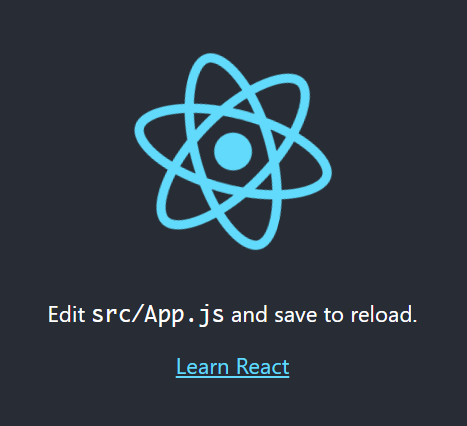

# #5 리액트 작업환경 직접 설정하기


## 필요한 도구 설치하기

node.js

우리가 node.js 를 직접적으로 사용하지는 않는다. 대신에 React 프로젝트를 작성하는 과정에서 필요한 도구인 웹팩과 바벨 등의 도구들이 node.js를 사용하기 때문에 설치해야 한다.


Node.js 설치하기

Node.js 를 현재 기준 LTS 버전인 v8 버전을 설치하세요. 윈도우의 경우에 노드 공식 홈페이지 다운로드 페이지 에서 설치를 하면 됩니다.


https://nodejs.org/ko/


그리고, macOS, Linux 의 경우 다음과 같이 nvm 을 통해서 설치하는것을 추천드립니다. nvm은 여러 종류의 Node.js 버전을 설치할 수 있게 해주는 버전입니다. 나중에 새 버전이 나왔을 때 업데이트 하기도 쉽고, 터미널을 통해 어떤 버전을 사용할지 설정 할 수도 있어서 편리합니다.


nvm : node version manager

https://github.com/nvm-sh/nvm


```bash
$ curl -o- https://raw.githubusercontent.com/nvm-sh/nvm/v0.35.2/install.sh | bash
$ nvm install --lts
```


node.js 를 설치하면 node module 관리자인 npm 이라는 것이 설치된다. 프로젝트에서 사용되는 라이브러리를 설치하고, 해당 라이브러리들이 버전 관리를 하게될 때 npm 이라는 도구를 사용한다. 앞으로 React 개발을 할 때 npm을 사용해도 무방하기는 한데, 그 대신에 yarn 이라는 도구를 사용하는 것을 추천한다.

yarn은 조금 개선된 버전의 npm이다. yarn을 사용하는 이유는 더 나은 속도와 캐싱 시스템을 사용하기 위함이다. 워낙 우리나라의 인터넷이 빠르다보니까 한국에서는 속도적으로는 큰 차이가 없다. 그러나 해외에서 사용할 경우나 느린 인터넷에서 사용할 경우, 성능이 좋지 않은 컴퓨터로 할 때 확실히 설치 속도 차이가 난다.

yarn을 설치하게 될 때는 운영체제마다 설치 방법이 조금씩 다르다. 

https://classic.yarnpkg.com/en/docs/install#mac-stable


에디터

파일을 작성할 때 사용할 에디터 설치.

VSCode

VSCode 홈페이지에 가서 다운로드 받으면 된다.

https://code.visualstudio.com/


윈도우의 경우 Git Bash 설치

일반적으로 bash 터미널을 사용하는 것이 일반 cmd를 사용하는 것보다 편하다.


## Create react app 사용하기


잘 설치됐는지 확인


cmd

```bash
C:\Users\TTak>node -v
v12.14.1

C:\Users\TTak>npm -v
6.13.7
```


create react app 도구

이전에는 우리가 Package.json 파일을 작성해서 바벨과 웹팩같은 것들을 직접 설치하고 설정하고 React 관련 라이브러리도 직접 설치하는 등 설정할 것이 많았는데, 이 작업을 간소화해준 페이스북에서 만들어준 도구이다.

create react app이 없을 때에는 프로젝트 설정을 처음부터 직접 하거나 보일러 플레이트라고 해서 이미 프로젝트가 설정된 것들을 github에서 clone 해서 사용했는데, create react app이 정말로 잘 만들어졌고, 실제로 실무에서도 이걸로 프로젝트를 만들어서 사용하고 있다.


앞으로 작업 할 작업 공간 만들기 => 디렉터리 생성

C:\react


리액트 프로젝트 생성

```bash
$ npx create-react-app 생성할프로젝트이름
```


```bash
C:\react>npx create-react-app contact-app

Creating a new React app in C:\react\contact-app.
...
Success! Created contact-app at C:\react\contact-app
Inside that directory, you can run several commands:

  npm start
    Starts the development server.

  npm run build
    Bundles the app into static files for production.

  npm test
    Starts the test runner.

  npm run eject
    Removes this tool and copies build dependencies, configuration files
    and scripts into the app directory. If you do this, you can’t go back!

We suggest that you begin by typing:

  cd contact-app
  npm start

Happy hacking!
```


```bash
C:\react>cd contact-app
C:\react\contact-app>npm start
```





브라우저가 뜨면서 돌아가는 React 아이콘이 보인다.

React 프로젝트의 초기 상태

VSCode 로 방금 만든 디렉터리 열어보기


src 디렉터리 => index.js

상단에서 React 와 ReactDOM을 불러왔다.

css 파일과 메인으로 사용할 App 컴포넌트, 

serviceWorker : 브라우저 상에서 serviceWorker 라는 기능을 사용하기 위한 타입이다.

ReactDOM.render : 특정 ID를 가지고 있는 DOM을 가지고 와서 거기에 React 컴포넌트를 그리겠다. root 컴포넌트는 public 의 index.html 파일을 보면 id="root" 라고 나와있다.

getElementById('root') 해서 그 DOM을 가져와서 거기에 App 컴포넌트를 그리겠다.

App.js : App에 관련된 코드가 있다.

package.json 파일을 보면 굉장히 간단하게 있다. react 밖에 없다. 원래는 리액트 프로젝트를 만들면 웹팩 설정이나 바벨 설정 때문에 프로젝트가 엄청나게 복잡해지는데, create react app 으로 만들고 나면 그 설정이 다 node_modules 의 react-scripts 안에 숨어져있다. 실제로 사용되고 있는 웹팩과 바벨 설정같은 것들이 그 안에 다 들어있다.


만약 설정들을 customizing 해야한다면 우선 터미널에서 `Ctrl + c` 를 눌러 서버를 끈다.

yarn eject 를 입력하면 정말로 설정 파일을 꺼낼것입니까? 이것은 되돌릴 수가 없어요. 라고 알림이 뜨는데 y를 누르면 된다.

파일들이 더 생겨난다. 실제 웹팩 설정과 바벨 설정이 들어있다. package.json 에 설치된 라이브러리들도 늘어났다. 이렇게 한 번 하고 나면 다시 되돌릴 수 없다. 지금은 설정 파일을 건드릴 필요가 없다.


터미널에서 작업할 필요 없이, 보기 => 통합 터미널을 열면 에디터 내부에 터미널을 열 수 있다. 현재 디렉터리에서 열어줄 수가 있다. yarn start를 입력하면 개발 서버가 실행된다.

