# #7 배열 데이터 렌더링 및 관리


## 배열에 데이터 삽입하기

[... spread 전개 연산자 문법](https://developer.mozilla.org/ko/docs/Web/JavaScript/Reference/Operators/Spread_operator)

[Object.assign 함수](https://developer.mozilla.org/ko/docs/Web/JavaScript/Reference/Global_Objects/Object/assign)


코드:

https://codesandbox.io/s/42rw81qvx


### 자식 컴포넌트가 부모한테 값 전달하기

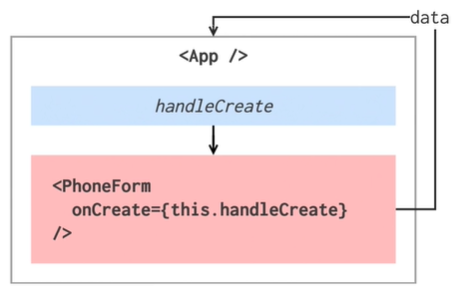


자식 컴포넌트가 부모한테 값을 전달할 때에는 App 컴포넌트 내부에서 handleCreate라는 메서드를 만든다. 그리고 그 메서드를 우리가 만든 자식 컴포넌트한테 props로 전달을 해주고, 여기에서 props로 전달한 함수를 호출시켜서 데이터 값이 App 한테 들어가도록 작성한다.


App.js

```react
import React, { Component } from 'react';
import PhoneForm from './component/PhoneForm';

class App extends Component {

  handleCreate = (data) => {
    console.log(data);
  }

  render() {
    return (
      <div>
        <PhoneForm onCreate={this.handleCreate}/>
      </div>
    );
  }
}

export default App;
```

handleCreate 라는 함수를 만든다. data를 파라미터로 가져온다.


PhoneForm.js

```react
import React, { Component } from 'react';

class PhoneForm extends Component {

    state = {
        name: '',
        phone: '',
    }

    handleChange = (e) => {
        this.setState({
            [e.target.name]: e.target.value
        });
    }

    render() {
        return (
            <form>
                <input
                    name="name"
                    placeholder="이름"
                    onChange={this.handleChange}
                    value={this.state.name}
                />
                <input
                    name="phone"
                    placeholder="전화번호"
                    onChange={this.handleChange}
                    value={this.state.phone}
                />
                <button type="submit">등록</button>
                <div>
                    {this.state.name} {this.state.phone}
                </div>
            </form>
        );
    }
}

export default PhoneForm;
```

submit 버튼을 만든다.


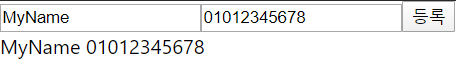


```URL
http://localhost:3000/?name=MyName&phone=01012345678
```

데이터 입력 후 등록 버튼 클릭


PhoneForm.js

```react
import React, { Component } from 'react';

class PhoneForm extends Component {

    state = {
        name: '',
        phone: '',
    }

    handleChange = (e) => {
        this.setState({
            [e.target.name]: e.target.value
        });
    }

    handleSubmit = (e) => {
        e.preventDefault();
        this.props.onCreate(this.state);
    }

    render() {
        return (
            <form onSubmit={this.handleSubmit}>
                <input
                    name="name"
                    placeholder="이름"
                    onChange={this.handleChange}
                    value={this.state.name}
                />
                <input
                    name="phone"
                    placeholder="전화번호"
                    onChange={this.handleChange}
                    value={this.state.phone}
                />
                <button type="submit">등록</button>
                <div>
                    {this.state.name} {this.state.phone}
                </div>
            </form>
        );
    }
}

export default PhoneForm;
```


원래 HTML 에서 form 속성이 submit 버튼을 누르면 새로고침이 한 번 일어나게 되어 있는데, 우리는 새로고침을 할 필요가 없기 때문에 일단 이것을 방지시켜줘야 한다.

이것을 하기 위해서 handleSubmit 함수를 구현해야 한다.

페이지가 reloading 되는 것을 방지하기 위해서 e.preventDefault() 라는 함수를 호출해줘야 한다. preventDefault 함수는 원래 해야할 작업을 안하는 것이다. 원래는 데이터를 입력해서 등록을 하게 되면 URL에 값들을 넣어서 새로고침이 되게 되어있는데, preventDefault가 그것을 방지시켜준다.

handleSubmit 을 form 에다가 onSubmit 이라는 props로 전달해준다.

=> 등록 버튼을 눌러도 아무 반응이 없어진다.


handleSubmit 함수에서 props로 받았던 onCreate 함수를 호출한다.


이름, 전화번호를 입력 후 등록 버튼 클릭

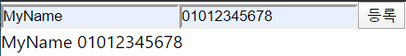


개발자 도구 Console 에서 확인

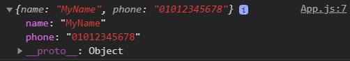


App.js

```react
import React, { Component } from 'react';
import PhoneForm from './component/PhoneForm';

class App extends Component {

  state = {
    information: [],
  }

  handleCreate = (data) => {
    this.setState({
      information: this.state.information.concat(data)
    });
  }

  render() {
    return (
      <div>
        <PhoneForm onCreate={this.handleCreate}/>
        {JSON.stringify(this.state.information)}
      </div>
    );
  }
}

export default App;
```


App.js 가 데이터를 받아왔으니까 그것을 App 안에 들어있는 상태에 담기

배열을 다루는 방법

state 정의. 전화번호부라는 정보를 information 이라는 배열에 넣을 것이다.

리액트에서는 불변성을 꼭 유지해줘야 한다. 어떤 값을 수정하게 될 때 언제나 setState를 사용해야하고, 내부에 있는 배열이나 객체를 바꾸게 될 때에는 기존의 배열이나 객체를 수정하지 않고 그것을 기반으로 새로운 객체나 배열을 만들어서 값을 주입해줘야 한다.

push가 아니라 concat 이라는 배열 내장함수를 사용해야 한다.

기존에 있던 배열은 수정하지 않고 새로운 배열을 만들어서 그 배열에 데이터를 집어넣어서 그 배열을 기존 배열이 있던 자리에 넣어주는 작업을 하게 된다.


information 값을 문자열 형태로 변환해서 보여주기


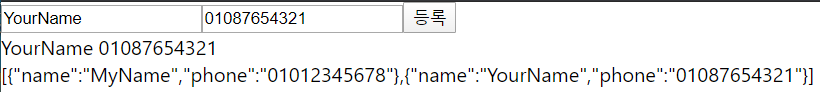


App.js

```react
import React, { Component } from 'react';
import PhoneForm from './component/PhoneForm';

class App extends Component {

  state = {
    information: [],
  }

  handleCreate = (data) => {
    const { information } = this.state;
    this.setState({
      information: information.concat(data)
    });
  }

  render() {
    return (
      <div>
        <PhoneForm onCreate={this.handleCreate}/>
        {JSON.stringify(this.state.information)}
      </div>
    );
  }
}

export default App;
```

비구조화 할당 문법 이용


PhoneForm.js

```react
import React, { Component } from 'react';

class PhoneForm extends Component {

    state = {
        name: '',
        phone: '',
    }

    handleChange = (e) => {
        this.setState({
            [e.target.name]: e.target.value
        });
    }

    handleSubmit = (e) => {
        e.preventDefault();
        this.props.onCreate(this.state);
        this.setState({
            name: '',
            phone: '',
        })
    }

    render() {
        return (
            <form onSubmit={this.handleSubmit}>
                <input
                    name="name"
                    placeholder="이름"
                    onChange={this.handleChange}
                    value={this.state.name}
                />
                <input
                    name="phone"
                    placeholder="전화번호"
                    onChange={this.handleChange}
                    value={this.state.phone}
                />
                <button type="submit">등록</button>
            </form>
        );
    }
}

export default PhoneForm;
```

PhoneForm 컴포넌트에서 뭔가를 등록하면 기존에 있던 input 값들을 초기화

데이터를 입력하면 아래에 보여지던 부분 제거


App.js

```react
import React, { Component } from 'react';
import PhoneForm from './component/PhoneForm';

class App extends Component {

  id = 0;

  state = {
    information: [],
  }

  handleCreate = (data) => {
    const { information } = this.state;
    this.setState({
      information: information.concat({
        ...data,
        id: this.id++
      })
    });
  }

  render() {
    return (
      <div>
        <PhoneForm onCreate={this.handleCreate}/>
        {JSON.stringify(this.state.information)}
      </div>
    );
  }
}

export default App;
```

데이터를 추가할 때마다 각 데이터에 고유한 id 값이 들어가도록 하기

데이터가 추가 될 때마다 id 값이 1씩 증가하고, 그 자리에는 현재 id 값이 들어간다.


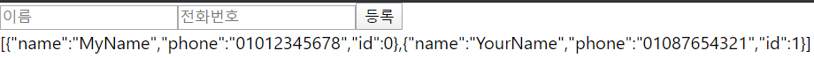


고유한 id 값을 넣어준 이유는 나중에 배열에 있는 것들을 렌더링 해 줄 때 고유한 값인 key 값이 있어야 하기 때문이다.


다른 방법

```react
  handleCreate = (data) => {
    const { information } = this.state;
    this.setState({
      information: information.concat({
        name: data.name,
        phone: data.phone,
        id: this.id++
      })
    });
  }
```


다른 방법

```react
  handleCreate = (data) => {
    const { information } = this.state;
    this.setState({
      information: information.concat(Object.assign({}, data, {
        id: this.id++
      }))
    });
  }
```

Object.assign 함수 사용. 비어있는 객체에 data를 집어넣고, id: this.id++ 도 그 안에 집어넣는다는 의미이다.


id 값은 state에 따로 집어넣지 않았다. id 값은 렌더링 되는 값이 아니기 때문에 굳이 setState를 통해 넣어줄 필요가 없다. setState를 하는 이유는 어떤 값이 수정되었을 때 리렌더링을 꼭 하게끔 하기 위함이다. id 값은 그것과는 관련이 없고, 단순히 어떤 값을 추가할 때 참조하는 값이기 때문에 굳이 state에 넣어주지 않아도 된다.


## 배열 렌더링하기

[배열 내장함수 map()](https://developer.mozilla.org/ko/docs/Web/JavaScript/Reference/Global_Objects/Array/map)


코드:

https://codesandbox.io/s/42rw81qvx


배열 형식으로 된 것들을 컴포넌트 형식으로 변환하는 방법


### JavaScript 배열 내장함수 map

map은 배열을 특정 함수를 사용하여 전체적으로 변환해주고 싶을 때 사용하는 함수이다.


Chrome 콘솔에서 사용해보기

```javascript
const numbers = [1,2,3,4,5];
const squared = numbers.map(n => n * n);
squared
```

numbers 배열을 가지고 내부에 있는 값들을 모두 제곱하기


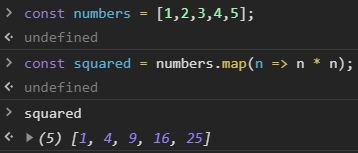


#### PhoneInfo 컴포넌트 생성

각 전화번호 정보를 보여주는 컴포넌트

PhoneInfo.js 파일 생성, rcc 입력


PhoneInfo.js

```react
import React, { Component } from 'react';

class PhoneInfo extends Component {
    render() {
        const { name, phone, id } = this.props.info;

        const style = {
            border: '1px solid black',
            padding: '8px',
            margin: '8px',
        };

        return (
            <div style={style}>
                <div><b>{name}</b></div>
                <div>{phone}</div>
            </div>
        );
    }
}

export default PhoneInfo;
```

props를 비구조화 할당을 통해서 받아온다. info 라는 값을 전달받을 것이고, 거기에서 name, phone, id를 추출해 낸 것이다.

name, phone이 나타나도록 한다.

style 작성


#### PhoneInfoList 컴포넌트 생성

PhoneInfoList.js 파일 생성, rcc 입력


PhoneInfoList.js

```react
import React, { Component } from 'react';
import PhoneInfo from './PhoneInfo';

class PhoneInfoList extends Component {
    render() {
        const { data } = this.props;
        const list = data.map(
            info => (<PhoneInfo info={info} key={info.id} />)
        );
        return (
            <div>
                {list}
            </div>
        );
    }
}

export default PhoneInfoList;
```

앞에서 만들었던 PhoneInfo 를 불러온다. (import)

data 값을 props로 받아온다.

list 라는 값을 만들 것이다. list는 data.map 을 해서 data 안에 있는 info 라는 것을 PhoneInfo 라는 컴포넌트한테 전달해 줄 것인데 거기에 info 값을 넣어주고, key 라는 값이 필요한데, key 값은 컴포넌트를 여러 개 렌더링 하게될 때 고유값을 정해줌으로써 나중에 업데이트 성능을 최적화해주는 것이다. 거기에 info.id 값을 넣어준다.

list를 가지고 렌더링을 한다.

info 들의 배열을 가지고 PhoneInfo 컴포넌트로 변환을 해 준 것이다. 그리고 그것을 그대로 렌더링 해 준 것이다.

만약 this.props 의 데이터가 전달받지 않았다면 data가 배열이 아니므로 렌더링 할 수 없다고 오류가 뜰 것이다.


App.js

```react
import React, { Component } from 'react';
import PhoneForm from './component/PhoneForm';
import PhoneInfoList from './component/PhoneInfoList';

class App extends Component {

  id = 0;

  state = {
    information: [],
  }

  handleCreate = (data) => {
    const { information } = this.state;
    this.setState({
      information: information.concat(Object.assign({}, data, {
        id: this.id++
      }))
    });
  }

  render() {
    return (
      <div>
        <PhoneForm onCreate={this.handleCreate}/>
        <PhoneInfoList />
      </div>
    );
  }
}

export default App;
```


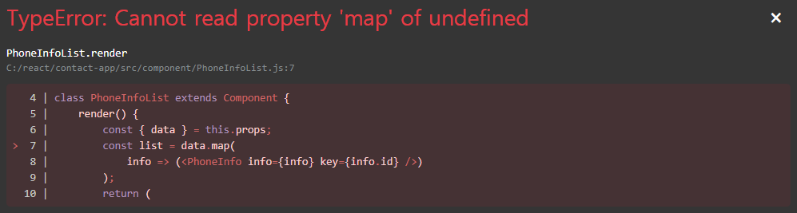


이러한 상황을 해결하는 방법


첫번째 방법

PhoneInfoList.js

```react
import React, { Component } from 'react';
import PhoneInfo from './PhoneInfo';

class PhoneInfoList extends Component {
    render() {
        const { data } = this.props;
        
        if (!data) return null;

        const list = data.map(
            info => (<PhoneInfo info={info} key={info.id} />)
        );
        return (
            <div>
                {list}
            </div>
        );
    }
}

export default PhoneInfoList;
```

만약 data가 없으면 null을 return 한다.


두번째 방법

PhoneInfoList.js

```react
import React, { Component } from 'react';
import PhoneInfo from './PhoneInfo';

class PhoneInfoList extends Component {
    static defaultProps = {
        data: []
    }
    
    render() {
        const { data } = this.props;

        const list = data.map(
            info => (<PhoneInfo info={info} key={info.id} />)
        );
        return (
            <div>
                {list}
            </div>
        );
    }
}

export default PhoneInfoList;
```

컴포넌트 defaultProps를 정해줄 수 있다. data 값을 비어있는 배열로 하고, defaultProps를 정해줄 때에는 앞부분에 static 값을 넣어줘야 한다.


App.js

```react
import React, { Component } from 'react';
import PhoneForm from './component/PhoneForm';
import PhoneInfoList from './component/PhoneInfoList';

class App extends Component {

  id = 0;

  state = {
    information: [],
  }

  handleCreate = (data) => {
    const { information } = this.state;
    this.setState({
      information: information.concat(Object.assign({}, data, {
        id: this.id++
      }))
    });
  }

  render() {
    return (
      <div>
        <PhoneForm onCreate={this.handleCreate}/>
        <PhoneInfoList data={this.state.information}/>
      </div>
    );
  }
}

export default App;
```

PhoneInfoList에 information 값을 전달


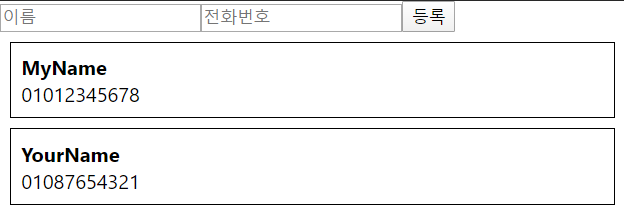


### 배열 렌더링, key

렌더링 할 때 key라는 값을 넣었다. key가 어떤 역할을 하는지 알아보기


#### key 가 없다면?

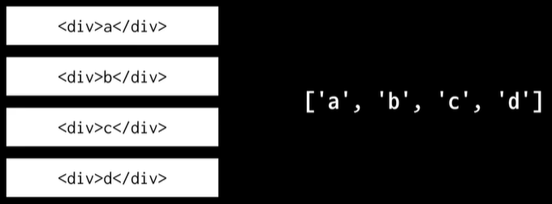


a, b, c, d 라는 내용을 가지고 있는 배열이 있다. 그것을 토대로 a, b, c, d div element 들도 만들어 준 상태이다.

만약 이 상황에서 b와 c 사이에 z 라는 것이 만들어진다면 c가 z로 바뀌고 d가 c로 바뀌고, 아래에 새로 d가 생긴다.


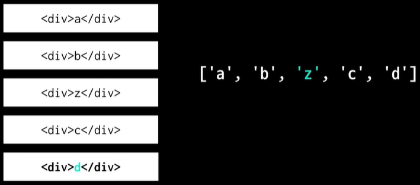


만약 a가 사라졌다고 가정하면 a만 사라지면 되는 것인데, a가 b로 바뀌고, b가 z로 바뀌고, z가 c로 바뀌고, c가 d로 바뀌고, 마지막에 있는 것이 사라지게 된다.


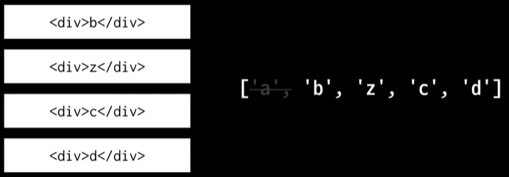


굉장히 비효율적이다.


#### key 가 있다면?

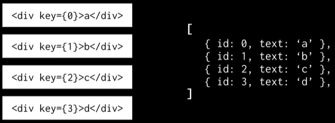


key 값은 고유해야 한다. 하나만 있어야 한다.

만약 1과 2 사이에 5가 생겼다고 가정하자. 기존에 있던 것은 모두 가만히 있고, 그 사이에 key={5} 를 가지고 있는 z가 생긴다.

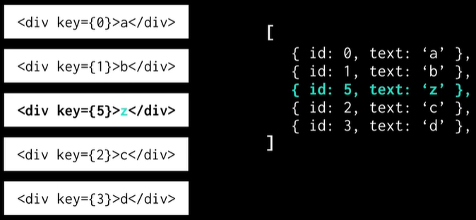


만약 0번이 지워졌다면 그것만 날려버리게 된다.

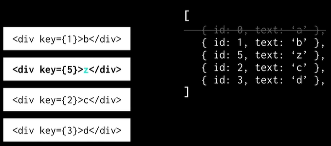


key는 React에서 내부적으로 제거하거나 업데이트 하거나 추가를 하게 될 때 그 작업을 효율적으로 하기 위해서 사용하는 값이다.


key 값을 넣어주지 않은 경우

PhoneInfoList.js

```react
import React, { Component } from 'react';
import PhoneInfo from './PhoneInfo';

class PhoneInfoList extends Component {
    static defaultProps = {
        data: []
    }

    render() {
        const { data } = this.props;

        const list = data.map(
            info => (<PhoneInfo info={info} />)
        );
        return (
            <div>
                {list}
            </div>
        );
    }
}

export default PhoneInfoList;
```

만약에 key 값을 넣어주지 않는다면 일단 렌더링은 된다. 


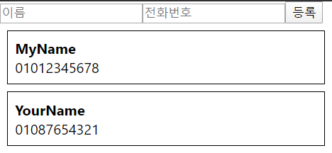


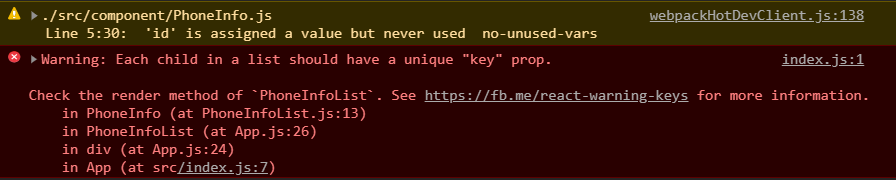


Console을 확인해보면 key가 없다고 경고가 뜬다. 이 때에는 기본적으로 그냥 배열의 index가 key로 사용되고 있는 것이다.

지금은 우리가 id 값을 따로 만들어서 추가할 때마다 그 값을 1씩 더하도록 설정했다. 이게 완전히 index와 다른 점은 나중에 추가, 제거를 할것인데, 제거를 하게 되면 id 값이 index와 다르게 작동할 것이다. 

만약 MyName을 삭제한다고 해서 YourName의 id가 0이 되지는 않는다.


## 배열에서 데이터 제거하기

[배열 내장함수 slice](https://developer.mozilla.org/ko/docs/Web/JavaScript/Reference/Global_Objects/Array/slice)

[배열 내장함수 filter](https://developer.mozilla.org/ko/docs/Web/JavaScript/Reference/Global_Objects/Array/filter)


코드:

https://codesandbox.io/s/0p9k99l48w


데이터를 제거하는 방법

불변성을 유지하면서 작업을 처리해줘야 한다.


### 데이터 제거 (.slice 혹은 .filter)

배열 안에 들어있는 데이터를 불변성을 지키면서 제거할 때에는 자바스크립트 배열의 내장함수 .slice 혹은 .filter를 통해서 할 수 있다.


#### Chrome Console에서 사용해보기

##### .slice 사용

```javascript
const numbers = [1,2,3,4,5];
numbers.slice(0,2);
numbers.slice(0,3);
numbers.slice(1,3);
numbers.slice(3,5);
numbers.slice(0,2).concat(numbers.slice(3,5));
[
    ...numbers.slice(0,2),
    10,
    ...numbers.slice(3,5)
]
numbers
```

`numbers.slice(0,2)` :  index 0에서부터 시작해서 index 2 전까지의 데이터들을 가져오겠다는 의미이다. 기존에 있던 numbers를 건드리지 않고 거기서 1, 2만 가져와서 따로 배열을 만들어준다.

`numbers.slice(3,5)` : index 3부터 시작해서 index가 5인 것에는 아직 값이 없어서 보이지는 않지만 그 전의 값까지 불러와서 4, 5가 들어가게 된다.

`numbers.slice(0,2).concat(numbers.slice(3,5))` : 기존의 배열은 건드리지 않은 채 기존의 배열에서 3을 제외한 값을 가져올 수 있다. 1, 2, 4, 5가 들어가있는 배열을 만들 수 있다.

spread 문법을 사용해서 데이터 수정


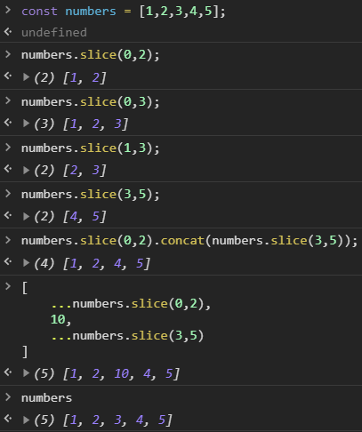


slice 는 배열을 잘라주는 것이다. 배열을 잘라서 서로 붙여줄수도 있다.


##### .filter 사용

데이터를 제거할 때 조금 더 편하다

```javascript
const numbers = [1,2,3,4,5];
numbers.filter(n => n > 3);
numbers.filter(n => n !== 3);
```

filter 함수는 특정 조건을 가지고 값들을 필터링 할 수 있다.

값이 3보다 큰 것을 가져오고 싶은 경우 numbers.filter() 하고 괄호 안에 함수를 넣어주면 된다. 화살표 함수로 작성. n을 파라미터로 가져와서 만약 n이 3보다 크면 따로 분류하고, 그렇지 않으면 포함시키지 않는다. [4, 5] 라는 결과값이 나타난다.

만약 3을 제외한 것들만 따로 가져오고 싶은 경우 즉, 3을 제거하고 싶은 경우. n이 3이 아닌 것들만 따로 필터링. 3이 배열에서 제거된 상태로 나타난다.

filter 함수는 기존의 배열을 건드리지 않기 때문에 numbers를 확인해보면 잘 남아있다. 그렇기 때문에 불변성을 지키면서 배열을 업데이트 해줄 수 있다.


#### React에서 사용

App.js

```react
import React, { Component } from 'react';
import PhoneForm from './component/PhoneForm';
import PhoneInfoList from './component/PhoneInfoList';

class App extends Component {

  id = 0;

  state = {
    information: [],
  }

  handleCreate = (data) => {
    const { information } = this.state;
    this.setState({
      information: information.concat(Object.assign({}, data, {
        id: this.id++
      }))
    });
  }

  handleRemove = (id) => {
    const { information } = this.state;
    this.setState({
      information: information.filter(info => info.id !== id)
    })
  }

  render() {
    return (
      <div>
        <PhoneForm onCreate={this.handleCreate}/>
        <PhoneInfoList
          data={this.state.information}
          onRemove={this.handleRemove}
        />
      </div>
    );
  }
}

export default App;
```

제거기능 구현. 제거를 할 때에는 filter를 사용하면 된다.

handleRemove 함수를 만들고, id 값을 파라미터로 가져온다. 비구조화 할당을 통해서 information 이라는 reference를 따로 만들어준다. this.setState를 해서 information 은 현재 information 에 filter를 걸어서 information 안에 들어있는 info 값이 info.id가 파라미터로 받은 id가 아닌 것들만 필터링해달라고 해준다.

handleRemove 를 PhoneInfoList 한테 전달을 해준다.


PhoneInfoList 를 수정해야 한다. MAC 유저의 경우에는 Command key, 윈도우 유저의 경우에는 Ctrl key 를 누른 상태에서 컴포넌트를 누르면 파일이 바로 열린다.


PhoneInfoList.js

```react
import React, { Component } from 'react';
import PhoneInfo from './PhoneInfo';

class PhoneInfoList extends Component {
    static defaultProps = {
        data: []
    }
    
    render() {
        const { data, onRemove } = this.props;

        const list = data.map(
            info => (
                <PhoneInfo
                    onRemove={onRemove}
                    info={info}
                    key={info.id}
                />
            )
        );
        return (
            <div>
                {list}
            </div>
        );
    }
}

export default PhoneInfoList;
```

onRemove 를 props로 받아왔다. 그 값을 PhoneInfo 한테 그대로 전달한다.


PhoneInfo.js

```react
import React, { Component } from 'react';

class PhoneInfo extends Component {

    handleRemove = () => {
        const { info, onRemove } = this.props;
        onRemove(info.id);
    }

    render() {
        const { name, phone } = this.props.info;

        const style = {
            border: '1px solid black',
            padding: '8px',
            margin: '8px',
        };

        return (
            <div style={style}>
                <div><b>{name}</b></div>
                <div>{phone}</div>
                <button onClick={this.handleRemove}>삭제</button>
            </div>
        );
    }
}

export default PhoneInfo;
```

handleRemove 라는 함수를 구현. info, onRemove 를 props 로 받아왔다. onRemove 한 뒤 info.id 를 파라미터로 전달한다. 하단에 버튼을 하나 만들어서 '삭제' 라고 해주고, onClick 이벤트로 this.handleRemove 해준다.

render 함수 안에서 id 값은 필요없다.


MyName, YourName 등록

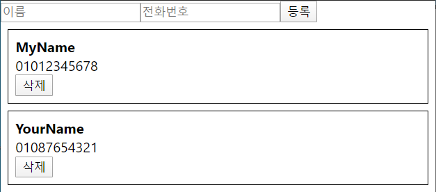


MyName의 삭제 버튼 클릭


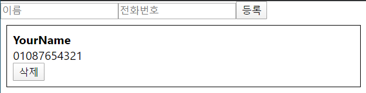


handleRemove 를 따로 구현하지 않는 경우

PhoneInfo.js

```react
import React, { Component } from 'react';

class PhoneInfo extends Component {
    render() {
        const { name, phone, id } = this.props.info;
        const { onRemove } = this.props;

        const style = {
            border: '1px solid black',
            padding: '8px',
            margin: '8px',
        };

        return (
            <div style={style}>
                <div><b>{name}</b></div>
                <div>{phone}</div>
                <button onClick={
                    () => { onRemove(id) }
                }>삭제</button>
            </div>
        );
    }
}

export default PhoneInfo;
```


## 배열 안의 데이터 수정하기

코드:

https://codesandbox.io/s/1l6x9mqv4


### 데이터 수정 (.slice 혹은 .map)

.slice 로 수정할 때에는 배열을 잘라서 그 사이에 값을 넣는 식으로 하면 된다.

map 함수같은 경우에는 배열 안에 있는 모든 값들을 제곱하거나 어떤 데이터 배열을 리엑트 컴포넌트로 변환할 때 등 전체적으로 변화할 때 사용했다. 그런데 특정 조건에 부합될 때에만 변경시키고 그렇지 않으면 그대로 유지하는 것도 가능하다.


#### Chrome Console에서 사용해보기

##### .slice 사용

```javascript
const numbers = [1,2,3,4,5];
[
    ...numbers.slice(0,2),
    9,
    ...numbers.slice(3,5)
]
numbers
```

3을 9로 바꾸고싶은 경우.

기존 배열은 건드리지 않은 상태에서 3만 9로 바꼈다.


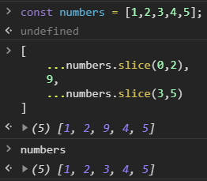


##### .map 사용

```javascript
const numbers = [1,2,3,4,5];
numbers.map(n => {
    if (n === 3) {
        return 9;
    }
    return n;
});
```

특정 조건이 부합할 때에만 변경하기 위해서는 함수를 작성해서 만약 n이 3이면 변경하고 싶은 값을 반환한다. 그렇지 않다면 n을 반환한다.


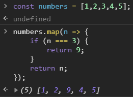


#### React에서 사용


App.js

```react
import React, { Component } from 'react';
import PhoneForm from './component/PhoneForm';
import PhoneInfoList from './component/PhoneInfoList';

class App extends Component {

  id = 0;

  state = {
    information: [],
  }

  handleCreate = (data) => {
    const { information } = this.state;
    this.setState({
      information: information.concat(Object.assign({}, data, {
        id: this.id++
      }))
    });
  }

  handleRemove = (id) => {
    const { information } = this.state;
    this.setState({
      information: information.filter(info => info.id !== id)
    })
  }
  
  handleUpdate = (id, data) => {
    const { information } = this.state;
    this.setState({
      information: information.map(
        info => {
          if (info.id === id) {
            return {
              id,
              ...data,
            };
          }
          return info;
        }
      )
    });
  }

  render() {
    return (
      <div>
        <PhoneForm onCreate={this.handleCreate}/>
        <PhoneInfoList
          data={this.state.information}
          onRemove={this.handleRemove}
          onUpdate={this.handleUpdate}
        />
      </div>
    );
  }
}

export default App;
```

handleUpdate 함수 생성. 이 함수에서는 두 가지 값을 파라미터로 가져온다. 첫번째 값은 id 이고, 두번째 값은 어떻게 바꿀지(data) 이다.

비구조화 할당을 통해 information에 대한 reference를 가져온다.

this.setState 하고 information 해서 information.map 을 한다. 거기서 함수를 설정해준다.

info 값을 파라미터로 가져와서 만약 info가 가지고 있는 id 값이 파라미터로 가져온 id와 일치하는 경우에는 return 해서 id 값은 id 그대로 전달해주고, 내부에 ...data를 함으로써 name 과 phone 값이 들어가지게 한다.

만약 그 조건이 true 가 아니면 원래 받아왔던 것 그대로 info 를 반환한다.

handleUpdate 함수를 PhoneInfoList 한테 onUpdate 라는 함수로 전달해준다.


PhoneInfoList.js

```react
import React, { Component } from 'react';
import PhoneInfo from './PhoneInfo';

class PhoneInfoList extends Component {
    static defaultProps = {
        data: []
    }
    
    render() {
        const { data, onRemove, onUpdate } = this.props;

        const list = data.map(
            info => (
                <PhoneInfo
                    onRemove={onRemove}
                    onUpdate={onUpdate}
                    info={info}
                    key={info.id}
                />
            )
        );
        return (
            <div>
                {list}
            </div>
        );
    }
}

export default PhoneInfoList;
```

전달받았던 onUpdate 를 그대로 PhoneInfo 한테도 전달해준다.


PhoneInfo.js

```react
import React, { Component, Fragment } from 'react';

class PhoneInfo extends Component {

    state = {
        editing: false,
    }

    handleRemove = () => {
        const { info, onRemove } = this.props;
        onRemove(info.id);
    }
    
    handleToggleEdit = () => {
        this.setState({
            editing: !this.state.editing,
        });
    }

    render() {
        const { name, phone } = this.props.info;
        const { editing } = this.state;

        const style = {
            border: '1px solid black',
            padding: '8px',
            margin: '8px',
        };

        return (
            <div style={style}>
                {
                    editing ? (
                        <Fragment>
                            <div><input /></div>
                            <div><input /></div>
                        </Fragment>
                    ) : (
                        <Fragment>
                            <div><b>{name}</b></div>
                            <div>{phone}</div>
                        </Fragment>
                    )
                }
                <button onClick={this.handleRemove}>삭제</button>
                <button onClick={this.handleToggleEdit}>수정</button>
            </div>
        );
    }
}

export default PhoneInfo;
```

onUpdate 를 사용하는 logic 작성. PhoneInfo 컴포넌트에 수정모드 라는 것을 만들 것이다.

state를 정의해서 editing 이라는 값을 설정한다. 기본값은 false 이다.

수정 버튼을 만든다.

handleToggleEdit 함수를 만든다. handleToggleEdit 는 editing 값을 반전시켜준다. 만약 그 값이 false 라면 true로, true 라면 false로 해 줄 것이다.

editing 값이 true 가 되면 return 에서 `<div>` 로 보여주는 것이 아니라 `<input>` 으로 보여줄것이다.

editing 이라는 값을 state 에서 가져와서 reference 를 만들어준다.

상단에서 Fragment 라는 것을 불러온다.

모든 컴포넌트는 무언가에 의해 감싸져있어야 한다. 만약 감싸주고 싶은데, 추가적인 `<div>`를 만들어주고 싶지 않은 경우 `<div>` 대신에 `<Fragment>`를 사용해도 된다.

만약 editing 값이 true 라면 `<input>`을 2개 만들어 주고 `<Fragment>`로 감싸준다. 세로로 나오도록 하고 싶으므로 각 `<input>`을 `<div>`로 감싸준다.

editing 값이 false 일때는 기존에 있던 것을 보여준다. `<Fragment>`를 사용한다.

수정 버튼에 이벤트를 연결한다.


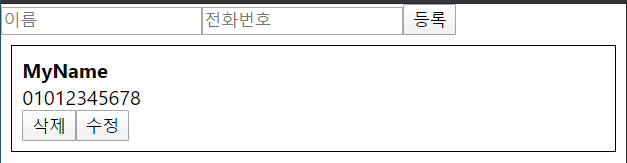


수정 버튼 클릭


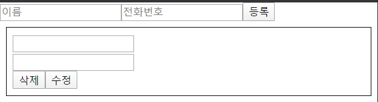


PhoneInfo.js

```react
import React, { Component, Fragment } from 'react';

class PhoneInfo extends Component {

    state = {
        editing: false,
        name: '',
        phone: ''
    }

    handleRemove = () => {
        const { info, onRemove } = this.props;
        onRemove(info.id);
    }
    
    handleToggleEdit = () => {
        // true -> false
            // onUpdate
        // false -> true
            // state 에 info 값을 넣어주기
        const { info, onUpdate } = this.props;
        if (this.state.editing) {
            onUpdate(info.id, {
                name: this.state.name,
                phone: this.state.phone
            });
        } else {
            this.setState({
                name: info.name,
                phone: info.phone
            });
        }
        this.setState({
            editing: !this.state.editing,
        });
    }

    handleChange = (e) => {
        this.setState({
            [e.target.name]: e.target.value
        });
    }

    render() {
        const { name, phone } = this.props.info;
        const { editing } = this.state;

        const style = {
            border: '1px solid black',
            padding: '8px',
            margin: '8px',
        };

        return (
            <div style={style}>
                {
                    editing ? (
                        <Fragment>
                            <div>
                                <input
                                    name="name"
                                    onChange={this.handleChange}
                                    value={this.state.name}
                                />
                            </div>
                            <div>
                                <input
                                    name="phone"
                                    onChange={this.handleChange}
                                    value={this.state.phone}
                                />
                            </div>
                        </Fragment>
                    ) : (
                        <Fragment>
                            <div><b>{name}</b></div>
                            <div>{phone}</div>
                        </Fragment>
                    )
                }
                <button onClick={this.handleRemove}>삭제</button>
                <button onClick={this.handleToggleEdit}>
                    { editing ? '적용' : '수정' }
                </button>
            </div>
        );
    }
}

export default PhoneInfo;
```

'수정'이 editing 모드일 경우에는 '적용'이라고 나타나도록 할 것이다. 삼항연산자 사용.

'수정'을 눌렀을 때 우리가 props로 가지고 있던 값들이 input의 값으로 들어가지게 만들어줘야 한다.

state 에서 input 의 값들을 관리해줘야 한다. state 에 name 값과 phone 값을 넣어준다.

handleChange 를 구현한다. this.setState 해서 [e.target.name] 값을 e.target.value 로 해주겠다고 한다.

handleChange 를 input에 연결한다. value 값도 설정한다. name 도 넣어준다.

name 값과 phone 값이 처음에는 공백이다.

수정하게 될 때 원래 등록되어있던 값이 기본값으로 들어가게 해주기 위해서는 handleToggleEdit 에서 logic을 작성해줘야 한다.

두가지 logic 을 작성해줘야 한다.

첫번째로는 editing 값이 true에서 false로 전환 될 때이다. 이 때에는 전달받은 onUpdate 함수를 사용해서 내가 update 하겠다는 것을 부모 컴포넌트한테 알린다.

editing 값이 false에서 true로 전환 될 때에는 props 로 받아왔던 info 안에 있는 name 과 phone 값을 state 쪽에 넣어주는 작업을 해줘야한다.

비구조화 할당 문법을 통해서 info 값과 onUpdate 값에 대한 reference를 만들어준다.

만약 현재 editing 값이 true 라면 (true 에서 false 로 전환이 된다면) onUpdate 의 첫번째 파라미터에 info.id, 두번째에 어떻게 업데이트 할지에 대한 정보인 현재 들고있는 state를 담아줄것이다. 지금같은 경우에는 editing 값은 불필요하다. this.state 말고 직접 name, phone 을 넣어준다.

만약 editing 값이 false 라면 (false 에서 true 로 전환이 된다면) this.setState 를 통해서 name 값은 info.name 으로, phone 값은 info.phone 으로 해준다.


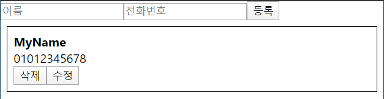


수정 버튼 클릭 후 내용 수정


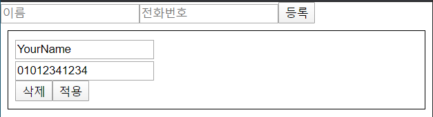


적용 버튼 클릭


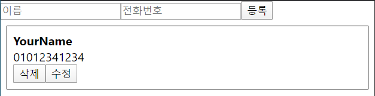


수정 기능 구현 완료

