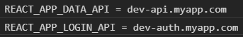

# 1. 리액트 프로젝트 시작하기


## 1.1 리액트란 무엇인가

* 리액트는 페이스북에서 개발하고 관리하는 UI 라이브러리다.
* 리액트는 UI 기능만 제공한다. => 전역 상태 관리, 라우팅, 빌드 시스템 등을 각 개발자가 직접 구축해야 한다.
* 리액트의 장점은 가상 돔(virtual dom)을 통해서 UI를 빠르게 업데이트한다.
* 가상 돔은 이전 UI 상태를 메모리에 유지해서, 변경될 UI의 최소 집합을 계산하는 기술이다.
* 리액트에는 다음과 같은 제약 사항이 있다.
  * 렌더 함수는 순수 함수로 작성해야 한다.
  * 컴포넌트 상탯값은 불변 객체로 관리해야 한다.


## 1.2 리액트 개발 환경 직접 구축하기

* 리액트는 UI 라이브러리이기 때문에 UI를 제외한 나머지 요소들은 개발자가 신경써서 관리해야 한다.
* 하나의 웹 애플리케이션을 만들기 위해서는 테스트 시스템, 빌드 시스템, 라우팅 시스템 등 UI 외에도 신경 써야 할 부분이 많다.
* 리액트 개발 환경을 직접 구축하기보다는 create-react-app과 같은 도구를 이용하는 것을 추천


리액트 개발 환경을 직접 구축해보기 => 바벨과 웹팩의 필요성 이해


### 1.2.1 Hello World 페이지 만들기

외부 패키지를 전혀 사용하지 않고 리액트로 간단한 웹 페이지 만들어보기

C:\react 디렉터리 생성

C:\react 디렉터리에 hello-world 디렉터리 생성


다음 경로에서 리액트 자바스크립트 파일 4개를 내려받는다.


(1) https://unpkg.com/react@16.12.0/umd/react.development.js

(2) https://unpkg.com/react@16.12.0/umd/react.production.min.js

(3) https://unpkg.com/react-dom@16.12.0/umd/react-dom.development.js

(4) https://unpkg.com/react-dom@16.12.0/umd/react-dom.production.min.js


(1), (3) 파일은 개발 환경에서 사용되는 파일이고, (2), (4) 파일은 배포 환경에서 사용되는 파일이다.

개발 환경을 위한 파일을 사용하면 개발 시 도움이 되는 에러 메시지를 확인할 수 있다.

(1), (2) 파일은 플랫폼 구분 없이 공통으로 사용되는 리액트의 핵심 기능을 담고 있다. 리액트 네이티브에서도 사용된다.

(3), (4) 파일은 웹에서만 사용되는 파일이다.


simple1.html 파일과 simple1.js 파일 생성


simple1.html 에 필요한 자바스크립트 파일과 리액트에서 사용할 돔 요소를 정의한다.

```html
<html>
    <body>
        <h2>안녕하세요. 이 프로젝트가 마음에 드시면 좋아요 버튼을 눌러 주세요.</h2>
        <div id="react-root"></div>
        <script src="react.development.js"></script>
        <script src="react-dom.development.js"></script>
        <script src="simple1.js"></script>
    </body>
</html>
```


simple1.js

```react
class LikeButton extends React.Component {
    constructor(props) {
        super(props);
        this.state = { like: false };
    }
    render() {
        const text = this.state.liked ? '좋아요 취소' : '좋아요';
        return React.createElement(
            'button',
            { onClick: () => this.setState({ liked: true })},
            text,
        );
    }
}
const domContainer = document.querySelector('#react-root');
ReactDOM.render(React.createElement(LikeButton), domContainer);
```


#### 여러 개의 돔 요소에 렌더링하기

simple2.html

```html
<html>
    <body>
        <h2>안녕하세요. 이 프로젝트가 마음에 드시면 좋아요 버튼을 눌러 주세요.</h2>
        <div id="react-root1"></div>
        <!-- ... -->
        <div id="react-root2"></div>
        <!-- ... -->
        <div id="react-root3"></div>
        <script src="react.development.js"></script>
        <script src="react-dom.development.js"></script>
        <script src="simple2.js"></script>
    </body>
</html>
```


simple2.js

```react
class LikeButton extends React.Component {
    constructor(props) {
        super(props);
        this.state = { like: false };
    }
    render() {
        const text = this.state.liked ? '좋아요 취소' : '좋아요';
        return React.createElement(
            'button',
            { onClick: () => this.setState({ liked: true })},
            text,
        );
    }
}
ReactDOM.render(
    React.createElement(LikeButton),
    document.querySelector('#react-root1')
);
ReactDOM.render(
    React.createElement(LikeButton),
    document.querySelector('#react-root2')
);
ReactDOM.render(
    React.createElement(LikeButton),
    document.querySelector('#react-root3')
);
```


### 1.2.2 바벨 사용해 보기

* 바벨(babel)은 자바스크립트 코드를 변환해 주는 컴파일러다.
* 바벨을 사용하면 최신 자바스크립트 문법을 지원하지 않는 환경에서도 최신 문법을 사용할 수 있다.
* 코드에서 주석을 제거하거나 코드를 압축하는 용도로 사용될 수 있다.
* 리액트에서는 JSX 문법을 사용하기 위해 바벨을 사용한다.


simple1.html 에서 simple1.js 문자열을 simple3.js 로 변경


simple3.js

```react
class LikeButton extends React.Component {
    constructor(props) {
        super(props);
        this.state = { like: false };
    }
    render() {
        const text = this.state.liked ? '좋아요 취소' : '좋아요';
        return React.createElement(
            'button',
            { onClick: () => this.setState({ liked: true })},
            text,
        );
    }
}
class Container extends React.Component {
    constructor(props) {
        super(props);
        this.state = { count: 0 };
    }
    render() {
        return React.createElement(
            'div',
            null,
            React.createElement(LikeButton),
            React.createElement(
                'div',
                { style: { marginTop: 20 } },
                React.createElement('span', null, '현재 카운트: '),
                React.createElement('span', null, this.state.count),
                React.createElement(
                    'button',
                    { onClick: () => this.setState({ count: this.state.count + 1 }) },
                    '증가',
                ),
                React.createElement(
                    'button',
                    { onClick: () => this.setState({ count: this.state.count - 1 }) },
                    '감소',
                ),
            ),
        );
    }
}
const domContainer = document.querySelector('#react-root');
ReactDOM.render(React.createElement(Container), domContainer);
```

Counter 컴포넌트 추가


#### JSX 문법 사용해 보기


simple4.js

```react
class LikeButton extends React.Component {
    constructor(props) {
        super(props);
        this.state = { like: false };
    }
    render() {
        const text = this.state.liked ? '좋아요 취소' : '좋아요';
        return React.createElement(
            'button',
            { onClick: () => this.setState({ liked: true })},
            text,
        );
    }
}
class Container extends React.Component {
    constructor(props) {
        super(props);
        this.state = { count: 0 };
    }
    render() {
        return (
            <div>
                <LikeButton />
                <div style={{ marginTop: 20 }}>
                    <span>현재 카운트: </span>
                    <span>{this.state.count}</span>
                    <button 
                        onClick={() => this.setState({ count: this.state.count + 1 })}
                    >
                        증가
                    </button>
                    <button
                        onClick={() => this.setState({ count: this.state.count - 1 })}
                    >
                        감소
                    </button>
                </div>
            </div>
        )
    }
}
const domContainer = document.querySelector('#react-root');
ReactDOM.render(React.createElement(Container), domContainer);
```


#### JSX 문법을 바벨로 컴파일하기

패키지 설치

```powershell
PS C:\react\hello-world> npm install @babel/core @babel/cli @babel/preset-react
```


@babel/cli 에는 커맨드 라인에서 바벨을 실행할 수 있는 바이너리 파일이 들어있다.

@babel/preset-react 에는 JSX로 작성된 코드를 createElement 함수를 이용한 코드로 변환해 주는 바벨 플러그인이 들어 있다.


자바스크립트 파일 변환

```powershell
PS C:\react\hello-world> npx babel --watch src --out-dir . --presets @babel/preset-react
Successfully compiled 1 file with Babel.
```


npx 명령어는 외부 패키지에 포함된 실행 파일을 실행할 때 사용된다.

외부 패키지의 실행 파일은 ./node_modules/.bin/ 밑에 저장된다.

위 명령어를 실행하면 src 폴더에 있는 모든 자바스크립트 파일을 @babel/preset-react 프리셋을 이용해서 변환 후 현재 폴더에 같은 이름의 자바스크립트 파일을 생성한다.

watch 모드로 실행했기 때문에 src 폴더의 자바스크립트 파일을 수정할 때마다 자동으로 변환 후 저장한다.


### 1.2.3 웹팩의 기본 개념 이해하기

* 웹팩(webpack)은 자바스크립트로 만든 프로그램을 배포하기 좋은 형태로 묶어주는 툴이다.
* 웹 사이트 제작 방식이 단일 페이지 애플리케이션으로 전환되면서 한 페이지에 자바스크립트 파일 수십 또는 수백 개가 필요해졌다. => 파일 간의 의존성 때문에 선언되는 순서를 신경써야한다.
* 웹팩은 ESM(ES6의 모듈 시스템)과 commonJS를 모두 지원한다. 이들 모듈 시스템을 이용해서 코드를 작성하고 웹팩을 실행하면 예전 버전의 브라우저에서도 동작하는 자바스크립트 코드를 만들 수 있다.
* 웹팩을 실행하면 보통은 하나의 자바스크립트 파일이 만들어지고, 원한다면 여러 개의 파일로 분할할 수도 있다.
* 우리가 할 일은 웹팩이 만들어 준 자바스크립트 파일을 HTML의 script 태그에 포함시키는 것이다.


### 1.2.4 웹팩 사용해 보기

webpack-test 폴더 생성

```powershell
PS C:\react\webpack-test> npm init -y
```


webpack-test 폴더 밑에 index.html 파일 생성

index.html

```html
<html>
    <body>
        <h2>안녕하세요. 이 프로젝트가 마음에 드시면 좋아요 버튼을 눌러 주세요.</h2>
        <div id="react-root"></div>
        <script src="dist/main.js"></script>
    </body>
</html>
```


webpack-test 폴더 밑에 src 폴더 생성

src 폴더 밑에 index.js 파일과 Button.js 파일 생성


필요한 외부 패키지 설치

```powershell
PS C:\react\webpack-test> npm install webpack webpack-cli react react-dom
```


ESM 문법을 이용해서 다른 모듈을 가져오는 코드 작성

index.js

```react
import React from 'react';
import ReactDOM from 'react-dom';
import Button from './Button.js';

function Container() {
    return React.createElement(
        'div',
        null,
        React.createElement('p', null, '버튼을 클릭해 주세요.'),
        React.createElement(Button, { label: '좋아요' }),
        React.createElement(Button, { label: '싫어요' }),
    );
}
const domContainer = document.querySelector('#react-root');
ReactDOM.render(React.createElement(Container), domContainer);
```


Button.js

```react
import React from 'react';

function Button(props) {
    return React.createElement('button', null, props.label);
}
export default Button;
```


```powershell
PS C:\react\webpack-test> npx webpack
```

dist 폴더 밑에 main.js 파일이 생성된다.


## 1.3 create-react-app으로 시작하기

* create-react-app은 리액트로 웹 애플리케이션을 만들기 위한 환경을 제공한다.
* 바벨과 웹팩도 포함되어 있다.
* 테스트 시스템, HMR, ES6+ 문법, CSS 후처리 등의 개발 환경도 구축해 준다.


#### 1.3.1 create-react-app 사용해 보기

create-react-app을 이용한 개발 환경 설치

```powershell
PS C:\react> npx create-react-app cra-test
PS C:\react> cd .\cra-test\
PS C:\react\cra-test> npm start
```


수정된 내용이 바로 적용 => HMR 기능

npm start 실행 시 create-react-app이 로컬 서버를 띄워 주기 때문에 가능


* index.html, index.js 파일은 빌드 시 예악된 파일 이름이므로 지우면 안 된다.
* index.html, index.js, package.json 파일을 제외한 나머지 파일은 마음대로 수정하거나 삭제해도 된다.
* index.js로부터 연결된 모든 자바스크립트 파일과 CSS 파일은 src 폴더 밑에 있어야 한다.
* index.html에서 참조하는 파일은 public 폴더 밑에 있어야 한다.
* 자바스크립트나 CSS 파일을 index.html에 직접 연결하는 것보다 src 폴더 밑에서 import 키워드를 사용해 포함시키는 것이 더 좋다. 이미지 파일이나 폰트 파일도 마찬가지
* serviceWorker.js 파일에는 PWA(progressive web app)와 관련된 코드가 들어 있다. PWA는 오프라인에서도 잘 동작하는 웹 애플리케이션을 만들기 위한 기술이다. PWA 기능을 원한다면 index.js 파일에 serviceWorker.register(); 코드를 넣으면 된다.


#### 1.3.2 주요 명령어 알아보기

package.json 파일

```json
...
  "scripts": {
    "start": "react-scripts start",
    "build": "react-scripts build",
    "test": "react-scripts test",
    "eject": "react-scripts eject"
  },
...
```


##### 개발 모드로 실행하기

* `npm start`는 개발 모드로 프로그램을 실행하는 명령어이다.
* 개발 모드로 실행하면 HMR이 동작하기 때문에 코드를 수정하면 화면에 즉시 반영된다.
* 코드에 에러가 있을 경우 브라우저에 에러 메시지가 출력된다.


##### 빌드하기

* `npm run build` 명령어는 배포 환경에서 사용할 파일을 만들어준다.
* 빌드 후 생성된 자바스크립트와 CSS 파일(정적 파일)을 웹 서버를 통해서 사용자가 내려받을 수 있게 하면 된다.
* 로컬에서 웹 서버를 띄워서 확인. `npx serve -s build`
* build/static 폴더 밑에 생성된 파일의 이름에 해시값이 포함되어 있다. 파일의 내용이 변경되지 않으면 해시 값은 항상 같다
* CSS 파일 : build/static/css/main.{해시값}.chunk.css
* 리소스 파일 : build/static/media
* 이미지 파일의 크기가 10킬로바이트보다 작은 경우 dataurl 형식으로 자바스크립트 파일에 포함된다.


##### 테스트 코드 실행하기

* `npm test` : 테스트 코드 실행
* 제스트(jest)라는 테스트 프레임워크를 기반으로 테스트 시스템이 구축되어 있다.
* 다음 조건을 만족하면 테스트 파일로 인식
  * `__test__` 폴더 밑에 있는 모든 자바스크립트 파일
  * .test.js로 끝나는 파일
  * .spec.js로 끝나는 파일


src 폴더에 파일 생성


util.js

```react
export function addNumber(a, b) {
    return a;
}
```


util.test.js

```react
import { addNumber } from './util';

it('add two numbers', () => {
    const result = addNumber(1, 2);
    expect(result).toBe(3);
});
```

it, expect는 제스트에서 테스트 코드를 작성할 때 사용되는 함수이다.


```powershell
PS C:\react\cra-test> npm test
```

App.test.js 파일은 성공, util.test.js 파일은 실패

util.js 파일의 버그 수정(return a + b; 로 수정) => util.test.js 테스트 성공

테스트 프로그램이 watch 모드로 동작 => 바로 확인 가능


##### 설정 파일 추출하기

* `npm run eject` : 숨겨져 있던 create-react-app의 내부 설정 파일이 밖으로 노출된다.
* 바벨이나 웹팩의 설정을 변경할 수 있다.
* `npm run eject` 외 create-react-app 설정 변경 방법
  * react-scripts 프로젝트를 fork 해서 나만의 스크립트를 만든다.
  * react-app-rewired 패키지를 사용한다.


#### 1.3.3 자바스크립트 지원 범위

* ES6의 모든 기능 지원
  * 지수 연산자
  * async await 함수
  * 나머지 연산자, 전개 연산자
  * 동적 임포트
  * 클래스 필드
  * JSX 문법
  * 타입스크립트, 플로 타입 시스템


#### 1.3.4 코드 분할하기

* 코드 분할을 이용하면 사용자에게 필요한 양의 코드만 내려줄 수 있다.
* 동적 임포트를 이용해 코드 분할


Todo.js

```react
import React from 'react';

export function Todo({ title }) {
    return <div>{title}</div>;
}
```


TodoList.js

```react
import React, { Component } from 'react';

class TodoList extends Component {
    state = {
        todos: [],
    };
    onClick = () => {
        import('./Todo.js').then(({ Todo }) => {
            const { todos } = this.state;
            const position = todos.length + 1;
            const newTodo = <Todo key={position} title={`할 일 ${position}`} />;
            this.setState({ todos: [...todos, newTodo] });
        });
    };

    render() {
        const { todos } = this.state;
        return (
            <div>
                <button onClick={this.onClick}>할 일 추가</button>
                {todos}
            </div>
        );
    }
}

export default TodoList;
```


App.js

```react
import React from 'react';
import TodoList from './TodoList';

function App() {
  return (
    <div>
      <TodoList />
    </div>
  );
}

export default App;
```


Todo.js 파일이 비동기로 전송된다.

`할 일 추가` 버튼을 클릭하면 1.chunk.js 파일을 받아오는 것을 확인할 수 있다.


```powershell
PS C:\react\cra-test> npm run build
```

build/static/js 폴더 밑에 {숫자}.{해시값}.chunk.js 파일이 추가됨 => Todo.js 파일 내용이 들어있다.


단일 페이지 애플리케이션을 만들기 위해 react-router-dom 패키지를 이용하는 경우에는 react-router-dom에서 지원하는 기능을 이용해서 페이지 단위로 코드 분할을 적용할 수 있다.


#### 1.3.5 환경 변수 사용하기

* 빌드 시점에 환경 변수를 코드로 전달할 수 있다.
* 환경 변수는 개발, 테스트, 배포 환경별로 다른 값을 적용할 때 유용
* process.env.{환경 변수 이름} 으로 접근할 수 있다.
* NODE_ENV 환경 변수를 기본으로 제공한다.
  * npm start 로 실행하면 development
  * npm test로 실행하면 test
  * npm run build로 실행하면 production


App.js에 코드 입력

```react
...
console.log(`NODE_ENV = ${process.env.NODE_ENV}`);
...
```


NODE_ENV 환경 변수 외에 다른 환경 변수는 REACT_APP_ 접두사를 붙여야 한다.


* 환경 변수 입력 방법
  * set "REACT_APP_API_URL=api.myapp.com" && npm start


환경 변수가 많아지면 .env 파일을 이용하는 것이 좋다.

cra-test 폴더 밑에 .env.development, .env.test, .env.production 파일 생성


```
// .env.development
REACT_APP_DATA_API=dev-api.myapp.com
REACT_APP_LOGIN_API=dev-auth.myapp.com

// .env.test
REACT_APP_DATA_API=test-api.myapp.com
REACT_APP_LOGIN_API=test-auth.myapp.com

// .env.production
REACT_APP_DATA_API=api.myapp.com
REACT_APP_LOGIN_API=auth.myapp.com
```


App.js

```react
...
console.log(`REACT_APP_DATA_API = ${process.env.REACT_APP_DATA_API}`);
console.log(`REACT_APP_LOGIN_API = ${process.env.REACT_APP_LOGIN_API}`);
...
```


```powershell
PS C:\react\cra-test> npm start
```





### 1.4 CSS 작성 방법 결정하기

* 전통적인 방법은 CSS를 별도의 파일로 작성하고 HTML의 link 태그를 이용해서 사용자에게 전달.
* 순수 CSS 문법은 코드 재사용이 힘들기 때문에 Sass를 이용하기도 한다.
* 리액트를 프로그래밍 할 때는 컴포넌트 중심으로 생각하는 것이 좋다.
* 컴포넌트 내부에서 CSS 코드를 관리하는 방법
  * css-module
  * css-in-js
* 일반적인 CSS 파일 작성 방법, Sass 이용 방법


```powershell
PS C:\react> npx create-react-app css-test
```


#### 1.4.1 일반적인 CSS 파일로 작성하기

src 폴더 밑에 Button1.js, Button1.css 파일 생성


Button1.css

```css
.big {
    width: 100px;
}
.small {
    width: 50px;
}
.button {
    height: 30px;
    background-color: #aaaaaa;
}
```


Button1.js

```react
import React from 'react';
import './Button1.css';

function Button({ size }) {
    if (size === 'big'){
        return <button className="button bit">큰 버튼</button>;
    } else {
        return <button className="button small">작은 버튼</button>;
    }
}

export default Button;
```


Box1.css

```css
.big {
    width: 200px;
}
.small {
    width: 100px;
}
.box {
    height: 50px;
    background-color: #aaaaaa;
}
```


Box1.js

```react
import React from 'react';
import './Box1.css';

function Box({ size }) {
    if (size === 'big') {
        return <div className="box big">큰 박스</div>;
    } else {
        return <div className="box small">작은 박스</div>
    }
}
export default Box;
```


App.js

```react
import React, { Component } from 'react';
import Button from './Button1';
import Box from './Box1';

class App extends Component {
  render() {
    return (
      <div>
        <Button size="big" />
        <Button size="small" />
        <Box size="big" />
        <Box size="small" />
      </div>
    );
  }
}
export default App;
```


버튼의 너비가 이상하다.

박스의 스타일이 버튼의 스타일을 덮어쓰고 있다.

CSS 클래스 명이 서로 같기 때문에 충돌이 일어난다.


#### 1.4.2 css-module로 작성하기

css-module을 사용하면 클래스명이 충돌할 수 있다는 단점을 극복할 수 있다.

간결한 클래스명을 이용해서 컴포넌트 단위로 스타일을 적용할 때 좋다.

{이름}.module.css


Button1.css 파일 복사 => Button2.module.css 파일 생성


Button2.js

```react
import React from 'react';
import style from './Button2.module.css';

function Button({ size }) {
    if (size === 'big') {
        return <button className={`${style.button} ${style.big}`}>큰 버튼</button>;
    } else {
        return <button className={`${style.button} ${style.small}`}>작은 버튼</button>
    }
}
export default Button;
console.log(style);
```


각 클래스명에 고유한 해시값이 들어 있다.


클래스명만 변경된 채로 적용되어 있다. => 이름 충돌 발생하지 않는다.


classnames 패키지 이용 코드 개선

```powershell
PS C:\react\css-test> npm install classnames
```


Button2.js

```react
import React from 'react';
import style from './Button2.module.css';
import cn from 'classnames';

function Button({ size }) {
    if (size === 'big') {
        return <button className={cn(style.button, style.big)}>큰 버튼</button>;
    } else {
        return <button className={cn(style.button, style.small)}>작은 버튼</button>
    }
}
export default Button;
```


Box1.css 파일 복사 => Box2.module.css 파일 생성


Box2.js

```react
import React from 'react';
import style from './Box2.module.css';
import cn from 'classnames';

function Box({ size }) {
    const isBig = size === 'big';
    const label = isBig ? '큰 박스' : '작은 박스';
    return (
        <div
            className={cn(style.box, { [style.big]: isBig, [style.small]: !isBig })}
        >
            {label}
        </div>
    );
}
export default Box;
```


#### 1.4.3 Sass로 작성하기

* Sass는 별도의 문법을 이용해서 생산성이 높은 스타일 코드를 작성할 수 있게 도와준다.
* 스타일 코드 재사용 가능


```powershell
PS C:\react\css-test> npm install node-sass
```

Sass를 CSS로 빌드할 때 사용되는 패키지


공통으로 사용되는 코드를 관리할 shared.scss 파일 생성

shared.scss

```scss
$infoColor: #aaaaaa;
```


Button2.module.css, Button2.js 파일 복사 => Button3.module.scss, Button3.js 파일 생성

Button3.js 파일에서 Button2.module.css 파일 가져오는 부분을 Button3.module.scss 파일로 변경


Button3.module.scss

```scss
@import './shared.scss';

.big {
    width: 100px;
}
.small {
    width: 50px;
}
.button {
    height: 30px;
    background-color: $infoColor;
}
```


박스 컴포넌트도 마찬가지 방법으로 수정

Box3.module.scss

```scss
@import './shared.scss';

.big {
    width: 200px;
}
.small {
    width: 100px;
}
.box {
    height: 50px;
    background-color: $infoColor;
}
```


shared.scss의 색상을 바꾸면 변경된 내용이 브라우저 화면에 반영된다.

```scss
$infoColor: blue;
```


#### 1.4.4 css-in-js로 작성하기

* CSS 코드를 자바스크립트 파일 안에서 작성한다.
* 공통되는 CSS 코드를 변수로 관리할 수 있다.
* 동적 CSS 코드를 작성하기 쉽다.
* css-in-js를 지원하는 패키지 중 가장 유명한 styled-components 사용


```powershell
PS C:\react\css-test> npm install styled-components
```


Box4.js

```react
import React from 'react';
import styled from 'styled-components';

const BoxCommon = styled.div`
    height: 50px;
    background-color: #aaaaaa;
`;
const BoxBig = styled(BoxCommon)`
    width: 200px;
`;
const BoxSmall = styled(BoxCommon)`
    width: 100px;
`;

function Box({ size }) {
    if (size === 'big') {
        return <BoxBig>큰 박스</BoxBig>;
    } else {
        return <BoxSmall>작은 박스</BoxSmall>
    }
}
export default Box;
```

공통 CSS 코드를 담고 있는 styled-components 생성

클래스 상속처럼 BoxCommon 컴포넌트를 확장해 새로운 styled-components 생성

태그된 템플릿 리터럴 문법 사용


App.js 에서 Box4.js 파일을 가져오도록 수정 => 동작 확인


동적 스타일 적용

Box4.js

```react
import React from 'react';
import styled from 'styled-components';

const BoxCommon = styled.div`
    width: ${props => (props.isBig ? 200 : 100)}px;
    height: 50px;
    background-color: #aaaaaa;
`;

function Box({ size }) {
    const isBig = size === 'big';
    const label = isBig ? '큰 박스' : '작은 박스';
    return <BoxCommon isBig={isBig}>{label}</BoxCommon>;
}
export default Box;
```


### 1.5 단일 페이지 애플리케이션 만들기

* 리액트 애플리케이션의 페이지 전환은 단일 페이지 애플리케이션(SPA) 방식으로 개발하는 것이 정석이다.
* 단일 페이지 애플리케이션
  * 최초 요청 시 서버에서 첫 페이지를 처리하고 이후의 라우팅은 클라이언트에서 처리하는 웹 애플리케이션
  * 페이지 전환에 의한 렌더링을 클라이언트에서 처리하기 때문에 자연스럽게 동작


```powershell
PS C:\react> npx create-react-app router-test
```


#### 1.5.1 브라우저 히스토리 API

* 단일 페이지 애플리케이션 구현 시 필요한 기능
  * 자바스크립트에서 브라우저로 페이지 전환 요청을 보낼 수 있다. 단, 브라우저는 서버로 요청을 보내지 않아야 한다.
  * 브라우저의 뒤로 가기와 같은 사용자의 페이지 전환 요청을 자바스크립트에서 처리할 수 있어야 한다. 브라우저는 서버로 요청을 보내지 않아야 한다.


이러한 조건을 만족하는 브라우저 API는 pushState, replaceState 함수와 popstate 이벤트이다.

히스토리에 state를 저장하는 stack이 존재


App.js

```react
import React, { Component } from 'react';

class App extends Component {
  componentDidMount() {
    window.onpopstate = function(event) {
      console.log(`location: ${document.location}, state: ${event.state}`);
    };
  }
  render() {
    return (
      <div>
        <button onClick={() => window.history.pushState('v1', '', '/page1')}>
          page1
        </button>
        <button onClick={() => window.history.pushState('v2', '', '/page2')}>
          page2
        </button>
      </div>
    );
  }
}
export default App;
```


https://www.google.co.kr/ 접속 => 주소창에 http://localhost:3000/ 입력 => page1, page2 번갈아 눌러보기 => 브라우저 주소창 url이 /page1 과 /page2 로 변경되는 것을 확인

stack에 state가 쌓인다.

뒤로가기 버튼 클릭 => Console 창에서 onpopstate 함수가 호출되는 것을 확인할 수 있다.

계속 뒤로가기 버튼을 누르면 최초 접속했던 구글 홈페이지로 돌아간다.


replaceState 함수는 스택에 state를 쌓지 않고 가장 최신의 state를 대체한다.

pushState, replaceState 함수와 popstate 이벤트만 있으면 클라이언트에서 라우팅 처리가 되는 단일 페이지 애플리케이션을 만들 수 있다.


App.js

```react
import React, { Component } from 'react';

class App extends Component {
  state = {
    pageName: '',
  };
  componentDidMount() {
    window.onpopstate = event => {
      this.onChangePage(event.state);
    };
  }
  onChangePage = pageName => {
    this.setState({ pageName });
  };
  onClick1 = () => {
    const pageName = 'page1';
    window.history.pushState(pageName, '', '/page1');
    this.onChangePage(pageName);
  };
  onClick2 = () => {
    const pageName = 'page2';
    window.history.pushState(pageName, '', '/page2');
    this.onChangePage(pageName);
  };
  render() {
    const { pageName } = this.state;
    return (
      <div>
        <button onClick={this.onClick1}>page1</button>
        <button onClick={this.onClick2}>page2</button>
        {!pageName && <Home />}
        {pageName === 'page1' && <Page1 />}
        {pageName === 'page2' && <Page2 />}
      </div>
    );
  }
}

function Home() {
  return <h2>여기는 홈페이지입니다. 원하는 페이지 버튼을 클릭하세요.</h2>;
}

function Page1() {
  return <h2>여기는 Page1입니다.</h2>;
}

function Page2() {
  return <h2>여기는 Page2입니다.</h2>;
}

export default App;
```


뒤로가기 버튼을 눌러도 의도한 대로 잘 동작한다.


#### 1.5.2 react-router-dom 사용하기

* 브라우저 히스토리 API를 이용할 경우 신경 써야 할 부분이 많다. => react-router-dom 사용
* 리액트로 단일 페이지 애플리케이션을 만들 때 많이 사용된다.
* 내부적으로 브라우저 히스토리 API를 사용한다.


패키지 설치

```powershell
PS C:\react\router-test> npm install react-router-dom
```


App.js

```react
import React, { Component } from 'react';
import { BrowserRouter, Route, Link } from 'react-router-dom';
import Rooms from './Rooms';

class App extends Component {
  render() {
    return (
      <BrowserRouter>
        <div style={{ padding: 20, border: '5px solid gray' }}>
          <Link to="/">홈</Link>
          <br />
          <Link to="/photo">사진</Link>
          <br />
          <Link to="/rooms">방 소개</Link>
          <br />
          <Route exact path="/" component={Home} />
          <Route path="/photo" component={Photo} />
          <Route path="/rooms" component={Rooms} />
        </div>
      </BrowserRouter>
    );
  }
}

function Home({ match }) {
  return <h2>이곳은 홈페이지입니다.</h2>
}

function Photo({ match }) {
  return <h2>여기서 사진을 감상하세요.</h2>
}

export default App;
```

react-router-dom을 사용하기 위해서는 전체를 BrowserRouter 컴포넌트로 감싸야 한다.

버튼을 통한 페이지 전환 시 Link 컴포넌트 사용. to 속성값은 이동할 주소를 나타낸다.

Route 컴포넌트를 이용해 각 페이지 정의. 현재 주소가 path 속성값으로 시작하면 component 속성값이 가리키는 컴포넌트를 렌더링한다.

슬래시(/) 단위로 비교

exact 속성값 : 그 값이 완전히 일치해야 해당 컴포넌트 렌더링

path 속성값을 갖는 Route 컴포넌트를 여러 번 작성해도 된다.


Rooms.js

```react
import React from 'react';
import { Route, Link } from 'react-router-dom';

function Rooms({ match }) {
    return (
        <div>
            <h2>여기는 방을 소개하는 페이지입니다.</h2>
            <Link to={`${match.url}/blueRoom`}>파란 방입니다</Link>
            <br />
            <Link to={`${match.url}/greenRoom`}>초록 방입니다</Link>
            <br />
            <Route path={`${match.url}/:roomId`} component={Room} />
            <Route
                exact
                path={match.url}
                render={() => <h3>방을 선택해 주세요.</h3>}
            />
        </div>
    );
}
export default Rooms;

function Room({ match }) {
    return <h2>{`${match.params.roomId} 방을 선택하셨습니다.`}</h2>;
}
```

Rooms 컴포넌트 내부에는 또다시 라우팅을 처리하는 코드가 들어 있다.

match 속성값 사용 => match.url은 Route 컴포넌트의 path 속성값과 같다.

Rooms 컴포넌트의 match.url은 /rooms와 같다.

Route 컴포넌트의 path 속성값에서 콜론을 사용하면 파라미터를 나타낼 수 있다.


