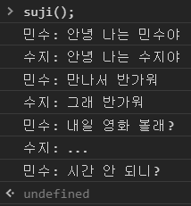

# 2. JavaScript ES6+

## 2.1 변수를 정의하는 새로운 방법: const, let

### 2.1.1 var가 가진 문제

#### 함수 스코프

var의 첫 번째 문제는 정의된 변수가 함수 스코프를 가진다는 것이다.

스코프 : 변수가 사용될 수 있는 영역. 변수가 정의된 위치에 의해 결정된다.

함수 영역을 벗어난 영역에서 사용하면 에러 발생

```js
function example() {
    var i = 1;
}
console.log(i);  // 참조 에러
```


함수 안에서 var 키워드를 사용하지 않고 변수에 값을 할당하면 그 변수는 전역 변수가 된다.

```js
function example1() {
    i = 1;
}
function example2() {
    console.log(i);
}
example1();
example2();  // 1이 출력됨
```


var는 for 반복문에서 정의된 변수가 반복문이 끝난 이후에도 계속 남게 되는 문제가 있다.

```js
for (var i = 0; i < 10; i++) {
    console.log(i);
}
console.log(i);  // 10
```

while 문, switch 문, if 문 등도 마찬가지


#### 호이스팅

호이스팅 : var로 정의된 변수는 그 변수가 속한 스코프의 최상단으로 끌어올려진다.

##### 정의되지 않은 변수 사용하기

```js
console.log(myVar);  // 참조 에러
```

##### 변수가 정의된 시점보다 먼저 변수 사용하기

```js
console.log(myVar);  // undefined
var myVar = 1;
```

에러가 발생하지 않는다. 해당 변수가 호이스팅 되었기 때문이다.


##### 호이스팅 결과

```js
var myVar = undefined;
console.log(myVar);  // undefined
myVar = 1;
```

변수의 정의만 끌어올려지고 값은 원래 정의했던 위치에서 할당된다.


##### 변수가 정의된 시점보다 먼저 변수에 값을 할당하기

```js
console.log(myVar);  // undefined
myVar = 2;
console.log(myVar);  // 2
var myVar = 1;
```


#### var의 기타 문제들

var을 이용하면 한 번 정의된 변수를 재정의할 수 있다.

```js
var myVar = 1;
var myVar = 2;
```


var는 재할당 가능한 변수로밖에 만들 수 없다. 상수처럼 쓸 값도 무조건 재할당 가능한 변수로 만들어야 한다.


### 2.1.2 var의 문제를 해결하는 const, let

#### const, let은 블록 스코프다

블록 스코프에서는 블록을 벗어나면 변수를 사용할 수 없다.

```js
if (true) {
    const i = 0;
}
console.log(i);  // 참조 에러
```


블록 스코프에서 같은 이름을 갖는 변수의 사용 예

```js
let foo = 'bar1';
console.log(foo);  // bar1
if (true) {
    let foo = 'bar2';
    console.log(foo);  // bar2
}
console.log(foo);  // bar1
```


#### const, let에서의 호이스팅

const 또는 let으로 정의된 변수도 호이스팅된다. 하지만 const 또는 let으로 변수를 정의하기 전에 그 변수를 사용하려고 하면 참조 에러가 발생한다.

변수가 정의된 시점보다 먼저 변수를 사용할 수 없다.

```js
console.log(foo);  // 참조 에러
const foo = 1;
```


const에서 호이스팅의 역할을 설명하기 위한 예

```js
const foo = 1;
{
    console.log(foo);  // 참조 에러
    const foo = 2;
}
```

만약 변수가 호이스팅되지 않았다면 참조 에러는 발생하지 않고 값이 출력될 것이다.


var에서 호이스팅의 효과를 확인하는 코드

```js
var foo = 1;
(function() {
    console.log(foo);  // undefined
    var foo = 2;
})();
```


#### const는 변수를 재할당 불가능하게 만든다.

const로 정의된 변수는 재할당 불가능

let, var로 정의된 변수는 재할당 가능

```js
const bar = 'a';
bar = 'b';  // 에러 발생
var foo = 'a';
foo = 'b';  // 에러 없음
let value = 'a';
value = 'b';  // 에러 없음
```


#### const로 정의된 객체의 내부 속성값은 수정 가능하다.

```js
const bar = { prop1: 'a' };
bar.prop1 = 'b';
bar.prop2 = 123;
console.log(bar);  // { prop1: 'b', prop2: 123 }
const arr = [10, 20];
arr[0] = 100;
arr.push(300);
console.log(arr);  // [ 100, 20, 300 ]
```

객체의 내부 속성값도 수정 불가능하게 만들고 싶다면 immer, immutable.js 등의 외부 패키지를 활용하는 게 좋다. 이러한 외부 패키지는 객체를 수정하려고 할 때 기존 객체는 변경하지 않고 새로운 객체를 생성한다.

* 수정할 수 없도록 차단 => 자바스크립트 내장 함수 이용
  * Object.preventExtensions
  * Object.seal
  * Object.freeze


#### const로 정의된 변수에 재할당은 불가능하다.

```js
const bar = { prop1: 'a' };
bar = { prop2: 123 };  // 에러 발생
```


## 2.2 객체와 배열의 사용성 개선

단축 속성명과 계산된 속성명을 이용하면 객체와 배열을 생성하고 수정하는 코드를 쉽게 작성할 수 있다.

전개 연산자와 비구조와 할당을 이용해 객체와 배열의 속성값을 밖으로 꺼내는 방법이 쉬워졌다.


### 2.2.1 객체와 배열을 간편하게 생성하고 수정하기

#### 단축 속성명

* 객체 리터럴 코드를 간편하게 작성할 목적으로 만들어진 문법
* 간편하게 새로운 객체 생성 가능


##### 단축 속성명을 사용해서 객체를 생성하기

```js
const name = 'mike';
const obj = {
    age: 21,
    name,
    getName() {return this.name;},
};
```

새로 만들려는 객체의 속성값 일부가 이미 변수로 존재하면 간단하게 변수 이름만 적어주면 된다.

속성값이 함수이면 function 키워드 없이 함수명만 적어도 된다.


##### 단축 속성명을 사용하지 않은 코드와 사용한 코드를 비교하기

```js
function makePerson1(age, name) {
    return { age: age, name: name };
}
function makePerson2(age, name) {
    return { age, name };
}
```


##### 콘솔 로그 출력 시 단축 속성명 활용하기

```js
const name = 'mike';
const age = 21;
console.log('name = ', name, ', age = ', age);  // name = mike , age = 21
console.log({ name, age });  // { name: 'mike', age: 21 }
```


#### 계산된 속성명

* 객체의 속성명을 동적으로 결정하기 위해 나온 문법

##### 계산된 속성명을 사용하지 않은 코드와 사용한 코드 비교

```js
function makeObject1(key, value) {
    const obj = {};
    obj[key] = value;
    return obj;
}
function makeObject2(key, value) {
    return { [key]: value };
}
```


##### 계산된 속성명을 사용해서 컴포넌트 상탯값 변경하기

```js
class MyComponent extends React.Component {
    state = {
        count1: 0,
        count2: 0,
        count3: 0,
    };
	// ...
	onClick = index => {
        const key = `count${index}`;
        const value = this.state[key];
        this.setState({ [key]: value + 1 });
    };
}
```


### 2.2.2 객체와 배열의 속성값을 간편하게 가져오기

#### 전개 연산자

* 배열이나 객체의 모든 속성을 풀어놓을 때 사용
* 매개변수가 많은 함수를 호출할 때 유용

##### 전개 연산자를 이용해서 함수의 매개변수를 입력하기

```js
Math.max(1, 3, 7, 9);
const numbers = [1, 3, 7, 9];
Math.max(...numbers);
```

전개 연산자를 사용하면 동적으로 함수의 매개변수를 전달할 수 있다.


##### 전개 연산자를 이용해서 배열과 객체를 복사하기

```js
const arr1 = [1, 2, 3];
const obj1 = { age: 23, name: 'mike' };
const arr2 = [...arr1];
const obj2 = { ...obj1 };
arr2.push(4);
obj2.age = 80;
```

전개 연산자를 사용해서 새로운 객체와 배열 생성 => 속성을 추가하거나 변경해도 원래의 객체에 영향을 주지 않는다.


##### 배열에서 전개 연산자를 사용하면 순서가 유지된다.

```js
[1, ...[2, 3], 4];  // [1, 2, 3, 4]
new Date(...[2018, 10, 24]);  // 2018년 11월 24일
```


##### 전개 연산자를 이용해서 두 객체를 병합하기

```js
const obj1 = { age: 21, name: 'mike' };
const obj2 = { hobby: 'soccer' };
const obj3 = { ...obj1, ...obj2 };
console.log(obj3);  // { age: 21, name: 'mike', hobby: 'soccer' }
```


##### 객체 리터럴에서 중복된 속성명 사용 가능

```js
const obj1 = { x: 1, x: 2, y: 'a' };  // { x: 2, y: 'a' }
const obj2 = { ...obj1, y: 'b' };  // { x: 2, y: 'b' }
```

중복된 속성명 사용 시 최종 결과는 마지막 속성명의 값이 된다.


#### 배열 비구조화

* 배열의 여러 속성값을 변수로 쉽게 할당할 수 있는 문법

##### 배열 비구조화를 사용한 간단한 코드

```js
const arr = [1, 2];
const [a, b] = arr;
console.log(a);  // 1
console.log(b);  // 2
```

배열의 속성값이 왼쪽의 변수에 순서대로 들어간다.


##### 배열 비구조화로 이미 존재하는 변수에 값을 할당하기

```js
let a, b;
[a, b] = [1, 2];
```


##### 배열 비구조화에서의 기본값

```js
const arr = [1];
const [a = 10, b = 20] = arr;
console.log(a);  // 1
console.log(b);  // 20
```

두 번째 변수의 속성값은 undefined 이므로 기본값 20이 할당된다.


##### 배열 비구조화를 이용해서 두 변수의 값을 교환하기

```js
let a = 1;
let b = 2;
[a, b] = [b, a];
console.log(a);  // 2
console.log(b);  // 1
```


##### 쉼표를 이용해서 일부 속성값 건너뛰기

```js
const arr = [1, 2, 3];
const [a, , c] = arr;
console.log(a);  // 1
console.log(c);  // 3
```

두 번째 속성값은 건너뛰고 세 번째 속성값이 변수 c에 할당


##### 나머지 값을 별도의 배열로 만들기

```js
const arr = [1, 2, 3];
const [first, ...rest1] = arr;
console.log(rest1);  // [2, 3]
const [a, b, c, ...rest2] = arr;
console.log(rest2);  // []
```

나머지 모든 속성값이 새로운 배열로 만들어진다.


#### 객체 비구조화

* 객체의 여러 속성값을 변수로 쉽게 할당할 수 있는 문법

##### 객체 비구조화의 간단한 예

```js
const obj = { age: 21, name: 'mike' };
const { age, name } = obj;
console.log(age);  // 21
console.log(name);  // mike
```

객체 비구조화에서는 중괄호를 사용한다.

객체 비구조화에서 순서는 무의미하다.

기존 속성명을 그대로 사용해야 한다.


##### 객체 비구조화에서는 속성명이 중요하다

```js
const obj = { age: 21, name: 'mike' };
const { age, name } = obj;
const { name, age } = obj;
const { a, b } = obj;
```

존재하지 않는 속성명을 사용하면 undefined가 할당된다.


##### 객체 비구조화에서 별칭 사용하기

```js
const obj = { age: 21, name: 'mike' };
const { age: theAge, name } = obj;
console.log(theAge);  // 21
console.log(age);  // 참조 에러
```

속성명 age의 값을 theAge 변수에 할당한다. age 변수는 할당되지 않는다.


##### 객체 비구조화에서의 기본값

```js
const obj = { age: undefined, name: null, grade: 'A' };
const { age = 0, name = 'noName', grace = 'F' } = obj;
console.log(age);  // 0
console.log(name);  // null
console.log(grade);  // A
```

age는 undefined 이므로 기본값이 들어간다.

속성값이 null이면 기본값은 들어가지 않는다.


##### 기본값과 별칭 동시에 사용하기

```js
const obj = { age: undefined, name: 'mike' };
const { age: theAge = 0, name } = obj;
console.log(theAge);  // 0
```


##### 함수를 이용한 기본값

```js
function getDefaultAge() {
    console.log('hello');
    return 0;
}
const obj = { age: 21, grade: 'A' };
const { age = getDefaultAge(), grade } = obj;  // hello 출력되지 않음
console.log(age);  // 21
```

기본값이 사용될 때만 함수가 호출된다.


##### 객체 비구조화에서 나머지 속성들을 별도의 객체로 생성하기

```js
const obj = { age: 21, name: 'mike', grade: 'A' };
const { age, ...rest } = obj;
console.log(rest);  // { name: 'mike', grade: 'A' }
```


##### for 문에서 객체 비구조화를 활용한 예

```js
const people = [{ age: 21, name: 'mike' }, { age: 51, name: 'sara' }];
for (const { age, name } of people) {
    // ...
}
```


#### 비구조화 심화 학습

비구조화는 객체와 배열이 중첩되어 있을 때도 사용할 수 있다.

##### 중첩된 객체의 비구조화 사용 예

```js
const obj = { name: 'mike', mother: { name: 'sara' } };
const {
    name,
    mother: { name: motherName },
} = obj;
console.log(name);  // mike
console.log(motherName);  // sara
console.log(mother);  // 참조 에러
```


##### 기본값은 변수 단위가 아니라 패턴 단위로 적용된다

```js
const [{ prop: x } = { prop: 123 }] = [];
console.log(x);  // 123
const [{ prop: x } = { prop: 123 }] = [{}];
console.log(x);  // undefined
```

{ prop: x } 는 배열의 첫 번째 원소를 가리키고, { prop: 123 } 은 그 기본값을 정의한다.

첫 번째 원소가 존재하지 않는다. => 기본값 할당

배열의 첫 번째 원소가 존재 => 기본값이 할당되지 않는다.


##### 객체 비구조화에서 계산된 속성명 사용하기

```js
const index = 1;
const { [`key${index}`]: valueOfTheIndex } = { key1: 123 };
console.log(valueOfTheIndex);  // 123
```

객체 비구조화에서 계산된 속성명을 사용할 때에는 반드시 별칭을 입력해야 한다.


##### 별칭을 이용해서 다른 객체와 배열의 속성값 할당

```js
const obj = {};
const arr = [];
({ foo: obj.prop, bar: arr[0] } = { foo: 123, bar: true });
console.log(obj);  // {prop:123}
console.log(arr);  // [true]
```


## 2.3 강화된 함수의 기능

### 2.3.1 매개변수에 추가된 기능

#### 매개변수 기본값

##### 매개변수에 기본값 주기

```js
function printLog(a = 1) {
    console.log({ a });
}
printLog();  // { a: 1 }
```


##### 매개변수 기본값으로 함수 호출 사용하기

```js
function getDefault() {
    return 1;
}
function printLog(a = getDefault()) {
    console.log({ a });
}
printLog();  // { a: 1 }
```


##### 매개변수 기본값을 이용해서 필숫값을 표현하는 방법

```js
function required() {
    throw new Error('no parameter');
}
function pringLog(a = required()) {
    console.log({ a });
}
printLog(10);  // { a: 10 }
printLog();  // 에러 발생: no parameter
```


#### 나머지 매개변수

* 입력된 인수 중에서 정의된 매개변수 개수만큼을 제외한 나머지를 배열로 만들어 준다.
* 매개변수 개수가 가변적일 때 유용하다.


##### 나머지 매개변수를 사용한 코드

```js
function printLog(a, ...rest) {
    console.log({ a, rest });
}
printLog(1, 2, 3);  // { a: 1, rest: [2, 3] }
```

하나의 인자를 제외한 나머지를 rest 매개변수에 할당


##### arguments 키워드로 나머지 매개변수 따라 하기

```js
function printLog(a) {
    const rest = Array.from(arguments).splice(1);
    console.log({ a, rest });
}
printLog(1, 2, 3);  // { a: 1, rest: [2, 3] }
```

가독성이 좋지 않다.

arguments 를 배열로 변환하는 과정이 필요


#### 명명된 매개변수

* 객체 비구조화를 이용해서 구현할 수 있다.
* 함수 호출 시 매개변수의 이름과 값을 동시에 적을 수 있으므로 가독성이 높다.


##### 명명된 매개변수의 사용 여부에 따른 가독성 비교

```js
const numbers = [10, 20, 30, 40];
const result1 = getValues(numbers, 5, 25);
const result2 = getValues({ numbers, greaterThan: 5, lessThan: 25 });
```

명명된 매개변수를 이용하면 매개변수의 이름이 노출된다.


##### 명명된 매개변수의 사용 여부에 따른 선택적 매개변수 코드 비교

```js
const result1 = getValues(numbers, undefined, 25);
const result2 = getValues({ numbers, greaterThan: 5 });
const result3 = getValues({ numbers, lessThan: 25 });
```

선택적 매개변수 : 필숫값과는 반대되는 의미로, 있어도 되고 없어도 되는 매개변수이다.

명명된 매개변수 없이 선택적 매개변수 사용 => 필요 없는 매개변수 자리에 undefined를 넣으면 된다.

명명된 매개변수 사용시 필요한 인수만 넣어주면 된다.


### 2.3.2 화살표 함수

##### 화살표 함수의 사용 예

```js
const add = (a, b) => a + b;
console.log(add(1, 2));  // 3
const add5 = a => a + 5;
console.log(add5(1));  // 6
const addAndReturnObject = (a, b) => ({ result: a + b });
console.log(addAndReturnObject(1, 2).result);  // 3
```

객체 반환 시 소괄호로 감싸야 한다.


#### 화살표 함수의 코드가 여러 줄인 경우

전체를 중괄호로 묶고, 반환값에는 return 키워드 사용


##### 코드가 두 줄 이상인 화살표 함수

```js
const add = (a, b) => {
    if (a <= 0 || b <= 0) {
        throw new Error('must be positive number');
    }
    return a + b;
};
```


#### this와 arguments가 바인딩되지 않는 화살표 함수

화살표 함수가 일반 함수와 다른 점은 this와 arguments가 바인딩되지 않는다는 것이다. => arguments 필요 시 나머지 매개변수 사용


##### 화살표 함수에서 나머지 매개변수 사용하기

```js
const printLog = (...rest) => console.log(rest);
printLog(1, 2);  // [1, 2]
```


#### 일반 함수에서 this 바인딩 때문에 버그가 발생하는 경우

일반 함수에서 this는 호출 시점에 사용된 객체로 바인딩된다. => 객체에 정의된 일반 함수를 다른 변수에 할당해서 호출하면 버그가 발생할 수 있다.


##### this 바인딩 때문에 버그가 발생한 경우

```js
const obj = {
    value: 1,
    increase: function() {
        this.value++;
    },
};
obj.increase();
console.log(obj.value);  // 2
const increase = obj.increase;
increase();
console.log(obj.value);  // 2
```

객체 없이 호출되는 경우에는 전역 객체가 바인딩된다. => 브라우저 환경에서는 window 객체가 바인딩된다. => obj.value는 증가하지 않는다.

화살표 함수 안에서 사용된 this와 arguments는 자신을 감싸고 있는 가장 가까운 일반 함수의 것을 참조한다.


#### 생성자 함수 내부에서 정의된 화살표 함수의 this

생성자 함수 내부에서 정의된 화살표 함수의 this는 생성된 객체를 참조한다.

##### 생성자 함수 내부에서 화살표 함수 사용하기

```js
function Something() {
    this.value = 1;
    this.increase = () => this.value++;
}
const obj = new Something();
obj.increase();
console.log(obj.value);  // 2
const increase = obj.increase;
increase();
console.log(obj.value);  // 3
```

화살표 함수 increase의 this는 가장 가까운 일반 함수인 Something의 this를 참조한다.

new 키워드를 이용해서 생성자 함수를 호출하면 this는 생성되는 객체를 참조한다.

increase 함수의 this는 생성된 객체를 가리킨다.


#### setInterval 함수 사용 시 this 바인딩 문제

1초마다 obj.value를 증가시키는 코드


##### setInterval 함수에서 this 객체 사용 시 버그 발생

```js
function Something() {
    this.value = 1;
    setInterval(function increase() {
        this.value++;
    }, 1000);
}
const obj = new Something();
```

의도와 달리 obj.value가 증가하지 않는다.

increase 함수는 전역 환경에서 실행되기 때문에 this는 window 객체를 참조한다.


##### setInterval 함수에서 this 객체를 참조하기 위해 편법 사용

```js
function Something() {
    this.value = 1;
    var that = this;
    setInterval(function increase() {
        that.value++;
    }, 1000);
}
const obj = new Somethins();
```

increase 함수에서는 클로저(closure)를 이용해서 미리 저장해둔 that 변수를 통해 this 객체에 접근한다.


##### setInterval 함수에서 this 객체를 참조하기 위해 화살표 함수 사용하기

```js
function Something() {
    this.value = 1;
    setInterval(() => {
        this.value++;
    }, 1000);
}
const obj = new Something();
```

화살표 함수 사용 => this는 obj를 참조


## 2.4 향상된 비동기 프로그래밍 1: 프로미스

프로미스(promise) : 비동기 상태를 값으로 다룰 수 있는 객체

프로미스를 사용하면 비동기 프로그래밍을 할 때 동기 프로그래밍 방식으로 코드를 작성할 수 있다.


### 2.4.1 프로미스 이해하기

#### 콜백 패턴의 문제

콜백 패턴은 콜백이 조금만 중첩돼도 코드가 상당히 복잡해진다.


##### 콜백 함수의 중첩 사용

```js
function requestData1(callback) {
    // ...
    callback(data);						// (2)
}
function requestData2(callback) {
    // ...
    callback(data);						// (4)
}
function onSuccess1(data) {
    console.log(data);
    requestData2(onSuccess2);			// (3)
}
function onSuccess2(data) {				// (5)
    console.log(data);
    // ...
}
requestData1(onSuccess1);				// (1)
```

콜백 패턴은 코드가 순차적이지 않기 때문에 코드를 읽기 힘들다.

(1) => (2) => (3) => (4) => (5)


##### 간단한 프로미스 코드 예

```js
requestData1()
	.then(data => {
    	console.log(data);
    	return requestData2();
	})
	.then(data => >{
    	console.log(data);
		// ...
	});
```

프로미스를 사용하면 비동기 프로그래밍을 할 때 코드를 순차적으로 작성할 수 있다.


#### 프로미스의 세 가지 상태

* 대기 중(pending) : 결과를 기다리는 중
* 이행됨(fulfilled) : 수행이 정상적으로 끝났고 결과값을 갖고 있음
* 거부됨(rejected) : 수행이 비정상적으로 끝났음

이행됨, 거부됨 상태를 처리됨(settled) 상태라고 부른다.

프로미스는 처리됨 상태가 되면 더 이상 다른 상태로 변경되지 않는다.


#### 프로미스를 생성하는 방법

##### 프로미스를 생성하는 방법

```js
const p1 = new Promise((resolve, reject) => {
    // ...
    // resolve(data)
    // or reject('error message')
});
const p2 = Promise.reject('error message');
const p3 = Promise.resolve(param);
```

일반적으로 new 키워드를 사용해서 프로미스 생성 => 대기 중 상태가 된다.

비동기로 어떤 작업을 수행 후 성공 시 resolve 호출 => 이행됨 상태, 실패 시 reject 호출 => 거부됨 상태

예외가 발생하면 거부됨 상태

new 키워드를 사용해 프로미스를 생성하는 순간 생성자의 입력 함수가 실행된다.


Promise.reject => 거부됨 상태 프로미스 생성

Promise.resolve => 입력 값이 프로미스였다면 그 객체가 그대로 반환, 프로미스가 아니라면 이행됨 상태인 프로미스 반환


##### Promise.resolve의 반환값

```js
const p1 = Promise.resolve(123);
console.log(p1 !== 123);  // true
const p2 = new Promise(resolve => setTimeout(() => resolve(10), 1));
console.log(Promise.resolve(p2) === p2);  // true
```

프로미스가 아닌 인수와 함께 Promise.resolve 함수 호출 => 그 값 그대로 이행됨 상태인 프로미스 반환

p1은 123을 데이터로 갖는 프로미스

Promise.resolve 함수에 프로미스 입력 => 그 자신이 반환됨


#### then

then은 처리됨 상태가 된 프로미스를 처리할 때 사용하는 메서드이다.

프로미스가 처리됨 상태가 되면 then 메서드의 인수로 전달된 함수가 호출된다.

##### then 메서드를 사용한 간단한 코드

```js
requestData().then(onResolve, onReject);
Promise.resolve(123).then(data => console.log(data));  // 123
Promise.reject('err').then(null, error => console.log(error));  // err
```


##### 연속해서 then 메서드 호출하기

```js
requestData1()
	.then(data => {
    	console.log(data);
    	return requestData2();
	})
	.then(data => {
    	return data + 1;
	})
	.then(data => {
    	throw new Error('some error');
	})
	.then(null, error => {
    	console.log(error);
	});
```

onResolve 또는 onReject 함수에서 프로미스를 반환하면 then 메서드는 그 값을 그대로 반환한다.

프로미스가 아닌 값을 반환하면 then 메서드는 이행됨 상태인 프로미스를 반환

예외가 발생하면 then 메서드는 거부됨 상태인 프로미스를 반환


##### 거부됨 상태가 되면 onReject 함수를 호출한다.

```js
Promise.reject('err')
	.then(() => console.log('then 1'))
	.then(() => console.log('then 2'))
	.then(() => console.log('then 3'), () => console.log('then 4'))
	.then(() => console.log('then 5'), () => console.log('then 6'));
```

거부됨 상태인 프로미스는 처음 만나는 onReject 함수를 호출한다. => 'then 1'과 'then 2'는 건너뛰고, 'then 4'가 출력된다.

'then 4'를 출력하는 onReject 함수는 undefined를 결과로 가지면서 이행됨 상태인 프로미스 생성 => 'then 5' 출력


#### catch

catch는 프로미스 수행 중 발생한 예외를 처리하는 메서드이다.

then 메서드의 onReject 함수와 같은 역할

##### 같은 기능을 하는 then 메서드와 catch 메서드

```js
Promise.reject(1).then(null, error => {
    console.log(error);
});
Promise.reject(1).catch(error => {
    console.log(error);
});
```


##### then 메서드의 onReject를 사용했을 때의 문제점

```js
Promise.resolve().then(
    () => {
        throw new Error('some error');
    },
    error => {
        console.log(error);
    },
);
```

Unhandled promise rejection 에러 발생


##### onReject 함수를 사용하지 않고 catch를 사용한 예

```js
Promise.resolve()
	.then(() => {
    	throw new Error('some error');
	})
	.catch(error => {
    	console.log(error);
	});
```


##### catch 메서드 이후에도 then 메서드 사용하기

```js
Promise.reject(10)
	.then(data => {
    	console.log('then1:', data);
    	return 20;
	})
	.catch(error => {
    	console.log('catch:', error);
    	return 30;
	})
	.then(data => {
    	console.log('then2:', data);
	});
```


```
catch: 10
then2: 30
```


#### finally

finally는 프로미스가 이행됨 또는 거부됨 상태일 때 호출되는 메서드

프로미스 체인의 가장 마지막에 사용됨

##### finally를 사용한 간단한 코드

```js
requestData()
	.then(data => {
    	// ...
	})
	.catch(error => {
    	// ...
	})
	.finally(() => {
    	// ...
	});
```

finally 메서드는 이전에 사용된 프로미스를 그대로 반환한다.

finally 메서드는 처리됨 상태인 프로미스의 데이터를 건드리지 않고 추가 작업을 할 때 유용하게 사용


##### finally 메서드는 새로운 프로미스를 생성하지 않는다

```js
function requestData() {
    return fetch()
    	.catch(error => {
        	// ...
    	})
    	.finally(() => {
        	sendLogToServer('requestData finished');
	    });
}
requestData().then(data => console.log(data));
```

데이터 요청의 성공, 실패 여부와 상관없이 서버에 로그를 보낼 때

requestData 함수의 반환값은 finally 메서드 호출 이전의 프로미스이다.


### 2.4.2 프로미스 활용하기

#### 병렬로 처리하기: Promise.all

여러 개의 프로미스를 병렬로 처리할 때 사용


##### 순차적으로 실행되는 비동기 코드

```js
requestData1()
	.then(data => {
    	console.log(data);
    	return requestData2();
	})
	.then(data => {
    	console.log(data);
	});
```


##### 병렬로 실행되는 코드

```js
requestData1().then(data => console.log(data));
requestData2().then(data => console.log(data));
```

비동기 함수 간에 서로 의존성이 없다면 병렬로 처리하는 게 더 빠르다.


##### Promise.all을 사용하는 코드

```js
Promise.all([requestData1(), requestData2()]).then(([data1, data2]) => {
    console.log(data1, data2);
});
```

Promise.all 함수는 프로미스를 반환한다.

입력된 모든 프로미스가 처리됨 상태가 되어야 처리됨 상태가 된다.

만약 하나라도 거부됨 상태가 된다면 Promise.all 함수가 반환하는 프로미스도 거부됨 상태가 된다.


#### 가장 빨리 처리된 프로미스 가져오기: Promise.race

여러 개의 프로미스 중에서 가장 빨리 처리된 프로미스를 반환하는 함수


##### Promise.race를 사용한 간단한 코드

```js
Promise.race([
    requestData(),
    new Promise((_, reject) => setTimeout(reject, 3000)),
])
	.then(data => console.log(data))
	.catch(error => console.log(error));
```

requestData 함수가 3초 안에 데이터를 받으면 then 메서드 호출, 그렇지 않으면 catch 메서드 호출


#### 프로미스를 이용한 데이터 캐싱

처리됨 상태가 되면 그 상태를 유지하는 프로미스의 성질을 이용해 데이터를 캐싱할 수 있다.

##### 프로미스로 캐싱 기능 구현하기

```js
let cachedPromise;
function getData() {
    cachedPromise = cachedPromise || requestData();
    return cachedPromise;
}
getData().then(v => console.log(v));
getData().then(v => console.log(v));
```

getData 함수를 처음 호출할 때만 requestData가 호출된다.

데이터를 가져오는 작업이 끝나면 그 결과는 cachedPromise 프로미스에 저장된다.


### 2.4.3 프로미스 사용 시 주의할 점

#### return 키워드 깜빡하지 않기

then 메서드가 반환하는 프로미스 객체의 데이터는 내부 함수가 반환값이다.

return 키워드를 사용하지 않으면 프로미스 객체의 데이터는 undefined가 된다.


##### return 키워드를 깜빡한 코드

```js
Promise.resolve(10)
	.then(data => {
    	console.log(data);
    	Promise.resolve(20);
	})
	.then(data => {
    	console.log(data);
	});
```

의도와는 다르게 undefined가 출력된다. return 키워드 입력 시 20이 출력된다.


#### 프로미스는 불변 객체다

##### 프로미스가 수정된다고 생각하고 작성한 코드

```js
function requestData() {
    const p = Promise.resolve(10);
    p.then(() => {
        return 20;
    });
    return p;
}
requestData().then(v => {
    console.log(v);  // 10
});
```

then 메서드는 기존 객체를 수정하지 않고, 새로운 프로미스를 반환한다.


##### then 메서드로 생성된 프로미스를 반환하는 코드

```js
function requestData() {
    return Promise.resolve(10).then(v => {
        return 20;
    });
}
```


#### 프로미스를 중첩해서 사용하지 않기

프로미스를 중첩해서 사용하면 코드가 복잡해진다.


##### 프로미스를 중첩해서 사용한 코드

```js
requestData1().then(result1 => {
    requestData2(result1).then(result2 => {
        // ...
    });
});
```


아래와 같이 사용하는 것이 좋다.

##### 중첩된 코드를 리팩터링한 코드

```js
requestData1()
	.then(result1 => {
    	return requestData2(result1);
	})
	.then(result2 => {
    	// ...
	});
```


##### Promise.all을 사용해서 변수 참조 문제 해결

```js
requestData1()
	.then(result1 => {
    	return Promise.all([result1, requestData2(result1)]);
	})
	.then(([result1, result2]) => {
    	// ...
	});
```

Promise.all 함수로 입력하는 배열에 프로미스가 아닌 값을 넣으면, 그 값 그대로 이행됨 상태인 프로미스처럼 처리된다.


#### 동기 코드의 예외 처리 신경 쓰기

프로미스를 동기 코드와 같이 사용할 때는 예외 처리에 신경 써야 한다.

##### 동기 코드에서 발생한 예외가 처리되지 않는 코드

```js
function requestData() {
    doSync();
    return fetch()
    	.then(data => console.log(data));
    	.catch(error => console.log(error));
}
```

doSync 함수가 반드시 fetch 전에 호출되어야 하는 게 아니라면 then 메서드 안쪽으로 넣어 주는 게 좋다.


##### 동기 코드도 예외처리가 되는 코드

```js
function requestData() {
    return fetch()
    	.then(data => {
        	doSync();
        	console.log(data);
	    })
    	.catch(error => console.log(error));
}
```

doSync에서 발생하는 예외는 catch 메서드에서 처리된다.


## 2.5 향상된 비동기 프로그래밍 2: async await

async await는 비동기 프로그래밍을 동기 프로그래밍처럼 작성할 수 있도록 함수에 추가된 기능이다.

### 2.5.1 async await 이해하기

#### async await 함수는 프로미스를 반환한다.

##### 프로미스를 반환하는 async await 함수

```js
async function getData() {
    return 123;
}
getData().then(data => console.log(data));  // 123
```

async 키워드를 이용해서 함수 정의 => 함수 호출 후 then 메서드 사용 가능


##### 프로미스를 반환하는 async await 함수

```js
async function getData() {
    return Promise.resolve(123);
}
getData().then(data => console.log(data));  // 123
```

async await 함수 내부에서 반환하는 값이 프로미스라면 그 객체를 그대로 반환한다.


##### async await 함수에서 예외가 발생하는 경우

```js
async function getData() {
    throw new Error('123');
}
getData().catch(error => console.log(error));  // 에러 발생: 123
```

async await 함수 내부에서 예외가 발생하는 경우 거부됨 상태인 프로미스가 반환된다.


#### await 키워드를 사용하는 방법

await 키워드는 async await 함수 내부에서 사용된다.

await 오른쪽에 프로미스 입력 => 프로미스가 처리됨 상태가 될 때까지 대기 => 비동기 처리를 기다리면서 순차적으로 코드 작성 가능


##### await 키워드의 사용 예

```js
function requestData(value) {
    return new Promise(resolve =>
    	setTimeout(() => {
        	console.log('requestData:', value);
        	resolve(value);
    	}, 100),
	);
}
async function getData() {
    const data1 = await requestData(10);
    const data2 = await requestData(20);
    console.log(data1, data2);
    return [data1, data2];
}
getData();
```


```
requestData: 10
requestData: 20
10 20
```

requestData 함수가 반환하는 프로미스가 처리됨 상태가 될 때까지 console.log(data1, data2); 코드가 실행되지 않는다.


##### await 키워드는 async 키워드 없이 사용할 수 없다.

```js
function getData() {
    const data = await requestData(10);  // 에러 발생
    console.log(data);
}
```

await 키워드는 오직 async await 함수 내에서만 사용될 수 있다.


#### async await는 프로미스보다 가독성이 좋다.

##### async await와 프로미스 비교하기

```js
function getDataPromise() {
    asyncFunc1()
    	.then(data => {
        	console.log(data);
        	return asyncFunc2();
    	})
    	.then(data => {
        	console.log(data);
    	});
}
async function getDataAsync() {
    const data1 = await asyncFunc1();
    console.log(data1);
    const data2 = await asyncFunc2();
    console.log(data2);
}
```

async await 함수는 then 메서드를 호출할 필요가 없기 때문에 더 간결하다.


##### 의존성이 높은 코드에서 가독성 비교

```js
function getDataPromise() {
    return asyncFunc1()
    	.then(data1 => Promise.all([data, asyncFunc2(data1)]))
    	.then(([data1, data2]) => {
        	return asyncFunc3(data1, data2);
    	});
}
async function getDataAsync() {
    const data1 = await asyncFunc1();
    const data2 = await asyncFunc2(data1);
    return asyncFunc3(data1, data2);
}
```


### 2.5.2 async await 활용하기

#### 비동기 함수를 병렬로 실행하기

##### 순차적으로 실행되는 비동기 코드

```js
async function getData() {
    const data1 = await asyncFunc1();
    const data2 = await asyncFunc2();
    // ...
}
```

여러 비동기 함수에 각각 await 키워드를 사용해 호출하면 순차적으로 실행


##### await 키워드를 나중에 사용해서 병렬로 실행되는 비동기 코드

```js
async function getData() {
    const p1 = asyncFunc1();
    const p2 = asyncFunc2();
    const data1 = await p1;
    const data2 = await p2;
    // ...
}
```

두 함수 사이에 의존성이 없다면 동시에 실행하는 것이 더 좋다.

프로미스는 생성과 동시에 비동기 코드가 실행된다. => 두 개의 프로미스를 먼저 생성 => await 키워드를 나중에 사용 => 병렬로 실행됨


##### Promise.all을 사용해서 병렬로 실행하기

```js
async function getData() {
    const [data1, data2] = await Promise.all([asyncFunc1(), asyncFunc2()]);
    // ...
}
```


#### 예외 처리하기

##### 동기와 비동기 함수 모두 catch 문에서 처리된다

```js
async function getData() {
    try {
        await doAsync();
        return doSync();
    } catch (error) {
        console.log(error);
    }
}
```

async await 함수 내부에서 발생하는 예외 => try cath 문으로 처리

만약 getData 함수가 async await 함수가 아니었다면 doAsync 함수에서 발생하는 예외는 catch 문에서 처리되지 않는다.


#### Thenable을 지원하는 async await

Thenable은 프로미스처럼 동작하는 객체이다.

Thenable : ES6의 프로미스가 아니더라도 then 메서드를 가진 객체

await와 함께 사용 가능


##### async await 함수에서 Thenable을 사용한 예

```js
class ThenableExample {
    then(resolve, reject) {
        setTimeout(() => resolve(123), 1000);
    }
}
async function asyncFunc() {
    const result = await new ThenableExample();
    console.log(result);  // 123
}
```

ThenableExample 클래그는 then을 메서드로 갖고있다. => ThenableExample 클래스로 생성된 객체는 Thenable이다.

async await 함수는 Thenable도 프로미스처럼 처리한다.


## 2.6 템플릿 리터럴로 동적인 문자열 생성하기

템플릿 리터럴(template literals) : 변수를 이용해서 동적으로 문자열을 생성할 수 있는 문법


##### ES6 이전에 동적인 문자열을 생성하는 코드

```js
var name = 'mike';
var score = 80;
var msg = 'name: ' + name + ', score/100: ' + score/100;
```

더하기 기호와 따옴표를 반복적으로 사용


##### 템플릿 리터럴을 사용한 코드

```js
const msg = `name: ${name}, score/100: ${score / 100}`;
```

백틱 이용

${expression} 형식으로 표현식 사용


#### 여러 줄의 문자열 입력하기

##### ES5에서 여러 줄의 문자열을 생성하는 코드

```js
const msg = 'name: ' + name + '\n' +
'age: ' + age + '\n' + 
'score: ' + score + '\n';
```


##### 템플릿 리터럴을 이용해서 여러 줄의 문자열을 생성하는 코드

```js
const msg = `name: ${name}
age: ${age}
score: ${score}`;
```

줄의 끝에 \n 기호를 입력할 필요가 없다.


## 2.7 실행을 멈출 수 있는 제너레이터

제너레이터(generator) : 함수의 실행을 중간에 멈추고 재개할 수 있는 기능

실행을 멈출 때 값을 전달할 수 있기 때문에 반복문에서 제너레이터가 전달하는 값을 하나씩 꺼내서 사용할 수 있다.

제너레이터는 값을 미리 만들어 놓지 않는다. 필요한 순간에 값을 계산해서 전달 => 메모리 측면에서 효율적

다른 함수와 협업 멀티태스킹을 할 수 있다.

제너레이터가 실행을 멈추는 시점을 자발적으로 선택


### 2.7.1 제너레이터 이해하기

제너레이터는 별표와 함깨 정의된 함수와 그 함수가 반환하는 제너레이터 객체로 구성된다.

##### 간단한 제너레이터 함수의 예

```js
function* f1() {
    yield 10;
    yield 20;
    return 'finished';
}
const gen = f1();
```

제너레이터 함수는 별표와 함께 정의

yield를 사용하면 함수의 실행을 멈출 수 있다.

제너레이터 함수를 실행하면 제너레이터 객체가 반환된다.

제너레이터 객체는 next, return, throw 메서드를 가지고 있다.


##### 제너레이터 객체의 next 메서드 사용하기

```js
function* f1() {
    console.log('f1-1');
    yield 10;
    console.log('f1-2');
    yield 20;
    console.log('f1-3');
    return 'finished';
}
const gen = f1();
console.log(gen.next());
console.log(gen.next());
console.log(gen.next());
```


next 메서드를 호출하면 yield 키워드를 만날 때까지 실행되고 데이터 객체를 반환한다.

yield 키워드를 만나면 done 속성값은 거짓이 된다. 만나지 못하면 참이 된다.

yield 키워드 오른쪽의 값이 value 속성값으로 넘어온다.


##### 제너레이터 객체의 return 메서드 호출하기

```js
const gen = f1();
console.log(gen.next());
console.log(gen.return('abc'));
console.log(gen.next());
```


##### 제너레이터 객체의 throw 메서드 호출하기

```js
function* f1() {
    try {
        console.log('f1-1');
        yield 10;
        console.log('f1-2');
        yield 20;
    } catch (e) {
        console.log('f1-catch', e);
    }
}
const gen = f1();
console.log(gen.next());
console.log(gen.throw('some error'));
```


#### 반복 가능하면서 반복자인 제너레이터 객체

제너레이터 객체는 반복 가능하면서 반복자이다.

* next 메서드를 갖고 있다.
* next 메서드는 value와 done 속성값을 가진 객체를 반환한다.
* done 속성값은 작업이 끝났을 때 참이 된다.


다음 조건을 만족하면 반복 가능한 객체다.

* Symbol.iterator 속성값으로 함수를 갖고 있다.
* 해당 함수를 호출하면 반복자를 반환한다.


##### 배열은 반복 가능한 객체다.

```js
const arr = [10, 20, 30];
const iter = arr[Symbol.iterator]();
console.log(iter.next());  // {value: 10, done: false}
```


##### 제너레이터 객체는 반복 가능한 객체다

```js
function* f1() {
    // ...
}
const gen = f1();
console.log(gen[Symbol.iterator]() === gen);  // true
```

Symbol.iterator 속성값을 호출한 결과가 자기 자신(반복자)이다.


##### 반복 가능한 객체를 이용하는 코드

```js
function* f1() {
    yield 10;
    yield 20;
    yield 30;
}
for (const v of f1()) {
    console.log(v);
}
const arr = [...f1()];
console.log(arr);  // [ 10, 20, 30 ]
```

for of 문은 반복 가능한 객체로부터 반복자를 얻는다. => 반복자의 next 메서드를 호출하면서 done 속성값이 참이 될 때까지 반복


### 2.7.2 제너레이터 활용하기

제너레이터, 반복자, 반복 가능한 객체를 이용하면 함수형 프로그래밍의 대표적인 함수를 쉽게 구현할 수 있다.


##### 제너레이터로 구현한 map, filter, take 함수

```js
function* map(iter, mapper) {
    for (const v of iter) {
        yield mapper(v);
    }
}

function* filter(iter, test) {
    for (const v of iter) {
        if (test(v)) {
            yield v;
        }
    }
}

function* take(n, iter) {
    for (const v of iter) {
        if (n <= 0) return;
        yield v;
        n--;
    }
}

const values = [1, 2, 3, 4, 5, 6, 7, 8, 9, 10];
const result = take(3, map(filter(values, n => n % 2 === 0), n => n * 10));
console.log([...result]);  // [ 20, 40, 60 ]
```

값이 필요한 순간에 제너레이터 객체를 통해서 다음 값을 요청한다.


##### 제너레이터 함수로 자연수의 집합 표현

필요한 연산만 하기 때문에 무한대로 값을 표현하는 것도 가능하다.

```js
function* naturalNumbers() {
    let v = 1;
    while (true) {
        yield v++;
    }
}

const values = naturalNumbers();
const result = take(3, map(filter(values, n => n % 2 === 0), n => n * 10));
console.log([...result]);  // [ 20, 40, 60 ]
```

자연수 1부터 6까지만 연산에 사용된다.


#### 제너레이터 함수끼리 호출하기

##### 제너레이터 함수가 다른 제너레이터 함수 호출하기

```js
function* g1() {
    yield 2;
    yield 3;
}
function* g2() {
    yield 1;
    yield* g1();
    yield 4;
}
console.log(...g2());  // 1 2 3 4
```

제너레이터 함수에서 다른 제너레이터 함수를 호출할 때는 yield* 키워드를 이용한다.


##### 반복 가능한 객체를 처리하는 yield* 키워드

```js
function* g2_second() {
    yield 1;
    for (const value of g1()) {
        yield value;
    }
    yield 4;
}

function* g2_third() {
    yield 1;
    yield* [2, 3];
    yield 4;
}
```

yield* 키워드 오른쪽에는 반복 가능한 객체가 올 수 있도록 설계되었다.


#### 제너레이터 함수로 데이터 전달하기

제너레이터 함수는 외부로부터 데이터를 받아서 소비할 수 있다.

next 메서드를 호출하는 쪽에서 제너레이터 함수로 데이터를 전달할 수 있다.


##### next 메서드를 이용해서 제너레이터 함수로 데이터 전달하기

```js
function* f1() {
    const data1 = yield;
    console.log(data1);  // 10
    const data2 = yield;
    console.log(data2);  // 20
}
const gen = f1();
gen.next();
gen.next(10);
gen.next(20);
```

첫 번째 next 메서드의 호출은 제너레이터 함수의 실행이 시작되도록 하는 역할만 수행한다.

next 메서드의 인수로 데이터 전달 => yield 키워드로 결과값 받기


#### 협업 멀티태스킹

멀티태스킹 : 여러 개의 태스크를 실행할 때 하나의 태스크가 종료되기 전에 멈추고 다른 태스크가 실행되는 것

협업이라는 단어가 붙은 이유는 제너레이터가 실행을 멈추는 시점을 자발적(non-preemptive)으로 선택하기 때문

##### 제너레이터 함수를 이용한 협업 멀티태스킹

```js
function* minsu() {
    const myMsgList = [
        '안녕 나는 민수야',
        '만나서 반가워',
        '내일 영화 볼래?',
        '시간 안 되니?',
        '내일모레는 어때?',
    ];
    for (const msg of myMsgList) {
        console.log('수지:', yield msg);
    }
}

function suji() {
    const myMsgList = ['', '안녕 나는 수지야', '그래 반가워', '...'];
    const gen = minsu();
    for (const msg of myMsgList) {
        console.log('민수:', gen.next(msg).value);
    }
}

suji();
```





제너레이터 함수는 yield 키워드를 통해 자발적으로 자신의 실행을 멈춘다.

일반 함수에서는 제너레이터 객체의 next 메서드를 호출해서 제너레이터 함수가 다시 실행되도록 한다.


#### 제너레이터 함수의 예외 처리

##### 제너레이터 함수에서 예외가 발생한 경우

```js
function* genFunc() {
    throw new Error('some error');
}
function func() {
    const gen = genFunc();
    try {
        gen.next();
    } catch (e) {
        console.log('in catch:', e);
    }
}
func();
```


제너레이터 함수에서 발생한 예외는 next 메서드를 호출하는 외부 함수에 영향을 준다.

