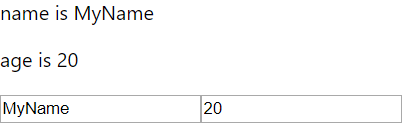

# 5. 리액트 훅 (진화된 함수형 컴포넌트)

## 5.1 리액트 훅 기초 익히기

훅은 기존에 리액트가 갖고 있던 여러 가지 문제를 해결해준다.

### 5.1.1 리액트 훅이란?

훅은 함수형 컴포넌트에서도 클래스형 컴포넌트의 기능을 사용할 수 있게 하는 기능이다.

훅을 통해서 함수형 컴포넌트에서도 컴포넌트의 상태값을 관리할 수 있고, 컴포넌트의 생명 주기 함수를 이용할 수 있다.


#### 로직을 재사용하는 기존 방식의 한계

리액트에서 로직의 재사용은 주로 고차 컴포넌트와 렌더 속성값 패턴으로 이루어진다.

대상이 되는 컴포넌트를 감싸는 새로운 컴포넌트를 생성하기 때문에 리액트 요소 트리가 깊어진다.

성능에 부정적인 영향을 주고 디버깅이 힘들다.


#### 클래스형 컴포넌트의 한계

서로 연관성이 없는 여러 가지 로직을 하나의 생명 주기 메서드에 작성하는 경우가 많다.

componentDidMount 메서드에서 등록하고 componentWillUnmount 메서드에서 해제하는 코드가 자주 사용되는데, 등록만 하고 해제하는 것을 깜빡하는 실수를 하기 쉽다.

클래스 사용 시 코드 압축이 잘 안되는 경우가 있다.

컴파일 단계에서 코드를 최적화하기 어렵다.


#### 훅의 장점

재사용 가능한 로직을 만들기 쉽다.

훅이 단순한 함수이므로 함수 안에서 다른 함수를 호출하는 것으로 새로운 훅을 만들 수 있기 때문

리액트의 내장 훅과 다른 사람들이 만든 여러 커스텀 훅을 레고처럼 조립해서 쉽게 새로운 훅을 만들 수 있다.

같은 로직을 한곳으로 모을 수 있어서 가독성이 좋다.

정적 타입 언어로 타입을 정의하기 쉽다.


### 5.1.2 함수형 컴포넌트에 상태값 추가하기: useState

useState 훅을 이용하면 함수형 컴포넌트에서도 상태값을 관리할 수 있다.

##### useState 훅 사용하기

```react
import React, { useState } from 'react';

function Profile() {
    const [name, setName] = useState('');
    return (
    	<div>
        	<p>{`name is ${name}`}</p>
            <input type="text" value={name} onChange={e => setName(e.target.value)} />
        </div>
    );
}
```

useState 훅은 배열에 두 값을 넣어서 반환한다.

배열의 첫 번째 원소는 상태값인데, 함수 호출 시 입력한 인수가 초기값으로 사용된다.

배열의 두 번째 원소는 상태값을 변경할 수 있는 함수다.

사용자가 키보드를 누를 때마다 setName 함수를 호출

onChange 속성값으로 입력되는 함수는 렌더링이 될 때마다 생성되므로 성능이 걱정될 수 있다.


#### 클래스형 컴포넌트와 비교하기

##### 클래스형 컴포넌트에서 상태값 관리하기

```react
import React from 'react';

class Profile extends React.Component {
    state = {
        name: '',
    };
	render() {
        const { name } = this.state;
        return (
        	<div>
            	<p>{`name is ${name}`}</p>
                <input
                    type="text"
                    value={name}
                    onChange={e => this.setState({ name: e.target.value })}
                />
            </div>
        );
    }
}
```

클래스의 맴버변수로 초기 상태값 정의

상태값을 변경할 때는 setState 메서드 호출


#### 여러 개의 useState 훅 사용하기

##### 여러 개의 useState 훅 사용하기

```react
import React, { useState } from 'react';

function Profile() {
    const [name, setName] = useState('');
    const [age, setAge] = useState(0);
    return (
    	<div>
        	<p>{`name is ${name}`}</p>
            <p>{`age is ${age}`}</p>
            <input type="text" value={name} onChange={e => setName(e.target.value)} />
            <input type="number" value={age} onChange={e => setAge(e.target.value)} />
        </div>
    );
}
```





#### useState 훅 하나로 여러 상태값 관리하기

상태값을 하나의 객체에 담아서 관리할 수도 있다.

##### 하나의 useState 훅으로 여러 상태값 관리하기

```react
import React, { useState } from 'react';

function Profile() {
    const [state, setState] = useState({ name: '', age: 0 });
    return (
    	<div>
        	<p>{`name is ${state.name}`}</p>
            <p>{`age is ${state.age}`}</p>
            <input
                type="text"
                value={state.name}
                onChange={e => setState({ ...state, name: e.target.value })}
            />
            <input
                type="number"
                value={state.age}
                onChange={e => setState({ ...state, age: e.target.value })}
            />
        </div>
    );
}
```

useState 훅은 이전 상태값을 지운다. 따라서 ...state 와 같은 코드가 필요하다.

상태값을 하나의 객체로 관리하는 경우를 위해 useReducer 훅이 제공된다.


### 5.1.3 함수형 컴포넌트에서 생명 주기 함수 이용하기: useEffect

useEffect 훅을 통해서 함수형 컴포넌트에서도 생명 주기 함수를 이용할 수 있다.

클래스형 컴포넌트의 각 생명 주기 메서드에 일대일로 대응하는 훅이 있는 것은 아니다.

useEffect 훅을 이용하면 비슷한 기능을 한곳으로 모을 수 있어서 가독성이 좋아진다.


##### useEffect 훅의 사용 예

```react
import React, { useState, useEffect } from 'react';

function MyComponent() {
    const [count, setCount] = useState(0);
    useEffect(() => {
        document.title = `업데이트 횟수: ${count}`;
    });
    return <button onClick={() => setCount(count + 1)}>increase</button>
}
```

useEffect 훅에 입력된 함수는 렌더링 결과가 실제 돔에 반영된 후 호출된다.

document.title을 변경하는 코드를 클래스형 컴포넌트의 componentDidMount와 componentDidUpdate 양쪽 메서드에 추가하면 같은 기능을 하게 된다.

버튼을 클릭할 때마다 다시 렌더링되고, 렌더링이 끝나면 useEffect 훅에 입력된 함수가 호출된다.


#### API를 호출하는 기능: 함수형 컴포넌트로 작성하기

##### useEffect 훅에서 API 호출하기

```react
import React, { useEffect, useState } from 'react';

function Profile({ userId }) {
    const [user, setUser] = useState(null);
    useEffect(
    	() => {
            getUserApi(userId).then(data => setUser(data));
        },
        [userId],
    );
    return (
    	<div>
        	{!user && <p>사용자 정보를 가져오는 중...</p>}
            {user && (
            	<>
                	<p>{`name is ${user.name}`}</p>
                	<p>{`age is ${user.age}`}</p>
                </>
            )}
        </div>
    );
}
```

useEffect 훅에서 API 통신을 하며, 받아온 데이터는 user 상태값에 저장한다.

useEffect 훅에 입력된 함수는 렌더링할 때마다 호출되기 때문에 API 통신을 불필요하게 많이 하게 된다. 이를 방지하기 위해 useEffect 훅의 두 번째 매개변수로 배열을 입력하면, 배열의 값이 변경되는 경우에만 함수가 호출된다.

userId 값이 변경되는 경우에만 API 통신을 한다.


#### API를 호출하는 기능: 클래스형 컴포넌트로 작성하기

##### 클래스형 컴포넌트에서 API 호출하기

```react
// ...
class Profile extends React.Component {
    state = {
        user: null,
    };
	componentDidMount() {
        const { userId } = this.props;
        getUserApi(userId).then(data => this.setState({ user: data }));
    }
	componentDidUpdate(prevProps) {
        const { userId } = this.props;
        if (userId !== prevProps.userId) {
            getUserApi(userId).then(data => this.setState({ user: data }));
        }
    }
	render() {
        const { user } = this.state;
        return // ...
    }
}
```

중복된 코드가 여러 생명 주기 메서드에 흩어져 있는 경우가 많다.


#### 이벤트 처리 함수를 등록하고 해제하는 기능: 함수형 컴포넌트로 작성하기

useEffect 훅을 이용하면 등록과 해제 절차를 한곳에서 관리할 수 있다.


##### useEffect 훅을 이용해서 이벤트 처리 함수를 등록하고 해제하기

```react
import React, { useEffect, useState } from 'react';

function WidthPrinter() {
    const [width, setWidth] = useState(window.innerWidth);
    useEffect(() => {
        const onResize = () => setWidth(window.innerWidth);
        window.addEventListener('resize', onResize);
        return () => {
            window.removeEventListener('resize', onResize);
        };
    }, []);
    return <div>{`width is ${width}`}</div>;
}
```

창 크기가 변경될 때마다 onResize 함수가 호출되도록 등록한다.

useEffect 훅의 첫 번째 매개변수에 등록된 함수가 또 다른 함수를 반환할 수 있다.

반환된 함수는 컴포넌트가 언마운트되거나 첫 번째 매개변수로 입력된 함수가 호출되기 직전에 호출된다.

=> 프로그램이 비정상적으로 종료되지 않는다면 반드시 호출될 것이 보장됨

useEffect 훅의 두 번째 매개변수에 빈 배열을 넣으면 컴포넌트가 마운트 될 때만 첫 번째 매개변수로 입력된 함수가 호출되고, 컴포넌트가 언마운트될 때만 반환된 함수가 호출된다.


#### 이벤트 처리 함수를 등록하고 해제하는 기능: 클래스형 컴포넌트로 작성하기

##### 이벤트 처리 함수의 등록과 해제를 클래스형 컴포넌트로 작성하기

```react
import React from 'react';

class WidthPrinter extends React.Component {
    state = {
        width: window.innerWidth,
    };
	componentDidMount() {
        window.addEventListener('resize', this.onResize);
    }
	componentWillUnmount() {
        window.removeEventListener('resize', this.onResize);
    }
	onResize = () => {
        this.setState({ width: window.innerWidth });
    };
	render() {
        const { width } = this.state;
        return <div>{`width is ${width}`}</div>;
    }
}
```

컴포넌트가 마운트될 때 onResize 메서드 등록, 언마운트될 때 등록했던 것 해제


#### 두 가지 기능을 합치기: 함수형 컴포넌트에서 작성하기

##### 훅을 사용하면 로직별로 코드를 모을 수 있다.

```react
// ...
function Profile({ userId }) {
    const [user, setUser] = useState(null);
    useEffect(
    	() => {
            getUserApi(userId).then(data => setUser(data));
        },
        [userId],
    );
    const [width, setWidth] = useState(window.innerWidth);
    useEffect(() => {
        const onResize = () => setWidth(window.innerWidth);
        window.addEventListener('resize', onResize);
        return () => {
            window.removeEventListener('resize', onResize);
        };
    }, []);
    return // ...
}
```

API 데이터를 관리하는 상태값과 생명 주기 함수를 한곳으로 모을 수 있다.

화면 크기를 관리하는 상태값과 생명 주기 함수도 한곳으로 모을 수 있다.


#### 두 가지 기능을 합치기: 클래스형 컴포넌트에서 작성하기

##### 클래스형 컴포넌트에서는 로직이 분산된다.

```react
// ...
class App extends React.Component {
    state = {
        user: null,
        width: window.innerWidth,
    };
	componentDidMount() {
        const { userId } = this.props;
        getUserApi(userId).then(data => this.setState({ user: data }));
        window.addEventListener('resize', this.onResize);
    }
	componentDidUpdate(prevProps) {
        const { userId } = this.props;
        if (userId !== prevProps.userId) {
            getUserApi(userId).then(data => this.setState({ user: data }));
        }
    }
	componentWillUnmount() {
        window.removeEventListener('resize', this.onResize);
    }
	onResize = () => {
        this.setState({ width: window.innerWidth });
    }
	render() {
        // ...
    }
}
```


### 5.1.4 훅 직접 만들기

리액트가 제공하는 훅을 이용해서 커스텀 훅을 만들 수 있다.

커스텀 훅을 이용해 또 다른 커스텀 훅을 만들 수 있다.

훅을 직접 만들어서 사용하면 고차 컴포넌트와 렌더 속성값 패턴처럼 로직을 재사용할 수 있다.

훅의 이름은 use로 시작하는 것이 좋다.


#### useWindowWidth 커스텀 훅

##### useWindowWidth 커스텀 훅

```react
import { useEffect, useState } from 'react';

function useWindowWidth() {
    const [width, setWidth] = useState(window.innerWidth);
    useEffect(() => {
        const onResize = () => setWidth(window.innerWidth);
        window.addEventListener('resize', onResize);
        return () => {
            window.removeEventListener('resize', onResize);
        };
    }, []);
    return width;
}
```

기존 훅을 이용해서 새로운 훅을 만들 수 있다.

창의 너비를 저장해서 제공하는 것이 useWindowWith 훅의 역할이다.


##### useWindowWidth 훅 사용하기

```react
import React, { useState } from 'react';
import { useWindowWidth } from './hooks';

function Profile() {
    const width = useWindowWidth();
    const [name, setName] = useState('');
    return (
    	<div>
        	<p>{`name is ${name}`}</p>
            {width < 600 && <br />}
            <input type="text" value={name} onChange={e => setName(e.target.value)} />
        </div>
    );
}
```

창의 너비를 받아와서 사용한다. 창의 너비가 변경되면 새로운 창의 너비와 함께 다시 렌더링된다.


#### useHasMounted 커스텀 훅

##### useHasMounted 커스텀 훅

```react
function useHasMounted() {
    const [hasMounted, setHasMounted] = useState(false);
    useEffect(() => setHasMounted(true), []);
    return hasMounted;
}
```

useHasMounted 훅은 컴포넌트가 마운트된 후라면 참을 반환한다.

useEffect 훅의 두 번째 매개변수에 빈 배열을 넣었기 때문에 업데이트하는 경우에는 setHasMounted 함수가 호출되지 않는다.


### 5.1.5 훅 사용 시 지켜야 할 규칙

* 규칙 1: 하나의 컴포넌트에서 훅을 호출하는 순서는 항상 같아야 한다.
* 규칙 2: 훅은 함수형 컴포넌트 또는 커스텀 훅 안에서만 호출되어야 한다.

두 규칙을 지켜야 리액트가 각 훅의 상태를 제대로 기억할 수 있다.

훅은 클래스형 컴포넌트의 메서드뿐만 아니라 기타 일반 함수에서도 사용할 수 없다.


##### 훅 사용 시 규칙1을 위반한 경우

조건에 따라 훅을 호출하면 순서가 보장되지 않는다.

반복문 안에서 훅을 호출하는 것도 순서가 보장되지 않는다.


#### 훅의 호출 순서가 같아야 하는 이유

##### 여러 개의 훅 사용하기

```react
function Profile() {
    const [age, setAge] = useState(0);		// (1)
    const [name, setName] = useState('');	// (2)
    // ...
    useEffect(() => {
        // ...
        setAge(23);
    }, []);
    // ...
}
```

useState 훅에 전달한 정보는 상태값의 기본값밖에 없다.

리액트가 age와 name 상태값을 구분할 수 있는 유일한 정보는 훅이 사용된 순서이다.

age 상태값이 23으로 변경됐다. 리액트는 첫 번째 훅의 상태값을 23으로 설정한다.

만약 코드(1)이 조건문에 의해 실행되지 않는 경우에는 코드(2)의 name값이 23이 되기 때문에 문제가 된다.


#### 리액트가 내부적으로 훅을 처리하는 방식

##### 의사코드로 표현한 리액트의 내부 코드

```react
let hooks = null;

export function useHook() {
    // ...
    hooks.push(hookData);
}

function process_a_component_rendering(component) {
    hooks = [];
    component();
    let hooksForThisComponent = hooks;
    hooks = null;
    // ...
}
```

리액트는 훅이 사용된 순서를 저장하고 배열에 저장된 순서를 기반으로 훅을 관리한다.


## 5.2 리액트 내장 훅 살펴보기

### 5.2.1 Consumer 컴포넌트 없이 콘텍스트 사용하기: useContext

useContext 훅을 이용하면 Consumer 컴포넌트를 사용하지 않고도 부모 컴포넌트로부터 전달된 콘텍스트 데이터를 사용할 수 있다.


##### 훅을 사용하지 않고 콘텍스트 API를 사용하기

```react
const UserContext = React.createContext();
const user = { name: 'mike', age: 23 };

function ParentComponent() {
    return (
    	<UserContext.Provider value={user}>
        	<ChildComponent />
        </UserContext.Provider>
    );
}

function ChildComponent() {
    // ...
    return (
    	<div>
        	<UserContext.Consumer>
            	{user => (
                	<>
                    	<p>{`name is ${user.name}`}</p>
                    	<p>{`age is ${user.age}`}</p>
                    </>
                )}
            </UserContext.Consumer>
        </div>
    );
}
```

Consumer 컴포넌트 안쪽에서만 콘텍스트 데이터에 접근할 수 있다는 한계가 있다.


##### useContext 훅 사용하기

```react
function ChildComponent() {
    const user = useContext(UserContext);
    console.log(`user: ${user.name}, ${user.age}`);
    // ...
}
```


### 5.2.2 함수형 컴포넌트에서 돔 요소 접근하기: useRef

##### useRef 훅 사용하기

```react
import React, { useRef } from 'react';

function MyComponent() {
    const inputEl = useRef(null);
    const onClick = () => {
        if (inputEl.current) {
            inputEl.current.focus();
        }
    };
    return (
    	<div>
        	<input ref={inputEl} type="text" />
            <button onClick={onClick}>Focus the text</button>
        </div>
    );
}
```

input 돔 요소에 접근하기 위해 useRef 훅을 사용한다.

onClick 함수가 호출되면 input 돔 요소가 포커스(focus)를 갖는다.

input 요소의 ref 속성값으로 inputEl 변수를 입력한다.


#### 함수형 컴포넌트에서 렌더링과 무관한 값 저장하기

useRef 훅을 이용하면 함수형 컴포넌트도 마치 맴버변수가 있는 것처럼 만들 수 있다.


##### useRef 훅을 이용해서 이전 상태값 저장하기

```react
import React, { useState, useRef, useEffect } from 'react';

function Profile() {
    const [age, setAge] = useState(20);
    const prevAgeRef = useRef(20);
    useEffect(
    	() => {
            prevAgeRef.current = age;
        },
        [age],
    );
    const prevAge = prevAgeRef.current;
    const text = age === prevAge ? 'same' : age > prevAge ? 'older' : 'younger';
    return (
    	<div>
        	<p>{`age ${age} is ${text} than age ${prevAge}`}</p>
            <button
                onClick={() => {
                    const age = Math.floor(Math.random() * 50 + 1);
                    setAge(age);
                }}
            >
            	나이 변경
            </button>
        </div>
    );
}
```

age 이전 상태값을 저장하기 위한 용도로 useRef 훅을 사용한다.

age 값이 변경되면 그 값을 prevAgeRef에 저장한다.

age가 변경돼서 다시 렌더링할 때의 prevAge는 age의 이전 상태값을 나타낸다.

렌더링이 끝나면 prevAgeRef는 age의 최신 상태값으로 변경된다.


이 외에도 setTimeout, setInterval 등의 함수가 반환하는 ID 값처럼 클래스의 멤버 변수로 저장하던 값을 useRef 훅으로 저장할 수 있다.


### 5.2.3 메모이제이션 훅: useMemo, useCallback

useMemo와 useCallback은 이전 값을 기억해서 성능을 최적화하는 용도로 사용된다.

#### useMemo

useMemo 훅은 계산량이 많은 함수의 반환값을 재활용하는 용도로 사용된다.

##### useMemo 훅의 사용 예

```react
import React, { useMemo } from 'react';
import { runExpensiveJob } from './util';

function MyComponent({ v1, v2 }) {
    const value = useMemo(() => runExpensiveJob(v1, v2), [v1, v2]);
    return <p>{`value is ${value}`}</p>;
}
```

useMemo 훅의 첫 번째 매개변수로 함수를 입력한다. useMemo 훅은 이 함수가 반환한 값을 기억한다.

useMemo 훅의 두 번째 매개변수로 입력된 배열의 값이 변경되지 않으면 이전에 반환한 값을 재사용한다.

만약 배열의 값이 변경됐으면 첫 번째 매개변수로 입력된 함수를 실행하고 그 반환값을 기억한다.


#### useCallback

useMemo 훅은 로다시 같은 라이브러리에서 제공해주는 메모이제이션과 비슷하다.

반면에 useCallback은 리액트의 렌더링 성능을 위해 제공되는 훅이다.

훅을 사용하게 되면서 컴포넌트가 렌더링될 때마다 함수를 생성해서 자식 컴포넌트의 속성값으로 입력하는 경우가 많다. => 속성값이 매번 변경되기 때문에 자식 컴포넌트에서 PureComponent나 React.memo를 사용해도 불필요한 렌더링이 발생한다.

이 문제를 해결하기 위해 useCallback 훅을 제공한다.


##### useCallback 훅이 필요한 예

```react
import React, { useState } from 'react';
import { saveToServer } from './api';
import UserEdit from './UserEdit';

function Profile() {
    const [name, setName] = useState('');
    const [age, setAge] = useState(0);
    return (
    	<div>
        	<p>{`name is ${name}`}</p>
            <p>{`age is ${age}`}</p>
            <UserEdit
                onSave={() => saveToServer(name, age)}
                setName={setName}
                setAge={setAge}
            />
        </div>
    );
}
```

Profile 컴포넌트가 렌더링될 때마다 UserEdit 컴포넌트의 onSave 속성값으로 새로운 함수가 입력된다.

=> UserEdit 컴포넌트에서 PureComponent 혹은 React.memo를 사용해도 onSave 속성값은 항상 변경되기 때문에 불필요한 렌더링이 발생한다.

onSave 속성값은 name이나 age 값이 변경되지 않으면 항상 같아야한다.


##### useCallback 훅 사용하기

```react
// ...
function Profile() {
    const [name, setName] = useState('');
    const [age, setAge] = useState(0);
    const onSave = useCallback(() => saveToServer(name, age), [name, age]);
    return (
    	<div>
        	<p>{`name is ${name}`}</p>
            <p>{`age is ${age}`}</p>
            <UserEdit onSave={onSave} setName={setName} setAge={setAge} />
        </div>
    );
}
```

useCallback 훅을 사용하면 불필요한 렌더링을 막을 수 있다.


### 5.2.4 컴포넌트의 상태값을 리덕스처럼 관리하기: useReducer

useReducer 훅을 사용하면 컴포넌트의 상태값을 리덕스의 리듀서처럼 관리할 수 있다.

##### useRecuder 훅의 사용 예

```react
import React, { useReducer } from 'react';

const INITIAL_STATE = { name: 'empty', age: 0 };
function reducer(state, action) {
    switch (action.type) {
        case 'setName':
        	return { ...state, name: action.name };
        case 'setAge':
            return { ...state, age: action.age };
        default:
            return state;
    }
}

function Profile() {
    const [state, dispatch] = useReducer(reducer, INITIAL_STATE);
    return (
    	<div>
        	<p>{`name is ${state.name}`}</p>
            <p>{`age is ${state.age}`}</p>
            <input
                type="text"
                value={state.name}
                onChange={e => dispatch({ type: 'setName', name: e.currentTarget.value })}
            />
            <input
                type="number"
                value={state.age}
                onChange={e => dispatch({ type: 'setAge', age: e.currentTarget.value })}
            />
        </div>
    );
}
```

리덕스의 리듀서와 같은 방식으로 작성한 리듀서 함수

리덕스의 dispatch 함수와 같은 방식으로 사용


#### 트리의 깊은 곳으로 이벤트 처리 함수 전달하기

useReducer 훅과 콘텍스트 API를 이용하면 상위 컴포넌트에서 트리의 깊은 곳으로 이벤트 처리 함수를 쉽게 전달할 수 있다.


##### useReducer 훅과 콘텍스트 API를 이용해서 이벤트 처리 함수를 전달하기

```react
// ...
export const ProfileDispatch = React.createContext(null);
// ...
function Profile() {
    const [state, dispatch] = useReducer(reducer, INITIAL_STATE);
    return (
    	<div>
        	<p>{`name is ${state.name}`}</p>
            <p>{`age is ${state.age}`}</p>
            <ProfileDispatch.Provider value={dispatch}>
            	<SomeComponent />
            </ProfileDispatch.Provider>
        </div>
    );
}
```

dispatch 함수를 전달해 주는 콘텍스트 객체 생성

Provider를 통해서 dispatch 함수를 데이터로 전달한다.

SomeComponent 하위에 있는 모든 컴포넌트에서 콘텍스트를 통해서 dispatch 함수를 호출할 수 있다.


### 5.2.5 부모 컴포넌트에서 접근 가능한 함수 구현하기: useImperativeHandle

#### useImperativeHandle 훅으로 외부로 공개할 함수 정의하기

```react
import React, { forwardRef, useState, useImperativeHandle } from 'react';

function Profile(props, ref) {
    const [name, setName] = useState('');
    const [age, setAge] = useState(0);
    
    useImperativeHandle(ref, () => ({
        addAge: value => setAge(age + value),
        getNameLength: () => name.length,
    }));
    
    return (
    	<div>
        	<p>{`name is ${name}`}</p>
            <p>{`age is ${age}`}</p>
            {/* ... */}
        </div>
    );
}

export default forwardRef(Profile);
```

useImperativeHandle 훅을 이용해서 부모 컴포넌트에서 접근 가능한 함수를 구현한 코드

부모 컴포넌트에서 입력한 ref 객체를 직접 처리하기 위해 forwardRef 함수를 호출한다.

ref 객체는 두 번째 매개변수로 넘어온다.

useImperativeHandle 훅으로 ref 객체와 부모 컴포넌트에서 접근 가능한 여러 함수를 전달한다.


#### useImperativeHandle 훅으로 정의한 함수를 외부에서 호출하기

##### 부모 컴포넌트에서 자식 컴포넌트 함수 호출하기

```react
function Parent() {
    const profileRef = useRef();
    const onClick = () => {
        if (profileRef.current) {
            console.log('current name length:', profileRef.current.getNameLength());
            profileRef.current.addAge(5);
        }
    };
    return (
    	<div>
        	<Profile ref={profileRef} />
            <button onClick={onClick}>add age 5</button>
        </div>
    );
}
```

Profile 컴포넌트에서 구현한 함수를 호출한다.

Profile 컴포넌트의 속성값으로 ref 객체를 전달한다.


### 5.2.6 기타 리액트 내장 훅: useLayoutEffect, useDebugValue

#### useLayoutEffect

useEffect 훅에 입력된 함수는 렌더링 결과가 돔에 반영된 후 비동기로 호출된다.

useLayoutEffect 훅은 useEffect 훅과 거의 비슷하게 동작하지만 동기로 호출된다는 점이 다르다.

useLayoutEffect 훅에 입력한 함수에서 연산을 많이 하면 브라우저가 먹통이 될 수 있으므로 주의

특별한 이유가 없다면 useEffect 훅을 사용하는 것이 성능상 이점이 있다.

렌더링 직후 돔 요소의 값을 읽는 경우에는 useLayoutEffect 훅을 사용하는 것이 적합하다.


#### useDebugValue

useDebugValue는 개발 편의를 위해 제공되는 훅이다.

커스텀 훅의 내부 상태를 관찰할 수 있기 때문에 디버깅에 도움이 된다.


##### useDebugValue 훅을 사용하는 코드

```react
function useToggle(initialValue) {
    const [value, setValue] = useState(initialValue);
    const onToggle = () => setValue(!value);
    useDebugValue(value ? 'on' : 'off');
    return [value, onToggle];
}
```

디버깅 시 확인할 값을 useDebugValue 훅의 매개변수로 입력한다.

리액트 개발자 도구에서 확인 가능


## 5.3 클래스형 컴포넌트와 훅

리액트 버전 16.8에서는 getSnapshotBeforeUpdate, getDerivedStateFromError, componentDidCatch 메서드를 제외한 클래스형 컴포넌트의 모든 기능을 함수형 컴포넌트에서도 사용할 수 있다.

* componentDidMount, componentWillUnmount 메서드는 useEffect 또는 useLayoutEffect 훅으로 대체할 수 있다.
* 클래스의 맴버 변수는 useRef 훅으로 대체할 수 있다.


### 5.3.1 constructor 메서드

constructor 메서드는 주로 속성값으로부터 초기 상태값을 계산하는 용도로 사용된다.

##### 훅으로 변환할 constructor 메서드

```react
class Profile extends React.Component {
    constructor(props) {
        super(props);
        this.state = {
            name: `${props.firstName} ${props.lastName}`,
        };
        callApi();
    }
    // ...
}
```

속성값으로부터 초기 상태값을 계산한다.

componentDidMount보다 빠른 시점에 API를 호출한다.


##### constructor 메서드를 훅으로 구현하기

```react
function Profile({ firstName, lastName }) {
    const [name, setName] = useState(`${firstName} ${lastName}`);
    const isFirstRef = useRef(true);
    if (isFirstRef.current) {
        isFirstRef.current = false;
        callApi();
    }
    // ...
}
```

속성값으로부터 계산된 초기 상태값은 useState의 인수로 사용한다.

컴포넌트 최초 호출 시에만 callApi 함수를 호출하기 위해 useRef 훅을 이용한다.


##### useOnFirstRender 커스텀 훅

```react
/// useOnFirstRender.js
function useOnFirstRender(func) {
    const isFirstRef = useRef(true);
    if (isFirstRef.current) {
        isFirstRef.current = false;
        func();
    }
}

// Profile.js
function Profile({ firstName, lastName }) {
    const [name, setName] = useState(`${firstName} ${lastName}`);
    useOnFirstRender(callApi);
    // ...
}
```

커스텀 훅을 만들어서 사용


### 5.3.2 componentDidUpdate 메서드

useEffect 훅은 최초 렌더링 후에도 호출되므로, 이를 피하기 위해 useRef 훅을 이용할 수 있다.

componentDidUpdate 메서드는 매개변수로 이전 상태값과 이전 속성값을 전달한다.

=> 리액트가 클래스형 컴포넌트의 인스턴스에 이전 값을 저장해서 제공해 주기 때문에 가능하다.

함수형 컴포넌트는 인스턴스가 없기 때문에 이전 값이 필요하다면 useRef 훅으로 직접 관리해야 한다.


##### usePrevious 커스텀 훅

```react
function usePrevious(value) {
    const valueRef = useRef();
    useEffect(() => {
        valueRef.current = value;
    }, [value]);
    return valueRef.current;
}
```

이전 상태값이나 이전 속성값이 필요할 때 유용한 커스텀 훅

매개변수로 현재 값을 입력받는다. 이전 값을 기억하기 위해 useRef 훅을 이용한다.

렌더링 후에는 현재값을 이전 값으로 만든다.

이전 값을 반환한다.


##### 훅으로 변환할 componentDidUpdate 메서드

```react
class Profile extends React.Component {
    state = { name: this.props.name };
	componentDidUpdate(prevProps) {
        const { userId, name } = this.props;
        if (prevProps.userId !== userId) {
            this.setState({ name });
        }
    }
	// ...
}
```

userId가 변경된 경우 name 상태값을 새로운 사용자의 이름으로 변경한다.


##### componentDidUpdate 메서드를 훅으로 변환하기

```react
function Profile(props) {
    const [name, setName] = useState(props.name);
    const prevUserId = usePrevious(props.userId);
    const isMountedRef = useRef(false);
    useEffect(() => {
        if (isMountedRef.current) {
            if (prevUserId !== props.userId) {
                setName(props.name);
            }
        } else {
            isMountedRef.current = true;
        }
    });
    // ...
}
```

usePrevious 훅을 이용해서 이전 userId를 저장한다.

마운트 여부를 useRef 훅으로 관리한다.

userId가 변경된 경우 name 상태값을 새로운 사용자 이름으로 변경한다.


##### useOnUpdate 커스텀 훅

```react
function useOnUpdate(func) {
    const isMountedRef = useRef(false);
    useEffect(() => {
        if (isMountedRef.current) {
            func();
        } else {
            isMountedRef.current = true;
        }
    });
}
```

업데이트 시점에 함수를 호출해주는 커스텀 훅


### 5.3.3 getDerivedStateFromProps 메서드

getDerivedStateFromProps 정적 메서드는 속성값 변경에 따라 상태값도 변경할 때 사용된다.

##### 훅으로 변경할 getDerivedStateFromProps 정적 메서드

```react
class SpeedIndicator extends React.Component {
    state = { isFaster: false, prevSpeed: 0 };
	static getDerivedStateFromProps(props, state) {
        if (props.speed !== state.prevSpeed) {
            return {
                isFaster: props.speed > state.prevSpeed,
                prevSpeed: props.speed,
            };
        }
        return null;
    }
	render() {
        const { isFaster } = this.state;
        return <p>It's getting faster: {isFaster ? 'yes' : 'no'}</p>;
    }
}
```

이전 속도를 prevSpeed 상태값에 저장한다. speed 속성값이 변경되면 관련된 상태값도 변경한다.


##### getDerivedStateFromProps 정적 메서드를 훅으로 변경하기

```react
function SpeedIndicator({ speed }) {
    const [isFaster, setIsFaster] = useState(false);
    const [prevSpeed, setPrevSpeed] = useState(0);
    if (speed !== prevSpeed) {
        setIsFaster(speed > prevSpeed);
        setPrevSpeed(speed);
    }
    return <p>It's getting faster: {isFaster ? 'yes' : 'no'}</p>;
}
```

speed 속성값이 변경되면 렌더링 과정에서 바로 상태값을 변경한다.

한 가지 주의할 점은 잘못하면 렌더 함수가 무한대로 호출될 수 있다는 점이다.

prevSpeed를 useState로 관리하지 않고 이전에 작성한 usePrevious 커스텀 훅으로 관리했다면 렌더 함수가 무한대로 호출될 수 있다.


### 5.3.4 forceUpdate 메서드

forceUpdate 메서드의 사용은 지양해야 하지만 필요한 경우 훅으로 구현할 수 있다.

##### useReducer 훅을 이용해서 forceUpdate 메서드를 구현하기

```react
function MyComponent() {
    const [_, forceUpdate] = useReducer(s => s + 1, 0);
    function onClick() {
        forceUpdate();
    }
    // ...
}
```

forceUpdate 함수를 호출하면 상태값이 항상 변경되므로 클래스형 컴포넌트의 forceUpdate 메서드처럼 동작한다.


## 5.4 기존 클래스형 컴포넌트를 고려한 커스텀 훅 작성법

클래스형 컴포넌트에서는 훅이 동작하지 않는다.

커스텀 훅을 감싸는 래퍼(wrapper) 컴포넌트를 만들면 클래스형 컴포넌트에서도 커스텀 훅의 로직을 재사용할 수 있다.

래퍼 컴포넌트는 주로 고차 컴포넌트 또는 렌더 속성값으로 구현한다.


### 5.4.1 커스텀 훅의 반환값이 없는 경우

#### 디바운스 기능을 제공하는 useDebounce 훅

##### 디바운스 기능을 제공하는 useDebounce 훅의 구현 및 사용

```react
function useDebounce({ callback, ms, args }) {
    useEffect(() => {
        const id = setTimeout(callback, ms);
        return () => clearTimeout(id);
    }, args);
}

function Profile() {
    let [name, setName] = useState('');
    let [nameTemp, setNameTemp] = useState('');
    useDebounce({
        callback: () => setName(nameTemp),
        ms: 1000,
        args: [nameTemp],
    });
    return (
    	<div>
        	<p>{name}</p>
            <input
                type="text"
                onChange={e => setNameTemp(e.currentTarget.value)}
                value={nameTemp}
            />
        </div>
    );
}
```

ms 시간 동안 args가 변경되지 않으면 callback 함수를 호출하는 커스텀 훅

사용자가 입력하는 문자열을 nameTemp에 기록하다가 1초간 입력이 없으면 name에 저장한다.


#### 클래스형 컴포넌트에서 useDebounce 훅 이용하기

useDebounce 처럼 반환값이 없는 훅은 간단한 래퍼 컴포넌트를 통해서 클래스형 컴포넌트에서 사용할 수 있다.

##### useDebounce 훅의 래퍼 컴포넌트

```react
function Debounce({ children, ...props }) {
    useDebounce(props);
    return children;
}
```

반환값이 없으므로 children을 그대로 반환하면 된다.


##### 클래스형 컴포넌트에서 Debounce 컴포넌트를 사용하기

```react
class Profile extends React.Component {
    state = { name: '', nameTemp: '' };
	render() {
        const { name, nameTemp } = this.state;
        return (
        	<Debounce
                callback={() => this.setState({ name: nameTemp })}
                ms={1000}
                args={[nameTemp]}
            >
            	<div>
                	<p>{name}</p>
                    <input
                        type="text"
                        onChange={e => this.setState({ nameTemp: e.currentTarget.value })}
                        value={nameTemp}
                    />
                </div>
            </Debounce>
        );
    }
}
```

render 메서드의 반환값을 Debounce 컴포넌트로 감싸는 방식으로 사용할 수 있다.


### 5.4.2 커스텀 훅의 반환값이 있는 경우

#### 마운트 상태를 관리하는 useHasMounted 훅

useHasMounted 처럼 반환값이 있는 훅은 고차 컴포넌트 또는 렌더 속성값으로 반환값을 전달할 수 있다.

##### useHasMounted 훅의 기능을 제공하기 위해 구현한 고차 컴포넌트와 렌더 속성값

```react
function HasMounted({ children }) {
    const hasMounted = useHasMounted();
    return children(hasMounted);
}

function withHasMounted(Component) {
    return function(props) {
        const hasMounted = useHasMounted();
        return <Component {...props} hasMounted={hasMounted} />;
    };
}
```

렌더 속성값에서는 children 속성값이 함수이므로 매개변수로 정보를 전달할 수 있다.

고차 컴포넌트는 새로 생성하는 컴포넌트의 속성값으로 정보를 전달할 수 있다.


#### 클래스형 컴포넌트에서 useHasMounted 훅 이용하기

##### 클래스형 컴포넌트에서 withHasMounted 고차 컴포넌트 사용하기

```react
class MyComponent extends React.Component {
    render() {
        const { hasMounted } = this.props;
        return <p>{hasMounted ? 'yes' : 'no'}</p>;
    }
}
export default withHasMounted(MyComponent);
```

속성값으로 마운트 정보를 받아서 사용한다.

만약 커스텀 훅이 매개변수를 갖고 있다면 고차 컴포넌트로 구현하는 것은 힘들 수 있다. => 렌더 속성값 활용

