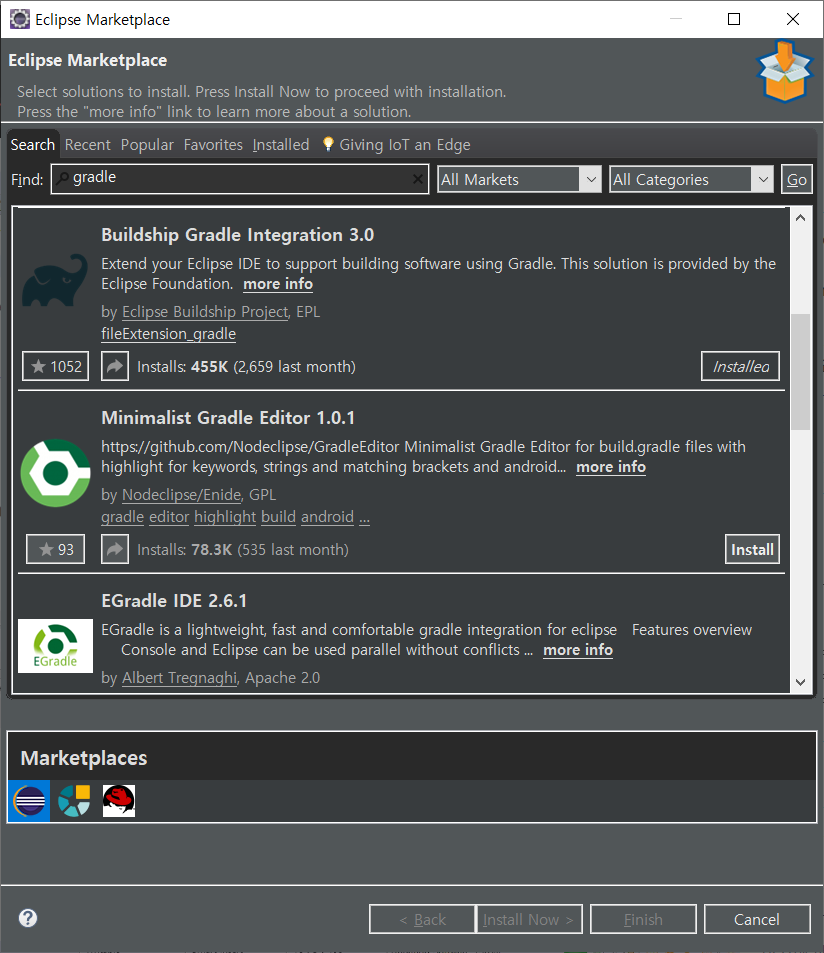
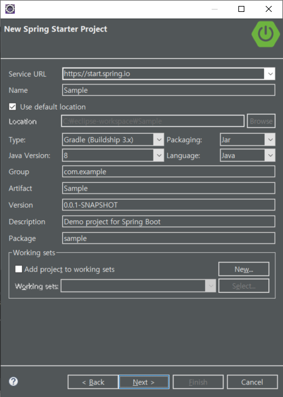
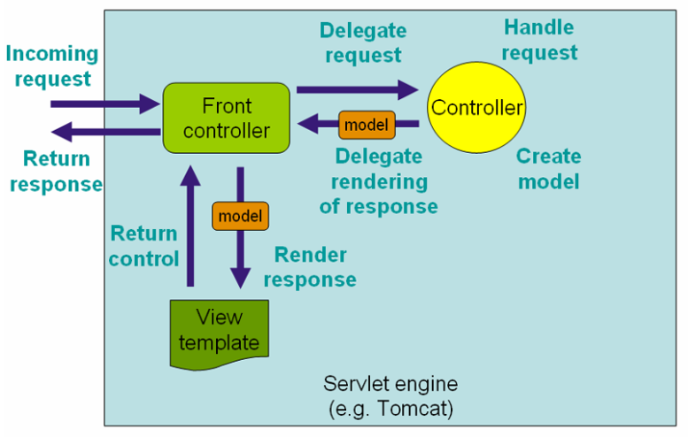

# Spring Boot

## 개발환경 설정

### 이클립스 설치 디렉터리에 있는 eclipse.ini 파일을 수정

C:\Users\TTak\eclipse\jee-2019-12\eclipse

eclipse.ini

```ini
-startup
plugins/org.eclipse.equinox.launcher_1.5.600.v20191014-2022.jar
--launcher.library
C:\Users\TTak\.p2\pool\plugins\org.eclipse.equinox.launcher.win32.win32.x86_64_1.1.1100.v20190907-0426
-product
org.eclipse.epp.package.jee.product
-showsplash
C:\Users\TTak\.p2\pool\plugins\org.eclipse.epp.package.common_4.14.0.20191212-1200
--launcher.defaultAction
openFile
--launcher.appendVmargs
-vmargs
-Dosgi.requiredJavaVersion=1.8
-Dosgi.instance.area.default=@user.home/eclipse-workspace
-XX:+UseG1GC
-XX:+UseStringDeduplication
--add-modules=ALL-SYSTEM
-Dosgi.requiredJavaVersion=1.8
-Dosgi.dataAreaRequiresExplicitInit=true
-Xms1024m     ⇐ 최소 힙 메모리
-Xmx2048m     ⇐ 최대 힙 메모리
--add-modules=ALL-SYSTEM
-Declipse.p2.max.threads=10
-Doomph.update.url=http://download.eclipse.org/oomph/updates/milestone/latest
-Doomph.redirection.index.redirection=index:/->http://git.eclipse.org/c/oomph/org.eclipse.oomph.git/plain/setups/
```

최소 힙 메모리, 최대 힙 메모리 수정


### STS 플러그인 설치

이클립스 실행 > Help > Eclipse Marketplace 메뉴를 선택 > STS로 검색 > Spring Tools 4 (...) 4.6.0 Install 클릭 > 설치 진행


* STS(Spring Tool Suite)
  * 스프링 애플리케이션 개발을 위한 이클립스 기반의 개발 환경
  * https://spring.io/tools


Could not find 'tools.jar' in the active JRE. … 오류가 발생하는 경우

Eclipse > Windows > Preference 메뉴를 선택


Add


### 그레이들 설치

gradle 검색



Buildship Gradle Integration 3.0 > Update


### MySQL / MySQL Workbench 설치

https://myanjini.tistory.com/124

https://myanjini.tistory.com/125


## 스프링 부트

자주 사용하는 라이브러리와 설정들을 미리 조합해뒀다.

복잡한 설정들을 자동으로 처리할 수 있도록 만들어두었다.

Tomcat과 같은 웹 애플리케이션 서버를 내장하고 있기 때문에 추가적인 설치 없이 내가 만든 애플리케이션을 실행할 수 있다.

서버에 배포하지 않고 바로 실행할 수 있다.

=> 쉽고 편하다. 개발, 실행할 수 있는 환경을 쉽게 사용할 수 있도록 제공해준다.

실행환경에 영향을 받지 않고 내가 만든 애플리케이션을 실행 가능


---


File => New => Other...





```
  .   ____          _            __ _ _
 /\\ / ___'_ __ _ _(_)_ __  __ _ \ \ \ \
( ( )\___ | '_ | '_| | '_ \/ _` | \ \ \ \
 \\/  ___)| |_)| | | | | || (_| |  ) ) ) )
  '  |____| .__|_| |_|_| |_\__, | / / / /
 =========|_|==============|___/=/_/_/_/
 :: Spring Boot ::        (v2.2.6.RELEASE)

2020-04-14 14:33:30.484  INFO 19044 --- [  restartedMain] sample.SampleApplication                 : Starting SampleApplication on DESKTOP-U4D3D30 with PID 19044 (C:\eclipse-workspace\Sample\bin\main started by TTak in C:\eclipse-workspace\Sample)
2020-04-14 14:33:30.493  INFO 19044 --- [  restartedMain] sample.SampleApplication                 : No active profile set, falling back to default profiles: default
2020-04-14 14:33:30.642  INFO 19044 --- [  restartedMain] .e.DevToolsPropertyDefaultsPostProcessor : Devtools property defaults active! Set 'spring.devtools.add-properties' to 'false' to disable
2020-04-14 14:33:30.651  INFO 19044 --- [  restartedMain] .e.DevToolsPropertyDefaultsPostProcessor : For additional web related logging consider setting the 'logging.level.web' property to 'DEBUG'
2020-04-14 14:33:32.412  INFO 19044 --- [  restartedMain] o.s.b.w.embedded.tomcat.TomcatWebServer  : Tomcat initialized with port(s): 8080 (http)
2020-04-14 14:33:32.425  INFO 19044 --- [  restartedMain] o.apache.catalina.core.StandardService   : Starting service [Tomcat]
2020-04-14 14:33:32.425  INFO 19044 --- [  restartedMain] org.apache.catalina.core.StandardEngine  : Starting Servlet engine: [Apache Tomcat/9.0.33]
2020-04-14 14:33:32.553  INFO 19044 --- [  restartedMain] o.a.c.c.C.[Tomcat].[localhost].[/]       : Initializing Spring embedded WebApplicationContext
2020-04-14 14:33:32.553  INFO 19044 --- [  restartedMain] o.s.web.context.ContextLoader            : Root WebApplicationContext: initialization completed in 1901 ms
2020-04-14 14:33:32.951  INFO 19044 --- [  restartedMain] o.s.s.concurrent.ThreadPoolTaskExecutor  : Initializing ExecutorService 'applicationTaskExecutor'
2020-04-14 14:33:33.199  INFO 19044 --- [  restartedMain] o.s.b.d.a.OptionalLiveReloadServer       : LiveReload server is running on port 35729
2020-04-14 14:33:33.276  INFO 19044 --- [  restartedMain] o.s.b.w.embedded.tomcat.TomcatWebServer  : Tomcat started on port(s): 8080 (http) with context path ''
2020-04-14 14:33:33.282  INFO 19044 --- [  restartedMain] sample.SampleApplication                 : Started SampleApplication in 3.811 seconds (JVM running for 7.223)
```


http://localhost:8080/


/Sample/src/main/java/sample/controller/HelloController.java

```java
package sample.controller;

import org.springframework.web.bind.annotation.RequestMapping;
import org.springframework.web.bind.annotation.RestController;

@RestController
public class HelloController {
	
	@RequestMapping("/")
	public String hello() {
		return "Hello Spring";
	}
}
```


http://localhost:8080/


코드에 실행 환경까지 포함


**src.main.java** : java 클래스 파일 모음

**SampleApplication.java** : Spring Boot 실행 클래스

**src.main.resources** : 프로젝트에 필요한 리소스 파일 모음. HTML, javascript, image, css, third party library 등을 관리

**template** : HTML 파일 모음. View Template (View : 사용자에게 보여지는 UI를 정의해 둔 것)

**static** : 정적 자원들 모음. javascript, image, css, third party library 를 위치

**application.properties** : Spring Boot 설정 파일. 실행 포트, Datasource 등을 지정

**build.gradle** : 프로젝트 Version, Dependency 등을 설정


---


/Sample/src/main/java/sample/SampleApplication.java

```java
package sample;

import org.springframework.boot.SpringApplication;
import org.springframework.boot.autoconfigure.SpringBootApplication;

@SpringBootApplication
public class SampleApplication {

	public static void main(String[] args) {
		SpringApplication.run(SampleApplication.class, args);
	}

}
```


@SpringBootApplication

@EnableAutoConfiguration, @ComponentScan, @Configuration 세 개의 애노테이션으로 구성


@EnableAutoConfiguration : 스프링의 다양한 설정이 자동으로 완료

@ComponentScan : @Component 어노테이션이 부여된 Class들을 자동으로 Scan하여 Bean으로 등록해주는 역할

@Configuration : 스프링 IoC Container에게 해당 클래스를 Bean 구성 Class임을 알려주는 역할


---


MVC

Model : 데이터

View : UI = 사용자에게 제공되는 화면

Controller : 모델과 뷰를 중계, 사용자의 요청과 요청 처리 결과를 중계





스프링 MVC의 일반적인 구조


## 게시판 프로젝트를 생성


### springbootdb 스키마 생성


---


```
    Application      |                JDBC                     | Persistence Layer
        DAO          |       (Java DB Connectivity)            |     Database
(Data Access Object) | JDBC Interface  |  JDBC Implementations |
                     |   Spring JDBC   |       JDBC Driver     |
                     |        ^        |                       |
                     |        |        |                       |
                     |    DataSource   |                       |
```

DB와의 연결을 직접적으로 한다면 Database가 변경되는 경우 인터페이스 자체가 바뀌게된다.

중간에 추상화 계층이 들어간다. JDBC => 데이터베이스와의 일반화된 인터페이스만 정의한다.

양쪽이 추상화된 계층을 이용해 개발한다면 표준화된 인터페이스를 보고 만들었기 때문에 유연하게 동작할 수 있다. 

JDBC가 동작하기 위해서는 인터페이스가 있어야 한다.

추상화된 객체가 실제 동작하는 것을 구현한 것을 Driver라고 한다.

Interface는 스프링 기반에서는 Spring JDBC를 제공한다.

Driver를 통해 데이터에 접근하고자 하는 경우 DataSource가 필요하다.


* DataSource
  * JDBC 명세의 일부
  * 일반화된 연결 팩토리
  * DB 서버와의 기본적인 연결
  * DB Connection Pooling 기능
  * 트랜잭션을 처리


### 설정 파일에 DB 연결 정보를 추가

/board/src/main/resources/application.properties

```properties
spring.datasource.hikari.driver-class-name=com.mysql.cj.jdbc.Driver
spring.datasource.hikari.jdbc-url=jdbc:mysql://localhost:3306/springbootdb?useUnicode=true&characterEncoding=utf-8
spring.datasource.hikari.username=root
spring.datasource.hikari.password=root
spring.datasource.hikari.connection-test-query=select 1
```

Hikari CP(Connection Pool)

스프링 부트 2.0.0 M2 버전부터 기본적으로 사용되는 커넥션 풀(CP: Connection Pool)


username, password 설정


아래와 같은 오류가 발생하면 jdbc-url에 serverTimezone 파라미터를 추가해 줘야 함

```
java.sql.SQLException: The server time zone value '????α? ????' is unrecognized or represents more than one time zone. You must configure either the server or JDBC driver (via the 'serverTimezone' configuration property) to use a more specifc time zone value if you want to utilize time zone support.
```


```properties
spring.datasource.hikari.driver-class-name=com.mysql.cj.jdbc.Driver
spring.datasource.hikari.jdbc-url=jdbc:mysql://localhost:3306/springbootdb?useUnicode=true&characterEncoding=utf-8&serverTimezone=Asia/Seoul
spring.datasource.hikari.username=root
spring.datasource.hikari.password=root
spring.datasource.hikari.connection-test-query=select 1
```


#### 커넥션 풀

웹 컨테이너(WAS)가 실행되면서 DB와 미리 connection(연결)을 해놓은 객체들을 pool에 저장해두었다가, 클라이언트 요청이 오면 connection을 빌려주고, 처리가 끝나면 다시 connection을 반납받아 pool에 저장하는 방식

자바에서 DB에 직접 연결해서 처리하는 경우(JDBC) 드라이버(Driver)를 로드하고 커넥션(connection) 객체를 받아와야 한다. 그러면 매번 사용자가 요청을 할 때마다 드라이버를 로드하고 커넥션 객체를 생성하여 연결하고 종료하기 때문에 매우 비효율적이다.

이런 문제를 해결하기 위해서 커넥션풀(DBCP)를 사용한다.


### DatabaseConfiguration 클래스를 생성

/board/src/main/java/board/configuration/DatabaseConfiguration.java

```java
package board.configuration;

import javax.sql.DataSource;

import org.springframework.boot.context.properties.ConfigurationProperties;
import org.springframework.context.annotation.Bean;
import org.springframework.context.annotation.Configuration;
import org.springframework.context.annotation.PropertySource;

import com.zaxxer.hikari.HikariConfig;
import com.zaxxer.hikari.HikariDataSource;

@Configuration
@PropertySource("classpath:/application.properties")
public class DatabaseConfiguration {

	@Bean
	@ConfigurationProperties(prefix = "spring.datasource.hikari")
	public HikariConfig hikariConfig() {
		return new HikariConfig();
	}

	@Bean
	public DataSource dataSource() throws Exception {
		DataSource dataSource = new HikariDataSource(hikariConfig());
		System.out.println(dataSource.toString());
		return dataSource;
	}
}
```

설정 파일을 읽어오는 것

DataSource를 만드는 것


[실행]

BoardApplication.java 마우스 오른쪽 클릭 => Run As => Spring Boot App

```
  .   ____          _            __ _ _
 /\\ / ___'_ __ _ _(_)_ __  __ _ \ \ \ \
( ( )\___ | '_ | '_| | '_ \/ _` | \ \ \ \
 \\/  ___)| |_)| | | | | || (_| |  ) ) ) )
  '  |____| .__|_| |_|_| |_\__, | / / / /
 =========|_|==============|___/=/_/_/_/
 :: Spring Boot ::        (v2.2.6.RELEASE)

2020-04-14 16:44:18.685  INFO 17960 --- [  restartedMain] board.BoardApplication                   : Starting BoardApplication on DESKTOP-U4D3D30 with PID 17960 (C:\eclipse-workspace\board\bin\main started by TTak in C:\eclipse-workspace\board)
2020-04-14 16:44:18.694  INFO 17960 --- [  restartedMain] board.BoardApplication                   : No active profile set, falling back to default profiles: default
2020-04-14 16:44:18.829  INFO 17960 --- [  restartedMain] o.s.b.devtools.restart.ChangeableUrls    : The Class-Path manifest attribute in C:\Users\TTak\.gradle\caches\modules-2\files-2.1\org.glassfish.jaxb\jaxb-runtime\2.3.2\5528bc882ea499a09d720b42af11785c4fc6be2a\jaxb-runtime-2.3.2.jar referenced one or more files that do not exist: file:/C:/Users/TTak/.gradle/caches/modules-2/files-2.1/org.glassfish.jaxb/jaxb-runtime/2.3.2/5528bc882ea499a09d720b42af11785c4fc6be2a/jakarta.xml.bind-api-2.3.2.jar,file:/C:/Users/TTak/.gradle/caches/modules-2/files-2.1/org.glassfish.jaxb/jaxb-runtime/2.3.2/5528bc882ea499a09d720b42af11785c4fc6be2a/txw2-2.3.2.jar,file:/C:/Users/TTak/.gradle/caches/modules-2/files-2.1/org.glassfish.jaxb/jaxb-runtime/2.3.2/5528bc882ea499a09d720b42af11785c4fc6be2a/istack-commons-runtime-3.0.8.jar,file:/C:/Users/TTak/.gradle/caches/modules-2/files-2.1/org.glassfish.jaxb/jaxb-runtime/2.3.2/5528bc882ea499a09d720b42af11785c4fc6be2a/stax-ex-1.8.1.jar,file:/C:/Users/TTak/.gradle/caches/modules-2/files-2.1/org.glassfish.jaxb/jaxb-runtime/2.3.2/5528bc882ea499a09d720b42af11785c4fc6be2a/FastInfoset-1.2.16.jar,file:/C:/Users/TTak/.gradle/caches/modules-2/files-2.1/org.glassfish.jaxb/jaxb-runtime/2.3.2/5528bc882ea499a09d720b42af11785c4fc6be2a/jakarta.activation-api-1.2.1.jar
2020-04-14 16:44:18.830  INFO 17960 --- [  restartedMain] .e.DevToolsPropertyDefaultsPostProcessor : Devtools property defaults active! Set 'spring.devtools.add-properties' to 'false' to disable
2020-04-14 16:44:18.830  INFO 17960 --- [  restartedMain] .e.DevToolsPropertyDefaultsPostProcessor : For additional web related logging consider setting the 'logging.level.web' property to 'DEBUG'
2020-04-14 16:44:20.217  INFO 17960 --- [  restartedMain] .s.d.r.c.RepositoryConfigurationDelegate : Bootstrapping Spring Data JPA repositories in DEFAULT mode.
2020-04-14 16:44:20.245  INFO 17960 --- [  restartedMain] .s.d.r.c.RepositoryConfigurationDelegate : Finished Spring Data repository scanning in 11ms. Found 0 JPA repository interfaces.
2020-04-14 16:44:20.484  WARN 17960 --- [  restartedMain] o.m.s.mapper.ClassPathMapperScanner      : No MyBatis mapper was found in '[board]' package. Please check your configuration.
2020-04-14 16:44:21.432  INFO 17960 --- [  restartedMain] o.s.b.w.embedded.tomcat.TomcatWebServer  : Tomcat initialized with port(s): 8080 (http)
2020-04-14 16:44:21.454  INFO 17960 --- [  restartedMain] o.apache.catalina.core.StandardService   : Starting service [Tomcat]
2020-04-14 16:44:21.454  INFO 17960 --- [  restartedMain] org.apache.catalina.core.StandardEngine  : Starting Servlet engine: [Apache Tomcat/9.0.33]
2020-04-14 16:44:21.668  INFO 17960 --- [  restartedMain] o.a.c.c.C.[Tomcat].[localhost].[/]       : Initializing Spring embedded WebApplicationContext
2020-04-14 16:44:21.669  INFO 17960 --- [  restartedMain] o.s.web.context.ContextLoader            : Root WebApplicationContext: initialization completed in 2838 ms
2020-04-14 16:44:21.797  INFO 17960 --- [  restartedMain] com.zaxxer.hikari.HikariDataSource       : HikariPool-1 - Starting...
2020-04-14 16:44:23.409  INFO 17960 --- [  restartedMain] com.zaxxer.hikari.HikariDataSource       : HikariPool-1 - Start completed.
HikariDataSource (HikariPool-1)
2020-04-14 16:44:23.732  INFO 17960 --- [  restartedMain] o.hibernate.jpa.internal.util.LogHelper  : HHH000204: Processing PersistenceUnitInfo [name: default]
2020-04-14 16:44:24.037  INFO 17960 --- [  restartedMain] org.hibernate.Version                    : HHH000412: Hibernate ORM core version 5.4.12.Final
2020-04-14 16:44:24.405  INFO 17960 --- [  restartedMain] o.hibernate.annotations.common.Version   : HCANN000001: Hibernate Commons Annotations {5.1.0.Final}
2020-04-14 16:44:24.678  INFO 17960 --- [  restartedMain] org.hibernate.dialect.Dialect            : HHH000400: Using dialect: org.hibernate.dialect.MySQL8Dialect
2020-04-14 16:44:24.982  INFO 17960 --- [  restartedMain] o.h.e.t.j.p.i.JtaPlatformInitiator       : HHH000490: Using JtaPlatform implementation: [org.hibernate.engine.transaction.jta.platform.internal.NoJtaPlatform]
2020-04-14 16:44:24.995  INFO 17960 --- [  restartedMain] j.LocalContainerEntityManagerFactoryBean : Initialized JPA EntityManagerFactory for persistence unit 'default'
2020-04-14 16:44:25.095  WARN 17960 --- [  restartedMain] JpaBaseConfiguration$JpaWebConfiguration : spring.jpa.open-in-view is enabled by default. Therefore, database queries may be performed during view rendering. Explicitly configure spring.jpa.open-in-view to disable this warning
2020-04-14 16:44:25.320  INFO 17960 --- [  restartedMain] o.s.s.concurrent.ThreadPoolTaskExecutor  : Initializing ExecutorService 'applicationTaskExecutor'
2020-04-14 16:44:26.056  INFO 17960 --- [  restartedMain] o.s.b.d.a.OptionalLiveReloadServer       : LiveReload server is running on port 35729
2020-04-14 16:44:26.189  INFO 17960 --- [  restartedMain] o.s.b.w.embedded.tomcat.TomcatWebServer  : Tomcat started on port(s): 8080 (http) with context path ''
2020-04-14 16:44:26.195  INFO 17960 --- [  restartedMain] board.BoardApplication                   : Started BoardApplication in 8.167 seconds (JVM running for 10.58)
```


### MyBatis 연동하기

MyBatis

쿼리 기반 웹 애플리케이션을 개발할 때 가장 많이 사용되는 SQL Mapper 프레임워크


Logic과 DB연동 관련 부분을 분리해서 Business Logic에 더 집중할 수 있도록 한다.

Query를 만드는 것과 Business Logic을 만드는 것을 분리 => 분업이 가능해진다.

가독성, 생산성 높아진다.


https://mybatis.org/spring-boot-starter/mybatis-spring-boot-autoconfigure/


As you may already know, to use MyBatis with Spring you need at least an `SqlSessionFactory` and at least one mapper interface.

MyBatis-Spring-Boot-Starter will:

* Autodetect an existing `DataSource`
* Will create and register an instance of a `SqlSessionFactory` passing that `DataSource` as an input using the `SqlSessionFactoryBean`
* Will create and register an instance of a `SqlSessionTemplate` got out of the `SqlSessionFactory`
* Auto-scan your mappers, link them to the `SqlSessionTemplate` and register them to Spring context so they can be injected into your beans


SqlSessionFactory ⇒ 데이터베이스와의 연결과 SQL의 실행에 대한 모든 것을 가진 객체

SqlSessionTemplate ⇒ SqlSession을 구현하고 코드에서 SqlSession을 대체하는 역할


/board/src/main/java/board/configuration/DatabaseConfiguration.java

```java
package board.configuration;

import javax.sql.DataSource;

import org.apache.ibatis.session.SqlSessionFactory;
import org.mybatis.spring.SqlSessionFactoryBean;
import org.mybatis.spring.SqlSessionTemplate;
import org.springframework.beans.factory.annotation.Autowired;
import org.springframework.boot.context.properties.ConfigurationProperties;
import org.springframework.context.ApplicationContext;
import org.springframework.context.annotation.Bean;
import org.springframework.context.annotation.Configuration;
import org.springframework.context.annotation.PropertySource;

import com.zaxxer.hikari.HikariConfig;
import com.zaxxer.hikari.HikariDataSource;

@Configuration
@PropertySource("classpath:/application.properties")
public class DatabaseConfiguration {

	@Autowired
	private ApplicationContext applicationContext;
	
	@Bean
	public SqlSessionFactory sqlSessionFactory(DataSource dataSource) throws Exception {
		SqlSessionFactoryBean sqlSessionFactoryBean = new SqlSessionFactoryBean();
		sqlSessionFactoryBean.setDataSource(dataSource);
		sqlSessionFactoryBean.setMapperLocations(
			applicationContext.getResources("classpath:/mapper/**/sql-*.xml")
		);
		return sqlSessionFactoryBean.getObject();
	}
	
	@Bean
	public SqlSessionTemplate sqlSessionTemplate(SqlSessionFactory sqlSessionFactory) {
		return new SqlSessionTemplate(sqlSessionFactory);
	}
	
	@Bean
	@ConfigurationProperties(prefix = "spring.datasource.hikari")
	public HikariConfig hikariConfig() {
		return new HikariConfig();
	}

	@Bean
	public DataSource dataSource() throws Exception {
		DataSource dataSource = new HikariDataSource(hikariConfig());
		System.out.println(dataSource.toString());
		return dataSource;
	}
}
```

xml 파일을 읽어와서 정보를 얻어온다. xml 파일을 mapper라고 한다.


```
2020-04-16 09:47:33.164  WARN 14712 --- [  restartedMain] ConfigServletWebServerApplicationContext : Exception encountered during context initialization - cancelling refresh attempt: org.springframework.beans.factory.BeanCreationException: Error creating bean with name 'sqlSessionFactory' defined in class path resource [board/configuration/DatabaseConfiguration.class]: Bean instantiation via factory method failed; nested exception is org.springframework.beans.BeanInstantiationException: Failed to instantiate [org.apache.ibatis.session.SqlSessionFactory]: Factory method 'sqlSessionFactory' threw exception; nested exception is java.io.FileNotFoundException: class path resource [mapper/] cannot be resolved to URL because it does not exist
2020-04-16 09:47:33.165  INFO 14712 --- [  restartedMain] j.LocalContainerEntityManagerFactoryBean : Closing JPA EntityManagerFactory for persistence unit 'default'
2020-04-16 09:47:33.170  INFO 14712 --- [  restartedMain] com.zaxxer.hikari.HikariDataSource       : HikariPool-1 - Shutdown initiated...
```

⇒ resources 디렉터리 아래에 mapper 디렉터리가 없어서 오류가 발생

→ resources 디렉터리 아래에 mapper 디렉터리를 생성


```
  .   ____          _            __ _ _
 /\\ / ___'_ __ _ _(_)_ __  __ _ \ \ \ \
( ( )\___ | '_ | '_| | '_ \/ _` | \ \ \ \
 \\/  ___)| |_)| | | | | || (_| |  ) ) ) )
  '  |____| .__|_| |_|_| |_\__, | / / / /
 =========|_|==============|___/=/_/_/_/
 :: Spring Boot ::        (v2.2.6.RELEASE)

2020-04-16 09:52:48.053  INFO 3200 --- [  restartedMain] board.BoardApplication                   : Starting BoardApplication on DESKTOP-U4D3D30 with PID 3200 (C:\eclipse-workspace\board\bin\main started by TTak in C:\eclipse-workspace\board)
2020-04-16 09:52:48.064  INFO 3200 --- [  restartedMain] board.BoardApplication                   : No active profile set, falling back to default profiles: default
2020-04-16 09:52:48.212  INFO 3200 --- [  restartedMain] o.s.b.devtools.restart.ChangeableUrls    : The Class-Path manifest attribute in C:\Users\TTak\.gradle\caches\modules-2\files-2.1\org.glassfish.jaxb\jaxb-runtime\2.3.2\5528bc882ea499a09d720b42af11785c4fc6be2a\jaxb-runtime-2.3.2.jar referenced one or more files that do not exist: file:/C:/Users/TTak/.gradle/caches/modules-2/files-2.1/org.glassfish.jaxb/jaxb-runtime/2.3.2/5528bc882ea499a09d720b42af11785c4fc6be2a/jakarta.xml.bind-api-2.3.2.jar,file:/C:/Users/TTak/.gradle/caches/modules-2/files-2.1/org.glassfish.jaxb/jaxb-runtime/2.3.2/5528bc882ea499a09d720b42af11785c4fc6be2a/txw2-2.3.2.jar,file:/C:/Users/TTak/.gradle/caches/modules-2/files-2.1/org.glassfish.jaxb/jaxb-runtime/2.3.2/5528bc882ea499a09d720b42af11785c4fc6be2a/istack-commons-runtime-3.0.8.jar,file:/C:/Users/TTak/.gradle/caches/modules-2/files-2.1/org.glassfish.jaxb/jaxb-runtime/2.3.2/5528bc882ea499a09d720b42af11785c4fc6be2a/stax-ex-1.8.1.jar,file:/C:/Users/TTak/.gradle/caches/modules-2/files-2.1/org.glassfish.jaxb/jaxb-runtime/2.3.2/5528bc882ea499a09d720b42af11785c4fc6be2a/FastInfoset-1.2.16.jar,file:/C:/Users/TTak/.gradle/caches/modules-2/files-2.1/org.glassfish.jaxb/jaxb-runtime/2.3.2/5528bc882ea499a09d720b42af11785c4fc6be2a/jakarta.activation-api-1.2.1.jar
2020-04-16 09:52:48.212  INFO 3200 --- [  restartedMain] .e.DevToolsPropertyDefaultsPostProcessor : Devtools property defaults active! Set 'spring.devtools.add-properties' to 'false' to disable
2020-04-16 09:52:48.213  INFO 3200 --- [  restartedMain] .e.DevToolsPropertyDefaultsPostProcessor : For additional web related logging consider setting the 'logging.level.web' property to 'DEBUG'
2020-04-16 09:52:49.312  INFO 3200 --- [  restartedMain] .s.d.r.c.RepositoryConfigurationDelegate : Bootstrapping Spring Data JPA repositories in DEFAULT mode.
2020-04-16 09:52:49.334  INFO 3200 --- [  restartedMain] .s.d.r.c.RepositoryConfigurationDelegate : Finished Spring Data repository scanning in 9ms. Found 0 JPA repository interfaces.
2020-04-16 09:52:49.518  WARN 3200 --- [  restartedMain] o.m.s.mapper.ClassPathMapperScanner      : No MyBatis mapper was found in '[board]' package. Please check your configuration.
2020-04-16 09:52:50.597  INFO 3200 --- [  restartedMain] o.s.b.w.embedded.tomcat.TomcatWebServer  : Tomcat initialized with port(s): 8080 (http)
2020-04-16 09:52:50.612  INFO 3200 --- [  restartedMain] o.apache.catalina.core.StandardService   : Starting service [Tomcat]
2020-04-16 09:52:50.612  INFO 3200 --- [  restartedMain] org.apache.catalina.core.StandardEngine  : Starting Servlet engine: [Apache Tomcat/9.0.33]
2020-04-16 09:52:50.771  INFO 3200 --- [  restartedMain] o.a.c.c.C.[Tomcat].[localhost].[/]       : Initializing Spring embedded WebApplicationContext
2020-04-16 09:52:50.772  INFO 3200 --- [  restartedMain] o.s.web.context.ContextLoader            : Root WebApplicationContext: initialization completed in 2559 ms
2020-04-16 09:52:50.897  INFO 3200 --- [  restartedMain] com.zaxxer.hikari.HikariDataSource       : HikariPool-1 - Starting...
2020-04-16 09:52:52.178  INFO 3200 --- [  restartedMain] com.zaxxer.hikari.HikariDataSource       : HikariPool-1 - Start completed.
HikariDataSource (HikariPool-1)
2020-04-16 09:52:52.555  INFO 3200 --- [  restartedMain] o.hibernate.jpa.internal.util.LogHelper  : HHH000204: Processing PersistenceUnitInfo [name: default]
2020-04-16 09:52:52.721  INFO 3200 --- [  restartedMain] org.hibernate.Version                    : HHH000412: Hibernate ORM core version 5.4.12.Final
2020-04-16 09:52:52.917  INFO 3200 --- [  restartedMain] o.hibernate.annotations.common.Version   : HCANN000001: Hibernate Commons Annotations {5.1.0.Final}
2020-04-16 09:52:53.095  INFO 3200 --- [  restartedMain] org.hibernate.dialect.Dialect            : HHH000400: Using dialect: org.hibernate.dialect.MySQL8Dialect
2020-04-16 09:52:53.423  INFO 3200 --- [  restartedMain] o.h.e.t.j.p.i.JtaPlatformInitiator       : HHH000490: Using JtaPlatform implementation: [org.hibernate.engine.transaction.jta.platform.internal.NoJtaPlatform]
2020-04-16 09:52:53.439  INFO 3200 --- [  restartedMain] j.LocalContainerEntityManagerFactoryBean : Initialized JPA EntityManagerFactory for persistence unit 'default'
2020-04-16 09:52:53.524  WARN 3200 --- [  restartedMain] o.mybatis.spring.SqlSessionFactoryBean   : Property 'mapperLocations' was specified but matching resources are not found.
2020-04-16 09:52:53.636  WARN 3200 --- [  restartedMain] JpaBaseConfiguration$JpaWebConfiguration : spring.jpa.open-in-view is enabled by default. Therefore, database queries may be performed during view rendering. Explicitly configure spring.jpa.open-in-view to disable this warning
2020-04-16 09:52:53.883  INFO 3200 --- [  restartedMain] o.s.s.concurrent.ThreadPoolTaskExecutor  : Initializing ExecutorService 'applicationTaskExecutor'
2020-04-16 09:52:54.273  INFO 3200 --- [  restartedMain] o.s.b.d.a.OptionalLiveReloadServer       : LiveReload server is running on port 35729
2020-04-16 09:52:54.364  INFO 3200 --- [  restartedMain] o.s.b.w.embedded.tomcat.TomcatWebServer  : Tomcat started on port(s): 8080 (http) with context path ''
2020-04-16 09:52:54.370  INFO 3200 --- [  restartedMain] board.BoardApplication                   : Started BoardApplication in 6.902 seconds (JVM running for 9.14)
```


### MyBatis 연결 확인 (테스트)

/board/src/test/java/board/BoardApplicationTests.java

```java
package board;

import org.junit.jupiter.api.Test;
import org.junit.runner.RunWith;
import org.mybatis.spring.SqlSessionTemplate;
import org.springframework.beans.factory.annotation.Autowired;
import org.springframework.boot.test.context.SpringBootTest;
import org.springframework.test.context.junit4.SpringRunner;

@RunWith(SpringRunner.class)
@SpringBootTest
class BoardApplicationTests {

	@Autowired
	private SqlSessionTemplate sqlSessionTemplate;
	
	@Test
	void contextLoads() {
	}

	@Test
	public void testSqlSession() throws Exception {
		System.out.println(sqlSessionTemplate.toString());
	}
}
```


빌드 패스에 JUnit 라이브러리 추가


Add Library...


단위 테스트를 실행


JUnit5 관련 오류가 발생하는 경우 라이브러리의 순서를 변경


JUnit 테스트 2개 모두 통과해야 정상

testSqlSession() 테스트가 통과했다는 것은 sqlSessionTemplate을 생성했다는 의미


```
  .   ____          _            __ _ _
 /\\ / ___'_ __ _ _(_)_ __  __ _ \ \ \ \
( ( )\___ | '_ | '_| | '_ \/ _` | \ \ \ \
 \\/  ___)| |_)| | | | | || (_| |  ) ) ) )
  '  |____| .__|_| |_|_| |_\__, | / / / /
 =========|_|==============|___/=/_/_/_/
 :: Spring Boot ::        (v2.2.6.RELEASE)

2020-04-16 10:01:46.312  INFO 3156 --- [           main] board.BoardApplicationTests              : Starting BoardApplicationTests on DESKTOP-U4D3D30 with PID 3156 (started by TTak in C:\eclipse-workspace\board)
2020-04-16 10:01:46.315  INFO 3156 --- [           main] board.BoardApplicationTests              : No active profile set, falling back to default profiles: default
2020-04-16 10:01:48.680  INFO 3156 --- [           main] .s.d.r.c.RepositoryConfigurationDelegate : Bootstrapping Spring Data JPA repositories in DEFAULT mode.
2020-04-16 10:01:48.722  INFO 3156 --- [           main] .s.d.r.c.RepositoryConfigurationDelegate : Finished Spring Data repository scanning in 15ms. Found 0 JPA repository interfaces.
2020-04-16 10:01:49.011  WARN 3156 --- [           main] o.m.s.mapper.ClassPathMapperScanner      : No MyBatis mapper was found in '[board]' package. Please check your configuration.
2020-04-16 10:01:49.971  INFO 3156 --- [           main] com.zaxxer.hikari.HikariDataSource       : HikariPool-1 - Starting...
2020-04-16 10:01:52.121  INFO 3156 --- [           main] com.zaxxer.hikari.HikariDataSource       : HikariPool-1 - Start completed.
HikariDataSource (HikariPool-1)
2020-04-16 10:01:52.714  INFO 3156 --- [           main] o.hibernate.jpa.internal.util.LogHelper  : HHH000204: Processing PersistenceUnitInfo [name: default]
2020-04-16 10:01:52.962  INFO 3156 --- [           main] org.hibernate.Version                    : HHH000412: Hibernate ORM core version 5.4.12.Final
2020-04-16 10:01:53.431  INFO 3156 --- [           main] o.hibernate.annotations.common.Version   : HCANN000001: Hibernate Commons Annotations {5.1.0.Final}
2020-04-16 10:01:54.298  INFO 3156 --- [           main] org.hibernate.dialect.Dialect            : HHH000400: Using dialect: org.hibernate.dialect.MySQL8Dialect
2020-04-16 10:01:54.933  INFO 3156 --- [           main] o.h.e.t.j.p.i.JtaPlatformInitiator       : HHH000490: Using JtaPlatform implementation: [org.hibernate.engine.transaction.jta.platform.internal.NoJtaPlatform]
2020-04-16 10:01:54.954  INFO 3156 --- [           main] j.LocalContainerEntityManagerFactoryBean : Initialized JPA EntityManagerFactory for persistence unit 'default'
2020-04-16 10:01:55.089  WARN 3156 --- [           main] o.mybatis.spring.SqlSessionFactoryBean   : Property 'mapperLocations' was specified but matching resources are not found.
2020-04-16 10:01:55.948  WARN 3156 --- [           main] JpaBaseConfiguration$JpaWebConfiguration : spring.jpa.open-in-view is enabled by default. Therefore, database queries may be performed during view rendering. Explicitly configure spring.jpa.open-in-view to disable this warning
2020-04-16 10:01:56.837  INFO 3156 --- [           main] o.s.s.concurrent.ThreadPoolTaskExecutor  : Initializing ExecutorService 'applicationTaskExecutor'
2020-04-16 10:01:58.133  INFO 3156 --- [           main] board.BoardApplicationTests              : Started BoardApplicationTests in 12.463 seconds (JVM running for 16.397)
org.mybatis.spring.SqlSessionTemplate@31723307		⇐ 정상적으로 생성되었기 때문에 인스턴스 정보가 출력
2020-04-16 10:01:58.518  INFO 3156 --- [extShutdownHook] o.s.s.concurrent.ThreadPoolTaskExecutor  : Shutting down ExecutorService 'applicationTaskExecutor'
2020-04-16 10:01:58.519  INFO 3156 --- [extShutdownHook] j.LocalContainerEntityManagerFactoryBean : Closing JPA EntityManagerFactory for persistence unit 'default'
2020-04-16 10:01:58.525  INFO 3156 --- [extShutdownHook] com.zaxxer.hikari.HikariDataSource       : HikariPool-1 - Shutdown initiated...
2020-04-16 10:01:58.538  INFO 3156 --- [extShutdownHook] com.zaxxer.hikari.HikariDataSource       : HikariPool-1 - Shutdown completed.
```

