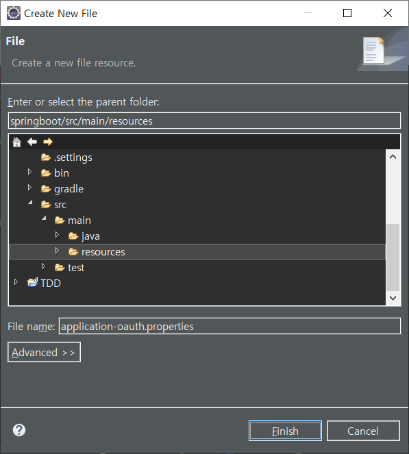
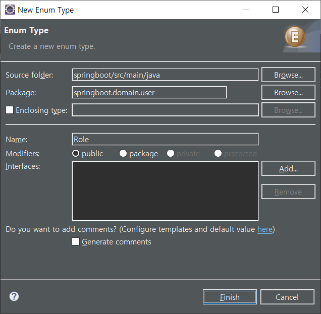
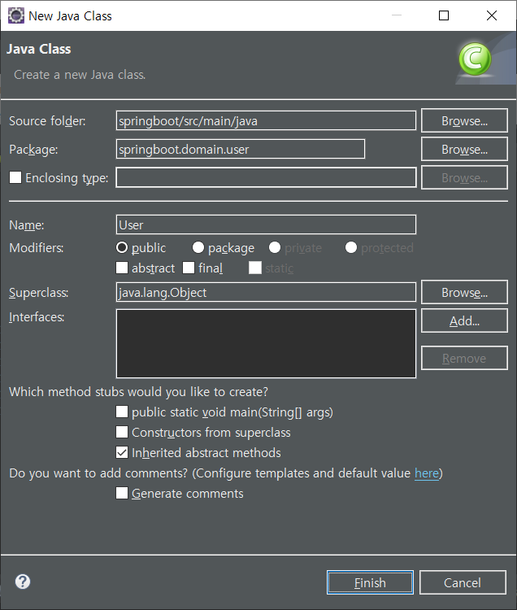
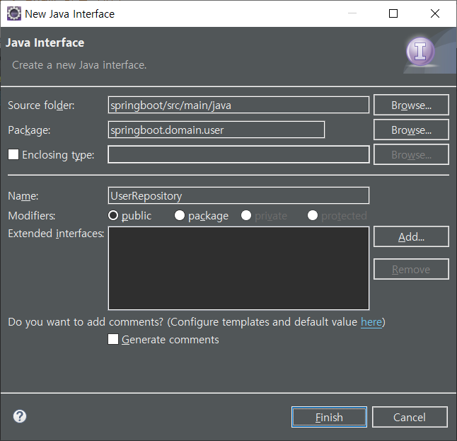
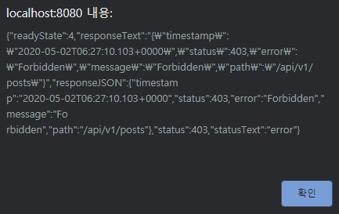
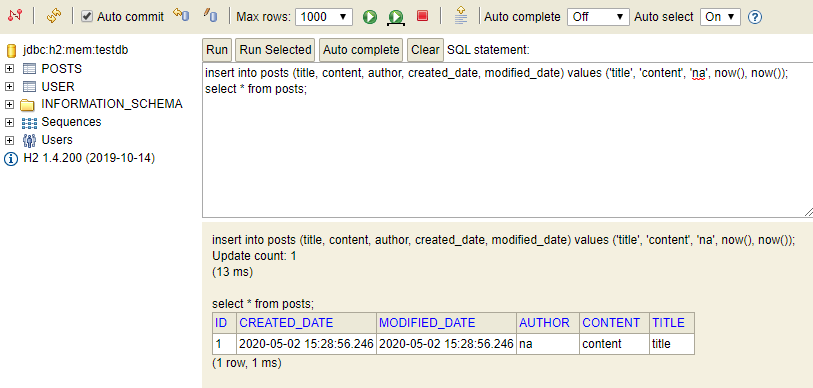
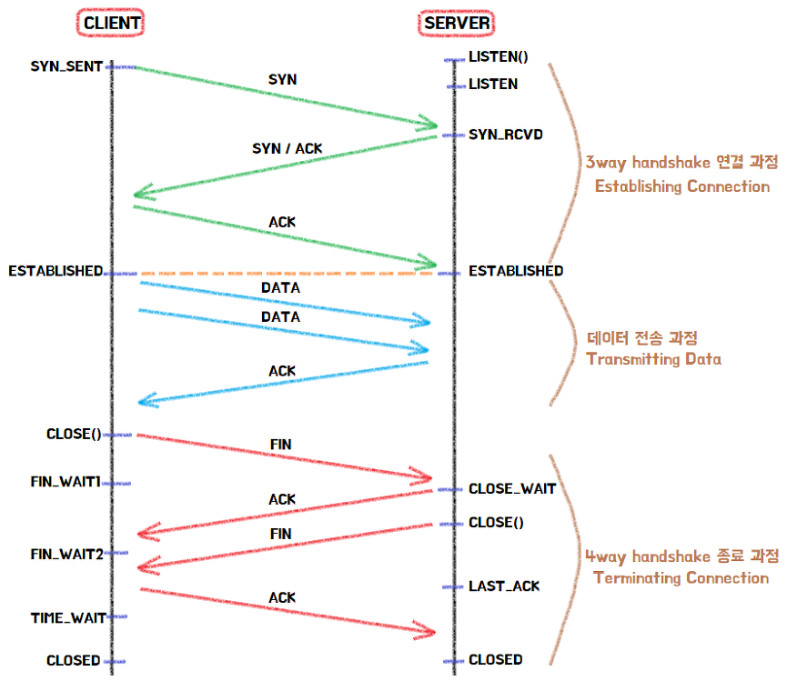
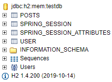
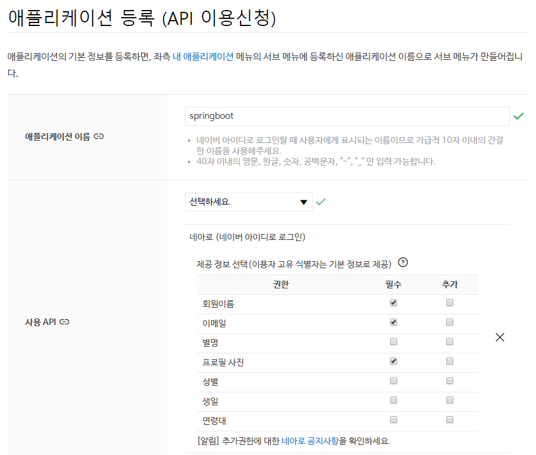
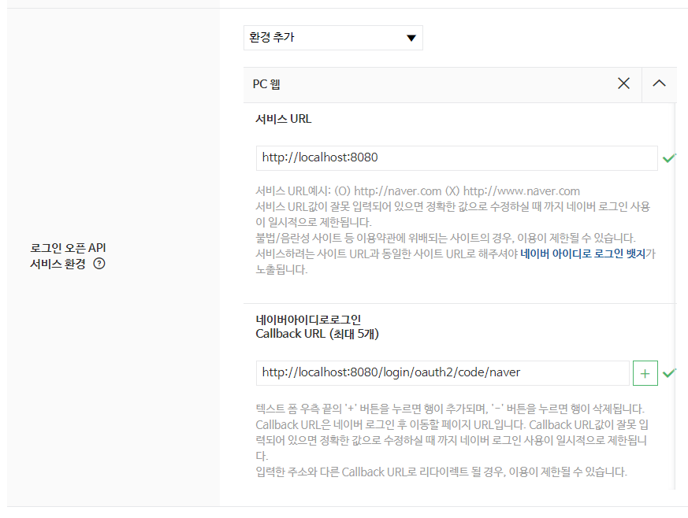

# Spring Boot

## 구글 클라우드 플랫폼 가입

https://console.cloud.google.com/


## 스프링 시큐리티, OAuth2.0으로 로그인 기능 구현

### 구글 서비스 등록(생성)

홈 => 프로젝트 만들기

프로젝트 이름 : springboot-webservice => 만들기

API 및 서비스 => OAuth 동의 화면 => 외부 => 만들기

애플리케이션 이름 : springboot-webservice => 저장 => OAuth 동의 화면 확인

사용자 인증 정보 => 사용자 인증 정보 만들기 => OAuth 2.0 클라이언트 ID

애플리케이션 유형 : 웹 애플리케이션

이름 : springboot-webservice

승인된 리디렉션 URI : http://localhost:8080/login/oauth2/code/google

생성

클라이언트 ID, 클라이언트 보안 비밀번호


### oauth 설정 파일 생성




/springboot/src/main/resources/application-oauth.properties

```properties
# OAuth 클라이언트 ID
spring.security.oauth2.client.registration.google.client-id=
# OAuth 클라이언트 보안 비밀번호
spring.security.oauth2.client.registration.google.client-secret=
# OAuth 서비스를 이용해서 제공받을 정보의 범위
# 기본값 : profile,email,openid 
# openid를 요청하면 정보를 제공받을 서비스를 구분해야 함
# 하나의 OAuth2Service로 구현하기 위해서 openid를 scope에서 제외
spring.security.oauth2.client.registration.google.scope=profile,email
```


application.properties에 application-oauth.properties를 포함

/springboot/src/main/resources/application.properties

```properties
spring.profiles.include=oauth

spring.jpa.show-sql=true
spring.h2.console.enabled=true
```


### Role 열거형 클래스 생성




/springboot/src/main/java/springboot/domain/user/Role.java

```java
package springboot.domain.user;

import lombok.Getter;
import lombok.RequiredArgsConstructor;

@Getter
@RequiredArgsConstructor
public enum Role {
	GUEST("ROLE_GUEST", "손님"), 
	USER("ROLE_USER", "일반사용자");
	
	private final String key;
	private final String title;
}
```


### 사용자 정보를 담을 엔티티 클래스를 생성




/springboot/src/main/java/springboot/domain/user/User.java

```java
package springboot.domain.user;

import javax.persistence.Column;
import javax.persistence.Entity;
import javax.persistence.EnumType;
import javax.persistence.Enumerated;
import javax.persistence.GeneratedValue;
import javax.persistence.GenerationType;
import javax.persistence.Id;

import lombok.Builder;
import lombok.Getter;
import lombok.NoArgsConstructor;
import springboot.domain.BaseTimeEntity;

@NoArgsConstructor
@Getter
@Entity
public class User extends BaseTimeEntity {
	
	@Id
	@GeneratedValue(strategy = GenerationType.IDENTITY)
	private Long id;
	
	@Column(nullable = false)
	private String name;
	
	@Column(nullable = false)
	private String email;
	
	@Column
	private String picture;
	
	// @Enumerated : Enum 값을 저장
	@Enumerated(EnumType.STRING)
	@Column(nullable = false)
	private Role role;
	
	@Builder
	public User(String name, String email, String picture, Role role) {
		this.name = name;
		this.email = email;
		this.picture = picture;
		this.role = role;
	}
	
	public User update(String name, String picture) {
		this.name = name;
		this.picture = picture;
		return this;
	}
	
	public String getRoleKey() {
		return this.role.getKey();
	}
}
```


### 사용자 정보를 CRUD하는 Repository를 생성




/springboot/src/main/java/springboot/domain/user/UserRepository.java

```java
package springboot.domain.user;

import java.util.Optional;

import org.springframework.data.jpa.repository.JpaRepository;

public interface UserRepository extends JpaRepository<User, Long> {
	// 이메일 정보가 일치하는 사용자 정보를 조회
	Optional<User> findByEmail(String email);
}
```


### oauth2 의존성 추가

/springboot/build.gradle

```gradle
			:
dependencies {
	implementation 'org.springframework.boot:spring-boot-starter-web'
	providedRuntime 'org.springframework.boot:spring-boot-starter-tomcat'
	testImplementation 'org.springframework.boot:spring-boot-starter-test'
	testRuntimeOnly 'org.junit.platform:junit-platform-launcher'
	
	compile 'org.projectlombok:lombok'
	compile 'org.springframework.boot:spring-boot-starter-data-jpa'
    compile 'com.h2database:h2'
    compile 'org.springframework.boot:spring-boot-starter-mustache'
    compile 'org.springframework.boot:spring-boot-starter-oauth2-client'
}
			:
```


Refresh Gradle Project


### SecurityConfig 클래스 생성


/springboot/src/main/java/springboot/config/auth/SecurityConfig.java

```java
package springboot.config.auth;

import org.springframework.security.config.annotation.web.builders.HttpSecurity;
import org.springframework.security.config.annotation.web.configuration.EnableWebSecurity;
import org.springframework.security.config.annotation.web.configuration.WebSecurityConfigurerAdapter;

import lombok.RequiredArgsConstructor;
import springboot.domain.user.Role;

// Spring Security 설정들을 활성
@EnableWebSecurity 
@RequiredArgsConstructor
public class SecurityConfig extends WebSecurityConfigurerAdapter {

	// 구글 로그인을 통해 가져온 정보(email, name, picture 등)를 기반으로
	// 가입, 정보 수정, 세션에 저장하는 등의 기능을 제공
	private final CustomOAuth2UserService customOAuth2UserService;
	
	@Override
	protected void configure(HttpSecurity http) throws Exception {
		http
			// h2-console 화면을 사용하기 위해서 설정을 해제 (개발 용도)
			.csrf().disable()
			.headers().frameOptions().disable()
			.and()
				// URL별로 권한 관리를 지정
				.authorizeRequests()
				// 권한 관리 대상을 지정
				.antMatchers("/", "/css/**", "/images/**", "/js/**", "/h2-console/**").permitAll()
				.antMatchers("/api/v1/**").hasRole(Role.USER.name())
				// 설정된 값을 제외한 나머지에 대해서는 인증 받은 사용자만 허용
				.anyRequest().authenticated()
			.and()
				// logout 기능에 대해서 정의
				.logout()
					.logoutSuccessUrl("/")
			.and()
				// oauth2Login 기능에 대해서 정의
				.oauth2Login()
					// OAuth2 로그인에 성공했을 때 사용자 정보를 가져오는 방법을 설정
					.userInfoEndpoint()
						// 소셜 로그인에 성공했을 때 후속 조치를 구현한 구현체를 등록
						.userService(customOAuth2UserService);
	}
}
```


### OAuth2UserService를 통해 가져온 정보를 담을 클래스를 생성


/springboot/src/main/java/springboot/config/auth/dto/OAuthAttributes.java

```java
package springboot.config.auth.dto;

import java.util.Map;

import lombok.Builder;
import lombok.Getter;
import springboot.domain.user.Role;
import springboot.domain.user.User;

@Getter
public class OAuthAttributes {

	private Map<String, Object> attributes;
	
	private String nameAttributeKey;
	private String name;
	private String email;
	private String picture;
	
	@Builder
	public OAuthAttributes(Map<String, Object> attributes, String nameAttributeKey, String name, String email,
			String picture) {
		this.attributes = attributes;
		this.nameAttributeKey = nameAttributeKey;
		this.name = name;
		this.email = email;
		this.picture = picture;
	}
	
	// registrationId : 소셜 로그인(google, naver, facebook ...) 구분을 위한 용도
	public static OAuthAttributes of(String registrationId, 
			String userNameAttributeName, Map<String, Object> attributes) {
		return ofGoogle(userNameAttributeName, attributes);
	}
	
	public static OAuthAttributes ofGoogle(String userNameAttributeName, Map<String, Object> attributes) {
		return OAuthAttributes.builder()
				.name((String)attributes.get("name"))
				.email((String)attributes.get("email"))
				.picture((String)attributes.get("picture"))
				.attributes(attributes)
				.nameAttributeKey(userNameAttributeName)
				.build();
	}
	
	public User toEntity() {
		return User.builder()
				.name(this.name)
				.email(this.email)
				.picture(this.picture)
				.role(Role.GUEST)
				.build();
	}
}
```


### 인증된 사용자 정보를 저장할 객체를 생성


/springboot/src/main/java/springboot/config/auth/dto/SessionUser.java

```java
package springboot.config.auth.dto;

import java.io.Serializable;

import lombok.Getter;
import springboot.domain.user.User;

// 직렬화
// 자바 시스템 내부에서 사용되는 객체(또는 데이터)를 
// 외부의 자바 시스템에서도 사용할 수 있도록 바이트(byte) 형태로 데이터를 변환하는 기술

@Getter
public class SessionUser implements Serializable {
	private String name;
	private String email;
	private String picture;
	
	public SessionUser(User user) {
		this.name = user.getName();
		this.email = user.getEmail();
		this.picture = user.getPicture();
	}
}
```


### 소셜 로그인을 통해서 가져온 사용자 정보를 처리하는 서비스를 구현

/springboot/src/main/java/springboot/config/auth/CustomOAuth2UserService.java

```java
package springboot.config.auth;

import java.util.Collections;

import javax.servlet.http.HttpSession;

import org.springframework.security.core.authority.SimpleGrantedAuthority;
import org.springframework.security.oauth2.client.userinfo.DefaultOAuth2UserService;
import org.springframework.security.oauth2.client.userinfo.OAuth2UserRequest;
import org.springframework.security.oauth2.client.userinfo.OAuth2UserService;
import org.springframework.security.oauth2.core.OAuth2AuthenticationException;
import org.springframework.security.oauth2.core.user.DefaultOAuth2User;
import org.springframework.security.oauth2.core.user.OAuth2User;
import org.springframework.stereotype.Service;

import lombok.RequiredArgsConstructor;
import springboot.config.auth.dto.OAuthAttributes;
import springboot.config.auth.dto.SessionUser;
import springboot.domain.user.User;
import springboot.domain.user.UserRepository;

@RequiredArgsConstructor
@Service
public class CustomOAuth2UserService implements OAuth2UserService<OAuth2UserRequest, OAuth2User> {

	private final UserRepository userRepository;
	private final HttpSession httpSession;
	
	@Override
	public OAuth2User loadUser(OAuth2UserRequest userRequest) throws OAuth2AuthenticationException {
		OAuth2UserService delegate = new DefaultOAuth2UserService();
		OAuth2User oauth2User = delegate.loadUser(userRequest);
		
		String registrationId = userRequest.getClientRegistration().getRegistrationId();
		String userNameAttributeName = userRequest.getClientRegistration().getProviderDetails().getUserInfoEndpoint().getUserNameAttributeName();
		
		OAuthAttributes attributes = OAuthAttributes.of(registrationId, userNameAttributeName, oauth2User.getAttributes());
		
		User user = saveOrUpdate(attributes);
		httpSession.setAttribute("user", new SessionUser(user));
		
		return new DefaultOAuth2User(
				Collections.singleton(new SimpleGrantedAuthority(user.getRoleKey())), 
				attributes.getAttributes(), 
				attributes.getNameAttributeKey()
		);
	}

	private User saveOrUpdate(OAuthAttributes attributes) {
		User user = userRepository.findByEmail(attributes.getEmail())
				.map(entity -> entity.update(attributes.getName(), attributes.getPicture()))
				.orElse(attributes.toEntity());
		return userRepository.save(user);
	}
}
```


### 로그인 버튼을 추가

/springboot/src/main/resources/templates/index.mustache

```mustache
		:
	<h1>스프링 부트로 시작하는 웹 서비스</h1>
	<div class="col-md-12">
		<div class="row">
			<div class="col-md-6">
				<a href="/posts/save" role="button" class="btn btn-primary">글 등록</a>
				
				<!-- userName 존재하는 경우 -->
				{{#loginUserName}} 
					Logged in as: <span id="user">{{loginUserName}}</span>
					
					<a href="/logout" class="btn btn-info active" role="button">Logout</a>
				{{/loginUserName}}
				
				<!-- userName 존재하지 않는 경우 -->
				{{^loginUserName}} 
					<a href="/oauth2/authorization/google" class="btn btn-success active" role="button">Google</a>
				{{/loginUserName}}
				
			</div>
		</div>
	</div>
		:
```


스프링 시큐리티에서 기본적으로 제공하는 로그인/로그아웃 URL 

⇒ 별도의 컨트롤러를 생성하지 않아도 됩니다.

/oauth2/authorization/google

/logout


Session : 상대편과 연결되어 있는 상태


### IndexController에 userName을 추가

/springboot/src/main/java/springboot/web/IndexController.java

```java
@RequiredArgsConstructor
@Controller
public class IndexController {
	
	private final PostsService postsService;
	private final HttpSession httpSession;
	
	@GetMapping("/")
	public String index(Model model) {
		model.addAttribute("posts", postsService.findAllDesc());
		
		// 로그인한 사용자(세션 유무)이면 userName을 템플릿으로 전달
		SessionUser user = (SessionUser)httpSession.getAttribute("user");
		if (user != null) {
			model.addAttribute("loginUserName", user.getName());
			if(user.getPicture() == null)
				model.addAttribute("loginUserPicture", "https://dummyimage.com/50x50/007bff/000000.jpg&text=%5E..%5E");
			else
				model.addAttribute("loginUserPicture", user.getPicture());
		}
		
		return "index";
	}
    		:
}
```


더미 이미지 생성 사이트 : https://dummyimage.com/


### 테스트

http://localhost:8080/

Google 버튼 클릭 => Google 계정으로 로그인 => User 이름 확인 => Logout


### H2-Console을 이용해서 회원 정보를 조회

http://localhost:8080/h2-console

```sql
select * from user;
```

Run 버튼 클릭 => 결과 확인


### 게시글 등록 시 오류




### H2-Console에서 직접 데이터를 추가 후 조회 및 수정

```sql
insert into posts (title, content, author, created_date, modified_date) values ('title', 'content', 'na', now(), now());
select * from posts;
```





게시글 수정 시 오류 발생


### 로그인한 사용자의 롤을 DB에서 확인

http://localhost:8080/h2-console

```sql
select * from user;
```


ROLE이 GUEST인 것을 확인할 수 있다.


### 로그인한 사용자의 롤을 USER로 변경

```sql
update user set role = 'USER';
```


### (재로그인 후) 게시글 등록 및 수정 가능 여부 확인


## 데이터베이스에 세션 정보를 저장하도록 수정

* HTTP
  * Request(요청), Response(응답) 구조
  * Stateless (연결을 유지하지 않음)


* 정보의 표현 방법과 프로토콜
  * 정보의 표현 방법 : html
    * 데이터를 태그로 감싸서 주겠다. markup language
  * 프로토콜 : http





처음에는 연결을 먼저 한다. 3-way handshaking

웹 서버는 연결된 통로를 통해서 들어오는 요청을 처리할 자식 프로세스를 만든다.

데이터(요청)가 오면 ACK를 보낸다. (자식 프로세스는 그 요청에 맞는 데이터를 만들고 응답을 보낸다.)

클라이언트가 서버로부터 요청한 정보를 모두 응답받았다면 연결을 종료한다. 4-way handshaking


```
Client                                                      Server
                   GET /index.html HTTP/1.0
               --------------------------------->

                   HTTP/1.0 200 OK
index.html     <---------------------------------
                   Set-Cookie: role=user; name=hong; age=24;

                   GET /main.html HTTP/1.0
               --------------------------------->
                   Cookie: role=user; name=hong; age=24;
```


Cookie ⇒ Stateless 한 HTTP 프로토콜의 한계를 개선

→ 요청/응답 헤더를 통해서 정보가 전달 ⇒ 쉽게 노출되고 위변가 가능 단점 ⇒ 세션을 통해서 보완


```
                   login.do?id=abc&pw=123 
Client         ---------------------------------------->   Server → SID : 1234234 
                                                                         - name: hong
                                                                         - age: 24
main           <----------------------------------------                 - role: user
                   Set-Cookie: SID=1234234

                --------------------------------------->
                   Cookie: SID=1234234
```


WAS 세션을 이용

DB에 저장

메모리 DB를 이용


### spring-session-jdbc 의존성 등록

/springboot/build.gradle

```gradle
		:
dependencies {
	implementation 'org.springframework.boot:spring-boot-starter-web'
	providedRuntime 'org.springframework.boot:spring-boot-starter-tomcat'
	testImplementation 'org.springframework.boot:spring-boot-starter-test'
	testRuntimeOnly 'org.junit.platform:junit-platform-launcher'
	
	compile 'org.projectlombok:lombok'
	compile 'org.springframework.boot:spring-boot-starter-data-jpa'
    compile 'com.h2database:h2'
    compile 'org.springframework.boot:spring-boot-starter-mustache'
    compile 'org.springframework.boot:spring-boot-starter-oauth2-client'
    compile 'org.springframework.session:spring-session-jdbc'
}
		:
```


Refresh Gradle Project


### 세션 저장소로 JDBC를 지정

/springboot/src/main/resources/application.properties

```properties
		:
spring.session.store-type=jdbc
```


### 재기동 후 세션 정보를 저장 용도의 테이블 생성을 확인

http://localhost:8080/h2-console




```sql
select * from spring_session;
```


## 네이버 로그인 기능 추가

### 네이버 API 등록

https://developers.naver.com/apps/#/register





애플리케이션 이름 : springboot

사용 API : 네아로(네이버 아이디로 로그인)

제공 정보 : 회원이름, 이메일, 프로필 사진





서비스 URL : http://localhost:8080

Callback URL : http://localhost:8080/login/oauth2/code/naver

등록하기 버튼 클릭


Client ID, Client Secret 확인


### 등록 정보를 설정

https://developers.naver.com/docs/login/profile/


/springboot/src/main/resources/application-oauth.properties

```properties
spring.security.oauth2.client.registration.google.client-id=
spring.security.oauth2.client.registration.google.client-secret=
spring.security.oauth2.client.registration.google.scope=profile,email

spring.security.oauth2.client.registration.naver.client-id=
spring.security.oauth2.client.registration.naver.client-secret=
spring.security.oauth2.client.registration.naver.scope=name,email,profile_image
spring.security.oauth2.client.registration.naver.redirect-uri={baseUrl}/{action}/oauth2/code/{registrationId}
spring.security.oauth2.client.registration.naver.authorization-grant-type=authorization_code
spring.security.oauth2.client.registration.naver.client-name=Naver

spring.security.oauth2.client.provider.naver.authorization-uri=https://nid.naver.com/oauth2.0/authorize
spring.security.oauth2.client.provider.naver.token-uri=https://nid.naver.com/oauth2.0/token
spring.security.oauth2.client.provider.naver.user-info-uri=https://openapi.naver.com/v1/nid/me
spring.security.oauth2.client.provider.naver.user-name-attribute=response
```


### OAuthAttributes 클래스에 네이버인 경우 사용할 코드를 추가

/springboot/src/main/java/springboot/config/auth/dto/OAuthAttributes.java

```java
		:
	public static OAuthAttributes of(String registrationId, 
			String userNameAttributeName, Map<String, Object> attributes) {
		// 네이버인 경우
		if ("naver".contentEquals(registrationId)) {
			return ofNaver("id", attributes);
		}
		return ofGoogle(userNameAttributeName, attributes);
	}
	
	public static OAuthAttributes ofNaver(String userNameAttributeName, Map<String, Object> attributes) {
		
		Map<String, Object> response = (Map<String, Object>) attributes.get("response");
		
		return OAuthAttributes.builder()
				.name((String)response.get("name"))
				.email((String)response.get("email"))
				.picture((String)response.get("profile_image"))
				.attributes(response)
				.nameAttributeKey(userNameAttributeName)
				.build();
	}
		:
```


### 네이버 로그인 버튼 추가

/springboot/src/main/resources/templates/index.mustache

```mustache
					:
				{{^loginUserName}} 
					<a href="/oauth2/authorization/google" class="btn btn-success active" role="button">Google</a>
					<a href="/oauth2/authorization/naver" class="btn btn-secondary active" role="button">Naver</a>
				{{/loginUserName}}
					:
```


### 네이버와 구글이 반환하는 데이터 구조를 확인

/springboot/src/main/java/springboot/config/auth/dto/OAuthAttributes.java

```java
import net.minidev.json.JSONObject;

@Getter
public class OAuthAttributes {
			:
	public static JSONObject getJsonStringFromMap(Map<String, Object> map) {
		JSONObject jsonObject = new JSONObject();
		for (Map.Entry<String, Object> entry : map.entrySet()) {
			String key = entry.getKey();
			Object value = entry.getValue();
			jsonObject.put(key, value);
		}

		return jsonObject;
	}
	
	public static OAuthAttributes of(String registrationId, 
			String userNameAttributeName, Map<String, Object> attributes) {
		
		System.out.println(registrationId);
		System.out.println(getJsonStringFromMap(attributes));
		
		// 네이버인 경우
		if ("naver".contentEquals(registrationId)) {
			return ofNaver("id", attributes);
		}
		return ofGoogle(userNameAttributeName, attributes);
	}
			:
}
```


네이버와 구글이 반환하는 데이터 구조 비교


## EC2(Elastic Compute Cloud) 인스턴스 생성

https://aws.amazon.com/ko/console/

서비스 => EC2 => 인스턴스 시작

* 단계 1: Amazon Machine Image(AMI) 선택
  * Amazon Linux AMI 2018.03.0 (HVM), SSD Volume Type
* 단계 2: 인스턴스 유형 선택
  * t2.micro
* 단계 3: 인스턴스 세부 정보 구성
  * 인스턴스 개수 : 1
  * 네트워크 : 기본값
  * 서브넷 : 기본 설정 없음(가용 영역의 기본 서브넷)
  * 퍼블릭 IP 자동 할당 : 서브넷 사용 설정(활성화)
* 단계 4: 스토리지 추가
  * 크기(GiB) : 30
  * 볼륨 유형 : 범용 SSD(gp2)
* 단계 5: 태그 추가
  * 태그: 검색을 할 때 사용되는 값
  * 키 : Name
  * 값 : springboot-webservice
* 단계 6: 보안 그룹 구성
  * 보안 그룹 생성
  * 보안 그룹 이름 : springboot-webservice-ec2
  * SSH - TCP - 22 - 내 IP
  * HTTPS - TCP - 443 - 사용자 지정
  * 사용자 지정 TCP 규칙 - TCP - 8080 - 사용자 지정
* 단계 7: 인스턴스 시작 검토
* 기존 키 페어 선택 또는 새 키 페어 생성
  * 새 키 페어 생성
  * 키 페어 이름 : springboot-webservice
  * 키 페어 다운로드
  * 인스턴스 시작


대칭키 : 암호화에 사용되는 암호화 키와 복호화에 사용되는 암호화 키가 동일. 키 분배 및 관리에 문제가 있다.

비대칭키 : 개인키(특정 사람만이 가진다)와 공개키(누구나 가질 수 있다). 개인키로 암호화 한 정보는 그 쌍이 되는 공개키로만 복호화 가능하고, 반대로 공개키로 암호화 한 정보는 그 쌍이 되는 개인키로만 복호화가 가능. 키 관리의 문제가 사라진다. 속도가 느리다.


키 교환

서버와 클라이언트가 안전한 대칭키 방식의 보안 통신을 하기 위해서는 가지고 있는 키를 상호 교환해야 할 필요가 있다. 그 때 비대칭키가 사용된다.

SSH : 원격지에 있는 컴퓨터를 안전하게 제어하기 위한 프로토콜. 서버와 클라이언트 간의 보안 통신


## 탄력적 IP(Elastic IP) 주소

AWS의 고정 IP 서비스

**탄력적 IP를 생성하고 EC2 서버에 연결하지 않으면 비용이 발생**


네트워크 및 보안 => 탄력적 IP => 탄력적 IP 주소 할당

Amazon의 IPv4 주소 풀 => 할당

Actions => 탄력적 IP 주소 연결

리소스 유형 : 인스턴스

생성한 인스턴스 선택, 프라이빗 IP 주소 선택 => 연결


## EC2 서버에 접속

Xshell 5 이용


**새로 만들기**

**연결**

이름 : springboot-webservice

호스트 : 탄력적 IP 입력

포트 번호 : 22


**사용자 인증**

방법 : Public Key

사용자 이름 : ec2-user

사용자 키 => 찾아보기 => 가져오기 => 생성한 키 페어 선택(.pem 파일)


## Java8 설치

```bash
[ec2-user@ip-172-31-19-132 ~]$ java -version
java version "1.7.0_251"
OpenJDK Runtime Environment (amzn-2.6.21.0.82.amzn1-x86_64 u251-b02)
OpenJDK 64-Bit Server VM (build 24.251-b02, mixed mode)
[ec2-user@ip-172-31-19-132 ~]$ sudo yum install -y java-1.8.0-openjdk-devel.x86_64
		:
Dependency Installed:
  avahi-libs.x86_64 0:0.6.25-12.17.amzn1                                             
  cups-libs.x86_64 1:1.4.2-67.21.amzn1                                               
  gnutls.x86_64 0:2.12.23-21.18.amzn1                                                
  java-1.8.0-openjdk.x86_64 1:1.8.0.242.b08-0.50.amzn1                               
  java-1.8.0-openjdk-headless.x86_64 1:1.8.0.242.b08-0.50.amzn1                      
  jbigkit-libs.x86_64 0:2.0-11.4.amzn1                                               
  libtiff.x86_64 0:4.0.3-32.34.amzn1                                                 
  lksctp-tools.x86_64 0:1.0.10-7.7.amzn1                                             

Complete!
```

sudo는 일시적으로 관리자 권한을 가진다. 해당 명령어가 실행되는 동안만 관리자 권한을 가진다.

su는 관리자 권한을 획득한다. 계정을 변경하기 전까지는 계속 관리자 권한이다.


```bash
[ec2-user@ip-172-31-19-132 ~]$ sudo /usr/sbin/alternatives --config java

There are 2 programs which provide 'java'.

  Selection    Command
-----------------------------------------------
*+ 1           /usr/lib/jvm/jre-1.7.0-openjdk.x86_64/bin/java
   2           /usr/lib/jvm/jre-1.8.0-openjdk.x86_64/bin/java

Enter to keep the current selection[+], or type selection number: 2
[ec2-user@ip-172-31-19-132 ~]$ sudo yum remove java-1.7.0-openjdk
Loaded plugins: priorities, update-motd, upgrade-helper
Resolving Dependencies
--> Running transaction check
---> Package java-1.7.0-openjdk.x86_64 1:1.7.0.251-2.6.21.0.82.amzn1 will be erased
--> Finished Dependency Resolution

Dependencies Resolved

=====================================================================================
 Package               Arch      Version                          Repository    Size
=====================================================================================
Removing:
 java-1.7.0-openjdk    x86_64    1:1.7.0.251-2.6.21.0.82.amzn1    installed     91 M

Transaction Summary
=====================================================================================
Remove  1 Package

Installed size: 91 M
Is this ok [y/N]: y
Downloading packages:
Running transaction check
Running transaction test
Transaction test succeeded
Running transaction
  Erasing    : 1:java-1.7.0-openjdk-1.7.0.251-2.6.21.0.82.amzn1.x86_64           1/1 
  Verifying  : 1:java-1.7.0-openjdk-1.7.0.251-2.6.21.0.82.amzn1.x86_64           1/1 

Removed:
  java-1.7.0-openjdk.x86_64 1:1.7.0.251-2.6.21.0.82.amzn1                            

Complete!
[ec2-user@ip-172-31-19-132 ~]$ java -version
openjdk version "1.8.0_242"
OpenJDK Runtime Environment (build 1.8.0_242-b08)
OpenJDK 64-Bit Server VM (build 25.242-b08, mixed mode)
```


## 한국 표준 시간대(KST)로 타임존을 변경

```bash
[ec2-user@springboot-webservice ~]$ cat /etc/localtime
TZif2UTCTZif2UTC
UTC0
[ec2-user@springboot-webservice ~]$ sudo rm /etc/localtime
[ec2-user@springboot-webservice ~]$ sudo ln -s /usr/share/zoneinfo/Asia/Seoul /etc/localtime
```

ln : 파일의 링크를 생성할 때 사용. 파일 연결 명령어


## 호스트네임 변경

MAC Address

모든 네트워크 카드는 서로 다른 MAC Address를 가진다. 48bit


hostname은 일반적으로 동일 네트워크 내의 단말들을 식별하기 위한 것이다.

동일 네트워크를 벗어나는 개념이 domain


```bash
[ec2-user@ip-172-31-19-132 ~]$ sudo vim /etc/sysconfig/network
```


```bash
NETWORKING=yes
# HOSTNAME=localhost.localdomain
HOSTNAME=springboot-webservice
NOZEROCONF=yes
```


```bash
[ec2-user@ip-172-31-19-132 ~]$ sudo vim /etc/hosts
```


```bash
127.0.0.1   localhost localhost.localdomain localhost4 localhost4.localdomain4
::1         localhost6 localhost6.localdomain6
127.0.0.1   springboot-webservice
```


```bash
[ec2-user@ip-172-31-19-132 ~]$ sudo reboot
```


## Xshell 5로 재접속

```bash
[ec2-user@springboot-webservice ~]$ 
```

* ec2-user : 사용자 계정
* springboot-webservice : 호스트 명 or IP
* ~ : ec2-user의 홈 디렉터리
* $ : 일반 유저
* \# : 관리자 유저


