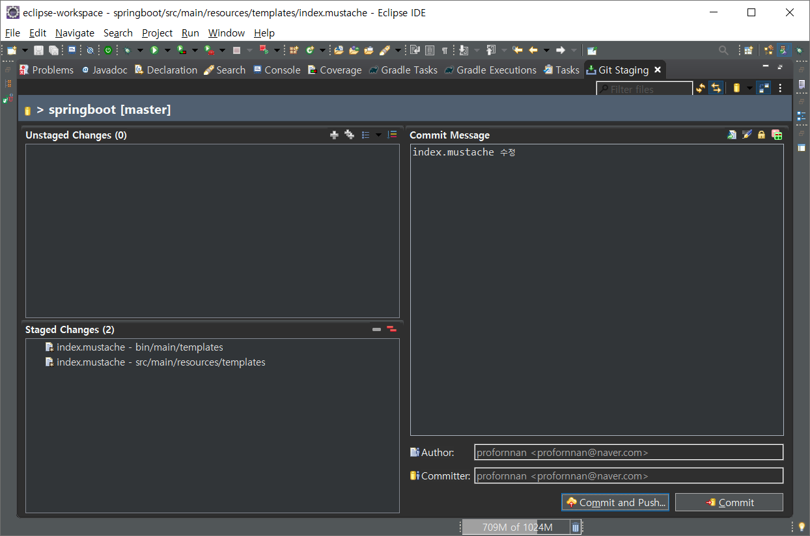
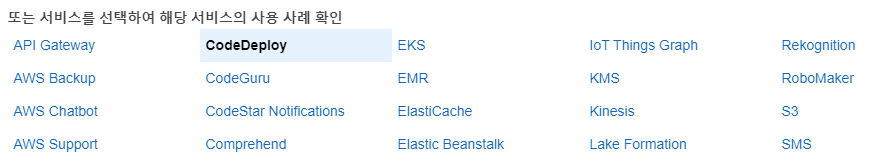

# Spring Boot

## 구글 클라우드 플랫폼 가입

https://console.cloud.google.com/


## 스프링 시큐리티, OAuth2.0으로 로그인 기능 구현

### 구글 서비스 등록(생성)

홈 => 프로젝트 만들기

프로젝트 이름 : springboot-webservice => 만들기

API 및 서비스 => OAuth 동의 화면 => 외부 => 만들기

애플리케이션 이름 : springboot-webservice => 저장 => OAuth 동의 화면 확인

사용자 인증 정보 => 사용자 인증 정보 만들기 => OAuth 2.0 클라이언트 ID

애플리케이션 유형 : 웹 애플리케이션

이름 : springboot-webservice

승인된 리디렉션 URI : http://localhost:8080/login/oauth2/code/google

생성

클라이언트 ID, 클라이언트 보안 비밀번호


### oauth 설정 파일 생성


/springboot/src/main/resources/application-oauth.properties

```properties
# OAuth 클라이언트 ID
spring.security.oauth2.client.registration.google.client-id=
# OAuth 클라이언트 보안 비밀번호
spring.security.oauth2.client.registration.google.client-secret=
# OAuth 서비스를 이용해서 제공받을 정보의 범위
# 기본값 : profile,email,openid 
# openid를 요청하면 정보를 제공받을 서비스를 구분해야 함
# 하나의 OAuth2Service로 구현하기 위해서 openid를 scope에서 제외
spring.security.oauth2.client.registration.google.scope=profile,email
```


application.properties에 application-oauth.properties를 포함

/springboot/src/main/resources/application.properties

```properties
spring.profiles.include=oauth

spring.jpa.show-sql=true
spring.h2.console.enabled=true
```


### Role 열거형 클래스 생성


/springboot/src/main/java/springboot/domain/user/Role.java

```java
package springboot.domain.user;

import lombok.Getter;
import lombok.RequiredArgsConstructor;

@Getter
@RequiredArgsConstructor
public enum Role {
	GUEST("ROLE_GUEST", "손님"), 
	USER("ROLE_USER", "일반사용자");
	
	private final String key;
	private final String title;
}
```


### 사용자 정보를 담을 엔티티 클래스를 생성


/springboot/src/main/java/springboot/domain/user/User.java

```java
package springboot.domain.user;

import javax.persistence.Column;
import javax.persistence.Entity;
import javax.persistence.EnumType;
import javax.persistence.Enumerated;
import javax.persistence.GeneratedValue;
import javax.persistence.GenerationType;
import javax.persistence.Id;

import lombok.Builder;
import lombok.Getter;
import lombok.NoArgsConstructor;
import springboot.domain.BaseTimeEntity;

@NoArgsConstructor
@Getter
@Entity
public class User extends BaseTimeEntity {
	
	@Id
	@GeneratedValue(strategy = GenerationType.IDENTITY)
	private Long id;
	
	@Column(nullable = false)
	private String name;
	
	@Column(nullable = false)
	private String email;
	
	@Column
	private String picture;
	
	// @Enumerated : Enum 값을 저장
	@Enumerated(EnumType.STRING)
	@Column(nullable = false)
	private Role role;
	
	@Builder
	public User(String name, String email, String picture, Role role) {
		this.name = name;
		this.email = email;
		this.picture = picture;
		this.role = role;
	}
	
	public User update(String name, String picture) {
		this.name = name;
		this.picture = picture;
		return this;
	}
	
	public String getRoleKey() {
		return this.role.getKey();
	}
}
```


### 사용자 정보를 CRUD하는 Repository를 생성


/springboot/src/main/java/springboot/domain/user/UserRepository.java

```java
package springboot.domain.user;

import java.util.Optional;

import org.springframework.data.jpa.repository.JpaRepository;

public interface UserRepository extends JpaRepository<User, Long> {
	// 이메일 정보가 일치하는 사용자 정보를 조회
	Optional<User> findByEmail(String email);
}
```


### oauth2 의존성 추가

/springboot/build.gradle

```gradle
			:
dependencies {
	implementation 'org.springframework.boot:spring-boot-starter-web'
	providedRuntime 'org.springframework.boot:spring-boot-starter-tomcat'
	testImplementation 'org.springframework.boot:spring-boot-starter-test'
	testRuntimeOnly 'org.junit.platform:junit-platform-launcher'
	
	compile 'org.projectlombok:lombok'
	compile 'org.springframework.boot:spring-boot-starter-data-jpa'
    compile 'com.h2database:h2'
    compile 'org.springframework.boot:spring-boot-starter-mustache'
    compile 'org.springframework.boot:spring-boot-starter-oauth2-client'
}
			:
```


Refresh Gradle Project


### SecurityConfig 클래스 생성


/springboot/src/main/java/springboot/config/auth/SecurityConfig.java

```java
package springboot.config.auth;

import org.springframework.security.config.annotation.web.builders.HttpSecurity;
import org.springframework.security.config.annotation.web.configuration.EnableWebSecurity;
import org.springframework.security.config.annotation.web.configuration.WebSecurityConfigurerAdapter;

import lombok.RequiredArgsConstructor;
import springboot.domain.user.Role;

// Spring Security 설정들을 활성
@EnableWebSecurity 
@RequiredArgsConstructor
public class SecurityConfig extends WebSecurityConfigurerAdapter {

	// 구글 로그인을 통해 가져온 정보(email, name, picture 등)를 기반으로
	// 가입, 정보 수정, 세션에 저장하는 등의 기능을 제공
	private final CustomOAuth2UserService customOAuth2UserService;
	
	@Override
	protected void configure(HttpSecurity http) throws Exception {
		http
			// h2-console 화면을 사용하기 위해서 설정을 해제 (개발 용도)
			.csrf().disable()
			.headers().frameOptions().disable()
			.and()
				// URL별로 권한 관리를 지정
				.authorizeRequests()
				// 권한 관리 대상을 지정
				.antMatchers("/", "/css/**", "/images/**", "/js/**", "/h2-console/**").permitAll()
				.antMatchers("/api/v1/**").hasRole(Role.USER.name())
				// 설정된 값을 제외한 나머지에 대해서는 인증 받은 사용자만 허용
				.anyRequest().authenticated()
			.and()
				// logout 기능에 대해서 정의
				.logout()
					.logoutSuccessUrl("/")
			.and()
				// oauth2Login 기능에 대해서 정의
				.oauth2Login()
					// OAuth2 로그인에 성공했을 때 사용자 정보를 가져오는 방법을 설정
					.userInfoEndpoint()
						// 소셜 로그인에 성공했을 때 후속 조치를 구현한 구현체를 등록
						.userService(customOAuth2UserService);
	}
}
```


### OAuth2UserService를 통해 가져온 정보를 담을 클래스를 생성


/springboot/src/main/java/springboot/config/auth/dto/OAuthAttributes.java

```java
package springboot.config.auth.dto;

import java.util.Map;

import lombok.Builder;
import lombok.Getter;
import springboot.domain.user.Role;
import springboot.domain.user.User;

@Getter
public class OAuthAttributes {

	private Map<String, Object> attributes;
	
	private String nameAttributeKey;
	private String name;
	private String email;
	private String picture;
	
	@Builder
	public OAuthAttributes(Map<String, Object> attributes, String nameAttributeKey, String name, String email,
			String picture) {
		this.attributes = attributes;
		this.nameAttributeKey = nameAttributeKey;
		this.name = name;
		this.email = email;
		this.picture = picture;
	}
	
	// registrationId : 소셜 로그인(google, naver, facebook ...) 구분을 위한 용도
	public static OAuthAttributes of(String registrationId, 
			String userNameAttributeName, Map<String, Object> attributes) {
		return ofGoogle(userNameAttributeName, attributes);
	}
	
	public static OAuthAttributes ofGoogle(String userNameAttributeName, Map<String, Object> attributes) {
		return OAuthAttributes.builder()
				.name((String)attributes.get("name"))
				.email((String)attributes.get("email"))
				.picture((String)attributes.get("picture"))
				.attributes(attributes)
				.nameAttributeKey(userNameAttributeName)
				.build();
	}
	
	public User toEntity() {
		return User.builder()
				.name(this.name)
				.email(this.email)
				.picture(this.picture)
				.role(Role.GUEST)
				.build();
	}
}
```


### 인증된 사용자 정보를 저장할 객체를 생성


/springboot/src/main/java/springboot/config/auth/dto/SessionUser.java

```java
package springboot.config.auth.dto;

import java.io.Serializable;

import lombok.Getter;
import springboot.domain.user.User;

// 직렬화
// 자바 시스템 내부에서 사용되는 객체(또는 데이터)를 
// 외부의 자바 시스템에서도 사용할 수 있도록 바이트(byte) 형태로 데이터를 변환하는 기술

@Getter
public class SessionUser implements Serializable {
	private String name;
	private String email;
	private String picture;
	
	public SessionUser(User user) {
		this.name = user.getName();
		this.email = user.getEmail();
		this.picture = user.getPicture();
	}
}
```


### 소셜 로그인을 통해서 가져온 사용자 정보를 처리하는 서비스를 구현

/springboot/src/main/java/springboot/config/auth/CustomOAuth2UserService.java

```java
package springboot.config.auth;

import java.util.Collections;

import javax.servlet.http.HttpSession;

import org.springframework.security.core.authority.SimpleGrantedAuthority;
import org.springframework.security.oauth2.client.userinfo.DefaultOAuth2UserService;
import org.springframework.security.oauth2.client.userinfo.OAuth2UserRequest;
import org.springframework.security.oauth2.client.userinfo.OAuth2UserService;
import org.springframework.security.oauth2.core.OAuth2AuthenticationException;
import org.springframework.security.oauth2.core.user.DefaultOAuth2User;
import org.springframework.security.oauth2.core.user.OAuth2User;
import org.springframework.stereotype.Service;

import lombok.RequiredArgsConstructor;
import springboot.config.auth.dto.OAuthAttributes;
import springboot.config.auth.dto.SessionUser;
import springboot.domain.user.User;
import springboot.domain.user.UserRepository;

@RequiredArgsConstructor
@Service
public class CustomOAuth2UserService implements OAuth2UserService<OAuth2UserRequest, OAuth2User> {

	private final UserRepository userRepository;
	private final HttpSession httpSession;
	
	@Override
	public OAuth2User loadUser(OAuth2UserRequest userRequest) throws OAuth2AuthenticationException {
		OAuth2UserService delegate = new DefaultOAuth2UserService();
		OAuth2User oauth2User = delegate.loadUser(userRequest);
		
		String registrationId = userRequest.getClientRegistration().getRegistrationId();
		String userNameAttributeName = userRequest.getClientRegistration().getProviderDetails().getUserInfoEndpoint().getUserNameAttributeName();
		
		OAuthAttributes attributes = OAuthAttributes.of(registrationId, userNameAttributeName, oauth2User.getAttributes());
		
		User user = saveOrUpdate(attributes);
		httpSession.setAttribute("user", new SessionUser(user));
		
		return new DefaultOAuth2User(
				Collections.singleton(new SimpleGrantedAuthority(user.getRoleKey())), 
				attributes.getAttributes(), 
				attributes.getNameAttributeKey()
		);
	}

	private User saveOrUpdate(OAuthAttributes attributes) {
		User user = userRepository.findByEmail(attributes.getEmail())
				.map(entity -> entity.update(attributes.getName(), attributes.getPicture()))
				.orElse(attributes.toEntity());
		return userRepository.save(user);
	}
}
```


### 로그인 버튼을 추가

/springboot/src/main/resources/templates/index.mustache

```mustache
		:
	<h1>스프링 부트로 시작하는 웹 서비스</h1>
	<div class="col-md-12">
		<div class="row">
			<div class="col-md-6">
				<a href="/posts/save" role="button" class="btn btn-primary">글 등록</a>
				
				<!-- userName 존재하는 경우 -->
				{{#loginUserName}} 
					Logged in as: <span id="user">{{loginUserName}}</span>
					
					<a href="/logout" class="btn btn-info active" role="button">Logout</a>
				{{/loginUserName}}
				
				<!-- userName 존재하지 않는 경우 -->
				{{^loginUserName}} 
					<a href="/oauth2/authorization/google" class="btn btn-success active" role="button">Google</a>
				{{/loginUserName}}
				
			</div>
		</div>
	</div>
		:
```


스프링 시큐리티에서 기본적으로 제공하는 로그인/로그아웃 URL 

⇒ 별도의 컨트롤러를 생성하지 않아도 됩니다.

/oauth2/authorization/google

/logout


Session : 상대편과 연결되어 있는 상태


### IndexController에 userName을 추가

/springboot/src/main/java/springboot/web/IndexController.java

```java
@RequiredArgsConstructor
@Controller
public class IndexController {
	
	private final PostsService postsService;
	private final HttpSession httpSession;
	
	@GetMapping("/")
	public String index(Model model) {
		model.addAttribute("posts", postsService.findAllDesc());
		
		// 로그인한 사용자(세션 유무)이면 userName을 템플릿으로 전달
		SessionUser user = (SessionUser)httpSession.getAttribute("user");
		if (user != null) {
			model.addAttribute("loginUserName", user.getName());
			if(user.getPicture() == null)
				model.addAttribute("loginUserPicture", "https://dummyimage.com/50x50/007bff/000000.jpg&text=%5E..%5E");
			else
				model.addAttribute("loginUserPicture", user.getPicture());
		}
		
		return "index";
	}
    		:
}
```


더미 이미지 생성 사이트 : https://dummyimage.com/


### 테스트

http://localhost:8080/

Google 버튼 클릭 => Google 계정으로 로그인 => User 이름 확인 => Logout


### H2-Console을 이용해서 회원 정보를 조회

http://localhost:8080/h2-console

```sql
select * from user;
```

Run 버튼 클릭 => 결과 확인


### 게시글 등록 시 오류


### H2-Console에서 직접 데이터를 추가 후 조회 및 수정

```sql
insert into posts (title, content, author, created_date, modified_date) values ('title', 'content', 'na', now(), now());
select * from posts;
```


게시글 수정 시 오류 발생


### 로그인한 사용자의 롤을 DB에서 확인

http://localhost:8080/h2-console

```sql
select * from user;
```


ROLE이 GUEST인 것을 확인할 수 있다.


### 로그인한 사용자의 롤을 USER로 변경

```sql
update user set role = 'USER';
```


### (재로그인 후) 게시글 등록 및 수정 가능 여부 확인


## 데이터베이스에 세션 정보를 저장하도록 수정

* HTTP
  * Request(요청), Response(응답) 구조
  * Stateless (연결을 유지하지 않음)


* 정보의 표현 방법과 프로토콜
  * 정보의 표현 방법 : html
    * 데이터를 태그로 감싸서 주겠다. markup language
  * 프로토콜 : http


처음에는 연결을 먼저 한다. 3-way handshaking

웹 서버는 연결된 통로를 통해서 들어오는 요청을 처리할 자식 프로세스를 만든다.

데이터(요청)가 오면 ACK를 보낸다. (자식 프로세스는 그 요청에 맞는 데이터를 만들고 응답을 보낸다.)

클라이언트가 서버로부터 요청한 정보를 모두 응답받았다면 연결을 종료한다. 4-way handshaking


```
Client                                                      Server
                   GET /index.html HTTP/1.0
               --------------------------------->

                   HTTP/1.0 200 OK
index.html     <---------------------------------
                   Set-Cookie: role=user; name=hong; age=24;

                   GET /main.html HTTP/1.0
               --------------------------------->
                   Cookie: role=user; name=hong; age=24;
```


Cookie ⇒ Stateless 한 HTTP 프로토콜의 한계를 개선

→ 요청/응답 헤더를 통해서 정보가 전달 ⇒ 쉽게 노출되고 위변가 가능 단점 ⇒ 세션을 통해서 보완


```
                   login.do?id=abc&pw=123 
Client         ---------------------------------------->   Server → SID : 1234234 
                                                                         - name: hong
                                                                         - age: 24
main           <----------------------------------------                 - role: user
                   Set-Cookie: SID=1234234

                --------------------------------------->
                   Cookie: SID=1234234
```


WAS 세션을 이용

DB에 저장

메모리 DB를 이용


### spring-session-jdbc 의존성 등록

/springboot/build.gradle

```gradle
		:
dependencies {
	implementation 'org.springframework.boot:spring-boot-starter-web'
	providedRuntime 'org.springframework.boot:spring-boot-starter-tomcat'
	testImplementation 'org.springframework.boot:spring-boot-starter-test'
	testRuntimeOnly 'org.junit.platform:junit-platform-launcher'
	
	compile 'org.projectlombok:lombok'
	compile 'org.springframework.boot:spring-boot-starter-data-jpa'
    compile 'com.h2database:h2'
    compile 'org.springframework.boot:spring-boot-starter-mustache'
    compile 'org.springframework.boot:spring-boot-starter-oauth2-client'
    compile 'org.springframework.session:spring-session-jdbc'
}
		:
```


Refresh Gradle Project


### 세션 저장소로 JDBC를 지정

/springboot/src/main/resources/application.properties

```properties
		:
spring.session.store-type=jdbc
```


### 재기동 후 세션 정보를 저장 용도의 테이블 생성을 확인

http://localhost:8080/h2-console


```sql
select * from spring_session;
```


## 네이버 로그인 기능 추가

### 네이버 API 등록

https://developers.naver.com/apps/#/register


애플리케이션 이름 : springboot

사용 API : 네아로(네이버 아이디로 로그인)

제공 정보 : 회원이름, 이메일, 프로필 사진


서비스 URL : http://localhost:8080

Callback URL : http://localhost:8080/login/oauth2/code/naver

등록하기 버튼 클릭


Client ID, Client Secret 확인


### 등록 정보를 설정

https://developers.naver.com/docs/login/profile/


/springboot/src/main/resources/application-oauth.properties

```properties
spring.security.oauth2.client.registration.google.client-id=
spring.security.oauth2.client.registration.google.client-secret=
spring.security.oauth2.client.registration.google.scope=profile,email

spring.security.oauth2.client.registration.naver.client-id=
spring.security.oauth2.client.registration.naver.client-secret=
spring.security.oauth2.client.registration.naver.scope=name,email,profile_image
spring.security.oauth2.client.registration.naver.redirect-uri={baseUrl}/{action}/oauth2/code/{registrationId}
spring.security.oauth2.client.registration.naver.authorization-grant-type=authorization_code
spring.security.oauth2.client.registration.naver.client-name=Naver

spring.security.oauth2.client.provider.naver.authorization-uri=https://nid.naver.com/oauth2.0/authorize
spring.security.oauth2.client.provider.naver.token-uri=https://nid.naver.com/oauth2.0/token
spring.security.oauth2.client.provider.naver.user-info-uri=https://openapi.naver.com/v1/nid/me
spring.security.oauth2.client.provider.naver.user-name-attribute=response
```


### OAuthAttributes 클래스에 네이버인 경우 사용할 코드를 추가

/springboot/src/main/java/springboot/config/auth/dto/OAuthAttributes.java

```java
		:
	public static OAuthAttributes of(String registrationId, 
			String userNameAttributeName, Map<String, Object> attributes) {
		// 네이버인 경우
		if ("naver".contentEquals(registrationId)) {
			return ofNaver("id", attributes);
		}
		return ofGoogle(userNameAttributeName, attributes);
	}
	
	public static OAuthAttributes ofNaver(String userNameAttributeName, Map<String, Object> attributes) {
		
		Map<String, Object> response = (Map<String, Object>) attributes.get("response");
		
		return OAuthAttributes.builder()
				.name((String)response.get("name"))
				.email((String)response.get("email"))
				.picture((String)response.get("profile_image"))
				.attributes(response)
				.nameAttributeKey(userNameAttributeName)
				.build();
	}
		:
```


### 네이버 로그인 버튼 추가

/springboot/src/main/resources/templates/index.mustache

```mustache
					:
				{{^loginUserName}} 
					<a href="/oauth2/authorization/google" class="btn btn-success active" role="button">Google</a>
					<a href="/oauth2/authorization/naver" class="btn btn-secondary active" role="button">Naver</a>
				{{/loginUserName}}
					:
```


### 네이버와 구글이 반환하는 데이터 구조를 확인

/springboot/src/main/java/springboot/config/auth/dto/OAuthAttributes.java

```java
import net.minidev.json.JSONObject;

@Getter
public class OAuthAttributes {
			:
	public static JSONObject getJsonStringFromMap(Map<String, Object> map) {
		JSONObject jsonObject = new JSONObject();
		for (Map.Entry<String, Object> entry : map.entrySet()) {
			String key = entry.getKey();
			Object value = entry.getValue();
			jsonObject.put(key, value);
		}

		return jsonObject;
	}
	
	public static OAuthAttributes of(String registrationId, 
			String userNameAttributeName, Map<String, Object> attributes) {
		
		System.out.println(registrationId);
		System.out.println(getJsonStringFromMap(attributes));
		
		// 네이버인 경우
		if ("naver".contentEquals(registrationId)) {
			return ofNaver("id", attributes);
		}
		return ofGoogle(userNameAttributeName, attributes);
	}
			:
}
```


네이버와 구글이 반환하는 데이터 구조 비교


## EC2(Elastic Compute Cloud) 인스턴스 생성

https://aws.amazon.com/ko/console/

서비스 => EC2 => 인스턴스 시작

* 단계 1: Amazon Machine Image(AMI) 선택
  * Amazon Linux AMI 2018.03.0 (HVM), SSD Volume Type
* 단계 2: 인스턴스 유형 선택
  * t2.micro
* 단계 3: 인스턴스 세부 정보 구성
  * 인스턴스 개수 : 1
  * 네트워크 : 기본값
  * 서브넷 : 기본 설정 없음(가용 영역의 기본 서브넷)
  * 퍼블릭 IP 자동 할당 : 서브넷 사용 설정(활성화)
* 단계 4: 스토리지 추가
  * 크기(GiB) : 30
  * 볼륨 유형 : 범용 SSD(gp2)
* 단계 5: 태그 추가
  * 태그: 검색을 할 때 사용되는 값
  * 키 : Name
  * 값 : springboot-webservice
* 단계 6: 보안 그룹 구성
  * 보안 그룹 생성
  * 보안 그룹 이름 : springboot-webservice-ec2
  * SSH - TCP - 22 - 내 IP
  * HTTPS - TCP - 443 - 사용자 지정
  * 사용자 지정 TCP 규칙 - TCP - 8080 - 사용자 지정
* 단계 7: 인스턴스 시작 검토
* 기존 키 페어 선택 또는 새 키 페어 생성
  * 새 키 페어 생성
  * 키 페어 이름 : springboot-webservice
  * 키 페어 다운로드
  * 인스턴스 시작


대칭키 : 암호화에 사용되는 암호화 키와 복호화에 사용되는 암호화 키가 동일. 키 분배 및 관리에 문제가 있다.

비대칭키 : 개인키(특정 사람만이 가진다)와 공개키(누구나 가질 수 있다). 개인키로 암호화 한 정보는 그 쌍이 되는 공개키로만 복호화 가능하고, 반대로 공개키로 암호화 한 정보는 그 쌍이 되는 개인키로만 복호화가 가능. 키 관리의 문제가 사라진다. 속도가 느리다.


키 교환

서버와 클라이언트가 안전한 대칭키 방식의 보안 통신을 하기 위해서는 가지고 있는 키를 상호 교환해야 할 필요가 있다. 그 때 비대칭키가 사용된다.

SSH : 원격지에 있는 컴퓨터를 안전하게 제어하기 위한 프로토콜. 서버와 클라이언트 간의 보안 통신


## 탄력적 IP(Elastic IP) 주소

AWS의 고정 IP 서비스

**탄력적 IP를 생성하고 EC2 서버에 연결하지 않으면 비용이 발생**


네트워크 및 보안 => 탄력적 IP => 탄력적 IP 주소 할당

Amazon의 IPv4 주소 풀 => 할당

Actions => 탄력적 IP 주소 연결

리소스 유형 : 인스턴스

생성한 인스턴스 선택, 프라이빗 IP 주소 선택 => 연결


## EC2 서버에 접속

Xshell 5 이용


**새로 만들기**

**연결**

이름 : springboot-webservice

호스트 : 탄력적 IP 입력

포트 번호 : 22


**사용자 인증**

방법 : Public Key

사용자 이름 : ec2-user

사용자 키 => 찾아보기 => 가져오기 => 생성한 키 페어 선택(.pem 파일)


## Java8 설치

```bash
[ec2-user@ip-172-31-19-132 ~]$ java -version
java version "1.7.0_251"
OpenJDK Runtime Environment (amzn-2.6.21.0.82.amzn1-x86_64 u251-b02)
OpenJDK 64-Bit Server VM (build 24.251-b02, mixed mode)
[ec2-user@ip-172-31-19-132 ~]$ sudo yum install -y java-1.8.0-openjdk-devel.x86_64
		:
Dependency Installed:
  avahi-libs.x86_64 0:0.6.25-12.17.amzn1                                             
  cups-libs.x86_64 1:1.4.2-67.21.amzn1                                               
  gnutls.x86_64 0:2.12.23-21.18.amzn1                                                
  java-1.8.0-openjdk.x86_64 1:1.8.0.242.b08-0.50.amzn1                               
  java-1.8.0-openjdk-headless.x86_64 1:1.8.0.242.b08-0.50.amzn1                      
  jbigkit-libs.x86_64 0:2.0-11.4.amzn1                                               
  libtiff.x86_64 0:4.0.3-32.34.amzn1                                                 
  lksctp-tools.x86_64 0:1.0.10-7.7.amzn1                                             

Complete!
```

sudo는 일시적으로 관리자 권한을 가진다. 해당 명령어가 실행되는 동안만 관리자 권한을 가진다.

su는 관리자 권한을 획득한다. 계정을 변경하기 전까지는 계속 관리자 권한이다.


```bash
[ec2-user@ip-172-31-19-132 ~]$ sudo /usr/sbin/alternatives --config java

There are 2 programs which provide 'java'.

  Selection    Command
-----------------------------------------------
*+ 1           /usr/lib/jvm/jre-1.7.0-openjdk.x86_64/bin/java
   2           /usr/lib/jvm/jre-1.8.0-openjdk.x86_64/bin/java

Enter to keep the current selection[+], or type selection number: 2
[ec2-user@ip-172-31-19-132 ~]$ sudo yum remove java-1.7.0-openjdk
Loaded plugins: priorities, update-motd, upgrade-helper
Resolving Dependencies
--> Running transaction check
---> Package java-1.7.0-openjdk.x86_64 1:1.7.0.251-2.6.21.0.82.amzn1 will be erased
--> Finished Dependency Resolution

Dependencies Resolved

=====================================================================================
 Package               Arch      Version                          Repository    Size
=====================================================================================
Removing:
 java-1.7.0-openjdk    x86_64    1:1.7.0.251-2.6.21.0.82.amzn1    installed     91 M

Transaction Summary
=====================================================================================
Remove  1 Package

Installed size: 91 M
Is this ok [y/N]: y
Downloading packages:
Running transaction check
Running transaction test
Transaction test succeeded
Running transaction
  Erasing    : 1:java-1.7.0-openjdk-1.7.0.251-2.6.21.0.82.amzn1.x86_64           1/1 
  Verifying  : 1:java-1.7.0-openjdk-1.7.0.251-2.6.21.0.82.amzn1.x86_64           1/1 

Removed:
  java-1.7.0-openjdk.x86_64 1:1.7.0.251-2.6.21.0.82.amzn1                            

Complete!
[ec2-user@ip-172-31-19-132 ~]$ java -version
openjdk version "1.8.0_242"
OpenJDK Runtime Environment (build 1.8.0_242-b08)
OpenJDK 64-Bit Server VM (build 25.242-b08, mixed mode)
```


## 한국 표준 시간대(KST)로 타임존을 변경

```bash
[ec2-user@springboot-webservice ~]$ cat /etc/localtime
TZif2UTCTZif2UTC
UTC0
[ec2-user@springboot-webservice ~]$ sudo rm /etc/localtime
[ec2-user@springboot-webservice ~]$ sudo ln -s /usr/share/zoneinfo/Asia/Seoul /etc/localtime
```

ln : 파일의 링크를 생성할 때 사용. 파일 연결 명령어


## 호스트네임 변경

MAC Address

모든 네트워크 카드는 서로 다른 MAC Address를 가진다. 48bit


hostname은 일반적으로 동일 네트워크 내의 단말들을 식별하기 위한 것이다.

동일 네트워크를 벗어나는 개념이 domain


```bash
[ec2-user@ip-172-31-19-132 ~]$ sudo vim /etc/sysconfig/network
```


```bash
NETWORKING=yes
# HOSTNAME=localhost.localdomain
HOSTNAME=springboot-webservice
NOZEROCONF=yes
```


```bash
[ec2-user@ip-172-31-19-132 ~]$ sudo vim /etc/hosts
```


```bash
127.0.0.1   localhost localhost.localdomain localhost4 localhost4.localdomain4
::1         localhost6 localhost6.localdomain6
127.0.0.1   springboot-webservice
```


```bash
[ec2-user@ip-172-31-19-132 ~]$ sudo reboot
```


## Xshell 5로 재접속

```bash
[ec2-user@springboot-webservice ~]$ 
```

* ec2-user : 사용자 계정
* springboot-webservice : 호스트 명 or IP
* ~ : ec2-user의 홈 디렉터리
* $ : 일반 유저
* \# : 관리자 유저


## RDS(Relational Database Service) 설정

https://aws.amazon.com/ko/console/

서비스 => RDS => 데이터베이스 생성

* 데이터베이스 생성
  * 데이터베이스 생성 방식 선택 : 표준 생성
  * 엔진 옵션 : MariaDB
  * 템플릿 : 프리 티어
  * 설정
    * DB 인스턴스 식별자 : springboot-webservice
    * 마스터 사용자 이름, 마스터 암호, 암호 확인 입력
  * 스토리지
    * 스토리지 유형 : 범용(SSD)
    * 할당된 스토리지 : 20
  * 연결
    * 추가 연결 구성
      * 퍼블릭 액세스 가능 : 예
  * 데이터베이스 생성


파라미터 그룹 => 파라미터 그룹 생성

* 파라미터 그룹 세부 정보
  * 파라미터 그룹 패밀리 : mariadb 10.2
  * 그룹 이름 : springboot-webservice
  * 설명 : springboot-webservice


springboot-webservice 클릭 => 파라미터 편집

* time_zone 검색 => Asia/Seoul
* character_set 검색 => 전부 utf8mb4 로 설정 (6개)
* collation_connection과 collation_server 항목의 값을 utf8mb4_unicode_ci 로 설정
* max_connections 검색 => 150
* 변경 사항 저장


데이터베이스 => springboot-webservice 클릭 => 수정

* 데이터베이스 옵션
  * DB 파라미터 그룹 : springboot-webservice

계속 => 즉시 적용 => DB 인스턴스 수정


데이터베이스 => springboot-webservice 클릭 => VPC 보안 그룹 클릭

인바운드 규칙 => 인바운드 규칙 편집

규칙 추가 => MYSQL/Aurora - TCP - 3306 - 사용자 지정 - EC2에 사용된 보안 그룹의 그룹 ID

규칙 추가 => MYSQL/Aurora - TCP - 3306 - 내 IP

규칙 저장


---


MySQL Workbench 실행


MySQL Connections 옆 `+` 버튼 클릭


Connection Name: springboot-webservice

Connection Method: Standard(TCP/IP)

Hostname: RDS 엔드포인트

Port: 3306

Username: Maria DB 설치 시 입력한 값

Password: Maria DB 설치 시 입력한 값


Continue Anyway


## EC2 서버에 프로젝트 배포

### EC2에 깃 설치

```bash
[ec2-user@springboot-webservice ~]$ sudo yum install git
Loaded plugins: priorities, update-motd, upgrade-helper
amzn-main                                                     | 2.1 kB  00:00:00     
amzn-updates                                                  | 2.5 kB  00:00:00     
Resolving Dependencies
--> Running transaction check
---> Package git.x86_64 0:2.14.6-1.62.amzn1 will be installed
--> Processing Dependency: perl-Git = 2.14.6-1.62.amzn1 for package: git-2.14.6-1.62.amzn1.x86_64
--> Processing Dependency: perl(Term::ReadKey) for package: git-2.14.6-1.62.amzn1.x86_64
--> Processing Dependency: perl(Git::I18N) for package: git-2.14.6-1.62.amzn1.x86_64
--> Processing Dependency: perl(Git) for package: git-2.14.6-1.62.amzn1.x86_64
--> Processing Dependency: perl(Error) for package: git-2.14.6-1.62.amzn1.x86_64
--> Running transaction check
---> Package perl-Error.noarch 1:0.17020-2.9.amzn1 will be installed
---> Package perl-Git.noarch 0:2.14.6-1.62.amzn1 will be installed
---> Package perl-TermReadKey.x86_64 0:2.30-20.9.amzn1 will be installed
--> Finished Dependency Resolution

Dependencies Resolved

=====================================================================================
 Package               Arch        Version                   Repository         Size
=====================================================================================
Installing:
 git                   x86_64      2.14.6-1.62.amzn1         amzn-updates       12 M
Installing for dependencies:
 perl-Error            noarch      1:0.17020-2.9.amzn1       amzn-main          33 k
 perl-Git              noarch      2.14.6-1.62.amzn1         amzn-updates       69 k
 perl-TermReadKey      x86_64      2.30-20.9.amzn1           amzn-main          33 k

Transaction Summary
=====================================================================================
Install  1 Package (+3 Dependent packages)

Total download size: 12 M
Installed size: 29 M
Is this ok [y/d/N]: y
Downloading packages:
(1/4): perl-TermReadKey-2.30-20.9.amzn1.x86_64.rpm            |  33 kB  00:00:00     
(2/4): perl-Error-0.17020-2.9.amzn1.noarch.rpm                |  33 kB  00:00:00     
(3/4): perl-Git-2.14.6-1.62.amzn1.noarch.rpm                  |  69 kB  00:00:00     
(4/4): git-2.14.6-1.62.amzn1.x86_64.rpm                       |  12 MB  00:00:03     
-------------------------------------------------------------------------------------
Total                                                   3.5 MB/s |  12 MB  00:03     
Running transaction check
Running transaction test
Transaction test succeeded
Running transaction
  Installing : 1:perl-Error-0.17020-2.9.amzn1.noarch                             1/4 
  Installing : perl-TermReadKey-2.30-20.9.amzn1.x86_64                           2/4 
  Installing : git-2.14.6-1.62.amzn1.x86_64                                      3/4 
  Installing : perl-Git-2.14.6-1.62.amzn1.noarch                                 4/4 
  Verifying  : 1:perl-Error-0.17020-2.9.amzn1.noarch                             1/4 
  Verifying  : git-2.14.6-1.62.amzn1.x86_64                                      2/4 
  Verifying  : perl-Git-2.14.6-1.62.amzn1.noarch                                 3/4 
  Verifying  : perl-TermReadKey-2.30-20.9.amzn1.x86_64                           4/4 

Installed:
  git.x86_64 0:2.14.6-1.62.amzn1                                                     

Dependency Installed:
  perl-Error.noarch 1:0.17020-2.9.amzn1        perl-Git.noarch 0:2.14.6-1.62.amzn1   
  perl-TermReadKey.x86_64 0:2.30-20.9.amzn1   

Complete!
```


### 작업 디렉터리 생성

```bash
[ec2-user@springboot-webservice ~]$ mkdir ~/app && mkdir ~/app/step1
[ec2-user@springboot-webservice ~]$ cd ~/app/step1
[ec2-user@springboot-webservice step1]$ 
```


### 소스 코드를 git hub에 등록

https://github.com/

Repositories => New


Repository name : springboot-webservice

Public

Create repository


Quick setup 에 있는 주소 복사


Use or create... 체크

Create Repository 클릭

Finish


`++` 버튼 클릭

Commit Message에 '최초 등록' 입력

Commit and Push...


앞에서 복사했던 주소 붙여넣기


### git clone (@ec2)

```bash
[ec2-user@springboot-webservice step1]$ git clone https://github.com/profornnan/springboot-webservice.git
Cloning into 'springboot-webservice'...
remote: Enumerating objects: 122, done.
remote: Counting objects: 100% (122/122), done.
remote: Compressing objects: 100% (101/101), done.
remote: Total 122 (delta 6), reused 122 (delta 6), pack-reused 0
Receiving objects: 100% (122/122), 100.54 KiB | 214.00 KiB/s, done.
Resolving deltas: 100% (6/6), done.
```


```bash
[ec2-user@springboot-webservice step1]$ cd springboot-webservice
[ec2-user@springboot-webservice springboot-webservice]$ ll
total 32
drwxrwxr-x 4 ec2-user ec2-user 4096 May  6 13:21 bin
-rw-rw-r-- 1 ec2-user ec2-user  920 May  6 13:21 build.gradle
drwxrwxr-x 3 ec2-user ec2-user 4096 May  6 13:21 gradle
-rw-rw-r-- 1 ec2-user ec2-user 5764 May  6 13:21 gradlew
-rw-rw-r-- 1 ec2-user ec2-user 2953 May  6 13:21 gradlew.bat
-rw-rw-r-- 1 ec2-user ec2-user   32 May  6 13:21 settings.gradle
drwxrwxr-x 4 ec2-user ec2-user 4096 May  6 13:21 src
```


### gradlew 실행 속성 부여

```bash
[ec2-user@springboot-webservice springboot-webservice]$ sudo chmod +x gradlew
[ec2-user@springboot-webservice springboot-webservice]$ ll
total 32
drwxrwxr-x 4 ec2-user ec2-user 4096 May  6 13:21 bin
-rw-rw-r-- 1 ec2-user ec2-user  920 May  6 13:21 build.gradle
drwxrwxr-x 3 ec2-user ec2-user 4096 May  6 13:21 gradle
-rwxrwxr-x 1 ec2-user ec2-user 5764 May  6 13:21 gradlew
-rw-rw-r-- 1 ec2-user ec2-user 2953 May  6 13:21 gradlew.bat
-rw-rw-r-- 1 ec2-user ec2-user   32 May  6 13:21 settings.gradle
drwxrwxr-x 4 ec2-user ec2-user 4096 May  6 13:21 src
```


### gradlew 실행

```bash
[ec2-user@springboot-webservice springboot-webservice]$ ./gradlew
Downloading https://services.gradle.org/distributions/gradle-6.3-bin.zip
.........10%..........20%..........30%.........40%..........50%..........60%.........70%..........80%..........90%..........100%

Welcome to Gradle 6.3!

Here are the highlights of this release:
 - Java 14 support
 - Improved error messages for unexpected failures

For more details see https://docs.gradle.org/6.3/release-notes.html

Starting a Gradle Daemon (subsequent builds will be faster)

> Task :help

Welcome to Gradle 6.3.

To run a build, run gradlew <task> ...

To see a list of available tasks, run gradlew tasks

To see a list of command-line options, run gradlew --help

To see more detail about a task, run gradlew help --task <task>

For troubleshooting, visit https://help.gradle.org

Deprecated Gradle features were used in this build, making it incompatible with Gradle 7.0.
Use '--warning-mode all' to show the individual deprecation warnings.
See https://docs.gradle.org/6.3/userguide/command_line_interface.html#sec:command_line_warnings

BUILD SUCCESSFUL in 58s
1 actionable task: 1 executed
```


### 프로젝트 빌드

```bash
[ec2-user@springboot-webservice springboot-webservice]$ ./gradlew build
```


### 롬복 클래스 관련 오류 해결

getter(), builder() 등에서 발생하는 오류를 해결


/springboot/build.gradle

```gradle
dependencies {
	implementation 'org.springframework.boot:spring-boot-starter-web'
	providedRuntime 'org.springframework.boot:spring-boot-starter-tomcat'
	testImplementation 'org.springframework.boot:spring-boot-starter-test'
	testRuntimeOnly 'org.junit.platform:junit-platform-launcher'
	
	compile 'org.projectlombok:lombok'
	compile 'org.springframework.boot:spring-boot-starter-data-jpa'
	compile 'com.h2database:h2'
	compile 'org.springframework.boot:spring-boot-starter-mustache'
	compile 'org.springframework.boot:spring-boot-starter-oauth2-client'
	compile 'org.springframework.session:spring-session-jdbc'
	
	annotationProcessor 'org.projectlombok:lombok'
}
```


### 테스트 코드 오류 해결

* 테스트 용 application.properties 설정
  * 스프링 시큐리티 적용 전에는 /api/v1/** 호출이 가능
  * 스프링 시큐리티 적용 후에는 인증 받은 사용자만 호출이 가능
  * 테스트 코드에는 인증한 사용자가 호출하는 것처럼 동작하도록 수정


```
Caused by: org.springframework.beans.factory.UnsatisfiedDependencyException: Error creating bean with name 'securityConfig' defined in file [D:\springboot\bin\main\springboot\config\auth\SecurityConfig.class]: Unsatisfied dependency expressed through constructor parameter 0; nested exception is org.springframework.beans.factory.NoSuchBeanDefinitionException: No qualifying bean of type 'springboot.config.auth.CustomOAuth2UserService' available: expected at least 1 bean which qualifies as autowire candidate. Dependency annotations: {}
```


* appication-oauth.properties 파일의 내용을 읽지 못 해서 CustomOAuth2UserService 빈을 생성하지 못해서 발생하는 오류
* 테스트 환경(/src/test)에 application.properties 파일이 존재하지 않으면 실행 환경(/src/main)에 있는 application.properties 파일만 참조
* 개발 환경 전용의 설정 파일을 생성


/springboot/src/test/resources/application.properties

```properties
#spring.profiles.include=oauth

spring.jpa.show-sql=true
spring.h2.console.enabled=true
spring.session.store-type=jdbc

spring.security.oauth2.client.registration.google.client-id=
spring.security.oauth2.client.registration.google.client-secret=
spring.security.oauth2.client.registration.google.scope=profile,email
```


### CustomOAuth2UserService 스캔 오류를 수정

/springboot/src/test/java/springboot/web/HelloControllerTest.java

```java
package springboot.web;

import org.hamcrest.Matchers;
import org.junit.Test;
import org.junit.runner.RunWith;
import org.springframework.beans.factory.annotation.Autowired;
import org.springframework.boot.test.autoconfigure.web.servlet.WebMvcTest;
import org.springframework.context.annotation.ComponentScan;
import org.springframework.context.annotation.FilterType;
import org.springframework.test.context.junit4.SpringRunner;
import org.springframework.test.web.servlet.MockMvc;
import org.springframework.test.web.servlet.request.MockMvcRequestBuilders;
import org.springframework.test.web.servlet.result.MockMvcResultMatchers;

import springboot.config.auth.SecurityConfig;

// 스프링부트 테스트와 JUnit 사이에 연결자 역할
@RunWith(SpringRunner.class)
// @Controller, @ControllerAdvice 와 같은 애노테이션을 사용할 수 있도록 지원
@WebMvcTest(controllers = HelloController.class, 
excludeFilters = {
		@ComponentScan.Filter(type = FilterType.ASSIGNABLE_TYPE, classes = SecurityConfig.class)
	}
)
public class HelloControllerTest {
    			:
}
```


### spring-security-test를 추가

/springboot/build.gradle

```gradle
dependencies {
	implementation 'org.springframework.boot:spring-boot-starter-web'
	providedRuntime 'org.springframework.boot:spring-boot-starter-tomcat'
	testImplementation 'org.springframework.boot:spring-boot-starter-test'
	testRuntimeOnly 'org.junit.platform:junit-platform-launcher'
	
	compile 'org.projectlombok:lombok'
	compile 'org.springframework.boot:spring-boot-starter-data-jpa'
	compile 'com.h2database:h2'
	compile 'org.springframework.boot:spring-boot-starter-mustache'
	compile 'org.springframework.boot:spring-boot-starter-oauth2-client'
	compile 'org.springframework.session:spring-session-jdbc'
	
	testCompile 'org.springframework.security:spring-security-test'
	
	annotationProcessor 'org.projectlombok:lombok'
}
```

Refresh Gradle Project


### 인증한 것 처럼 처리하는 @WithMockUser 애노테이션을 추가

/springboot/src/test/java/springboot/web/HelloControllerTest.java

```java
package springboot.web;

import org.hamcrest.Matchers;
import org.junit.Test;
import org.junit.runner.RunWith;
import org.springframework.beans.factory.annotation.Autowired;
import org.springframework.boot.test.autoconfigure.web.servlet.WebMvcTest;
import org.springframework.context.annotation.ComponentScan;
import org.springframework.context.annotation.FilterType;
import org.springframework.security.test.context.support.WithMockUser;
import org.springframework.test.context.junit4.SpringRunner;
import org.springframework.test.web.servlet.MockMvc;
import org.springframework.test.web.servlet.request.MockMvcRequestBuilders;
import org.springframework.test.web.servlet.result.MockMvcResultMatchers;

import springboot.config.auth.SecurityConfig;

// 스프링부트 테스트와 JUnit 사이에 연결자 역할
@RunWith(SpringRunner.class)
// @Controller, @ControllerAdvice 와 같은 애노테이션을 사용할 수 있도록 지원
@WebMvcTest(controllers = HelloController.class, 
excludeFilters = {
		@ComponentScan.Filter(type = FilterType.ASSIGNABLE_TYPE, classes = SecurityConfig.class)
	}
)
public class HelloControllerTest {

	@Autowired
	private MockMvc mockMvc;
	
	@WithMockUser(roles = "USER")
	@Test
	public void hello_리턴된다() throws Exception {
		mockMvc.perform(MockMvcRequestBuilders.get("/hello"))
			.andExpect(MockMvcResultMatchers.status().isOk())
			.andExpect(MockMvcResultMatchers.content().string("hello"));
	}
	
	@WithMockUser(roles = "USER")
	@Test
	public void helloDto가_리턴된다() throws Exception {
		final String name = "hello";
		final int amount = 1000;
		
		mockMvc.perform(MockMvcRequestBuilders.get("/hello/dto").param("name", name).param("amount", String.valueOf(amount)))
		.andExpect(MockMvcResultMatchers.status().isOk())
		.andExpect(MockMvcResultMatchers.jsonPath("$.name", Matchers.is(name)))
		.andExpect(MockMvcResultMatchers.jsonPath("$.amount", Matchers.is(amount)));
	}
}
```


### JUNIT 테스트 시 아래 오류가 발생

```
Caused by: org.springframework.beans.factory.BeanCreationException: Error creating bean with name 'jpaAuditingHandler': Cannot resolve reference to bean 'jpaMappingContext' while setting constructor argument; nested exception is org.springframework.beans.factory.BeanCreationException: Error creating bean with name 'jpaMappingContext': Invocation of init method failed; nested exception is java.lang.IllegalArgumentException: JPA metamodel must not be empty!
```

=> 최소 한 개 이상의 엔티티(@Entity) 클래스가 정의되어 있어야 함


/springboot/src/main/java/springboot/SpringbootApplication.java

```java
package springboot;

import org.springframework.boot.SpringApplication;
import org.springframework.boot.autoconfigure.SpringBootApplication;
import org.springframework.data.jpa.repository.config.EnableJpaAuditing;

// @EnableJpaAuditing
@SpringBootApplication
public class SpringbootApplication {

	public static void main(String[] args) {
		SpringApplication.run(SpringbootApplication.class, args);
	}

}
```


/springboot/src/main/java/springboot/config/JpaConfig.java

```java
package springboot.config;

import org.springframework.context.annotation.Configuration;
import org.springframework.data.jpa.repository.config.EnableJpaAuditing;

@EnableJpaAuditing
@Configuration
public class JpaConfig {

}
```


### JUNIT 테스트

/springboot/src/test/java/springboot/web/PostsApiControllerTest.java

```java
package springboot.web;

import java.util.List;
import java.util.Optional;

import org.assertj.core.api.Assertions;
import org.junit.After;
import org.junit.Before;
import org.junit.Test;
import org.junit.runner.RunWith;
import org.springframework.beans.factory.annotation.Autowired;
import org.springframework.boot.test.context.SpringBootTest;
import org.springframework.boot.test.web.client.TestRestTemplate;
import org.springframework.boot.web.server.LocalServerPort;
import org.springframework.http.HttpEntity;
import org.springframework.http.HttpMethod;
import org.springframework.http.HttpStatus;
import org.springframework.http.MediaType;
import org.springframework.http.ResponseEntity;
import org.springframework.security.test.context.support.WithMockUser;
import org.springframework.security.test.web.servlet.setup.SecurityMockMvcConfigurers;
import org.springframework.test.context.junit4.SpringRunner;
import org.springframework.test.web.servlet.MockMvc;
import org.springframework.test.web.servlet.request.MockMvcRequestBuilders;
import org.springframework.test.web.servlet.result.MockMvcResultMatchers;
import org.springframework.test.web.servlet.setup.MockMvcBuilders;
import org.springframework.web.context.WebApplicationContext;

import com.fasterxml.jackson.databind.ObjectMapper;

import springboot.domain.posts.Posts;
import springboot.domain.posts.PostsRepository;
import springboot.web.dto.PostsSaveRequestDto;
import springboot.web.dto.PostsUpdateRequestDto;

@RunWith(SpringRunner.class)
@SpringBootTest(webEnvironment = SpringBootTest.WebEnvironment.RANDOM_PORT)
public class PostsApiControllerTest {

	@LocalServerPort
	private int port;
	
	@Autowired
	private TestRestTemplate restTemplate;
	
	@Autowired
	private PostsRepository postsRepository;
	
	@Autowired
	private WebApplicationContext context;
	
	private MockMvc mvc;
	
	@Before
	public void setup() {
		mvc = MockMvcBuilders.webAppContextSetup(context).apply(SecurityMockMvcConfigurers.springSecurity()).build();
	}

	@After
	public void tearDown() throws Exception {
		postsRepository.deleteAll();		
	}
	
	@WithMockUser(roles = "USER")
	@Test
	public void Posts_등록된다() throws Exception { 
		// given
		String title = "제목";
		String content = "내용";
		
		PostsSaveRequestDto requestDto = PostsSaveRequestDto.builder().title(title).content(content).author("작성자").build();
		String url = "http://localhost:" + port + "/api/v1/posts";
	
//		// when
//		ResponseEntity<Long> responseEntity = restTemplate.postForEntity(url, requestDto, Long.class);
//		
//		// then
//		Assertions.assertThat(responseEntity.getStatusCode()).isEqualTo(HttpStatus.OK);
//		Assertions.assertThat(responseEntity.getBody()).isGreaterThan(0L);
		
		mvc.perform(MockMvcRequestBuilders.post(url).contentType(MediaType.APPLICATION_JSON_UTF8)
				.content(new ObjectMapper().writeValueAsString(requestDto)))
				.andExpect(MockMvcResultMatchers.status().isOk());
		
		List<Posts> all = postsRepository.findAll();
		Assertions.assertThat(all.get(0).getTitle()).isEqualTo(title);
		Assertions.assertThat(all.get(0).getContent()).isEqualTo(content);
		
//		Optional<Posts> optional = postsRepository.findById(responseEntity.getBody());
//		if (optional.isPresent()) {
//			Posts posts = optional.get();
//			Assertions.assertThat(posts.getTitle()).isEqualTo(title);
//			Assertions.assertThat(posts.getContent()).isEqualTo(content);
//		}
	}
	
	@WithMockUser(roles = "USER")
	@Test
	public void Posts_수정된다() throws Exception { 
		// given
		// 새 데이터를 추가
		Posts savedPosts = postsRepository.save(Posts.builder().title("title").content("content").author("author").build());
		Long updateId = savedPosts.getId();
		
		String expectedTitle = "new title";
		String expectedContent = "new content";
		
		// 수정할 데이터
		PostsUpdateRequestDto requestDto = PostsUpdateRequestDto.builder().title(expectedTitle).content(expectedContent).build();
		// 수정 API URL
		String url = "http://localhost:" + port + "/api/v1/posts/" + updateId;
		
		HttpEntity<PostsUpdateRequestDto> requestEntity = new HttpEntity<>(requestDto);
		
//		// when
//		ResponseEntity<Long> responseEntity = restTemplate.exchange(url, HttpMethod.PUT, requestEntity, Long.class);
//
//		// then
//		Assertions.assertThat(responseEntity.getStatusCode()).isEqualTo(HttpStatus.OK);
//		Assertions.assertThat(responseEntity.getBody()).isGreaterThan(0L);
		
		mvc.perform(MockMvcRequestBuilders.put(url).contentType(MediaType.APPLICATION_JSON_UTF8)
				.content(new ObjectMapper().writeValueAsString(requestDto)))
				.andExpect(MockMvcResultMatchers.status().isOk());
		
		List<Posts> all = postsRepository.findAll();
		Assertions.assertThat(all.get(0).getTitle()).isEqualTo(expectedTitle);
		Assertions.assertThat(all.get(0).getContent()).isEqualTo(expectedContent);
	}
}
```


=> JUnit Test 성공 확인


Commit and Push...


---


```bash
[ec2-user@springboot-webservice springboot-webservice]$ git pull origin master
```


```bash
[ec2-user@springboot-webservice springboot-webservice]$ ./gradlew build

> Task :compileTestJava
Note: /home/ec2-user/app/step1/springboot-webservice/src/test/java/springboot/web/PostsApiControllerTest.java uses or overrides a deprecated API.
Note: Recompile with -Xlint:deprecation for details.

> Task :test
2020-05-06 15:06:29.950  INFO 3705 --- [extShutdownHook] o.s.s.concurrent.ThreadPoolTaskExecutor  : Shutting down ExecutorService 'applicationTaskExecutor'
2020-05-06 15:06:29.955  INFO 3705 --- [extShutdownHook] j.LocalContainerEntityManagerFactoryBean : Closing JPA EntityManagerFactory for persistence unit 'default'
2020-05-06 15:06:29.955  INFO 3705 --- [extShutdownHook] .SchemaDropperImpl$DelayedDropActionImpl : HHH000477: Starting delayed evictData of schema as part of SessionFactory shut-down'
Hibernate: drop table posts if exists
Hibernate: drop table user if exists
2020-05-06 15:06:29.968  INFO 3705 --- [extShutdownHook] o.s.s.concurrent.ThreadPoolTaskExecutor  : Shutting down ExecutorService 'applicationTaskExecutor'
2020-05-06 15:06:29.976  INFO 3705 --- [extShutdownHook] j.LocalContainerEntityManagerFactoryBean : Closing JPA EntityManagerFactory for persistence unit 'default'
2020-05-06 15:06:29.976  INFO 3705 --- [extShutdownHook] .SchemaDropperImpl$DelayedDropActionImpl : HHH000477: Starting delayed evictData of schema as part of SessionFactory shut-down'
Hibernate: drop table posts if exists
Hibernate: drop table user if exists
2020-05-06 15:06:29.970  INFO 3705 --- [extShutdownHook] o.s.s.concurrent.ThreadPoolTaskExecutor  : Shutting down ExecutorService 'applicationTaskExecutor'
2020-05-06 15:06:29.981  INFO 3705 --- [extShutdownHook] com.zaxxer.hikari.HikariDataSource       : HikariPool-2 - Shutdown initiated...
2020-05-06 15:06:29.983  INFO 3705 --- [extShutdownHook] com.zaxxer.hikari.HikariDataSource       : HikariPool-1 - Shutdown initiated...
2020-05-06 15:06:30.001  INFO 3705 --- [extShutdownHook] com.zaxxer.hikari.HikariDataSource       : HikariPool-1 - Shutdown completed.
2020-05-06 15:06:30.023  INFO 3705 --- [extShutdownHook] com.zaxxer.hikari.HikariDataSource       : HikariPool-2 - Shutdown completed.

Deprecated Gradle features were used in this build, making it incompatible with Gradle 7.0.
Use '--warning-mode all' to show the individual deprecation warnings.
See https://docs.gradle.org/6.3/userguide/command_line_interface.html#sec:command_line_warnings

BUILD SUCCESSFUL in 30s
6 actionable tasks: 5 executed, 1 up-to-date
```


### 배포 파일 생성 확인


```bash
[ec2-user@springboot-webservice springboot-webservice]$ cd ./build/libs/
[ec2-user@springboot-webservice libs]$ ls
springboot-0.0.1-SNAPSHOT.war
```


### 배포 파일 실행

```bash
[ec2-user@springboot-webservice libs]$ java -jar ./springboot-0.0.1-SNAPSHOT.war
```


### 브라우저를 이용해서 접속

EC2 콘솔에서 퍼블릭 IP 또는 퍼블릭 DNS 확인


IPv4 퍼블릭 IP:8080


### 배포 스크립트 작성

```bash
[ec2-user@springboot-webservice libs]$ ^C
[ec2-user@springboot-webservice libs]$ cd ~/app/step1
[ec2-user@springboot-webservice step1]$ vim deploy.sh
```


```bash
REPOSITORY=/home/ec2-user/app/step1
PROJECT_NAME=springboot-webservice

cd $REPOSITORY/$PROJECT_NAME/

echo "> git pull"
git pull

echo "> 프로젝트 빌드"
./gradlew build

echo "> $REPOSITORY 디렉터리로 이동"
cd $REPOSITORY

echo "> 배포 파일 복사"
cp $REPOSITORY/$PROJECT_NAME/build/libs/*.war $REPOSITORY/

echo "> 구동 중인 애플리케이션 PID 검색"
CURRENT_PID=$(pgrep -fl 'springboot*' | grep war | awk '{ print $1 }')

echo "> 구동 중인 애플리케이션 PID : $CURRENT_PID"

if [ -z "$CURRENT_PID" ]; then
    echo "> 현재 구동 중인 애플리케이션이 없습니다."
else
    echo "> kill -15 $CURRENT_PID"
    kill -15 $CURRENT_PID
    sleep 5
fi

JAR_NAME=$(ls -tr $REPOSITORY/ | grep war | tail -n 1)
echo "> 새 애플리케이션($JAR_NAME) 배포"
nohup java -jar $REPOSITORY/$JAR_NAME 2>&1 &
```


### 배포 스크립트에 실행 권한을 부여

```bash
[ec2-user@springboot-webservice step1]$ chmod +x deploy.sh
[ec2-user@springboot-webservice step1]$ ll
total 8
-rwxrwxr-x 1 ec2-user ec2-user  847 May  6 16:17 deploy.sh
drwxrwxr-x 8 ec2-user ec2-user 4096 May  6 15:05 springboot-webservice
```


### 배포 스크립트 실행

```bash
[ec2-user@springboot-webservice step1]$ ./deploy.sh
> git pull
Already up-to-date.
> 프로젝트 빌드

Deprecated Gradle features were used in this build, making it incompatible with Gradle 7.0.
Use '--warning-mode all' to show the individual deprecation warnings.
See https://docs.gradle.org/6.3/userguide/command_line_interface.html#sec:command_line_warnings

BUILD SUCCESSFUL in 2s
6 actionable tasks: 6 up-to-date
> /home/ec2-user/app/step1 디렉터리로 이동
> 배포 파일 복사
> 구동 중인 애플리케이션 PID 검색
> 구동 중인 애플리케이션 PID : 
> 현재 구동 중인 애플리케이션이 없습니다.
> 새 애플리케이션(springboot-0.0.1-SNAPSHOT.war) 배포
[ec2-user@springboot-webservice step1]$ nohup: appending output to ‘nohup.out’
```


### 브라우저를 통해서 확인

IPv4 퍼블릭 IP:8080


### 배포 테스트

이클립스에서 코드 수정 ⇒ git push ⇒ EC2에서 deploy.sh 실행 ⇒ 브라우저를 통해서 변경 내용 확인


/springboot/src/main/resources/templates/index.mustache

```mustache
{{>layout/header}}

	<h1>스프링 부트로 시작하는 웹 서비스 - 수정</h1>
	<div class="col-md-12">
		<div class="row">
			<div class="col-md-6">
				<a href="/posts/save" role="button" class="btn btn-primary">글 등록</a>
							:
```





```bash
[ec2-user@springboot-webservice step1]$ ./deploy.sh
```


### application-oauth.properties 파일을 ignore 처리


### application-oauth.properties 파일을 app 디렉터리로 이전

```bash
[ec2-user@springboot-webservice resources]$ pwd
/home/ec2-user/app/step1/springboot-webservice/src/main/resources
[ec2-user@springboot-webservice resources]$ mv ./application-oauth.properties /home/ec2-user/app/
[ec2-user@springboot-webservice resources]$ ll
total 12
-rw-rw-r-- 1 ec2-user ec2-user  119 May  6 13:21 application.properties
drwxrwxr-x 3 ec2-user ec2-user 4096 May  6 13:21 static
drwxrwxr-x 3 ec2-user ec2-user 4096 May  6 16:35 templates
[ec2-user@springboot-webservice resources]$ ll /home/ec2-user/app/
total 8
-rw-rw-r-- 1 ec2-user ec2-user 1163 May  6 13:21 application-oauth.properties
drwxrwxr-x 3 ec2-user ec2-user 4096 May  6 16:25 step1
```


### 애플리케이션이 실행될 때 application-oauth.properties 파일을 참조하도록 deploy.sh을 수정

```bash
[ec2-user@springboot-webservice step1]$ pwd
/home/ec2-user/app/step1
[ec2-user@springboot-webservice step1]$ ll
total 43892
-rwxrwxr-x 1 ec2-user ec2-user      848 May  6 16:24 deploy.sh
-rw------- 1 ec2-user ec2-user    23005 May  6 16:37 nohup.out
-rw-rw-r-- 1 ec2-user ec2-user 44911773 May  6 16:37 springboot-0.0.1-SNAPSHOT.war
drwxrwxr-x 8 ec2-user ec2-user     4096 May  6 16:35 springboot-webservice
[ec2-user@springboot-webservice step1]$ vi deploy.sh
```


```bash
						:
nohup java -jar \
  -Dspring.config.location=classpath:/application.properties,/home/ec2-user/app/application-oauth.properties \
  $REPOSITORY/$JAR_NAME 2>&1 &
```


### deploy.sh 실행 후 동작 여부 확인

```bash
[ec2-user@springboot-webservice step1]$ ./deploy.sh
```


## RDS 연동

### DB 스키마 생성

MySQL Workbench에서 


### 테이블 생성

로그에 나온 내용과 다음 URL 내용을 참조해서 테이블을 생성

https://github.com/spring-projects/spring-session/blob/master/spring-session-jdbc/src/main/resources/org/springframework/session/jdbc/schema-mysql.sql


```mysql
create table posts (id bigint not null auto_increment, created_date timestamp, modified_date timestamp, author varchar(255), content TEXT not null, title varchar(500) not null, primary key (id));
create table user (id bigint not null auto_increment, created_date timestamp, modified_date timestamp, email varchar(255) not null, name varchar(255) not null, picture varchar(255), role varchar(255) not null, primary key (id));
```


```mysql
CREATE TABLE SPRING_SESSION (
	PRIMARY_ID CHAR(36) NOT NULL,
	SESSION_ID CHAR(36) NOT NULL,
	CREATION_TIME BIGINT NOT NULL,
	LAST_ACCESS_TIME BIGINT NOT NULL,
	MAX_INACTIVE_INTERVAL INT NOT NULL,
	EXPIRY_TIME BIGINT NOT NULL,
	PRINCIPAL_NAME VARCHAR(100),
	CONSTRAINT SPRING_SESSION_PK PRIMARY KEY (PRIMARY_ID)
);

CREATE UNIQUE INDEX SPRING_SESSION_IX1 ON SPRING_SESSION (SESSION_ID);
CREATE INDEX SPRING_SESSION_IX2 ON SPRING_SESSION (EXPIRY_TIME);
CREATE INDEX SPRING_SESSION_IX3 ON SPRING_SESSION (PRINCIPAL_NAME);

CREATE TABLE SPRING_SESSION_ATTRIBUTES (
	SESSION_PRIMARY_ID CHAR(36) NOT NULL,
	ATTRIBUTE_NAME VARCHAR(200) NOT NULL,
	ATTRIBUTE_BYTES BLOB NOT NULL,
	CONSTRAINT SPRING_SESSION_ATTRIBUTES_PK PRIMARY KEY (SESSION_PRIMARY_ID, ATTRIBUTE_NAME),
	CONSTRAINT SPRING_SESSION_ATTRIBUTES_FK FOREIGN KEY (SESSION_PRIMARY_ID) REFERENCES SPRING_SESSION(PRIMARY_ID) ON DELETE CASCADE
);
```


### 마리아DB 드라이버 추가

build.gradle

```gradle
dependencies {
	implementation 'org.springframework.boot:spring-boot-starter-web'
	providedRuntime 'org.springframework.boot:spring-boot-starter-tomcat'
	testImplementation 'org.springframework.boot:spring-boot-starter-test'
	testRuntimeOnly 'org.junit.platform:junit-platform-launcher'
	
	compile 'org.projectlombok:lombok'
	compile 'org.springframework.boot:spring-boot-starter-data-jpa'
	compile 'com.h2database:h2'
	compile 'org.springframework.boot:spring-boot-starter-mustache'
	compile 'org.springframework.boot:spring-boot-starter-oauth2-client'
	compile 'org.springframework.session:spring-session-jdbc'
	
	testCompile 'org.springframework.security:spring-security-test'
	
	annotationProcessor 'org.projectlombok:lombok'
	compile 'org.mariadb.jdbc:mariadb-java-client'
}
```

Refresh Gradle Project


### 환경 설정 파일

/springboot/src/main/resources/application-real.properties

```properties
# 서버에서 사용할 RDS 연동 환경을 구성
spring.profiles.include=oauth,real-db
spring.jpa.properties.hibernate.dialect=org.hibernate.dialect.MySQL5InnoDBDialect
spring.session.store-type=jdbc
```


/springboot/src/main/resources/application-real-db.properties

```properties
# GIT 배포에서 제외
# RDS 연동 정보 구성
spring.jpa.hibernate.ddl-auto=none
#                     jdbc:mariabd://데이터베이스_엔드포인트:3306/DB_스키마_이름
spring.datasource.url=jdbc:mariadb://rds주소:포트명(기본은 3306)/database이름
# 데이터베이스 생성시 입력한 마스터 계정 및 패스워드
spring.datasource.username=db계정
spring.datasource.password=db계정 비밀번호
spring.datasource.driver-class-name=org.mariadb.jdbc.Driver
```


application-real-db.properties를 EC2 서버에 생성

```bash
[ec2-user@springboot-webservice ~]$ cd /home/ec2-user/app/
[ec2-user@springboot-webservice app]$ vim application-real-db.properties
```


```bash
spring.jpa.hibernate.ddl-auto=none
spring.datasource.url=jdbc:mariadb://rds주소:포트명(기본은 3306)/database이름
spring.datasource.username=db계정
spring.datasource.password=db계정 비밀번호
spring.datasource.driver-class-name=org.mariadb.jdbc.Driver
```


### 실행 스크립트를 수정

추가된 설정파일을 참조하도록 deploy.sh을 수정

```bash
[ec2-user@springboot-webservice app]$ cd step1
[ec2-user@springboot-webservice step1]$ vi deploy.sh
```


```bash
						:
nohup java -jar \
  -Dspring.config.location=classpath:/application.properties,/home/ec2-user/app/application-oauth.properties,/home/ec2-user/app/application-real-db.properties -Dspring.profiles.active=real \
  $REPOSITORY/$JAR_NAME 2>&1 &
```


### 배포 테스트


```bash
[ec2-user@springboot-webservice step1]$ ./deploy.sh 
> git pull
remote: Enumerating objects: 18, done.
remote: Counting objects: 100% (18/18), done.
remote: Compressing objects: 100% (9/9), done.
remote: Total 10 (delta 4), reused 7 (delta 1), pack-reused 0
Unpacking objects: 100% (10/10), done.
From https://github.com/myanjini/springboot-webservice
   28b941f..44da154  master     -> origin/master
Updating 28b941f..44da154
Fast-forward
 bin/main/.gitignore                            | 1 +
 bin/main/application-real.properties           | 4 ++++
 build.gradle                                   | 1 +
 src/main/resources/.gitignore                  | 1 +
 src/main/resources/application-real.properties | 4 ++++
 5 files changed, 11 insertions(+)
 create mode 100644 bin/main/application-real.properties
 create mode 100644 src/main/resources/application-real.properties
> 프로젝트 빌드
Starting a Gradle Daemon (subsequent builds will be faster)

> Task :test
2020-05-07 10:04:23.329  INFO 11698 --- [extShutdownHook] o.s.s.concurrent.ThreadPoolTaskExecutor  : Shutting down ExecutorService 'applicationTaskExecutor'
2020-05-07 10:04:23.340  INFO 11698 --- [extShutdownHook] j.LocalContainerEntityManagerFactoryBean : Closing JPA EntityManagerFactory for persistence unit 'default'
2020-05-07 10:04:23.341  INFO 11698 --- [extShutdownHook] .SchemaDropperImpl$DelayedDropActionImpl : HHH000477: Starting delayed evictData of schema as part of SessionFactory shut-down'
Hibernate: drop table posts if exists
2020-05-07 10:04:23.353  INFO 11698 --- [extShutdownHook] o.s.s.concurrent.ThreadPoolTaskExecutor  : Shutting down ExecutorService 'applicationTaskExecutor'
2020-05-07 10:04:23.355  INFO 11698 --- [extShutdownHook] j.LocalContainerEntityManagerFactoryBean : Closing JPA EntityManagerFactory for persistence unit 'default'
2020-05-07 10:04:23.357  INFO 11698 --- [extShutdownHook] .SchemaDropperImpl$DelayedDropActionImpl : HHH000477: Starting delayed evictData of schema as part of SessionFactory shut-down'
Hibernate: drop table posts if exists
Hibernate: drop table user if exists
Hibernate: drop table user if exists
2020-05-07 10:04:23.373  INFO 11698 --- [extShutdownHook] o.s.s.concurrent.ThreadPoolTaskExecutor  : Shutting down ExecutorService 'applicationTaskExecutor'
2020-05-07 10:04:23.381  INFO 11698 --- [extShutdownHook] com.zaxxer.hikari.HikariDataSource       : HikariPool-1 - Shutdown initiated...
2020-05-07 10:04:23.387  INFO 11698 --- [extShutdownHook] com.zaxxer.hikari.HikariDataSource       : HikariPool-1 - Shutdown completed.
2020-05-07 10:04:23.469 ERROR 11698 --- [extShutdownHook] .SchemaDropperImpl$DelayedDropActionImpl : HHH000478: Unsuccessful: drop table user if exists
2020-05-07 10:04:23.470  INFO 11698 --- [extShutdownHook] com.zaxxer.hikari.HikariDataSource       : HikariPool-2 - Shutdown initiated...
2020-05-07 10:04:23.482  INFO 11698 --- [extShutdownHook] com.zaxxer.hikari.HikariDataSource       : HikariPool-2 - Shutdown completed.

Deprecated Gradle features were used in this build, making it incompatible with Gradle 7.0.
Use '--warning-mode all' to show the individual deprecation warnings.
See https://docs.gradle.org/6.3/userguide/command_line_interface.html#sec:command_line_warnings

BUILD SUCCESSFUL in 44s
6 actionable tasks: 3 executed, 3 up-to-date
> /home/ec2-user/app/step1 디렉터리로 이동
> 배포 파일 복사
> 구동 중인 애플리케이션 PID 검색
> 구동 중인 애플리케이션 PID : 8614
> kill -15 8614
> 새 애플리케이션(springboot-0.0.1-SNAPSHOT.war) 배포
nohup: appending output to ‘nohup.out’
```


### 웹 페이지 접속

```mysql
ALTER database `springboot-webservice` CHARACTER SET 'utf8mb4'  COLLATE = 'utf8mb4_general_ci' ;

set character_set_server = utf8mb4;
set character_set_filesystem = utf8mb4;

show variables like 'c%';
```


## 소셜 로그인 오류를 해결


https://console.cloud.google.com/

API 및 서비스 => 사용자 인증 정보

OAuth 2.0 클라이언트 ID => springboot-webservice 클릭


인스턴스의 퍼블릭 DNS(IPv4) 복사

http://퍼블릭DNS(IPv4):8080/login/oauth2/code/google

 => 승인된 리디렉션 URI에 추가


### 구글 로그인 테스트


### 네이버 EC2 주소 등록

https://developers.naver.com/apps/#/list

Application 목록 => springboot => API 설정


로그인 오픈 API 서비스 환경 => PC웹

서비스 URL : http://퍼블릭DNS(IPv4):8080

네이버아이디로로그인 Callback URL : http://퍼블릭DNS(IPv4):8080/login/oauth2/code/naver 추가


수정 버튼 클릭


### 네이버 로그인 확인


## Travis CI 배포 자동화

https://travis-ci.org/getting_started

github 계정으로 로그인


오른쪽 위 계정명 클릭 => Settings

Sync account 클릭

Legacy Services Integration => 깃허브 저장소 활성화


springboot-webservice 클릭


/springboot/.travis.yml

```yaml
language: java
jdk:
    - openjdk8
branches:
    only:
        - master

cache:
    directories:
        - '$HOME/.m2/repository'
        - '$HOME/.gradle'
before_install:
    - chmod +x ./gradlew 
script: "./gradlew clean build"

notification:
    email:
        recipients:
            - 본인이메일주소
```


.travis.yml 파일을 커밋 & 푸시


Travis CI 저장소 페이지 확인


결과 메일 확인


### AWS Key 발급

https://aws.amazon.com/ko/console/

서비스 => Identity and Access Management(IAM)


사용자 => 본인이 사용중인 사용자 이름 클릭 => 권한 추가

* 권한 부여
  * 기존 정책 직접 연결
* 정책 필터
  * s3full 검색 => AmazonS3FullAccess 체크
  * codedeployfull 검색 => AWSCodeDeployFullAccess 체크
* `다음: 검토` 버튼 클릭


`권한 추가` 버튼 클릭


보안 자격 증명 => 액세스 키 만들기 => `.csv 파일 다운로드`

액세스 키 ID, 비밀 액세스 키 확인


### Travis CI에 액세스 키를 등록

https://travis-ci.org/

springboot-webservice => More options => Settings


Environment Variables

ACCESS_SECRET_KEY와 AWS_ACCESS_KEY 입력 => Add


### S3(Simple Storage Service) 버킷 생성

https://aws.amazon.com/ko/console/

서비스 => S3 => 버킷 만들기


* 버킷 만들기
  * 일반 구성
    * 버킷 이름 : springboot-build
    * 리전 : 아시아 태평양(서울) ap-northeast-2
  * 퍼블릭 액세스 차단을 위한 버킷 설정
    * 모든 퍼블릭 액세스 차단
  * `버킷 만들기` 버튼 클릭


### S3로 배포 파일 전달

/springboot/.travis.yml

```yaml
language: java
jdk:
    - openjdk8
branches:
    only:
        - master

cache:
    directories:
        - '$HOME/.m2/repository'
        - '$HOME/.gradle'
before_install:
    - chmod +x ./gradlew
script: "./gradlew clean build"

before_deploy:
    # 현재 위치의 모든 파일을 springboot-webservice 이름으로 압축
    - zip -r springboot-webservice *
    # Travis CI 실행되는 위치에 deploy 디렉터리를 생성 
    - mkdir -p deploy
    # 압축 파일을 deploy 디렉터리로 이동
    - mv springboot-webservice.zip deploy/springboot-webservice.zip

deploy:
    - provider: s3
      access_key_id: $AWS_ACCESS_KEY
      secret_access_key: $ACCESS_SECRET_KEY
      bucket: # S3 버킷
      region: # S3 버킷 리전
      skip_cleanup: true
      acl: private
      local_dir: deploy
      wait-until-deployed: true

notification:
    email:
        recipients:
            - 본인이메일주소
```


### Travis CI 빌드 성공 확인


https://aws.amazon.com/ko/console/

서비스 => S3 => springboot-build


## CodeDeploy 연동

Code Commit = GitHub = 코드 저장소

Code Build = Travis CI = 빌드 서비스

Code Deploy = 베포(deploy) 서비스


### IAM 역할을 추가

배포 대상인 EC2 서버가 CodeDeploy와 연동될 수 있도록 IAM 역할을 추가


https://aws.amazon.com/ko/console/

서비스 => Identity and Access Management(IAM) => 액세스 관리 => 역할 => 역할 만들기


* 역할 만들기
  * 신뢰할 수 있는 유형의 개체 선택
    * AWS 서비스
  * 사용 사례 선택
    * EC2
  * `다음: 권한` 버튼 클릭
  * 권한 정책 연결
    * EC2Rolefor 검색 => AmazonEC2RoleforAWSCodeDeploy 체크
  * `다음: 태그` 버튼 클릭
  * 태그 추가(선택 사항)
    * 키 : Name
    * 값(선택 사항) : ec2-codedeploy-role
  * `다음: 검토` 버튼 클릭
  * 검토
    * 역할 이름 : ec2-codedeploy-role
  * `역할 만들기` 버튼 클릭


### 생성한 역할을 EC2 서비스에 등록

https://aws.amazon.com/ko/console/

서비스 => EC2 => 인스턴스

springboot-webservice 인스턴스 마우스 오른쪽 클릭 => 인스턴스 설정 => IAM 역할 연결/바꾸기

* IAM 역할 연결/바꾸기
  * IAM 역할 : ec2-codedeploy-role
  * `적용` 버튼 클릭


springboot-webservice 인스턴스 마우스 오른쪽 클릭 => 인스턴스 상태 => 재부팅


### EC2에 CodeDeploy 에이전트 설치

https://docs.aws.amazon.com/ko_kr/codedeploy/latest/userguide/codedeploy-agent-operations-install-linux.html

https://docs.aws.amazon.com/ko_kr/codedeploy/latest/userguide/resource-kit.html#resource-kit-bucket-names


설치 파일 다운로드

```bash
wget https://bucket-name.s3.region-identifier.amazonaws.com/latest/install
```


```bash
wget https://aws-codedeploy-ap-northeast-2.s3.ap-northeast-2.amazonaws.com/latest/install
```


```bash
[ec2-user@springboot-webservice ~]$ cd ~
[ec2-user@springboot-webservice ~]$ wget https://aws-codedeploy-ap-northeast-2.s3.ap-northeast-2.amazonaws.com/latest/install
```


```bash
[ec2-user@springboot-webservice ~]$ ll
total 20
drwxrwxr-x 3 ec2-user ec2-user  4096 May  9 22:28 app
-rw-rw-r-- 1 ec2-user ec2-user 13819 Apr 18 05:36 install
```


설치 파일에 실행 권한 부여 후 설치


```bash
[ec2-user@springboot-webservice ~]$ chmod +x ./install
[ec2-user@springboot-webservice ~]$ sudo ./install auto
I, [2020-05-10T18:23:25.371460 #2684]  INFO -- : Starting Ruby version check.
I, [2020-05-10T18:23:25.371672 #2684]  INFO -- : Starting update check.
I, [2020-05-10T18:23:25.371774 #2684]  INFO -- : Attempting to automatically detect supported package manager type for system...
I, [2020-05-10T18:23:25.380778 #2684]  INFO -- : Checking AWS_REGION environment variable for region information...
I, [2020-05-10T18:23:25.380870 #2684]  INFO -- : Checking EC2 metadata service for region information...
I, [2020-05-10T18:23:25.435232 #2684]  INFO -- : Downloading version file from bucket aws-codedeploy-ap-southeast-1 and key latest/VERSION...
I, [2020-05-10T18:23:25.480093 #2684]  INFO -- : Downloading version file from bucket aws-codedeploy-ap-southeast-1 and key latest/VERSION...
I, [2020-05-10T18:23:25.509324 #2684]  INFO -- : Downloading package from bucket aws-codedeploy-ap-southeast-1 and key releases/codedeploy-agent-1.0-1.1597.noarch.rpm...
I, [2020-05-10T18:23:25.610397 #2684]  INFO -- : Executing `/usr/bin/yum -y localinstall /tmp/codedeploy-agent-1.0-1.1597.noarch.tmp-20200510-2684-10f4fnp.rpm`...
Loaded plugins: priorities, update-motd, upgrade-helper
Examining /tmp/codedeploy-agent-1.0-1.1597.noarch.tmp-20200510-2684-10f4fnp.rpm: codedeploy-agent-1.0-1.1597.noarch
Marking /tmp/codedeploy-agent-1.0-1.1597.noarch.tmp-20200510-2684-10f4fnp.rpm to be installed
Resolving Dependencies
amzn-main/latest                                                           | 2.1 kB  00:00:00     
amzn-updates/latest                                                        | 2.5 kB  00:00:00     
--> Running transaction check
---> Package codedeploy-agent.noarch 0:1.0-1.1597 will be installed
--> Finished Dependency Resolution

Dependencies Resolved

==================================================================================================
 Package    Arch   Version    Repository                                                     Size
==================================================================================================
Installing:
 codedeploy-agent
            noarch 1.0-1.1597 /codedeploy-agent-1.0-1.1597.noarch.tmp-20200510-2684-10f4fnp  17 M

Transaction Summary
==================================================================================================
Install  1 Package

Total size: 17 M
Installed size: 17 M
Downloading packages:
Running transaction check
Running transaction test
Transaction test succeeded
Running transaction
 
pre hook : 1
Checking the ruby version.
Checking if there is already a process named codedeploy-agent running.
  Installing : codedeploy-agent-1.0-1.1597.noarch                                             1/1 
 
post hook : 1
Check if there is a codedeployagent config file.
Start codedeploy-agent in post hook if this is a first install.
Installing codedeploy-agent auto-update cron in '/etc/cron.d/codedeploy-agent-update'...
Installing codedeploy-agent auto-update cron in '/etc/cron.d/codedeploy-agent-update'...Complete
  Verifying  : codedeploy-agent-1.0-1.1597.noarch                                             1/1 

Installed:
  codedeploy-agent.noarch 0:1.0-1.1597                                                            

Complete!
I, [2020-05-10T18:23:28.073555 #2684]  INFO -- : Update check complete.
I, [2020-05-10T18:23:28.073651 #2684]  INFO -- : Stopping updater.
```


에이전트 실행 상태 검사


```bash
[ec2-user@springboot-webservice ~]$ sudo service codedeploy-agent status
The AWS CodeDeploy agent is running as PID 2732
```


### CodeDeploy를 위한 권한 생성

CodeDeploy에서 EC2에 접근하기 위한 권한을 생성


https://aws.amazon.com/ko/console/

서비스 => Identity and Access Management(IAM) => 액세스 관리 => 역할 => 역할 만들기


* 역할 만들기

  * 신뢰할 수 있는 유형의 개체 선택

    * AWS 서비스

  * 사용 사례 선택

    * CodeDeploy => CodeDeploy

      

      

  * `다음: 권한` 버튼 클릭

  * `다음: 태그` 버튼 클릭

  * 태그 추가(선택 사항)

    * 키 : Name
    * 값(선택 사항) : codedeploy-role

  * `다음: 검토` 버튼 클릭

  * 검토

    * 역할 이름 : codedeploy-role

  * `역할 만들기` 버튼 클릭


### CodeDeploy 생성

https://aws.amazon.com/ko/console/

서비스 => CodeDeploy => 배포 => 애플리케이션 => 애플리케이션 생성


* 애플리케이션 생성
  * 애플리케이션 구성
    * 애플리케이션 이름 : springboot-webservice
    * 컴퓨팅 플랫폼 : EC2/온프래미스
  * `애플리케이션 생성` 버튼 클릭


배포 그룹 생성

CodeDeploy => 배포 => 애플리케이션 => springboot-webservice => 배포 그룹 => 배포 그룹 생성

* 배포 그룹 생성
  * 배포 그룹 이름 : springboot-webservice-group
  * 서비스 역할 : codedeploy-role
  * 배포 유형 : 현재 위치
  * 환경 구성 : Amazon EC2 인스턴스
    * 키 : Name
    * 값 : springboot-webservice
  * 배포 설정 : CodeDeployDefault.AllAtOnce
  * 로드 밸런서 : 로드 밸런싱 활성화 체크 해제
  * `배포 그룹 생성` 버튼 클릭


## Travis CI, S3, CodeDeploy 연동

### EC2에 S3로부터 가져온 파일을 저장할 디렉터리를 생성

```bash
[ec2-user@springboot-webservice ~]$ mkdir ~/app/step2 && mkdir ~/app/step2/zip
```

~/app/step1 디렉터리 ⇒ deploy.sh을 이용해서 github에 있는 내용을 pull → gradlew build → java -jar … 실행하는 작업 디렉터리


### CodeDeploy 설정 파일을 생성

https://docs.aws.amazon.com/ko_kr/codedeploy/latest/userguide/application-revisions-appspec-file.html


<u>**주의사항**</u>

버전을 정확히 명시

오타 주의

UTF-8 인코딩 여부 확인

UNIX 방식의 개행문자가 적용되었는지 확인

한글 포함 여부 확인


/springboot/appspec.yml

```yaml
version: 0.0
os: linux
files:
    - source: / 
      destination: /home/ec2-user/app/step2/zip/
      overwrite: yes
```

source: / ⇒ CodeDeploy가 전달한 모든 파일을 destination으로 지정한 디렉터리로 이동

/opt/codedeploy-agent/deployment-root/CODEDEPLOY_ID/INSTANCE/deployment-archive


### .travis.yml 파일에 CodeDeploy 내용을 추가

/springboot/.travis.yml

```yaml
				:
deploy:
    - provider: s3
				:

    - provider: codedeploy
      access_key_id: $AWS_ACCESS_KEY
      secret_access_key: $ACCESS_SECRET_KEY
      bucket: # 본인의 S3 버킷 이름
      key: springboot-webservice.zip
      bundle_type: zip
      application: springboot-webservice               # AWS 콘솔에서 등록한 CodeDeploy 애플리케이션
      deployment_group: springboot-webservice-group    # CodeDeploy 배포 그룹
      region: # S3 버킷 리전
      wait-until-deployed: true
      			:
```


### 연동 테스트

생성한 파일을 커밋하고 푸시


```
소스코드 
→ 커밋&푸시 
→ 깃허브 
→ Travis CI 연동 ⇒ .travis.yml (before_deploy 까지 수행) 
→ Travis CI 서버의 deploy 디렉터리에 springboot-webservice.zip 파일이 생성
--------------------- Travis CI 로그를 통해서만 확인 ----------------------------------

deploy.provider: s3 부분을 동작
⇒ S3 버킷에 springboot-webservice.zip 파일을 저장(복사)
--------------------- Travis CI 로그와 S3 버킷에 파일이 들어왔는지 확인 -----------------

deploy.provider: codedeploy 부분을 동작
⇒ S3 버킷에 있는 springboot-webserivce.zip 파일을 CodeDeploy Agent (EC2에서 동작)로 전달
  /opt/codedeploy-agent/deployment-root/CodeDeploy ID/Instance ID

--------------------- Travis CI 로그와 CodeDeploy Agent 디렉터리와 로그를 확인 ---------

===================== Travis CI 작업 종료 ===========================================

appspec.yml 파일에 정의된 작업을 수행
⇒ CodeDeploy Agent 작업 디렉터리에 있는 모든 파일을 ~/app/step2/zip 디렉터리로 복사

--------------------- zip 디렉터리에 파일 여부 또는 CodeDeploy 로그를 통해서 확인 --------
```


### Travis CI 성공 확인


### S3 버킷에 파일 업로드 확인


### CodeDeploy 배포 로그 확인

서비스 => CodeDeploy => 배포 => 배포


배포 ID 클릭


View events 클릭


### CodeDeploy Agent 작업 디렉터리 확인

```bash
[ec2-user@springboot-webservice d-VTETGWLN3]$ pwd
/opt/codedeploy-agent/deployment-root/8f1d529e-8979-4e24-937f-a1cdc6ad69be/d-VTETGWLN3
[ec2-user@springboot-webservice d-VTETGWLN3]$ ll
total 40148
-rw-r--r-- 1 root root 41103725 May 10 19:54 bundle.tar
drwxr-xr-x 6 root root     4096 May 10 19:54 deployment-archive
[ec2-user@springboot-webservice d-VTETGWLN3]$ cd deployment-archive/
[ec2-user@springboot-webservice deployment-archive]$ ll
total 40
-rw-rw-r-- 1 root root  117 May 10 19:54 appspec.yml
drwxrwxr-x 4 root root 4096 May 10 19:54 bin
drwxrwxr-x 9 root root 4096 May 10 19:54 build
-rw-rw-r-- 1 root root 1073 May 10 19:54 build.gradle
drwxrwxr-x 3 root root 4096 May 10 19:54 gradle
-rwxrwxr-x 1 root root 5764 May 10 19:54 gradlew
-rw-rw-r-- 1 root root 2953 May 10 19:54 gradlew.bat
-rw-rw-r-- 1 root root   32 May 10 19:54 settings.gradle
drwxrwxr-x 4 root root 4096 May 10 19:54 src
```


### 배포 디렉터리 확인

```bash
[ec2-user@springboot-webservice ~]$ cd ~/app/step2/zip/
[ec2-user@springboot-webservice zip]$ ll
total 40
-rw-rw-r-- 1 root root  117 May 10 19:54 appspec.yml
drwxr-xr-x 4 root root 4096 May 10 19:54 bin
drwxr-xr-x 9 root root 4096 May 10 19:54 build
-rw-rw-r-- 1 root root 1073 May 10 19:54 build.gradle
drwxr-xr-x 3 root root 4096 May 10 19:54 gradle
-rwxrwxr-x 1 root root 5764 May 10 19:54 gradlew
-rw-rw-r-- 1 root root 2953 May 10 19:54 gradlew.bat
-rw-rw-r-- 1 root root   32 May 10 19:54 settings.gradle
drwxr-xr-x 4 root root 4096 May 10 19:54 src
```


Travis CI 배포 방법 

https://docs.travis-ci.com/user/deployment/


### 배포에 필요한 파일만 전달될 수 있도록 .travis.yml 파일을 수정

/springboot/.travis.yml

```yaml
				:
before_deploy:
    #- zip -r springboot-webservice *
    #- mkdir -p deploy
    #- mv springboot-webservice.zip deploy/springboot-webservice.zip
    
    # before-deploy는 배포 파일만 선별
    - mkdir -p before-deploy
    - cp scripts/*.sh before-deploy/       # deploy.sh
    - cp appspec.yml before-deploy/        # apspec.yml - codedeploy 설정
    - cp build/libs/*.war before-deploy/   # springboot-webservice-xxx.war 
    
    - cd before-deploy && zip -r before-deploy *
    
    - cd .. && mkdir -p deploy
    - mv before-deploy/before-deploy.zip deploy/springboot-webservice.zip
				:
```


### deploy.sh 을 이용해서 서버 구동

deploy.sh 파일 생성


/springboot/scripts/deploy.sh

```sh
#!/bin/bash

REPOSITORY=/home/ec2-user/app/step2

echo "> $REPOSITORY 디렉터리로 이동"
cd $REPOSITORY

echo "> 배포 파일 복사"
cp $REPOSITORY/zip/*.war $REPOSITORY/

echo "> 구동 중인 애플리케이션 PID 검색"
CURRENT_PID=$(pgrep -fl 'springboot*' | grep war | awk '{ print $1 }')

echo "> 구동 중인 애플리케이션 PID : $CURRENT_PID"

if [ -z "$CURRENT_PID" ]; then
    echo "> 현재 구동 중인 애플리케이션이 없습니다."
else 
    echo "> kill -15 $CURRENT_PID"
    kill -15 $CURRENT_PID
    sleep 5
fi

JAR_NAME=$(ls -tr $REPOSITORY/ | grep war | tail -n 1)
echo "> 새 애플리케이션($JAR_NAME) 배포"
nohup java -jar \
	-Dspring.config.location=classpath:/application.properties,/home/ec2-user/app/application-oauth.properties,/home/ec2-user/app/application-real-db.properties -Dspring.profiles.active=real \
	$JAR_NAME > $REPOSITORY/nohup.out 2>&1 &
```


### appspec.yml 파일에 deploy.sh 실행을 추가

/springboot/appspec.yml

```yaml
version: 0.0
os: linux
files:
    - source: /
      destination: /home/ec2-user/app/step2/zip/
      overwrite: yes

permissions:
    - object: /
      pattern: "**"
      owner: ec2-user
      group: ec2-user

hooks:
    ApplicationStart:
        - location: deploy.sh
          timeout: 60
          runas: ec2-user
```


commit & push


Travis CI Job log 확인

```bash
Preparing deploy
Deploying application
$ mkdir -p before-deploy
$ cp scripts/*.sh before-deploy/
$ cp appspec.yml before-deploy/
$ cp build/libs/*.war before-deploy/
$ cd before-deploy && zip -r before-deploy *
$ cd .. && mkdir -p deploy
$ mv before-deploy/before-deploy.zip deploy/springboot-webservice.zip
$ rvm $(travis_internal_ruby) --fuzzy do ruby -S gem install dpl

Installing deploy dependencies
Logging in with Access Key: ****************MWHY
NEWER VERSION AVAILABLE: Please upgrade to AWS SDK For Ruby V3
Triggered deployment "d-IE39J2QN3".
Deployment successful.
Preparing deploy
Deploying application
Done. Your build exited with 0.
```


CodeDeploy


브라우저에서 확인


EC2에서

```bash
[ec2-user@springboot-webservice ~]$ sudo rm -rf ~/app/step2/*
[ec2-user@springboot-webservice ~]$ mkdir ~/app/step2/zip
```


S3 버킷에 들어있는 파일을 모두 삭제 


ps -ef | grep java 했을 때 나오는 PID를 삭제

```bash
[ec2-user@springboot-webservice ~]$ ps -ef | grep java
ec2-user  4157     1  0 May10 ?        00:00:19 java -jar -Dspring.config.location=classpath:/application.properties,/home/ec2-user/app/application-oauth.properties,/home/ec2-user/app/application-real-db.properties -Dspring.profiles.active=real springboot-0.0.1-SNAPSHOT.war
ec2-user  4411  4325  0 00:04 pts/1    00:00:00 grep --color=auto java
[ec2-user@springboot-webservice ~]$ kill -9 4157
```


브라우저로 웹 사이트 접속이 되지 않는 것을 확인 후 commit & push 하고 기동되는지 확인


## 엔진엑스를 이용한 무중단 배포


### EC2에 엔진엑스 설치 및 실행

```bash
[ec2-user@springboot-webservice ~]$ sudo yum install nginx
Loaded plugins: priorities, update-motd, upgrade-helper
amzn-main                                                                  | 2.1 kB  00:00:00     
amzn-updates                                                               | 2.5 kB  00:00:00     
Resolving Dependencies
--> Running transaction check
---> Package nginx.x86_64 1:1.16.1-1.37.amzn1 will be installed
--> Processing Dependency: libprofiler.so.0()(64bit) for package: 1:nginx-1.16.1-1.37.amzn1.x86_64
--> Running transaction check
---> Package gperftools-libs.x86_64 0:2.0-11.5.amzn1 will be installed
--> Processing Dependency: libunwind.so.8()(64bit) for package: gperftools-libs-2.0-11.5.amzn1.x86_64
--> Running transaction check
---> Package libunwind.x86_64 0:1.1-10.8.amzn1 will be installed
--> Finished Dependency Resolution

Dependencies Resolved

==================================================================================================
 Package                 Arch           Version                        Repository            Size
==================================================================================================
Installing:
 nginx                   x86_64         1:1.16.1-1.37.amzn1            amzn-updates         598 k
Installing for dependencies:
 gperftools-libs         x86_64         2.0-11.5.amzn1                 amzn-main            570 k
 libunwind               x86_64         1.1-10.8.amzn1                 amzn-main             72 k

Transaction Summary
==================================================================================================
Install  1 Package (+2 Dependent packages)

Total download size: 1.2 M
Installed size: 3.0 M
Is this ok [y/d/N]: y
Downloading packages:
(1/3): libunwind-1.1-10.8.amzn1.x86_64.rpm                                 |  72 kB  00:00:00     
(2/3): nginx-1.16.1-1.37.amzn1.x86_64.rpm                                  | 598 kB  00:00:01     
(3/3): gperftools-libs-2.0-11.5.amzn1.x86_64.rpm                           | 570 kB  00:00:01     
--------------------------------------------------------------------------------------------------
Total                                                             867 kB/s | 1.2 MB  00:00:01     
Running transaction check
Running transaction test
Transaction test succeeded
Running transaction
  Installing : libunwind-1.1-10.8.amzn1.x86_64                                                1/3 
  Installing : gperftools-libs-2.0-11.5.amzn1.x86_64                                          2/3 
  Installing : 1:nginx-1.16.1-1.37.amzn1.x86_64                                               3/3 
  Verifying  : libunwind-1.1-10.8.amzn1.x86_64                                                1/3 
  Verifying  : gperftools-libs-2.0-11.5.amzn1.x86_64                                          2/3 
  Verifying  : 1:nginx-1.16.1-1.37.amzn1.x86_64                                               3/3 

Installed:
  nginx.x86_64 1:1.16.1-1.37.amzn1                                                                

Dependency Installed:
  gperftools-libs.x86_64 0:2.0-11.5.amzn1            libunwind.x86_64 0:1.1-10.8.amzn1           

Complete!
[ec2-user@springboot-webservice ~]$ sudo service nginx start
Starting nginx:                                            [  OK  ]
```


### 보안 그룹 추가

엔진엑스 포트(80)를 보안 그룹에 추가


https://aws.amazon.com/ko/console/

서비스 => EC2 => 인스턴스 => springboot-webservice => 보안 그룹 클릭

인바운드 규칙 => 인바운드 규칙 편집

* 규칙 추가
  * 사용자 지정 TCP - TCP - 80 - 사용자 지정(0.0.0.0/0)


### 브라우저를 이용해서 접속을 확인

퍼블릭 DNS(IPv4):80


### 리다이렉트 주소를 추가

구글과 네이버 로그인에도 변경된 주소(포드)를 등록


https://console.cloud.google.com/

API 및 서비스 => 사용자 인증 정보

OAuth 2.0 클라이언트 ID => springboot-webservice 클릭


인스턴스의 퍼블릭 DNS(IPv4) 복사

기존 EC2 서버스 주소와 동일하고 포트 번호만 제거 (= 80 포트를 사용) 

http://퍼블릭DNS(IPv4)/login/oauth2/code/google

=> 승인된 리디렉션 URI에 추가


https://developers.naver.com/apps/#/list

Application 목록 => springboot => API 설정


로그인 오픈 API 서비스 환경 => PC웹

서비스 URL : http://퍼블릭DNS(IPv4) 로 변경

네이버아이디로로그인 Callback URL : http://퍼블릭DNS(IPv4)/login/oauth2/code/naver 추가


### 엔진엑스의 설정 파일을 수정

엔진엑스가 실행 중인 스프링부트 애플리케이션을 바라볼 수 있도록 프록시를 설정

```bash
[ec2-user@springboot-webservice ~]$ sudo vim /etc/nginx/nginx.conf
```


```bash
				:
        location / {
                proxy_pass http://localhost:8080;
                proxy_set_header X-Real-IP $remote_addr;
                proxy_set_header X-Forwarded-For $proxy_add_x_forwarded_for;
                proxy_set_header Host $host;
        }
				:
```


```bash
[ec2-user@springboot-webservice ~]$ sudo service nginx restart
Stopping nginx:                                            [  OK  ]
Starting nginx:                                            [  OK  ]
```


### 브라우저를 이용해서 접속 확인

EC2 퍼블릭 도메인 주소에서 포트번호를 명시하지 않고 접속 (80 포트로 접속)


### 아래와 같은 오류가 발생하는 경우


스프링부트 애플리케이션이 실행되고 있는지 확인

```bash
[ec2-user@springboot-webservice ~]$ ps -ef | grep java
ec2-user  7845  7413  0 10:27 pts/0    00:00:00 grep --color=auto java
```


deploy.sh을 이용해서 애플리케이션 실행

```bash
[ec2-user@springboot-webservice zip]$ pwd
/home/ec2-user/app/step2/zip
[ec2-user@springboot-webservice zip]$ ls
appspec.yml  deploy.sh  springboot-0.0.1-SNAPSHOT.war
[ec2-user@springboot-webservice zip]$ sudo chmod +x deploy.sh
[ec2-user@springboot-webservice zip]$ ./deploy.sh
> /home/ec2-user/app/step2 디렉터리로 이동
> 배포 파일 복사
> 구동 중인 애플리케이션 PID 검색
> 구동 중인 애플리케이션 PID :
> 현재 구동 중인 애플리케이션이 없습니다.
> 새 애플리케이션(springboot-0.0.1-SNAPSHOT.war) 배포
[ec2-user@springboot-webservice zip]$ nohup: appending output to ‘nohup.out’
```


### 활성화되어 있는 프로파일을 결정하는 컨트롤러를 생성


/springboot/src/main/java/springboot/web/ProfileController.java

```java
package springboot.web;

import java.util.Arrays;
import java.util.List;

import org.springframework.core.env.Environment;
import org.springframework.web.bind.annotation.GetMapping;
import org.springframework.web.bind.annotation.RestController;

import lombok.RequiredArgsConstructor;

@RequiredArgsConstructor
@RestController
public class ProfileController {
	private final Environment env;
	
	@GetMapping("/profile")
	public String profile() {
		// env.getActiveProfiles() : 현재 실행 중인 ActiveProfile을 모두 가져옴
		List<String> profiles = Arrays.asList(env.getActiveProfiles());
		String defaultProfile = profiles.isEmpty() ? "default" : profiles.get(0);
		List<String> realProfiles = Arrays.asList("real", "real1", "real2");
		return profiles.stream().filter(realProfiles::contains).findAny().orElse(defaultProfile);
	}
}
```


### 인증 없이 /profile 호출이 가능하도록 설정을 변경

/springboot/src/main/java/springboot/config/auth/SecurityConfig.java

```java
		:
	@Override
	protected void configure(HttpSecurity http) throws Exception {
		http
			// h2-console 화면을 사용하기 위해서 설정을 해제 (개발 용도)
			.csrf().disable()
			.headers().frameOptions().disable()
			.and()
				// URL별로 권한 관리를 지정
				.authorizeRequests()
				// 권한 관리 대상을 지정
				.antMatchers("/", "/css/**", "/images/**", "/js/**", "/h2-console/**", "/profile").permitAll()
				.antMatchers("/api/v1/**").hasRole(Role.USER.name())
				// 설정된 값을 제외한 나머지에 대해서는 인증 받은 사용자만 허용
				.anyRequest().authenticated()
			.and()
				// logout 기능에 대해서 정의
				.logout()
					.logoutSuccessUrl("/")
			.and()
				// oauth2Login 기능에 대해서 정의
				.oauth2Login()
					// OAuth2 로그인에 성공했을 때 사용자 정보를 가져오는 방법을 설정
					.userInfoEndpoint()
						// 소셜 로그인에 성공했을 때 후속 조치를 구현한 구현체를 등록
						.userService(customOAuth2UserService);
	}
		:
```


### 배포 및 테스트

commit & push


브라우저에서 http://퍼블릭DNS(IPv4)/profile 접속


http://퍼블릭DNS(IPv4):8080/ ⇒ 오류 ⇒ 스프링부트 애플리케이션이 실행되지 않았음

http://퍼블릭DNS(IPv4):8080/profile ⇒ 오류 ⇒ 추가한 컨트롤러에 문제가 있음

http://퍼블릭DNS(IPv4)/profile ⇒ 오류 ⇒ 엔진엑스 연동 문제 ⇒ nginx.conf 파일 확인


### 무중단 배포를 위한 프로파일을 생성

스프링부트 애플리케이션 2개에서 각각 사용할 프로파일 2개를 생성


/springboot/src/main/resources/application-real1.properties

```properties
server.port=8081
spring.profiles.include=oauth,real-db
spring.jpa.properties.hibernate.dialect=org.hibernate.dialect.MySQL5InnoDBDialect
spring.session.store-type=jdbc
```


/springboot/src/main/resources/application-real2.properties

```properties
server.port=8082
spring.profiles.include=oauth,real-db
spring.jpa.properties.hibernate.dialect=org.hibernate.dialect.MySQL5InnoDBDialect
spring.session.store-type=jdbc
```


### 프록시 설정을 쉽게 교체할 수 있도록 수정

```bash
[ec2-user@springboot-webservice ~]$ cd /etc/nginx/conf.d/
[ec2-user@springboot-webservice conf.d]$ ls
virtual.conf
[ec2-user@springboot-webservice conf.d]$ sudo vim service-url.inc
```


```bash
set $service_url http://127.0.0.1:8080;
```


```bash
[ec2-user@springboot-webservice conf.d]$ cd ..
[ec2-user@springboot-webservice nginx]$ sudo vim nginx.conf
```


```bash
				:
        # Load configuration files for the default server block.
        # include /etc/nginx/default.d/*.conf;
        include /etc/nginx/conf.d/service-url.inc;

        location / {
                # proxy_pass http://localhost:8080;
                proxy_pass $service_url;
                proxy_set_header X-Real-IP $remote_addr;
                proxy_set_header X-Forwarded-For $proxy_add_x_forwarded_for;
                proxy_set_header Host $host;
        }
				:
```


### 엔진엑스 재실행

```bash
[ec2-user@springboot-webservice nginx]$ sudo service nginx restart
Stopping nginx:                                            [  OK  ]
Starting nginx:                                            [  OK  ]
```


### 브라우저를 통해서 확인

브라우저에서 http://퍼블릭DNS(IPv4) 접속


### 작업 디렉터리 생성

```bash
[ec2-user@springboot-webservice ~]$ mkdir ~/app/step3 && mkdir ~/app/step3/zip
```


### 작업 디렉터리에 맞춰서 appspec.yml 파일을 수정

/springboot/appspec.yml

```yml
version: 0.0
os: linux
files:
    - source: /
      destination: /home/ec2-user/app/step3/zip/
      overwrite: yes

permissions:
    - object: /
      pattern: "**"
      owner: ec2-user
      group: ec2-user

hooks:
    ApplicationStart:
        - location: deploy.sh
          timeout: 100
          runas: ec2-user
```


### profile.sh 생성

/springboot/scripts/profile.sh

```sh
#!/usr/bin/env bash

# 쉬고 있는 프로파일 찾기
function find_idle_profile()
{
	RESPONSE_CODE=$(curl -s -o /dev/null -w "%{http_code}" http://localhost/profile)
	
	if [ ${RESPONSE_CODE} -ge 400 ]
 	then
 		CURRENT_PROFILE=real2
 	else
 		CURRENT_PROFILE=$(curl -s http://localhost/profile)
 	fi
 	
 	if [ ${CURRENT_PROFILE} == real1 ]
 	then
 		IDLE_PROFILE=real2
 	else
 		IDLE_PROFILE=real1
 	fi
 	
 	echo "${IDLE_PROFILE}"
}

# 쉬고 있는 포트 검색
function find_idle_port()
{
	IDLE_PROFILE=$(find_idle_profile)
	
	if [ ${IDLE_PROFILE} == real1 ]
	then
		echo "8081"
	else
		echo "8082"
	fi
}
```


### switch.sh

엔진엑스가 바라보는 스프링부트 애플리케이션을 변경 ⇒ service-url.inc 파일의 내용을 변경 후 엔진엑스 재기동


/springboot/scripts/switch.sh

```sh
#!/usr/bin/env bash

ABSPATH=$(readlink -f $0)
ABSDIR=$(dirname $ABSPATH)
source ${ABSDIR}/profile.sh

function switch_proxy() {
	IDLE_PORT=$(find_idle_port)
	
	echo "> 전환할 포트: $IDLE_PORT"
	echo "> 포트 전환"
	echo "set \$service_url http://127.0.0.1:${IDLE_PORT};" | sudo tee /etc/nginx/conf.d/service-url.inc
	echo "> 엔진엑스 재기동"
	sudo service nginx reload
}
```


### stop.sh

스프링 부트 중지 스크립트 (엔진엑스와 연결되지 않은(=IDLE) 스프링부트 애플리케이션을 중지)


/springboot/scripts/stop.sh

```sh
#!/usr/bin/env bash

ABSPATH=$(readlink -f $0)
ABSDIR=$(dirname $ABSPATH)
source ${ABSDIR}/profile.sh

IDLE_PORT=$(find_idle_port)

echo "> $IDLE_PORT에서 구동중인 애플리케이션 PID 확인"
IDLE_PID=$(lsof -ti tcp:${IDLE_PORT})

if [ -z ${IDLE_PID} ]
then
	echo "> 현재 구동중인 애플리케이션이 없습니다."
else 
	echo "> kill -15 $IDLE_PID"
	kill -15 ${IDLE_PID}
	sleep 5
fi
```


### start.sh

사용하고 있지 않은 프로파일(=IDLE_PROFILE)로 스프링부트 애플리케이션을 실행


/springboot/scripts/start.sh

```sh
#!/usr/bin/env bash

ABSPATH=$(readlink -f $0)
ABSDIR=$(dirname $ABSPATH)
source ${ABSDIR}/profile.sh

REPOSITORY=/home/ec2-user/app/step3
PROJECT_NAME=springboot-webservice

echo "> $REPOSITORY 디렉터리로 이동"
cd $REPOSITORY

echo "> Build 파일 복사"
echo "> cp $REPOSITORY/zip/*.war $REPOSITORY/"
cp $REPOSITORY/zip/*.war $REPOSITORY/

JAR_NAME=$(ls -tr $REPOSITORY/ | grep war | tail -n 1)
IDLE_PROFILE=$(find_idle_profile)

echo "> 새 애플리케이션($JAR_NAME) 배포"
nohup java -jar \
	-Dspring.config.location=classpath:/application.properties,classpath:/application-$IDLE_PROFILE.properties,/home/ec2-user/app/application-oauth.properties,/home/ec2-user/app/application-real-db.properties -Dspring.profiles.active=$IDLE_PROFILE \
	$JAR_NAME > $REPOSITORY/nohup.out 2>&1 &
```


### health.sh

start.sh 로 실행한 스프링부트 애플리케이션이 정상적으로 실행하는지 체크 ⇒ 정상 실행 상태인 경우 nginx 가 포워드하는 스프링부트 애플리케이션의 포트를 변경


/springboot/scripts/health.sh

```sh
#!/usr/bin/env bash

ABSPATH=$(readlink -f $0)
ABSDIR=$(dirname $ABSPATH)
source ${ABSDIR}/profile.sh
source ${ABSDIR}/switch.sh

IDLE_PORT=$(find_idle_port)

echo "> Health Check Start !!!"
echo "> IDLE_PORT : $IDLE_PORT"
echo "> curl -s http://localhost:$IDLE_PORT/profile"
sleep 10

for RETRY_COUNT in {1..10}
do
	RESPONSE=$(curl -s http://localhost:${IDLE_PORT}/profile)
	echo "> RESPONSE: ${RESPONSE}"
	UP_COUNT=$(echo ${RESPONSE} | grep 'real' | wc -l)
	
	if [ ${UP_COUNT} -ge 1 ]
	then 
		echo "> Health Check 성공"
		switch_proxy
		break
	else 
		echo "> Health Check 응답이 없거나 실행 상태가 아닙니다."
		echo "> Health Check: ${RESPONSE}"
	fi
	
	if [ ${RETRY_COUNT} -eq 10 ]
	then 
		echo "> Health Check 실패"
		echo "> 엔진엑스에 연결하지 않고 배포를 종료합니다."
		exit 1
	fi
	
	echo "> Health Check 연결 실패. 재시도 ..."
	sleep 10
done
```


### appspec.yml 수정

배포 상태에 따라 쉘 스크립트를 실행

https://docs.aws.amazon.com/ko_kr/codedeploy/latest/userguide/reference-appspec-file-structure-hooks.html


/springboot/appspec.yml

```yaml
version: 0.0
os: linux
files:
    - source: /
      destination: /home/ec2-user/app/step3/zip/
      overwrite: yes

permissions:
    - object: /
      pattern: "**" 
      owner: ec2-user
      group: ec2-user 
            
hooks:
    AfterInstall:
        - location: stop.sh # 엔진엑스와 연결되지 않은 스프링부트 애플리케이션이 존재하는 경우 중
          timeout: 60
          runas: ec2-user          
    ApplicationStart:
        - location: start.sh # 새로 배포한 스프링부트 애플리케이션을 실행
          timeout: 100
          runas: ec2-user      
    ValidateService:
        - location: health.sh # 새로 배포한 스프링부트 애플리케이션이 정상적으로 실행되었는지 확인 후 엔진엑스와 연결을 변경
          timeout: 100
          runas: ec2-user
```


* `AfterInstall` – 애플리케이션 구성 또는 파일 권한 변경과 같은 작업에 이 배포 수명 주기 이벤트를 사용할 수 있습니다.
* `ApplicationStart` – `ApplicationStop` 중에 중지된 서비스를 다시 시작하려면 일반적으로 이 배포 수명 주기 이벤트를 사용합니다.
* `ValidateService` – 마지막 배포 수명 주기 이벤트입니다. 배포가 성공적으로 완료되었는지 확인하는 데 사용됩니다.


### 테스트

EC2에서 실행 중인 Java 프로그램을 모두 중지

```bash
$ ps -ef | grep java
$ kill -9 JAVA_PID
```


엔진엑스와 연동된 스프링부트 애플리케이션이 실행되고 있지 않으므로 500 오류가 발생


/springboot/src/main/resources/templates/layout/header.mustache

```mustache
<!DOCTYPE html>
<html>
<head>
	<title>스프링 부트 웹 서비스</title>
	<meta http-equip="Content-Type" content="text/html; charset=UTF-8" />
	<link rel="stylesheet" href="https://stackpath.bootstrapcdn.com/bootstrap/4.4.1/css/bootstrap.min.css">
</head>
<body>
	<h1>V1</h1>
```


commit & push


Travis CI ⇒ S3 ⇒ CodeDeploy (stop → start → health)


브라우저를 통해서 확인

브라우저에서 http://퍼블릭DNS(IPv4) 접속


Travis CI 배포 인스턴스의 로그를 확인

```bash
[ec2-user@springboot-webservice ~]$ tail -f /opt/codedeploy-agent/deployment-root/deployment-logs/codedeploy-agent-deployments.log 
[2020-05-11 20:23:51.438] [d-T7JXW5AO3][stdout]> Health Check 응답이 없거나 실행 상태가 아닙니다.
[2020-05-11 20:23:51.438] [d-T7JXW5AO3][stdout]> Health Check:
[2020-05-11 20:23:51.438] [d-T7JXW5AO3][stdout]> Health Check 연결 실패. 재시도 ...
[2020-05-11 20:24:01.711] [d-T7JXW5AO3][stdout]> RESPONSE: real1
[2020-05-11 20:24:01.720] [d-T7JXW5AO3][stdout]> Health Check 성공
[2020-05-11 20:24:01.733] [d-T7JXW5AO3][stdout]> 전환할 포트: 8081
[2020-05-11 20:24:01.733] [d-T7JXW5AO3][stdout]> 포트 전환
[2020-05-11 20:24:01.738] [d-T7JXW5AO3][stdout]set $service_url http://127.0.0.1:8081;
[2020-05-11 20:24:01.739] [d-T7JXW5AO3][stdout]> 엔진엑스 재기동
[2020-05-11 20:24:01.770] [d-T7JXW5AO3][stdout]Reloading nginx: [  OK  ]
```


~/app/step3/nohup.out 파일 내용 확인

```bash
[ec2-user@springboot-webservice ~]$ tail -f ~/app/step3/nohup.out
2020-05-11 20:23:54.996  INFO 13364 --- [           main] o.s.s.concurrent.ThreadPoolTaskExecutor  : Initializing ExecutorService 'applicationTaskExecutor'
2020-05-11 20:23:55.185  INFO 13364 --- [           main] o.s.b.a.w.s.WelcomePageHandlerMapping    : Adding welcome page template: index
2020-05-11 20:23:55.476  INFO 13364 --- [           main] s.a.ScheduledAnnotationBeanPostProcessor : No TaskScheduler/ScheduledExecutorService bean found for scheduled processing
2020-05-11 20:23:55.564  INFO 13364 --- [           main] o.s.b.w.embedded.tomcat.TomcatWebServer  : Tomcat started on port(s): 8081 (http) with context path ''
2020-05-11 20:23:55.567  INFO 13364 --- [           main] springboot.SpringbootApplication         : Started SpringbootApplication in 13.968 seconds (JVM running for 15.148)
2020-05-11 20:24:01.562  INFO 13364 --- [nio-8081-exec-1] o.a.c.c.C.[Tomcat].[localhost].[/]       : Initializing Spring DispatcherServlet 'dispatcherServlet'
2020-05-11 20:24:01.562  INFO 13364 --- [nio-8081-exec-1] o.s.web.servlet.DispatcherServlet        : Initializing Servlet 'dispatcherServlet'
2020-05-11 20:24:01.578  INFO 13364 --- [nio-8081-exec-1] o.s.web.servlet.DispatcherServlet        : Completed initialization in 16 ms
Hibernate: select posts0_.id as id1_0_, posts0_.created_date as created_2_0_, posts0_.modified_date as modified3_0_, posts0_.author as author4_0_, posts0_.content as content5_0_, posts0_.title as title6_0_ from posts posts0_ order by posts0_.id DESC
Hibernate: select posts0_.id as id1_0_, posts0_.created_date as created_2_0_, posts0_.modified_date as modified3_0_, posts0_.author as author4_0_, posts0_.content as content5_0_, posts0_.title as title6_0_ from posts posts0_ order by posts0_.id DESC
```


service-url.inc 파일 내용 확인

```bash
[ec2-user@springboot-webservice ~]$ cat /etc/nginx/conf.d/service-url.inc 
set $service_url http://127.0.0.1:8081;
```


내용 변경 후 배포

/springboot/src/main/resources/templates/layout/header.mustache

```mustache
<!DOCTYPE html>
<html>
<head>
	<title>스프링 부트 웹 서비스</title>
	<meta http-equip="Content-Type" content="text/html; charset=UTF-8" />
	<link rel="stylesheet" href="https://stackpath.bootstrapcdn.com/bootstrap/4.4.1/css/bootstrap.min.css">
</head>
<body>
	<h1>V2</h1>
```


commit & push


Travis CI ⇒ S3 ⇒ CodeDeploy (stop → start → health)


브라우저를 통해서 확인

배포 중에는 V1 화면이 보여지고, 배포가 완료되면 V2 화면으로 전환 (무중단 여부 확인)


Travis CI 배포 인스턴스의 로그를 확인

```bash
[ec2-user@springboot-webservice ~]$ tail -f /opt/codedeploy-agent/deployment-root/deployment-logs/codedeploy-agent-deployments.log 
[2020-05-11 20:46:58.771] [d-A48B6QOGG][stdout]> Health Check 응답이 없거나 실행 상태가 아닙니다.
[2020-05-11 20:46:58.771] [d-A48B6QOGG][stdout]> Health Check:
[2020-05-11 20:46:58.771] [d-A48B6QOGG][stdout]> Health Check 연결 실패. 재시도 ...
[2020-05-11 20:47:09.060] [d-A48B6QOGG][stdout]> RESPONSE: real2
[2020-05-11 20:47:09.072] [d-A48B6QOGG][stdout]> Health Check 성공
[2020-05-11 20:47:09.122] [d-A48B6QOGG][stdout]> 전환할 포트: 8082
[2020-05-11 20:47:09.123] [d-A48B6QOGG][stdout]> 포트 전환
[2020-05-11 20:47:09.138] [d-A48B6QOGG][stdout]set $service_url http://127.0.0.1:8082;
[2020-05-11 20:47:09.139] [d-A48B6QOGG][stdout]> 엔진엑스 재기동
[2020-05-11 20:47:09.220] [d-A48B6QOGG][stdout]Reloading nginx: [  OK  ]
```


~/app/step3/nohup.out 파일 내용 확인

```bash
[ec2-user@springboot-webservice ~]$ tail -f ~/app/step3/nohup.out
2020-05-11 20:47:02.688  INFO 13595 --- [           main] o.s.s.concurrent.ThreadPoolTaskExecutor  : Initializing ExecutorService 'applicationTaskExecutor'
2020-05-11 20:47:02.877  INFO 13595 --- [           main] o.s.b.a.w.s.WelcomePageHandlerMapping    : Adding welcome page template: index
2020-05-11 20:47:03.196  INFO 13595 --- [           main] s.a.ScheduledAnnotationBeanPostProcessor : No TaskScheduler/ScheduledExecutorService bean found for scheduled processing
2020-05-11 20:47:03.288  INFO 13595 --- [           main] o.s.b.w.embedded.tomcat.TomcatWebServer  : Tomcat started on port(s): 8082 (http) with context path ''
2020-05-11 20:47:03.290  INFO 13595 --- [           main] springboot.SpringbootApplication         : Started SpringbootApplication in 14.378 seconds (JVM running for 15.611)
2020-05-11 20:47:08.893  INFO 13595 --- [nio-8082-exec-1] o.a.c.c.C.[Tomcat].[localhost].[/]       : Initializing Spring DispatcherServlet 'dispatcherServlet'
2020-05-11 20:47:08.893  INFO 13595 --- [nio-8082-exec-1] o.s.web.servlet.DispatcherServlet        : Initializing Servlet 'dispatcherServlet'
2020-05-11 20:47:08.913  INFO 13595 --- [nio-8082-exec-1] o.s.web.servlet.DispatcherServlet        : Completed initialization in 19 ms
Hibernate: select posts0_.id as id1_0_, posts0_.created_date as created_2_0_, posts0_.modified_date as modified3_0_, posts0_.author as author4_0_, posts0_.content as content5_0_, posts0_.title as title6_0_ from posts posts0_ order by posts0_.id DESC
Hibernate: select posts0_.id as id1_0_, posts0_.created_date as created_2_0_, posts0_.modified_date as modified3_0_, posts0_.author as author4_0_, posts0_.content as content5_0_, posts0_.title as title6_0_ from posts posts0_ order by posts0_.id DESC
```


service-url.inc 파일 내용 확인

```bash
[ec2-user@springboot-webservice ~]$ cat /etc/nginx/conf.d/service-url.inc 
set $service_url http://127.0.0.1:8082;
```


