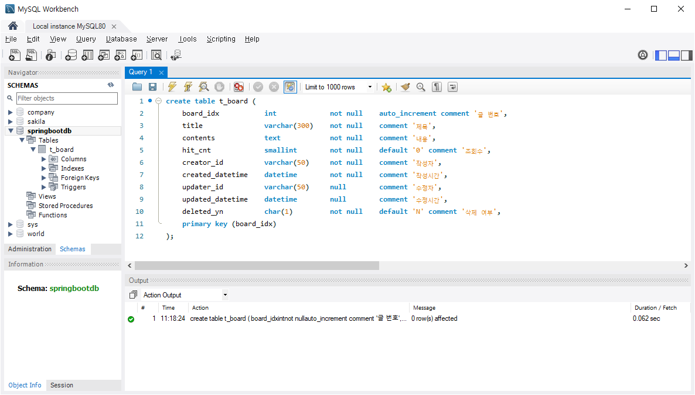
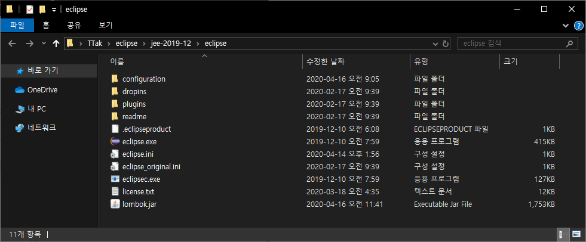
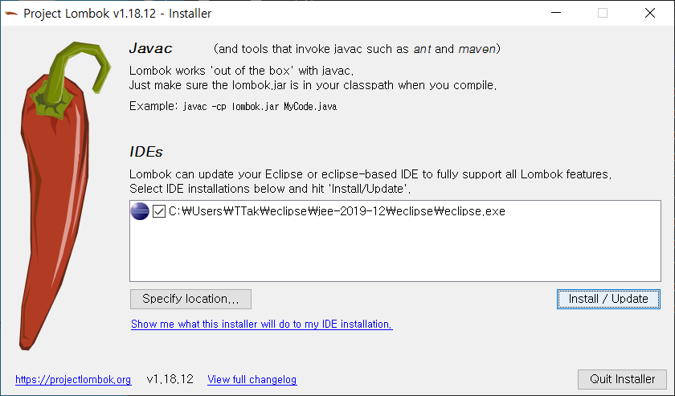
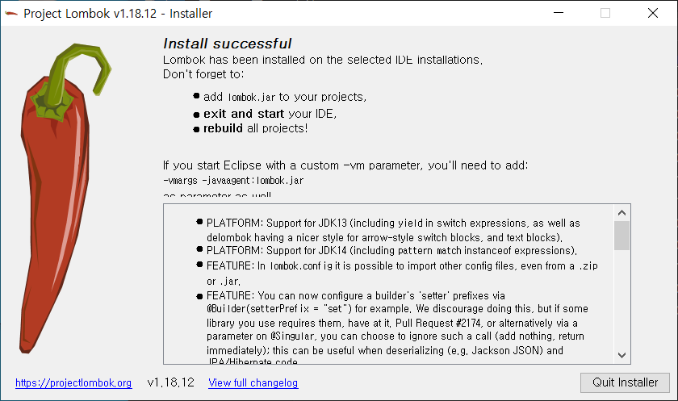
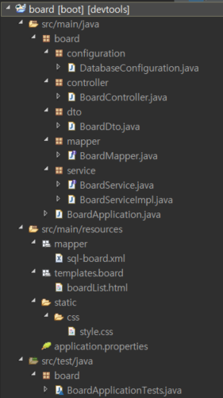
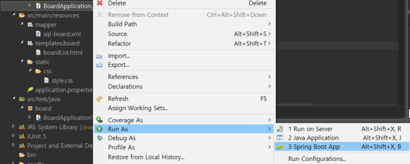
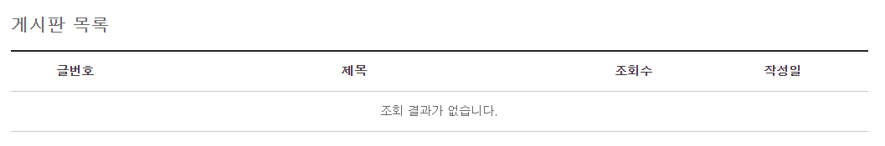
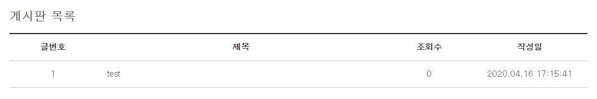

# Spring Boot

## 게시판 구현

### t_board 테이블 생성

MySQL Workbench 실행


```mysql
create table t_board (
	board_idx			int				not null	auto_increment comment '글 번호', 
	title				varchar(300)	not null	comment	'제목', 
	contents			text			not null	comment '내용', 
	hit_cnt				smallint		not null	default '0' comment '조회수',
	creator_id			varchar(50)		not null	comment '작성자', 
	created_datetime 	datetime		not null	comment '작성시간', 
	updater_id			varchar(50)		null		comment '수정자', 
	updated_datetime 	datetime		null		comment '수정시간', 
	deleted_yn			char(1)			not null 	default 'N' comment '삭제 여부', 
	primary key (board_idx)
);
```





### 스타일 시트 추가

css 폴더 생성

static 마우스 오른쪽 클릭 => New => Folder => css


style.css 파일 생성


/board/src/main/resources/static/css/style.css

```css
@CHARSET "UTF-8";

@import url(http://fonts.googleapis.com/earlyaccess/nanumgothic.css);

@import
	url(http://cdn.jsdelivr.net/font-nanum/1.0/nanumbarungothic/nanumbarungothic.css)
	;

html {
	overflow: scorll;
}

html, body, div, h1, h2, a, form, table, caption, thead, tbody, tr, th,
	td, submit {
	margin: 0;
	outline: 0;
	border: 0;
	padding: 0;
	font-size: 100%;
	vertical-align: baseline;
	background: transparent;
}

body {
	font-size: 0.875em;
	line-height: 1.5;
	color: #666;
	-webkit-text-size-adjust: none;
	min-width: 320px;
	font-family: 'NanumGothic', '나눔고딕', dotum, "Helvetica Neue", Helvetica,
		Verdana, Arial, Sans-Serief;
}

h1, h2, h3 {
	font-size: 1.5em;
}

p {
	margin: 0;
	padding: 0;
}

ul {
	margin: 0;
}

a:link, a:visited {
	text-decoration: none;
	color: #656565;
}

input {
	vertical-align: middle;
}

input:focus {
	outline: 0;
}

caption {
	display: none;
	width: 0;
	height: 0;
	margin-top: -1px;
	overflow: hidden;
	visibility: hidden;
	font-size: 0;
	line-height: 0;
}

.container {
	max-width: 1024px;
	margin: 30px auto;
}

.board_list {
	width: 100%;
	border-top: 2px solid #252525;
	border-bottom: 1px solid #ccc;
	margin: 15px 0;
	border-collapse: collapse;
}

.board_list thead th:first-child {
	background-image: none;
}

.board_list thead th {
	border-bottom: 1px solid #ccc;
	padding: 13px 0;
	color: #3b3a3a;
	text-align: center;
	vertical-align: middle;
}

.board_list tbody td {
	border-top: 1px solid #ccc;
	padding: 13px 0;
	text-align: center;
	vertical-align: middle;
}

.board_list tbody tr:first-child td {
	border: none;
}

.board_list tbody tr:hover {
	background: #ffff99;
}

.board_list tbody td.title {
	text-align: left;
	padding-left: 20px;
}

.board_list tbody td a {
	display: inline-block
}

.board_detail {
	width: 100%;
	border-top: 2px solid #252525;
	border-bottom: 1px solid #ccc;
	border-collapse: collapse;
}

.board_detail tbody input {
	width: 100%;
}

.board_detail tbody th {
	text-align: left;
	background: #f7f7f7;
	color: #3b3a3a;
	vertical-align: middle;
	text-align: center;
}

.board_detail tbody th, .board_detail tbody td {
	padding: 10px 15px;
	border-bottom: 1px solid #ccc;
}

.board_detail tbody textarea {
	width: 100%;
	min-height: 170px
}

.btn {
	margin: 5px;
	padding: 5px 11px;
	color: #fff !important;
	display: inline-block;
	background-color: #7D7F82;
	vertical-align: middle;
	border-radius: 0 !important;
	cursor: pointer;
	border: none;
}

.btn:hover {
	background: #6b9ab8;
}

.file_list a {
	display: inherit !important;
}
```


### 롬북(Lombok) 추가

자바 클래스를 만들 때 일반적으로 **흔히 만드는 코드**를 애노테이션을 이용해서 자동으로 만들어주는 라이브러리

getter/setter, toString, equals, hashCode, … 메서드


롬북 다운로드 후 이클립스 설치 폴더에 저장

https://projectlombok.org/download


C:\Users\TTak\eclipse\jee-2019-12\eclipse




lombok.jar 파일을 실행해서 설치

⇒ lombok.jar를 더블클릭 또는 명령어창 실행 후 해당 디렉터리에서 java -jar lombok.jar 명령 실행





Install / Update 클릭




Quit Installer


이클립스 종료 후 재실행


### DTO(Data Transfer Object) 생성

애플리케이션 내의 각 계층(뷰, 컨트롤러, 서비스, DAO, 데이터베이스 등) 간 데이터를 주고 받는데 사용하는 객체


/board/src/main/java/board/dto/BoardDto.java

```java
package board.dto;

import lombok.Data;

// t_board 테이블에 데이터를 넣고 빼고 할 때 사용할 객체
// => 테이블의 구조와 동일(또는 유사한) 형태의 자료 구조를 가져야 한다.
@Data
public class BoardDto {
	private int boardIdx;		// board_idx
	private String title; 		// title
	private String contents; 	// contents
	private int hitCnt; 		// hit_cnt		
	private String creatorId;	// creator_id	
	private String createdDatetime;
	private String updaterId;	
	private String updatedDatetime;
}
```


### MyBatis 설정

테이블의 컬럼명(Snake Expression)과 DTO 객체의 필터명(Camel Expression)을 자동으로 맵핑해 줄 수 있도록 설정


/board/src/main/resources/application.properties

```properties
		:
mybatis.configuration.map-underscore-to-camel-case=true
```


/board/src/main/java/board/configuration/DatabaseConfiguration.java

```java
package board.configuration;

import javax.sql.DataSource;

import org.apache.ibatis.session.SqlSessionFactory;
import org.mybatis.spring.SqlSessionFactoryBean;
import org.mybatis.spring.SqlSessionTemplate;
import org.springframework.beans.factory.annotation.Autowired;
import org.springframework.boot.context.properties.ConfigurationProperties;
import org.springframework.context.ApplicationContext;
import org.springframework.context.annotation.Bean;
import org.springframework.context.annotation.Configuration;
import org.springframework.context.annotation.PropertySource;

import com.zaxxer.hikari.HikariConfig;
import com.zaxxer.hikari.HikariDataSource;

@Configuration
@PropertySource("classpath:/application.properties")
public class DatabaseConfiguration {
	
	@Autowired
	private ApplicationContext applicationContext;

	@Bean
	@ConfigurationProperties(prefix = "spring.datasource.hikari")
	public HikariConfig hikariConfig() {
		return new HikariConfig();
	}

	@Bean
	public DataSource dataSource() throws Exception {
		DataSource dataSource = new HikariDataSource(hikariConfig());
		System.out.println(dataSource.toString());
		return dataSource;
	}
	
	@Bean
	public SqlSessionFactory sqlSessionFactory(DataSource dataSource) throws Exception {
		SqlSessionFactoryBean sqlSessionFactoryBean = new SqlSessionFactoryBean();
		sqlSessionFactoryBean.setDataSource(dataSource);
		sqlSessionFactoryBean.setMapperLocations(
			applicationContext.getResources("classpath:/mapper/**/sql-*.xml")
		);
		sqlSessionFactoryBean.setConfiguration(mybatisConfig());
		return sqlSessionFactoryBean.getObject();
	}
	
	@Bean
	public SqlSessionTemplate sqlSessionTemplate(SqlSessionFactory sqlSessionFactory) {
		return new SqlSessionTemplate(sqlSessionFactory);
	}
	
	@Bean
	@ConfigurationProperties(prefix = "mybatis.configuration")
	public org.apache.ibatis.session.Configuration mybatisConfig() {
		return new org.apache.ibatis.session.Configuration();		
	}
}
```


### 컨트롤러 생성

클라이언트의 요청이 들어오면 요청을 처리할 비즈니스 로직을 호출하고 그 결과를 포함하여 응답을 생성해 주는 역할을 수행

1. 컨트롤러 역할을 수행할 클래스에 @Controller 애노테이션을 추가
2. @RequestMapping 애노테이션을 이용해서 요청에 대한 주소를 지정
3. 요청 처리에 필요한 비즈니스 로직을 호출
4. 비즈니스 로직 실행 결과를 뷰로 반환


/board/src/main/java/board/controller/BoardController.java

```java
package board.controller;

import java.util.List;

import org.springframework.beans.factory.annotation.Autowired;
import org.springframework.stereotype.Controller;
import org.springframework.web.bind.annotation.RequestMapping;
import org.springframework.web.servlet.ModelAndView;

import board.dto.BoardDto;
import board.service.BoardService;

@Controller
public class BoardController {
	
	@Autowired
	private BoardService boardService;
	
	@RequestMapping("/board/openBoardList.do")
	public ModelAndView openBoardList() throws Exception {
		ModelAndView mv = new ModelAndView("/board/boardList");
		List<BoardDto> list = boardService.selectBoardList();
		mv.addObject("list", list);
		return mv;
	}
}
```


### 서비스 생성

인터페이스와 구현 클래스로 구성


인터페이스

/board/src/main/java/board/service/BoardService.java

```java
package board.service;

import java.util.List;

import board.dto.BoardDto;

public interface BoardService {

	// 게시판 목록 조회 기능을 정의
	List<BoardDto> selectBoardList() throws Exception; 
}
```


CRUD

Create, Read, Update, Delete

일반적으로 기본 인터페이스가 만들어진다.


구현 클래스

/board/src/main/java/board/service/BoardServiceImpl.java

```java
package board.service;

import java.util.List;

import org.springframework.beans.factory.annotation.Autowired;
import org.springframework.stereotype.Service;

import board.dto.BoardDto;
import board.mapper.BoardMapper;

@Service
public class BoardServiceImpl implements BoardService {

	@Autowired
	private BoardMapper boardMapper;
	
	@Override
	public List<BoardDto> selectBoardList() throws Exception {
		return boardMapper.selectBoardList();
	}
}
```

Service로 동작시키려면 @Service를 붙여야 한다.

@Service를 붙이면 Bean이 된다.


### 맵퍼 생성

MyBatis는 DAO를 만드는 것 보다는 SqlSessionDaoSupport 또는 SqlSessionTemplate 사용을 권장


인터페이스

/board/src/main/java/board/mapper/BoardMapper.java

```java
package board.mapper;

import java.util.List;

import org.apache.ibatis.annotations.Mapper;

import board.dto.BoardDto;

@Mapper
public interface BoardMapper {
	List<BoardDto> selectBoardList() throws Exception;
}
```


### SQL 작성

/board/src/main/resources/mapper/sql-board.xml

```xml
<?xml version="1.0" encoding="UTF-8"?>
<!DOCTYPE mapper PUBLIC "-//mybatis.org//DTD Mapper 3.0/EN" "http://mybatis.org/dtd/mybatis-3-mapper.dtd">

<mapper namespace="board.mapper.BoardMapper">
	<select id="selectBoardList" resultType="board.dto.BoardDto">
		<!-- CDATA 섹션 -->
		<![CDATA[
			select board_idx, title, hit_cnt, 
			date_format(created_datetime, '%Y.%m.%d %H:%i:%s') as created_datetime
			from t_board
			where deleted_yn = 'N'
			order by board_idx desc
		]]>
	</select>
</mapper>
```

CDATA 섹션 : xml에서의 특수 문자가 의미가 없도록 만들어준다. escape

xml은 >, <, ", ', & 과 같은 문자나 공백을 허용하지 않지만, `<![CDATA[` 를 발견하면 `]]>` 를 만날 때까지 parser는 HTML 태그를 단순 문자로 처리하게 하므로 HTML 태그나 자바스크립트 문자를 그대로 포함시킬 수 있다.


### 뷰 작성

/board/src/main/resources/templates/board/boardList.html

```jsp
<!DOCTYPE html>
<html lang="ko" xmlns:th="http://www.thymeleaf.org">
<head>
	<meta charset="UTF-8" />
	<title>게시판</title>
	<link rel="stylesheet" th:href="@{/css/style.css}"/>	
</head>
<body>
	<div class="container">
		<h2>게시판 목록</h2>
		<table class="board_list">
			<colgroup>
				<col width="15%"/>
				<col width="*"  />
				<col width="15%"/>
				<col width="20%"/>
			</colgroup>
			<thead>
				<tr>
					<th scope="col">글번호</th>
					<th scope="col">제목</th>
					<th scope="col">조회수</th>
					<th scope="col">작성일</th>
				</tr>
			</thead>
			<tbody>
				<tr th:if="${#lists.size(list)} > 0" th:each="list : ${list}">
					<td th:text="${list.boardIdx}"></td>
					<td class="title" th:text="${list.title}"></td>
					<td th:text="${list.hitCnt}"></td>
					<td th:text="${list.createdDatetime}"></td>
				</tr>
				<tr th:unless="${#lists.size(list)} > 0">
					<td colspan="4">조회 결과가 없습니다.</td>
				</tr>
			</tbody>		
		</table>
	</div>
</body>
</html>
```





### 실행




```
				:
2020-04-16 16:54:39.245  INFO 7184 --- [  restartedMain] o.s.b.d.a.OptionalLiveReloadServer       : LiveReload server is running on port 35729
2020-04-16 16:54:39.382  INFO 7184 --- [  restartedMain] o.s.b.w.embedded.tomcat.TomcatWebServer  : Tomcat started on port(s): 8080 (http) with context path ''
2020-04-16 16:54:39.391  INFO 7184 --- [  restartedMain] board.BoardApplication                   : Started BoardApplication in 10.93 seconds (JVM running for 13.574)
```


브라우저에서 http://localhost:8080/board/openBoardList.do 로 접속





MySQL Workbench를 이용해서 데이터를 추가 후 웹 페이지를 통해서 조회하면 목록이 출력

```mysql
insert into t_board (title, contents, creator_id, created_datetime)
values ('test', 'test', 'tester', now());
```





