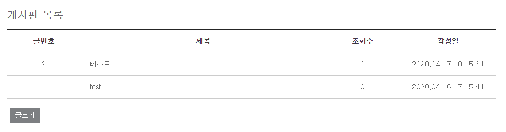

# Spring Boot

## 게시판 등록 기능 추가


등록은 컨트롤러가 2개가 되어야 한다.

글을 입력하는 것이 있고, 입력한 글을 저장하는 것이 있다.


### 게시판 글 쓰기 화면 생성

/board/src/main/resources/templates/board/boardWrite.html

```html
<!DOCTYPE html>
<html lang="ko" xmlns:th="http://www.thymeleaf.org">
<head>
	<meta charset="UTF-8" />
	<title>게시판</title>
	<link rel="stylesheet" th:href="@{/css/style.css}"/>	
</head>
<body>
	<div class="container">
		<h2>게시판 등록</h2>
		<form id="frm" name="frm" method="post" action="/board/insertBoard.do">
			<table class="board_detail">
			<tr>
				<td>제목</td>
				<td><input type="text" id="title" name="title"/></td>
			</tr>
			<tr>
				<td colspan="2"><textarea id="contents" name="contents"></textarea></td>
			</tr>				
			</table>
			<input type="submit" id="submit" value="저장" class="btn"/>
		</form>
	</div>
</body>
</html>
```


### 게시판 목록 페이지에 글쓰기 버튼을 추가

/board/src/main/resources/templates/board/boardList.html

```html
				:
			<tbody>
				<tr th:if="${#lists.size(list)} > 0" th:each="list : ${list}">
					<td th:text="${list.boardIdx}"></td>
					<td class="title" th:text="${list.title}"></td>
					<td th:text="${list.hitCnt}"></td>
					<td th:text="${list.createdDatetime}"></td>
				</tr>
				<tr th:unless="${#lists.size(list)} > 0">
					<td colspan="4">조회 결과가 없습니다.</td>
				</tr>
			</tbody>		
		</table>
		<a href="/board/openBoardWrite.do" class="btn">글쓰기</a>
	</div>
</body>
</html>
```


### 컨트롤러 추가

/board/src/main/java/board/controller/BoardController.java

```java
@Controller
public class BoardController {
	
	@Autowired
	private BoardService boardService;
	
	// 게시판 목록 조회
	@RequestMapping("/board/openBoardList.do")
	public ModelAndView openBoardList() throws Exception {
		ModelAndView mv = new ModelAndView("/board/boardList");
		List<BoardDto> list = boardService.selectBoardList();
		mv.addObject("list", list);
		return mv;
	}
	
	// 게시판 글쓰기 페이지를 제공하는 컨트롤러
	@RequestMapping("/board/openBoardWrite.do")
	public String openBoardWrite() throws Exception {
		return "/board/boardWrite";
	}
	
	// 게시판 내용을 저장하는 컨트롤러
	@RequestMapping("/board/insertBoard.do")
	public String insertBoard(BoardDto board) throws Exception {
		// TODO:
		// 사용자가 입력한 내용을 저장하는 서비스를 호출
		// 저장에 성공하면 게시판 목록 화면으로 리다이렉트
		return "redirect:/board/openBoardList.do";
	}
}
```


### 테스트

http://localhost:8080/board/openBoardList.do

게시판 목록 조회 → 글쓰기 버튼 클릭 → 게시판 글쓰기 페이지 → 글저장 버튼 클릭 → (글저장 기능은 미구현) → 게시판 목록 조회


### 게시판 글저장 SQL 작성

/board/src/main/resources/mapper/sql-board.xml

```xml
<?xml version="1.0" encoding="UTF-8"?>
<!DOCTYPE mapper PUBLIC "-//mybatis.org//DTD Mapper 3.0/EN" "http://mybatis.org/dtd/mybatis-3-mapper.dtd">

<mapper namespace="board.mapper.BoardMapper">
	<select id="selectBoardList" resultType="board.dto.BoardDto">
		<!-- CDATA 섹션 -->
		<![CDATA[
			select board_idx, title, hit_cnt, 
			date_format(created_datetime, '%Y.%m.%d %H:%i:%s') as created_datetime
			from t_board
			where deleted_yn = 'N'
			order by board_idx desc
		]]>
	</select>
	
	<insert id="insertBoard" parameterType="board.dto.BoardDto">
		<!-- 제목과 내용은 사용자가 입력값으로, 작성일시는 현재시간으로, 작성자는 'admin'으로 설정 -->
		insert into t_board (title, contents, created_datetime, creator_id)
		values (#{title}, #{contents}, now(), 'admin')
	</insert>
</mapper>
```

insert 쿼리 생성


### 게시판 글저장 Mapper 생성

/board/src/main/java/board/mapper/BoardMapper.java

```java
@Mapper
public interface BoardMapper {
	List<BoardDto> selectBoardList() throws Exception;
	void insertBoard(BoardDto board) throws Exception;
}
```


### 게시판 글저장 서비스 생성

/board/src/main/java/board/service/BoardService.java

```java
public interface BoardService {

	// 게시판 목록 조회 기능을 정의
	List<BoardDto> selectBoardList() throws Exception;
	
	// 게시판 글 저장 기능을 정의
	void insertBoard(BoardDto board) throws Exception;
}
```


/board/src/main/java/board/service/BoardServiceImpl.java

```java
@Service
public class BoardServiceImpl implements BoardService {

	@Autowired
	private BoardMapper boardMapper;
	
	@Override
	public List<BoardDto> selectBoardList() throws Exception {
		return boardMapper.selectBoardList();
	}
	
	@Override
	public void insertBoard(BoardDto board) throws Exception {
		boardMapper.insertBoard(board);
	}
}
```


### 컨트롤러에서 서비스를 호출

/board/src/main/java/board/controller/BoardController.java

```java
@Controller
public class BoardController {
	
	@Autowired
	private BoardService boardService;
	
	// 게시판 목록 조회
	@RequestMapping("/board/openBoardList.do")
	public ModelAndView openBoardList() throws Exception {
		ModelAndView mv = new ModelAndView("/board/boardList");
		List<BoardDto> list = boardService.selectBoardList();
		mv.addObject("list", list);
		return mv;
	}
	
	// 게시판 글쓰기 페이지를 제공하는 컨트롤러
	@RequestMapping("/board/openBoardWrite.do")
	public String openBoardWrite() throws Exception {
		return "/board/boardWrite";
	}
	
	// 게시판 내용을 저장하는 컨트롤러
	@RequestMapping("/board/insertBoard.do")
	public String insertBoard(BoardDto board) throws Exception {
		boardService.insertBoard(board);
		return "redirect:/board/openBoardList.do";
	}
}
```


### 게시판 글쓰기 테스트

http://localhost:8080/board/openBoardList.do




=> 글쓰기 버튼 클릭


=> 저장 버튼 클릭


## 게시글 상세 보기 기능 추가

### 게시글 상세 보기 페이지 생성

/board/src/main/resources/templates/board/boardDetail.html

```html
<!DOCTYPE html>
<html lang="ko" xmlns:th="http://www.thymeleaf.org">
<head>
	<meta charset="UTF-8" />
	<title>게시판</title>
	<link rel="stylesheet" th:href="@{/css/style.css}"/>	
</head>
<body>
	<div class="container">
		<h2>게시판 상세</h2>
		<table class="board_detail">
			<colgroup>
				<col width="15%"/>
				<col width="35%"/>
				<col width="15%"/>
				<col width="35%"/>
			</colgroup>
			<tbody>
				<tr>
					<th scope="row">글번호</th>
					<td th:text="${board.boardIdx}"></td>
					<th scope="row">조회수</th>
					<td th:text="${board.hitCnt}"></td>
				</tr>
				<tr>
					<th scope="row">작성자</th>
					<td th:text="${board.creatorId}"></td>
					<th scope="row">작성일</th>
					<td th:text="${board.createdDatetime}"></td>
				</tr>
				<tr>
					<th scope="row">제목</th>
					<td colspan="3">
						<input type="text" id="title" name="title" th:value="${board.title}" />
					</td>
				</tr>
				<tr>
					<td colspan="4">
						<textarea title="내용" id="contents" name="contents" th:text="${board.contents}"></textarea>
					</td>
				</tr>
			</tbody>		
		</table>
		<a href="/board/openBoardList.do" class="btn">목록으로</a>
	</div>
</body>
</html>
```


### 게시글 상세 보기 페이지 이동 링크 추가

/board/src/main/resources/templates/board/boardList.html

```html
				:
			<tbody>
				<tr th:if="${#lists.size(list)} > 0" th:each="list : ${list}">
					<td th:text="${list.boardIdx}"></td>
					<!--
					<td class="title" th:text="${list.title}"></td>
					-->
					<td class="title">
						<a href="/board/openBoardDetail.do?boardIdx=" 
							th:attrappend="href=${list.boardIdx}" th:text="${list.title}">
						</a>
					</td>
					<td th:text="${list.hitCnt}"></td>
					<td th:text="${list.createdDatetime}"></td>
				</tr>
				<tr th:unless="${#lists.size(list)} > 0">
					<td colspan="4">조회 결과가 없습니다.</td>
				</tr>
			</tbody>		
		</table>
		<a href="/board/openBoardWrite.do" class="btn">글쓰기</a>
	</div>
</body>
</html>
```


### 컨트롤러 추가

/board/src/main/java/board/controller/BoardController.java

```java
	@RequestMapping("/board/openBoardDetail.do")
	public ModelAndView openBoardDetail(@RequestParam int boardIdx) throws Exception {
		ModelAndView mv = new ModelAndView("/board/boardDetail");
		BoardDto board = boardService.selectBoardDetail(boardIdx);
		mv.addObject("board", board);
		return mv;
	}
```


### SQL 생성

/board/src/main/resources/mapper/sql-board.xml

```xml
	<select id="selectBoardDetail" parameterType="int" resultType="board.dto.BoardDto">
		select board_idx, title, contents, hit_cnt,
		date_format(created_datetime, '%Y.%m.%d %H:%i:%s') as created_datetime,
		creator_id
		from t_board
		where board_idx = ${boardIdx} and deleted_yn = 'N'
	</select>
```


### Mapper 생성

/board/src/main/java/board/mapper/BoardMapper.java

```java
@Mapper
public interface BoardMapper {
	List<BoardDto> selectBoardList() throws Exception;
	void insertBoard(BoardDto board) throws Exception;
	BoardDto selectBoardDetail(int boardIdx) throws Exception;
}
```


### 서비스 추가

/board/src/main/java/board/service/BoardService.java

```java
public interface BoardService {

	// 게시판 목록 조회 기능을 정의
	List<BoardDto> selectBoardList() throws Exception;
	
	// 게시판 글 저장 기능을 정의
	void insertBoard(BoardDto board) throws Exception;
	
	// 게시판 상세 보기 기능을 정의
	BoardDto selectBoardDetail(int boardIdx) throws Exception;
}
```


/board/src/main/java/board/service/BoardServiceImpl.java

```java
@Service
public class BoardServiceImpl implements BoardService {

	@Autowired
	private BoardMapper boardMapper;
	
	@Override
	public List<BoardDto> selectBoardList() throws Exception {
		return boardMapper.selectBoardList();
	}
	
	@Override
	public void insertBoard(BoardDto board) throws Exception {
		boardMapper.insertBoard(board);
	}
	
	@Override
	public BoardDto selectBoardDetail(int boardIdx) throws Exception {
		return boardMapper.selectBoardDetail(boardIdx);
	}
}
```


## 게시글 상세 보기를 요청하면 조회수가 증가하도록 수정

### 조회수 증가 쿼리 작성

/board/src/main/resources/mapper/sql-board.xml

```java
	<update id="updateHitCnt" parameterType="int">
		update t_board set hit_cnt = hit_cnt + 1 where board_idx = #{board_idx}
	</update>
```


### Mapper 작성

/board/src/main/java/board/mapper/BoardMapper.java

```java
	void updateHitCnt(int boardIdx) throws Exception;
```


### 게시글 상세 보기 서비스에 조회수 증가 기능을 추가

/board/src/main/java/board/service/BoardServiceImpl.java

```java
	@Override
	public BoardDto selectBoardDetail(int boardIdx) throws Exception {
		boardMapper.updateHitCnt(boardIdx);
		return boardMapper.selectBoardDetail(boardIdx);
	}
```


## 게시글 내용 수정 및 삭제 기능 추가

|      |             |           | 화면 여부 | 처리 로직 |                                                              |
| ---- | ----------- | --------- | --------- | --------- | ------------------------------------------------------------ |
| C    | 데이터 생성 |           | O         |           |                                                              |
|      |             |           |           | O         |                                                              |
| R    | 데이터 조회 | 목록 조회 | O         | O         |                                                              |
|      |             | 상세 조회 | O         | O         |                                                              |
| U    | 데이터 수정 |           | △         | O         | `있는 경우` → 수정 화면을 별도로 구성 / `없는 경우` → 상세 조회 화면을 이용 |
| D    | 데이터 삭제 |           |           | O         |                                                              |


원에서 원으로 가는 것 : redirect


### 상세 화면 수정

/board/src/main/resources/templates/board/boardDetail.html

```html
<!DOCTYPE html>
<html lang="ko" xmlns:th="http://www.thymeleaf.org">
<head>
	<meta charset="UTF-8" />
	<title>게시판</title>
	<link rel="stylesheet" th:href="@{/css/style.css}"/>	
</head>
<body>
	<div class="container">
		<h2>게시판 상세</h2>
		<form id="frm" name="frm" method="post" action="">
			<input type="hidden" name="boardIdx" th:value="${board.boardIdx}"/>
			<table class="board_detail">
				<colgroup>
					<col width="15%"/>
					<col width="35%"/>
					<col width="15%"/>
					<col width="35%"/>
				</colgroup>
				<tbody>
					<tr>
						<th scope="row">글번호</th>
						<td th:text="${board.boardIdx}"></td>
						<th scope="row">조회수</th>
						<td th:text="${board.hitCnt}"></td>
					</tr>
					<tr>
						<th scope="row">작성자</th>
						<td th:text="${board.creatorId}"></td>
						<th scope="row">작성일</th>
						<td th:text="${board.createdDatetime}"></td>
					</tr>
					<tr>
						<th scope="row">제목</th>
						<td colspan="3">
							<input type="text" id="title" name="title" th:value="${board.title}" />
						</td>
					</tr>
					<tr>
						<td colspan="4">
							<textarea title="내용" id="contents" name="contents" th:text="${board.contents}"></textarea>
						</td>
					</tr>
				</tbody>		
			</table>
		</form>
		<!--
		<a href="/board/openBoardList.do" class="btn">목록으로</a>
		-->
		
		<input type="button" id="list" class="btn" value="목록으로"/>
		<input type="button" id="update" class="btn" value="수정하기"/>
		<input type="button" id="delete" class="btn" value="삭제하기"/>
		
		<script src="https://code.jquery.com/jquery-3.4.1.min.js"></script>
		<script>
			$(function() {
				$('#list').on('click', function() {
					location.href = 'openBoardList.do';
				});
				$('#update').on('click', function() {
					let frm = $('#frm')[0];
					frm.action = 'updateBoard.do';
					frm.submit();
				});
				$('#delete').on('click', function() {
					let frm = $('#frm')[0];
					frm.action = 'deleteBoard.do';
					frm.submit();
				});
			});	
		</script>
	</div>
</body>
</html>
```


### 수정 및 삭제 쿼리 작성

/board/src/main/resources/mapper/sql-board.xml

```xml
	<update id="updateBoard" parameterType="board.dto.BoardDto">
		update t_board set title = #{title}, contents = #{contents}, 
		updated_datetime = now(), updater_id = 'admin'
		where board_idx = #{boardIdx}  	
	</update>
	
	<!-- 실제 데이터(레코드)를 삭제하는 것이 아니라 삭제되었다고만 표시 -->
	<delete id="deleteBoard" parameterType="int">
		update t_board set deleted_yn = 'Y',
		updated_datetime = now(), updater_id = 'admin'
		where board_idx = #{boardIdx}
	</delete>
```


### 수정 및 삭제 Mapper 생성

/board/src/main/java/board/mapper/BoardMapper.java

```java
@Mapper
public interface BoardMapper {
	List<BoardDto> selectBoardList() throws Exception;
	void insertBoard(BoardDto board) throws Exception;
	BoardDto selectBoardDetail(int boardIdx) throws Exception;
	void updateHitCnt(int boardIdx) throws Exception;
	void updateBoard(BoardDto board) throws Exception;
	void deleteBoard(int boardIdx) throws Exception;
}
```


### 수정 및 삭제 서비스 생성

/board/src/main/java/board/service/BoardService.java

```java
public interface BoardService {
	List<BoardDto> selectBoardList() throws Exception;
	void insertBoard(BoardDto board) throws Exception;
	BoardDto selectBoardDetail(int boardIdx) throws Exception;
	void updateBoard(BoardDto board) throws Exception;
	void deleteBoard(int boardIdx) throws Exception;
}
```


/board/src/main/java/board/service/BoardServiceImpl.java

```java
	@Override
	public void updateBoard(BoardDto board) throws Exception {
		boardMapper.updateBoard(board);	
	}

	@Override
	public void deleteBoard(int boardIdx) throws Exception {
		boardMapper.deleteBoard(boardIdx);
	}
```


### 수정 및 삭제 컨트롤러 작성

/board/src/main/java/board/controller/BoardController.java

```java
	@RequestMapping("/board/updateBoard.do")
	public String updateBoard(BoardDto board) throws Exception {
		boardService.updateBoard(board);
		return "redirect:/board/openBoardList.do";
	}
	
	@RequestMapping("/board/deleteBoard.do")
	public String deleteBoard(int boardIdx) throws Exception {
		boardService.deleteBoard(boardIdx);
		return "redirect:/board/openBoardList.do";
	}
```


## Logback

* Log4j를 기반으로 작성
* Log4j 대시 10배 정도 빠르고 메모리 사용량도 적음
* 로그 설정 변경 시 재시작 없이 바로 반영


스프링 부트는 자체적으로 log4j2, logback 등의 로깅 API를 제공


### logback 설정


/board/src/main/resources/logback-spring.xml

```xml
<?xml version="1.0" encoding="UTF-8" ?>
<configuration debug="true">
	<!--
		appender : 로그 출력 위치 (콘솔, 파일, DB 등) 
		encoder  : 로그 출력 형식
	-->
	<appender name="console" class="ch.qos.logback.core.ConsoleAppender">
		<encoder>
			<Pattern>%d %5p [%c] %m%n</Pattern>
		</encoder>
	</appender>
	
	<appender name="console-infolog" class="ch.qos.logback.core.ConsoleAppender">
		<encoder>
			<Pattern>%d %5p %m%n</Pattern>
		</encoder>
	</appender>
	
	<!--
		logger : 로그를 출력하는 요소
		         level 속성을 통해서 출력할 로그의 레벨을 조절하여 appender에 전달
	-->
	<logger name="board" level="DEBUG" appender-ref="console" />
	
	<!-- root logger -->
	<root level="off">
		<appender-ref ref="console" />
	</root>	
</configuration>
```


logback에서 사용하는 로그 레벨

trace → debug → info → warn → error

```java
log.trace( ... );
log.debug( ... );
```


level="DEBUG" 설정 시 debug 이상 레벨이 출력된다.


/board/src/main/java/board/controller/BoardController.java

```java
import org.slf4j.Logger;
import org.slf4j.LoggerFactory;
import org.springframework.beans.factory.annotation.Autowired;
import org.springframework.stereotype.Controller;
import org.springframework.web.bind.annotation.RequestMapping;
import org.springframework.web.bind.annotation.RequestParam;
import org.springframework.web.servlet.ModelAndView;

import board.dto.BoardDto;
import board.service.BoardService;

@Controller
public class BoardController {
	
	private Logger log = LoggerFactory.getLogger(this.getClass());
	
	@Autowired
	private BoardService boardService;
	
	// 게시판 목록 조회
	@RequestMapping("/board/openBoardList.do")
	public ModelAndView openBoardList() throws Exception {
		log.trace("추적");
		log.debug("디버그");
		log.info("정보");
		log.warn("경고");
		log.error("오류");
		ModelAndView mv = new ModelAndView("/board/boardList");
		List<BoardDto> list = boardService.selectBoardList();
		mv.addObject("list", list);
		return mv;
	}
    			:
```


```
				:
2020-04-17 17:35:51,068 DEBUG [board.controller.BoardController] 디버그
2020-04-17 17:35:51,068  INFO [board.controller.BoardController] 정보
2020-04-17 17:35:51,068  WARN [board.controller.BoardController] 경고
2020-04-17 17:35:51,068 ERROR [board.controller.BoardController] 오류
				:
```


Lombok을 사용할 경우 @Slf4j 애노테이션을 사용면 로거를 따로 생성할 필요가 없음

```java
import org.springframework.beans.factory.annotation.Autowired;
import org.springframework.stereotype.Controller;
import org.springframework.web.bind.annotation.RequestMapping;
import org.springframework.web.bind.annotation.RequestParam;
import org.springframework.web.servlet.ModelAndView;

import board.dto.BoardDto;
import board.service.BoardService;
import lombok.extern.slf4j.Slf4j;

@Slf4j
@Controller
public class BoardController {
	
	@Autowired
	private BoardService boardService;
	
	// 게시판 목록 조회
	@RequestMapping("/board/openBoardList.do")
	public ModelAndView openBoardList() throws Exception {
		log.trace("추적");
		log.debug("디버그");
		log.info("정보");
		log.warn("경고");
		log.error("오류");
		ModelAndView mv = new ModelAndView("/board/boardList");
		List<BoardDto> list = boardService.selectBoardList();
		mv.addObject("list", list);
		return mv;
	}
    			:
```


### Log4JDBC

JDBC Proxy driver for logging SQL and other interesting information


쿼리와 관련한 로그가 읽기 어렵게 출력되고 있음

```
2020-04-17 17:42:28,305 DEBUG [board.mapper.BoardMapper.updateHitCnt] ==>  Preparing: update t_board set hit_cnt = hit_cnt + 1 where board_idx = ? 
2020-04-17 17:42:28,308 DEBUG [board.mapper.BoardMapper.updateHitCnt] ==> Parameters: 4(Integer)
2020-04-17 17:42:28,319 DEBUG [board.mapper.BoardMapper.updateHitCnt] <==    Updates: 1
2020-04-17 17:42:28,347 DEBUG [board.mapper.BoardMapper.selectBoardDetail] ==>  Preparing: select board_idx, title, contents, hit_cnt, date_format(created_datetime, '%Y.%m.%d %H:%i:%s') as created_datetime, creator_id from t_board where board_idx = 4 and deleted_yn = 'N' 
2020-04-17 17:42:28,347 DEBUG [board.mapper.BoardMapper.selectBoardDetail] ==> Parameters: 
2020-04-17 17:42:28,352 DEBUG [board.mapper.BoardMapper.selectBoardDetail] <==      Total: 1
2020-04-17 17:42:38,726 DEBUG [board.mapper.BoardMapper.updateBoard] ==>  Preparing: update t_board set title = ?, contents = ?, updated_datetime = now(), updater_id = 'admin' where board_idx = ? 
2020-04-17 17:42:38,727 DEBUG [board.mapper.BoardMapper.updateBoard] ==> Parameters: test(String), test(String), 4(Integer)
2020-04-17 17:42:38,733 DEBUG [board.mapper.BoardMapper.updateBoard] <==    Updates: 1
```


### 라이브러리를 추가

build.gradle

```gradle
		:
dependencies {
	implementation 'org.springframework.boot:spring-boot-starter-data-jpa'
	implementation 'org.springframework.boot:spring-boot-starter-thymeleaf'
	implementation 'org.springframework.boot:spring-boot-starter-web'
	implementation 'org.mybatis.spring.boot:mybatis-spring-boot-starter:2.1.2'
	compileOnly 'org.projectlombok:lombok'
	developmentOnly 'org.springframework.boot:spring-boot-devtools'
	runtimeOnly 'mysql:mysql-connector-java'
	annotationProcessor 'org.springframework.boot:spring-boot-configuration-processor'
	annotationProcessor 'org.projectlombok:lombok'
	testImplementation('org.springframework.boot:spring-boot-starter-test') {
		exclude group: 'org.junit.vintage', module: 'junit-vintage-engine'
	}
	
	compile 'org.bgee.log4jdbc-log4j2:log4jdbc-log4j2-jdbc4.1:1.16'
}
		:
```


### log4jdbc 설정

/board/src/main/resources/log4jdbc.log4j2.properties

```properties
log4jdbc.spylogdelegator.name = net.sf.log4jdbc.log.slf4j.Slf4jSpyLogDelegator
log4jdbc.dump.sql.maxlinelength = 0
```


### application.properties 설정

/board/src/main/resources/application.properties

```properties
#spring.datasource.hikari.driver-class-name=com.mysql.cj.jdbc.Driver
#spring.datasource.hikari.jdbc-url=jdbc:mysql://localhost:3306/springbootdb?useUnicode=true&characterEncoding=utf-8&serverTimezone=Asia/Seoul

spring.datasource.hikari.driver-class-name=net.sf.log4jdbc.sql.jdbcapi.DriverSpy
spring.datasource.hikari.jdbc-url=jdbc:log4jdbc:mysql://localhost:3306/springbootdb?useUnicode=true&characterEncoding=utf-8&serverTimezone=Asia/Seoul

spring.datasource.hikari.username=root
spring.datasource.hikari.password=root
spring.datasource.hikari.connection-test-query=select 1

mybatis.configuration.map-underscore-to-camel-case=true
```


### logback-spring.xml 설정

```xml
<?xml version="1.0" encoding="UTF-8" ?>
<configuration debug="true">
	<!--
		appender : 로그 출력 위치 (콘솔, 파일, DB 등) 
		encoder  : 로그 출력 형식
	-->
	<appender name="console" class="ch.qos.logback.core.ConsoleAppender">
		<encoder>
			<Pattern>%d %5p [%c] %m%n</Pattern>
		</encoder>
	</appender>
	
	<appender name="console-infolog" class="ch.qos.logback.core.ConsoleAppender">
		<encoder>
			<Pattern>%d %5p %m%n</Pattern>
		</encoder>
	</appender>
	
	<!--
		logger : 로그를 출력하는 요소
		         level 속성을 통해서 출력할 로그의 레벨을 조절하여 appender에 전달
	-->
	<logger name="board" level="DEBUG" appender-ref="console" />
	<logger name="jdbc.sqlonly" level="INFO" appender-ref="console-infolog" />
	<logger name="jdbc.resultsettable" level="INFO" appender-ref="console-infolog" />

	<!-- root logger -->
	<root level="off">
		<appender-ref ref="console" />
	</root>	
</configuration>
```

