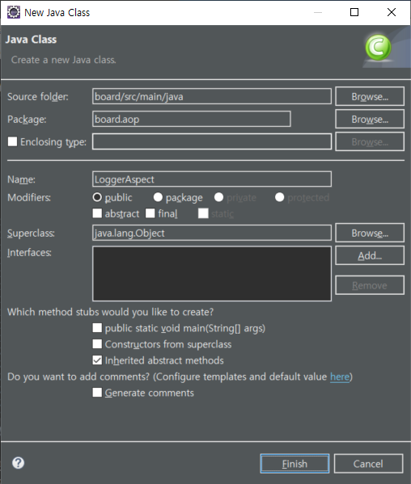

# Spring Boot

## 인터셉터(interceptor)


Filter = Servlet Filter ⇒ J2EE 표준 스펙에 포함

Interceptor ⇒ 스프링 프레임워크에서 제공하는 기능 → 스프링 부트에서도 사용 가능


HandlerInterceptorAdapter

⇒ 스프링에서 인터셉터를 구현할 때 사용

* preHandle - 컨트롤러 실행 전에 수행
* postHandle - 컨트롤러 수행 후 결과를 뷰로 내보내기 전에 수행
* afterCompletion - 뷰 작업까지 완료된 후 수행


### 요청의 시작과 끝을 보여주는 로그를 출력하는 인터셉터를 작성

/board/src/main/java/board/LoggerInterceptor.java

```java
package board;

import javax.servlet.http.HttpServletRequest;
import javax.servlet.http.HttpServletResponse;

import org.springframework.lang.Nullable;
import org.springframework.web.servlet.ModelAndView;
import org.springframework.web.servlet.handler.HandlerInterceptorAdapter;

import lombok.extern.slf4j.Slf4j;

@Slf4j
public class LoggerInterceptor extends HandlerInterceptorAdapter {
	
	// 해당 컨트롤러 실행 전 로그를 출력
	@Override
	public boolean preHandle(HttpServletRequest request, HttpServletResponse response, Object handler) throws Exception {
		log.debug("=============== START ===============");
		log.debug(" Request URI : " + request.getRequestURI());
		return super.preHandle(request, response, handler);
	}

	// 해당 컨트롤러 실행 후 로그를 출력
	@Override
	public void postHandle(HttpServletRequest request, HttpServletResponse response, Object handler, @Nullable ModelAndView modelAndView) throws Exception {
		log.debug("===============  END  ===============");
		super.postHandle(request, response, handler, modelAndView);
	}
}
```


### 인터셉터를 등록

스프링 4.0 이상에서는 자바 기반의 설정을 지원


/board/src/main/java/board/configuration/WebMvcConfiguration.java

```java
package board.configuration;

import org.springframework.context.annotation.Configuration;
import org.springframework.web.servlet.config.annotation.InterceptorRegistry;
import org.springframework.web.servlet.config.annotation.WebMvcConfigurer;

import board.LoggerInterceptor;

@Configuration
public class WebMvcConfiguration implements WebMvcConfigurer {
	
	@Override
	public void addInterceptors(InterceptorRegistry registry) {
		registry.addInterceptor(new LoggerInterceptor());
	}
}
```


### 실행

```
2020-04-20 11:42:09,424 DEBUG [board.LoggerInterceptor] =============== START ===============
2020-04-20 11:42:09,424 DEBUG [board.LoggerInterceptor]  Request URI : /board/openBoardList.do
				:
2020-04-20 11:42:09,669 DEBUG [board.LoggerInterceptor] ===============  END  ===============
```


어떤 요청이 들어와서 언제 끝났는지 확인 가능

요청의 시작과 끝을 구분짓기 위해 인터셉터를 쓸 수 있다.

공통적으로 일괄되게 기능들을 인터셉터를 통해서 넣었다.


## AOP(Aspect Oriented Programming)

애플리케이션 전반에서 사용되는 기능을 여러 코드에 쉽게 적용할 수 있도록 하는 것


횡단 관심사


### 컨트롤러, 서비스, 매퍼의 메서드가 실행될 때 각 메서드의 경로와 이름을 로그로 출력





/board/src/main/java/board/aop/LoggerAspect.java

```java
package board.aop;

import org.aspectj.lang.ProceedingJoinPoint;
import org.aspectj.lang.annotation.Around;
import org.aspectj.lang.annotation.Aspect;
import org.springframework.stereotype.Component;

import lombok.extern.slf4j.Slf4j;

@Component
@Aspect
@Slf4j
public class LoggerAspect {
	
	// 호출된 메서드의 종류(Controller, Service, Mapper)를 구분하고 
	// 메서드의 정보를 로그로 출력
	@Around("execution(* board..controller.*Controller.*(..)) or execution(* board..service.*Impl.*(..)) or execution(* board..mapper.*Mapper.*(..))")
	public Object logPrin(ProceedingJoinPoint joinPoint) throws Throwable {
		String type = "";
		String name = joinPoint.getSignature().getDeclaringTypeName(); // 메서드가 포함된 클래스 이름
		if (name.indexOf("Controller") > -1) {
			type = "Controller";
		} else if (name.indexOf("Service") > -1) {
			type = "Serivce";
		} else if (name.indexOf("Mapper") > -1) {
			type = "Mapper";
		}
		
		log.debug(type + " : " + name + "." + joinPoint.getSignature().getName() + "()");
		// 종류 : 패키지+클래스.메서드()
		
		return joinPoint.proceed();
	}
}
```


```
2020-04-20 13:53:20,110  INFO [board.BoardApplication] Started BoardApplication in 1.447 seconds (JVM running for 57.599)
2020-04-20 13:54:36,551 DEBUG [board.LoggerInterceptor] =============== START ===============
2020-04-20 13:54:36,552 DEBUG [board.LoggerInterceptor]  Request URI : /board/openBoardList.do
2020-04-20 13:54:36,560 DEBUG [board.aop.LoggerAspect] Controller : board.controller.BoardController.openBoardList()
2020-04-20 13:54:36,565 DEBUG [board.controller.BoardController] 디버그
2020-04-20 13:54:36,565  INFO [board.controller.BoardController] 정보
2020-04-20 13:54:36,565  WARN [board.controller.BoardController] 경고
2020-04-20 13:54:36,565 ERROR [board.controller.BoardController] 오류
2020-04-20 13:54:36,566 DEBUG [board.aop.LoggerAspect] Serivce : board.service.BoardServiceImpl.selectBoardList()
2020-04-20 13:54:36,570 DEBUG [board.aop.LoggerAspect] Mapper : board.mapper.BoardMapper.selectBoardList()
2020-04-20 13:54:36,571  INFO [jdbc.sqlonly] select 1

2020-04-20 13:54:36,573 DEBUG [jdbc.sqltiming]  com.zaxxer.hikari.pool.PoolBase.isConnectionAlive(PoolBase.java:165)
41. select 1
 {executed in 2 msec}
2020-04-20 13:54:36,574 DEBUG [board.mapper.BoardMapper.selectBoardList] ==>  Preparing: select board_idx, title, hit_cnt, date_format(created_datetime, '%Y.%m.%d %H:%i:%s') as created_datetime from t_board where deleted_yn = 'N' order by board_idx desc 
2020-04-20 13:54:36,575 DEBUG [board.mapper.BoardMapper.selectBoardList] ==> Parameters: 
2020-04-20 13:54:36,575  INFO [jdbc.sqlonly] select board_idx, title, hit_cnt, 
			date_format(created_datetime, '%Y.%m.%d %H:%i:%s') as created_datetime
			from t_board
			where deleted_yn = 'N'
			order by board_idx desc

2020-04-20 13:54:36,583 DEBUG [jdbc.sqltiming]  com.zaxxer.hikari.pool.ProxyPreparedStatement.execute(ProxyPreparedStatement.java:44)
41. select board_idx, title, hit_cnt, 
			date_format(created_datetime, '%Y.%m.%d %H:%i:%s') as created_datetime
			from t_board
			where deleted_yn = 'N'
			order by board_idx desc
 {executed in 7 msec}
2020-04-20 13:54:36,587  INFO [jdbc.resultsettable] 
|----------|-------|--------|--------------------|
|board_idx |title  |hit_cnt |created_datetime    |
|----------|-------|--------|--------------------|
|5         |제목입니다. |0       |2020.04.20 10:52:32 |
|4         |test   |2       |2020.04.17 17:06:20 |
|3         |tested |9       |2020.04.17 10:22:24 |
|2         |test   |5       |2020.04.17 10:15:31 |
|1         |tester |2       |2020.04.16 17:15:41 |
|----------|-------|--------|--------------------|

2020-04-20 13:54:36,587 DEBUG [board.mapper.BoardMapper.selectBoardList] <==      Total: 5
2020-04-20 13:54:36,588 DEBUG [board.LoggerInterceptor] ===============  END  ===============
2020-04-20 13:54:36,686 DEBUG [board.LoggerInterceptor] =============== START ===============
2020-04-20 13:54:36,686 DEBUG [board.LoggerInterceptor]  Request URI : /css/style.css
2020-04-20 13:54:36,695 DEBUG [board.LoggerInterceptor] ===============  END  ===============
```


## 트랜잭션 적용하기

데이터베이스의 상태를 변화시킬 때 더 이상 분리할 수 없는 작업의 단위를 의미


### 트랜잭션이 적용되지 않을 경우

/board/src/main/java/board/service/BoardServiceImpl.java

```java
	@Override
	public BoardDto selectBoardDetail(int boardIdx) throws Exception {
		boardMapper.updateHitCnt(boardIdx);	// 조회수를 증가
		System.out.println(99 / 0);			// 숫자를 0으로 나누면 오류가 발생 => (아랫쪽 코드) 게시판 조회는 수행되지 않음
		return boardMapper.selectBoardDetail(boardIdx);
	}
```

게시판 목록 조회 → (조회수 확인) → 게시판 상세 조회 → 게시판 목록 조회 → (조회수 확인)


게시판 상세 조회가 수행되지 않았지만 조회수가 증가함


### @Transactional 애노테이션을 이용한 트랜잭션 설정

/board/src/main/java/board/configuration/DatabaseConfiguration.java

```java
package board.configuration;

import javax.sql.DataSource;

import org.apache.ibatis.session.SqlSessionFactory;
import org.mybatis.spring.SqlSessionFactoryBean;
import org.mybatis.spring.SqlSessionTemplate;
import org.springframework.beans.factory.annotation.Autowired;
import org.springframework.boot.context.properties.ConfigurationProperties;
import org.springframework.context.ApplicationContext;
import org.springframework.context.annotation.Bean;
import org.springframework.context.annotation.Configuration;
import org.springframework.context.annotation.PropertySource;
import org.springframework.jdbc.datasource.DataSourceTransactionManager;
import org.springframework.transaction.PlatformTransactionManager;
import org.springframework.transaction.annotation.EnableTransactionManagement;

import com.zaxxer.hikari.HikariConfig;
import com.zaxxer.hikari.HikariDataSource;

@Configuration
@PropertySource("classpath:/application.properties")
@EnableTransactionManagement
public class DatabaseConfiguration {
			:
	@Bean
	public PlatformTransactionManager transactionManager() throws Exception {
		return new DataSourceTransactionManager(dataSource());
	}
    		:
}
```

@EnableTransactionManagement 추가

Bean 생성


/board/src/main/java/board/service/BoardServiceImpl.java

```java
package board.service;

import java.util.List;

import org.springframework.beans.factory.annotation.Autowired;
import org.springframework.stereotype.Service;
import org.springframework.transaction.annotation.Transactional;

import board.dto.BoardDto;
import board.mapper.BoardMapper;

@Service
@Transactional
public class BoardServiceImpl implements BoardService {
    		:
}
```

게시판 목록 조회 → (조회수 확인) → 게시판 상세 조회 → 게시판 목록 조회 → (조회수 확인)

⇒ 하나의 트랜잭션으로 묶여있는 처리 중 일부에서 오류가 발생했기 때문에 모든 처리가 원상 복귀됨(rollback)


### AOP를 이용한 트랜잭션 설정

/board/src/main/java/board/aop/TransactionAspect.java

```java
package board.aop;

import java.util.Collections;

import org.springframework.aop.Advisor;
import org.springframework.aop.aspectj.AspectJExpressionPointcut;
import org.springframework.aop.support.DefaultPointcutAdvisor;
import org.springframework.beans.factory.annotation.Autowired;
import org.springframework.context.annotation.Bean;
import org.springframework.context.annotation.Configuration;
import org.springframework.transaction.PlatformTransactionManager;
import org.springframework.transaction.interceptor.MatchAlwaysTransactionAttributeSource;
import org.springframework.transaction.interceptor.RollbackRuleAttribute;
import org.springframework.transaction.interceptor.RuleBasedTransactionAttribute;
import org.springframework.transaction.interceptor.TransactionInterceptor;

@Configuration
public class TransactionAspect {

	private static final String AOP_TRANSACTION_METHOD_NAME = "*";
	private static final String AOP_TRANSACTION_EXPRESSION = "execution(* board..service.*Impl.*(..))";
	
	@Autowired
	private PlatformTransactionManager transactionManager;
	
	@Bean
	public TransactionInterceptor transactionAdvice() {
		MatchAlwaysTransactionAttributeSource source = new MatchAlwaysTransactionAttributeSource();
		RuleBasedTransactionAttribute transactionAttribute = new RuleBasedTransactionAttribute();
		// 트랜잭션 이름을 설정 -> 트랜잭션 모니터링에서 트랜잭션 이름으로 확인이 가능
		transactionAttribute.setName(AOP_TRANSACTION_METHOD_NAME);
		// 롤백 룰을 설정 -> 예외가 발생하면 롤백을 수행하도록 지정
		transactionAttribute.setRollbackRules(Collections.singletonList(new RollbackRuleAttribute(Exception.class)));
		source.setTransactionAttribute(transactionAttribute);
		return new TransactionInterceptor(transactionManager, source);
	}
	
	@Bean
	public Advisor transactionAdviceAdivisor() {
		AspectJExpressionPointcut pointcut = new AspectJExpressionPointcut();
		pointcut.setExpression(AOP_TRANSACTION_EXPRESSION);
		return new DefaultPointcutAdvisor(pointcut, transactionAdvice());		
	}
}
```


### @Transactional 애노테이션을 주석 처리 후 테스트 실행

/board/src/main/java/board/service/BoardServiceImpl.java

```java
package board.service;

import java.util.List;

import org.springframework.beans.factory.annotation.Autowired;
import org.springframework.stereotype.Service;
import org.springframework.transaction.annotation.Transactional;

import board.dto.BoardDto;
import board.mapper.BoardMapper;

@Service
// @Transactional
public class BoardServiceImpl implements BoardService {
    		:
}
```

게시판 목록 조회 → (조회수 확인) → 게시판 상세 조회 → 게시판 목록 조회 → (조회수 확인)


### @Transactional vs AOP

|                | 장점                                                         | 단점                                                         |
| -------------- | ------------------------------------------------------------ | ------------------------------------------------------------ |
| @Transactional | 쉽다. 원하는 곳에만 트랜잭션 적용이 가능                     | (개발자의 실수로) 누락될 수 있다. 외부 라이브러리에 적용이 불가능하다. |
| AOP            | 공통으로 적용되므로 누락 발생하지 않음. 외부 라이브러리에도 동일하게 적용이 가능 | 성능에 영향을 미칠 수 있다. 원하는 곳에만 적용하기 힘들다.   |


## 예외처리

1. try / catch
2. 컨트롤러 단에서 @ExceptionHandler 애노테이션을 이용
3. @ControllerAdvice를 이용한 전역 예외처리


/board/src/main/java/board/common/ExceptionHandler.java

```java
package board.common;

import javax.servlet.http.HttpServletRequest;

import org.springframework.web.bind.annotation.ControllerAdvice;
import org.springframework.web.servlet.ModelAndView;

import lombok.extern.slf4j.Slf4j;

@Slf4j
// 해당 클래스가 예외처리 클래스임을 알려줌
// - 스프링 3.2에 추가된 애노테이션
// - 스프링 부트 2.0에서는 @ControllerAdvice 애노테이션만 사용하면 추가 설정 없이 쉽게 예외 처리가 가능
@ControllerAdvice
public class ExceptionHandler {

	// 해당 메서드에서 처리할 예외를 지정
	@org.springframework.web.bind.annotation.ExceptionHandler(Exception.class)
	public ModelAndView defaultExceptionHandler(HttpServletRequest request, Exception exception) {
		ModelAndView mv = new ModelAndView("/error/error_default");
		mv.addObject("exception", exception);
		
		log.error("exception", exception);
		
		return mv;		
	}
}
```

어떤 Exception에서 처리할 지 정해줘야 한다.


/board/src/main/resources/templates/error/error_default.html

```html
<!DOCTYPE html>
<html lang="ko" xmlns:th="http://www.thymeleaf.org">
<head>
	<meta charset="UTF-8"/>
	<title>공통 에러 페이지</title>
	<link rel="stylesheet" th:href="@{/css/style.css}"/>
</head>
<body>
	<p>공통 에러 페이지</p>
	<p th:text="${exception}"></p>
	<ul th:each="list : ${exception.getStackTrace()}" th:text="${list.toString()}"></ul>
</body>
</html>
```


### 테스트

게시판 목록 → 게시판 상세 → 오류 확인


## 파일 업로드 및 다운로드

### 첨부 파일 정보를 저장할 테이블을 생성

MySQL Workbench

```mysql
create table t_file (
	idx					int unsigned not null auto_increment comment '일련번호',
	board_idx			int unsigned not null comment '게시글 번호', 
	original_file_name	varchar(255) not null comment '원본 파일 이름', 
	stored_file_path	varchar(500) not null comment '파일 저장 경로', 
	file_size			int unsigned not null comment '파일 크기',
	creator_id			varchar(50) not null comment '작성자 아이디', 
	created_datetime	datetime not null comment '작성시간',
	updator_id			varchar(50) default null comment '수정자 아이디', 
	updated_datetime	datetime default null comment '수정시간', 
	deleted_yn			char(1) not null default 'N' comment '삭제 여부', 
	primary key (idx)
);
```


---


일반적인 데이터 표현

fname=aaa&lname=bbbb


자유 양식의 데이터를 넣기 위해 나온 것이 멀티파일 업로드이다.


### 의존 라이브러리를 추가

스프링 프레임워크에는 파일 업로드를 위한 MultipartResolver 인터페이스가 정의되어 있다.

* 아파치의 Common Fileupload를 이용한 CommonMultipartResolver
* 서블릿 3.0 이상에서 사용하는 StandardServletMultpartResolver


/board/build.gradle

```gradle
dependencies {
	implementation 'org.springframework.boot:spring-boot-starter-data-jpa'
	implementation 'org.springframework.boot:spring-boot-starter-thymeleaf'
	implementation 'org.springframework.boot:spring-boot-starter-web'
	implementation 'org.mybatis.spring.boot:mybatis-spring-boot-starter:2.1.2'
	compileOnly 'org.projectlombok:lombok'
	developmentOnly 'org.springframework.boot:spring-boot-devtools'
	runtimeOnly 'mysql:mysql-connector-java'
	annotationProcessor 'org.springframework.boot:spring-boot-configuration-processor'
	annotationProcessor 'org.projectlombok:lombok'
	testImplementation('org.springframework.boot:spring-boot-starter-test') {
		// exclude group: 'org.junit.vintage', module: 'junit-vintage-engine'
	}
	
	compile 'org.bgee.log4jdbc-log4j2:log4jdbc-log4j2-jdbc4.1:1.16'
	compile 'commons-io:commons-io:2.5'
	compile 'commons-fileupload:commons-fileupload:1.3.3'
}
```


### 파일 처리를 담당할 빈을 설정

/board/src/main/java/board/configuration/WebMvcConfiguration.java

```java
package board.configuration;

import org.springframework.context.annotation.Bean;
import org.springframework.context.annotation.Configuration;
import org.springframework.web.multipart.commons.CommonsMultipartResolver;
import org.springframework.web.servlet.config.annotation.InterceptorRegistry;
import org.springframework.web.servlet.config.annotation.WebMvcConfigurer;

import board.LoggerInterceptor;

@Configuration
public class WebMvcConfiguration implements WebMvcConfigurer {
	
	@Override
	public void addInterceptors(InterceptorRegistry registry) {
		registry.addInterceptor(new LoggerInterceptor());
	}
	
	@Bean
	public CommonsMultipartResolver multipartResolver() {
		CommonsMultipartResolver cmr = new CommonsMultipartResolver();
		cmr.setDefaultEncoding("UTF-8");
		cmr.setMaxUploadSizePerFile(5 * 1024 * 1024);  // 5M
		return cmr;
	}
}
```


### 파일 관련 자동구성을 제거

첨부파일과 관련한 자동 구성을 사용하지 않고 multipartResolver를 사용하도록 설정


/board/src/main/java/board/BoardApplication.java

```java
package board;

import org.springframework.boot.SpringApplication;
import org.springframework.boot.autoconfigure.SpringBootApplication;
import org.springframework.boot.autoconfigure.web.servlet.MultipartAutoConfiguration;

@SpringBootApplication(exclude = { MultipartAutoConfiguration.class })
public class BoardApplication {

	public static void main(String[] args) {
		SpringApplication.run(BoardApplication.class, args);
	}

}
```


### 뷰에 파일 업로드 기능을 추가

/board/src/main/resources/templates/board/boardWrite.html

```html
<!DOCTYPE html>
<html lang="ko" xmlns:th="http://www.thymeleaf.org">
<head>
	<meta charset="UTF-8" />
	<title>게시판</title>
	<link rel="stylesheet" th:href="@{/css/style.css}"/>
</head>
<body>
	<div class="container">
		<h2>게시판 등록</h2>
		<form id="frm" name="frm" method="post" action="/board/insertBoard.do" enctype="multipart/form-data">
			<table class="board_detail">
			<tr>
				<td>제목</td>
				<td><input type="text" id="title" name="title"/></td>
			</tr>
			<tr>
				<td colspan="2"><textarea id="contents" name="contents"></textarea></td>
			</tr>				
			</table>
			<!-- 
				multiple 속성 -> HTML5에서 추가된 속성으로 하나의 태그로 여러 개의 파일 첨부가 가능
			-->
			<input type="file" id="files" name="files" multiple="multiple"/>
			<input type="submit" id="submit" value="저장" class="btn"/>
		</form>
	</div>
</body>
</html>
```


