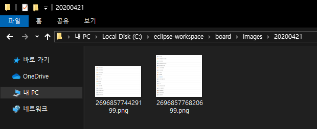
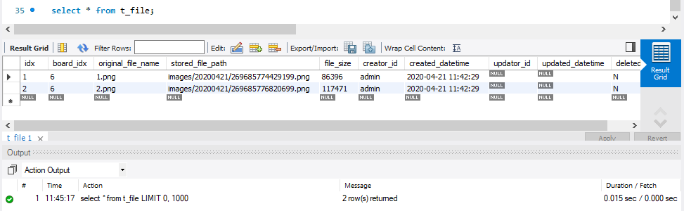
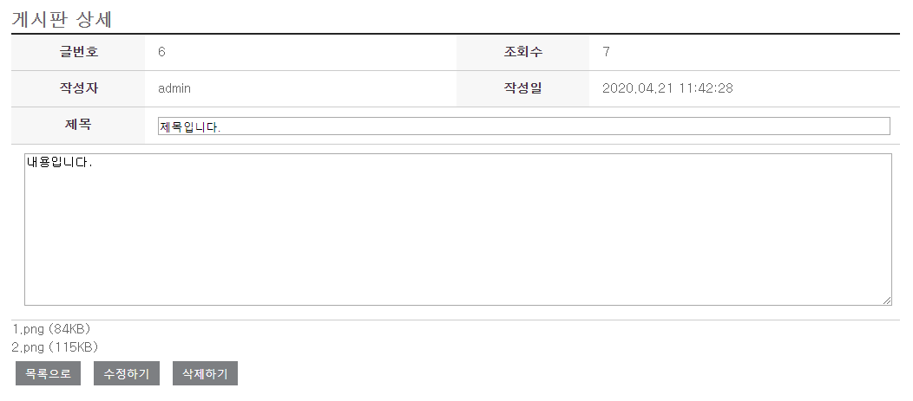
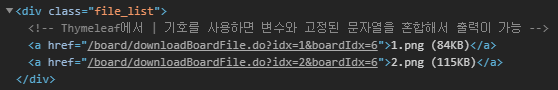
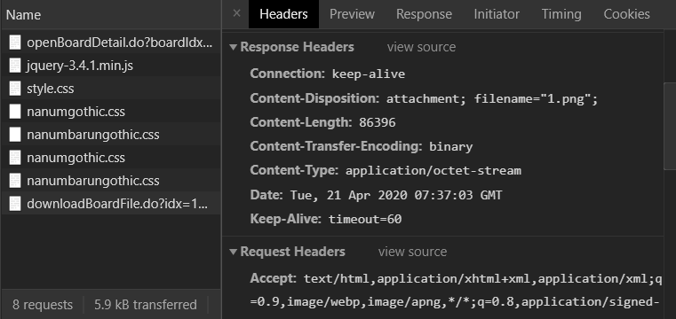
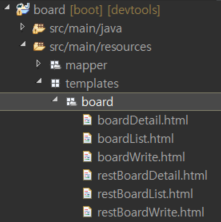

# Spring Boot

### 업로드 파일을 서버에 저장

업로드 파일은 서버에 파일 형태로 저장하고, 파일에 대한 정보(파일명, 파일저장경로, …)는 DB에 저장


### 첨부파일 정보를 담을 DTO를 생성

/board/src/main/java/board/dto/BoardFileDto.java

```java
package board.dto;

import lombok.Data;

@Data
public class BoardFileDto {
	private int idx;
	private int boardIdx;
	private String originalFileName;
	private String storedFilePath;
	private long fileSize;
}
```


### 파일 처리를 위한 클래스를 생성

파일 저장 기능을 구현 ⇒ 서비스 컴포넌트에서 직접 구현해도 되나 비즈니스 로직과의 구분을 위해서 별도의 유틸리티 클래스로 분리


/board/src/main/java/board/common/FileUtils.java

```java
package board.common;

import java.io.File;
import java.time.ZonedDateTime;
import java.time.format.DateTimeFormatter;
import java.util.ArrayList;
import java.util.Iterator;
import java.util.List;

import org.springframework.stereotype.Component;
import org.springframework.util.ObjectUtils;
import org.springframework.web.multipart.MultipartFile;
import org.springframework.web.multipart.MultipartHttpServletRequest;

import board.dto.BoardFileDto;

@Component
public class FileUtils {
	
	// 요청에 포함된 파일을 추출해서 저장하고 해당 파일의 정보를 반환
	// insertBoard 서비스에서 호출
	public List<BoardFileDto> parseFileInfo(int boardIdx, MultipartHttpServletRequest request) throws Exception {
		
		if (ObjectUtils.isEmpty(request)) {
			return null;
		}
		
		// 파일 정보
		List<BoardFileDto> fileInfoList = new ArrayList<BoardFileDto>();
		
		// 파일 저장 경로 생성
		DateTimeFormatter dtf = DateTimeFormatter.ofPattern("yyyyMMdd"); 
		ZonedDateTime now = ZonedDateTime.now();
		String storedDir = "images/" + now.format(dtf);	 // images/20200421
		File fileDir = new File(storedDir);
		if (!fileDir.exists()) {
			fileDir.mkdir();
		}
		
		// 요청에 포함된 파일을 추출해서 저장 경로에 저장하고 파일 정보를 fileInfoList에 추가
		Iterator<String> fileTagNames = request.getFileNames();  // <input type="file" name="????" .../>
		while (fileTagNames.hasNext()) {
			String originalFileExtension;
			
			// 같은 <input type="file" name="????"> 태그 이름의 파일을 추출
			List<MultipartFile> files = request.getFiles(fileTagNames.next());
			for (MultipartFile file : files) {
				if (!file.isEmpty() ) {
					String contentType = file.getContentType();
					if (ObjectUtils.isEmpty(contentType)) {
						break;
					} else {
						// ContentType에 맞춰서 파일의 확장자를 제한
						if (contentType.contains("image/jpeg")) {
							originalFileExtension = ".jpg";
						} else if (contentType.contains("image/png")) {
							originalFileExtension = ".png";
						} else if (contentType.contains("image/gif")) {
							originalFileExtension = ".gif";
						} else {
							break;
						}
					}
					
					// 저장 파일명을 생성 : 저장 파일명 = 나노시간 + 파일확장자
					String storedFileName = Long.toString(System.nanoTime()) + originalFileExtension;
					
					// 파일 정보를 fileInfoList에 추가
					BoardFileDto boardFile = new BoardFileDto();
					boardFile.setBoardIdx(boardIdx);
					boardFile.setFileSize(file.getSize());
					boardFile.setOriginalFileName(file.getOriginalFilename());
					boardFile.setStoredFilePath(storedDir + "/" + storedFileName);
					fileInfoList.add(boardFile);					
					
					// 파일을 저장
					fileDir = new File(storedDir + "/" + storedFileName);
					file.transferTo(fileDir);
				}
			}
		}		
		return fileInfoList;
	}
}
```


### 서비스, 매퍼, 쿼리맵 수정

/board/src/main/java/board/service/BoardServiceImpl.java

```java
@Service
// @Transactional
public class BoardServiceImpl implements BoardService {
				:
	@Autowired
	private FileUtils fileUtils;
				:
	@Override
	public void insertBoard(BoardDto board, MultipartHttpServletRequest request) throws Exception {	
		boardMapper.insertBoard(board);
		
		List<BoardFileDto> files = fileUtils.parseFileInfo(board.getBoardIdx(), request);
		if (!CollectionUtils.isEmpty(files)) {
			boardMapper.insertBoardFileList(files);
		}
	}
    			:
}
```


/board/src/main/java/board/mapper/BoardMapper.java

```java
@Mapper
public interface BoardMapper {
	List<BoardDto> selectBoardList() throws Exception;
	void insertBoard(BoardDto board) throws Exception;
	BoardDto selectBoardDetail(int boardIdx) throws Exception;
	void updateHitCnt(int boardIdx) throws Exception;
	void updateBoard(BoardDto board) throws Exception;
	void deleteBoard(int boardIdx) throws Exception;
	void insertBoardFileList(List<BoardFileDto> files) throws Exception;
}
```


/board/src/main/resources/mapper/sql-board.xml

```xml
			:
	<insert id="insertBoardFileList" parameterType="board.dto.BoardFileDto">
		insert into t_file (
			board_idx, original_file_name, stored_file_path, file_size, creator_id, created_datetime
		) values
		<foreach collection="list" item="item" separator=",">
		(
			#{item.boardIdx},
			#{item.originalFileName},
			#{item.storedFilePath},
			#{item.fileSize},
			'admin',
			now()
		)
		</foreach>
	</insert>
			:
	<!-- 
		useGeneratedKeys : DBMS가 자동 생성키를 지원하는 경우 사용 가능
		keyProperty      : useGeneratedKeys 또는 selectKey를 통해서 반환하는 키
	-->
	<insert id="insertBoard" parameterType="board.dto.BoardDto" useGeneratedKeys="true" keyProperty="boardIdx">
		insert into t_board (title, contents, created_datetime, creator_id)
		values (#{title}, #{contents}, now(), 'admin')
	</insert>
            :
```


### C:\eclipse-workspace\board\images 디렉터리를 생성

이클립스 워크스페이스에 board 프로젝트 디렉터리 아래에 images 디렉터리를 생성


### 결과확인

정상적으로 업로드가 된 경우, 오늘 날짜의 디렉터리가 생기고 아래에 파일이 저장 (파일명은 나노시간)





t_file 테이블에 업로드 파일의 정보가 저장된 것을 확인




### 첨부 파일 목록 출력 기능 추가

게시판 상세 페이지에 들어갔을 때 해당 게시판에 첨부된 파일의 목록을 출력(파일명, 파일크기)


### 쿼리(SQL) 추가

/board/src/main/resources/mapper/sql-board.xml

```xml
	<select id="selectBoardFileList" parameterType="int" resultType="board.dto.BoardFileDto">
		select idx, board_idx, original_file_name, stored_file_path, 
		       round(file_size/1024) as file_size
		  from t_file
		 where board_idx = #{boardIdx} and deleted_yn = 'N'
	</select>
```


### 맵퍼를 정의

/board/src/main/java/board/mapper/BoardMapper.java

```java
@Mapper
public interface BoardMapper {
	List<BoardDto> selectBoardList() throws Exception;
	void insertBoard(BoardDto board) throws Exception;
	BoardDto selectBoardDetail(int boardIdx) throws Exception;
	void updateHitCnt(int boardIdx) throws Exception;
	void updateBoard(BoardDto board) throws Exception;
	void deleteBoard(int boardIdx) throws Exception;
	void insertBoardFileList(List<BoardFileDto> files) throws Exception;
	List<BoardFileDto> selectBoardFileList(int boardIdx) throws Exception;
}
```


### BoardDto에 필드 추가

게시판 정보를 담고 있는 BoardDto에 첨부 파일 정보를 담을 수 있도록 필드를 추가

```java
@Data
public class BoardDto {
	private int boardIdx;		// board_idx
	private String title; 		// title
	private String contents; 	// contents
	private int hitCnt; 		// hit_cnt		
	private String creatorId;	// creator_id	
	private String createdDatetime;
	private String updaterId;	
	private String updatedDatetime;
	
	// 첨부 파일 정보를 담고 있는 목록
	private List<BoardFileDto> fileInfoList;
}
```


### 서비스를 수정

게시판 상세 조회 시 첨부 파일 목록을 조회해 오도록 수정

/board/src/main/java/board/service/BoardServiceImpl.java

```java
	@Override
	public BoardDto selectBoardDetail(int boardIdx) throws Exception {
		// AS-IS : 조회수를 증가하고 게시판 상세 정보를 조회해서 반환
//		boardMapper.updateHitCnt(boardIdx);
//		return boardMapper.selectBoardDetail(boardIdx);
		
		// TO-BE : 조회수를 증가하고 게시판 상세 정보와 첨부 파일 정보를 조회해서 해당 정보를 결합해서 반환
		//         게시판 정보를 담고 있는 BoardDto에 첨부 파일 정보를 담을 수 있도록 필드를 추가
		boardMapper.updateHitCnt(boardIdx);
		
		BoardDto board = boardMapper.selectBoardDetail(boardIdx);
		List<BoardFileDto> fileInfoList = boardMapper.selectBoardFileList(boardIdx);
		board.setFileInfoList(fileInfoList);
		
		return board;
	}
```


### 뷰 수정

/board/src/main/resources/templates/board/boardDetail.html

```html
		</form>
		
		<div class="file_list">
			<!-- Thymeleaf에서 | 기호를 사용하면 변수와 고정된 문자열을 혼합해서 출력이 가능 -->
			<a th:each="list : ${board.fileInfoList}" th:text="|${list.originalFileName} (${list.fileSize}KB)|"></a>
		</div>
				:
```


### 결과 확인

게시판 상세 보기 화면에 첨부 파일 목록이 출력되는지 확인





## 업로드 파일을 다운로드하는 기능을 구현

서버로 어떤 정보를 요청하면 뷰를 통해서 정보가 전달되는데,

파일 다운로드는 뷰가 아니고 응답(response)를 통해서 직접 전달


링크(첨부파일 제목)를 클릭 ---> (게시판번호,파일번호) ---> 서버로 요청이 발생 ---> 해당 파일 정보를 조회(파일 저장 위치) ---> 저장 파일을 읽어서 응답으로 전달


### 뷰에 링크를 추가

/board/src/main/resources/templates/board/boardDetail.html

```html
		</form>
		<!-- 
			<a href="/board/downloadBoardFile.do?idx=OOO&boardIdx=OOOO">
		-->
		<div class="file_list">
			<!-- Thymeleaf에서 | 기호를 사용하면 변수와 고정된 문자열을 혼합해서 출력이 가능 -->
			<a 	th:each="list : ${board.fileInfoList}"
				th:href="@{/board/downloadBoardFile.do(idx=${list.idx}, boardIdx=${list.boardIdx})}"
				th:text="|${list.originalFileName} (${list.fileSize}KB)|">
			</a>
		</div>
			:
```


브라우저 소스보기 결과




### 컨트롤러 추가

/board/src/main/java/board/controller/BoardController.java

```java
	@RequestMapping("/board/downloadBoardFile.do")
	public void downloadBoardFile(@RequestParam int idx, @RequestParam int boardIdx, HttpServletResponse response) throws Exception {
		// TODO
		// 파라미터로 전달된 idx, boardIdx에 일치하는 파일 정보를 조회 -> 서비스 -> 맵퍼 -> 쿼리
		BoardFileDto boardFile = boardService.selectBoardFileInfo(idx, boardIdx);
		log.debug("idx >>> " + idx);
		log.debug("boardIdx >>> " + boardIdx);
		
		// TODO
		// 조회 결과 중 저장 경로 정보를 이용해서 파일을 읽어 응답으로 내려보내는 작업
		log.debug("Original File Name: " + boardFile.getOriginalFileName());
		log.debug("Stored File Path : " + boardFile.getStoredFilePath());
		log.debug("File Size : " + boardFile.getFileSize());
	}
```


### 서비스, 맵퍼, 쿼리맵을 수정

/board/src/main/java/board/service/BoardService.java

```java
public interface BoardService {
	List<BoardDto> selectBoardList() throws Exception;
	void insertBoard(BoardDto board, MultipartHttpServletRequest request) throws Exception;
	BoardDto selectBoardDetail(int boardIdx) throws Exception;
	void updateBoard(BoardDto board) throws Exception;
	void deleteBoard(int boardIdx) throws Exception;
	BoardFileDto selectBoardFileInfo(int idx, int boardIdx) throws Exception;
}
```


/board/src/main/java/board/service/BoardServiceImpl.java

```java
	@Override
	public BoardFileDto selectBoardFileInfo(int idx, int boardIdx) throws Exception {
		return boardMapper.selectBoardFileInfo(idx, boardIdx);
	}
```


/board/src/main/java/board/mapper/BoardMapper.java

```java
package board.mapper;

import java.util.List;

import org.apache.ibatis.annotations.Mapper;
import org.apache.ibatis.annotations.Param;

import board.dto.BoardDto;
import board.dto.BoardFileDto;

@Mapper
public interface BoardMapper {
	List<BoardDto> selectBoardList() throws Exception;
	void insertBoard(BoardDto board) throws Exception;
	BoardDto selectBoardDetail(int boardIdx) throws Exception;
	void updateHitCnt(int boardIdx) throws Exception;
	void updateBoard(BoardDto board) throws Exception;
	void deleteBoard(int boardIdx) throws Exception;
	void insertBoardFileList(List<BoardFileDto> files) throws Exception;
	List<BoardFileDto> selectBoardFileList(int boardIdx) throws Exception;
	BoardFileDto selectBoardFileInfo(@Param("idx") int idx, @Param("boardIdx") int boardIdx) throws Exception;
}
```


/board/src/main/resources/mapper/sql-board.xml

```xml
	<select id="selectBoardFileInfo" parameterType="map" resultType="board.dto.BoardFileDto">
		select original_file_name, stored_file_path, file_size
		from t_file
		where idx = #{idx} and board_idx = #{boardIdx} and deleted_yn = 'N'
	</select>
```


### 테스트

첨부 파일 링크를 클릭했을 때 파일 정보가 콘솔에 출력되는지 확인

```
2020-04-21 15:58:24,774 DEBUG [board.mapper.BoardMapper.selectBoardFileInfo] <==      Total: 1
2020-04-21 15:58:24,779 DEBUG [board.controller.BoardController] idx >>> 1
2020-04-21 15:58:24,779 DEBUG [board.controller.BoardController] boardIdx >>> 6
2020-04-21 15:58:24,779 DEBUG [board.controller.BoardController] Original File Name: 1.png
2020-04-21 15:58:24,779 DEBUG [board.controller.BoardController] Stored File Path : images/20200421/269685774429199.png
2020-04-21 15:58:24,779 DEBUG [board.controller.BoardController] File Size : 86396
2020-04-21 15:58:24,780 DEBUG [board.LoggerInterceptor] ===============  END  ===============
```


### 저장된 파일을 읽어서 응답으로 전달하는 코드를 추가

/board/src/main/java/board/controller/BoardController.java

```java
    @RequestMapping("/board/downloadBoardFile.do")
	public void downloadBoardFile(@RequestParam int idx, @RequestParam int boardIdx, HttpServletResponse response) throws Exception {
		// 첨부 파일 정보를 조회
		BoardFileDto boardFile = boardService.selectBoardFileInfo(idx, boardIdx);
		
		// 조회 결과 중 저장 경로 정보를 이용해서 파일을 읽어 응답으로 내려보내는 작업
		if (!ObjectUtils.isEmpty(boardFile)) {
			String fileName = boardFile.getOriginalFileName();  // 원본 파일 명
			
			// 저장된 첨부 파일을 읽은 것
			byte[] files = FileUtils.readFileToByteArray(new File(boardFile.getStoredFilePath()));
			
			// 응답 헤더의 값을 설정 (응답 내용을 브라우저가 잘 처리할 수 있도록)
			response.setContentType("application/octet-stream");		// Content-Type: application/octet-stream
			response.setContentLength(files.length);					// Content-Length: 123
																		// Content-Disposition: attachment; filename="첨부파일1.png";
			response.setHeader("Content-Disposition", "attachment; filename=\"" + URLEncoder.encode(fileName, "UTF-8") + "\";");
			response.setHeader("Content-Transfer-Encoding", "binary");	// Content-Transfer-Encoding: binary
			
			// 응답으로 파일을 전달
			response.getOutputStream().write(files);
			response.getOutputStream().flush();
			response.getOutputStream().close();
		}			
	}
```


#### HTTP 메시지

https://developer.mozilla.org/ko/docs/Web/HTTP/Messages

* Header(헤더) : 요청 또는 응답에 대한 정보를 가지고 있다.
  * General Header : 공통 Header
  * Req Header : 요청 Header
  * Res Header : 응답 Header
* Body(본문) : 서버와 클라이언트 간에 주고 받은 데이터를 담아두는 공간


### 파일 다운로드 테스트




## REST(REpresentational State Transfer)

HTTP URI로 리소스를 정의하고 HTTP 메서드로 리소스에 대한 행위 정의

https://ko.wikipedia.org/wiki/REST


REST 특징을 잘 지키는 API ⇒ RESTful 하다


### REST API의 URI 설계 일반 원칙

1. URI은 명사를 사용한다.
2. 슬래시(/)는 계층 관계를 표현한다.
3. 명확한 의사 전달을 위해 URI의 마지막에는 슬래시를 사용하지 않는다.
4. (기억을 쉽게 하기 위해) URI에는 소문자만 사용한다.
5. 가독성을 높이기 위해 하이폰(-)은 사용할 수 있지만 밑줄(_)은 사용하지 않는다.


### HTTP 메소드(method)

| 메소드(방식) | 의미   | 역할                     |
| ------------ | ------ | ------------------------ |
| POST         | Create | 리소스를 생성            |
| GET          | Read   | 해당 URI의 리소스를 조회 |
| PUT          | Update | 해당 URI의 리소스를 수정 |
| DELETE       | Delete | 해당 URI의 리소스를 삭제 |


## RESTful 게시판으로 변경

### 컨트롤러 작성

| 기능              | 대응하는 BoardController의 URI | RESTful URI   | Method |
| ----------------- | ------------------------------ | ------------- | ------ |
| 게시판 목록 조회  | /board/openBoardList.do        | /board        | GET    |
| 게시판 작성 화면  | /board/openBoardWrite.do       | /board/write  | GET    |
| 게시판 작성       | /board/insertBoard.do          | /board/write  | POST   |
| 게시판 상세 조회  | /board/openBoardDetail.do      | /board/글번호 | GET    |
| 게시판 수정       | /board/updateBoard.do          | /board/글번호 | PUT    |
| 게시판 삭제       | /board/deleteBoard.do          | /board/글번호 | DELETE |
| 첨부파일 다운로드 | /board/downloadBoardFile.do    | /board/file   | GET    |


/board/src/main/java/board/controller/RestBoardController.java

```java
package board.controller;

import java.io.File;
import java.net.URLEncoder;
import java.util.List;

import javax.servlet.http.HttpServletResponse;

import org.apache.commons.io.FileUtils;
import org.springframework.beans.factory.annotation.Autowired;
import org.springframework.stereotype.Controller;
import org.springframework.util.ObjectUtils;
import org.springframework.web.bind.annotation.PathVariable;
import org.springframework.web.bind.annotation.RequestMapping;
import org.springframework.web.bind.annotation.RequestMethod;
import org.springframework.web.bind.annotation.RequestParam;
import org.springframework.web.multipart.MultipartHttpServletRequest;
import org.springframework.web.servlet.ModelAndView;

import board.dto.BoardDto;
import board.dto.BoardFileDto;
import board.service.BoardService;

@Controller
public class RestBoardController {

	@Autowired
	private BoardService boardService;

	// @GetMapping, @PostMapping, @PutMapping, @DeleteMapping 등으로 세분화 가능
	@RequestMapping(value = "/board", method = RequestMethod.GET)
	public ModelAndView openBoardList() throws Exception {
		ModelAndView mv = new ModelAndView("/board/restBoardList");
		List<BoardDto> list = boardService.selectBoardList();
		mv.addObject("list", list);
		return mv;
	}

	@RequestMapping(value = "/board/write", method = RequestMethod.GET)
	public String openBoardWrite() throws Exception {
		return "/board/restBoardWrite";
	}

	@RequestMapping(value = "/board/write", method = RequestMethod.POST)
	public String insertBoard(BoardDto board, MultipartHttpServletRequest request) throws Exception {
		boardService.insertBoard(board, request);
		return "redirect:/board";
	}

	@RequestMapping(value = "/board/{boardIdx}", method = RequestMethod.GET)
	public ModelAndView openBoardDetail(@PathVariable("boardIdx") int boardIdx) throws Exception {
		ModelAndView mv = new ModelAndView("/board/restBoardDetail");
		BoardDto board = boardService.selectBoardDetail(boardIdx);
		mv.addObject("board", board);
		return mv;
	}

	@RequestMapping(value = "/board/{boardIdx}", method = RequestMethod.PUT)
	public String updateBoard(BoardDto board) throws Exception {
		boardService.updateBoard(board);
		return "redirect:/board";
	}

	@RequestMapping(value = "/board/{boardIdx}", method = RequestMethod.DELETE)
	public String deleteBoard(@PathVariable("boardIdx") int boardIdx) throws Exception {
		boardService.deleteBoard(boardIdx);
		return "redirect:/board";
	}

	@RequestMapping(value = "/board/file", method = RequestMethod.GET)
	public void downloadBoardFile(@RequestParam int idx, @RequestParam int boardIdx, HttpServletResponse response) throws Exception {
		BoardFileDto boardFile = boardService.selectBoardFileInfo(idx, boardIdx);

		if (!ObjectUtils.isEmpty(boardFile)) {
			String fileName = boardFile.getOriginalFileName();

			byte[] files = FileUtils.readFileToByteArray(new File(boardFile.getStoredFilePath()));

			response.setContentType("application/octet-stream");
			response.setContentLength(files.length);

			response.setHeader("Content-Disposition", "attachment; filename=\"" + URLEncoder.encode(fileName, "UTF-8") + "\";");
			response.setHeader("Content-Transfer-Encoding", "binary");

			response.getOutputStream().write(files);
			response.getOutputStream().flush();
			response.getOutputStream().close();
		}
	}
}
```

@RequestMapping을 value와 method로 변경

view, redirect 변경

@PathVariable


주소 체계를 REST하게 변경


### 뷰템플릿 생성

boardDetail.html 파일 복사 => 붙여넣기 => restBoardDetail.html 파일 생성

boardList.html 파일 복사 => 붙여넣기 => restBoardList.html 파일 생성

boardWrite.html 파일 복사 => 붙여넣기 => restBoardWrite.html 파일 생성





파일을 생성한 후 http://localhost:8080/board 로 접속 ⇒ 게시판 목록이 출력


REST API

사용자에게 데이터만 전달하는 방식. 일반적으로 JSON 형태의 데이터를 보낸다.

인터페이스는 REST API 형태로 준다.

데이터를 파싱해서 화면을 만들어준다.

모듈끼리도 REST API를 이용해서 정보를 주고받을 수 있다.


RESTful API는 마이크로서비스 아키텍처가 나오면서 각광받고있다.

게시판을 조회하는 것과 결제하는 것은 분리할 수 있다. 분리 가능한 서비스들을 떨어뜨려 놓고 개별적으로 동작하도록 구성 => 마이크로서비스

서비스가 가급적이면 독립적이고 작으면 더욱더 효율적이다. 서비스와 서비스 간의 연관성이 없으면 더 좋다.


---


restBoardList.html 파일에 링크를 REST 방식으로 변경

/board/src/main/resources/templates/board/restBoardList.html

```html
<!DOCTYPE html>
<html lang="ko" xmlns:th="http://www.thymeleaf.org">
<head>
	<meta charset="UTF-8" />
	<title>게시판</title>
	<link rel="stylesheet" th:href="@{/css/style.css}"/>	
</head>
<body>
	<div class="container">
		<h2>REST 게시판 목록</h2>
		<table class="board_list">
			<colgroup>
				<col width="15%"/>
				<col width="*"  />
				<col width="15%"/>
				<col width="20%"/>
			</colgroup>
			<thead>
				<tr>
					<th scope="col">글번호</th>
					<th scope="col">제목</th>
					<th scope="col">조회수</th>
					<th scope="col">작성일</th>
				</tr>
			</thead>
			<tbody>
				<tr th:if="${#lists.size(list)} > 0" th:each="list : ${list}">
					<td th:text="${list.boardIdx}"></td>
					<!--
					<td class="title" th:text="${list.title}"></td>
					-->
					<td class="title">
						<!--
						<a href="/board/openBoardDetail.do?boardIdx=" 
							th:attrappend="href=${list.boardIdx}" th:text="${list.title}">
						</a>
						-->
						<a href="/board/" th:attrappend="href=${list.boardIdx}" th:text="${list.title}"></a>
					</td>
					<td th:text="${list.hitCnt}"></td>
					<td th:text="${list.createdDatetime}"></td>
				</tr>
				<tr th:unless="${#lists.size(list)} > 0">
					<td colspan="4">조회 결과가 없습니다.</td>
				</tr>
			</tbody>		
		</table>
		<!--
		<a href="/board/openBoardWrite.do" class="btn">글쓰기</a>
		-->
		<a href="/board/write" class="btn">글쓰기</a>
	</div>
</body>
</html>
```


restBoardWrite.html 수정

/board/src/main/resources/templates/board/restBoardWrite.html

```html
		<h2>게시판 등록</h2>
		<!--
		<form id="frm" name="frm" method="post" action="/board/insertBoard.do" enctype="multipart/form-data">
		-->
		<form id="frm" name="frm" method="post" action="/board/write" enctype="multipart/form-data">
```


restBoardDetail.html 수정

/board/src/main/resources/templates/board/restBoardDetail.html

```html
<!DOCTYPE html>
<html lang="ko" xmlns:th="http://www.thymeleaf.org">
<head>
	<meta charset="UTF-8" />
	<title>게시판</title>
	<link rel="stylesheet" th:href="@{/css/style.css}"/>	
</head>
<body>
	<div class="container">
		<h2>게시판 상세</h2>
		<form id="frm" name="frm" method="post" action="">
		<input type="hidden" id="boardIdx" name="boardIdx" th:value="${board.boardIdx}"/>
		
		<!-- HiddenHttpMethodFilter를 이용해서 요청 방식(method)을 결정(변경) -->
		<input type="hidden" id="_method" name="_method"/>
		
			<table class="board_detail">
				<colgroup>
					<col width="15%"/>
					<col width="35%"/>
					<col width="15%"/>
					<col width="35%"/>
				</colgroup>
				<tbody>
					<tr>
						<th scope="row">글번호</th>
						<td th:text="${board.boardIdx}"></td>
						<th scope="row">조회수</th>
						<td th:text="${board.hitCnt}"></td>
					</tr>
					<tr>
						<th scope="row">작성자</th>
						<td th:text="${board.creatorId}"></td>
						<th scope="row">작성일</th>
						<td th:text="${board.createdDatetime}"></td>
					</tr>
					<tr>
						<th scope="row">제목</th>
						<td colspan="3">
							<input type="text" id="title" name="title" th:value="${board.title}"/>
						</td>
					</tr>
					<tr>
						<td colspan="4">
							<textarea title="내용" id="contents" name="contents" th:text="${board.contents}"></textarea>
						</td>
					</tr>
				</tbody>		
			</table>
		</form>
		<!--
			<a href="/board/downloadBoardFile.do?idx=OOO&boardIdx=OOOO">
		-->
		<!--
		<div class="file_list">
			<a	th:each="list : ${board.fileInfoList}" 
				th:href="@{/board/downloadBoardFile.do(idx=${list.idx}, boardIdx=${list.boardIdx})}"
				th:text="|${list.originalFileName} (${list.fileSize}KB)|"></a>
		</div>
		-->
		<div class="file_list">
			<a	th:each="list : ${board.fileInfoList}" 
				th:href="@{/board/file(idx=${list.idx}, boardIdx=${list.boardIdx})}"
				th:text="|${list.originalFileName} (${list.fileSize}KB)|"></a>
		</div>

		<!-- 
		<a href="/board/openBoardList.do" class="btn">목록으로</a>
		-->
		
		<input type="button" id="list" class="btn" value="목록으로"/>
		<input type="button" id="update" class="btn" value="수정하기"/>
		<input type="button" id="delete" class="btn" value="삭제하기"/>
		
		<script src="https://code.jquery.com/jquery-3.4.1.min.js"></script>
		<script>
			$(function() {
				const boardIdx = $('#boardIdx').val();
				
				$('#list').on('click', function() {
					// location.href = 'openBoardList.do';
					location.href = "/board";
				});
				
				// PUT 방식으로 /board/게시판번호 요청
				$('#update').on('click', function() {
					let frm = $('#frm')[0];
					// frm.action = 'updateBoard.do';
					$("#_method").val("PUT");
					frm.action = "/board/" + boardIdx;
					frm.submit();
				});
				
				// DELETE 방식으로 /board/게시판번호 요청
				$('#delete').on('click', function() {
					let frm = $('#frm')[0];
					// frm.action = 'deleteBoard.do';
					$("#_method").val("DELETE");
					frm.action = "/board/" + boardIdx;
					frm.submit();
				});
			});	
		</script>
	</div>
</body>
</html>
```


### HiddenHttpMethodFilter 추가

_method 이름의 파라미터가 존재할 경우 해당 파라미터의 값을 요청 방식(request method)으로 사용

스프링 부트 2.1.x 이후에는 기본적으로 필터로 등록되어 있음


/board/src/main/java/board/BoardApplication.java

```java
package board;

import org.springframework.boot.SpringApplication;
import org.springframework.boot.autoconfigure.SpringBootApplication;
import org.springframework.boot.autoconfigure.web.servlet.MultipartAutoConfiguration;
import org.springframework.context.annotation.Bean;
import org.springframework.web.filter.HiddenHttpMethodFilter;

@SpringBootApplication(exclude = { MultipartAutoConfiguration.class })
public class BoardApplication {

	public static void main(String[] args) {
		SpringApplication.run(BoardApplication.class, args);
	}
	
	@Bean
	public HiddenHttpMethodFilter hiddenHttpMethodFilter() {
		return new HiddenHttpMethodFilter();
	}
}
```


### 결과 확인

게시글 작성 → 게시글 상세 → 수정, 삭제

⇒ 주소가 REST 하게 유지되는지 확인

