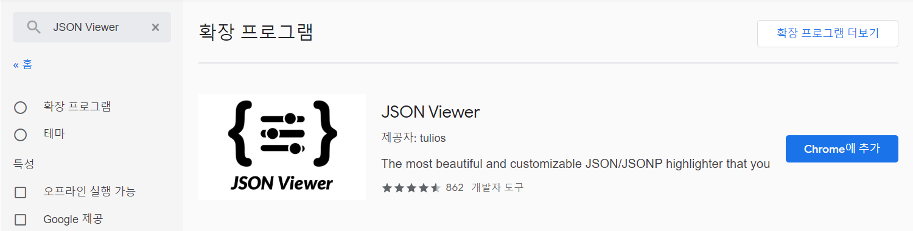
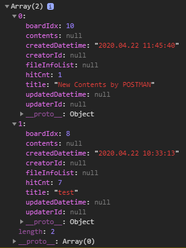

# Spring Boot

## REST API로 변경

요청 결과가 JSON과 같은 형태로 전달


### JSON Viewer 설치

https://chrome.google.com/webstore/category/extensions?hl=ko





### 컨트롤러 생성

/board/src/main/java/board/controller/RestApiBoardController.java

```java
package board.controller;

import java.util.List;

import org.springframework.beans.factory.annotation.Autowired;
import org.springframework.web.bind.annotation.PathVariable;
import org.springframework.web.bind.annotation.RequestBody;
import org.springframework.web.bind.annotation.RequestMapping;
import org.springframework.web.bind.annotation.RequestMethod;
import org.springframework.web.bind.annotation.RestController;

import board.dto.BoardDto;
import board.service.BoardService;

// @RestController = @Controller + @ResponseBody
// 요청 처리 결과를 JSON 형식의 데이터를 포함한 응답 본문으로 전송 
@RestController
public class RestApiBoardController {
	
	@Autowired
	private BoardService boardService;

	@RequestMapping(value = "/api/board", method = RequestMethod.GET)
	public List<BoardDto> openBoardList() throws Exception {
		return boardService.selectBoardList();
	}

	// @RequestBody => 요청 파라미터가 HTTP 본문에 포함되어 있음
	//                 POST, PUT 방식을 처리할 때 사용
	@RequestMapping(value = "/api/board/write", method = RequestMethod.POST)
	public void insertBoard(@RequestBody BoardDto board) throws Exception {
		boardService.insertBoard(board, null);
	}

	@RequestMapping(value = "/api/board/{boardIdx}", method = RequestMethod.GET)
	public BoardDto openBoardDetail(@PathVariable("boardIdx") int boardIdx) throws Exception {
		return boardService.selectBoardDetail(boardIdx);
	}

	@RequestMapping(value = "/api/board/{boardIdx}", method = RequestMethod.PUT)
	public void updateBoard(@RequestBody BoardDto board) throws Exception {
		boardService.updateBoard(board);
	}

	@RequestMapping(value = "/api/board/{boardIdx}", method = RequestMethod.DELETE)
	public void deleteBoard(@PathVariable("boardIdx") int boardIdx) throws Exception {
		boardService.deleteBoard(boardIdx);
	}
}
```


### 브라우저를 이용한 조회 테스트

http://localhost:8080/api/board


http://localhost:8080/api/board/7


### POSTMAN을 이용한 등록, 수정, 삭제 테스트

https://www.postman.com/downloads/


POSTMAN : RESTful API를 테스트 할 때 사용하는 도구


#### 게시판 목록 조회


#### 게시판 상세 조회


#### 게시판 수정


업데이트에 성공하면 업데이트된 게시판 내용이 반환되도록 API를 수정

/board/src/main/java/board/controller/RestApiBoardController.java

```java
	@RequestMapping(value = "/api/board/{boardIdx}", method = RequestMethod.PUT)
	public BoardDto updateBoard(@RequestBody BoardDto board) throws Exception {
		boardService.updateBoard(board);
		int boardIdx = board.getBoardIdx();
		return boardService.selectBoardDetail(boardIdx);
	}
```


#### 게시판 삭제


삭제 성공 여부를 반환하도록 API를 수정

result 값이 성공했을 때는 success, 실패했을 때는 fail을 반환

/board/src/main/java/board/controller/RestApiBoardController.java

```java
	@RequestMapping(value = "/api/board/{boardIdx}", method = RequestMethod.DELETE)
	public HashMap deleteBoard(@PathVariable("boardIdx") int boardIdx) throws Exception {
		HashMap hm = new HashMap();
		try {
			boardService.deleteBoard(boardIdx);
			hm.put("result", "success");
		} catch (Exception e) {
			hm.put("reusult", "fail");
			throw e;
		}
		return hm;
	}
```

반환하는 타입을 객체로 해줘야 JSON 형태로 처리해준다.


#### 게시글 작성 테스트


게시글 추가(등록)에 성공했을 때 게시글 번호를 반환하도록 API를 수정

/board/src/main/java/board/controller/RestApiBoardController.java

```java
	@RequestMapping(value = "/api/board/write", method = RequestMethod.POST)
	public HashMap insertBoard(@RequestBody BoardDto board) throws Exception {
		boardService.insertBoard(board, null);
		int boardIdx = board.getBoardIdx();
		HashMap hm = new HashMap();
		hm.put("boardIdx", boardIdx);
		return hm;
	}
```


게시글 추가(등록)에 성공했을 때 새롭게 등록된 게시글을 반환하도록 API를 수정

/board/src/main/java/board/controller/RestApiBoardController.java

```java
	@RequestMapping(value = "/api/board/write", method = RequestMethod.POST)
	public BoardDto insertBoard(@RequestBody BoardDto board) throws Exception {
		boardService.insertBoard(board, null);
		int boardIdx = board.getBoardIdx();
		return boardService.selectBoardDetail(boardIdx);
	}
```


### RESTful API - Ajax 연동


/board/src/main/java/board/controller/BoardController.java

```java
@Controller
public class BoardController {
	
	@Autowired
	private BoardService boardService;
	
	@RequestMapping("/board/apiTest.do")
	public String apiTest() {
		return "/board/apiTest";
	}
    			:
}
```


/board/src/main/resources/templates/board/apiTest.html

```html
<!DOCTYPE html>
<html lang="ko">
<head>
	<meta charset="UTF-8" />
	<title>테스트</title>
	<script src="https://code.jquery.com/jquery-3.4.1.min.js"></script>	
	<script>
		$(function() {
			$.ajax({
				type: "GET",
				url: "/api/board",
				dataType: "json", 
				contentType: "application/json",
				success: function(data) {
					console.log(data);
				}
			});
		});
	</script>
</head>
<body>
	<h1>API TEST</h1>
	<table id="tbl">
	
	</table>
</body>
</html>
```


http://localhost:8080/board/apiTest.do





/board/src/main/resources/templates/board/apiTest.html

```html
<!DOCTYPE html>
<html lang="ko" xmlns:th="http://www.thymeleaf.org">
<head>
<meta charset="UTF-8" />
<title>테스트</title>
<link rel="stylesheet" th:href="@{/css/style.css}"/>
<script src="https://code.jquery.com/jquery-3.4.1.min.js"></script>
<script>
		$(function() {
			$(document).on("click", "a", function() {
				let boardIdx = $(this).attr('boardIdx');
				$.ajax({
					type: "GET",
					url: "/api/board/" + boardIdx,
					dataType: "json", 
					contentType: "application/json",
					success: function(data) {
						let tr = `
							<tr><td>번호</td><td>${data.boardIdx}</td></tr>
							<tr><td>제목</td><td>${data.title}</td></tr>
							<tr><td>조회수</td><td>${data.hitCnt}</td></tr>
						`;
						$('#tbl').html(tr);
					}
				});
			});
			
			$('#btnList').click(function() {
				$.ajax({
					type: "GET",
					url: "/api/board",
					dataType: "json", 
					contentType: "application/json",
					success: function(data) {
						$('#tbl').html('');
						data.forEach(d => {
							let tr = `
								<tr><td>${d.boardIdx}</td><td><a href="#" boardIdx="${d.boardIdx}">${d.title}</a></td><td>${d.hitCnt}</td></tr>
							`;
							$('#tbl').append(tr);
						});
					}
				});
			});
		});		
	</script>
</head>
<body>
	<h1>API TEST</h1>
	<div>
		<table id="tbl" class="board_list">
		
		</table>
	</div>
	<div>
		<input type="button" id="btnList" value="조회"/>
	</div>
</body>
</html>
```


개발자 도구 => Network 확인


SPA

처음 한 번만 apiTest.do를 호출한다.

화면은 바뀌지 않은 상태에서 스크립트에 의해 ajax로 계속 내려오는 것을 볼 수 있다.

페이지를 내려보내주기 위한 기술은 서버 사이드 기술이다.

서버 사이드 기술로 내려간 스크립트를 이용해 데이터를 왔다갔다 하는 것은 프론트엔드 기술이다.


## Spring Data JPA

### JPA(Java Persistence API)

자바 객체와 데이터베이스 테이블 간의 맵핑을 처리하는 ORM(Object Relational Mapping) 기술의 표준

객체 모델과 데이터 모델을 일치시킨다.


* 장점
  1. 애플리케이션 개발에서 발생하는 반복적인 CRUD 코드를 직접 작성하지 않아도 되므로 개발이 편리하다.
  2. 데이터베이스에 독립적인 개발이 가능하다.
  3. 유지보수가 쉽다.


* 단점
  1. 학습곡선(learning curve)이 크다.
  2. 특정 데이터베이스의 기능을 사용할 수 없다.
  3. 객체지향설계가 필요하다.


### Spring Data JPA

스프링에서 JPA를 쉽게 사용할 수 있도록 도와주는 라이브러리

내부적으로 하이버네이트를 이용해서 기능을 구현


### application.properties JPA 설정을 추가

/board/src/main/resources/application.properties

```properties
# 사용할 데이터베이스를 MySQL로 설정
spring.jpa.database=mysql

# MySQL 엔진 중 InnoDB 엔진을 지정 (디폴트는 MyISAM이 지정)
spring.jpa.database-platform=org.hibernate.dialect.MySQL5InnoDBDialect

# 엔티티와의 연관 관계를 바탕으로 테이블 생성 스크립트와 같은 것을 자동으로 실행
# 실제 환경에서는 false를 사용 (예상치 못한 DB 변경을 대비)
spring.jpa.generate-ddl=true

# Hibernate의 새로운 ID 생성 옵션 사용 여부를 지정
# 여기에서는 MySQL의 자동 증가 속성을 사용하기 위해 false 설정
spring.jpa.hibernate.use-new-id-generator-mappings=false
```


### JPA 설정 빈 등록

/board/src/main/java/board/configuration/DatabaseConfiguration.java

```java
@Configuration
@PropertySource("classpath:/application.properties")
@EnableTransactionManagement
public class DatabaseConfiguration {
	
	@Autowired
	private ApplicationContext applicationContext;
	
	@Bean
	@ConfigurationProperties(prefix = "spring.jpa")
	public Properties hibernateConfig() {
		return new Properties();
	}
    			:
}
```


### @EntityScan 애노테이션을 추가

@Entity 애노테이션이 설정된 도메인 클래스를 검색


/board/src/main/java/board/BoardApplication.java

```java
@EnableJpaAuditing
@EntityScan(basePackageClasses = { Jsr310JpaConverters.class }, basePackages = { "board" })
@SpringBootApplication(exclude = { MultipartAutoConfiguration.class })
public class BoardApplication {
    			:
```

board 패키지 아래에서 찾는다.

MySQL 버전과 Java의 버전에 따라 날짜, 시간이 제대로 컨버팅되지 않는 경우가 있다. 그것을 해결하기 위해서 Jsr310JpaConverters 클래스를 추가


### 엔티티 생성


/board/src/main/java/board/entity/BoardEntity.java

```java
package board.entity;

import java.time.LocalDateTime;
import java.util.Collection;

import javax.persistence.CascadeType;
import javax.persistence.Column;
import javax.persistence.Entity;
import javax.persistence.FetchType;
import javax.persistence.GeneratedValue;
import javax.persistence.GenerationType;
import javax.persistence.Id;
import javax.persistence.JoinColumn;
import javax.persistence.OneToMany;
import javax.persistence.Table;

import lombok.Data;
import lombok.NoArgsConstructor;

@Entity
@Table(name = "t_jpa_board")
@NoArgsConstructor
@Data
public class BoardEntity {
	@Id  // 엔티티의 PK(기본키)
	@GeneratedValue(strategy = GenerationType.AUTO)  // 데이터베이스에서 제공하는 기본키 생성 전략을 따름
	private int boardIdx;

	@Column(nullable = false)  // NOT NULL
	private String title;

	@Column(nullable = false)
	private String contents;

	@Column(nullable = false)
	private int hitCnt;

	@Column(nullable = false)
	private String creatorId;

	// 초기값을 설정 => 특정 DB에 의존하지 않도록 하기 위해
	@Column(nullable = false)
	private LocalDateTime createdDatetime = LocalDateTime.now();

	private String updaterId;

	private LocalDateTime updatedDatetime;

	@OneToMany(fetch = FetchType.EAGER, cascade = CascadeType.ALL)
	@JoinColumn(name = "board_idx")
	private Collection<BoardFileEntity> fileInfoList;
}
```

1:N 관계인 경우 @OneToMany를 붙인다.

* fetch
  * 관계 Entity의 데이터 읽기 전략을 결정
* cascade
  * 현 Entity의 변경에 대해 관계를 맺은 Entity의 변경 전략을 결정

---


/board/src/main/java/board/entity/BoardFileEntity.java

```java
package board.entity;

import java.time.LocalDateTime;

import javax.persistence.Column;
import javax.persistence.Entity;
import javax.persistence.GeneratedValue;
import javax.persistence.GenerationType;
import javax.persistence.Id;
import javax.persistence.Table;

import lombok.Data;
import lombok.NoArgsConstructor;

@Entity
@Table(name = "t_jpa_file")
@NoArgsConstructor
@Data
public class BoardFileEntity {

	@Id
	@GeneratedValue(strategy = GenerationType.AUTO)
	private int idx;

	@Column(nullable = false)
	private String originalFileName;

	@Column(nullable = false)
	private String storedFilePath;

	@Column(nullable = false)
	private long fileSize;

	@Column(nullable = false)
	private String creatorId;

	@Column(nullable = false)
	private LocalDateTime createdDatetime = LocalDateTime.now();

	private String updatorId;

	private LocalDateTime updatedDatetime;
}
```


### 컨트롤러 작성 (RestBoardController를 활용)

기존에 사용하던 URL 주소와의 충돌을 막기위해 기본 주소에 /jpa를 추가

서비스를 restBoardService에서 jpaBoardService로 변경


/board/src/main/java/board/controller/JpaBoardController.java

```java
package board.controller;

import java.io.File;
import java.net.URLEncoder;
import java.util.List;

import javax.servlet.http.HttpServletResponse;

import org.apache.commons.io.FileUtils;
import org.springframework.beans.factory.annotation.Autowired;
import org.springframework.stereotype.Controller;
import org.springframework.util.ObjectUtils;
import org.springframework.web.bind.annotation.PathVariable;
import org.springframework.web.bind.annotation.RequestMapping;
import org.springframework.web.bind.annotation.RequestMethod;
import org.springframework.web.bind.annotation.RequestParam;
import org.springframework.web.multipart.MultipartHttpServletRequest;
import org.springframework.web.servlet.ModelAndView;

import board.entity.BoardEntity;
import board.entity.BoardFileEntity;
import board.service.JpaBoardService;

@Controller
public class JpaBoardController {

	@Autowired
	private JpaBoardService jpaBoardService;

	@RequestMapping(value = "/jpa/board", method = RequestMethod.GET)
	public ModelAndView openBoardList() throws Exception {
		ModelAndView mv = new ModelAndView("/board/jpaBoardList");
		List<BoardEntity> list = jpaBoardService.selectBoardList();
		mv.addObject("list", list);
		return mv;
	}

	@RequestMapping(value = "/jpa/board/write", method = RequestMethod.GET)
	public String openBoardWrite() throws Exception {
		return "/board/jpaBoardWrite";
	}

	@RequestMapping(value = "/jpa/board/write", method = RequestMethod.POST)
	public String insertBoard(BoardEntity board, MultipartHttpServletRequest request) throws Exception {
		jpaBoardService.saveBoard(board, request);
		return "redirect:/jpa/board";
	}

	@RequestMapping(value = "/jpa/board/{boardIdx}", method = RequestMethod.GET)
	public ModelAndView openBoardDetail(@PathVariable("boardIdx") int boardIdx) throws Exception {
		ModelAndView mv = new ModelAndView("/board/jpaBoardDetail");
		BoardEntity board = jpaBoardService.selectBoardDetail(boardIdx);
		mv.addObject("board", board);
		return mv;
	}

	@RequestMapping(value = "/jpa/board/{boardIdx}", method = RequestMethod.PUT)
	public String updateBoard(BoardEntity board) throws Exception {
		jpaBoardService.saveBoard(board, null);
		return "redirect:/jpa/board";
	}

	@RequestMapping(value = "/jpa/board/{boardIdx}", method = RequestMethod.DELETE)
	public String deleteBoard(@PathVariable("boardIdx") int boardIdx) throws Exception {
		jpaBoardService.deleteBoard(boardIdx);
		return "redirect:/jpa/board";
	}

	@RequestMapping(value = "/jpa/board/file", method = RequestMethod.GET)
	public void downloadBoardFile(@RequestParam int idx, @RequestParam int boardIdx, HttpServletResponse response) throws Exception {
		BoardFileEntity boardFile = jpaBoardService.selectBoardFileInfo(idx, boardIdx);

		if (!ObjectUtils.isEmpty(boardFile)) {
			String fileName = boardFile.getOriginalFileName();

			byte[] files = FileUtils.readFileToByteArray(new File(boardFile.getStoredFilePath()));

			response.setContentType("application/octet-stream");
			response.setContentLength(files.length);

			response.setHeader("Content-Disposition", "attachment; filename=\"" + URLEncoder.encode(fileName, "UTF-8") + "\";");
			response.setHeader("Content-Transfer-Encoding", "binary");

			response.getOutputStream().write(files);
			response.getOutputStream().flush();
			response.getOutputStream().close();
		}
	}
}
```

Alt + Shift + R => Rename


### 서비스 작성

mapper를 사용해서 쿼리를 실행했던 기존 서비스를 repository를 이용하도록 수정

insert와 update 서비스를 save 서비스로 통합 ← JPA Repository에서 save 인터페이스로 제공


/board/src/main/java/board/service/JpaBoardService.java

```java
package board.service;

import java.util.List;

import org.springframework.web.multipart.MultipartHttpServletRequest;

import board.entity.BoardEntity;
import board.entity.BoardFileEntity;

public interface JpaBoardService {

	List<BoardEntity> selectBoardList() throws Exception; 
	BoardEntity selectBoardDetail(int boardIdx) throws Exception;
	
	/*
	void insertBoard(BoardEntity board, MultipartHttpServletRequest request) throws Exception;
	void updateBoard(BoardEntity board) throws Exception;
	*/
	
	// save가 insert와 update 역할을 모두 수행
	void saveBoard(BoardEntity board, MultipartHttpServletRequest request) throws Exception;
	
	void deleteBoard(int boardIdx) throws Exception;
	BoardFileEntity selectBoardFileInfo(int idx, int boardIdx) throws Exception;
}
```


/board/src/main/java/board/service/JpaBoardServiceImpl.java

```java
package board.service;

import java.util.List;
import java.util.Optional;

import org.springframework.beans.factory.annotation.Autowired;
import org.springframework.stereotype.Service;
import org.springframework.web.multipart.MultipartHttpServletRequest;

import board.entity.BoardEntity;
import board.entity.BoardFileEntity;
import board.repository.JpaBoardRepository;

@Service
public class JpaBoardServiceImpl implements JpaBoardService {
	
	@Autowired
	JpaBoardRepository jpaBoardRepository;

	@Override
	public List<BoardEntity> selectBoardList() throws Exception {
		return jpaBoardRepository.findAllByOrderByBoardIdxDesc();
	}

	// save = insert, update
	@Override
	public void saveBoard(BoardEntity board, MultipartHttpServletRequest request) throws Exception {
		// 필수 항목(not null)인 작성자 ID를 설정
		board.setCreatorId("admin");
		
		// TODO: 첨부 파일 처리
		// board.setFileInfoList(fileInfoList);
		
		jpaBoardRepository.save(board);
	}

	@Override
	public BoardEntity selectBoardDetail(int boardIdx) throws Exception {
		Optional<BoardEntity> optional = jpaBoardRepository.findById(boardIdx);
		if (optional.isPresent()) {
			BoardEntity board = optional.get();
			// TODO: 조회수 증가
			return board;
		} else {
			throw new NullPointerException();
		}
	}

	@Override
	public void deleteBoard(int boardIdx) throws Exception {
		jpaBoardRepository.deleteById(boardIdx);
	}

	@Override
	public BoardFileEntity selectBoardFileInfo(int idx, int boardIdx) throws Exception {
		BoardFileEntity boardFile = jpaBoardRepository.findBoardFile(boardIdx, idx);
		return boardFile;
	}
}
```


### 리토지터리 작성

스프링 데이터 JPA가 제공하는 인터페이스


/board/src/main/java/board/repository/JpaBoardRepository.java

```java
package board.repository;

import java.util.List;

import org.springframework.data.jpa.repository.Query;
import org.springframework.data.repository.CrudRepository;
import org.springframework.data.repository.query.Param;

import board.entity.BoardEntity;
import board.entity.BoardFileEntity;

public interface JpaBoardRepository extends CrudRepository<BoardEntity, Integer> {
	List<BoardEntity> findAllByOrderByBoardIdxDesc();
	
	@Query("SELECT file FROM BoardFileEntity file WHERE board_idx = :boardIdx AND idx = :idx")
	BoardFileEntity findBoardFile(@Param("boardIdx") int boardIdx, @Param("idx") int idx);
}
```


### 뷰 생성

URL 주소를 변경 → /jpa 가 추가되도록


restBoardDetail.html 파일 복사 => 붙여넣기 => jpaBoardDetail.html 파일 생성

restBoardList.html 파일 복사 => 붙여넣기 => jpaBoardList.html 파일 생성

restBoardWrite.html 파일 복사 => 붙여넣기 => jpaBoardWrite.html 파일 생성


/board/src/main/resources/templates/board/jpaBoardList.html

```html
<!DOCTYPE html>
<html lang="ko" xmlns:th="http://www.thymeleaf.org">
<head>
	<meta charset="UTF-8" />
	<title>게시판</title>
	<link rel="stylesheet" th:href="@{/css/style.css}"/>	
</head>
<body>
	<div class="container">
		<h2>JPA 게시판 목록</h2>
		<table class="board_list">
			<colgroup>
				<col width="15%"/>
				<col width="*"  />
				<col width="15%"/>
				<col width="20%"/>
			</colgroup>
			<thead>
				<tr>
					<th scope="col">글번호</th>
					<th scope="col">제목</th>
					<th scope="col">조회수</th>
					<th scope="col">작성일</th>
				</tr>
			</thead>
			<tbody>
				<tr th:if="${#lists.size(list)} > 0" th:each="list : ${list}">
					<td th:text="${list.boardIdx}"></td>
					<td class="title">
						<a href="/jpa/board/" th:attrappend="href=${list.boardIdx}" th:text="${list.title}"></a>
					</td>
					<td th:text="${list.hitCnt}"></td>
					<td th:text="${list.createdDatetime}"></td>
				</tr>
				<tr th:unless="${#lists.size(list)} > 0">
					<td colspan="4">조회 결과가 없습니다.</td>
				</tr>
			</tbody>		
		</table>
		<a href="/jpa/board/write" class="btn">글쓰기</a>
	</div>
</body>
</html>
```


### 테스트

MySQL Workbench 로 접속했을 때 t_jpa_board, t_jpa_file 테이블이 생성된 것을 확인


http://localhost:8080/jpa/board 접속


t_jpa_board 테이블에 테스트 데이터를 추가한 후 목록 조회

```mysql
insert into t_jpa_board (title, contents, creator_id, created_datetime, hit_cnt) 
values ( 'test', 'test', 'admin', now(), 0 );
```


### 글쓰기 뷰 생성

/board/src/main/resources/templates/board/jpaBoardWrite.html

```html
<!DOCTYPE html>
<html lang="ko" xmlns:th="http://www.thymeleaf.org">
<head>
	<meta charset="UTF-8" />
	<title>게시판</title>
	<link rel="stylesheet" th:href="@{/css/style.css}"/>
</head>
<body>
	<div class="container">
		<h2>게시판 등록</h2>
		<form id="frm" name="frm" method="post" action="/jpa/board/write" enctype="multipart/form-data">
			<table class="board_detail">
			<tr>
				<td>제목</td>
				<td><input type="text" id="title" name="title"/></td>
			</tr>
			<tr>
				<td colspan="2"><textarea id="contents" name="contents"></textarea></td>
			</tr>				
			</table>
			<input type="file" id="files" name="files" multiple="multiple"/>
			<input type="submit" id="submit" value="저장" class="btn"/>
		</form>
	</div>
</body>
</html>
```


http://localhost:8080/jpa/board

`글쓰기` 버튼 클릭


URL이 http://localhost:8080/jpa/board/write 인 것을 확인

저장 버튼을 클릭하면 첨부파일을 제외한 나머지(제목, 내용)이 저장되는 것을 확인할 수 있음


### FileUtils 수정

파일 정보를 BoardFileDto가 아닌 BoardFileEntity로 반환하는 메서드를 추가


/board/src/main/java/board/common/FileUtils.java

```java
package board.common;

import java.io.File;
import java.time.ZonedDateTime;
import java.time.format.DateTimeFormatter;
import java.util.ArrayList;
import java.util.Iterator;
import java.util.List;

import org.springframework.stereotype.Component;
import org.springframework.util.ObjectUtils;
import org.springframework.web.multipart.MultipartFile;
import org.springframework.web.multipart.MultipartHttpServletRequest;

import board.dto.BoardFileDto;
import board.entity.BoardFileEntity;

@Component
public class FileUtils {
    			:
	// 파일 정보를 BoardFileEntity 객체에 담아서 반환하는 메소드
	public List<BoardFileEntity> parseFileInfo2(int boardIdx, MultipartHttpServletRequest request) throws Exception {
		
		if (ObjectUtils.isEmpty(request)) {
			return null;
		}
		
		// 파일 정보
		List<BoardFileEntity> fileInfoList = new ArrayList();
		
		// 파일 저장 경로 생성
		DateTimeFormatter dtf = DateTimeFormatter.ofPattern("yyyyMMdd"); 
		ZonedDateTime now = ZonedDateTime.now();
		String storedDir = "images/" + now.format(dtf);	 // images/20200421
		File fileDir = new File(storedDir);
		if (!fileDir.exists()) {
			fileDir.mkdir();
		}
		
		// 요청에 포함된 파일을 추출해서 저장 경로에 저장하고 파일 정보를 fileInfoList에 추가
		Iterator<String> fileTagNames = request.getFileNames();  // <input type="file" name="????" .../>
		while (fileTagNames.hasNext()) {
			String originalFileExtension;
			
			// 같은 <input type="file" name="????"> 태그 이름의 파일을 추출
			List<MultipartFile> files = request.getFiles(fileTagNames.next());
			for (MultipartFile file : files) {
				if (!file.isEmpty() ) {
					String contentType = file.getContentType();
					if (ObjectUtils.isEmpty(contentType)) {
						break;
					} else {
						// ContentType에 맞춰서 파일의 확장자를 제한
						if (contentType.contains("image/jpeg")) {
							originalFileExtension = ".jpg";
						} else if (contentType.contains("image/png")) {
							originalFileExtension = ".png";
						} else if (contentType.contains("image/gif")) {
							originalFileExtension = ".gif";
						} else {
							break;
						}
					}
					
					// 저장 파일명을 생성 : 저장 파일명 = 나노시간 + 파일확장자
					String storedFileName = Long.toString(System.nanoTime()) + originalFileExtension;
					
					// 파일 정보를 fileInfoList에 추가
					BoardFileEntity boardFile = new BoardFileEntity();
					// boardFile.setBoardIdx(boardIdx);
					boardFile.setFileSize(file.getSize());
					boardFile.setOriginalFileName(file.getOriginalFilename());
					boardFile.setStoredFilePath(storedDir + "/" + storedFileName);
					boardFile.setCreatorId("admin");
					fileInfoList.add(boardFile);					
					
					// 파일을 저장
					fileDir = new File(storedDir + "/" + storedFileName);
					file.transferTo(fileDir);
				}
			}
		}		
		return fileInfoList;
	}
}
```


### 글 저장 시 첨부파일을 저장하는 기능을 추가

/board/src/main/java/board/service/JpaBoardServiceImpl.java

```java
package board.service;

import java.util.List;
import java.util.Optional;

import org.springframework.beans.factory.annotation.Autowired;
import org.springframework.stereotype.Service;
import org.springframework.util.CollectionUtils;
import org.springframework.web.multipart.MultipartHttpServletRequest;

import board.common.FileUtils;
import board.entity.BoardEntity;
import board.entity.BoardFileEntity;
import board.repository.JpaBoardRepository;

@Service
public class JpaBoardServiceImpl implements JpaBoardService {
	
	@Autowired
	JpaBoardRepository jpaBoardRepository;
	
	@Autowired
	FileUtils fileUtils;
    		:
	@Override
	public void saveBoard(BoardEntity board, MultipartHttpServletRequest request) throws Exception {
		// 필수 항목(not null)인 작성자 ID를 설정
		board.setCreatorId("admin");
		
		// 첨부 파일 처리
		List<BoardFileEntity> files = fileUtils.parseFileInfo2(board.getBoardIdx(), request);
		if (!CollectionUtils.isEmpty(files)) {
			board.setFileInfoList(files);
		}
		
		jpaBoardRepository.save(board);
	}
			:
}
```


첨부파일을 포함해서 게시판을 저장하면 해당 게시글과 첨부파일이 저장되는 것을 확인 가능


### 상세 조회 화면(뷰) 생성

/board/src/main/resources/templates/board/jpaBoardDetail.html

```html
<!DOCTYPE html>
<html lang="ko" xmlns:th="http://www.thymeleaf.org">
<head>
	<meta charset="UTF-8" />
	<title>게시판</title>
	<link rel="stylesheet" th:href="@{/css/style.css}"/>	
</head>
<body>
	<div class="container">
		<h2>게시판 상세</h2>
		<form id="frm" name="frm" method="post" action="">
		<input type="hidden" id="boardIdx" name="boardIdx" th:value="${board.boardIdx}"/>
		<input type="hidden" id="_method" name="_method"/>
			<table class="board_detail">
				<colgroup>
					<col width="15%"/>
					<col width="35%"/>
					<col width="15%"/>
					<col width="35%"/>
				</colgroup>
				<tbody>
					<tr>
						<th scope="row">글번호</th>
						<td th:text="${board.boardIdx}"></td>
						<th scope="row">조회수</th>
						<td th:text="${board.hitCnt}"></td>
					</tr>
					<tr>
						<th scope="row">작성자</th>
						<td th:text="${board.creatorId}"></td>
						<th scope="row">작성일</th>
						<td th:text="${board.createdDatetime}"></td>
					</tr>
					<tr>
						<th scope="row">제목</th>
						<td colspan="3">
							<input type="text" id="title" name="title" th:value="${board.title}"/>
						</td>
					</tr>
					<tr>
						<td colspan="4">
							<textarea title="내용" id="contents" name="contents" th:text="${board.contents}"></textarea>
						</td>
					</tr>
				</tbody>		
			</table>
		</form>
		
		<div class="file_list">
			<a	th:each="list : ${board.fileInfoList}" 
				th:href="@{/jpa/board/file(idx=${list.idx}, boardIdx=${board.boardIdx})}"
				th:text="|${list.originalFileName} (${list.fileSize}KB)|"></a>
		</div>
		
		<input type="button" id="list" class="btn" value="목록으로"/>
		<input type="button" id="update" class="btn" value="수정하기"/>
		<input type="button" id="delete" class="btn" value="삭제하기"/>
		
		<script src="https://code.jquery.com/jquery-3.4.1.min.js"></script>
		<script>
			$(function() {
				const boardIdx = $('#boardIdx').val();
				
				$('#list').on('click', function() {
					// location.href = 'openBoardList.do';
					location.href = "/jpa/board";
				});
				
				// PUT 방식으로 /board/게시판번호 요청
				$('#update').on('click', function() {
					let frm = $('#frm')[0];
					// frm.action = 'updateBoard.do';
					$("#_method").val("PUT");
					frm.action = "/jpa/board/" + boardIdx;
					frm.submit();
				});
				
				// DELETE 방식으로 /board/게시판번호 요청
				$('#delete').on('click', function() {
					let frm = $('#frm')[0];
					// frm.action = 'deleteBoard.do';
					$("#_method").val("DELETE");
					frm.action = "/jpa/board/" + boardIdx;
					frm.submit();
				});
			});	
		</script>
	</div>
</body>
</html>
```

수정, 삭제, 첨부파일 다운로드 기능까지 완료되는 것을 확인 가능


### 상세 조회 시 조회 회수가 증가하도록 서비스를 수정

Window => Show View => Tasks

TODO로 남겨둔 주석을 확인할 수 있다.


/board/src/main/java/board/service/JpaBoardServiceImpl.java

```java
	@Override
	public BoardEntity selectBoardDetail(int boardIdx) throws Exception {
		Optional<BoardEntity> optional = jpaBoardRepository.findById(boardIdx);
		if (optional.isPresent()) {
			BoardEntity board = optional.get();
			
			// 게시판 상세 정보에서 조회 회수를 1 증가해서 업데이트
			board.setHitCnt(board.getHitCnt() + 1);
			jpaBoardRepository.save(board);
			
			return board;			
		} else {
			throw new NullPointerException();
		}
	}
```


## 스프링 데이터 JPA 리포지터리 인터페이스


Repository ⇒ 아무 기능이 없어서 잘 사용하지 않음

CrudRepository ⇒ 기본적인 CRUD 기능을 제공

PagingAndSortingRepository ⇒ 페이징 및 정렬 기능을 추가로 제공

JpaRepository ⇒ JPA에 특화된 기능까지 추가된 인터페이스


### CrudRepository 인터페이스가 제공하는 메서드

```java
<S extends T> S save(S entity);                             // 주어진 엔티티를 저장
<S extends T> Iterable<S> saveAll(Iterable<S> entities);    // 주어진 엔티티 목록을 저장
Optional<T> findById(ID id);                                // 주어진 ID로 식별된 엔티티를 반환 (상세 조회)
boolean existsById(ID id);                                  // 주어진 ID로 식별된 엔티티의 존재 여부를 반환
Iterable<T> findAll();                                      // 모든 엔티티를 반환
Iterable<T> findAllById(Iterable<ID> ids);                  // 주어진 ID 목록에 맞는 모든 엔티티 목록을 반환
long count();                                               // 사용 가능한 엔티티의 개수를 반환
void deleteById(ID id);                                     // 주어진 ID로 식별된 엔티티를 삭제
void delete(T entity);                                      // 주어진 엔티티를 삭제
void deleteAll(Iterable<? extends T> entities);             // 주어진 엔티티 목록으로 식별된 엔티티를 모두 삭제
void deleteAll();                                           // 모든 엔티티를 삭제
```


### 쿼리 메서드(Query Methods)

리포지터리 인터페이스가 제공하지 않는 메서드를 작성할 때 사용

예)

```java
List<BoardEntity> findAllByOrderByBoardIdxDesc();
```


리포지터리에 메서드 이름 규칙에 맞춰서 메서드를 추가하면 쿼리를 생성하는 기능을 제공

find...By..., read...By..., query...By..., count...By... 로 시작

첫번째 By 다음에는 컬럼 이름으로 구성

두 개 이상의 속성을 조합하려면 And 키워드를 사용


예) BoardEntity의 제목으로 검색하는 메서드를 정의

```java
findByTitle(String title)
```

→ 해당 메서드가 실행되면 JPQL(Java Persistence Query Language)문이 실행

```
select jpaboard0_.board_idx as board_idx1_0_, … from t_jpa_board jpaboard0) where jpaboard0_.title = ?
```


예) BoardEntity의 제목과 내용으로 검색

```java
findByTiltleAndContents(String title, String contents)
```


https://docs.spring.io/spring-data/jpa/docs/current/reference/html/#jpa.query-methods.query-creation


### 실습

게시판 목록에서 "인기글 조회"를 클릭하면 조회수(hit_cnt)가 5 이상인 게시글만 게시판 목록으로 출력


/board/src/main/resources/templates/board/jpaBoardList.html

```html
				:
		<a href="/jpa/board/write" class="btn">글쓰기</a>
		<a href="/jpa/favorite" class="btn">인기글조회</a>
	</div>
</body>
</html>
```


/board/src/main/java/board/controller/JpaBoardController.java

```java
@Controller
public class JpaBoardController {

	@Autowired
	private JpaBoardService jpaBoardService;
	
	@RequestMapping(value = "/jpa/favorite", method = RequestMethod.GET)
	public ModelAndView openFavorite() throws Exception {
		ModelAndView mv = new ModelAndView("/board/jpaBoardList");
		List<BoardEntity> list = jpaBoardService.selectFavorite();
		mv.addObject("list", list);
		return mv;
	}
    				:
```


/board/src/main/java/board/service/JpaBoardService.java

```java
public interface JpaBoardService {
	
	List<BoardEntity> selectFavorite() throws Exception;
    				:
```


/board/src/main/java/board/service/JpaBoardServiceImpl.java

```java
@Service
public class JpaBoardServiceImpl implements JpaBoardService {
	
	@Autowired
	JpaBoardRepository jpaBoardRepository;
	
	@Autowired
	FileUtils fileUtils;
	
	@Override
	public List<BoardEntity> selectFavorite() throws Exception {
		return jpaBoardRepository.findAllByHitCntGreaterThanEqual(5);
	}
    				:
```


/board/src/main/java/board/repository/JpaBoardRepository.java

```java
public interface JpaBoardRepository extends CrudRepository<BoardEntity, Integer> {
	
	List<BoardEntity> findAllByHitCntGreaterThanEqual(int hitCnt);
    				:
```


### @Query

메서드 이름으로 쿼리를 표현하기 어려운 경우, 직접 쿼리를 작성할 때 사용


쿼리는 JPQL 또는 데이베이스에 맞는 SQL 문을 사용

JPQL 사용 시 FORM 절에 테이블 명 대신 엔티티 명을 사용해야 함


예)

```java
@Query("SELECT file FROM BoardFileEntity file WHERE board_idx = :boardIdx AND idx = :idx")
BoardFileEntity findBoardFile(@Param("boardIdx") int boardIdx, @Param("idx") int idx);
```


