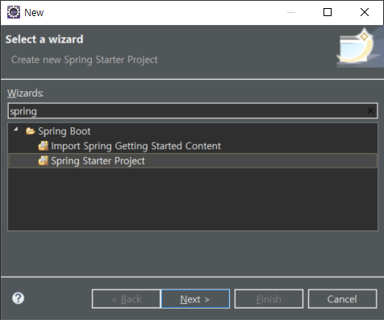
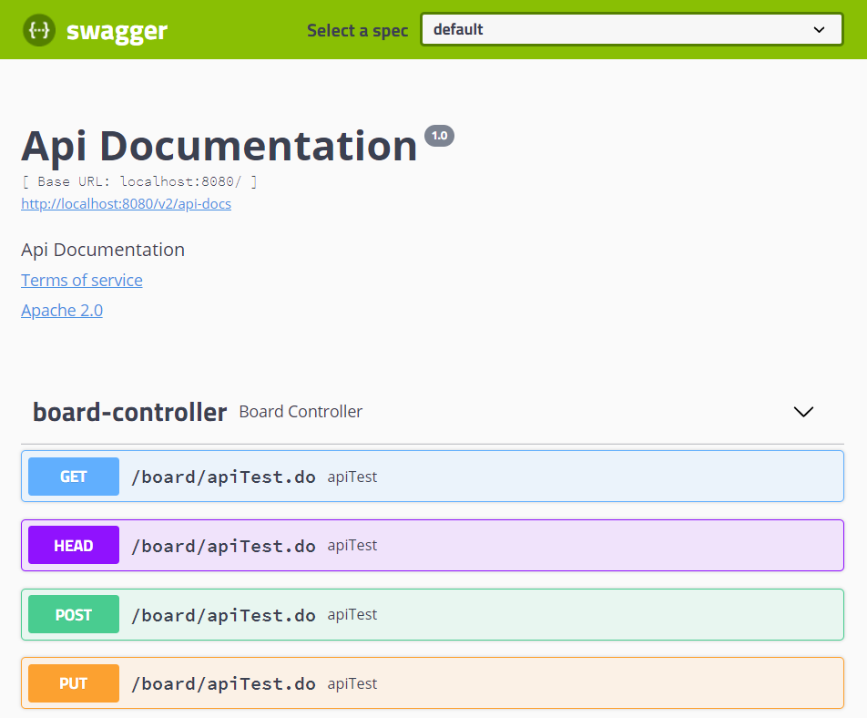
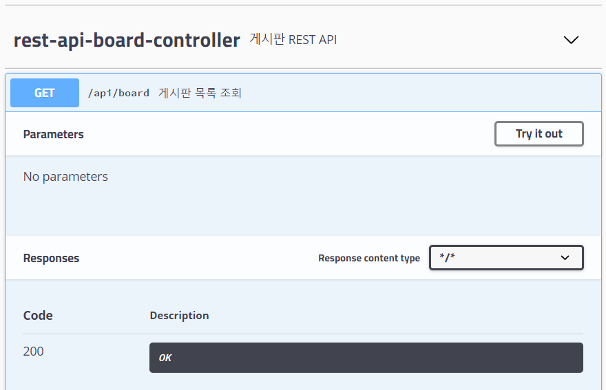

# Spring Boot

## 스프링 프로파일

로컬, 개발, 운영, 테스트 등등의 환경에 맞는 설정을 미리 정의하고, 실행 또는 패키징 시 원하는 설정을 이용할 수 있도록 지정하는 것

개발할 때 필요한 것과 운영할 때 필요한 것이 다를 수 있다.


### 설정 파일을 분리

```
application.properties → application-dev.properties        ⇐ 개발용 (모든 로그를 출력)	
                         application-production.properties ⇐ 운영용 (에러만 출력)
```


#### 개발 환경에서 사용할 설정 정보

→ DB와 관련된 로그를 이쁘게 출력하도록 하고, Thymeleaf와 resources의 캐시를 사용하지 않도록 설정


/board/src/main/resources/application-dev.properties

```properties
spring.datasource.hikari.driver-class-name=net.sf.log4jdbc.sql.jdbcapi.DriverSpy
spring.datasource.hikari.jdbc-url=jdbc:log4jdbc:mysql://localhost:3306/springbootdb?useUnicode=true&characterEncoding=utf-8&serverTimezone=Asia/Seoul
spring.datasource.hikari.username=root
spring.datasource.hikari.password=root

spring.thymeleaf.cache=false
spring.resources.cache.period=0
```


#### 운영 환경에서 사용할 설정 정보

→ DB와 관련된 로그를 이쁘게 출력하지 않아도 되고, Thymeleaf와 resources의 캐시를 사용


/board/src/main/resources/application-production.properties

```properties
spring.datasource.hikari.driver-class-name=com.mysql.cj.jdbc.Driver
spring.datasource.hikari.jdbc-url=jdbc:mysql://localhost:3306/springbootdb?useUnicode=true&characterEncoding=utf-8&serverTimezone=Asia/Seoul
spring.datasource.hikari.username=root
spring.datasource.hikari.password=root
```


#### 애플리케이션이 실행될 때 적용할 설정 파일을 지정

/board/src/main/resources/application.properties

```properties
# 애플리케이션이 실행될 때 적용될 설정을 지정
spring.profiles.active=dev

# 환경이 바뀌어도 동일하게 적용될 설정을 지정
spring.jpa.database=mysql
spring.jpa.database-platform=org.hibernate.dialect.MySQL5InnoDBDialect
spring.jpa.generate-ddl=true
spring.jpa.hibernate.use-new-id-generator-mappings=false

spring.datasource.hikari.connection-test-query=select 1

mybatis.configuration.map-underscore-to-camel-case=true
```


#### 테스트

spring.profiles.active의 값을 dev로 했을 때와 production으로 했을 때 생성되는 로그 형식을 비교


### 프로파일에 따라 로그 설정도 변경

개발 환경에서는 모든 로그가 출력되도록 하고, 운영 환경에서는 에러 관련 로그만 출력되도록 수정


/board/src/main/resources/logback-spring.xml

```xml
<?xml version="1.0" encoding="UTF-8" ?>
<configuration debug="true">
	<appender name="console" class="ch.qos.logback.core.ConsoleAppender">
		<encoder>
			<Pattern>%d %5p [%c] %m%n</Pattern>
		</encoder>
	</appender>
	
	<appender name="console-infolog" class="ch.qos.logback.core.ConsoleAppender">
		<encoder>
			<Pattern>%d %5p %m%n</Pattern>
		</encoder>
	</appender>
	
	<springProfile name="dev">
		<logger name="board" level="DEBUG" appender-ref="console" />
		<logger name="jdbc.sqlonly" level="DEBUG" appender-ref="console-infolog" />
		<logger name="jdbc.resultsettable" level="INFO" appender-ref="console-infolog" />
		<logger name="jdbc.sqltiming" level="DEBUG" appender-ref="console-infolog" />
	</springProfile>
	
	<springProfile name="production">
		<logger name="board" level="ERROR" appender-ref="console" />
	</springProfile>	
	
	<root level="off">
		<appender-ref ref="console" />
	</root>	
</configuration>
```


```
  .   ____          _            __ _ _
 /\\ / ___'_ __ _ _(_)_ __  __ _ \ \ \ \
( ( )\___ | '_ | '_| | '_ \/ _` | \ \ \ \
 \\/  ___)| |_)| | | | | || (_| |  ) ) ) )
  '  |____| .__|_| |_|_| |_\__, | / / / /
 =========|_|==============|___/=/_/_/_/
 :: Spring Boot ::        (v2.2.6.RELEASE)

2020-04-23 20:13:51,122  INFO [board.BoardApplication] Starting BoardApplication on DESKTOP-U4D3D30 with PID 5584 (C:\eclipse-workspace\board\bin\main started by TTak in C:\eclipse-workspace\board)
2020-04-23 20:13:51,122 DEBUG [board.BoardApplication] Running with Spring Boot v2.2.6.RELEASE, Spring v5.2.5.RELEASE
2020-04-23 20:13:51,122  INFO [board.BoardApplication] The following profiles are active: dev
2020-04-23 20:13:51,588 DEBUG [jdbc.sqlonly]  com.zaxxer.hikari.pool.PoolBase.executeSql(PoolBase.java:573)
51. select 1
```

어떤 profile이 적용되었는지 확인 가능하다.


## twelve-factor app 방법론

https://12factor.net/ko/


## Spring Cloud Config

설정을 분리해서 설정 정보만 가지는 서버와 이 설정 정보를 필요로 하는 클라이언트로 구성

설정 정보 서버는 설정 정보에 변경이 생기면 클라이언트에게 변경된 정보를 제공


### 설정(properties) 파일을 YAML 파일로 변경

/board/src/main/resources/application.yml

```yaml
server:
  port: 8080

spring:
  datasource:
    connection-test-query: select 1
  jpa:
    database: mysql
    database-platform: org.hibernate.dialect.MySQL5InnoDBDialect
    generate-ddl: true
    hibernate:
      use-new-id-generator-mappings: false

mybatis:
  configuration:
    map-underscore-to-camel-case: true

---
spring:
  profiles: dev
  datasource:
    hikari:
      driver-class-name: net.sf.log4jdbc.sql.jdbcapi.DriverSpy
      jdbc-url: jdbc:log4jdbc:mysql://localhost:3306/springbootdb?useUnicode=true&characterEncoding=utf-8&serverTimezone=Asia/Seoul
      username: root
      password: root
  thymeleaf:
    cache: false
  resources:
    cache:
      period: 0
      
---
spring:
  profiles: production
  datasource:
    hikari:
      driver-class-name: com.mysql.cj.jdbc.Driver
      jdbc-url: jdbc:mysql://localhost:3306/springbootdb?useUnicode=true&characterEncoding=utf-8&serverTimezone=Asia/Seoul
      username: root
      password: root
```

YAML은 Tab을 쓰면 오류가 난다.


### 설정 파일 삭제

application.properties, application-dev.properties, application-production.properties 파일을 삭제


### PropertySource 삭제

/board/src/main/java/board/configuration/DatabaseConfiguration.java

```java
@Configuration
// @PropertySource("classpath:/application.properties")
@EnableTransactionManagement
public class DatabaseConfiguration {
    		:
```


### 로그 설정 파일 분리

\<springProfile> 속성을 이용해서 개발환경과 운영환경의 로거를 분리 → 파일로 분리

개발환경 로거 ⇒ logback-dev.xml

운영환경 로거 ⇒ logback-production.xml


/board/src/main/resources/logback-dev.xml

```xml
<?xml version="1.0" encoding="UTF-8" ?>
<configuration debug="true">
	<appender name="console" class="ch.qos.logback.core.ConsoleAppender">
		<encoder>
			<Pattern>%d %5p [%c] %m%n</Pattern>
		</encoder>
	</appender>
	
	<appender name="console-infolog" class="ch.qos.logback.core.ConsoleAppender">
		<encoder>
			<Pattern>%d %5p %m%n</Pattern>
		</encoder>
	</appender>
	
	<logger name="board" level="DEBUG" appender-ref="console" />
	<logger name="jdbc.sqlonly" level="DEBUG" appender-ref="console-infolog" />
	<logger name="jdbc.resultsettable" level="INFO" appender-ref="console-infolog" />
	<logger name="jdbc.sqltiming" level="DEBUG" appender-ref="console-infolog" />
	
	<root level="off">
		<appender-ref ref="console" />
	</root>	
</configuration>
```


/board/src/main/resources/logback-production.xml

```xml
<?xml version="1.0" encoding="UTF-8" ?>
<configuration debug="true">
	<appender name="console" class="ch.qos.logback.core.ConsoleAppender">
		<encoder>
			<Pattern>%d %5p [%c] %m%n</Pattern>
		</encoder>
	</appender>
	
	<appender name="console-infolog" class="ch.qos.logback.core.ConsoleAppender">
		<encoder>
			<Pattern>%d %5p %m%n</Pattern>
		</encoder>
	</appender>
	
	<logger name="board" level="ERROR" appender-ref="console" />
	
	<root level="off">
		<appender-ref ref="console" />
	</root>	
</configuration>
```


### appliction.yml 파일에 로거 설정을 추가

/board/src/main/resources/application.yml (상단에 추가)

```yaml
loggin:
  config: classpath:logback-${spring.profiles.active}.xml
				:
```


### 액티브 프로파일을 지정

YML 파일이나 properties 파일에 사용할 액티브 프로파일(애플리케이션이 실행될 때 사용할 프로파일)을 지정


Profile을 dev로 설정


### Profile(dev, production)에 따라서 로그가 다르게 출력되는 것을 확인

Profile을 dev로 설정 => Run

Profile을 production으로 설정 => Run


### Spring Cloud Config Server 생성

File => New => Other...




### Config Server 설정

/cloud-config/src/main/java/cloudconfig/CloudConfigApplication.java

```java
package cloudconfig;

import org.springframework.boot.SpringApplication;
import org.springframework.boot.autoconfigure.SpringBootApplication;
import org.springframework.cloud.config.server.EnableConfigServer;

@SpringBootApplication
@EnableConfigServer		// Config Server 역할을 수행
public class CloudConfigApplication {

	public static void main(String[] args) {
		SpringApplication.run(CloudConfigApplication.class, args);
	}

}
```


application.yml (application.properties 파일의 이름을 변경)

/cloud-config/src/main/resources/application.yml

```yaml
server:
  port: 8888
  
spring:
  cloud:
    config:
      server:
        git:
          uri: 깃저장소주소
```


### 깃 저장소 생성


creating a new file 클릭


/board/src/main/resources/application.yml 내용을 추가


깃 주소 복사해서 Config Server의 application.yml 파일에 추가

Clone or download => 깃 주소 복사


/cloud-config/src/main/resources/application.yml

```yaml
server:
  port: 8888
  
spring:
  cloud:
    config:
      server:
        git:
          uri: https://github.com/profornnan/spring-config.git
```


### Config Server 동작 확인


http://localhost:8888/config-server/dev

```json
{"name":"config-server","profiles":["dev"],"label":null,"version":"96bc5b2ac554921820ba1a9a3fba4922489b4953","state":null,"propertySources":[{"name":"https://github.com/profornnan/spring-config.git/application.yml (document #1)","source":{"spring.profiles":"dev","spring.datasource.hikari.driver-class-name":"net.sf.log4jdbc.sql.jdbcapi.DriverSpy","spring.datasource.hikari.jdbc-url":"jdbc:log4jdbc:mysql://localhost:3306/springbootdb?useUnicode=true&characterEncoding=utf-8&serverTimezone=Asia/Seoul","spring.datasource.hikari.username":"root","spring.datasource.hikari.password":"mysql","spring.thymeleaf.cache":false,"spring.resources.cache.period":0}},{"name":"https://github.com/profornnan/spring-config.git/application.yml (document #0)","source":{"loggin.config":"classpath:logback-${spring.profiles.active}.xml","server.port":8080,"spring.datasource.connection-test-query":"select 1","spring.jpa.database":"mysql","spring.jpa.database-platform":"org.hibernate.dialect.MySQL5InnoDBDialect","spring.jpa.generate-ddl":true,"spring.jpa.hibernate.use-new-id-generator-mappings":false,"mybatis.configuration.map-underscore-to-camel-case":true}}]}
```


http://localhost:8888/config-server/production

```json
{"name":"config-server","profiles":["production"],"label":null,"version":"96bc5b2ac554921820ba1a9a3fba4922489b4953","state":null,"propertySources":[{"name":"https://github.com/profornnan/spring-config.git/application.yml (document #2)","source":{"spring.profiles":"production","spring.datasource.hikari.driver-class-name":"com.mysql.cj.jdbc.Driver","spring.datasource.hikari.jdbc-url":"jdbc:mysql://localhost:3306/springbootdb?useUnicode=true&characterEncoding=utf-8&serverTimezone=Asia/Seoul","spring.datasource.hikari.username":"root","spring.datasource.hikari.password":"mysql"}},{"name":"https://github.com/profornnan/spring-config.git/application.yml (document #0)","source":{"loggin.config":"classpath:logback-${spring.profiles.active}.xml","server.port":8080,"spring.datasource.connection-test-query":"select 1","spring.jpa.database":"mysql","spring.jpa.database-platform":"org.hibernate.dialect.MySQL5InnoDBDialect","spring.jpa.generate-ddl":true,"spring.jpa.hibernate.use-new-id-generator-mappings":false,"mybatis.configuration.map-underscore-to-camel-case":true}}]}
```


### Config Client 적용

의존성 추가

/board/build.gradle

```gradle
			:
dependencies {
	implementation 'org.springframework.boot:spring-boot-starter-data-jpa'
	implementation 'org.springframework.boot:spring-boot-starter-thymeleaf'
	implementation 'org.springframework.boot:spring-boot-starter-web'
	implementation 'org.mybatis.spring.boot:mybatis-spring-boot-starter:2.1.2'
	compileOnly 'org.projectlombok:lombok'
	developmentOnly 'org.springframework.boot:spring-boot-devtools'
	runtimeOnly 'mysql:mysql-connector-java'
	annotationProcessor 'org.springframework.boot:spring-boot-configuration-processor'
	annotationProcessor 'org.projectlombok:lombok'
	testImplementation('org.springframework.boot:spring-boot-starter-test') {
		// exclude group: 'org.junit.vintage', module: 'junit-vintage-engine'
	}
	
	compile 'org.bgee.log4jdbc-log4j2:log4jdbc-log4j2-jdbc4.1:1.16'
	compile 'commons-io:commons-io:2.5'
	compile 'commons-fileupload:commons-fileupload:1.3.3'
	
	implementation 'org.springframework.boot:spring-boot-starter-actuator'
	implementation 'org.springframework.cloud:spring-cloud-starter-config'
}

ext {
	springCloudVersion = 'Finchley.RELEASE'
}

dependencyManagement {
	imports {
		mavenBom "org.springframework.cloud:spring-cloud-dependencies:${springCloudVersion}"
	}
}
			:
```

/board/build.gradle 마우스 오른쪽 클릭 => Gradle => Refresh Gradle Project


### bootstrap.yml 파일 생성 및 application.yml 파일 삭제

/board/src/main/resources/application.yml 삭제


/board/src/main/resources/bootstrap.yml 생성

```yaml
spring:
  profiles: dev
  cloud:
    config: 
      uri: http://localhost:8888
      name: cloud-config
```


### cloud-config 실행 후 board 실행

게시판이 실행되는지 확인


git 에 등록된 application.yml 내용을 수정한 후 board 재실행했을 때 변경 내용이 반영되는지 확인

```yaml
loggin:
  config: classpath:logback-${spring.profiles.active}.xml

server:
  port: 9999
  		:
```


http://localhost:9999/jpa/board


application.yml 파일의 port 설정 8080으로 되돌리기


## 스웨거(swagger)

간단한 설정으로 프로젝트의 API 목록을 웹으로 확인하고 테스트할 수 있도록 도와주는 라이브러리


### 라이브러리 추가

/board/build.gradle

```gradle
			:
dependencies {
	implementation 'org.springframework.boot:spring-boot-starter-data-jpa'
	implementation 'org.springframework.boot:spring-boot-starter-thymeleaf'
	implementation 'org.springframework.boot:spring-boot-starter-web'
	implementation 'org.mybatis.spring.boot:mybatis-spring-boot-starter:2.1.2'
	compileOnly 'org.projectlombok:lombok'
	developmentOnly 'org.springframework.boot:spring-boot-devtools'
	runtimeOnly 'mysql:mysql-connector-java'
	annotationProcessor 'org.springframework.boot:spring-boot-configuration-processor'
	annotationProcessor 'org.projectlombok:lombok'
	testImplementation('org.springframework.boot:spring-boot-starter-test') {
		// exclude group: 'org.junit.vintage', module: 'junit-vintage-engine'
	}
	
	compile 'org.bgee.log4jdbc-log4j2:log4jdbc-log4j2-jdbc4.1:1.16'
	compile 'commons-io:commons-io:2.5'
	compile 'commons-fileupload:commons-fileupload:1.3.3'
	
	implementation 'org.springframework.boot:spring-boot-starter-actuator'
	implementation 'org.springframework.cloud:spring-cloud-starter-config'
	
	compile 'io.springfox:springfox-swagger2:2.9.2'
	compile 'io.springfox:springfox-swagger-ui:2.9.2'
}
			:
```


### Refresh Gradle Project


### Swagger 설정

/board/src/main/java/board/configuration/SwaggerConfiguration.java

```java
package board.configuration;

import org.springframework.context.annotation.Bean;
import org.springframework.context.annotation.Configuration;

import springfox.documentation.builders.PathSelectors;
import springfox.documentation.builders.RequestHandlerSelectors;
import springfox.documentation.spi.DocumentationType;
import springfox.documentation.spring.web.plugins.Docket;
import springfox.documentation.swagger2.annotations.EnableSwagger2;

@Configuration
@EnableSwagger2
public class SwaggerConfiguration {

	@Bean
	public Docket api() {
		return new Docket(DocumentationType.SWAGGER_2)
				.select()
				/* board 패키지 내에 있는 RequestMapping으로 할당된 모든 URL을 선택 */
				.apis(RequestHandlerSelectors.basePackage("board"))
				/* 특정 경로가 아닌 모든 URL을 선택 */
				.paths(PathSelectors.any())
				.build();
	}
}
```


### 스웨거 문서를 확인

http://localhost:8080/swagger-ui.html




현재 생성된 문서로는 해당 데이터 및 메서드의 용도를 파악하기 어렵다. → 설명을 추가


/board/src/main/java/board/controller/RestApiBoardController.java

```java
package board.controller;

import java.util.HashMap;
import java.util.List;

import org.springframework.beans.factory.annotation.Autowired;
import org.springframework.web.bind.annotation.PathVariable;
import org.springframework.web.bind.annotation.RequestBody;
import org.springframework.web.bind.annotation.RequestMapping;
import org.springframework.web.bind.annotation.RequestMethod;
import org.springframework.web.bind.annotation.RestController;

import board.dto.BoardDto;
import board.service.BoardService;
import io.swagger.annotations.Api;
import io.swagger.annotations.ApiOperation;
import io.swagger.annotations.ApiParam;

@Api(description = "게시판 REST API")
@RestController
public class RestApiBoardController {
	
	@Autowired
	private BoardService boardService;

	@ApiOperation(value = "게시판 목록 조회")
	@RequestMapping(value = "/api/board", method = RequestMethod.GET)
	public List<BoardDto> openBoardList() throws Exception {
		return boardService.selectBoardList();
	}

	@ApiOperation(value = "게시글 작성")
	@RequestMapping(value = "/api/board/write", method = RequestMethod.POST)
	public void insertBoard(@RequestBody BoardDto board) throws Exception {
		boardService.insertBoard(board, null);
	}

	@ApiOperation(value = "게시글 상세 조회")
	@RequestMapping(value = "/api/board/{boardIdx}", method = RequestMethod.GET)
	public BoardDto openBoardDetail(@PathVariable("boardIdx") @ApiParam(value = "게시글 번호") int boardIdx) throws Exception {
		return boardService.selectBoardDetail(boardIdx);
	}

	@RequestMapping(value = "/api/board/{boardIdx}", method = RequestMethod.PUT)
	public BoardDto updateBoard(@RequestBody BoardDto board) throws Exception {
		boardService.updateBoard(board);
		int boardIdx = board.getBoardIdx();
		return boardService.selectBoardDetail(boardIdx);
	}

	@RequestMapping(value = "/api/board/{boardIdx}", method = RequestMethod.DELETE)
	public HashMap deleteBoard(@PathVariable("boardIdx") int boardIdx) throws Exception {
		HashMap hm = new HashMap();
		try {
			boardService.deleteBoard(boardIdx);
			hm.put("result", "success");
		} catch (Exception e) {
			hm.put("reusult", "fail");
			throw e;
		}
		return hm;
	}
}
```


/board/src/main/java/board/dto/BoardDto.java

```java
package board.dto;

import java.util.List;

import io.swagger.annotations.ApiModel;
import io.swagger.annotations.ApiModelProperty;
import lombok.Data;

@ApiModel(value = "BoardDto: 게시글 내용", description = "게시글 내용")
@Data
public class BoardDto {
	@ApiModelProperty(value = "게시글 번호")
	private int boardIdx;
	@ApiModelProperty(value = "게시글 제목")
	private String title;
	@ApiModelProperty(value = "게시글 내용")
	private String contents;
	private int hitCnt; 		// hit_cnt		
	private String creatorId;	// creator_id	
	private String createdDatetime;
	private String updaterId;	
	private String updatedDatetime;
	
	// 첨부 파일 정보를 담고 있는 목록
	private List<BoardFileDto> fileInfoList;
}
```


### 스웨거를 이용한 기능 테스트



Try it out 클릭


Execute 클릭


