# Spring Boot

## TDD (Test-Driven Development 테스트 주도 개발)

TDD Kata

http://butunclebob.com/ArticleS.UncleBob.TheBowlingGameKata


### TDD 주기

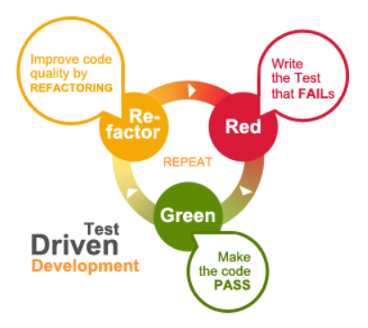


### TDD 목표

⇒ Clean Code that Works!

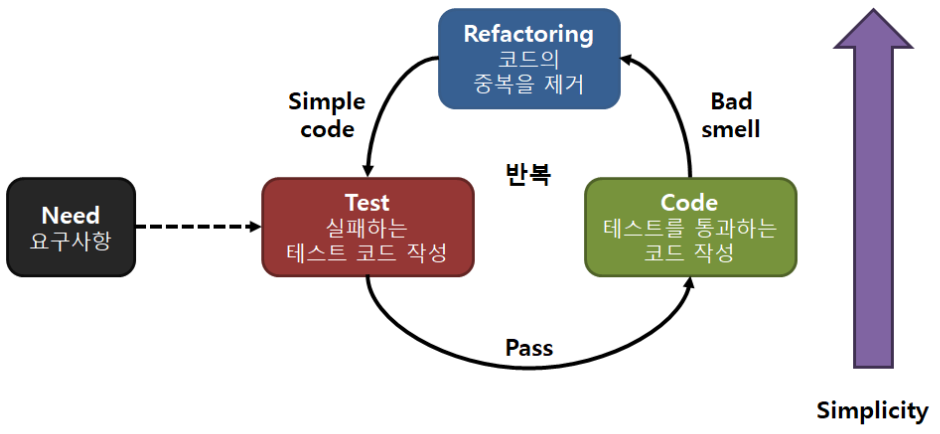


### xUnit, JUnit

* xUnit
  * 언어별 다양한 단위 테스트 도구가 존재
  * JUnit, NUnit, CPPUnit, PyUnit, VBUnit, PearlUnit 등
* JUnit
  * 1997년 에릭 감마와 켄트 백이 제작
  * Java를 위한 단위 테스트 프레임워크
  * 문자 혹운 GUI 기반으로 실행
  * 단정문으로 테스트 케이스의 수행 결과를 판별
  * 어노테이션으로 간결하게 지원
  * 결과를 성공(녹색), 실패(붉은색) 중 하나로 표시


### JUnit Annotation

https://junit.org/junit5/docs/current/user-guide/#writing-tests-annotations

| 어노테이션                | 설명                                                         |
| ------------------------- | ------------------------------------------------------------ |
| @Test                     | 실행할 테스트 메소드 앞에 붙임                               |
| @Test(expected)           | 발생할 것으로 예상되는 예외를 지정. 예외가 발생하지 않으면 실패 |
| @Test(timedout)           | 테스트가 끝나는 시간을 예측. 지정된 시간보다 길게 테스트가 진행되면 실패 |
| @Ignore                   | 다음에 오는 테스트를 무시. 테스트를 하지 않을 메소드 앞에 붙임 |
| @Before, @After           | 각 단위 테스트 메소드의 실행 전후에 초기화와 자원정리 작업을 수행 |
| @BeforeClass, @AfterClass | 각 단위 테스트 클래스의 실행 전후에 초기화와 자원정리 작업을 수행 |
| @RunWith                  | 지정된 러너가 아닌 사용자가 지정한 러너를 통해 특정 클래스를 실행 |
| @SuiteClasses             | 테스트하려고 하는 여러 클래스를 지정                         |
| @Parameters               | 여러 개의 파라미터 값을 테스트하려고 할 때 자동적으로 테스트를 실행 |


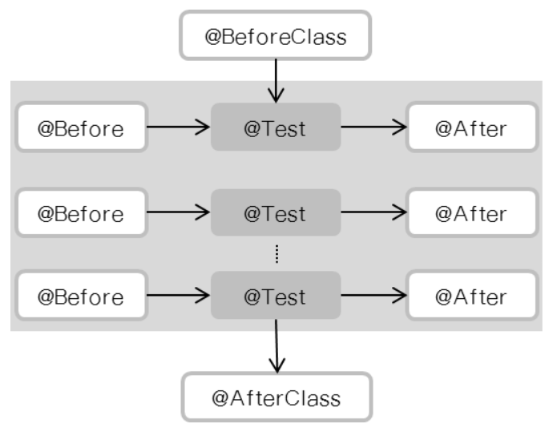


### JUnit Method

http://junit.sourceforge.net/javadoc/org/junit/Assert.html

| 메소드                         | 설명                                                         |
| ------------------------------ | ------------------------------------------------------------ |
| assertEquals(A, B)             | A와 B가 일치하는지를 조사한다. A나 B에는 Object, int, float, long, char, boolean, ... 등의 모든 자료형이 들어갈 수 있다. 단 A, B의 타입은 언제나 같아야만 한다. |
| assertTrue(X)                  | X가 참인지를 조사한다. X는 boolean 형태의 값이어야 한다.     |
| assertFalse(X)                 | X가 거짓인지를 조사한다. X는 boolean 형태의 값이어야 한다.   |
| fail(message)                  | 테스트가 위 문장을 만나면 message를 출력하고 무조건 실패하도록 한다. |
| assertNotNull(Object X)        | X가 Null이 아닌지를 조사한다. 만약 Null이 아니라면 assertionFailedError가 발생한다. |
| assertNull(Object X)           | X가 Null인지를 조사한다. 만약 Null이 아니라면 assertionFailedError가 발생한다. |
| assertSame(Object A, Object B) | A와 B가 같은 객체인지를 조사한다.                            |


### JUnit 실습 1

File => New => Java Project...

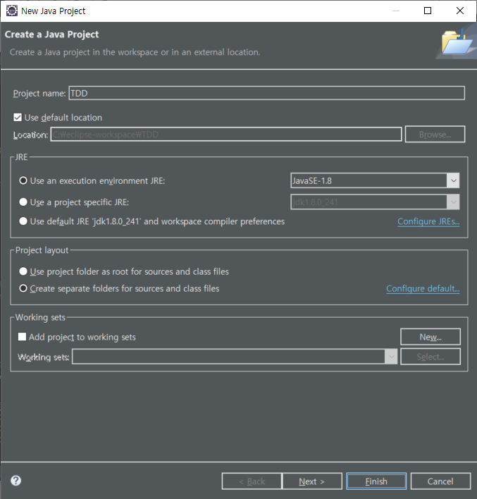


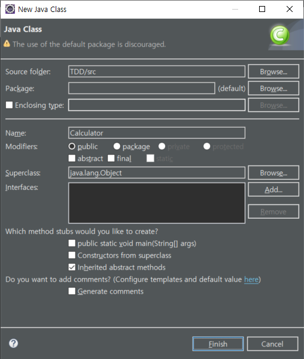


#### 프로덕트 코드

/TDD/src/Calculator.java

```java
public class Calculator {
	public int sum(int num1, int num2) {
		return num1 + num2;
	}
}
```


#### 테스트 케이스 생성

New => JUnit Test Case

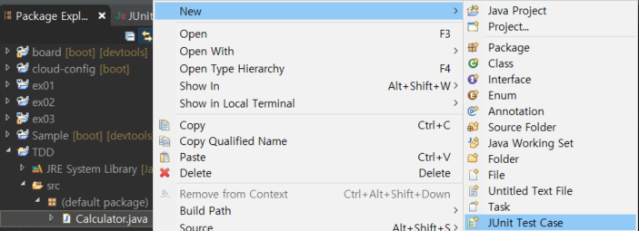


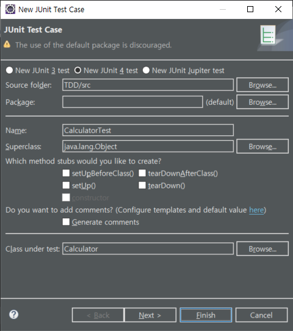


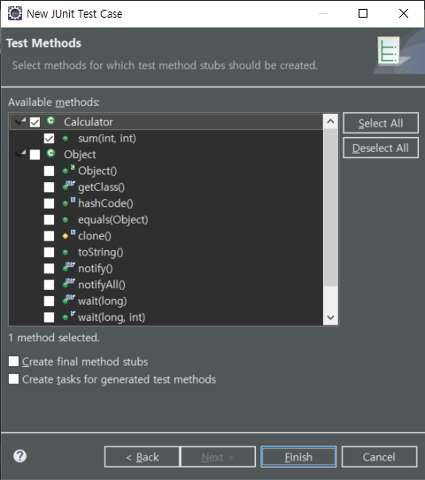


#### 단위 테스트 실행

/TDD/src/CalculatorTest.java

```java
import static org.junit.Assert.*;

import org.junit.Test;

public class CalculatorTest {

	@Test
	public void testSum() {
		fail("Not yet implemented");
	}

}
```


CalculatorTest.java 마우스 오른쪽 클릭 => Run As => JUnit Test


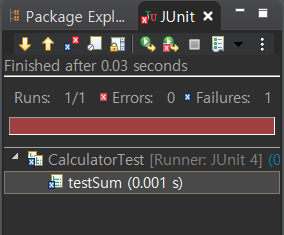


#### 단정문을 이용한 단위 테스트

/TDD/src/CalculatorTest.java

```java
import static org.junit.Assert.*;

import org.junit.Test;

public class CalculatorTest {

	@Test
	public void testSum() {
		Calculator cal = new Calculator();
		assertEquals(cal.sum(10, 20), 30);
	}

}
```


CalculatorTest.java 마우스 오른쪽 클릭 => Run As => JUnit Test


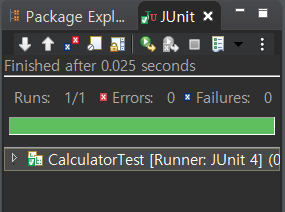


#### 어노테이션을 이용한 단위 테스트

/TDD/src/CalculatorTest.java

```java
import static org.junit.Assert.*;

import org.junit.Test;

public class CalculatorTest {

	@Test(timeout=3000)
	public void testSum() {
		Calculator cal = new Calculator();
		assertEquals(cal.sum(10, 20), 30);
	}

}
```


/TDD/src/Calculator.java

```java
public class Calculator {
	public int sum(int num1, int num2) {
		try {
			Thread.sleep(4000);
		} catch (Exception e) {}
		return num1 + num2;
	}
}
```


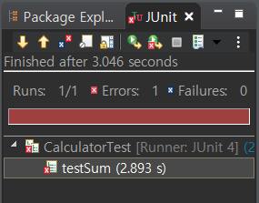


### JUnit 실습 2

#### @BeforeClass, @AfterClass, @Before, @After

/TDD/src/JUnitExamMain.java

```java
public class JUnitExamMain {
	
	private int num = 0;
	
	public JUnitExamMain(int num) {
		this.num = num;
	}
	
	public int add(int num) {
		this.num += num;
		return this.num;
	}
}
```


/TDD/src/JUnitExamTest.java

```java
import static org.junit.Assert.*;

import org.junit.After;
import org.junit.AfterClass;
import org.junit.Before;
import org.junit.BeforeClass;
import org.junit.Test;

public class JUnitExamTest {
	JUnitExamMain jem;
	
	@BeforeClass public static void setUpBeforeClass() throws Exception {
		System.out.println("setUpBeforeClass()");
	}
	@AfterClass public static void tearDownAfterClass() throws Exception {
		System.out.println("tearDownAfterClass()");
	}
	@Before public void setUp() throws Exception {
		jem = new JUnitExamMain(10);
		System.out.println("\tsetUp()");
	}
	@After public void tearDown() throws Exception {
		System.out.println("\ttearDown()");
	}
	@Test public void testAddWithNew() {
		System.out.println("\t\ttestAddWithNew() start...");
		jem = new JUnitExamMain(5);
		assertEquals(jem.add(5), 10);
		System.out.println("\t\ttestAddWithNew() end...");
	}
	@Test public void testAddWithoutNew() {
		System.out.println("\t\ttestAddWithoutNew() start...");
		assertEquals(jem.add(5), 10);
		System.out.println("\t\ttestAddWithoutNew() end...");
	}
}
```


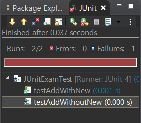


```
setUpBeforeClass()
	setUp()
		testAddWithNew() start...
		testAddWithNew() end...
	tearDown()
	setUp()
		testAddWithoutNew() start...
	tearDown()
tearDownAfterClass()
```


### TDD Example

#### factorial : 팩토리얼, 계승

* 그 수보다 작거나 같은 모든 양의 정수의 곱
* 음이 아닌 정수 n의 계승 = n! = 1 * 2 * … * n
* 0의 계승 = 0! = 1


#### To-do

factorial 기능이 제대로 동작하는지 확인하기 위한 테스트 계획을 수립

* 0! = 1
* 1! = 1
* 2! = 1 * 2
* 3! = 1 * 2 * 3
* n! = 1 * 2 * 3 * … * n
* -1! ⇒ Error


Factorial 클래스 생성

TDD 프로젝트 마우스 오른쪽 클릭 => New => Class

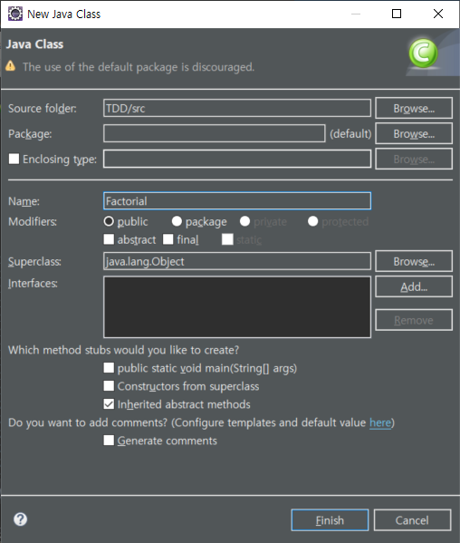


FactorialTest 클래스 생성

TDD 프로젝트 마우스 오른쪽 클릭 => New => JUnit Test Case

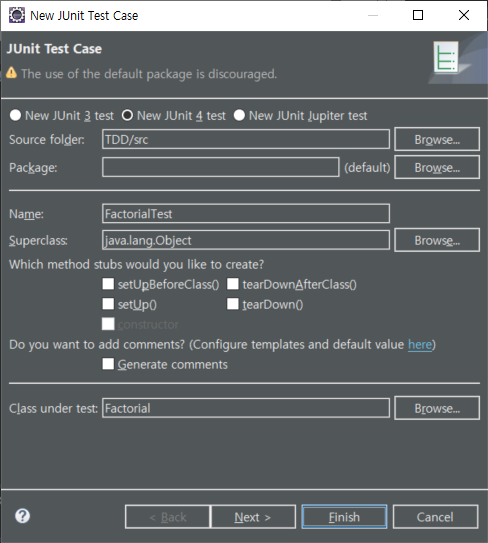


---

#### Red

/TDD/src/FactorialTest.java

```java
import static org.junit.Assert.*;

import org.junit.Test;

public class FactorialTest {
	@Test
	public void shouldReturnOneWhenZeroIn() {
		Factorial fac = new Factorial();	// 정의되지 않은 클래스
		assertEquals(1, fac.calc(0));		// 정의되지 않은 메소드
	}
}
```


#### Green

/TDD/src/Factorial.java

```java
public class Factorial {
	public int calc(int i) {
		return 1;	// 테스트를 통과하는 가장 단순한 구현
	}
}
```


#### Refactoring

* 없음


#### To-do

* ~~0! = 1~~
* 1! = 1
* 2! = 1 * 2
* 3! = 1 * 2 * 3
* n! = 1 * 2 * 3 * … * n
* -1! ⇒ Error


---

#### Red

/TDD/src/FactorialTest.java

```java
import static org.junit.Assert.*;

import org.junit.Test;

public class FactorialTest {
	@Test
	public void shouldReturnOneWhenZeroIn() {
		Factorial fac = new Factorial();
		assertEquals(1, fac.calc(0));
	}
	
	@Test
	public void shouldReturnOneWhenOneIn() {
		Factorial fac = new Factorial();
		assertEquals(1, fac.calc(1));
	}
}
```


#### Green

* 코드 수정 없이 테스트 통과


#### Refactoring

* 테스트 코드에 중복 제거

/TDD/src/FactorialTest.java

```java
import static org.junit.Assert.assertEquals;

import org.junit.Before;
import org.junit.Test;

public class FactorialTest {
	Factorial fac;
	@Before public void setup() { fac = new Factorial(); }
	@Test public void shouldReturnOneWhenZeroIn() { assertEquals(1, fac.calc(0)); }	
	@Test public void shouldReturnOneWhenOneIn () { assertEquals(1, fac.calc(1)); }
}
```


#### To-do

* ~~0! = 1~~
* ~~1! = 1~~
* 2! = 1 * 2
* 3! = 1 * 2 * 3
* n! = 1 * 2 * 3 * … * n
* -1! ⇒ Error


---

#### Red

/TDD/src/FactorialTest.java

```java
public class FactorialTest {
		:
	@Test
	public void shouldReturnTwoWhenTwoIn() {
		assertEquals(2, fac.calc(2));
	}
}
```


#### Green

/TDD/src/Factorial.java

```java
public class Factorial {
	public int calc(int i) {
		if (i < 2) return 1;
		else return 2;
	}
}
```


#### Refactoring

* 없음


#### To-do

* ~~0! = 1~~
* ~~1! = 1~~
* ~~2! = 1 * 2~~
* 3! = 1 * 2 * 3
* n! = 1 * 2 * 3 * … * n
* -1! ⇒ Error


---

#### Red

/TDD/src/FactorialTest.java

```java
public class FactorialTest {
		:
	@Test
	public void shouldReturnSixWhenThreeIn() {
		assertEquals(6, fac.calc(3));
	}
}
```


#### Green

/TDD/src/Factorial.java

```java
public class Factorial {
	public int calc(int i) {
		if (i < 2) return 1;
		else return i * calc(i - 1);
	}
}
```


#### Refactoring

* 테스트 메소드의 이름을 이해하기 쉬운 이름으로 변경

/TDD/src/FactorialTest.java

```java
public class FactorialTest {
	Factorial fac;
	@Before public void setup() { fac = new Factorial(); }
	@Test public void 팩토리얼_0은_1() { assertEquals(1, fac.calc(0)); }	
	@Test public void 팩토리얼_1은_1() { assertEquals(1, fac.calc(1)); }
	@Test public void 팩토리얼_2는_2() { assertEquals(2, fac.calc(2)); }
	@Test public void 팩토리얼_3은_6() { assertEquals(6, fac.calc(3)); }
}
```


* 불필요한 구문(else) 삭제

/TDD/src/Factorial.java

```java
public class Factorial {
	public int calc(int i) {
		if (i < 2) return 1;
		return i * calc(i - 1);
	}
}
```


#### To-do

* ~~0! = 1~~
* ~~1! = 1~~
* ~~2! = 1 * 2~~
* ~~3! = 1 * 2 * 3~~
* n! = 1 * 2 * 3 * … * n
* -1! ⇒ Error


---

#### Red

/TDD/src/FactorialTest.java

```java
public class FactorialTest {
		:
	@Test
	public void 팩토리얼_10은_3628800() {
		assertEquals(3628800, fac.calc(10));
	}
}
```


#### Green

* 코드 수정 없이 테스트 통과


#### Refactoring

* 없음


#### To-do

* ~~0! = 1~~
* ~~1! = 1~~
* ~~2! = 1 * 2~~
* ~~3! = 1 * 2 * 3~~
* ~~n! = 1 * 2 * 3 * … * n~~
* -1! ⇒ Error


---

#### Red

/TDD/src/FactorialTest.java

```java
public class FactorialTest {
		:
	@Test(expected=IllegalArgumentException.class)
	public void 팩토리얼_음수는_예외발생() {
		fac.calc(-1);
	}
}
```


#### Green

/TDD/src/Factorial.java

```java
public class Factorial {
	public int calc(int i) {
		if (i < 0)
			throw new IllegalArgumentException("잘못된 입력입니다.");
		if (i < 2) return 1;
		return i * calc(i - 1);
	}
}
```


#### Refactoring

* 테스트 함수 단순화

/TDD/src/FactorialTest.java

```java
import static org.junit.Assert.assertEquals;

import org.junit.Before;
import org.junit.Test;

public class FactorialTest {
	Factorial fac;
	@Before public void setup() { fac = new Factorial(); }
	@Test(expected=IllegalArgumentException.class)
	public void 팩토리얼_음수는_예외발생() {
		fac.calc(-1);
	}
	@Test
	public void 팩토리얼_0과_양수() {
		int values[][] = {{0, 1}, {1, 1}, {2, 2}, {3, 6}, {10, 3628800}};
		for (int[] value : values) {
			assertEquals(value[1], fac.calc(value[0]));
		}
	}
}
```


#### To-do

* ~~0! = 1~~
* ~~1! = 1~~
* ~~2! = 1 * 2~~
* ~~3! = 1 * 2 * 3~~
* ~~n! = 1 * 2 * 3 * … * n~~
* ~~-1! ⇒ Error~~


