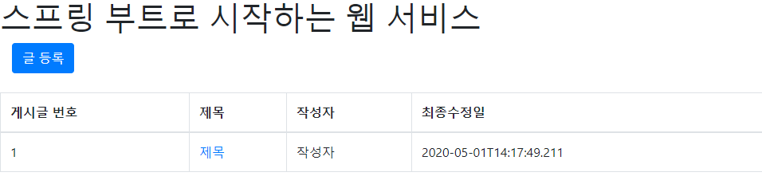
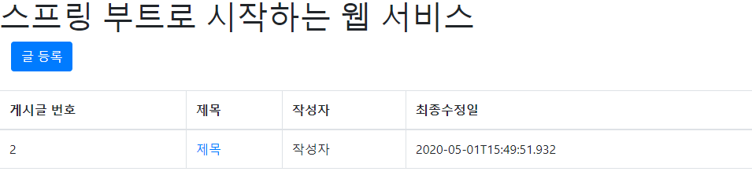

# Spring Boot

## 프로젝트 생성

Window => Preferences


File => New => Other...


Finish 버튼 클릭


/springboot/build.gradle

```gradle
plugins {
	id 'org.springframework.boot' version '2.2.6.RELEASE'
	id 'io.spring.dependency-management' version '1.0.9.RELEASE'
	id 'java'
	id 'war'
}

group = 'com.example'
version = '0.0.1-SNAPSHOT'
sourceCompatibility = '1.8'

repositories {
	mavenCentral()
}

dependencies {
	implementation 'org.springframework.boot:spring-boot-starter-web'
	providedRuntime 'org.springframework.boot:spring-boot-starter-tomcat'
	testImplementation 'org.springframework.boot:spring-boot-starter-test'
	testRuntimeOnly 'org.junit.platform:junit-platform-launcher'
}

test {
	useJUnitPlatform()
}
```


build.gradle 마우스 오른쪽 클릭 => Gradle => Refresh Gradle Project


### Hello Controller


/springboot/src/main/java/springboot/web/HelloController.java

```java
package springboot.web;

import org.springframework.web.bind.annotation.GetMapping;
import org.springframework.web.bind.annotation.RestController;

@RestController
public class HelloController {
	
	// @RequestMapping(value = "/hello", method = RequestMethod.GET)
	// @RequestMapping("/hello")
	@GetMapping("/hello")
	public String hello() {
		return "hello";
	}
}
```


### 실행

SpringbootApplication.java 마우스 오른쪽 클릭 => Run As => Spring Boot App


http://localhost:8080/hello


### HelloControllerTest


/springboot/src/test/java/springboot/web/HelloControllerTest.java

```java
package springboot.web;

import org.junit.Test;
import org.junit.runner.RunWith;
import org.springframework.beans.factory.annotation.Autowired;
import org.springframework.boot.test.autoconfigure.web.servlet.WebMvcTest;
import org.springframework.test.context.junit4.SpringRunner;
import org.springframework.test.web.servlet.MockMvc;
import org.springframework.test.web.servlet.request.MockMvcRequestBuilders;
import org.springframework.test.web.servlet.result.MockMvcResultMatchers;

// 스프링부트 테스트와 JUnit 사이에 연결자 역할
@RunWith(SpringRunner.class)
// @Controller, @ControllerAdvice 와 같은 애노테이션을 사용할 수 있도록 지원
@WebMvcTest
public class HelloControllerTest {

	@Autowired
	private MockMvc mockMvc;
	
	@Test
	public void hello_리턴된다() throws Exception {
		mockMvc.perform(MockMvcRequestBuilders.get("/hello"))
			.andExpect(MockMvcResultMatchers.status().isOk())
			.andExpect(MockMvcResultMatchers.content().string("hello"));
	}

}
```


### 테스트 실행

HelloControllerTest.java 마우스 오른쪽 클릭 => Run As => JUnit Test


### Lombok 설치

build.gradle

```gradle
		:
dependencies {
	implementation 'org.springframework.boot:spring-boot-starter-web'
	providedRuntime 'org.springframework.boot:spring-boot-starter-tomcat'
	testImplementation 'org.springframework.boot:spring-boot-starter-test'
	testRuntimeOnly 'org.junit.platform:junit-platform-launcher'
	
	compile 'org.projectlombok:lombok'
}
		:
```


Refresh Gradle Project


### HelloResponseDto 추가


/springboot/src/main/java/springboot/web/dto/HelloResponseDto.java

```java
package springboot.web.dto;

import lombok.Getter;
import lombok.RequiredArgsConstructor;

// @Getter : 선언된 필드의 get 메서드를 생성
// @RequiredArgsConstructor : final로 선언된 필드가 포함된 생성자를 생성
// 예) public HelloResponseDto(String name, int amount) { ... }
@Getter
@RequiredArgsConstructor
public class HelloResponseDto {
	private final String name;
	private final int amount;
}
```


### HelloResponseDto 테스트 코드 작성 및 테스트


/springboot/src/test/java/springboot/web/dto/HelloResponseDtoTest.java

```java
package springboot.web.dto;

import static org.junit.Assert.*;

import org.assertj.core.api.Assertions;
import org.junit.Test;

public class HelloResponseDtoTest {

	@Test
	public void 롬복_기능_테스트() {
		// give
		String name = "test";
		int amount = 1000;
		
		// when
		HelloResponseDto dto = new HelloResponseDto(name, amount);
		
		// then
		Assertions.assertThat(dto.getName()).isEqualTo(name);
		Assertions.assertThat(dto.getAmount()).isEqualTo(amount);
	}

}
```


### HelloController에서 HelloResponseDto를 사용하도록 추가

/springboot/src/main/java/springboot/web/HelloController.java

```java
package springboot.web;

import org.springframework.web.bind.annotation.GetMapping;
import org.springframework.web.bind.annotation.RequestParam;
import org.springframework.web.bind.annotation.RestController;

import springboot.web.dto.HelloResponseDto;

@RestController
public class HelloController {
	
	// @RequestMapping(value = "/hello", method = RequestMethod.GET)
	// @RequestMapping("/hello")
	@GetMapping("/hello")
	public String hello() {
		return "hello";
	}
	
	// http://localhost:8080/hello/dto?name=ooo&amount=ooo
	@GetMapping("/hello/dto")
	public HelloResponseDto helloDto(@RequestParam("name") String name, @RequestParam("amount") int amount) {
		// { "name" : "ooo", "amount" : ooo }
		return new HelloResponseDto(name, amount);
	}
}
```


### Dto를 이용하는 테스트 코드 작성 및 테스트 수행

/springboot/src/test/java/springboot/web/HelloControllerTest.java

```java
package springboot.web;

import org.hamcrest.Matchers;
import org.junit.Test;
import org.junit.runner.RunWith;
import org.springframework.beans.factory.annotation.Autowired;
import org.springframework.boot.test.autoconfigure.web.servlet.WebMvcTest;
import org.springframework.test.context.junit4.SpringRunner;
import org.springframework.test.web.servlet.MockMvc;
import org.springframework.test.web.servlet.request.MockMvcRequestBuilders;
import org.springframework.test.web.servlet.result.MockMvcResultMatchers;

// 스프링부트 테스트와 JUnit 사이에 연결자 역할
@RunWith(SpringRunner.class)
// @Controller, @ControllerAdvice 와 같은 애노테이션을 사용할 수 있도록 지원
@WebMvcTest
public class HelloControllerTest {

	@Autowired
	private MockMvc mockMvc;
	
	@Test
	public void hello_리턴된다() throws Exception {
		mockMvc.perform(MockMvcRequestBuilders.get("/hello"))
			.andExpect(MockMvcResultMatchers.status().isOk())
			.andExpect(MockMvcResultMatchers.content().string("hello"));
	}
	
	@Test
	public void helloDto가_리턴된다() throws Exception {
		final String name = "hello";
		final int amount = 1000;
		
		// param(String param_name, String param_value) : 요청 파라미터를 설정할 때 사용
		// jsonPath : JSON 응답값을 필드별로 검증할 수 있는 메서드 ($를 기준으로 필드명을 명시)
		// { "name" : "hello", "amount" : 1000 }
		mockMvc.perform(MockMvcRequestBuilders.get("/hello/dto").param("name", name).param("amount", String.valueOf(amount)))
		.andExpect(MockMvcResultMatchers.status().isOk())
		.andExpect(MockMvcResultMatchers.jsonPath("$.name", Matchers.is(name)))
		.andExpect(MockMvcResultMatchers.jsonPath("$.amount", Matchers.is(amount)));
	}
}
```


## 프로젝트에 Spring Data JPA 적용

### build.gradle

org.springframework.boot:spring-boot-starter-data-jpa와 com.h2database:h2 의존성을 등록


/springboot/build.gradle

```gradle
		:
dependencies {
	implementation 'org.springframework.boot:spring-boot-starter-web'
	providedRuntime 'org.springframework.boot:spring-boot-starter-tomcat'
	testImplementation 'org.springframework.boot:spring-boot-starter-test'
	testRuntimeOnly 'org.junit.platform:junit-platform-launcher'
	
	compile 'org.projectlombok:lombok'
	compile 'org.springframework.boot:spring-boot-starter-data-jpa'
    compile 'com.h2database:h2'
}
		:
```


Refresh Gradle Project


### Entity 클래스 생성


/springboot/src/main/java/springboot/domain/posts/Posts.java

```java
package springboot.domain.posts;

import javax.persistence.Column;
import javax.persistence.Entity;
import javax.persistence.GeneratedValue;
import javax.persistence.GenerationType;
import javax.persistence.Id;

import lombok.Builder;
import lombok.Getter;
import lombok.NoArgsConstructor;

@Getter
@NoArgsConstructor
@Entity
public class Posts {
	
	@Id
	@GeneratedValue(strategy = GenerationType.IDENTITY)
	private Long id;
	
	@Column(length = 500, nullable = false)
	private String title;
	
	@Column(columnDefinition = "TEXT", nullable = false)
	private String content;
	
	private String author;
	
	@Builder
	public Posts(String title, String content, String author) {
		this.title = title;
		this.content = content;
		this.author = author;
	}
	
	public void update(String title, String content) {
		this.title = title;
		this.content = content;
	}
}
```


@Builder ⇒ 빌더 패턴의 클래스를 생성 → 필드값을 명확하게 지정하는 것이 가능

예)

```java
public class PostsTest {

	@Test
	public void test() {
		Posts posts = Posts.builder().author("작성자").content("내용").title("제목").build();
		assertEquals("제목", posts.getTitle());
	}

}
```


### Repository 생성


/springboot/src/main/java/springboot/domain/posts/PostsRepository.java

```java
package springboot.domain.posts;

import org.springframework.data.jpa.repository.JpaRepository;

public interface PostsRepository extends JpaRepository<Posts, Long> {

}
```


### 테스트 코드 작성 및 테스트 실행


/springboot/src/test/java/springboot/domain/posts/PostsRepositoryTest.java

```java
package springboot.domain.posts;

import java.util.List;

import org.assertj.core.api.Assertions;
import org.junit.After;
import org.junit.Test;
import org.junit.runner.RunWith;
import org.springframework.beans.factory.annotation.Autowired;
import org.springframework.boot.test.context.SpringBootTest;
import org.springframework.test.context.junit4.SpringRunner;

@RunWith(SpringRunner.class)
@SpringBootTest
public class PostsRepositoryTest {

	@Autowired
	PostsRepository postsRepository;
	
	@After
	public void cleanup() {
		postsRepository.deleteAll();
	}
		
	@Test
	public void 게시글저장_불러오기() {
		String title = "테스트 제목";
		String content = "테스트 내용";
		
		postsRepository.save(Posts.builder().title(title).content(content).author("홍길동").build());
		List<Posts> postsList = postsRepository.findAll();
		
		Posts posts = postsList.get(0);	
		Assertions.assertThat(posts.getTitle()).isEqualTo(title);
		Assertions.assertThat(posts.getContent()).isEqualTo(content);
	}

}
```


### 쿼리 실행 로그가 출력되도록 변경

/springboot/src/main/resources/application.properties

```properties
spring.jpa.show-sql=true
```


PostsRepositoryTest.java 마우스 오른쪽 클릭 => Run As => JUnit Test


```
2020-04-28 08:54:21.085  INFO 8824 --- [           main] s.domain.posts.PostsRepositoryTest       : Started PostsRepositoryTest in 15.962 seconds (JVM running for 19.039)
Hibernate: insert into posts (id, author, content, title) values (null, ?, ?, ?)
Hibernate: select posts0_.id as id1_0_, posts0_.author as author2_0_, posts0_.content as content3_0_, posts0_.title as title4_0_ from posts posts0_
Hibernate: select posts0_.id as id1_0_, posts0_.author as author2_0_, posts0_.content as content3_0_, posts0_.title as title4_0_ from posts posts0_
Hibernate: delete from posts where id=?
2020-04-28 08:54:22.840  INFO 8824 --- [extShutdownHook] o.s.s.concurrent.ThreadPoolTaskExecutor  : Shutting down ExecutorService 'applicationTaskExecutor'
2020-04-28 08:54:22.841  INFO 8824 --- [extShutdownHook] j.LocalContainerEntityManagerFactoryBean : Closing JPA EntityManagerFactory for persistence unit 'default'
2020-04-28 08:54:22.842  INFO 8824 --- [extShutdownHook] .SchemaDropperImpl$DelayedDropActionImpl : HHH000477: Starting delayed evictData of schema as part of SessionFactory shut-down'
Hibernate: drop table posts if exists
2020-04-28 08:54:22.860  INFO 8824 --- [extShutdownHook] com.zaxxer.hikari.HikariDataSource       : HikariPool-1 - Shutdown initiated...
2020-04-28 08:54:22.866  INFO 8824 --- [extShutdownHook] com.zaxxer.hikari.HikariDataSource       : HikariPool-1 - Shutdown completed.
```


---


springboot 프로젝트 하위에 있는 모든 테스트가 수행된다.

새로운 기능을 추가했을 때 다른 기능에 영향이 있는지 확인할 수 있다.


## 스프링 웹 계층


* Web Layer
  * Controller, JSP와 같은 뷰 템플릿 영역
  * 필터(@Filter), 인터셉터, 컨트롤러 어드바이스(@ControllerAdvice) 등 **외부 요청과 응답**에 대한 전반적인 영역
* Service Layer
  * @Service에 사용되는 서비스 영역
  * Controller와 DAO(Data Access Object)의 중간 영역
  * @Transaction이 사용되어야 하는 영역
* Repository Layer
  * DB와 같은 데이터 저장소에 접근하는 영역
  * 기존의 DAO와 같은 영역
* DTO(Data Transfer Object)
  * 계층간 데이터 교환을 위한 객체
  * 뷰 템플릿 엔진에서 사용될 객체, Repository Layer에서 결과로 넘겨주는 객체 등
* Domain Model
  * 도메인이라고 불리는 개발 대상을 모든 사람이 동일한 관점에서 이해할 수 있고 공유할 수 있도록 단순화시킨 것
  * @Entity를 이용해서 표현


## 등록 API 만들기

### DTO 생성


/springboot/src/main/java/springboot/web/dto/PostsSaveRequestDto.java

```java
package springboot.web.dto;

import lombok.Builder;
import lombok.Getter;
import lombok.NoArgsConstructor;
import springboot.domain.posts.Posts;

@Getter
@NoArgsConstructor
public class PostsSaveRequestDto {
	
	private String title;
	private String content;
	private String author;
	
	@Builder
	public PostsSaveRequestDto(String title, String content, String author) {
		this.title = title;
		this.content = content;
		this.author = author;
	}
	
	public Posts toEntity() {
		return Posts.builder().title(this.title).content(this.content).author(this.author).build();
	}
}
```


### Controller 생성


/springboot/src/main/java/springboot/web/PostsApiController.java

```java
package springboot.web;

import org.springframework.web.bind.annotation.PostMapping;
import org.springframework.web.bind.annotation.RequestBody;
import org.springframework.web.bind.annotation.RestController;

import lombok.RequiredArgsConstructor;
import springboot.service.PostsService;
import springboot.web.dto.PostsSaveRequestDto;

@RequiredArgsConstructor
@RestController
public class PostsApiController {

	private final PostsService postsService;
	
	// POST 방식(method)은 요청 본문(request body)에 서버로 전달되는 내용(request parameter)을 포함해서 전달하는 방식
	@PostMapping("/api/v1/posts")
	public Long save(@RequestBody PostsSaveRequestDto requestDto) {
		return postsService.save(requestDto);
	}
}
```


### Service 생성


/springboot/src/main/java/springboot/service/PostsService.java

```java
package springboot.service;

import org.springframework.stereotype.Service;
import org.springframework.transaction.annotation.Transactional;

import lombok.RequiredArgsConstructor;
import springboot.domain.posts.PostsRepository;
import springboot.web.dto.PostsSaveRequestDto;

@RequiredArgsConstructor
@Service
public class PostsService {

	private final PostsRepository postsRepository;
	
	@Transactional
	public Long save(PostsSaveRequestDto requestDto) {
		return postsRepository.save(requestDto.toEntity()).getId();
	}
}
```


### 테스트 생성


/springboot/src/test/java/springboot/web/PostsApiControllerTest.java

```java
package springboot.web;

import java.util.List;
import java.util.Optional;

import org.assertj.core.api.Assertions;
import org.junit.After;
import org.junit.Test;
import org.junit.runner.RunWith;
import org.springframework.beans.factory.annotation.Autowired;
import org.springframework.boot.test.context.SpringBootTest;
import org.springframework.boot.test.web.client.TestRestTemplate;
import org.springframework.boot.web.server.LocalServerPort;
import org.springframework.http.HttpStatus;
import org.springframework.http.ResponseEntity;
import org.springframework.test.context.junit4.SpringRunner;

import springboot.domain.posts.Posts;
import springboot.domain.posts.PostsRepository;
import springboot.web.dto.PostsSaveRequestDto;

@RunWith(SpringRunner.class)
@SpringBootTest(webEnvironment = SpringBootTest.WebEnvironment.RANDOM_PORT)
public class PostsApiControllerTest {

	@LocalServerPort
	private int port;
	
	@Autowired
	private TestRestTemplate restTemplate;
	
	@Autowired
	private PostsRepository postsRepository;
	
	@After
	public void tearDown() throws Exception {
		postsRepository.deleteAll();		
	}
	
	@Test
	public void Posts_등록된다() throws Exception { 
		// given
		String title = "제목";
		String content = "내용";
		
		PostsSaveRequestDto requestDto = PostsSaveRequestDto.builder().title(title).content(content).author("작성자").build();
		String url = "http://localhost:" + port + "/api/v1/posts";
	
		// when
		ResponseEntity<Long> responseEntity = restTemplate.postForEntity(url, requestDto, Long.class);
		
		// then
		Assertions.assertThat(responseEntity.getStatusCode()).isEqualTo(HttpStatus.OK);
		Assertions.assertThat(responseEntity.getBody()).isGreaterThan(0L);
		
		List<Posts> all = postsRepository.findAll();
		Assertions.assertThat(all.get(0).getTitle()).isEqualTo(title);
		Assertions.assertThat(all.get(0).getContent()).isEqualTo(content);
		
		Optional<Posts> optional = postsRepository.findById(responseEntity.getBody());
		if (optional.isPresent()) {
			Posts posts = optional.get();
			Assertions.assertThat(posts.getTitle()).isEqualTo(title);
			Assertions.assertThat(posts.getContent()).isEqualTo(content);
		}
	}
}
```


PostsApiControllerTest.java 마우스 오른쪽 클릭 => Run As => JUnit Test


## 수정/조회 API 만들기

### DTO 생성

#### 데이터 수정에 사용할 DTO

클라이언트에서 서버로 전달되는 수정 데이터를 담을 DTO ⇒ 요청 본문에 들어 있는 내용을 추출하는데 사용


/springboot/src/main/java/springboot/web/dto/PostsUpdateRequestDto.java

```java
package springboot.web.dto;

import lombok.Builder;
import lombok.Getter;
import lombok.NoArgsConstructor;

@Getter
@NoArgsConstructor
public class PostsUpdateRequestDto {

	private String title;
	private String content;
	
	@Builder
	public PostsUpdateRequestDto(String title, String content) {
		this.title = title;
		this.content = content;
	}
}
```


#### 데이터 조회에 사용할 DTO

Repository에서 조회 결과를 담을 DTO


/springboot/src/main/java/springboot/web/dto/PostsResponseDto.java

```java
package springboot.web.dto;

import lombok.Getter;
import springboot.domain.posts.Posts;

@Getter
public class PostsResponseDto {

	private Long id;
	private String title;
	private String content;
	private String author;
	
	// 생성자의 파라미터로 엔티티 객체가 들어가 있는 이유
	// 레포지터리에서 실행된 쿼리 결과가 DTO로 전달되게 하기 위해서
	public PostsResponseDto(Posts entity) {
		this.id = entity.getId();
		this.title = entity.getTitle();
		this.content = entity.getContent();
		this.author = entity.getAuthor();
	}
}
```


### Controller 추가

/springboot/src/main/java/springboot/web/PostsApiController.java

```java
package springboot.web;

import org.springframework.web.bind.annotation.GetMapping;
import org.springframework.web.bind.annotation.PathVariable;
import org.springframework.web.bind.annotation.PostMapping;
import org.springframework.web.bind.annotation.PutMapping;
import org.springframework.web.bind.annotation.RequestBody;
import org.springframework.web.bind.annotation.RestController;

import lombok.RequiredArgsConstructor;
import springboot.service.PostsService;
import springboot.web.dto.PostsResponseDto;
import springboot.web.dto.PostsSaveRequestDto;
import springboot.web.dto.PostsUpdateRequestDto;

@RequiredArgsConstructor
@RestController
public class PostsApiController {

	private final PostsService postsService;
	
	// POST 방식(method)은 요청 본문(request body)에 서버로 전달되는 내용(request parameter)을 포함해서 전달하는 방식
	@PostMapping("/api/v1/posts")
	public Long save(@RequestBody PostsSaveRequestDto requestDto) {
		return postsService.save(requestDto);
	}
	
	// 조회 => GET
	@GetMapping("/api/v1/posts/{id}")
	public PostsResponseDto findById(@PathVariable Long id) {
		return postsService.findById(id);
	}
	
	// 수정 => PUT
	@PutMapping("/api/v1/posts/{id}")
	public Long update(@PathVariable Long id, @RequestBody PostsUpdateRequestDto requestDto) {
		return postsService.update(id, requestDto);
	}
}
```


### Service 추가

/springboot/src/main/java/springboot/service/PostsService.java

```java
package springboot.service;

import java.util.Optional;

import org.springframework.stereotype.Service;
import org.springframework.transaction.annotation.Transactional;

import lombok.RequiredArgsConstructor;
import springboot.domain.posts.Posts;
import springboot.domain.posts.PostsRepository;
import springboot.web.dto.PostsResponseDto;
import springboot.web.dto.PostsSaveRequestDto;
import springboot.web.dto.PostsUpdateRequestDto;

@RequiredArgsConstructor
@Service
public class PostsService {

	private final PostsRepository postsRepository;
	
	@Transactional
	public Long save(PostsSaveRequestDto requestDto) {
		return postsRepository.save(requestDto.toEntity()).getId();
	}
	
	public PostsResponseDto findById(Long id) {
		Optional<Posts> optional = postsRepository.findById(id);
		if (optional.isPresent()) {
			Posts entity = optional.get();
			return new PostsResponseDto(entity);
		} else {
			throw new IllegalArgumentException("일치하는 정보가 존재하지 않습니다.");
		}
	}

	@Transactional
	public Long update(Long id, PostsUpdateRequestDto requestDto) {
		Optional<Posts> optional = postsRepository.findById(id);
		if (optional.isPresent()) {
			Posts entity = optional.get();
			entity.update(requestDto.getTitle(), requestDto.getContent());
			return postsRepository.save(entity).getId();
		} else {
			throw new IllegalArgumentException("일치하는 정보가 존재하지 않습니다.");
		}
	}
}
```


### 테스트 추가

/springboot/src/test/java/springboot/web/PostsApiControllerTest.java

```java
		:
	@Test
	public void Posts_수정된다() throws Exception { 
		// given
		// 새 데이터를 추가
		Posts savedPosts = postsRepository.save(Posts.builder().title("title").content("content").author("author").build());
		Long updateId = savedPosts.getId();
		
		String expectedTitle = "new title";
		String expectedContent = "new content";
		
		// 수정할 데이터
		PostsUpdateRequestDto requestDto = PostsUpdateRequestDto.builder().title(expectedTitle).content(expectedContent).build();
		// 수정 API URL
		String url = "http://localhost:" + port + "/api/v1/posts/" + updateId;
		
		HttpEntity<PostsUpdateRequestDto> requestEntity = new HttpEntity<>(requestDto);
		
		// when
		ResponseEntity<Long> responseEntity = restTemplate.exchange(url, HttpMethod.PUT, requestEntity, Long.class);

		// then
		Assertions.assertThat(responseEntity.getStatusCode()).isEqualTo(HttpStatus.OK);
		Assertions.assertThat(responseEntity.getBody()).isGreaterThan(0L);
		
		List<Posts> all = postsRepository.findAll();
		Assertions.assertThat(all.get(0).getTitle()).isEqualTo(expectedTitle);
		Assertions.assertThat(all.get(0).getContent()).isEqualTo(expectedContent);
	}
		:
```


PostsApiControllerTest.java 마우스 오른쪽 클릭 => Run As => JUnit Test


### H2 웹 콘솔을 이용한 데이터 직접 추가

/springboot/src/main/resources/application.properties

```properties
spring.jpa.show-sql=true
spring.h2.console.enabled=true
```


Spring Boot App 실행


브라우저에서 http://localhost:8080/h2-console 로 접속


jdbc:h2:mem:testdb

Connect 버튼 클릭


직접 데이터를 추가

```sql
insert into posts (author, content, title) values ('author', 'content', 'title');
```

Run 버튼 클릭


웹 페이지를 통해서 데이터를 조회

http://localhost:8080/api/v1/posts/1


## JPA Auditing으로 생성시간/수정시간 자동화

Date, Calendar → JodaTime → LocalDate, LocalDateTime


### BaseTimeEntity 클래스를 생성

모든 엔티티의 생성시간(createdDate)과 수정시간(modifiedDate)을 자동으로 관리하는 클래스를 정의


/springboot/src/main/java/springboot/domain/BaseTimeEntity.java

```java
package springboot.domain;

import java.time.LocalDateTime;

import javax.persistence.EntityListeners;
import javax.persistence.MappedSuperclass;

import org.springframework.data.annotation.CreatedDate;
import org.springframework.data.annotation.LastModifiedDate;
import org.springframework.data.jpa.domain.support.AuditingEntityListener;

import lombok.Getter;

@Getter
// 해당 클래스(BaseTimeEntity)에 정의된 필드(createdDate, modifiedDate)가 
// 해당 클래스를 상속받은 JPA 엔티티 클래스에서 컬럼으로 인식되도록 지정
@MappedSuperclass
// 해당 클래스(BaseTimeEntity)에 Auditing 기능을 포함
@EntityListeners(AuditingEntityListener.class)
public class BaseTimeEntity {
	
	// 엔티티가 생성되어 저장될 때 시간이 자동으로 설정
	@CreatedDate
	private LocalDateTime createdDate;
	
	// 조회한 엔티티의 값을 변경할 때 시간이 자동으로 설정
	@LastModifiedDate
	private LocalDateTime modifiedDate;
}
```


### Posts 클래스가 BaseTimeEntity를 상속

/springboot/src/main/java/springboot/domain/posts/Posts.java

```java
package springboot.domain.posts;

import javax.persistence.Column;
import javax.persistence.Entity;
import javax.persistence.GeneratedValue;
import javax.persistence.GenerationType;
import javax.persistence.Id;

import lombok.Builder;
import lombok.Getter;
import lombok.NoArgsConstructor;
import springboot.domain.BaseTimeEntity;

@Getter
@NoArgsConstructor
@Entity
public class Posts extends BaseTimeEntity {
    		:
```


### JPA Auditing 활성화

/springboot/src/main/java/springboot/SpringbootApplication.java

```java
package springboot;

import org.springframework.boot.SpringApplication;
import org.springframework.boot.autoconfigure.SpringBootApplication;
import org.springframework.data.jpa.repository.config.EnableJpaAuditing;

@EnableJpaAuditing
@SpringBootApplication
public class SpringbootApplication {
    		:
```


### JPA Auditing 테스트 코드 작성

/springboot/src/test/java/springboot/domain/posts/PostsRepositoryTest.java

```java
			:
	@Test
	public void BaseTimeEntity_등록() {
		// given
		// 1) 현재(등록 시점) 시간
		LocalDateTime now = LocalDateTime.now();		
		// 등록 => 2) 데이터가 저장(생성)되는 시간이 DB에 기록
		postsRepository.save(Posts.builder().title("title").content("content").author("author").build());
		
		// when
		List<Posts> postsList = postsRepository.findAll();
		
		// then
		// 1) 시간 보다 2) 시간이 이후인지 확인
		Posts posts = postsList.get(0);
		Assertions.assertThat(posts.getCreatedDate()).isAfter(now);
		Assertions.assertThat(posts.getModifiedDate()).isAfter(now);
	}
			:
```


PostsRepositoryTest.java 마우스 오른쪽 클릭 => Run As => JUnit Test


## 머스테치(mustache)

http://mustache.github.io/

많은 언어를 지원하는 가장 심플한 템플릿 엔진

⇒ 서버(Java)와 클라이언트(JavaScript) 모두 사용이 가능

스프링 부트 진영에서 공식 지원하는 템플릿 엔진 ⇒ src/main/resources/templates 기본 폴더


### 템플릿 엔진

지정된 양식과 데이터가 결합해서 HTML 문서를 출력하는 프로그램

* 서버 사이드 템플릿 엔진 → JSP, Freemarker, Velocity, Thymeleaf, …
* 클라이언트 사이드 템플릿 엔진 → React, Vue, …


### 의존성 등록

/springboot/build.gradle

```gradle
dependencies {
	implementation 'org.springframework.boot:spring-boot-starter-web'
	providedRuntime 'org.springframework.boot:spring-boot-starter-tomcat'
	testImplementation 'org.springframework.boot:spring-boot-starter-test'
	testRuntimeOnly 'org.junit.platform:junit-platform-launcher'
	
	compile 'org.projectlombok:lombok'
	compile 'org.springframework.boot:spring-boot-starter-data-jpa'
    compile 'com.h2database:h2'
    compile 'org.springframework.boot:spring-boot-starter-mustache'
}
```


Refresh Gradle Project


### 기본 페이지 생성

#### 머스테치 파일 생성


/springboot/src/main/resources/templates/index.mustache

```mustache
<!DOCTYPE html>
<html>
<head>
	<title>스프링 부트 웹 서비스</title>
	<meta http-equip="Content-Type" content="text/html; charset=UTF-8" />
</head>
<body>
	<h1>스프링 부트로 시작하는 웹 서비스</h1>
</body>
</html>
```


#### 머스테치 파일로 URL 매핑


/springboot/src/main/java/springboot/web/IndexController.java

```java
package springboot.web;

import org.springframework.stereotype.Controller;
import org.springframework.web.bind.annotation.GetMapping;

@Controller
public class IndexController {

	@GetMapping("/")
	public String index() {
		return "index";    // <= src/main/resources/templates/index.mustache 파일을 반환
	}
}
```


### 실행 확인

SpringbootApplication.java 마우스 오른쪽 클릭 => Run As => Spring Boot App


http://localhost:8080/


### 테스트 작성

URL 호출 시 페이지 내용이 정상적으로 출력되는지 테스트


/springboot/src/test/java/springboot/web/IndexControllerTest.java

```java
package springboot.web;

import org.assertj.core.api.Assertions;
import org.junit.Test;
import org.junit.runner.RunWith;
import org.springframework.beans.factory.annotation.Autowired;
import org.springframework.boot.test.context.SpringBootTest;
import org.springframework.boot.test.context.SpringBootTest.WebEnvironment;
import org.springframework.boot.test.web.client.TestRestTemplate;
import org.springframework.test.context.junit4.SpringRunner;

@RunWith(SpringRunner.class)
@SpringBootTest(webEnvironment = WebEnvironment.RANDOM_PORT)
public class IndexControllerTest {

	@Autowired
	private TestRestTemplate restTemplate;
	
	@Test
	public void 메인페이지_로딩() {
		String html = this.restTemplate.getForObject("/", String.class);
		System.out.println(html);
		
		Assertions.assertThat(html).contains("<h1>스프링 부트로 시작하는 웹 서비스</h1>");
	}
}
```


### 게시판 등록 화면 생성

부트스트랩, jQuery를 이용해서 제작

레이아웃 방식 사용 ⇒ 공통 영역을 별도의 파일로 분리하고 필요한 곳에서 가져다 쓰는 방식


#### 레이아웃 파일 생성


참고

https://getbootstrap.com/docs/4.4/getting-started/introduction/


/springboot/src/main/resources/templates/layout/header.mustache

```mustache
<!DOCTYPE html>
<html>
<head>
	<title>스프링 부트 웹 서비스</title>
	<meta http-equip="Content-Type" content="text/html; charset=UTF-8" />
	<link rel="stylesheet" href="https://stackpath.bootstrapcdn.com/bootstrap/4.4.1/css/bootstrap.min.css">
</head>
<body>
```


/springboot/src/main/resources/templates/layout/footer.mustache

```mustache
	<script src="https://code.jquery.com/jquery-3.4.1.slim.min.js"></script>
	<script src="https://stackpath.bootstrapcdn.com/bootstrap/4.4.1/js/bootstrap.min.js"></script>
</body>
</html>
```


왜? CSS는 헤더에 넣고, JavaScript는 푸터에 넣을까?

⇒ 페이지 로딩 속도를 높이기 위해

⇒ \<head> → \<body> 순으로 실행


#### index.mustache 파일에 레이아웃을 적용

/springboot/src/main/resources/templates/index.mustache

```mustache
{{>layout/header}}

	<h1>스프링 부트로 시작하는 웹 서비스</h1>
	<div class="col-md-12">
		<div class="row">
			<div class="col-md-6">
				<a href="/posts/save" role="button" class="btn btn-primary">글 등록</a>
			</div>
		</div>
	</div>

{{>layout/footer}}
```


http://localhost:8080/


### 글 등록 컨트롤러 추가

/springboot/src/main/java/springboot/web/IndexController.java

```java
package springboot.web;

import org.springframework.stereotype.Controller;
import org.springframework.web.bind.annotation.GetMapping;

@Controller
public class IndexController {

	@GetMapping("/")
	public String index() {
		return "index";    // <= src/main/resources/templates/index.mustache 파일을 반환
	}
	
	@GetMapping("/posts/save")
	public String postsSave() {
		return "posts-save";
	}
}
```


### 글 작성 페이지를 생성

/springboot/src/main/resources/templates/posts-save.mustache

```mustache
{{>layout/header}}

	<h1>게시글 등록</h1>
	<div class="col-md-12">
		<div class="col-md-4">
			<form>
				<div class="form-group">
					<label for="title">제목</label>
					<input type="text" class="form-control" id="title" placeholder="제목을 입력하세요.">
				</div>
				<div class="form-group">
					<label for="author">작성자</label>
					<input type="text" class="form-control" id="author" placeholder="작성자를 입력하세요.">
				</div>
				<div class="form-group">
					<label for="content">내용</label>
					<input type="text" class="form-control" id="content" placeholder="내용을 입력하세요.">
				</div>
			</form>
			<a href="/" role="button" class="btn btn-secondary">취소</a>
			<button type="button" class="btn btn-primary" id="btn-save">등록</button>
		</div>
	</div>

{{>layout/footer}}
```


### JavaScript 추가


/springboot/src/main/resources/static/js/app/index.js

```js
var index = {
	init: function() {
		var _this = this;
		$('#btn-save').on('click', function() {
			_this.save();
		});
	},
	save: function() {
		var data = {
			title: $('#title').val(),
			content: $('#content').val(),
			author: $('#author').val()
		};
		/*
		console.log(data);
		console.log(typeof data);
		console.log(JSON.stringify(data));
		console.log(typeof JSON.stringify(data));
		*/
		/* https://api.jquery.com/jquery.ajax/ */
		/* JSON.stringify() : JavaScript 값 또는 객체를 JSON 문자열로 변환하는 함수 */
		$.ajax({
			type: 'POST',					/* 요청 방식(request method) */
			url: '/api/v1/posts', 			/* URL 주소 */
			dataType: 'JSON', 				/* 서버의 응답으로 기대하는 데이터 타입 */
			contentType: 'application/json; charset=UTF-8',	/* 서버로 요청할 때 요청 데이터의 타입 */
			data: JSON.stringify(data)		/* 서버로 전달할 데이터 (요청 본문에 포함됨) */
		}).done(function() {
			alert('글이 등록되었습니다.');
			window.location.href = "/";
		}).fail(function(e) {
			alert(JSON.stringify(e));
		});
	}
};

index.init();
```


### index.js를 footer에 포함

/springboot/src/main/resources/templates/layout/footer.mustache

```mustache
	<script src="https://code.jquery.com/jquery-3.4.1.min.js"></script>
	<script src="https://stackpath.bootstrapcdn.com/bootstrap/4.4.1/js/bootstrap.min.js"></script>
	<script src="/js/app/index.js"></script>
</body>
</html>
```

ajax 통신을 하기 위해 slim을 지운다. => jquery-3.4.1.min.js


### 등록 테스트


http://localhost:8080/h2-console


## 전체 조회 기능 구현 (목록 조회)

### 조회 화면

/springboot/src/main/resources/templates/index.mustache

```mustache
{{>layout/header}}

	<h1>스프링 부트로 시작하는 웹 서비스</h1>
	<div class="col-md-12">
		<div class="row">
			<div class="col-md-6">
				<a href="/posts/save" role="button" class="btn btn-primary">글 등록</a>
			</div>
		</div>
	</div>
	<br>
	<!-- 목록 출력 -->
	<table class="table table-horizontal table-bordered">
	<thead class="thead-strong">
		<tr>
			<th>게시글 번호</th>
			<th>제목</th>
			<th>작성자</th>
			<th>최종수정일</th>
		</tr>	
	</thead>	
	<tbody id="tbody">
	{{#posts}}
		<tr>
			<td>{{id}}</td>
			<td>{{title}}</td>
			<td>{{author}}</td>
			<td>{{modifiedDate}}</td>
		</tr>
	{{/posts}}
	</tbody>
	</table>
	
{{>layout/footer}}
```


### 목록 조회 기능 구현

#### 레포지터리 수정

/springboot/src/main/java/springboot/domain/posts/PostsRepository.java

```java
package springboot.domain.posts;

import java.util.List;

import org.springframework.data.jpa.repository.JpaRepository;
import org.springframework.data.jpa.repository.Query;

public interface PostsRepository extends JpaRepository<Posts, Long> {

	@Query("SELECT p FROM Posts p ORDER BY p.id DESC")
	List<Posts> findAllDesc();
}
```


#### Dto 추가

레퍼지터리에서 읽어 온 (조회해 온) 데이터를 화면으로 전달하는 Dto


/springboot/src/main/java/springboot/web/dto/PostsListResponseDto.java

```java
package springboot.web.dto;

import java.time.LocalDateTime;

import lombok.Getter;
import springboot.domain.posts.Posts;

@Getter
public class PostsListResponseDto {

	private Long id;
	private String title;
	private String content;
	private String author;
	private LocalDateTime modifiedDate;
	
	public PostsListResponseDto(Posts entity) {
		this.id = entity.getId();
		this.title = entity.getTitle();
		this.content = entity.getContent();
		this.author = entity.getAuthor();
		this.modifiedDate = entity.getModifiedDate();
	}
}
```


#### 서비스 수정

/springboot/src/main/java/springboot/service/PostsService.java

```java
@RequiredArgsConstructor
@Service
public class PostsService {

	private final PostsRepository postsRepository;
	
	@Transactional(readOnly = true)
	public List<PostsListResponseDto> findAllDesc() {
		/* 옛날 방식 */
		/*
		List results = new ArrayList();
		List<Posts> list = postsRepository.findAllDesc();
		for (int i = 0; i < list.size(); i++) {
			Posts post = list.get(i);
			PostsListResponseDto dto = new PostsListResponseDto(post);
			results.add(dto);
		}
		return results;
		*/
		
		return postsRepository.findAllDesc().stream().map(posts -> new PostsListResponseDto(posts)).collect(Collectors.toList());
		/* 한번 더 축약 */
		// return postsRepository.findAllDesc().stream().map(PostsListResponseDto::new).collect(Collectors.toList());
	}
    		:
```


#### Controller 추가

/springboot/src/main/java/springboot/web/IndexController.java

```java
package springboot.web;

import org.springframework.stereotype.Controller;
import org.springframework.ui.Model;
import org.springframework.web.bind.annotation.GetMapping;

import lombok.RequiredArgsConstructor;
import springboot.service.PostsService;

@RequiredArgsConstructor
@Controller
public class IndexController {
	
	private final PostsService postsService;
	
	@GetMapping("/")
	public String index(Model model) {
		model.addAttribute("posts", postsService.findAllDesc());
		return "index";
	}

	@GetMapping("/posts/save")
	public String postsSave() {
		return "posts-save";
	}
}
```


## 게시글 수정

### 수정 화면 생성

/springboot/src/main/resources/templates/posts-update.mustache

```mustache
{{>layout/header}}

	<h1>게시글 수정</h1>
	<div class="col-md-12">
		<div class="col-md-4">
			<form>
				<div class="form-group">
					<label for="id">글번호</label>
					<input type="text" class="form-control" id="id" value="{{post.id}}" readonly />
				</div>
				<div class="form-group">
					<label for="title">제목</label>
					<input type="text" class="form-control" id="title" value="{{post.title}}" />
				</div>
				<div class="form-group">
					<label for="author">작성자</label>
					<input type="text" class="form-control" id="author" value="{{post.author}}" readonly />
				</div>
				<div class="form-group">
					<label for="content">내용</label>
					<input type="text" class="form-control" id="content" value="{{post.content}}" />
				</div>
			</form>
			<a href="/" role="button" class="btn btn-secondary">취소</a>
			<button type="button" class="btn btn-primary" id="btn-update">수정</button>
		</div>	
	</div>

{{>layout/footer}}
```


### JavaScript에 update 기능을 추가

/springboot/src/main/resources/static/js/app/index.js

```js
var index = {
	init: function() {
		var _this = this;
		$('#btn-save').on('click', function() {
			_this.save();
		});
		$('#btn-update').on('click', function() {
			_this.update();
		});
	},
	save: function() {
		var data = {
			title: $('#title').val(),
			content: $('#content').val(),
			author: $('#author').val()
		};
		/* https://api.jquery.com/jquery.ajax/ */
		/* JSON.stringify() : JavaScript 값 또는 객체를 JSON 문자열로 변환하는 함수 */
		$.ajax({
			type: 'POST',					/* 요청 방식(request method) */
			url: '/api/v1/posts', 			/* URL 주소 */
			dataType: 'JSON', 				/* 서버의 응답으로 기대하는 데이터 타입 */
			contentType: 'application/json; charset=UTF-8',	/* 서버로 요청할 때 요청 데이터의 타입 */
			data: JSON.stringify(data)		/* 서버로 전달할 데이터 (요청 본문에 포함됨) */
		}).done(function() {
			alert('글이 등록되었습니다.');
			window.location.href = "/";
		}).fail(function(e) {
			alert(JSON.stringify(e));
		});
	},
	update: function() {
		// PostsUpdateRequestDto 객체에 값이 전달
		// PostsApiController.update()를 통해서 전달
		var data = {
			title: $("#title").val(),
			content: $("#content").val()
		};
		var id = $("#id").val();
		$.ajax({
			type: "PUT",
			url: "/api/v1/posts/" + id,
			contentType: "application/json; charset=UTF-8",
			data: JSON.stringify(data)
		}).done(function() {
			alert("글이 수정되었습니다.");
			window.location.href = "/";
		}).fail(function(e) {
			alert(JSON.stringify(e));
		});		
	}
};

index.init();
```


### 목록 화면에 수정 화면으로 이동하는 링크 추가

게시판 목록에서 제목을 클릭하면 수정 화면(=상세 화면)으로 이동하도록 링크를 추가


/springboot/src/main/resources/templates/index.mustache

```mustache
		:
	{{#posts}}
		<tr>
			<td>{{id}}</td>
			<td><a href="/posts/update/{{id}}">{{title}}</a></td>
			<td>{{author}}</td>
			<td>{{modifiedDate}}</td>
		</tr>
	{{/posts}}
		:
```

Ctrl + h => 검색 기능

File Search

모든 파일에 대해 단어 검색 가능


### 수정 화면으로 이동을 처리하는 컨트롤러를 추가

/posts/update/{id} 패턴의 URL을 맵핑


/springboot/src/main/java/springboot/web/IndexController.java

```java
		:
	@GetMapping("/posts/update/{id}")
	public String postsUpdate(@PathVariable Long id, Model model) {
		PostsResponseDto dto = postsService.findById(id);
		model.addAttribute("post", dto);
		return "posts-update";
	}
		:
```


### 글 수정 테스트




## 게시글 삭제

### 삭제 버튼 추가

상세 화면(= 수정 화면)에 삭제 버튼을 추가


/springboot/src/main/resources/templates/posts-update.mustache

```mustache
				:
			<a href="/" role="button" class="btn btn-secondary">취소</a>
			<button type="button" class="btn btn-primary" id="btn-update">수정</button>
			<button type="button" class="btn btn-danger" id="btn-delete">삭제</button>
				:
```


### 삭제 버튼을 클릭했을 때 동작을 명시 → index.js

/springboot/src/main/resources/static/js/app/index.js

```js
var index = {
	init: function() {
		var _this = this;
        		:
		$('#btn-delete').on('click', function() {
			_this.delete();
		});
	},
				:
	delete: function() {
		var id = $('#id').val();
		$.ajax({
			type: 'DELETE', 
			url: '/api/v1/posts/' + id,
			contentType: 'application/json; charset=UTF-8',
			dataType: 'json'
		}).done(function() {
			alert('글이 삭제되었습니다.');
			window.location.href = '/';
		}).fail(function(e) {
			alert(JSON.stringify(e));
		});
	}
};
```


### 삭제 서비스 추가

/springboot/src/main/java/springboot/service/PostsService.java

```java
			:
	@Transactional
	public void delete(Long id) {
		postsRepository.deleteById(id);
	}
			:
```


### 삭제 기능을 URL 맵핑

/springboot/src/main/java/springboot/web/PostsApiController.java

```java
			:
	@DeleteMapping("/api/v1/posts/{id}")
	public Long delete(@PathVariable Long id) {
		postsService.delete(id);
		return id;
	}
			:
```


### 삭제 기능 테스트




