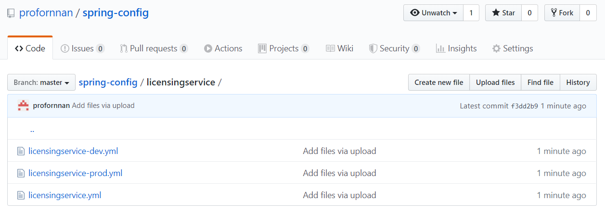
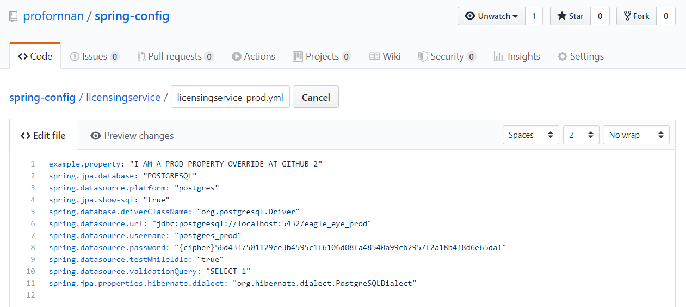
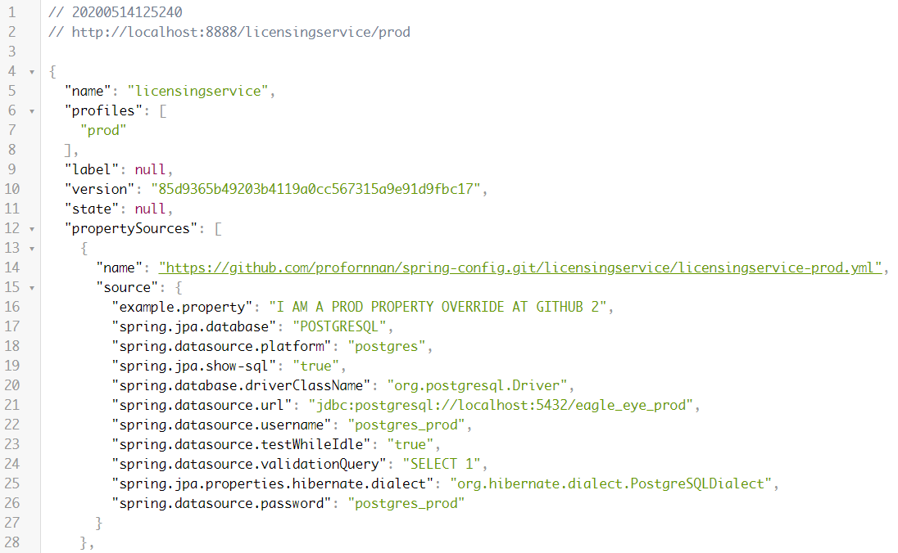

# Spring Microservice

## 실습에 사용되는 소스코드

https://github.com/gilbutITbook/006962


Chap01 실습 코드를 이클립스에 추가


simple-service


http://localhost:8080/hello/aaa/bbb


도커 데스크탑을 먼저 설치


PAGE13 에서 설정하고 있는 빌드 방법 ⇒ 스프링부트 애플리케이션이 동작하는 도커 이미지가 생성


```bash
C:\Users\TTak>cd C:\006962\spmia-chapter1

C:\006962\spmia-chapter1>mvn clean package docker:build
[INFO] Scanning for projects...
[INFO] ------------------------------------------------------------------------
[INFO] Reactor Build Order:
[INFO]
		:
[INFO] ------------------------------------------------------------------------
[INFO] Reactor Summary for thoughtmechanix-parent-pom 0.0.1-SNAPSHOT:
[INFO]
[INFO] Simple Service ..................................... FAILURE [ 10.473 s]
[INFO] thoughtmechanix-parent-pom ......................... SKIPPED
[INFO] ------------------------------------------------------------------------
[INFO] BUILD FAILURE
[INFO] ------------------------------------------------------------------------
[INFO] Total time:  10.767 s
[INFO] Finished at: 2020-05-12T14:29:28+09:00
[INFO] ------------------------------------------------------------------------
[ERROR] Failed to execute goal com.spotify:docker-maven-plugin:1.1.1:build (default-cli) on project simple-service: Exception caught: java.util.concurrent.ExecutionException: com.spotify.docker.client.shaded.javax.ws.rs.ProcessingException: com.spotify.docker.client.shaded.org.apache.http.conn.HttpHostConnectException: Connect to localhost:2375 [localhost/127.0.0.1, localhost/0:0:0:0:0:0:0:1] failed: Connection refused: connect -> [Help 1]
[ERROR]
[ERROR] To see the full stack trace of the errors, re-run Maven with the -e switch.
[ERROR] Re-run Maven using the -X switch to enable full debug logging.
[ERROR]
[ERROR] For more information about the errors and possible solutions, please read the following articles:
[ERROR] [Help 1] http://cwiki.apache.org/confluence/display/MAVEN/MojoExecutionException
```


ERROR 발생


Docker Desktop Restart


https://github.com/spotify/docker-maven-plugin ⇒ [Google's "Application Default Credentials"](https://developers.google.com/identity/protocols/application-default-credentials) ⇒ https://cloud.google.com/docs/authentication/production


https://console.cloud.google.com/


API 및 서비스 => 사용자 인증 정보 => 서비스 계정 => 서비스 계정 관리 => 서비스 계정 만들기

* 서비스 계정 세부정보
  * 서비스 계정 이름 : springboot-microservice
  * 서비스 계정 ID : springboot-microservice
  * 만들기
* 서비스 계정 권한
  * 역할 선택 : 프로젝트 - 소유자
  * 계속
* 키 만들기
  * 키 만들기
    * 키 유형 : JSON
    * 만들기
  * 완료


다운로드 받은 JSON 파일을 환경변수로 등록


시작 => 시스템 환경 변수 편집

환경 변수 => 시스템 변수 => 새로 만들기

변수이름 : GOOGLE_APPLICATION_CREDENTIALS

변수 값 : 다운로드 받은 JSON 파일 경로


명령 프롬프트를 다시 실행 후 빌드

```bash
C:\Users\TTak>cd C:\006962\spmia-chapter1

C:\006962\spmia-chapter1>mvn clean package docker:build
[INFO] Scanning for projects...
[INFO] ------------------------------------------------------------------------
[INFO] Reactor Build Order:
[INFO]
[INFO] Simple Service                                                     [jar]
[INFO] thoughtmechanix-parent-pom                                         [pom]
[INFO]
[INFO] -----------------< com.thoughtmechanix:simple-service >-----------------
[INFO] Building Simple Service 0.0.1-SNAPSHOT                             [1/2]
[INFO] --------------------------------[ jar ]---------------------------------
[INFO]
[INFO] --- maven-clean-plugin:3.0.0:clean (default-clean) @ simple-service ---
[INFO] Deleting C:\006962\spmia-chapter1\simpleservice\target
[INFO]
[INFO] --- maven-resources-plugin:3.0.1:copy-resources (copy-resources) @ simple-service ---
[INFO] Using 'UTF-8' encoding to copy filtered resources.
[INFO] Copying 2 resources
[INFO]
[INFO] --- maven-resources-plugin:3.0.1:resources (default-resources) @ simple-service ---
[INFO] Using 'UTF-8' encoding to copy filtered resources.
[INFO] skip non existing resourceDirectory C:\006962\spmia-chapter1\simpleservice\src\main\resources
[INFO] skip non existing resourceDirectory C:\006962\spmia-chapter1\simpleservice\src\main\resources
[INFO]
[INFO] --- maven-compiler-plugin:3.7.0:compile (default-compile) @ simple-service ---
[INFO] Changes detected - recompiling the module!
[INFO] Compiling 1 source file to C:\006962\spmia-chapter1\simpleservice\target\classes
[INFO]
[INFO] --- maven-resources-plugin:3.0.1:testResources (default-testResources) @ simple-service ---
[INFO] Using 'UTF-8' encoding to copy filtered resources.
[INFO] skip non existing resourceDirectory C:\006962\spmia-chapter1\simpleservice\src\test\resources
[INFO]
[INFO] --- maven-compiler-plugin:3.7.0:testCompile (default-testCompile) @ simple-service ---
[INFO] No sources to compile
[INFO]
[INFO] --- maven-surefire-plugin:2.21.0:test (default-test) @ simple-service ---
[INFO] No tests to run.
[INFO]
[INFO] --- maven-jar-plugin:3.0.2:jar (default-jar) @ simple-service ---
[INFO] Building jar: C:\006962\spmia-chapter1\simpleservice\target\simple-service-0.0.1-SNAPSHOT.jar
[INFO]
[INFO] --- spring-boot-maven-plugin:2.0.3.RELEASE:repackage (default) @ simple-service ---
[INFO]
[INFO] --- docker-maven-plugin:1.1.1:build (default-cli) @ simple-service ---
[INFO] Using authentication suppliers: [ConfigFileRegistryAuthSupplier]
[INFO] Copying C:\006962\spmia-chapter1\simpleservice\target\simple-service-0.0.1-SNAPSHOT.jar -> C:\006962\spmia-chapter1\simpleservice\target\docker\simple-service-0.0.1-SNAPSHOT.jar
[INFO] Copying C:\006962\spmia-chapter1\simpleservice\target\dockerfile\Dockerfile -> C:\006962\spmia-chapter1\simpleservice\target\docker\Dockerfile
[INFO] Copying C:\006962\spmia-chapter1\simpleservice\target\dockerfile\run.sh -> C:\006962\spmia-chapter1\simpleservice\target\docker\run.sh
[INFO] Building image johncarnell/tmx-simple-service:chapter1
Step 1/7 : FROM openjdk:8-jdk-alpine

 ---> a3562aa0b991
Step 2/7 : RUN  apk update && apk upgrade && apk add netcat-openbsd

 ---> Using cache
 ---> 4fde6ded17db
Step 3/7 : RUN mkdir -p /usr/local/simple-service

 ---> Using cache
 ---> 201a716ac991
Step 4/7 : ADD simple-service-0.0.1-SNAPSHOT.jar /usr/local/simple-service/

 ---> 90520d3b5ec2
Step 5/7 : ADD run.sh run.sh

 ---> 4e37c8d91a3c
Step 6/7 : RUN chmod +x run.sh

 ---> Running in b6800fbbfba8
Removing intermediate container b6800fbbfba8
 ---> d785be80f303
Step 7/7 : CMD ./run.sh

 ---> Running in e5c3b786d712
Removing intermediate container e5c3b786d712
 ---> 356549d2b84d
ProgressMessage{id=null, status=null, stream=null, error=null, progress=null, progressDetail=null}
Successfully built 356549d2b84d
Successfully tagged johncarnell/tmx-simple-service:chapter1
[INFO] Built johncarnell/tmx-simple-service:chapter1
[INFO]
[INFO] -----------------< com.thoughtmechanix:tmx-parent-pom >-----------------
[INFO] Building thoughtmechanix-parent-pom 0.0.1-SNAPSHOT                 [2/2]
[INFO] --------------------------------[ pom ]---------------------------------
[INFO]
[INFO] --- maven-clean-plugin:3.0.0:clean (default-clean) @ tmx-parent-pom ---
[INFO]
[INFO] --- docker-maven-plugin:1.1.1:build (default-cli) @ tmx-parent-pom ---
[INFO] Using authentication suppliers: [ConfigFileRegistryAuthSupplier]
[INFO] Project packaging is pom
[INFO] Skipping docker build
[INFO] ------------------------------------------------------------------------
[INFO] Reactor Summary for thoughtmechanix-parent-pom 0.0.1-SNAPSHOT:
[INFO]
[INFO] Simple Service ..................................... SUCCESS [ 15.181 s]
[INFO] thoughtmechanix-parent-pom ......................... SUCCESS [  0.103 s]
[INFO] ------------------------------------------------------------------------
[INFO] BUILD SUCCESS
[INFO] ------------------------------------------------------------------------
[INFO] Total time:  16.133 s
[INFO] Finished at: 2020-05-12T15:31:33+09:00
[INFO] ------------------------------------------------------------------------
```


```bash
C:\006962\spmia-chapter1>docker-compose -f docker/common/docker-compose.yml up
Creating network "common_default" with the default driver
Creating common_simpleservice_1 ... done                                                                                Attaching to common_simpleservice_1
simpleservice_1  | ********************************************************
simpleservice_1  | Starting simple-service
simpleservice_1  | ********************************************************
simpleservice_1  |
simpleservice_1  |   .   ____          _            __ _ _
simpleservice_1  |  /\\ / ___'_ __ _ _(_)_ __  __ _ \ \ \ \
simpleservice_1  | ( ( )\___ | '_ | '_| | '_ \/ _` | \ \ \ \
simpleservice_1  |  \\/  ___)| |_)| | | | | || (_| |  ) ) ) )
simpleservice_1  |   '  |____| .__|_| |_|_| |_\__, | / / / /
simpleservice_1  |  =========|_|==============|___/=/_/_/_/
simpleservice_1  |  :: Spring Boot ::        (v2.0.3.RELEASE)
simpleservice_1  |
simpleservice_1  | 2020-05-12 06:43:01.506  INFO 6 --- [           main] c.t.simpleservice.Application            : Starting Application v0.0.1-SNAPSHOT on 09ba44098958 with PID 6 (/usr/local/simple-service/simple-service-0.0.1-SNAPSHOT.jar started by root in /)
simpleservice_1  | 2020-05-12 06:43:01.522  INFO 6 --- [           main] c.t.simpleservice.Application            : No active profile set, falling back to default profiles: default
simpleservice_1  | 2020-05-12 06:43:01.810  INFO 6 --- [           main] ConfigServletWebServerApplicationContext : Refreshing org.springframework.boot.web.servlet.context.AnnotationConfigServletWebServerApplicationContext@4f47d241: startup date [Tue May 12 06:43:01 GMT 2020]; root of context hierarchy
simpleservice_1  | 2020-05-12 06:43:05.770  INFO 6 --- [           main] o.s.b.w.embedded.tomcat.TomcatWebServer  : Tomcat initialized with port(s): 8080 (http)
simpleservice_1  | 2020-05-12 06:43:05.845  INFO 6 --- [           main] o.apache.catalina.core.StandardService   : Starting service [Tomcat]
simpleservice_1  | 2020-05-12 06:43:05.845  INFO 6 --- [           main] org.apache.catalina.core.StandardEngine  : Starting Servlet Engine: Apache Tomcat/8.5.31
simpleservice_1  | 2020-05-12 06:43:05.871  INFO 6 --- [ost-startStop-1] o.a.catalina.core.AprLifecycleListener   : The APR based Apache Tomcat Native library which allows optimal performance in production environments was not found on the java.library.path: [/usr/lib/jvm/java-1.8-openjdk/jre/lib/amd64/server:/usr/lib/jvm/java-1.8-openjdk/jre/lib/amd64:/usr/lib/jvm/java-1.8-openjdk/jre/../lib/amd64:/usr/java/packages/lib/amd64:/usr/lib64:/lib64:/lib:/usr/lib]
simpleservice_1  | 2020-05-12 06:43:06.068  INFO 6 --- [ost-startStop-1] o.a.c.c.C.[Tomcat].[localhost].[/]       : Initializing Spring embedded WebApplicationContext
simpleservice_1  | 2020-05-12 06:43:06.069  INFO 6 --- [ost-startStop-1] o.s.web.context.ContextLoader            : Root WebApplicationContext: initialization completed in 4274 ms
simpleservice_1  | 2020-05-12 06:43:06.386  INFO 6 --- [ost-startStop-1] o.s.b.w.servlet.ServletRegistrationBean  : Servlet dispatcherServlet mapped to [/]
simpleservice_1  | 2020-05-12 06:43:06.397  INFO 6 --- [ost-startStop-1] o.s.b.w.servlet.FilterRegistrationBean   : Mapping filter: 'characterEncodingFilter' to: [/*]
simpleservice_1  | 2020-05-12 06:43:06.397  INFO 6 --- [ost-startStop-1] o.s.b.w.servlet.FilterRegistrationBean   : Mapping filter: 'hiddenHttpMethodFilter' to: [/*]
simpleservice_1  | 2020-05-12 06:43:06.398  INFO 6 --- [ost-startStop-1] o.s.b.w.servlet.FilterRegistrationBean   : Mapping filter: 'httpPutFormContentFilter' to: [/*]
simpleservice_1  | 2020-05-12 06:43:06.398  INFO 6 --- [ost-startStop-1] o.s.b.w.servlet.FilterRegistrationBean   : Mapping filter: 'requestContextFilter' to: [/*]
simpleservice_1  | 2020-05-12 06:43:06.866  INFO 6 --- [           main] o.s.w.s.handler.SimpleUrlHandlerMapping  : Mapped URL path [/**/favicon.ico] onto handler of type [class org.springframework.web.servlet.resource.ResourceHttpRequestHandler]
simpleservice_1  | 2020-05-12 06:43:07.375  INFO 6 --- [           main] s.w.s.m.m.a.RequestMappingHandlerAdapter : Looking for @ControllerAdvice: org.springframework.boot.web.servlet.context.AnnotationConfigServletWebServerApplicationContext@4f47d241: startup date [Tue May 12 06:43:01 GMT 2020]; root of context hierarchy
simpleservice_1  | 2020-05-12 06:43:07.605  INFO 6 --- [           main] s.w.s.m.m.a.RequestMappingHandlerMapping : Mapped "{[/hello/{firstName}/{lastName}],methods=[GET]}" onto public java.lang.String com.thoughtmechanix.simpleservice.Application.hello(java.lang.String,java.lang.String)
simpleservice_1  | 2020-05-12 06:43:07.625  INFO 6 --- [           main] s.w.s.m.m.a.RequestMappingHandlerMapping : Mapped "{[/error],produces=[text/html]}" onto public org.springframework.web.servlet.ModelAndView org.springframework.boot.autoconfigure.web.servlet.error.BasicErrorController.errorHtml(javax.servlet.http.HttpServletRequest,javax.servlet.http.HttpServletResponse)
simpleservice_1  | 2020-05-12 06:43:07.630  INFO 6 --- [           main] s.w.s.m.m.a.RequestMappingHandlerMapping : Mapped "{[/error]}" onto public org.springframework.http.ResponseEntity<java.util.Map<java.lang.String, java.lang.Object>> org.springframework.boot.autoconfigure.web.servlet.error.BasicErrorController.error(javax.servlet.http.HttpServletRequest)
simpleservice_1  | 2020-05-12 06:43:07.744  INFO 6 --- [           main] o.s.w.s.handler.SimpleUrlHandlerMapping  : Mapped URL path [/webjars/**] onto handler of type [class org.springframework.web.servlet.resource.ResourceHttpRequestHandler]
simpleservice_1  | 2020-05-12 06:43:07.746  INFO 6 --- [           main] o.s.w.s.handler.SimpleUrlHandlerMapping  : Mapped URL path [/**] onto handler of type [class org.springframework.web.servlet.resource.ResourceHttpRequestHandler]
simpleservice_1  | 2020-05-12 06:43:08.211  INFO 6 --- [           main] o.s.j.e.a.AnnotationMBeanExporter        : Registering beans for JMX exposure on startup
simpleservice_1  | 2020-05-12 06:43:08.306  INFO 6 --- [           main] o.s.b.w.embedded.tomcat.TomcatWebServer  : Tomcat started on port(s): 8080 (http) with context path ''
simpleservice_1  | 2020-05-12 06:43:08.319  INFO 6 --- [           main] c.t.simpleservice.Application            : Started Application in 8.067 seconds (JVM running for 9.392)
```


http://localhost:8080/hello/aaa/bbb


```bash
C:\006962\spmia-chapter1>docker-compose -f docker/common/docker-compose.yml down
Stopping common_simpleservice_1 ... done                                                 Removing common_simpleservice_1 ... done                                                 Removing network common_default
```


```bash
C:\006962\spmia-chapter1>docker images
REPOSITORY                       TAG                 IMAGE ID            CREATED             SIZE
johncarnell/tmx-simple-service   chapter1            0fc0028ea26d        15 minutes ago      143MB
docker                           19.03.5-dind        8489eeb24a26        3 months ago        237MB
openjdk                          8-jdk-alpine        a3562aa0b991        12 months ago       105MB
registry                         latest              f32a97de94e1        14 months ago       25.8MB

C:\006962\spmia-chapter1>docker rmi -f 0fc0028ea26d
Untagged: johncarnell/tmx-simple-service:chapter1
Deleted: sha256:0fc0028ea26dfd823e1d6639316c0ea32b0c86dfa2a9bb0bda638c3cf5dc50f7
Deleted: sha256:5714abe93222ec235a940bffba08186da75398028412040573075f6fe3725d77
Deleted: sha256:a21b568547315a69a165b41094ba0718e5c2a55765b13203499761b54e0b2177
Deleted: sha256:e9e3774f32b191ad3ccf46f3884ba6ae630ee66e3b1d5085113082a39d90f197
Deleted: sha256:d9c12cf68fc9475612dead58e1c49870a9eae2716dfd2475277b4b66af62b9a6
Deleted: sha256:947a2ab9031eeaf6a621167709ecde50e56e5b5186ddf3d109619126eea19862
Deleted: sha256:b05b602fdfa3f5f86408247bba0202fef85ee46246cf7c7cb707d6ccb85f07e8
Deleted: sha256:201a716ac99190bf4e47aae4bb9b4fe3820377765ea6b0e0f94ba9e5a577b542
Deleted: sha256:1da8fb6fcaec9626acec5b044b230f92caa408355233e991ecc2a1fe45dc97ba
Deleted: sha256:4fde6ded17db18052340fd8da3162d5c0ec5caf7836bea7a56ddba8b32a5d07b
Deleted: sha256:1c88bf48c5ec578477c5eff1ee332c8157bb860b6186744b999e88c87719e25a
```


## 모놀리식 아키텍처


## 마이크로서비스 아키텍처


스프링부트 마이크로서비스가 사용자 요청을 처리하는 일반적인 흐름


p35

spmia-chapter1\simpleservice\src\main\java\com\thoughtmechanix\simpleservice\Application.java

```java
package com.thoughtmechanix.simpleservice;

import org.springframework.boot.SpringApplication;
import org.springframework.boot.autoconfigure.SpringBootApplication;
import org.springframework.web.bind.annotation.RequestMapping;
import org.springframework.web.bind.annotation.RequestMethod;
import org.springframework.web.bind.annotation.RestController;
import org.springframework.web.bind.annotation.PathVariable;

@SpringBootApplication
@RestController
@RequestMapping(value="hello")  // Route mapping
public class Application {

    public static void main(String[] args) {
        SpringApplication.run(Application.class, args);
    }

    @RequestMapping(value="/{firstName}/{lastName}",method = RequestMethod.GET) // 경로 매핑
    public String hello( @PathVariable("firstName") String firstName,           // 매개변수 분해
                         @PathVariable("lastName") String lastName) {           // JSON → 자바 객체 

        return String.format("{\"message\":\"Hello %s %s\"}", firstName, lastName);
    }
}
```


* 애플리케이션 구축 방식을 바꾸는 이유
  * 복잡성이 증가했다.
  * 고객은 더 빠른 출시를 원한다.
  * 성능 및 확장성
  * 고객은 애플리케이션을 항상 사용할 수 있길 기대한다.
* 마이크로서비스
  * 작고 단순하며 분리된 서비스
  * 확장 가능하고 회복적이며 유연한 애플리케이션


p44


* 적정 크기
* 위치 투명성
* 회복성
* 반복성
* 확장성


### 마이크로서비스 핵심 개발 패턴


* 서비스 세분성
* 통신 프로토콜
* 인터페이스 설계
* 서비스 간 이벤트 프로세싱


### 마이크로서비스 라우팅 패턴


* 서비스 디스커버리
* 서비스 라우팅


### 마이크로서비스 클라이언트 회복성 패턴


* 클라이언트 측 부하 분산
* 회로 차단기 패턴
* 폴백 패턴
* 벌크헤드 패턴


### 마이크로서비스 보안 패턴


* 인증
* 인가
* 자격 증명 관리와 전파


### 마이크로서비스 로깅 및 추적 패턴


* 로그 상관관계
* 로그 수집
* 마이크로서비스 추적


### 마이크로서비스 빌드 및 배포 패턴

* 빌드 및 배포 파이프라인
* 코드형 인프라스트럭처
* 불변 서버
* 피닉스 서버


## 스프링 클라우드로 마이크로서비스 구축


**프로비저닝**(**provisioning**) : 사용자의 요구에 맞게 시스템 자원을 할당, 배치, 배포해 두었다가 필요 시 시스템을 즉시 사용할 수 있는 상태로 미리 준비해 두는 것


## PostgreSQL, pgAdmin 설치

PostgreSQL 설치 파일 다운로드 후 설치

https://www.enterprisedb.com/thank-you-downloading-postgresql?cid=48


버 전 : 12.2 Windows

Local : Korea 로 설정하고 다른 것은 모두 기본 설정을 유지

설치 완료 후 추가 프로그램 설치는 생략


pgAdmin 설치 파일 다운로드 후 설치

https://www.pgadmin.org/download/pgadmin-4-windows/


pgAdmin 4 실행


Schemas 클릭

Tools > Query Tool 메뉴 클릭


아래 쿼리(테이블 생성 및 테스트 데이터 입력) 입력 후 실행

```sql
DROP TABLE IF EXISTS licenses;

CREATE TABLE licenses (
  license_id        VARCHAR(100) PRIMARY KEY NOT NULL,
  organization_id   TEXT NOT NULL,
  license_type      TEXT NOT NULL,
  product_name      TEXT NOT NULL,
  license_max       INT   NOT NULL,
  license_allocated INT,
  comment           VARCHAR(100));
  
INSERT INTO licenses (license_id,  organization_id, license_type, product_name, license_max, license_allocated) VALUES ('f3831f8c-c338-4ebe-a82a-e2fc1d1ff78a', 'e254f8c-c442-4ebe-a82a-e2fc1d1ff78a', 'user','CustomerPro', 100,5);
INSERT INTO licenses (license_id,  organization_id, license_type, product_name, license_max, license_allocated) VALUES ('t9876f8c-c338-4abc-zf6a-ttt1', 'e254f8c-c442-4ebe-a82a-e2fc1d1ff78a', 'user','suitability-plus', 200,189);
INSERT INTO licenses (license_id,  organization_id, license_type, product_name, license_max, license_allocated) VALUES ('38777179-7094-4200-9d61-edb101c6ea84', '442adb6e-fa58-47f3-9ca2-ed1fecdfe86c', 'user','HR-PowerSuite', 100,4);
INSERT INTO licenses (license_id,  organization_id, license_type, product_name, license_max, license_allocated) VALUES ('08dbe05-606e-4dad-9d33-90ef10e334f9', '442adb6e-fa58-47f3-9ca2-ed1fecdfe86c', 'core-prod','WildCat Application Gateway', 16,16);
```


Execute/Refresh 클릭


## spmia-chapter2 소스 코드 임포트

pom.xml

```xml
		<plugins>
			<!-- https://maven.apache.org/plugins/maven-resources-plugin/ -->
			<plugin>
				<artifactId>maven-resources-plugin</artifactId>
				<executions>
					<execution>
						<id>copy-resources</id>
						<!-- here the phase you need -->
						<phase>validate</phase>
						<goals>
							<goal>copy-resources</goal>
						</goals>
						<configuration>
							<outputDirectory>${basedir}/target/dockerfile</outputDirectory>
							<resources>
								<resource>
									<directory>src/main/docker</directory>
									<filtering>true</filtering>
								</resource>
							</resources>
						</configuration>
					</execution>
				</executions>
			</plugin>

			<!-- https://github.com/spotify/docker-maven-plugin -->
			<plugin>
				<groupId>com.spotify</groupId>
				<artifactId>docker-maven-plugin</artifactId>
				<version>1.1.1</version>
				<configuration>
					<imageName>${docker.image.name}:${docker.image.tag}</imageName>
					<dockerDirectory>${basedir}/target/dockerfile</dockerDirectory>
					<resources>
						<resource>
							<targetPath>/</targetPath>
							<directory>${project.build.directory}</directory>
							<include>${project.build.finalName}.jar</include>
						</resource>
					</resources>
				</configuration>
			</plugin>

			<!-- https://docs.spring.io/spring-boot/docs/current/maven-plugin/index.html -->
			<!-- spring-boot:run -->
			<plugin>
				<groupId>org.springframework.boot</groupId>
				<artifactId>spring-boot-maven-plugin</artifactId>
			</plugin>
		</plugins>
```


/licensing-service/src/main/java/com/thoughtmechanix/licenses/controllers/LicenseServiceController.java

```java
@RestController
@RequestMapping(value="v1/organizations/{organizationId}/licenses")  // p82
public class LicenseServiceController {
    @Autowired
    private LicenseService licenseService;

    // http://.../v1/organizations/ooo/licenses/ooo
    @RequestMapping(value="/{licenseId}",method = RequestMethod.GET)
    public License getLicenses( @PathVariable("organizationId") String organizationId,
                                @PathVariable("licenseId") String licenseId) {

        //return licenseService.getLicense(licenseId);
        return new License()
            .withId(licenseId)                    // 해당 항목의 값이 변경된 결과를 반환
            .withOrganizationId(organizationId)
            .withProductName("Teleco")
            .withLicenseType("Seat");
    }
```


**직렬화(serialization)** : 어떠한 데이터 구조를 송/수신하거나 저장하기 위해 전송에 적합한 포맷으로 변환하는 과정


* REST의 이해
  * 서비스 호출 프로토콜로 HTTP를 사용한다.
  * 서비스의 행동 양식(behavior)을 HTTP 표준 동사(verb)에 매핑한다.
  * 서비스끼리 교환하는 모든 데이터의 직렬화 방식으로 JSON을 사용한다.
  * HTTP 상태 코드를 사용해 서비스 호출 상태를 전달한다.


* 마이크로서비스에 JSON이 선택된 이유
  * XML 기반의 SOAP(Simple Object Access Protocol)과 같은 다른 프로토콜과 비교할 때 JSON은 적은 텍스트로 데이터 표현이 가능하다는 점에서 매우 가볍다.
  * JSON은 가독성이 높고 사용하기 쉽다.
  * JSON은 자바스크립트에서 사용되는 기본 직렬화 프로토콜이다.


```bash
PS C:\Users\TTak> cd C:\006962\spmia-chapter2
PS C:\006962\spmia-chapter2> mvn spring-boot:run
```


REST API 테스트

http://localhost:8080/v1/organizations/e254f8c-c442-4ebe-a82a-e2fc1d1ff78a/licenses/f3831f8c-c338-4ebe-a82a-e2fc1d1ff78a


```bash
PS C:\Users\TTak> curl http://localhost:8080/v1/organizations/e254f8c-c442-4ebe-a82a-e2fc1d1ff78a/licenses/f3831f8c-c338-4ebe-a82a-e2fc1d1ff78a


RawContent        : HTTP/1.1 200                                 ⇐ 응답 시작줄
                    Transfer-Encoding: chunked                   ← 응답 헤더의 시작
                    Content-Type: application/json;charset=UTF-8
                    Date: Wed, 13 May 2020 01:56:48 GMT
                                                                 ← 응답 헤더의 끝
                    {"id":"f3831f8c-c338-4ebe-a82a-e2fc1d1f…     ← 응답 본문

StatusCode        : 200 ⇐ (처리)상태코드, 응답코드 200 = OK = 클라이언트가 요청한 것을 정상적으로 처리해서 응답으로 제공했다는 의미
StatusDescription :
Content           : {"id":"f3831f8c-c338-4ebe-a82a-e2fc1d1ff78a","organizationId":"e254f8c-c442-4ebe-a82a-e2fc1d1ff78a","productName":"Teleco","licenseType":"Seat"} ⇐ 응답 본문 내용
Forms             : {}
Headers           : {[Transfer-Encoding, chunked], [Content-Type, application/json;charset=UTF-8], [Date, Wed, 13 May 2020
                     01:56:48 GMT]}
Images            : {}
InputFields       : {}
Links             : {}
ParsedHtml        : mshtml.HTMLDocumentClass
RawContentLength  : 144
```


p94

스프링 액츄에이터를 이용해서 서비스 인스턴스의 상태를 확인할 수 있음

http://localhost:8080/actuator/health


## Chapter3 프로젝트 임포트

### 스프링 클라우드 컨피그 서버로 구성 관리


pom.xml에 spring cloud config와 관련된 의존성이 추가된 것을 확인

```xml
    <dependency>
      <groupId>org.springframework.cloud</groupId>
      <artifactId>spring-cloud-config-server</artifactId>
    </dependency>

    <dependency>
      <groupId>org.springframework.cloud</groupId>
      <artifactId>spring-cloud-starter-config</artifactId>
    </dependency>
```


설정파일(구성파일)을 용도에 맞게 분리

default = 개발자 PC에서 사용하는 설정

dev = 개발 서버에서 사용하는 설정

prod = 운영 서버에서 사용하는 설정


/configurationserver/src/main/resources/config/licensingservice/licensingservice.yml

```yaml
example.property: "I AM IN THE DEFAULT"
spring.jpa.database: "POSTGRESQL"
spring.datasource.platform: "postgres"
spring.jpa.show-sql: "true"
spring.database.driverClassName: "org.postgresql.Driver"
spring.datasource.url: "jdbc:postgresql://localhost:5432/eagle_eye_local"
spring.datasource.username: "postgres"
spring.datasource.password: "postgres"
spring.datasource.testWhileIdle: "true"
spring.datasource.validationQuery: "SELECT 1"
spring.jpa.properties.hibernate.dialect: "org.hibernate.dialect.PostgreSQLDialect"
```

password를 본인이 PostgreSQL 설치 시 입력한 값으로 변경


/configurationserver/src/main/resources/config/licensingservice/licensingservice-dev.yml

```yaml
spring.jpa.database: "POSTGRESQL"
spring.datasource.platform: "postgres"
spring.jpa.show-sql: "false"
spring.database.driverClassName: "org.postgresql.Driver"
spring.datasource.url: "jdbc:postgresql://localhost:5432/eagle_eye_dev"
spring.datasource.username: "postgres_dev"
spring.datasource.password: "postgres_dev"
spring.datasource.testWhileIdle: "true"
spring.datasource.validationQuery: "SELECT 1"
spring.jpa.properties.hibernate.dialect: "org.hibernate.dialect.PostgreSQLDialect"
```


/configurationserver/src/main/resources/config/licensingservice/licensingservice-prod.yml

```yaml
example.property: "I AM A PROD PROPERTY OVERRIDE"
spring.jpa.database: "POSTGRESQL"
spring.datasource.platform: "postgres"
spring.jpa.show-sql: "true"
spring.database.driverClassName: "org.postgresql.Driver"
spring.datasource.url: "jdbc:postgresql://localhost:5432/eagle_eye_prod"
spring.datasource.username: "postgres_prod"
spring.datasource.password: "postgres_prod"
spring.datasource.testWhileIdle: "true"
spring.datasource.validationQuery: "SELECT 1"
spring.jpa.properties.hibernate.dialect: "org.hibernate.dialect.PostgreSQLDialect"
```


/configurationserver/src/main/java/com/thoughtmechanix/confsvr/ConfigServerApplication.java

```java
@SpringBootApplication
@EnableConfigServer  // 스프링 클라우드 컨피그 서비스를 활성화
public class ConfigServerApplication {
	public static void main(String[] args) {
		SpringApplication.run(ConfigServerApplication.class, args);
	}
}
```


/configurationserver/src/main/resources/application.yml

```yaml
server:
   port: 8888
spring:
  profiles:
    active: native # 구성 정보를 저장할 백엔드 저장소로 파일 시스템을 이용
  cloud:
     config:
       server:
           native:
              searchLocations: # 구성 정보가 저장된 위치 (설정 파일이 저장된 디렉터리)
```

예 :

절대 경로로 표시

file:///C:\006962\spmia-chapter3\confsvr\src\main\resources\config\licensingservice,

file:///C:\006962\spmia-chapter3\confsvr\src\main\resources\config\organizationservice

또는

클래스패스를 기준으로 표시

classpath:/config/licensingservice,classpath:/config/organizationservice


/configurationserver/src/main/resources/bootstrap.yml

```yaml
spring:
  application:
    name: configserver
```


### role 및 database 생성 (pgAdmin)

#### role 생성


```sql
CREATE ROLE postgres WITH
  LOGIN
  SUPERUSER
  INHERIT
  CREATEDB
  CREATEROLE
  REPLICATION
  ENCRYPTED PASSWORD 'postgres';

CREATE ROLE postgres_dev WITH
  LOGIN
  NOSUPERUSER
  INHERIT
  NOCREATEDB
  NOCREATEROLE
  NOREPLICATION
  ENCRYPTED PASSWORD 'postgres_dev';

CREATE ROLE postgres_prod WITH
  LOGIN
  NOSUPERUSER
  INHERIT
  NOCREATEDB
  NOCREATEROLE
  NOREPLICATION
  ENCRYPTED PASSWORD 'postgres_prod';
```

postgres는 제외하고 실행


#### database 생성

```sql
CREATE DATABASE eagle_eye_local
    WITH 
    OWNER = postgres
    ENCODING = 'UTF8'
    LC_COLLATE = 'Korean_Korea.949'
    LC_CTYPE = 'Korean_Korea.949'
    TABLESPACE = pg_default
    CONNECTION LIMIT = -1;

CREATE DATABASE eagle_eye_dev
    WITH 
    OWNER = postgres_dev
    ENCODING = 'UTF8'
    LC_COLLATE = 'Korean_Korea.949'
    LC_CTYPE = 'Korean_Korea.949'
    TABLESPACE = pg_default
    CONNECTION LIMIT = -1;

CREATE DATABASE eagle_eye_prod
    WITH 
    OWNER = postgres_prod
    ENCODING = 'UTF8'
    LC_COLLATE = 'Korean_Korea.949'
    LC_CTYPE = 'Korean_Korea.949'
    TABLESPACE = pg_default
    CONNECTION LIMIT = -1;
```


Object => Create => Database...


데이터베이스별 테이블 생성 및 초기 데이터 설정


```sql
DROP TABLE IF EXISTS licenses;

CREATE TABLE licenses (
  license_id        VARCHAR(100) PRIMARY KEY NOT NULL,
  organization_id   TEXT NOT NULL,
  license_type      TEXT NOT NULL,
  product_name      TEXT NOT NULL,
  license_max       INT   NOT NULL,
  license_allocated INT,
  comment           VARCHAR(100));

INSERT INTO licenses (license_id,  organization_id, license_type, product_name, license_max, license_allocated) VALUES ('f3831f8c-c338-4ebe-a82a-e2fc1d1ff78a', 'e254f8c-c442-4ebe-a82a-e2fc1d1ff78a', 'user','CustomerPro', 100,5);
INSERT INTO licenses (license_id,  organization_id, license_type, product_name, license_max, license_allocated) VALUES ('t9876f8c-c338-4abc-zf6a-ttt1', 'e254f8c-c442-4ebe-a82a-e2fc1d1ff78a', 'user','suitability-plus', 200,189);
INSERT INTO licenses (license_id,  organization_id, license_type, product_name, license_max, license_allocated) VALUES ('38777179-7094-4200-9d61-edb101c6ea84', '442adb6e-fa58-47f3-9ca2-ed1fecdfe86c', 'user','HR-PowerSuite', 100,4);
INSERT INTO licenses (license_id,  organization_id, license_type, product_name, license_max, license_allocated) VALUES ('08dbe05-606e-4dad-9d33-90ef10e334f9', '442adb6e-fa58-47f3-9ca2-ed1fecdfe86c', 'core-prod','WildCat Application Gateway', 16,16);
```


### 테스트

http://localhost:8888/licensingservice/default


http://localhost:8888/licensingservice/dev


http://localhost:8888/licensingservice/prod


특정 환경(-dev, -prod)의 프로파일을 요청하면 해당 환경의 프로파일과 기본 프로파일을 함께 회신


## 스프링 클라우드 컨피그와 스프링부트 클라이언트를 통합

p112


configurationserver 프로젝트 ⇐ chapter3 → 설정정보를 제공

licensing-service 프로젝트 ⇐ chapter2 → 실행 시 configurationserver로 설정 정보를 요청해서 받아오는 클라이언트


### 라이센싱 서비스에 스프링 컨피그 서버 의존성 추가

/licensing-service/pom.xml

```xml
			:
	<dependencyManagement>
		<dependencies>
			<dependency>
				<groupId>org.springframework.cloud</groupId>
				<artifactId>spring-cloud-dependencies</artifactId>
				<version>Finchley.RELEASE</version>
				<type>pom</type>
				<scope>import</scope>
			</dependency>
		</dependencies>
	</dependencyManagement>
    
    <dependencies>
        <dependency>
            <groupId>org.springframework.boot</groupId>
            <artifactId>spring-boot-starter-web</artifactId>
        </dependency>
        <dependency>
            <groupId>org.springframework.boot</groupId>
            <artifactId>spring-boot-starter-actuator</artifactId>
        </dependency>
        
        		<!-- https://mvnrepository.com/artifact/org.springframework.cloud/spring-cloud-config-client -->
		<dependency>
			<groupId>org.springframework.cloud</groupId>
			<artifactId>spring-cloud-config-client</artifactId>
		</dependency>

		<!-- https://mvnrepository.com/artifact/org.springframework.boot/spring-boot-starter-data-jpa -->
		<dependency>
			<groupId>org.springframework.boot</groupId>
			<artifactId>spring-boot-starter-data-jpa</artifactId>
		</dependency>
		
		<!-- https://mvnrepository.com/artifact/org.postgresql/postgresql -->
		<dependency>
			<groupId>org.postgresql</groupId>
			<artifactId>postgresql</artifactId>
		</dependency>

		<!-- 하이버네이트 버전 문제로 발생하는 오류를 예방하기 위해 추가 -->
		<!-- https://mvnrepository.com/artifact/org.hibernate/hibernate-core -->
		<dependency>
		    <groupId>org.hibernate</groupId>
		    <artifactId>hibernate-core</artifactId>
		    <version>5.4.12.Final</version>
		</dependency>
    </dependencies>
			:
```


/licensing-service/src/main/resources/bootstrap.yml

```yaml
spring:
  application:
    name: licensingservice    # 스프링 클라우드 컨피그 클라이언트가 조회할 서비스 이름
  profiles:
    active:
    - dev                     # 서비스가 실행할 프로파일
                              # 스프링 클라우드 컨피그 서버 주소
  cloud.config.url: http://localhost:8888 
```


/licensing-service/src/main/resources/application.yml

```yaml
management.endpoint.health.show-details: "always"
management:
  endpoints:
    web:
      exposure:
        include:
        - "health"
        - "env"
```


http://localhost:8080/actuator/env


### 라이센스 정보를 다루는 Entity 클래스를 정의

/licensing-service/src/main/java/com/thoughtmechanix/licenses/model/License.java

```java
package com.thoughtmechanix.licenses.model;

import javax.persistence.Column;
import javax.persistence.Entity;
import javax.persistence.Id;
import javax.persistence.Table;

@Entity
@Table(name = "licenses")
public class License{
  @Id
  @Column(name = "license_id", nullable = false)
  private String licenseId;

  @Column(name = "organization_id", nullable = false)
  private String organizationId;
	
  @Column(name = "product_name", nullable = false)
  private String productName;
	
  @Column(name = "license_type", nullable = false)
  private String licenseType;
	
  @Column(name = "license_max", nullable = false)
  private Integer licenseMax;
	
  @Column(name = "license_allocated", nullable = false)
  private Integer licenseAllocated;
	
  @Column(name = "comment")
  private String comment;

  public String getLicenseId() {
    return licenseId;
  }

  public void setLicenseId(String licenseId) {
    this.licenseId = licenseId;
  }

  public String getOrganizationId() {
    return organizationId;
  }

  public void setOrganizationId(String organizationId) {
    this.organizationId = organizationId;
  }

  public String getProductName() {
    return productName;
  }

  public void setProductName(String productName) {
    this.productName = productName;
  }

  public String getLicenseType() {
    return licenseType;
  }

  public void setLicenseType(String licenseType) {
    this.licenseType = licenseType;
  }

  public License withLicenseId(String licenseId){
    this.setLicenseId( licenseId );
    return this;
  }

  public License withOrganizationId(String organizationId){
    this.setOrganizationId(organizationId);
    return this;
  }

  public License withProductName(String productName){
    this.setProductName(productName);
    return this;
  }

  public License withLicenseType(String licenseType){
    this.setLicenseType(licenseType);
    return this;
  }

  public Integer getLicenseMax() {
    return licenseMax;
  }

  public void setLicenseMax(Integer licenseMax) {
    this.licenseMax = licenseMax;
  }

  public Integer getLicenseAllocated() {
    return licenseAllocated;
  }

  public void setLicenseAllocated(Integer licenseAllocated) {
    this.licenseAllocated = licenseAllocated;
  }

  public String getComment() {
    return comment;
  }

  public void setComment(String comment) {
    this.comment = comment;
  }

  public License withComment(String comment) {
    this.setComment(comment);
    return this;
  }
}
```


### Repsoitory 생성


/licensing-service/src/main/java/com/thoughtmechanix/licenses/repository/LicenseRepository.java

```java
package com.thoughtmechanix.licenses.repository;

import java.util.List;

import org.springframework.data.repository.CrudRepository;
import org.springframework.stereotype.Repository;

import com.thoughtmechanix.licenses.model.License;

@Repository
public interface LicenseRepository extends CrudRepository<License, String> {
	public List<License> findByOrganizationId(String organizationId);
	public License findByOrganizationIdAndLicenseId(String organizationId, String licenseId);
}
```


### ServiceConfig 클래스를 생성


/licensing-service/src/main/java/com/thoughtmechanix/licenses/config/ServiceConfig.java

현재 사용 중인 설정 파일의 example.property 항목의 값을 가지고 요청 시 반환

```java
package com.thoughtmechanix.licenses.config;

import org.springframework.beans.factory.annotation.Value;
import org.springframework.stereotype.Component;

@Component
public class ServiceConfig{

  @Value("${example.property}")
  private String exampleProperty;

  public String getExampleProperty(){
    return exampleProperty;
  }
}
```


### Serivce 생성

/licensing-service/src/main/java/com/thoughtmechanix/licenses/services/LicenseService.java

```java
package com.thoughtmechanix.licenses.services;

import org.springframework.beans.factory.annotation.Autowired;
import org.springframework.stereotype.Service;

import com.thoughtmechanix.licenses.config.ServiceConfig;
import com.thoughtmechanix.licenses.model.License;
import com.thoughtmechanix.licenses.repository.LicenseRepository;

@Service
public class LicenseService {
	
	@Autowired
	private LicenseRepository licenseRepository;

	@Autowired
	ServiceConfig config;
	
    public License getLicense(String organizationId, String licenseId){
    	License license = licenseRepository.findByOrganizationIdAndLicenseId(organizationId, licenseId);
    	// DB에서 읽어 온 값에 환경(dev, prod, default) 정보를 추가해서 반환
        return license.withComment(config.getExampleProperty());
    }

    public void saveLicense(License license){

    }

    public void updateLicense(License license){

    }

    public void deleteLicense(License license){

    }

}
```


### Controller 수정

/licensing-service/src/main/java/com/thoughtmechanix/licenses/controllers/LicenseServiceController.java

```java
package com.thoughtmechanix.licenses.controllers;

import com.thoughtmechanix.licenses.model.License;
import com.thoughtmechanix.licenses.services.LicenseService;
import org.springframework.beans.factory.annotation.Autowired;
import org.springframework.web.bind.annotation.RequestMapping;
import org.springframework.http.HttpStatus;
import org.springframework.web.bind.annotation.RestController;
import org.springframework.web.bind.annotation.RequestMethod;
import org.springframework.web.bind.annotation.PathVariable;
import org.springframework.web.bind.annotation.ResponseStatus;

@RestController
@RequestMapping(value="v1/organizations/{organizationId}/licenses")
public class LicenseServiceController {
    @Autowired
    private LicenseService licenseService;

    @RequestMapping(value="/{licenseId}",method = RequestMethod.GET)
    public License getLicenses( @PathVariable("organizationId") String organizationId,
                                @PathVariable("licenseId") String licenseId) {
        return licenseService.getLicense(organizationId, licenseId);
    }

    @RequestMapping(value="{licenseId}",method = RequestMethod.PUT)
    public String updateLicenses( @PathVariable("licenseId") String licenseId) {
        return String.format("This is the put");
    }

    @RequestMapping(value="{licenseId}",method = RequestMethod.POST)
    public String saveLicenses( @PathVariable("licenseId") String licenseId) {
        return String.format("This is the post");
    }

    @RequestMapping(value="{licenseId}",method = RequestMethod.DELETE)
    @ResponseStatus(HttpStatus.NO_CONTENT)
    public String deleteLicenses( @PathVariable("licenseId") String licenseId) {
        return String.format("This is the Delete");
    }
}
```


### 테스트

configurationserver 실행 (확인)

licenseservice 실행


테스트 주소

http://localhost:8080/v1/organizations/e254f8c-c442-4ebe-a82a-e2fc1d1ff78a/licenses/f3831f8c-c338-4ebe-a82a-e2fc1d1ff78a


아래 bootstrap.yml 파일의 active 항목의 값을 dev, prod, default 로 변경했을 때 위의 테스트 주소로 요청한 결과가 어떻게 다른지 확인

/licensing-service/src/main/resources/bootstrap.yml

```yaml
spring:
  application:
    name: licensingservice
  profiles:
    active:
    - dev
  cloud.config.url: http://localhost:8888 
```


dev


```bash
2020-05-14 09:43:58.562  INFO 6128 --- [           main] b.c.PropertySourceBootstrapConfiguration : Located property source: CompositePropertySource {name='configService', propertySources=[MapPropertySource {name='file:///C:/006962/spmia-chapter3/confsvr/src/main/resources/config/licensingservice/licensingservice-dev.yml'}, MapPropertySource {name='file:///C:/006962/spmia-chapter3/confsvr/src/main/resources/config/licensingservice/licensingservice.yml'}]}
```


```
{
  "licenseId": "f3831f8c-c338-4ebe-a82a-e2fc1d1ff78a",
  "organizationId": "e254f8c-c442-4ebe-a82a-e2fc1d1ff78a",
  "productName": "CustomerPro",
  "licenseType": "user",
  "licenseMax": 100,
  "licenseAllocated": 5,
  "comment": "I AM IN THE DEFAULT"   <= 설정 파일(example.property)에서 읽어오는 내용
}                                       licenseservice-dev.yml에는 포함되지 않은 내용
                                        licenseservice.yml에 포함된 내용
```


default


prod


## 스프링 클라우드 컨피그 서버와 깃허브를 연동

### 깃 허브에 레퍼지토리를 생성하고 설정 파일을 저장


Upload files 버튼 클릭


이클립스에 /licensingservice 디렉터리와 /organiaztionservice 디렉터리를 Drag & Drop 해서 추가 후 Commit 버튼 클릭


application.yml 파일 삭제




레포지터리에 디렉터리 및 파일 추가 확인


### 컨피그 서버의 백엔드 저장소를 파일 시스템에서 깃 허브로 변경

/configurationserver/src/main/resources/application.yml

```yaml
server:
   port: 8888
spring:
  cloud:
     config:
       server:
           git:
               uri: https://github.com/profornnan/spring-config.git
               searchPaths: licensingservice

# private인 경우 계정 정보 추가
#              username:
#              password:
```


### 컨피그 서버 재기동 및 테스트

http://localhost:8888/licensingservice/default


http://localhost:8888/licensingservice/prod


컨피그 서버의 레포지토리만 변경되었으므로 라이센스 서비스는 변경 없이 이용이 가능

http://localhost:8080/v1/organizations/e254f8c-c442-4ebe-a82a-e2fc1d1ff78a/licenses/f3831f8c-c338-4ebe-a82a-e2fc1d1ff78a


라이센스 서비스가 운영 환경으로 설정

/licensing-service/src/main/resources/bootstrap.yml

```yaml
spring:
  application:
    name: licensingservice
  profiles:
    active:
    - prod
  cloud.config.url: http://localhost:8888
```


라이센스 서비스가 부트스트랩될 때 라이센스 서버로 설정 정보를 요청하면 아래와 같은 응답을 받는다.


2개의 설정 파일에 포함되어 있는 example.property 중 licensingservice-prod.yml 파일에 있는 example.property 속성을 우선적으로 참조하므로 라이센스 서비스를 호출했을 때 …-prod.yml 파일에 정보가 제공된다.


깃허브의 licensingservice-prod.yml 파일의 내용을 변경 후 Commit


컨피그 서버에 요청했을 때 변경된 내용이 반영된 것을 확인

http://localhost:8888/licensingservice/prod


라이센스 서비스에는 변경된 내용이 반영되지 않는 것을 확인

http://localhost:8080/v1/organizations/e254f8c-c442-4ebe-a82a-e2fc1d1ff78a/licenses/f3831f8c-c338-4ebe-a82a-e2fc1d1ff78a


변경된 설정 정보를 재기동하지 않고 반영 ⇒ 액추에어터가 /refresh 엔드포인트를 이용해서 제공


/licensing-service/src/main/resources/application.yml

```yaml
management.endpoint.health.show-details: "always"
management:
  endpoints:
    web:
      exposure:
        include:
        - "health"
        - "env"
        - "refresh"
```


설정 정보를 필요로하는 곳에 @RefreshScope 애노테이션을 추가


/licensing-service/src/main/java/com/thoughtmechanix/licenses/config/ServiceConfig.java

```java
package com.thoughtmechanix.licenses.config;

import org.springframework.beans.factory.annotation.Value;
import org.springframework.cloud.context.config.annotation.RefreshScope;
import org.springframework.stereotype.Component;

@Component
@RefreshScope
public class ServiceConfig{

  @Value("${example.property}")
  private String exampleProperty;

  public String getExampleProperty(){
    return exampleProperty;
  }
}
```


라이센스 서비스를 재기동

http://localhost:8080/v1/organizations/e254f8c-c442-4ebe-a82a-e2fc1d1ff78a/licenses/f3831f8c-c338-4ebe-a82a-e2fc1d1ff78a


깃허브에서 변경 후 재요청 ⇒ 변경 내용이 반영되지 않음


http://localhost:8080/actuator/refresh 엔드포인트를 POST 방식(method)로 호출


라이센스 서비스에 접속하면 설정 정보가 변경된 것을 확인


액츄에이터를 이용한 설정 정보 반영은 **사용자 정의 스프링 프로퍼티**만 가능

데이터베이스 구성 정보와 같은 스프링 데이터에서 정의된 설정 정보는 다시 로드할 수 없음


## 중요 설정 정보 암호화

접근 통제

기밀성 => 암호화


### JAVA_HOME 디렉터리 확인

```bash
C:\Users\TTak>set JAVA_HOME
JAVA_HOME=C:\Program Files\Java\jdk1.8.0_241
```

만약 JAVA_HOME 환경변수가 설정되어 있지 않으면 환경변수를 먼저 추가해야 함


### JCE 모듈을 설치

https://www.oracle.com/java/technologies/javase-jce8-downloads.html


다운로드 받은 파일을 압축 해제해서 local_policy.jar, US_export_policy 파일을 JAVA_HOME\jre\lib\security\ 아래로 복사


### 대칭 암호화 키 설정

대칭키 ⇒ 암호화에 사용한 키가 복호화에도 동일하게 사용되는 것 ⇒ 암복화키가 동일 ⇒ 비밀키, 유일키, 관용암호화방식, …

**스프링 클라우드 컨피그 서버**가 동작하는 서버의 <u>환경 변수에 암호화 키를 설정</u>

```bash
setx ENCRYPT_KEY IMSYMMETRICKEY
```

ENCRYPT_KEY : 환경변수이름

IMSYMMETRICKEY : 대칭키 ⇒ 12자 이상


```bash
C:\Users\TTak>setx ENCRYPT_KEY IMSYMMETRICKEY

성공: 지정한 값을 저장했습니다.
```


정상적으로 환경변수가 설정되었는지 확인 (명령어창을 새로 실행한 후)

```bash
C:\Users\TTak>set ENCRYPT_KEY
ENCRYPT_KEY=IMSYMMETRICKEY
```


### 설정한 환경변수을 참조할 수 있도록 이클립스를 재실행

환경변수는 애플리케이션이 실행 될 때 적용된다.


### PostgreSQL 접속에 사용하는 패스워드 정보를 암호화

스프링 클라우드 컨피그가 실행될 때 환경변수로 ENCRYPT_KEY가 설정되어 있는 것을 감지하면 /encrypt, /decrypt 앤드포인트를 제공 (모두 POST 방식으로 접근)

컨피그 서버를 실행

PostMan을 이용해서 암호화할 데이터(데이베이스 접속 패스워드)를 http://localhost:8888/encrypt 으로 POST 방식으로 요청


56d43f7501129ce3b4595c1f6106d08fa48540a99cb2957f2a18b4f8d6e65daf


### 암호화한 패스워드를 설정 파일에 반영

```
spring.datasource.password: "{cipher}암호화된패스워드"
```





### 테스트

컨피그 서버를 재기동

라이센스 서버 실행 후 라이센스 서버의 액츄에이터를 통해서 확인 ⇒ 패스워드가 암호화된 것을 확인


http://localhost:8080/actuator/env


라이센스 서비스를 호출하면 정상적으로 동작하는 것을 확인 ⇒ DB 접속이 되고 있음


http://localhost:8080/v1/organizations/e254f8c-c442-4ebe-a82a-e2fc1d1ff78a/licenses/f3831f8c-c338-4ebe-a82a-e2fc1d1ff78a


컨피그 서버로 설정 정보를 요청

패스워드 정보가 평문으로 나오는 것을 확인 ⇒ 컨피그 서버가 암호화된 패스워드를 복호화해서 제공 ⇒ 패스워드 정보가 컨피그 서버를 통해서 노출될 수 있음


http://localhost:8888/licensingservice/prod




컨피그 서버에서 복호화를 진행하지 않고 서비스 클라이언트(라이센스 서비스)에서 복호화를 진행하도록 수정


컨피그 서버의 복호화 기능을 비활성화

/configurationserver/src/main/resources/bootstrap.yml

```yaml
spring:
  application:
    name: configserver
  cloud:
    config:
      server:
        encrypt:
          enabled: false
```


스프링 클라우드 컨피그 서버에서 사용한 대칭키를 라이센스 서버의 환경 변수에 등록

⇒ 2개 서버가 동일한 PC에서 동작하고 있기 때문에 생략이 가능


라이센스 서버에 spring-security-rsa 의존성을 추가

/licensing-service/pom.xml

```xml
			:
		<!-- https://mvnrepository.com/artifact/org.springframework.security/spring-security-rsa -->
		<dependency>
		    <groupId>org.springframework.security</groupId>
		    <artifactId>spring-security-rsa</artifactId>
		</dependency>
			:
```


### 테스트

컨피그 서버와 라이센스 서버를 재기동

컨피그 서버로 접속했을 때 패스워드가 암호화된 것을 확인


http://localhost:8888/licensingservice/prod


라이센스 서비스를 요청했을 때 정상적으로 동작하는 것을 확인 ⇒ DB에 연결된 것 ⇒ 패스워드 정보를 복호화


http://localhost:8080/v1/organizations/e254f8c-c442-4ebe-a82a-e2fc1d1ff78a/licenses/f3831f8c-c338-4ebe-a82a-e2fc1d1ff78a


---


최신 산출물(jar)을 포함한 도커 이미지를 제작

p13

프로젝트 디렉터리에서 mvn clean pacakge docker:build 명령어를 실행

⇒ JCE 다운로드, 압축해제, 파일복사에 실패해서 오류가 발생


JCE 모듈을 직접 복사해 넣는 것으로 변경


/configurationserver/src/main/docker/Dockerfile

```dockerfile
FROM openjdk:8-jdk-alpine
RUN  apk update && apk upgrade && apk add netcat-openbsd && apk add curl
RUN  mkdir -p /usr/local/configserver
RUN  echo $JAVA_HOME

#RUN cd /tmp/ && \
#    curl -k -LO "http://download.oracle.com/otn-pub/java/jce/8/jce_policy-8.zip" -H 'Cookie: oraclelicense=accept-securebackup-cookie' && \
#    unzip jce_policy-8.zip && \
#    rm jce_policy-8.zip && \
#    yes |cp -v /tmp/UnlimitedJCEPolicyJDK8/*.jar /usr/lib/jvm/java-1.8-openjdk/jre/lib/security/

ADD  local_policy.jar /usr/lib/jvm/java-1.8-openjdk/jre/lib/security/
ADD  US_export_policy.jar /usr/lib/jvm/java-1.8-openjdk/jre/lib/security/

ADD  @project.build.finalName@.jar /usr/local/configserver/
ADD  run.sh run.sh
RUN  chmod +x run.sh
CMD  ./run.sh
```


PC의 JAVA_HOME\jre\lib\security (C:\Program Files\Java\jdk1.8.0_241\jre\lib\security) 에 있는 local_policy.jar, US_export_policy.jar 파일을 이클립스의 /src/main/docker 아래로 복사


mvn clean pacakge docker:build 명령어를 실행


```powershell
PS C:\Users\TTak> cd C:\006962\spmia-chapter3
PS C:\006962\spmia-chapter3> mvn clean package docker:build
```


빌드가 완료되면 생성된 이미지를 확인

```powershell
PS C:\006962\spmia-chapter3> docker images
REPOSITORY                          TAG                 IMAGE ID            CREATED             SIZE
johncarnell/tmx-licensing-service   chapter3            04d5b20ddc9b        6 minutes ago       165MB
johncarnell/tmx-confsvr             chapter3            381b916469d1        9 minutes ago       155MB
openjdk                             8-jdk-alpine        a3562aa0b991        12 months ago       105MB
```


생성된 이미지를 이용해서 컨테이너를 구동

프로젝트 디렉터리/docker/common/docker-compose.yml 파일을 이용

```yaml
version: '2'
services:
  configserver:
    image: johncarnell/tmx-confsvr:chapter3
    ports:
       - "8888:8888"
    environment:
      ENCRYPT_KEY: "IMSYMMETRICKEY"
  database:
    image: postgres:9.5
    ports:
      - "5432:5432"
    environment:
      POSTGRES_USER:     "postgres_prod"
      POSTGRES_PASSWORD: "postgres_prod"
      POSTGRES_DB:       "eagle_eye_prod"
  licensingservice:
    image: johncarnell/tmx-licensing-service:chapter3
    ports:
      - "8080:8080"
    environment:
      PROFILE: "prod"
      CONFIGSERVER_URI: "http://configserver:8888"
      CONFIGSERVER_PORT:   "8888"
      DATABASESERVER_PORT: "5432"
      ENCRYPT_KEY: "IMSYMMETRICKEY"
```


컨테이너 구동

```powershell
PS C:\006962\spmia-chapter3> docker-compose -f .\docker\common\docker-compose.yml up
```


```powershell
PS C:\006962\spmia-chapter3> docker-compose -f .\docker\common\docker-compose.yml up
Pulling database (postgres:9.5)...
9.5: Pulling from library/postgres
b248fa9f6d2a: Pull complete                                                                                             8ce5aee1dc0e: Pull complete                                                                                             394d743e7eda: Pull complete                                                                                             646fad7537c2: Pull complete                                                                                             031810e72966: Pull complete                                                                                             e921d1a3b212: Pull complete                                                                                             35c3fe60701f: Pull complete                                                                                             9902aba11c00: Pull complete                                                                                             1a0793f21f87: Pull complete                                                                                             052048ef2faa: Pull complete                                                                                             d42ad7e94dae: Pull complete                                                                                             a0b0ba4babe7: Pull complete                                                                                             93515347f3f4: Pull complete                                                                                             d2849e9b0c38: Pull complete                                                                                             Digest: sha256:ff8fcbd3176b7f790a7e3d921e15f51979776ef98443909a6bf2fe61837ac4f1
Status: Downloaded newer image for postgres:9.5
Creating common_database_1         ... done                                                                             Creating common_licensingservice_1 ... done                                                                             Creating common_configserver_1     ... done                                                                             Attaching to common_database_1, common_licensingservice_1, common_configserver_1
configserver_1      | /bin/sh: ./run.sh: not found
licensingservice_1  | /bin/sh: ./run.sh: not found
database_1          | The files belonging to this database system will be owned by user "postgres".
database_1          | This user must also own the server process.
database_1          |
database_1          | The database cluster will be initialized with locale "en_US.utf8".
database_1          | The default database encoding has accordingly been set to "UTF8".
database_1          | The default text search configuration will be set to "english".
database_1          |
database_1          | Data page checksums are disabled.
database_1          |
database_1          | fixing permissions on existing directory /var/lib/postgresql/data ... ok
database_1          | creating subdirectories ... ok
database_1          | selecting default max_connections ... 100
database_1          | selecting default shared_buffers ... 128MB
database_1          | selecting default timezone ... Etc/UTC
database_1          | selecting dynamic shared memory implementation ... posix
database_1          | creating configuration files ... ok
common_licensingservice_1 exited with code 127
common_configserver_1 exited with code 127
```

만약 위와 같은 오류가 발생할 경우 run.sh 파일을 LF로 변경 후 다시 이미지 생성

/licensing-service/target/docker/run.sh

/configurationserver/src/main/docker/run.sh


브라우저로 컨피그 서버와 라이센스 서버의 동작을 확인


기존 로컬 PC에서 동작하고 있는 PostgreSQL 를 중지 (안되면 관리자 권한으로 실행)

```powershell
PS C:\Users\TTak> cd 'C:\Program Files\PostgreSQL\12\bin\'
PS C:\Program Files\PostgreSQL\12\bin> .\pg_ctl.exe -D ..\data\ stop
서버를 멈추기 위해 기다리는 중.... 완료
서버 멈추었음
```


깃허브에 DB 접속정보를 수정

spring-config/licensingservice/licensingservice-prod.yml

```yaml
example.property: "I AM A PROD PROPERTY OVERRIDE AT GITHUB 3"
spring.jpa.database: "POSTGRESQL"
spring.datasource.platform: "postgres"
spring.jpa.show-sql: "true"
spring.database.driverClassName: "org.postgresql.Driver"
spring.datasource.url: "jdbc:postgresql://database:5432/eagle_eye_prod"
spring.datasource.username: "postgres_prod"
spring.datasource.password: "{cipher}56d43f7501129ce3b4595c1f6106d08fa48540a99cb2957f2a18b4f8d6e65daf"
spring.datasource.testWhileIdle: "true"
spring.datasource.validationQuery: "SELECT 1"
spring.jpa.properties.hibernate.dialect: "org.hibernate.dialect.PostgreSQLDialect"
```


테스트 테이블과 데이터를 생성


```sql
DROP TABLE IF EXISTS licenses;

CREATE TABLE licenses (
  license_id        VARCHAR(100) PRIMARY KEY NOT NULL,
  organization_id   TEXT NOT NULL,
  license_type      TEXT NOT NULL,
  product_name      TEXT NOT NULL,
  license_max       INT   NOT NULL,
  license_allocated INT,
  comment           VARCHAR(100));

INSERT INTO licenses (license_id,  organization_id, license_type, product_name, license_max, license_allocated) VALUES ('f3831f8c-c338-4ebe-a82a-e2fc1d1ff78a', 'e254f8c-c442-4ebe-a82a-e2fc1d1ff78a', 'user','CustomerPro', 100,5);
INSERT INTO licenses (license_id,  organization_id, license_type, product_name, license_max, license_allocated) VALUES ('t9876f8c-c338-4abc-zf6a-ttt1', 'e254f8c-c442-4ebe-a82a-e2fc1d1ff78a', 'user','suitability-plus', 200,189);
INSERT INTO licenses (license_id,  organization_id, license_type, product_name, license_max, license_allocated) VALUES ('38777179-7094-4200-9d61-edb101c6ea84', '442adb6e-fa58-47f3-9ca2-ed1fecdfe86c', 'user','HR-PowerSuite', 100,4);
INSERT INTO licenses (license_id,  organization_id, license_type, product_name, license_max, license_allocated) VALUES ('08dbe05-606e-4dad-9d33-90ef10e334f9', '442adb6e-fa58-47f3-9ca2-ed1fecdfe86c', 'core-prod','WildCat Application Gateway', 16,16);
```


http://localhost:8888/licensingservice/prod


http://localhost:8080/actuator/env


http://localhost:8080/v1/organizations/e254f8c-c442-4ebe-a82a-e2fc1d1ff78a/licenses/f3831f8c-c338-4ebe-a82a-e2fc1d1ff78a


