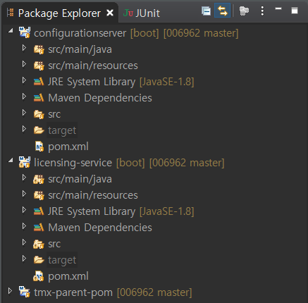
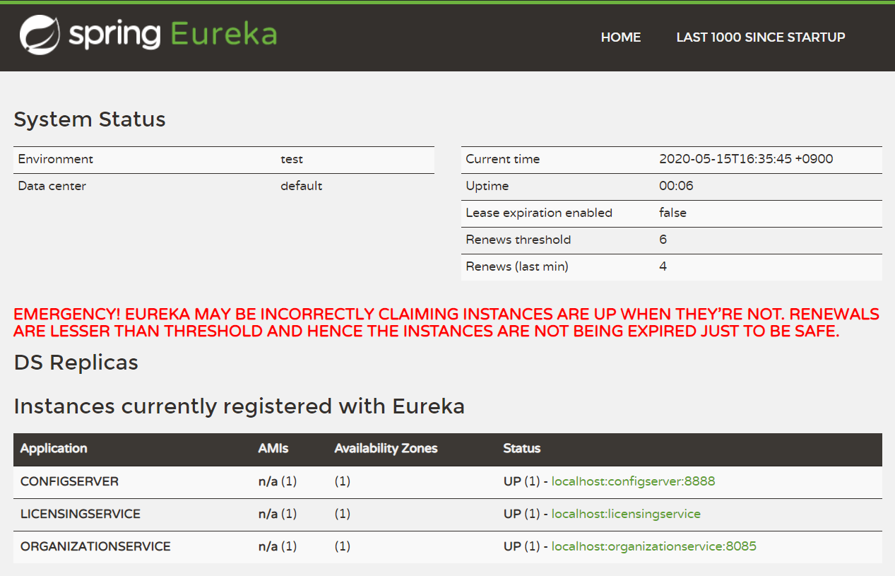
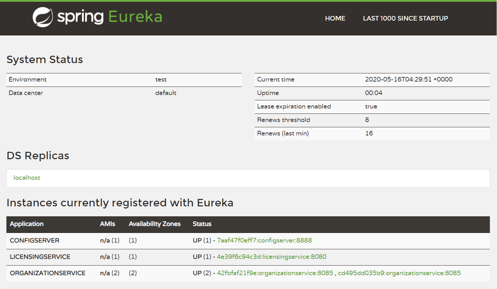

# Spring Microservice

## 프로젝트 재구성

### 아래와 같은 방법으로 configurationserver, licensing-service, tmx-parent-pom 프로젝트 삭제


### 기존 소스 코드 백업 후 GitHub에서 새로 소스 코드 다운로드

https://github.com/gilbutITbook/006962


### 새 소스 코드 메이븐 프로젝트 임포트


spmia-chapter3 디렉터리를 선택하고 pom.xml (3개 모두)를 선택 후 Finish 버튼 클릭


### 임포트 확인




### 컨피그 서버의 설정 정보 수정

실제 라이센스 서비스 관련 설정 정보는 GitHub에서 가져오므로 licensingservice.yml, licensingservice-dev.yml, licensingservice-prod.yml 파일은 삭제해도 무관


/configurationserver/src/main/resources/config/licensingservice/licensingservice.yml

```yaml
example.property: "I AM IN THE DEFAULT"
spring.jpa.database: "POSTGRESQL"
spring.datasource.platform: "postgres"
spring.jpa.show-sql: "true"
spring.database.driverClassName: "org.postgresql.Driver"
spring.datasource.url: "jdbc:postgresql://localhost:5432/eagle_eye_local"
spring.datasource.username: "postgres"
spring.datasource.password: "postgres"
spring.datasource.testWhileIdle: "true"
spring.datasource.validationQuery: "SELECT 1"
spring.jpa.properties.hibernate.dialect: "org.hibernate.dialect.PostgreSQLDialect"
```


/configurationserver/src/main/resources/config/licensingservice/licensingservice-dev.yml

```yaml
spring.jpa.database: "POSTGRESQL"
spring.datasource.platform: "postgres"
spring.jpa.show-sql: "false"
spring.database.driverClassName: "org.postgresql.Driver"
spring.datasource.url: "jdbc:postgresql://localhost:5432/eagle_eye_dev"
spring.datasource.username: "postgres_dev"
spring.datasource.password: "postgres_dev"
spring.datasource.testWhileIdle: "true"
spring.datasource.validationQuery: "SELECT 1"
spring.jpa.properties.hibernate.dialect: "org.hibernate.dialect.PostgreSQLDialect"
```


/configurationserver/src/main/resources/config/licensingservice/licensingservice-prod.yml

```yaml
example.property: "I AM A PROD PROPERTY OVERRIDE"
spring.jpa.database: "POSTGRESQL"
spring.datasource.platform: "postgres"
spring.jpa.show-sql: "true"
spring.database.driverClassName: "org.postgresql.Driver"
spring.datasource.url: "jdbc:postgresql://localhost:5432/eagle_eye_prod"
spring.datasource.username: "postgres_prod"
spring.datasource.password: "postgres_prod"
spring.datasource.testWhileIdle: "true"
spring.datasource.validationQuery: "SELECT 1"
spring.jpa.properties.hibernate.dialect: "org.hibernate.dialect.PostgreSQLDialect"
```


컨피그 서버의 레포지토리를 github으로 설정

/configurationserver/src/main/resources/application.yml

```yaml
server:
  port: 8888
spring:
  cloud:
    config:
      server:
        git:
          uri: https://github.com/profornnan/spring-config
          searchPaths: licensingservice,organizationservice
#          username:
#          password:
```


### 라이센스 서비스 설정 정보 변경

액티브 프로파일을 prod로 설정

/licensing-service/src/main/resources/bootstrap.yml

```yaml
spring:
  application:
    name: licensingservice
  profiles:
    active:
      prod
  cloud:
    config:
      uri: http://localhost:8888
```


### 기동 중인 도커 컨테이너 모두 중지


### 컨피그 서버 기동


### 컨피그 서버 동작 확인

깃허브로부터 프로파일에 해당하는 설정 파일(정보)를 읽어오는지 확인


http://localhost:8888/licensingservice/default

```json
// 20200515101842
// http://localhost:8888/licensingservice/default

{
  "name": "licensingservice",
  "profiles": [
    "default"
  ],
  "label": null,
  "version": "31bdeb464c07584871b55614a71fa2148d94505f",
  "state": null,
  "propertySources": [
    {
      "name": "https://github.com/profornnan/spring-config/licensingservice/licensingservice.yml",
      "source": {
        "example.property": "I AM IN THE DEFAULT",
        "spring.jpa.database": "POSTGRESQL",
        "spring.datasource.platform": "postgres",
        "spring.jpa.show-sql": "true",
        "spring.database.driverClassName": "org.postgresql.Driver",
        "spring.datasource.url": "jdbc:postgresql://localhost:5432/eagle_eye_local",
        "spring.datasource.username": "postgres",
        "spring.datasource.password": "root",
        "spring.datasource.testWhileIdle": "true",
        "spring.datasource.validationQuery": "SELECT 1",
        "spring.jpa.properties.hibernate.dialect": "org.hibernate.dialect.PostgreSQLDialect"
      }
    }
  ]
}
```


http://localhost:8888/licensingservice/dev

```json
// 20200515102111
// http://localhost:8888/licensingservice/dev

{
  "name": "licensingservice",
  "profiles": [
    "dev"
  ],
  "label": null,
  "version": "31bdeb464c07584871b55614a71fa2148d94505f",
  "state": null,
  "propertySources": [
    {
      "name": "https://github.com/profornnan/spring-config/licensingservice/licensingservice-dev.yml",
      "source": {
        "spring.jpa.database": "POSTGRESQL",
        "spring.datasource.platform": "postgres",
        "spring.jpa.show-sql": "false",
        "spring.database.driverClassName": "org.postgresql.Driver",
        "spring.datasource.url": "jdbc:postgresql://localhost:5432/eagle_eye_dev",
        "spring.datasource.username": "postgres_dev",
        "spring.datasource.password": "postgres_dev",
        "spring.datasource.testWhileIdle": "true",
        "spring.datasource.validationQuery": "SELECT 1",
        "spring.jpa.properties.hibernate.dialect": "org.hibernate.dialect.PostgreSQLDialect"
      }
    },
    {
      "name": "https://github.com/profornnan/spring-config/licensingservice/licensingservice.yml",
      "source": {
        "example.property": "I AM IN THE DEFAULT",
        "spring.jpa.database": "POSTGRESQL",
        "spring.datasource.platform": "postgres",
        "spring.jpa.show-sql": "true",
        "spring.database.driverClassName": "org.postgresql.Driver",
        "spring.datasource.url": "jdbc:postgresql://localhost:5432/eagle_eye_local",
        "spring.datasource.username": "postgres",
        "spring.datasource.password": "root",
        "spring.datasource.testWhileIdle": "true",
        "spring.datasource.validationQuery": "SELECT 1",
        "spring.jpa.properties.hibernate.dialect": "org.hibernate.dialect.PostgreSQLDialect"
      }
    }
  ]
}
```


http://localhost:8888/licensingservice/prod

```json
// 20200515102126
// http://localhost:8888/licensingservice/prod

{
  "name": "licensingservice",
  "profiles": [
    "prod"
  ],
  "label": null,
  "version": "31bdeb464c07584871b55614a71fa2148d94505f",
  "state": null,
  "propertySources": [
    {
      "name": "https://github.com/profornnan/spring-config/licensingservice/licensingservice-prod.yml",
      "source": {
        "example.property": "I AM A PROD PROPERTY OVERRIDE AT GITHUB 3",
        "spring.jpa.database": "POSTGRESQL",
        "spring.datasource.platform": "postgres",
        "spring.jpa.show-sql": "true",
        "spring.database.driverClassName": "org.postgresql.Driver",
        "spring.datasource.url": "jdbc:postgresql://database:5432/eagle_eye_prod",
        "spring.datasource.username": "postgres_prod",
        "spring.datasource.password": "{cipher}56d43f7501129ce3b4595c1f6106d08fa48540a99cb2957f2a18b4f8d6e65daf",
        "spring.datasource.testWhileIdle": "true",
        "spring.datasource.validationQuery": "SELECT 1",
        "spring.jpa.properties.hibernate.dialect": "org.hibernate.dialect.PostgreSQLDialect"
      }
    },
    {
      "name": "https://github.com/profornnan/spring-config/licensingservice/licensingservice.yml",
      "source": {
        "example.property": "I AM IN THE DEFAULT",
        "spring.jpa.database": "POSTGRESQL",
        "spring.datasource.platform": "postgres",
        "spring.jpa.show-sql": "true",
        "spring.database.driverClassName": "org.postgresql.Driver",
        "spring.datasource.url": "jdbc:postgresql://localhost:5432/eagle_eye_local",
        "spring.datasource.username": "postgres",
        "spring.datasource.password": "root",
        "spring.datasource.testWhileIdle": "true",
        "spring.datasource.validationQuery": "SELECT 1",
        "spring.jpa.properties.hibernate.dialect": "org.hibernate.dialect.PostgreSQLDialect"
      }
    }
  ]
}
```


### Postman을 이용해서 패스워드 암호화


90c853f71b7c4666c278d0959456a5a51990d34ccb2fa14b70b6e63ff193a59c


### 로컬 PC의 PostgreSQL 서버 기동

```powershell
PS C:\Users\TTak> cd 'C:\Program Files\PostgreSQL\12\bin\'
PS C:\Program Files\PostgreSQL\12\bin> .\pg_ctl.exe -D ..\data\ start
```


### 깃허브에 설정 정보 변경

PostgreSQL 엔드포인트를 localhost로 변경하고, Postman에서 확인한 암호화된 패스워드를 설정


```yaml
example.property: "I AM A PROD PROPERTY OVERRIDE AT GITHUB 3"
spring.jpa.database: "POSTGRESQL"
spring.datasource.platform: "postgres"
spring.jpa.show-sql: "true"
spring.database.driverClassName: "org.postgresql.Driver"
spring.datasource.url: "jdbc:postgresql://localhost:5432/eagle_eye_prod"
spring.datasource.username: "postgres_prod"
spring.datasource.password: "{cipher}90c853f71b7c4666c278d0959456a5a51990d34ccb2fa14b70b6e63ff193a59c"
spring.datasource.testWhileIdle: "true"
spring.datasource.validationQuery: "SELECT 1"
spring.jpa.properties.hibernate.dialect: "org.hibernate.dialect.PostgreSQLDialect"
```


### 라이센스 서비스 기동


### 라이센스 서비스 확인

아래 주소로 요청했을 때 데이터베이스로부터 일치하는 정보를 읽어와서 반환하는지 확인

http://localhost:8080/v1/organizations/e254f8c-c442-4ebe-a82a-e2fc1d1ff78a/licenses/f3831f8c-c338-4ebe-a82a-e2fc1d1ff78a

```json
// 20200515111052
// http://localhost:8080/v1/organizations/e254f8c-c442-4ebe-a82a-e2fc1d1ff78a/licenses/f3831f8c-c338-4ebe-a82a-e2fc1d1ff78a

{
  "licenseId": "f3831f8c-c338-4ebe-a82a-e2fc1d1ff78a",
  "organizationId": "e254f8c-c442-4ebe-a82a-e2fc1d1ff78a",
  "productName": "CustomerPro",
  "licenseType": "user",
  "licenseMax": 100,
  "licenseAllocated": 5,
  "comment": "I AM A PROD PROPERTY OVERRIDE AT GITHUB 3"
}
```


## 도커 컨테이너 생성

### 이클립스에서 컨피그 서버와 라이센스 서버를 중지


### 로컬 PC의 PostgresSQL 서버 중지

```powershell
PS C:\Program Files\PostgreSQL\12\bin> .\pg_ctl.exe -D ..\data\ stop
서버를 멈추기 위해 기다리는 중.... 완료
서버 멈추었음
```


### 깃허브에 설정 정보 변경

PostgreSQL 서버의 엔드포인트를 컨테이너 이름(database)으로 변경


```yaml
example.property: "I AM A PROD PROPERTY OVERRIDE AT GITHUB 3"
spring.jpa.database: "POSTGRESQL"
spring.datasource.platform: "postgres"
spring.jpa.show-sql: "true"
spring.database.driverClassName: "org.postgresql.Driver"
spring.datasource.url: "jdbc:postgresql://database:5432/eagle_eye_prod"
spring.datasource.username: "postgres_prod"
spring.datasource.password: "{cipher}90c853f71b7c4666c278d0959456a5a51990d34ccb2fa14b70b6e63ff193a59c"
spring.datasource.testWhileIdle: "true"
spring.datasource.validationQuery: "SELECT 1"
spring.jpa.properties.hibernate.dialect: "org.hibernate.dialect.PostgreSQLDialect"
```


### JCE 모듈을 /configurationserver/src/main/docker 디렉터리에 추가

C:\Program Files\Java\jdk1.8.0_241\jre\lib\security 디렉터리에 있는 local_policy.jar 파일과 US_export_policy.jar 파일을 이클립스의 지정된 디렉터리로 Drag & Drop


### run.sh 파일 LF로 변경

C:\006962\spmia-chapter3\confsvr\src\main\docker\run.sh

C:\006962\spmia-chapter3\licensing-service\src\main\docker\run.sh


### 컨피그 서버 Dockerfile 수정

/configurationserver/src/main/docker/Dockerfile

```dockerfile
FROM openjdk:8-jdk-alpine
RUN  apk update && apk upgrade && apk add netcat-openbsd && apk add curl
RUN  mkdir -p /usr/local/configserver
RUN  echo $JAVA_HOME

#RUN cd /tmp/ && \
#    curl -k -LO "http://download.oracle.com/otn-pub/java/jce/8/jce_policy-8.zip" -H 'Cookie: oraclelicense=accept-securebackup-cookie' && \
#    unzip jce_policy-8.zip && \
#    rm jce_policy-8.zip && \
#    yes |cp -v /tmp/UnlimitedJCEPolicyJDK8/*.jar /usr/lib/jvm/java-1.8-openjdk/jre/lib/security/

ADD  local_policy.jar /usr/lib/jvm/java-1.8-openjdk/jre/lib/security/
ADD  US_export_policy.jar /usr/lib/jvm/java-1.8-openjdk/jre/lib/security/

ADD  @project.build.finalName@.jar /usr/local/configserver/
ADD  run.sh run.sh
RUN  chmod +x run.sh
CMD  ./run.sh
```


### 도커 이미지 생성

spmia-chapter3 디렉터리에서 mvn 명령어로 빌드

```powershell
PS C:\Users\TTak> cd C:\006962\spmia-chapter3
PS C:\006962\spmia-chapter3> mvn clean package docker:build
```


### 이미지 생성 확인

```powershell
PS C:\006962\spmia-chapter3> docker images
REPOSITORY                          TAG                 IMAGE ID            CREATED             SIZE
johncarnell/tmx-licensing-service   chapter3            9c7b5462eb07        3 minutes ago       165MB
johncarnell/tmx-confsvr             chapter3            8d2b71c56b88        11 minutes ago      155MB
openjdk                             8-jdk-alpine        a3562aa0b991        12 months ago       105MB
```


### ENCRYPT_KEY 환경변수 확인

```bash
C:\Users\TTak>set ENCRYPT_KEY
ENCRYPT_KEY=IMSYMMETRICKEY
```


### docker-compser.xml 파일 수정

환경변수와 DB 정보를 반영

서비스 포트 번호 및 도커 이미지 이름과 태그 확인


C:\006962\spmia-chapter3\docker\common\docker-compose.yml

```yaml
version: '2'
services:
  configserver:
    image: johncarnell/tmx-confsvr:chapter3
    ports:
       - "8888:8888"
    environment:
      ENCRYPT_KEY: "IMSYMMETRICKEY"
  database:
    image: postgres:9.5
    ports:
      - "5432:5432"
    environment:
      POSTGRES_USER:     "postgres_prod"
      POSTGRES_PASSWORD: "postgres_prod"
      POSTGRES_DB:       "eagle_eye_prod"
  licensingservice:
    image: johncarnell/tmx-licensing-service:chapter3
    ports:
      - "8080:8080"
    environment:
      PROFILE: "prod"
      CONFIGSERVER_URI: "http://configserver:8888"
      CONFIGSERVER_PORT:   "8888"
      DATABASESERVER_PORT: "5432"
      ENCRYPT_KEY: "IMSYMMETRICKEY"
```


### docker 컨테이너 생성

```powershell
PS C:\006962\spmia-chapter3> docker-compose -f .\docker\common\docker-compose.yml up
```


### pgAdmin을 이용해서 데이터베이스 접속 및 테스트 테이블, 데이터 추가


```sql
DROP TABLE IF EXISTS licenses;

CREATE TABLE licenses (
  license_id        VARCHAR(100) PRIMARY KEY NOT NULL,
  organization_id   TEXT NOT NULL,
  license_type      TEXT NOT NULL,
  product_name      TEXT NOT NULL,
  license_max       INT   NOT NULL,
  license_allocated INT,
  comment           VARCHAR(100));

INSERT INTO licenses (license_id,  organization_id, license_type, product_name, license_max, license_allocated) VALUES ('f3831f8c-c338-4ebe-a82a-e2fc1d1ff78a', 'e254f8c-c442-4ebe-a82a-e2fc1d1ff78a', 'user','CustomerPro', 100,5);
INSERT INTO licenses (license_id,  organization_id, license_type, product_name, license_max, license_allocated) VALUES ('t9876f8c-c338-4abc-zf6a-ttt1', 'e254f8c-c442-4ebe-a82a-e2fc1d1ff78a', 'user','suitability-plus', 200,189);
INSERT INTO licenses (license_id,  organization_id, license_type, product_name, license_max, license_allocated) VALUES ('38777179-7094-4200-9d61-edb101c6ea84', '442adb6e-fa58-47f3-9ca2-ed1fecdfe86c', 'user','HR-PowerSuite', 100,4);
INSERT INTO licenses (license_id,  organization_id, license_type, product_name, license_max, license_allocated) VALUES ('08dbe05-606e-4dad-9d33-90ef10e334f9', '442adb6e-fa58-47f3-9ca2-ed1fecdfe86c', 'core-prod','WildCat Application Gateway', 16,16);
```


### 컨피그 서버 확인

http://localhost:8888/licensingservice/prod

```json
// 20200515125347
// http://localhost:8888/licensingservice/prod

{
  "name": "licensingservice",
  "profiles": [
    "prod"
  ],
  "label": null,
  "version": "2262356e58fc42c813bae1b329c97ee095f98a1f",
  "state": null,
  "propertySources": [
    {
      "name": "https://github.com/profornnan/spring-config/licensingservice/licensingservice-prod.yml",
      "source": {
        "example.property": "I AM A PROD PROPERTY OVERRIDE AT GITHUB 3",
        "spring.jpa.database": "POSTGRESQL",
        "spring.datasource.platform": "postgres",
        "spring.jpa.show-sql": "true",
        "spring.database.driverClassName": "org.postgresql.Driver",
        "spring.datasource.url": "jdbc:postgresql://database:5432/eagle_eye_prod",
        "spring.datasource.username": "postgres_prod",
        "spring.datasource.password": "{cipher}90c853f71b7c4666c278d0959456a5a51990d34ccb2fa14b70b6e63ff193a59c",
        "spring.datasource.testWhileIdle": "true",
        "spring.datasource.validationQuery": "SELECT 1",
        "spring.jpa.properties.hibernate.dialect": "org.hibernate.dialect.PostgreSQLDialect"
      }
    },
    {
      "name": "https://github.com/profornnan/spring-config/licensingservice/licensingservice.yml",
      "source": {
        "example.property": "I AM IN THE DEFAULT",
        "spring.jpa.database": "POSTGRESQL",
        "spring.datasource.platform": "postgres",
        "spring.jpa.show-sql": "true",
        "spring.database.driverClassName": "org.postgresql.Driver",
        "spring.datasource.url": "jdbc:postgresql://localhost:5432/eagle_eye_local",
        "spring.datasource.username": "postgres",
        "spring.datasource.password": "root",
        "spring.datasource.testWhileIdle": "true",
        "spring.datasource.validationQuery": "SELECT 1",
        "spring.jpa.properties.hibernate.dialect": "org.hibernate.dialect.PostgreSQLDialect"
      }
    }
  ]
}
```


### 라이센스 서비스 확인

http://localhost:8080/v1/organizations/e254f8c-c442-4ebe-a82a-e2fc1d1ff78a/licenses/f3831f8c-c338-4ebe-a82a-e2fc1d1ff78a

```json
// 20200515125426
// http://localhost:8080/v1/organizations/e254f8c-c442-4ebe-a82a-e2fc1d1ff78a/licenses/f3831f8c-c338-4ebe-a82a-e2fc1d1ff78a

{
  "licenseId": "f3831f8c-c338-4ebe-a82a-e2fc1d1ff78a",
  "organizationId": "e254f8c-c442-4ebe-a82a-e2fc1d1ff78a",
  "productName": "CustomerPro",
  "licenseType": "user",
  "licenseMax": 100,
  "licenseAllocated": 5,
  "comment": "I AM A PROD PROPERTY OVERRIDE AT GITHUB 3"
}
```


## 서비스 디스커버리

### 서비스 위치 찾기

p135 전통적인 서비스 위치 찾기 모델


### 서비스 디스커버리 아키텍처

p139 서비스 디스커버리 아키텍처


spmia-chapter4 폴더 아래에 있는 eurekasvr 폴더와 organization-service 폴더를 spmia-chapter3 폴더 아래로 복사


이클립스에서 /tmx-parent-pom/pom.xml 파일에 eurekasvr와 organization-service을 모듈로 추가

```xml
		:
  <modules>
    <module>confsvr</module>
    <module>licensing-service</module>
    <module>eurekasvr</module>
    <module>organization-service</module>
  </modules>
		:
```


eurekasvr와 organization-service 프로젝트 추가

File => Import...


### 유레카 서버 설정

의존성 추가 → 여기서는 추가되어 있는지 확인

/eurekasvr/pom.xml

```xml
		:
  <dependencies>
    <dependency>
      <groupId>org.springframework.cloud</groupId>
      <artifactId>spring-cloud-starter-netflix-eureka-server</artifactId>
    </dependency>
  </dependencies>
		:
```


유레카 서버 서비스와 관련된 정보를 설정

/eurekasvr/src/main/resources/application.yml

```yaml
#Default port is 8761
server:
  port: 8761                      # 유레카 서버의 수신대기 포트

eureka:
  client:
    registerWithEureka: false     # 유레카 서비스에 자신을 등록하지 않음
    fetchRegistry: false          # 레지스트리 정보를 로컬에 캐싱하지 않음
  server:
    waitTimeInMsWhenSyncEmpty: 5  # 서버가 요청을 받기 전 대기할 초기 시간   
  serviceUrl:
    defaultZone: http://localhost:8761
```


스프링부트 애플리케이션을 유레카 서버로 지정 ⇒ 스프링부트 애플리케이션이 실행될 때 유레카 서버 기능을 활성

/eurekasvr/src/main/java/com/thoughtmechanix/eurekasvr/EurekaServerApplication.java

```java
package com.thoughtmechanix.eurekasvr;

import org.springframework.boot.SpringApplication;
import org.springframework.boot.autoconfigure.SpringBootApplication;
import org.springframework.cloud.netflix.eureka.server.EnableEurekaServer;

@SpringBootApplication
@EnableEurekaServer
public class EurekaServerApplication {
    public static void main(String[] args) {
        SpringApplication.run(EurekaServerApplication.class, args);
    }
}
```


### 유레카에 서비스를 등록

서비스 클라이언트가 유레카 레지스트리에서 서비스를 검색할 수 있도록 조직 서비스와 라이센싱 서비스를 구성해 유레카 서비스에 등록


조직 서비스의 pom.xml에 유레카 의존성을 추가 → 우리는 만들어진 코드를 가져와서 사용하므로 추가되어 있는지 확인

/organization-service/pom.xml

```xml
		:
    <dependency>
      <groupId>org.springframework.cloud</groupId>
      <artifactId>spring-cloud-starter-netflix-eureka-client</artifactId>
    </dependency>
		:
```


조직 서비스를 유레카에 등록하도록 설정(지정) → 만들어진 코드를 가져와서 사용하므로 추가되어 있는지 확인

유레카에 서비스를 등록하기 위해서는 애플리케이션 ID와 인스턴스 ID를 필요로 함

* 애플리케이션 ID : 서비스 인스턴스의 그룹에 해당하는 것으로 스프링부트 기반에서는 spring.application.name 프로퍼티로 설정 가능
* 인스턴스 ID : 개별 서비스의 인스턴스를 인식하는 임의의 숫자


/organization-service/src/main/resources/bootstrap.yml

```yaml
spring:
  application:
    name: organizationservice     # 애플리케이션 ID = 유레카에 등록할 서비스의 논리 이름
  profiles:
    active:
      default
  cloud:
    config:
      enabled: true
```


/organization-service/src/main/resources/application.yml

```yaml
server:
  port: 8085

eureka:
  instance:
    preferIpAddress: true     # 서비스 이름 대신 서비스 IP 주소를 등록
  client:
    registerWithEureka: true  # 자신을 유레카 서비스에 등록
    fetchRegistry: true       # 유레카 클라이언트가 레지스트리의 로컬 복사본을 가져오도록 지정
    serviceUrl:               # 유레카 서비스의 위치
        defaultZone: http://localhost:8761/eureka/
```


유레카 서버 실행 (eurekasvr)

조직 서비스 실행 (organization-service)

마우스 오른쪽 클릭 => Run As => Spring Boot App


(30초 정도 대기)


유레카 서버로 접속 ⇒ organizationservice 등록 여부 확인


http://localhost:8761/


유레카 서비스 호출 ⇒ 조직 서비스 정보 반환 확인

http://localhost:8761/eureka/apps/organizationservice


### 라이센스 서버스를 유레카에 등록

의존성 설정

/licensing-service/pom.xml

```xml
		:
	<dependencies>
		<dependency>
			<groupId>org.springframework.boot</groupId>
			<artifactId>spring-boot-starter-web</artifactId>
		</dependency>
		<dependency>
			<groupId>org.springframework.boot</groupId>
			<artifactId>spring-boot-starter-actuator</artifactId>
		</dependency>
		

		<!-- https://mvnrepository.com/artifact/org.springframework.cloud/spring-cloud-config-client -->
		<dependency>
			<groupId>org.springframework.cloud</groupId>
			<artifactId>spring-cloud-config-client</artifactId>
		</dependency>

		<!-- https://mvnrepository.com/artifact/org.springframework.boot/spring-boot-starter-data-jpa -->
		<dependency>
			<groupId>org.springframework.boot</groupId>
			<artifactId>spring-boot-starter-data-jpa</artifactId>
		</dependency>
		
		<!-- https://mvnrepository.com/artifact/org.postgresql/postgresql -->
		<dependency>
			<groupId>org.postgresql</groupId>
			<artifactId>postgresql</artifactId>
		</dependency>

		<!-- 하이버네이트 버전 문제로 발생하는 오류를 예방하기 위해 추가 -->
		<!-- https://mvnrepository.com/artifact/org.hibernate/hibernate-core -->
		<dependency>
		    <groupId>org.hibernate</groupId>
		    <artifactId>hibernate-core</artifactId>
		    <version>5.4.12.Final</version>
		</dependency>
		
		<!-- https://mvnrepository.com/artifact/org.springframework.security/spring-security-rsa -->
		<dependency>
		    <groupId>org.springframework.security</groupId>
		    <artifactId>spring-security-rsa</artifactId>
		</dependency>				
		
		<dependency>
			<groupId>org.springframework.cloud</groupId>
			<artifactId>spring-cloud-starter-netflix-eureka-client</artifactId>
		</dependency>
	</dependencies>
		:
```


/configurationserver/pom.xml

```xml
		:
	<dependency>
		<groupId>org.springframework.cloud</groupId>
		<artifactId>spring-cloud-starter-netflix-eureka-client</artifactId>
	</dependency>
		:
```


/licensing-service/src/main/resources/application.yml

```yaml
management:
  endpoints:
    web:
      exposure:
        include: "*"
eureka:
  instance:
    preferIpAddress: true
  client:
    registerWithEureka: true
    fetchRegistry: true
    serviceUrl:
        defaultZone: http://localhost:8761/eureka/
```


/configurationserver/src/main/resources/application.yml

```yaml
server:
  port: 8888
spring:
  cloud:
    config:
      server:
        git:
          uri: https://github.com/profornnan/spring-config
          searchPaths: licensingservice,organizationservice
eureka:
  instance:
    preferIpAddress: true
  client:
    registerWithEureka: true
    fetchRegistry: true
    serviceUrl:
        defaultZone: http://localhost:8761/eureka/
```


/licensing-service/src/main/resources/bootstrap.yml

```yaml
spring:
  application:
    name: licensingservice
  profiles:
    active:
      prod
  cloud:
    config:
      enabled: true
#      uri: http://localhost:8888
```


깃허브에 Database 접속 URL을 localhost로 변경


로컬 PC에 PostgreSQL 실행

```powershell
PS C:\Users\TTak> cd 'C:\Program Files\PostgreSQL\12\bin'
PS C:\Program Files\PostgreSQL\12\bin> .\pg_ctl.exe -D ..\data\ start
```


컨피그 서버를 기동

라이센스 서비스를 기동

유레카에 서비스 등록 확인


http://localhost:8761/




http://localhost:8761/eureka/apps/configserver

```xml
<application>
    <name>CONFIGSERVER</name>
    <instance>
        <instanceId>localhost:configserver:8888</instanceId>
        <hostName>192.168.40.1</hostName>
        <app>CONFIGSERVER</app>                 ⇐ 서비스 검색 키
        <ipAddr>192.168.40.1</ipAddr>           ⇐ 해당 서비스 인스턴스의 IP 주소
        <status>UP</status>                     ⇐ 해당 서비스의 정상 가동 여부
        <overriddenstatus>UNKNOWN</overriddenstatus>
        <port enabled="true">8888</port>
        <securePort enabled="false">443</securePort>
        <countryId>1</countryId>
        <dataCenterInfo class="com.netflix.appinfo.InstanceInfo$DefaultDataCenterInfo">
            <name>MyOwn</name>
        </dataCenterInfo>
        <leaseInfo>
            <renewalIntervalInSecs>30</renewalIntervalInSecs>
            <durationInSecs>90</durationInSecs>
            <registrationTimestamp>1589527828405</registrationTimestamp>
            <lastRenewalTimestamp>1589528278471</lastRenewalTimestamp>
            <evictionTimestamp>0</evictionTimestamp>
            <serviceUpTimestamp>1589527828405</serviceUpTimestamp>
        </leaseInfo>
        <metadata>
            <management.port>8888</management.port>
            <jmx.port>61234</jmx.port>
        </metadata>
        <homePageUrl>http://192.168.40.1:8888/</homePageUrl>
        <statusPageUrl>http://192.168.40.1:8888/actuator/info</statusPageUrl>
        <healthCheckUrl>http://192.168.40.1:8888/actuator/health</healthCheckUrl>
        <vipAddress>configserver</vipAddress>
        <secureVipAddress>configserver</secureVipAddress>
        <isCoordinatingDiscoveryServer>false</isCoordinatingDiscoveryServer>
        <lastUpdatedTimestamp>1589527828405</lastUpdatedTimestamp>
        <lastDirtyTimestamp>1589527828313</lastDirtyTimestamp>
        <actionType>ADDED</actionType>
    </instance>
</application>
```


http://localhost:8761/eureka/apps/organizationservice

```xml
<application>
    <name>ORGANIZATIONSERVICE</name>
    <instance>
        <instanceId>localhost:organizationservice:8085</instanceId>
        <hostName>192.168.40.1</hostName>
        <app>ORGANIZATIONSERVICE</app>
        <ipAddr>192.168.40.1</ipAddr>
        <status>UP</status>
        <overriddenstatus>UNKNOWN</overriddenstatus>
        <port enabled="true">8085</port>
        <securePort enabled="false">443</securePort>
        <countryId>1</countryId>
        <dataCenterInfo class="com.netflix.appinfo.InstanceInfo$DefaultDataCenterInfo">
            <name>MyOwn</name>
        </dataCenterInfo>
        <leaseInfo>
            <renewalIntervalInSecs>30</renewalIntervalInSecs>
            <durationInSecs>90</durationInSecs>
            <registrationTimestamp>1589527794947</registrationTimestamp>
            <lastRenewalTimestamp>1589528514773</lastRenewalTimestamp>
            <evictionTimestamp>0</evictionTimestamp>
            <serviceUpTimestamp>1589527794948</serviceUpTimestamp>
        </leaseInfo>
        <metadata>
            <management.port>8085</management.port>
            <jmx.port>61220</jmx.port>
        </metadata>
        <homePageUrl>http://192.168.40.1:8085/</homePageUrl>
        <statusPageUrl>http://192.168.40.1:8085/actuator/info</statusPageUrl>
        <healthCheckUrl>http://192.168.40.1:8085/actuator/health</healthCheckUrl>
        <vipAddress>organizationservice</vipAddress>
        <secureVipAddress>organizationservice</secureVipAddress>
        <isCoordinatingDiscoveryServer>false</isCoordinatingDiscoveryServer>
        <lastUpdatedTimestamp>1589527794993</lastUpdatedTimestamp>
        <lastDirtyTimestamp>1589527794519</lastDirtyTimestamp>
        <actionType>ADDED</actionType>
    </instance>
</application>
```


http://localhost:8761/eureka/apps/licensingservice

```xml
<application>
    <name>LICENSINGSERVICE</name>
    <instance>
        <instanceId>localhost:licensingservice</instanceId>
        <hostName>192.168.40.1</hostName>
        <app>LICENSINGSERVICE</app>
        <ipAddr>192.168.40.1</ipAddr>
        <status>UP</status>
        <overriddenstatus>UNKNOWN</overriddenstatus>
        <port enabled="true">8080</port>
        <securePort enabled="false">443</securePort>
        <countryId>1</countryId>
        <dataCenterInfo class="com.netflix.appinfo.InstanceInfo$DefaultDataCenterInfo">
            <name>MyOwn</name>
        </dataCenterInfo>
        <leaseInfo>
            <renewalIntervalInSecs>30</renewalIntervalInSecs>
            <durationInSecs>90</durationInSecs>
            <registrationTimestamp>1589528089787</registrationTimestamp>
            <lastRenewalTimestamp>1589528539843</lastRenewalTimestamp>
            <evictionTimestamp>0</evictionTimestamp>
            <serviceUpTimestamp>1589528089787</serviceUpTimestamp>
        </leaseInfo>
        <metadata>
            <management.port>8080</management.port>
            <jmx.port>61336</jmx.port>
        </metadata>
        <homePageUrl>http://192.168.40.1:8080/</homePageUrl>
        <statusPageUrl>http://192.168.40.1:8080/actuator/info</statusPageUrl>
        <healthCheckUrl>http://192.168.40.1:8080/actuator/health</healthCheckUrl>
        <vipAddress>licensingservice</vipAddress>
        <secureVipAddress>licensingservice</secureVipAddress>
        <isCoordinatingDiscoveryServer>false</isCoordinatingDiscoveryServer>
        <lastUpdatedTimestamp>1589528089787</lastUpdatedTimestamp>
        <lastDirtyTimestamp>1589528089696</lastDirtyTimestamp>
        <actionType>ADDED</actionType>
    </instance>
</application>
```


### 서비스 디스커버리를 사용해서 서비스를 검색

라이센싱 서비스에서 조직 서비스 제공자를 검색


chapter4에 있는 licensing-service\src 폴더 전체를 chapter3\licensing-service 폴더로 덮어쓰기


/licensing-service/pom.xml

```xml
			:
		<dependency>
        	<groupId>org.springframework.cloud</groupId>
      		<artifactId>spring-cloud-starter-openfeign</artifactId>
    	</dependency>
			:
```


라이센스 서비스를 재기동


http://localhost:8080/v1/organizations/e254f8c-c442-4ebe-a82a-e2fc1d1ff78a/licenses/f3831f8c-c338-4ebe-a82a-e2fc1d1ff78a/discovery

```json
// 20200515174835
// http://localhost:8080/v1/organizations/e254f8c-c442-4ebe-a82a-e2fc1d1ff78a/licenses/f3831f8c-c338-4ebe-a82a-e2fc1d1ff78a/discovery

{
  "licenseId": "f3831f8c-c338-4ebe-a82a-e2fc1d1ff78a",
  "organizationId": "e254f8c-c442-4ebe-a82a-e2fc1d1ff78a",
  "organizationName": "customer-crm-co",
  "contactName": "Mark Balster",
  "contactPhone": "823-555-1212",
  "contactEmail": "mark.balster@custcrmco.com",
  "productName": "CustomerPro",
  "licenseType": "user",
  "licenseMax": 100,
  "licenseAllocated": 5,
  "comment": "I AM IN THE DEFAULT"
}
```


http://localhost:8080/v1/organizations/e254f8c-c442-4ebe-a82a-e2fc1d1ff78a/licenses/f3831f8c-c338-4ebe-a82a-e2fc1d1ff78a


http://localhost:8080/v1/organizations/e254f8c-c442-4ebe-a82a-e2fc1d1ff78a/licenses/f3831f8c-c338-4ebe-a82a-e2fc1d1ff78a/feign


### 도커 이미지 생성

기존에 생성한 도커 이미지 삭제


C:\006962\spmia-chapter3\confsvr\pom.xml

```xml
		:
  <!--Docker build Config-->
  <properties>
    <project.build.sourceEncoding>UTF-8</project.build.sourceEncoding>
    <start-class>com.thoughtmechanix.confsvr.ConfigServerApplication</start-class>
    <java.version>1.8</java.version>
    <docker.image.name>johncarnell/tmx-confsvr</docker.image.name>
    <docker.image.tag>chapter4</docker.image.tag>
  </properties>
		:
```


C:\006962\spmia-chapter4\confsvr\src\main\docker\run.sh 파일 복사

=> C:\006962\spmia-chapter3\confsvr\src\main\docker 에 붙여넣기


spmia-chapter3 디렉터리에서 mvn 명령어로 빌드

```powershell
PS C:\Users\TTak> cd C:\006962\spmia-chapter3
PS C:\006962\spmia-chapter3> mvn clean package docker:build
```


생성된 이미지 확인

```powershell
PS C:\006962\spmia-chapter3> docker images
REPOSITORY                             TAG                 IMAGE ID            CREATED             SIZE
johncarnell/tmx-organization-service   chapter4            9fdb8ed7da7d        21 seconds ago      182MB
johncarnell/tmx-eurekasvr              chapter4            742a9448cf43        33 seconds ago      172MB
johncarnell/tmx-licensing-service      chapter4            1fb4efab8eb2        43 seconds ago      185MB
johncarnell/tmx-confsvr                chapter4            3f119f105bbf        55 seconds ago      173MB
postgres                               9.5                 ae83c6861279        3 weeks ago         197MB
openjdk                                8-jdk-alpine        a3562aa0b991        12 months ago       105MB
```


### 로컬 PC의 PostgreSQL 서버 중지

```powershell
PS C:\WINDOWS\system32> cd 'C:\Program Files\PostgreSQL\12\bin\'
PS C:\Program Files\PostgreSQL\12\bin> .\pg_ctl.exe -D ..\data\ stop
서버를 멈추기 위해 기다리는 중.... 완료
서버 멈추었음
```


### 깃허브에 설정 정보 변경

PostgreSQL 서버의 엔드포인트를 컨테이너 이름(database)으로 변경

spring-config/licensingservice/licensingservice-prod.yml

```yaml
example.property: "I AM A PROD PROPERTY OVERRIDE AT GITHUB 3"
spring.jpa.database: "POSTGRESQL"
spring.datasource.platform: "postgres"
spring.jpa.show-sql: "true"
spring.database.driverClassName: "org.postgresql.Driver"
spring.datasource.url: "jdbc:postgresql://database:5432/eagle_eye_prod"
spring.datasource.username: "postgres_prod"
spring.datasource.password: "{cipher}3adf096edf3875df1e59f16684672a954c9b4b45f2fa4aa6a5aa7cb6b348e4fe"
spring.datasource.testWhileIdle: "true"
spring.datasource.validationQuery: "SELECT 1"
spring.jpa.properties.hibernate.dialect: "org.hibernate.dialect.PostgreSQLDialect"
```


### docker 컨테이너 생성

C:\006962\spmia-chapter4\docker\common\docker-compose.yml 파일 복사

=> C:\006962\spmia-chapter3\docker\common 위치에 붙여넣기


```yaml
version: '2'
services:
  eurekaserver:
     image:   johncarnell/tmx-eurekasvr:chapter4
     ports:
       - "8761:8761"
  configserver:
      image: johncarnell/tmx-confsvr:chapter4
      ports:
         - "8888:8888"
      environment:
         EUREKASERVER_URI: "http://eurekaserver:8761/eureka/"
         EUREKASERVER_PORT: "8761"
         ENCRYPT_KEY:       "IMSYMMETRICKEY"
  database:
      image: postgres:9.5
      ports:
      - "5432:5432"
      environment:
        - POSTGRES_USER=postgres_prod
        - POSTGRES_PASSWORD=postgres_prod
        - POSTGRES_DB=eagle_eye_prod
  licensingservice:
      image: johncarnell/tmx-licensing-service:chapter4
      ports:
        - "8080:8080"
      environment:
        PROFILE: "prod"
        SERVER_PORT: "8080"
        CONFIGSERVER_URI: "http://configserver:8888"
        EUREKASERVER_URI: "http://eurekaserver:8761/eureka/"
        EUREKASERVER_PORT:   "8761"
        CONFIGSERVER_PORT:   "8888"
        DATABASESERVER_PORT: "5432"
        ENCRYPT_KEY:       "IMSYMMETRICKEY"
  organizationservice:
      image: johncarnell/tmx-organization-service:chapter4
      ports:
        - "8085:8085"
      environment:
        PROFILE: "prod"
        SERVER_PORT: "8085"
        CONFIGSERVER_URI: "http://configserver:8888"
        EUREKASERVER_URI: "http://eurekaserver:8761/eureka/"
        EUREKASERVER_PORT:   "8761"
        CONFIGSERVER_PORT:   "8888"
        DATABASESERVER_PORT: "5432"
        ENCRYPT_KEY:       "IMSYMMETRICKEY"
  organizationservice2:
      image: johncarnell/tmx-organization-service:chapter4
      ports:
        - "8086:8086"
      environment:
        PROFILE: "prod"
        SERVER_PORT: "8085"
        CONFIGSERVER_URI: "http://configserver:8888"
        EUREKASERVER_URI: "http://eurekaserver:8761/eureka/"
        EUREKASERVER_PORT:   "8761"
        CONFIGSERVER_PORT:   "8888"
        DATABASESERVER_PORT: "5432"
        ENCRYPT_KEY:       "IMSYMMETRICKEY"
```


```powershell
PS C:\006962\spmia-chapter3> docker-compose -f .\docker\common\docker-compose.yml up
```


```powershell
PS C:\Program Files\PostgreSQL\12\bin> docker ps
CONTAINER ID        IMAGE                                           COMMAND                  CREATED             STATUS              PORTS                    NAMES
cd495dd035b9        johncarnell/tmx-organization-service:chapter4   "/bin/sh -c ./run.sh"    3 minutes ago       Up 3 minutes        0.0.0.0:8086->8086/tcp   common_organizationservice2_1
42fbfaf21f9e        johncarnell/tmx-organization-service:chapter4   "/bin/sh -c ./run.sh"    3 minutes ago       Up 3 minutes        0.0.0.0:8085->8085/tcp   common_organizationservice_1
7aaf47f0eff7        johncarnell/tmx-confsvr:chapter4                "/bin/sh -c ./run.sh"    3 minutes ago       Up 3 minutes        0.0.0.0:8888->8888/tcp   common_configserver_1
47ade623df5a        postgres:9.5                                    "docker-entrypoint.s…"   3 minutes ago       Up 3 minutes        0.0.0.0:5432->5432/tcp   common_database_1
5309ae07fc6a        johncarnell/tmx-eurekasvr:chapter4              "/bin/sh -c ./run.sh"    3 minutes ago       Up 3 minutes        0.0.0.0:8761->8761/tcp   common_eurekaserver_1
4e39f6c94c3d        johncarnell/tmx-licensing-service:chapter4      "/bin/sh -c ./run.sh"    3 minutes ago       Up 3 minutes        0.0.0.0:8080->8080/tcp   common_licensingservice_1
```


### pgAdmin을 이용해서 데이터베이스 접속 및 테스트 테이블, 데이터 추가


```sql
DROP TABLE IF EXISTS licenses;

CREATE TABLE licenses (
  license_id        VARCHAR(100) PRIMARY KEY NOT NULL,
  organization_id   TEXT NOT NULL,
  license_type      TEXT NOT NULL,
  product_name      TEXT NOT NULL,
  license_max       INT   NOT NULL,
  license_allocated INT,
  comment           VARCHAR(100));

INSERT INTO licenses (license_id,  organization_id, license_type, product_name, license_max, license_allocated) VALUES ('f3831f8c-c338-4ebe-a82a-e2fc1d1ff78a', 'e254f8c-c442-4ebe-a82a-e2fc1d1ff78a', 'user','CustomerPro', 100,5);
INSERT INTO licenses (license_id,  organization_id, license_type, product_name, license_max, license_allocated) VALUES ('t9876f8c-c338-4abc-zf6a-ttt1', 'e254f8c-c442-4ebe-a82a-e2fc1d1ff78a', 'user','suitability-plus', 200,189);
INSERT INTO licenses (license_id,  organization_id, license_type, product_name, license_max, license_allocated) VALUES ('38777179-7094-4200-9d61-edb101c6ea84', '442adb6e-fa58-47f3-9ca2-ed1fecdfe86c', 'user','HR-PowerSuite', 100,4);
INSERT INTO licenses (license_id,  organization_id, license_type, product_name, license_max, license_allocated) VALUES ('08dbe05-606e-4dad-9d33-90ef10e334f9', '442adb6e-fa58-47f3-9ca2-ed1fecdfe86c', 'core-prod','WildCat Application Gateway', 16,16);
```


http://localhost:8761/




http://localhost:8761/eureka/apps/configserver

```xml
<application>
    <name>CONFIGSERVER</name>
    <instance>
        <instanceId>cfbecfba7fc5:configserver:8888</instanceId>
        <hostName>172.19.0.3</hostName>
        <app>CONFIGSERVER</app>
        <ipAddr>172.19.0.3</ipAddr>
        <status>UP</status>
        <overriddenstatus>UNKNOWN</overriddenstatus>
        <port enabled="true">8888</port>
        <securePort enabled="false">443</securePort>
        <countryId>1</countryId>
        <dataCenterInfo class="com.netflix.appinfo.InstanceInfo$DefaultDataCenterInfo">
            <name>MyOwn</name>
        </dataCenterInfo>
        <leaseInfo>
            <renewalIntervalInSecs>30</renewalIntervalInSecs>
            <durationInSecs>90</durationInSecs>
            <registrationTimestamp>1589761704820</registrationTimestamp>
            <lastRenewalTimestamp>1589761974393</lastRenewalTimestamp>
            <evictionTimestamp>0</evictionTimestamp>
            <serviceUpTimestamp>1589761703961</serviceUpTimestamp>
        </leaseInfo>
        <metadata>
            <management.port>8888</management.port>
        </metadata>
        <homePageUrl>http://172.19.0.3:8888/</homePageUrl>
        <statusPageUrl>http://172.19.0.3:8888/actuator/info</statusPageUrl>
        <healthCheckUrl>http://172.19.0.3:8888/actuator/health</healthCheckUrl>
        <vipAddress>configserver</vipAddress>
        <secureVipAddress>configserver</secureVipAddress>
        <isCoordinatingDiscoveryServer>false</isCoordinatingDiscoveryServer>
        <lastUpdatedTimestamp>1589761704820</lastUpdatedTimestamp>
        <lastDirtyTimestamp>1589761703329</lastDirtyTimestamp>
        <actionType>ADDED</actionType>
    </instance>
</application>
```


http://localhost:8761/eureka/apps/organizationservice

```xml
<application>
    <name>ORGANIZATIONSERVICE</name>
    <instance>
        <instanceId>ecb1f54379af:organizationservice:8085</instanceId>
        <hostName>172.19.0.2</hostName>
        <app>ORGANIZATIONSERVICE</app>
        <ipAddr>172.19.0.2</ipAddr>
        <status>UP</status>
        <overriddenstatus>UNKNOWN</overriddenstatus>
        <port enabled="true">8085</port>
        <securePort enabled="false">443</securePort>
        <countryId>1</countryId>
        <dataCenterInfo class="com.netflix.appinfo.InstanceInfo$DefaultDataCenterInfo">
            <name>MyOwn</name>
        </dataCenterInfo>
        <leaseInfo>
            <renewalIntervalInSecs>30</renewalIntervalInSecs>
            <durationInSecs>90</durationInSecs>
            <registrationTimestamp>1589761801057</registrationTimestamp>
            <lastRenewalTimestamp>1589762160638</lastRenewalTimestamp>
            <evictionTimestamp>0</evictionTimestamp>
            <serviceUpTimestamp>1589761800624</serviceUpTimestamp>
        </leaseInfo>
        <metadata>
            <management.port>8085</management.port>
        </metadata>
        <homePageUrl>http://172.19.0.2:8085/</homePageUrl>
        <statusPageUrl>http://172.19.0.2:8085/actuator/info</statusPageUrl>
        <healthCheckUrl>http://172.19.0.2:8085/actuator/health</healthCheckUrl>
        <vipAddress>organizationservice</vipAddress>
        <secureVipAddress>organizationservice</secureVipAddress>
        <isCoordinatingDiscoveryServer>false</isCoordinatingDiscoveryServer>
        <lastUpdatedTimestamp>1589761801057</lastUpdatedTimestamp>
        <lastDirtyTimestamp>1589761800182</lastDirtyTimestamp>
        <actionType>ADDED</actionType>
    </instance>
    <instance>
        <instanceId>f0be6c2fcf4f:organizationservice:8085</instanceId>
        <hostName>172.19.0.5</hostName>
        <app>ORGANIZATIONSERVICE</app>
        <ipAddr>172.19.0.5</ipAddr>
        <status>UP</status>
        <overriddenstatus>UNKNOWN</overriddenstatus>
        <port enabled="true">8085</port>
        <securePort enabled="false">443</securePort>
        <countryId>1</countryId>
        <dataCenterInfo class="com.netflix.appinfo.InstanceInfo$DefaultDataCenterInfo">
            <name>MyOwn</name>
        </dataCenterInfo>
        <leaseInfo>
            <renewalIntervalInSecs>30</renewalIntervalInSecs>
            <durationInSecs>90</durationInSecs>
            <registrationTimestamp>1589761801052</registrationTimestamp>
            <lastRenewalTimestamp>1589762160638</lastRenewalTimestamp>
            <evictionTimestamp>0</evictionTimestamp>
            <serviceUpTimestamp>1589761800504</serviceUpTimestamp>
        </leaseInfo>
        <metadata>
            <management.port>8085</management.port>
        </metadata>
        <homePageUrl>http://172.19.0.5:8085/</homePageUrl>
        <statusPageUrl>http://172.19.0.5:8085/actuator/info</statusPageUrl>
        <healthCheckUrl>http://172.19.0.5:8085/actuator/health</healthCheckUrl>
        <vipAddress>organizationservice</vipAddress>
        <secureVipAddress>organizationservice</secureVipAddress>
        <isCoordinatingDiscoveryServer>false</isCoordinatingDiscoveryServer>
        <lastUpdatedTimestamp>1589761801052</lastUpdatedTimestamp>
        <lastDirtyTimestamp>1589761800058</lastDirtyTimestamp>
        <actionType>ADDED</actionType>
    </instance>
</application>
```


http://localhost:8761/eureka/apps/licensingservice

```xml
<application>
    <name>LICENSINGSERVICE</name>
    <instance>
        <instanceId>5a5f3632f71d:licensingservice:8080</instanceId>
        <hostName>172.19.0.4</hostName>
        <app>LICENSINGSERVICE</app>
        <ipAddr>172.19.0.4</ipAddr>
        <status>UP</status>
        <overriddenstatus>UNKNOWN</overriddenstatus>
        <port enabled="true">8080</port>
        <securePort enabled="false">443</securePort>
        <countryId>1</countryId>
        <dataCenterInfo class="com.netflix.appinfo.InstanceInfo$DefaultDataCenterInfo">
            <name>MyOwn</name>
        </dataCenterInfo>
        <leaseInfo>
            <renewalIntervalInSecs>30</renewalIntervalInSecs>
            <durationInSecs>90</durationInSecs>
            <registrationTimestamp>1589761805831</registrationTimestamp>
            <lastRenewalTimestamp>1589762225799</lastRenewalTimestamp>
            <evictionTimestamp>0</evictionTimestamp>
            <serviceUpTimestamp>1589761805313</serviceUpTimestamp>
        </leaseInfo>
        <metadata>
            <management.port>8080</management.port>
        </metadata>
        <homePageUrl>http://172.19.0.4:8080/</homePageUrl>
        <statusPageUrl>http://172.19.0.4:8080/actuator/info</statusPageUrl>
        <healthCheckUrl>http://172.19.0.4:8080/actuator/health</healthCheckUrl>
        <vipAddress>licensingservice</vipAddress>
        <secureVipAddress>licensingservice</secureVipAddress>
        <isCoordinatingDiscoveryServer>false</isCoordinatingDiscoveryServer>
        <lastUpdatedTimestamp>1589761805831</lastUpdatedTimestamp>
        <lastDirtyTimestamp>1589761805091</lastDirtyTimestamp>
        <actionType>ADDED</actionType>
    </instance>
</application>
```


http://localhost:8080/v1/organizations/e254f8c-c442-4ebe-a82a-e2fc1d1ff78a/licenses/f3831f8c-c338-4ebe-a82a-e2fc1d1ff78a/discovery

```json
// 20200518093748
// http://localhost:8080/v1/organizations/e254f8c-c442-4ebe-a82a-e2fc1d1ff78a/licenses/f3831f8c-c338-4ebe-a82a-e2fc1d1ff78a/discovery

{
  "licenseId": "f3831f8c-c338-4ebe-a82a-e2fc1d1ff78a",
  "organizationId": "e254f8c-c442-4ebe-a82a-e2fc1d1ff78a",
  "organizationName": "customer-crm-co",
  "contactName": "Mark Balster",
  "contactPhone": "823-555-1212",
  "contactEmail": "mark.balster@custcrmco.com",
  "productName": "CustomerPro",
  "licenseType": "user",
  "licenseMax": 100,
  "licenseAllocated": 5,
  "comment": "I AM A PROD PROPERTY OVERRIDE AT GITHUB 3"
}
```


http://localhost:8080/v1/organizations/e254f8c-c442-4ebe-a82a-e2fc1d1ff78a/licenses/f3831f8c-c338-4ebe-a82a-e2fc1d1ff78a

http://localhost:8080/v1/organizations/e254f8c-c442-4ebe-a82a-e2fc1d1ff78a/licenses/f3831f8c-c338-4ebe-a82a-e2fc1d1ff78a/feign


