# Spring Microservice

## 클라이언트 회복성 패턴

### 클라이언트 회복성 패턴이란?


* 클라이언트 측 부하 분산
  * 클라이언트가 넷플릭스 유레카 같은 서비스 디스커버리 에이전트를 이용해 서비스의 모든 인스턴스를 검색한 후 해당 서비스 인스턴스의 실제 위치를 캐싱하는 것
  * 서비스 소비자가 서비스 인스턴스를 호출해야 할 때마다 클라이언트 측 로드 밸런서는 서비스 위치 풀에서 관리하는 서비스 위치를 하나씩 전달한다.
* 회로 차단기
  * 전기 회로의 차단기를 본떠 만든 클라이언트 회복성 패턴
  * 소프트웨어 회로 차단기는 원격 서비스 호출을 모니터링한다.
  * 호출이 오래걸린다면 회로 차단기가 중재해 호출을 중단한다.
* 폴백
  * 원격 서비스에 대한 호출이 실패할 때 예외를 발생시키지 않고 서비스 소비자가 대체 코드 경로를 실행해 다른 방법으로 작업을 수행할 수 있다.
* 벌크헤드
  * 선박을 건조하는 개념에서 유래
  * 벌크헤드 설계를 적용하면 배는 격벽이라는 완전히 격리된 수밀 구획으로 나뉜다.
  * 벌크헤드 패턴을 적용하면 원격 자원에 대한 호출을 자원별 스레드 풀로 분리하므로 특정 원격 자원의 호출이 느려져 전체 애플리케이션이 다운될 수 있는 위험을 줄일 수 있다.
  * 각 원격 자원은 분리되어 스레드 풀에 할당된다.


### 클라이언트 회복성이 중요한 이유


애플리케이션은 상호 연결된 의존성 그래프로, 의존성 사이의 원격 호출을 관리하지 않는다면 제대로 동작하지 않는 원격 자원 하나가 그래프의 모든 서비스를 다운시킬 수 있다.


회로 차단기가 작동되면 오작동하는 서비스 호출을 빠르고 원활하게 중단한다.


* 원격 호출에 회로 차단 패턴이 제공하는 핵심 기능
  * 빠른 실패
  * 원만한 실패
  * 원활한 회복


### 스프링 클라우드와 히스트릭스를 위한 라이센싱 서버 설정

#### 라이센스 서비스에 메이븐 의존성 모듈을 추가

/licensing-service/pom.xml

```xml
			:
		<dependency>
			<groupId>org.springframework.cloud</groupId>
			<artifactId>spring-cloud-starter-netflix-hystrix</artifactId>
		</dependency>
			:
```


#### 서비스 부트스트랩 클래스 @EnableCircuitBreak 애노테이션을 추가

/licensing-service/src/main/java/com/thoughtmechanix/licenses/Application.java

```java
package com.thoughtmechanix.licenses;

import org.springframework.boot.SpringApplication;
import org.springframework.boot.autoconfigure.SpringBootApplication;
import org.springframework.cloud.client.circuitbreaker.EnableCircuitBreaker;
import org.springframework.cloud.client.discovery.EnableDiscoveryClient;
import org.springframework.cloud.openfeign.EnableFeignClients;
import org.springframework.cloud.openfeign.FeignClient;
import org.springframework.cloud.client.loadbalancer.LoadBalanced;
import org.springframework.context.annotation.Bean;
import org.springframework.web.client.RestTemplate;
import java.util.Collections;
import java.util.List;

@SpringBootApplication
@EnableDiscoveryClient
@EnableFeignClients
@EnableCircuitBreaker
public class Application {

  @LoadBalanced
  @Bean
  public RestTemplate getRestTemplate(){
      return new RestTemplate();
  }

  public static void main(String[] args) {
        SpringApplication.run(Application.class, args);
  }
}
```


#### @HystrixCommand 애노테이션을 이용해서 회로 차단 기능을 적용

http://localhost:8080/v1/organizations/{organizationId}/licenses/ 호출에 대해서 회로 차단 기능을 적용

⇒ 해당 서비스에 문제가 발생했을 때 (기다리지 않고 즉시) 오류를 반환하거나 또는 대체 기능을 제공 


/licensing-service/src/main/java/com/thoughtmechanix/licenses/controllers/LicenseServiceController.java

```java
		:
    @HystrixCommand
    @RequestMapping(value="/",method = RequestMethod.GET)
    public List<License> getLicenses( @PathVariable("organizationId") String organizationId) {

        return licenseService.getLicensesByOrg(organizationId);
    }
		:
```


#### 테스트

유레카 실행 → 설정 서버 실행 → (PostgreSQL 실행) → 라이센스 서비스와 조직 서비스 실행

유레카 정상 실행 여부 확인 ⇒ http://localhost:8761/


설정 서버 정상 실행 여부 확인 ⇒ 설정 서버로 설정 정보 요청 ⇒ http://localhost:8888/licensingservice/prod


PostgreSQL 실행

```powershell
PS C:\Users\TTak> cd 'C:\Program Files\PostgreSQL\12\bin\'
PS C:\Program Files\PostgreSQL\12\bin> .\pg_ctl.exe -D ..\data\ start
서버를 시작하기 위해 기다리는 중....2020-05-18 11:03:19.600 KST [12284] 로그:  starting PostgreSQL 12.2, compiled by Visual C++ build 1914, 64-bit
2020-05-18 11:03:19.603 KST [12284] 로그:  IPv6, 주소: "::", 포트 5432 번으로 접속을 허용합니다
2020-05-18 11:03:19.604 KST [12284] 로그:  IPv4, 주소: "0.0.0.0", 포트 5432 번으로 접속을 허용합니다
2020-05-18 11:03:19.647 KST [12284] 로그:  서버 로그를 로그 수집 프로세스로 보냅니다.
2020-05-18 11:03:19.647 KST [12284] 힌트:  이제부터 서버 로그는 "log" 디렉터리에 보관됩니다.
 완료
서버 시작됨
```


라이센스 서비스 정상 동작 여부 확인 ⇒ 라이센스 정보를 조회 ⇒ http://localhost:8080/v1/organizations/e254f8c-c442-4ebe-a82a-e2fc1d1ff78a/licenses/f3831f8c-c338-4ebe-a82a-e2fc1d1ff78a/feingn


조직 서비스 정상 동작 여부 확인 ⇒ 조직 정보를 조회 ⇒ http://localhost:8085/v1/organizations/e254f8c-c442-4ebe-a82a-e2fc1d1ff78a


회로차단기가 정상적으로 동작하는지 확인 ⇒ 라이센스 서비스 호출을 통해서 확인이 가능 ⇒ http://localhost:8080/v1/organizations/e254f8c-c442-4ebe-a82a-e2fc1d1ff78a/licenses/

(@HystrixCommand 애노테이션이 적용된 주소)


#### 비정기적으로 지연이 발생하도록 코드를 추가 (p174)

/licensing-service/src/main/java/com/thoughtmechanix/licenses/services/LicenseService.java

```java
	// 3번에 1번 꼴로 11초 지연을 발생
	private void randomlyRunLong() {
		Random rand = new Random();
		int randomNum = rand.nextInt((3-1)+1) + 1;
		if (randomNum == 3) sleep();
	}
	
	// 11초 지연을 발생
	private void sleep() {
		try {
			Thread.sleep(11000); 
		} catch (InterruptedException e) {
			e.printStackTrace();
		}
	}
    
	// http://localhost:8080/v1/organizations/{organizationId}/licenses/
	// 형태의 요청을 처리하는 서비스
    public List<License> getLicensesByOrg(String organizationId){
    	randomlyRunLong();
        return licenseRepository.findByOrganizationId( organizationId );
    }
```


#### 라이센스 서비스 재기동 후 회로차단기가 정상적으로 동작하는지 다시 테스트

http://localhost:8080/v1/organizations/e254f8c-c442-4ebe-a82a-e2fc1d1ff78a/licenses/


회로 차단기를 적용한 경우 지연이 발생했을 때 11초를 기다리지 않고 Error Page가 뜬다.


#### 회로 차단기 동작을 이해

/licensing-service/src/main/java/com/thoughtmechanix/licenses/controllers/LicenseServiceController.java 에서 @HystrixCommand 애노테이션이 있을 때와 없을 때 http://localhost:8080/v1/organizations/e254f8c-c442-4ebe-a82a-e2fc1d1ff78a/licenses/ 페이지 호출 결과를 비교


@HystrixCommand 를 주석처리 할 경우(회로 차단기를 적용하지 않은 경우) 지연이 발생했을 때 11초를 기다린 후 결과를 보여준다.


#### 회로 차단기의 타임아웃 시간을 정의 (p174)

/licensing-service/src/main/java/com/thoughtmechanix/licenses/controllers/LicenseServiceController.java

```java
    @HystrixCommand(
    	commandProperties = { 
            // 회로 차단기의 타임아웃 시간을 12초로 설정
    		@HystrixProperty(name = "execution.isolation.thread.timeoutInMilliseconds", 
                             value = "12000")	
    	}
    )
    @RequestMapping(value="/",method = RequestMethod.GET)
    public List<License> getLicenses( @PathVariable("organizationId") String organizationId) {

        return licenseService.getLicensesByOrg(organizationId);
    }
```


#### 라이센스 서비스를 재기동 후 회로 차단기를 테스트

지연이 발생해도 오류를 반환하지 않는 것을 확인

http://localhost:8080/v1/organizations/e254f8c-c442-4ebe-a82a-e2fc1d1ff78a/licenses/


#### 폴백 프로세싱 적용

지연이 발생할 경우 단순히 오류를 반환하는 것 보다 대체 기능 또는 정보를 제공하도록 수정

/licensing-service/src/main/java/com/thoughtmechanix/licenses/controllers/LicenseServiceController.java

```java
    @HystrixCommand(
//        commandProperties = { 
//    		@HystrixProperty(name = "execution.isolation.thread.timeoutInMilliseconds", value = "12000")	
//    	}
    	fallbackMethod = "buildFallbackLicenseList"
    )
    @RequestMapping(value="/",method = RequestMethod.GET)
    public List<License> getLicenses( @PathVariable("organizationId") String organizationId) {

        return licenseService.getLicensesByOrg(organizationId);
    }

    // 정상 서비스가 반환하는 형식과 동일한 형식의 데이터에 오류 정보를 포함해서 반환
    // 히스트릭스가 오류 대신에 반환하는 정보
    private List<License> buildFallbackLicenseList(String organizationId) {
    	List<License> fallbackList = new ArrayList();
    	License license = new License()
    			.withId("000000-00-00000")
    			.withOrganizationId(organizationId)
    			.withProductName("라이센싱 서비스 오류");
    	fallbackList.add(license);
    	return fallbackList;
    }
```


#### 라이센스 서비스 재기동 후 테스트

3번에 1번 꼴로 오류 메시지가 포함된 정보가 반환되는지 확인

http://localhost:8080/v1/organizations/e254f8c-c442-4ebe-a82a-e2fc1d1ff78a/licenses/


서비스가 정상적으로 동작할 때


서비스가 지연될 때


### 벌크헤드 패턴 구현


### 히스트릭스 세부 설정


## 서비스 라우팅


인증 및 인가 여부를 체크, 로그를 생성, … 이러한 애플리케이션 전체에 동일한 정책으로 적용되어야 할 내용이 각 서비스에 개별적으로 적용

⇒ 정책을 일괄되게 적용하는 것이 어렵고

⇒ 정책 적용 및 변경 시 누락이 발생할 수 있음


하나의 서비스 게이트웨이를 통해서 서비스를 제공하면, 정적/정적 라우팅, 인증 및 인가, 측정 지표 수집 및 로깅이 용이


### 주울 스프링 부트 프로젝트 설정

본인의 프로젝트 폴더 확인

spmia-chapter6 아래에 있는 zuulsvr 디렉터리를 복사해서 본인의 프로젝트 폴더 아래로 붙여넣기


/tmx-parent-pom/pom.xml 파일에 zuulsvr 모듈을 추가

```xml
		:
  <modules>
    <module>confsvr</module>
    <module>licensing-service</module>
    <module>eurekasvr</module>
    <module>organization-service</module>
    <module>zuulsvr</module>
  </modules>
		:
```


zuulsvr 프로젝트 임포트


### 주울 서버 구현

소스 코드를 가져와서 사용하므로 설정 내용을 확인


/zuulsvr/pom.xml

```xml
		:
  <dependencies>
    <dependency>
      <groupId>org.springframework.cloud</groupId>
      <artifactId>spring-cloud-starter-netflix-zuul</artifactId>
    </dependency>
    <dependency>
      <groupId>org.springframework.cloud</groupId>
      <artifactId>spring-cloud-starter-netflix-eureka-client</artifactId>
    </dependency>
    <dependency>
      <groupId>org.springframework.cloud</groupId>
      <artifactId>spring-cloud-starter-config</artifactId>
    </dependency>

    <dependency>
      <groupId>org.springframework.cloud</groupId>
      <artifactId>spring-cloud-config-client</artifactId>
    </dependency>

    <dependency>
      <groupId>org.apache.httpcomponents</groupId>
      <artifactId>httpclient</artifactId>
      <version>4.5.2</version>
    </dependency>

  </dependencies>
		:
```


부트스트랩 클래스에 애노테이션을 추가

/zuulsvr/src/main/java/com/thoughtmechanix/zuulsvr/ZuulServerApplication.java

```java
package com.thoughtmechanix.zuulsvr;

import org.springframework.boot.SpringApplication;
import org.springframework.boot.autoconfigure.SpringBootApplication;
import org.springframework.cloud.netflix.zuul.EnableZuulProxy;

@SpringBootApplication
@EnableZuulProxy
public class ZuulServerApplication {

//	// 뒷 부분에서 사용하는 내용이므로 주석 처리
//    @LoadBalanced
//    @Bean
//    public RestTemplate getRestTemplate(){
//        RestTemplate template = new RestTemplate();
//        List interceptors = template.getInterceptors();
//        if (interceptors == null) {
//            template.setInterceptors(Collections.singletonList(new UserContextInterceptor()));
//        } else {
//            interceptors.add(new UserContextInterceptor());
//            template.setInterceptors(interceptors);
//        }
//
//        return template;
//    }

    public static void main(String[] args) {
        SpringApplication.run(ZuulServerApplication.class, args);
    }
}
```


유레카와 연동 = 유레카 클라이언트로 등록 ⇒ 물리적 주소 없이 서비스 이름만으로 접근이 가능

/zuulsvr/src/main/resources/application.yml

```yaml
management:
  endpoints:
    web:
      exposure:
        include: "*"

server:
  port: 5555

#Setting logging levels
logging:
    level:
      com.netflix: WARN
      org.springframework.web: WARN
      com.thoughtmechanix: DEBUG

eureka:
  instance:
    preferIpAddress: true
  client:
    registerWithEureka: true
    fetchRegistry: true
    serviceUrl:
      defaultZone: http://localhost:8761/eureka/

# 뒤에서 사용하는 기능
#zuul:
#  prefix:  /api
#  routes:
#    organizationservice: /organization/**
```


zuulsvr 프로젝트에 포함된 filters, model, utils 패키지를 모두 삭제

⇒ 뒤에서 사용하는 부분이라 현 시점의 코드 실행에 방해


### 주울 실행 후 테스트

http://localhost:5555/actuator


주울 서버가 관리하는 라이팅 정보를 조회(확인)

http://localhost:5555/actuator/routes


조직 서비스를 직접 호출

http://localhost:8085/v1/organizations/e254f8c-c442-4ebe-a82a-e2fc1d1ff78a


라이센스 서비스를 직접 호출

http://localhost:8080/v1/organizations/e254f8c-c442-4ebe-a82a-e2fc1d1ff78a/licenses/f3831f8c-c338-4ebe-a82a-e2fc1d1ff78a/feingn


조직 서비스와 라이센스 서비스를 직접 호출할 경우에는 개별 서비스의 엔드포인트로 접근(주소와 포트)


조직 서비스를 주울 서버를 경유해서 호출

http://localhost:5555/organizationservice/v1/organizations/e254f8c-c442-4ebe-a82a-e2fc1d1ff78a


라이센스 서비스를 주울 서버를 경유해서 호출

http://localhost:5555/licensingservice/v1/organizations/e254f8c-c442-4ebe-a82a-e2fc1d1ff78a/licenses/f3831f8c-c338-4ebe-a82a-e2fc1d1ff78a/feingn


### 자동 경로 맵핑 (p206)

주울 서버를 통해서 서비스를 호출할 때는, http://주울서버주소:주울서버포트/서비스명/서비스주소 형식으로 호출

첫번째 파라미터에 들어있는 서비스명을 유레카와의 연동을 통해서 실제 서비스로 라우팅

자동 경로 맵핑 정보를 확인 ⇒ http://주울서버주소:포트/actuator/routes

```json
{
  "/configserver/**": "configserver",
  "/licensingservice/**": "licensingservice",
  "/organizationservice/**": "organizationservice"
}
```

주울 라우팅 정보 : 서비스 이름 ⇒ 유레카를 통해서 실제 주소를 가져옴


### 수동 경로 맵핑 (p208)

서비스 경로를 외부에 감추거나 간소화할 경우 사용


http://주울주소:포트/organizationservice/v1/organizations/{조직ID}

http://주울주소:포트/organization/v1/organizations/{조직ID}


/zuulsvr/src/main/resources/application.yml

```yaml
server:
  port: 5555

eureka:
  instance:
    preferIpAddress: true
  client:
    registerWithEureka: true
    fetchRegistry: true   
    serviceUrl:
      defaultZone: http://localhost:8761/eureka/

management:
  endpoints:
    web:
      exposure:
        include: "*"

logging:
    level:
      com.netflix: WARN
      org.springframework.web: WARN
      com.thoughtmechanix: DEBUG

zuul:
  routes:
#   유레카에 등록된 애플리케이션 이름: 주울 라우팅 정보    
    organizationservice: /organization/**
```


### 주울 서버 재기동 후 테스트

주울 라우팅 정보 확인

http://localhost:5555/actuator/routes


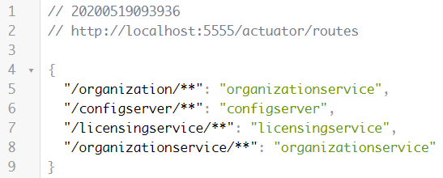


```json
{
  "/organization/**": "organizationservice",       ⇐ 수동 경로 맵핑
  "/configserver/**": "configserver",              ---+ ⇐ 자동 경로 맵핑
  "/licensingservice/**": "licensingservice",         |
  "/organizationservice/**": "organizationservice" ---+ 
}
```


1) 수동 경로 맵핑을 이용해서 서비스를 호출

http://localhost:5555/organization/v1/organizations/e254f8c-c442-4ebe-a82a-e2fc1d1ff78a


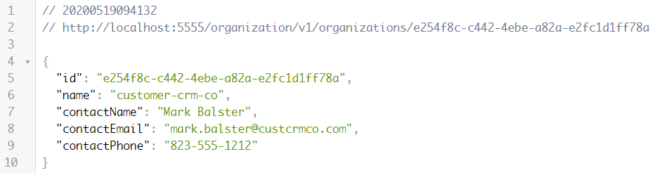


2) 자동 경로 맵핑을 이용해서 서비스를 호출

http://localhost:5555/organizationservice/v1/organizations/e254f8c-c442-4ebe-a82a-e2fc1d1ff78a


3) 조직 서비스로 직접 서비스를 호출

http://localhost:8085/v1/organizations/e254f8c-c442-4ebe-a82a-e2fc1d1ff78a


1), 2), 3) 모두 동일한 결과를 반환


### 자동 경로 맵핑을 비활성화

/zuulsvr/src/main/resources/application.yml

```yaml
		:
zuul:
  # 자동 경로 맵핑에서 제외할 애플리케이션 이름을 명시
  ignored-services:
  - 'organizationservice'
  routes:
    organizationservice: /organization/**
```


### 주울 재기동 후 테스트

주울 라우팅 정보 확인

http://localhost:5555/actuator/routes

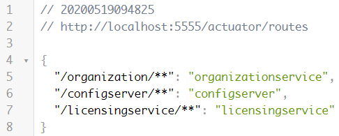


조직 서비스에 자동 맵핑 정보("/organizationservice/**": "organizationservice") 빠져 있음


조직 서비스의 자동 맵핑 주소로 접속했을 때 접속되지 않는 것을 확인

http://localhost:5555/organizationservice/v1/organizations/e254f8c-c442-4ebe-a82a-e2fc1d1ff78a

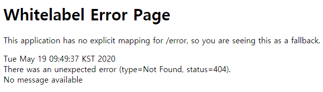


### 모든 자동 경로 맵핑을 해제할 경우

/zuulsvr/src/main/resources/application.yml

```yaml
		:
zuul:
  # 자동 경로 맵핑에서 제외할 애플리케이션 이름을 명시
  ignored-services: "*"
  routes:
    organizationservice: /organization/**
```


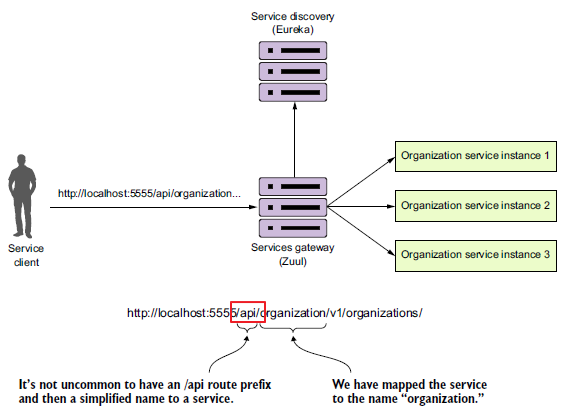

제공하는 서비스가 API 형태임을 외부에서 알 수 있도록 모든 요청에 /api라는 접두어를 추가


### 서비스 URL에 접두어 추가

모든 서비스 URL에 /api라는 접두어를 추가


/zuulsvr/src/main/resources/application.yml

```yaml
		:
zuul:
  # 정의한 모든 서비스에 /api 접두어를 추가
  prefix: /api
  routes:
    organizationservice: /organization/**
```


### 주울 서버 재기동 후 테스트

기존 서비스 주소로 요청 ⇒ 접속이 되지 않는 것을 확인

http://localhost:5555/organizationservice/v1/organizations/e254f8c-c442-4ebe-a82a-e2fc1d1ff78a


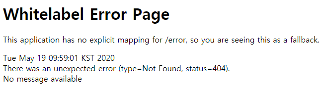


기존 서비스 주소에 /api를 추가해서 요청 ⇒ 서비스가 제공되는 것을 확인

http://localhost:5555/api/organizationservice/v1/organizations/e254f8c-c442-4ebe-a82a-e2fc1d1ff78a

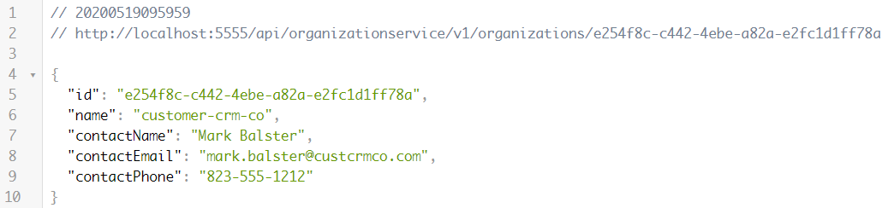


### 정적 수동 경로 맵핑 (p211)

정적 = 서비스 주소가 고정되어 있음 (=고정 URL 사용) ⇒ 유레카와 연동할 수 없는 서비스 (외부 서비스, 다른 플랫폼으로 구현)

/zuulsvr/src/main/resources/application.yml

```yaml
		:
zuul:
  routes:
    licensestatic:               # 주울에서 관리하는 키 이름 
      path: /licensestatic/**    # 정적 경로
      url: http://www.naver.com  # 서비스 경로
```


### 주울 서버 재기동 후 테스트

주울 라우팅 정보 확인

http://localhost:5555/actuator/routes

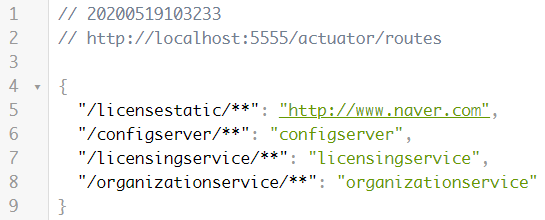


정적 수동 경로로 서비스를 요청

http://localhost:5555/licensestatic/ ⇒ 네이버 페이지가 제공


### 여러 경로를 적정으로 매핑 (p212)

/zuulsvr/src/main/resources/application.yml

```yaml
zuul:
  routes:
    licensestatic:               # 주울에서 관리하는 키 이름 
      path: /licensestatic/**    # 정적 경로
      serviceId: licensestatic   # 리본에서 서비스를 찾을 때 사용하는 ID
ribbon.eureka.enabled: false     # 리본에서 유레카 지원을 해제
licensestatic:
  ribbon:                        # 요청을 라우팅할 서비스 목록
    listOfServers: http://www.naver.com, http://www.google.com
```


### 주울 서버 재기동 후 테스트

라우팅 정보를 조회

http://localhost:5555/actuator/routes

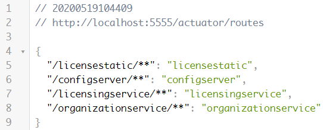


정적 맵핑 주소로 서비스 요청

http://localhost:5555/licensestatic/

⇒ 네이버와 구글 페이지를 반복해서 보여 줌

⇒ 리본 서비스가 해당 요청을 로드밸렌싱해서 제공


### 경로 구성을 동적으로 로딩

현재 경로 구성을 application.yml에서 정의 → 동적으로 변경이 어렵다.

⇒ 컨피그 서버와 연동하면 동적으로 변경하는 것이 가능


경로 구성 정보를 포함하고 있는 zuulservice-*.yml 파일을 생성

c:\temp\zuulservice 폴더 생성 후 zuulservice.yml, zuulservice-dev.yml, zuulservice-prod.yml 파일을 생성

```bash
C:\Users\TTak>mkdir C:\Temp\zuulservice
C:\Users\TTak>cd C:\Temp\zuulservice
C:\Temp\zuulservice>code zuulservice.yml
C:\Temp\zuulservice>code zuulservice-dev.yml
C:\Temp\zuulservice>code zuulservice-prod.yml
```


```yaml
# p214 참조
zuul.ignored-services: '*'
zuul.prefix: /api
zuul.routes.organizationservice: /organization/**
zuul.routes.licensingservice: /licensing/**
```


깃허브에 zuulservice 디렉터리와 파일을 등록


깃허브에 등록한 zuulservice 저장소를 설정 서버에 등록

/configurationserver/src/main/resources/application.yml

```yaml
server:
  port: 8888
spring:
  cloud:
    config:
      server:
        git:
          uri: https://github.com/profornnan/spring-config
          searchPaths: licensingservice,organizationservice,zuulservice
				:
```


저장 후 설정 서버를 재기동

http://localhost:8888/zuulservice/default

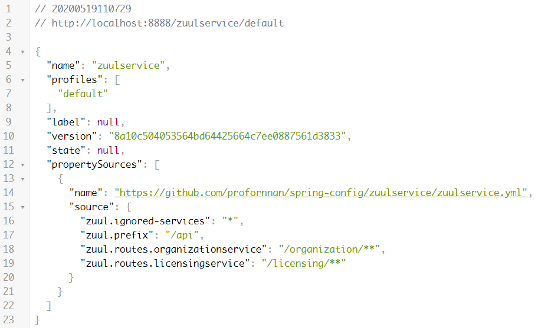


zuul 라우팅 설정을 모두 삭제 후 주울 서버 재기동

/zuulsvr/src/main/resources/application.yml

```yaml
#zuul:
#  routes:
#    licensestatic:               # 주울에서 관리하는 키 이름 
#      path: /licensestatic/**    # 정적 경로
#      serviceId: licensestatic   # 리본에서 서비스를 찾을 때 사용하는 ID
#ribbon.eureka.enabled: false     # 리본에서 유레카 지원을 해제
#licensestatic:
#  ribbon:                        # 요청을 라우팅할 서비스 목록
#    listOfServers: http://www.naver.com, http://www.google.com
```


주울 라우팅 정보 확인

http://localhost:5555/actuator/routes

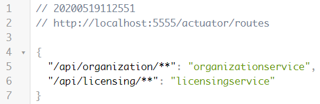


주소로 서비스를 요청 ⇒ 정상 처리

깃허브에서 경로 정보를 수정 (prefix 부분 수정)

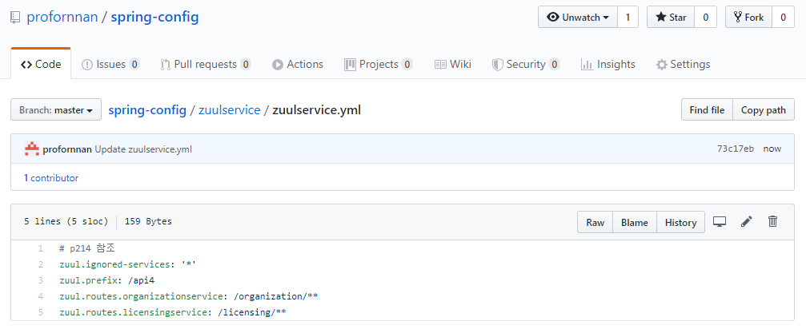


컨피그 서버를 조회하면 변경된 설정 정보가 전달되는 것을 확인

http://localhost:8888/zuulservice/default

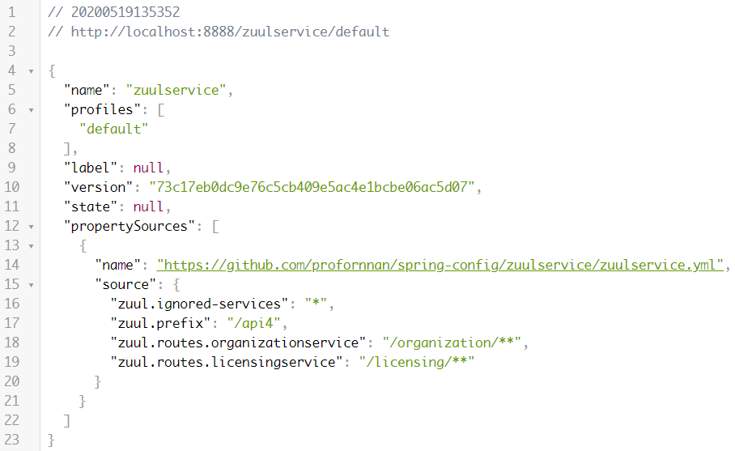


주울 라우팅 정보를 조회하면 변경되지 않은 것을 확인

http://localhost:5555/actuator/routes


주울 서버의 actuator/refresh 엔드포인트 호출을 통해 변경된 설정 정보를 반영 (POST 방식으로 호출)

http://localhost:5555/actuator/refresh

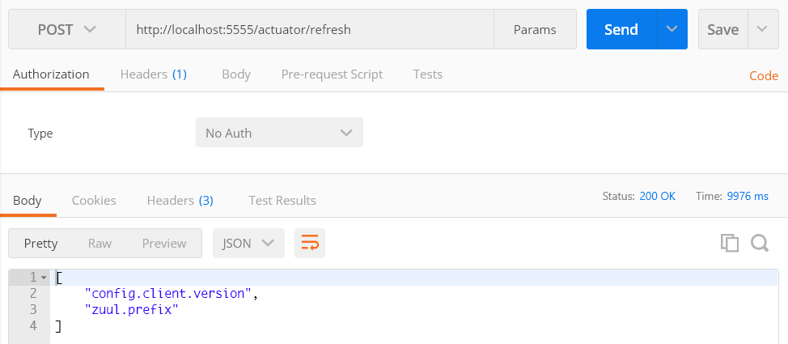


주울의 라우팅 정보를 조회

http://localhost:5555/actuator/routes

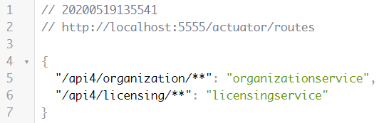


### 필터

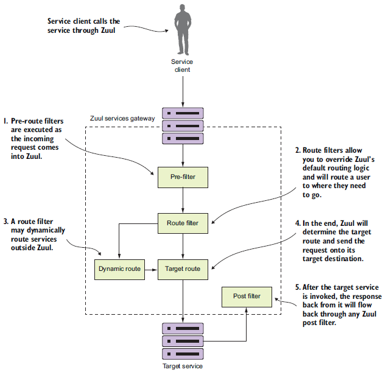


```
   Client  -------------------------------------------------------------> Server (Springboot)
        #1   http://localhost:8080/service/param1/value1/param2/value2 
        #2   http://localhost:8080/service.do?param1=value1&param2=value2

           <-------------------------------------------------------------
        #3   { "data1":"value1", "data2":"value2", … }      ⇐ JSON 형식의 데이터를 반환
                                                                ← @RestController 
        #4   <html><head>...</head><body>....</body></html> ⇐ HTML 문서를 반환
                                                                ← ModelAndView
```

\#1 ⇒ Restful

\#1 → #3 ⇒ REST API 형식

\#3 ⇒ 필연적으로 클라이언트에서 데이터를 보여주는 프로그램이 존재해야 함

