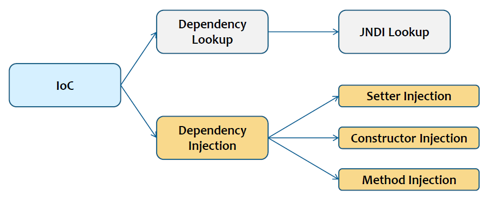
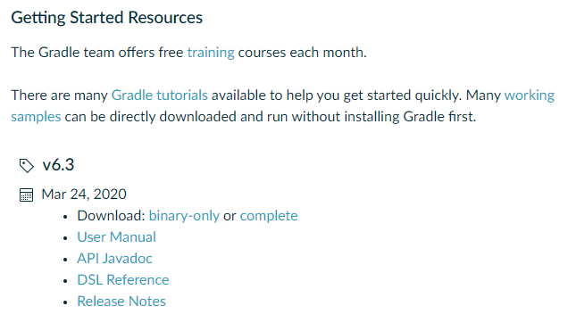

# Spring

## Spring DI & AOP

### Spring의 등장 배경

* EJB는 자바 엔터프라이즈 애플리케이션을 개발하기 위한 표준 기술
  * EJB에서 제공하는 많은 기능에도 불구하고 EJB를 적용하는 것은 너무 어려움
* Rod Johnson은 자신의 저서에서 EJB를 사용하지 않고 엔터프라이즈 애플리케이션을 개발하는 방법을 소개
  * Spring Framework의 시초


### Spring 개요

#### 애플리케이션 프레임워크

* Spring 프레임워크는 자바 엔터프라이즈 개발을 위한 오픈소스 경량 애플리케이션 프레임워크
* 애플리케이션 프레임워크는 애플리케이션 개발의 모든 계층을 지원
* 프레임워크가 애플리케이션 수준의 인프라 스트럭처를 제공하므로 개발자는 업무 로직 개발에만 집중
* Spring 프레임워크는 공통 프로그래밍 모델 및 Configuration 모델을 제공


모든 계층을 지원해주는 프레임워크이다.

기능 구현을 위해서 준비하고 정리하는 것들을 프레임워크라는 것이 다 해준다.

IoC를 이용해 제공해준다.

프레임워크를 통해서 개발자가 업무 로직에만 집중할 수 있도록 한다.


추상화 되어있다. 환경적인 요인을 덜 받도록 만들어졌다. 내가 어떤 데이터베이스를 쓰는지를 생각하지 않아도 된다. 설정만 바꾸면 프로그램의 변경 없이 그대로 쓸 수 있도록 해준다.


#### 경량 프레임워크

* EJB는 분산 환경을 위한 컴포넌트
* Spring은 EJB가 제공하는 서비스를 지원하는 경량 프레임워크
  * EJB와 달리 기술과 환경에 의존적인 부분을 제거한 프레임워크
* Spring은 수십만 라인의 복잡한 코드로 되어 있으나, 20여 개의 모듈로 나누어진 경량 프레임워크


* Spring은 애플리케이션 객체의 생명주기와 설정(Configuration)을 관리하는 경량 컨테이너
* Spring은 객체를 생성하고, 의존관계 설정(Dependency Injection)을 통해 객체간의 관계를 지정
* 애플리케이션 모든 계층의 객체가 관리 대상
  * 각 계층이나 서비스들간의 의존 관계를 관리
* 의존관계 설정(Dependency Injection)을 통해 인터페이스 기반의 컴포넌트로 업무 로직을 모듈화 할 수 있음


#### POJO 프레임워크

* Spring은 업무 로직과 앤터프라이즈 기술의 복잡함을 분리하여 처리할 수 있도록 지원
  * Spring은 특정 프레임워크나 기술에 얽메이지 않는 POJO로 업무 로직을 구성할 수 있음
* POJO(Plan Old Java Object)란 특별한 기술에 종속되지 않은 순수한 자바 객체를 말함
* POJO로 개발하면 테스트가 쉽고, 객체지향 설계 적용이 용이하여 개발 생산성 및 이식성이 향상


* Spring은 업무 로직을 POJO만으로 개발할 수 있는 POJO 프레임워크
* Spring은 POJO로 개발할 수 있도록 IoC/DI, AOP, PSA 기술을 지원
* Spring 애플리케이션은 POJO를 이용해서 만든 업무 코드와 설계정보로 구성
* 설계정보는 POJO 사이의 관계 및 동작방법을 정의


스프링은 proxy 기반의 AOP를 제공한다.


#### Spring 프로젝트


Spring Boot는 실행 환경까지 다 포함한다. 개발 환경에 실행 환경을 포함시킨다.


### Spring 핵심기술

#### IoC

* Inversion Of Control을 줄여서 IoC
* IoC는 객체지향 언어에서 객체 간의 연결 관계를 런타임 시에 결정하게 하는 방법
  * 객체 간의 관계를 느슨하게 연결하도록 구현(Loose coupling)
* DI는 Dependency Injection의 약자로 IoC의 구현 방법의 하나


```java
class MyClass {
	private OuterClass oc;
	
	public MyClass() {
		this.oc = new OuterClass();
	}
	
	public void doMyJob() {
		oc.doSomething();
	}
}

class OuterClass {
	public void doSomething() {
		
	}
}
```

MyClass는 OuterClass에 의존한다. MyClass는 OuterClass가 없으면 동작하지 않는다.


OuterClass의 형식이 변경된다면 바뀐것은 OuterClass인데 MyClass도 바껴야한다.

OuterClass 생성자의 형태가 변경된다면 MyClass의 생성자의 내용도 변경되어야 한다.

결합도가 높다. 의존성이 강하다.


```java
class MyClass {
	private OuterClass oc;
	
	public MyClass(OuterClass oc) {
		this.oc = oc;
	}
	
	public void doMyJob() {
		oc.doSomething();
	}
}

class OuterClass {
	private String name;
	
	public OuterClass(String name) {
		this.name = name;
	}
	
	public void doSomething() {
		
	}
}
```

생성자를 이용해 결합도를 낮추는 방법

스프링은 DI 방식을 이용해서 IoC를 구현하고 있다.


#### AOP

* Aspect Oriented Programming을 줄여서 AOP
* AOP는 관심사의 분리(SoC)를 통해서 소프트웨어 모듈성을 향상시키고자 하는 프로그래밍 패러다임
* 소스코드 레벨에서 관심사의 모듈화를 지향하는 프로그래밍 방법이나 도구를 포함


관심사는 공통된 기능이라고 보면 된다.


```java
class A {
    public void aaaa() {
        DB 연결
        트랜잭션 설정

        쿼리 실행(회원 정보를 조회)

        트랜잭션 종료
        DB 연결 해제
    }

    public void bbbb() {
        DB 연결
        트랜잭션 설정

        쿼리 실행(회원 정보를 추가)

        트랜잭션 종료
        DB 연결 해제
    }
}

class B {

    public void ccc() {
        DB 연결
        트랜잭션 설정

        쿼리 실행(게시판을 조회)

        트랜잭션 종료
        DB 연결 해제
    }
}
```

쿼리 실행의 내용은 다르지만 쿼리 실행 앞·뒤로 DB 연결, 트랜잭션 설정과 트랜잭션 종료, DB 연결 해제가 공통으로 들어간다.


```java
class A {
    public void aaaa() {
        DB 연결
        DB 연결 여부 확인 로그
        트랜잭션 설정

        쿼리 실행(회원 정보를 조회)

        쿼리 실행 결과를 로그
        트랜잭션 종료
        DB 연결 해제
    }

    public void bbbb() {
        DB 연결
        DB 연결 여부 확인 로그
        트랜잭션 설정

        쿼리 실행(회원 정보를 추가)

        쿼리 실행 결과를 로그
        트랜잭션 종료
        DB 연결 해제
    }
}

class B {

    public void ccc() {
        DB 연결
        DB 연결 여부 확인 로그
        트랜잭션 설정

        쿼리 실행(게시판을 조회)

        쿼리 실행 결과를 로그
        트랜잭션 종료
        DB 연결 해제
    }
}
```

만약 DB 연결 여부 확인 로그나 쿼리 실행 결과 로그를 추가한다고 했을 경우 해당 부분에 일일이 추가를 해줘야 한다.


```java
doAop() {
    DB 연결
    DB 연결 여부 확인 로그
    트랜잭션 설정

    쿼리 실행 결과를 로그
    트랜잭션 종료
    DB 연결 해제
}

class A {
    public void aaaa() {
        쿼리 실행(회원 정보를 조회)
    }

    public void bbbb() {
        쿼리 실행(회원 정보를 추가)
    }
}

class B {
    public void ccc() {
        쿼리 실행(게시판을 조회)
    }
}
```

공통된 기능을 따로 뽑는다.

비즈니스 로직에서 공통된 관심사를 분리시키는 것이 AOP이다.

AOP는 여러가지 기법을 통해 제공할 수 있다.


```
ABC.java → [ javac ] → ABC.class → [ java ] → ABC.class 실행
                       ABC'.class                                ⇒ AspectJ
                                              ABC'.class 실행     ⇒    "
```

1) 컴파일 단계에서 끼워넣는 방법

class 파일이 만들어질 때 doAop()가 있는 코드가 아니라 쿼리 실행 앞·뒤로 각각 붙어있는 코드가 생성


2) 실행 단계에서 집어넣는 방법

class 파일을 실행할 때 ABC가 실행되는 것이 아니라 ABC'.class 실행


AspectJ를 이용하면 컴파일 단계에서의 AOP 적용 또는 실행 단계에서의 AOP 적용이 가능하다.


3) Proxy 패턴

```
ABC'.java -------------> ABC'.class ------------> ABC'.class 실행   ⇒ 스프링에서 제공
( proxy 패턴 )
```


Proxy 패턴

https://refactoring.guru/design-patterns/proxy


```
웹 브라우저  --- 요청 -->  웹 서버  --> ....
(클라이언트) <-- 응답 ---
```


```
웹 브라우저  --- 요청 --> ( ??? ) --> 웹 서버  --> ....
(클라이언트) <-- 응답 --- ( ??? ) ---
```

??? ⇐ 프록시(proxy) = 중개자


네트워크의 비용을 절감하고 효율성을 극대화할 수 있다. cache

왔다갔다 하는 내용을 저장, 감시, 필터링 할 수 있다.


#### PSA

* Portable Service Abstraction을 줄여서 PSA
* PSA는 환경과 세부 기술의 변화에 관계없이 일괄된 방식으로 기술에 접근할 수 있게 해주는 설계 원칙
* ex) 데이터베이스에 관계 없이 동일하게 적용할 수 있는 트랜잭션 처리 방식


```
추상화 <--> 구체화

DB 연결 ----> (명세) <---- ?
트랜잭션 생성
쿼리
트랜잭션 종료
DB 연결 해제
```

명세를 기반으로 해서 개발자들이 프로그래밍 할 수 있도록 한다.

외부 요건들이 바뀌더라도 개발자들은 자기 프로그램만 잘 만들면 변경없이 동일한 코드를 사용할 수 있다.

스프링에서 제공하고 있는 대부분의 모듈들은 환경이나 세부 기술 변화에 관계없이 일괄된 방식으로 기술에 접근할 수 있도록 되어있다.


### IoC

* 일반적인 프로그램들은 필요한 객체를 사용하는 위치에서 생성
* OOP에서는 인터페이스와 추상 클래스를 사용하여 객체간의 의존성을 떨어뜨림
  * 소스코드에 하드코딩 된 객체 생성 로직은 객체간의 의존성을 강제하게 됨
  * 의도하지 않았지만 객체 간의 결합도는 높아짐


```java
public class CookbookServiceImpl implements CookbookService {
    private CookbookDao cookbookDao;
    
    public CookbookServiceImpl() {
        this.cookbookDao = new JdbcCookbookDao();
    }
    
    @Override
    public List<Cookbook> findAllCookbooks() {
        //
        return cookbookDao.retrieveAll();
    }
    ...
}
```

Impl 클래스는 Dao에 의존하고 있다.

new를 이용했기 때문에 객체간의 결합도가 높아진다.


* IoC(Inversion of Control)는 통제 방향의 변경을 의미
  * 프레임워크의 일반적인 속성으로 어떤 일을 하는 주체를 변경하는 것
* 최초의 Command Line 프로그램에서는 프로그램이 모든 것을 통제
* GUI 프로그램은 프레임워크가 통제하며 프로그램에서는 이벤트 핸들러만 구현


제어권을 외부에 의탁함으로써 의존 관계를 낮춘다.


CLI : 모든 제어권은 내가 가지고 있다.

GUI : 내가 이벤트를 발생시킬 수 있지만 제어 자체는 윈도우가 한다.


---


VNC (Virtual Network Computing)

https://tigervnc.org/

대부분 원격 지원 시스템이나 화상 시스템은 이것을 기반으로 만들어졌다고 볼 수 있다.

네트워크를 통해서 다른 종단에 있는 컴퓨터를 제어하는 기술


---


* 객체 간 결합도가 높으면, 해당 클래스가 변경될 때 결합된 다른 클래스도 같이 수정될 가능성이 있음
* IoC는 객체 생성 책임을 컨테이너에게 위임
  * 객체 간의 결합도를 낮춤
* IoC를 통한 객체 제어 방식은 기존 로직에서 객체를 생성하는 로직을 제거
* IoC는 구현하는 방법에 따라 Dependency Injection과 Dependency Lookup 방식이 있음


A Class가 사용할 B Class를 직접 만든다고 하면 B가 변경되었다면 A도 바껴야 할 가능성이 있다.

그것을 외부에 맡겨버린다. 클래스들을 외부에 제어를 맡겨버린다. A Class는 B Class를 사용해야 하는 것을 알려주면 외부에서 B 인스턴스를 만들고 A 인스턴스를 만들고 B 인스턴스를 A에게 던져준다. A는 그것을 그냥 쓰면된다.

IoC 중 의존성을 주입하는 것을 DI 기반의 IoC라고 한다.


#### Dependency Lookup

* Dependency Lookup 방식은 EJB나 Spring에서 JNDI 리소스를 얻는 방식
* 컨테이너가 제공하는 Lookup Context를 통해서 필요한 자원이나 객체를 얻을 수 있음
  * 결과적으로 컨테이너 API에 대한 의존성을 높이게 됨
* 컨테이너와의 의존성을 줄이기 위해서는 DI 방식을 사용


JNDI는 리소스를 얻는 방식이다.

어떤 프로그램에서 DB와의 연동 또는 특성 서버와의 연동 등을 프로그램에서 직접 제어한다고 하면 DB가 변경되거나 서버가 변경되거나 접속 정보가 바뀐다면 그 프로그램에서 해당 내용을 다 바꿔야 한다. 프로그램 여러 곳에 흩어져 있다고 하면 이런 것들을 작업하기가 어렵다.

**JNDI**(Java Naming and Directory Interface)는 디렉터리 서비스에서 제공하는 데이터 및 객체를 발견(discover)하고 참고(lookup)하기 위한 자바 API다.

명세에 맞게 개발하면 이어준다. 그 명세 중 하나가 JNDI

컨테이너는 WAS를 얘기한다. WAS는 웹 애플리케이션과 서버 환경을 만들어 동작시키는 기능을 제공하는 소프트웨어 프레임워크


#### Dependency Injection

* Dependency Injection은 컨테이너가 직접 의존구조를 객체에 설정할 수 있도록 지정하는 방식
* 객체는 컨테이너의 존재 여부를 알 필요가 없음
  * lookup 관련된 코드도 객체에서 사라짐
* Injection은 Setter, Constructor, Method Injection으로 구분
* DI 프레임워크는 PicoContainer, Spring DI, Google Guice가 존재




* 의존 관계 주입 Dependency Injection을 줄여서 DI
* DI를 통해, 외부에서 객체를 생성하는 시점에 참조하는 객체에게 의존관계를 제공
* 협업 객체의 참조를 어떻게 얻어낼 것인가라는 관점에서 책임성의 역행(Inversion of responsibility)이라고도 함
* 객체가 인터페이스만 알고 있으므로, 느슨한 결합이 가능


객체는 인터페이스에 의한 의존관계만을 알고 있으며, 구현 클래스에 대한 차이를 모르기 때문에, 서로 다른 구현체로 대체가 가능


내가 사용할 객체를 내가 직접 생성하는 것이 아니고 외부에서 관리

인스턴스를 직접 만드는 것이 아니라 파라미터를 통해서 넣어주도록 하는 것을 DI라고 한다.


```java
class A {
	private String name;   // 접근 제한자를 private 으로 선언 
                           // = 클래스 외부에서 접근(사용)할 수 없도록 제한
 
    // public 인터페이스(=메서드)를 이용해서 필드에 접근(읽기, 쓰기)
	
	// 필드의 값을 읽는 메서드 ⇒ getter
	public String getName() {
		return this.name;
	}

	// 필드의 값을 쓰는 메서드 ⇒ setter
	public void setName(String name) {
		this.name = name;
	}
}
```


```java
class MyClass {
	private OuterClass oc;

	public void MyClass() {
		oc = new OuterClass();
	}
}

class OuterClass {
	public void doSomething() { … }
}
```

결합되어 있다. 이렇게 하면 좋지 않다. OuterClass에 변화가 생기면 MyClass도 같이 변해야 한다.


```java
class MyClass {
	private OuterClass oc;

	public void MyClass(OuterClass outerClass) {
		// this.oc = new OuterClass();
		this.oc = outerClass; // ⇐ 생성자를 이용한 DI 구현
	}

	pubic void setOuterClass(OuterClass outerClass) {
		this.oc = outerClass;
	}
}

class OuterClass {
	public void doSomething() { … }
}
```

생성자에서 인스턴스를 가져와 주입한다. 주입한다는 것은 쓸 수 있도록 해주는 것. 만들어주는 것이다.

해당하는 클래스 내에서 직접 new 해서 만드는 것이 아니고 MyClass를 만드는 곳에서 만들어서 주입한다.

set 메서드를 통해서 할 수도 있다.


외부에서 OuterClass를 만들어서 넣어준다. 외부에서 넣어주는 것을 DI라고 한다. 제어를 외부에 맡긴다. IoC

Spring은 DI 기반의 IoC를 제공한다.


MyClass를 생성하는 시점에 참조하는 객체에게 의존관계를 제공

---


* 사용하는 객체 생성을 IoC 컨테이너에게 위임하며, 객체 생성 로직이 없어짐
* 객체 생성에 대한 주도권을 객체를 필요로 하는 곳으로 넘겨주어, 필요한 때 필요한 곳에서 객체를 생성하는 방법
* Spring은 Setter, Constructor, Method Injection 등 3가지 DI 패턴을 모두 지원
* Spring은 의존관계를 설정하는 방법으로 XML, Annotation, 자바 소스에서 지정할 수 있음


사용하는 객체들을 만들고 의존성을 주입시키고 만드는 것을 IoC Container라고 한다.


#### Spring IoC 용어

* 빈(Bean)이란, Spring이 IoC 방식으로 관리하는 객체
  * 관리되는 객체(Managed Object)
* IoC 컨테이너는 빈의 생성과 제어의 관점에서 빈 팩토리(Bean Factory)
* 애플리케이션 컨텍스트는 Spring이 제공하는 애플리케이션 지원 기능을 모두 포함하는 의미
* Spring 프레임워크는 IoC 컨테이너와 애플리케이션 컨텍스트를 포함한 Spring의 모든 기능을 포괄


* IoC 용어
  * bean
    * Spring이 IoC 방식으로 관리하는 객체(관리되는 객체)
    * Spring 직접 생성과 제어를 담당하는 오브젝트만을 빈이라고 함
  * bean factory
    * Spring이 IoC를 담당하는 핵심 컨테이너로 빈을 등록, 생성, 조회하고 반환, 그 외에 부가적으로 빈을 관리하는 기능을 담당
    * 보통은 이 빈 팩토리를 바로 사용하지 않고, 이를 확장한 애플리케이션 컨텍스트를 이용
  * application context
    * 빈 팩토리를 확장한 IoC 컨테이너로 빈을 등록, 관리하는 기본적인 기능은 빈 팩토리와 동일
    * Spring이 제공하는 각종 부가 서비스를 추가로 제공
  * configuration metadata
    * 애플리케이션 컨텍스트 또는 빈 팩토리가 IoC를 적용하기 위해 사용하는 메타정보
  * Spring framework
    * IoC 컨테이너, 애플리케이션 컨텍스트를 포함해서 Spring이 제공하는 모든 기능


#### IoC 컨테이너

* 오브젝트의 생성과 관계 설정, 사용, 제거 등의 작업을 애플리케이션 코드 대신 독립된 컨테이너가 담당
* 코드가 아닌 컨테이너가 객체에 대한 제어권을 가지고 있기 때문에 IoC
  * Spring 컨테이너 = IoC 컨테이너
* Spring에서 IoC를 담당하는 컨테이너에는 BeanFactory, ApplicationContext
* Spring은 기본적으로 따로 설정하지 않으면 내부에서 생성하는 빈 객체를 모두 싱글톤으로 생성


* <\<interface>> BeanFactory
  * bean 객체에 대한 생성과 제공을 담당
  * 단일 유형의 객체를 생성하는 것이 아니라, 여러 유형의 bean을 생성, 제공
  * 객체 간의 연관 관계를 설정, 클라이언트의 요청 시 bean을 생성
  * bean의 라이프 사이클을 관리
* <\<interface>> ApplicationContext
  * BeanFactory가 제공하는 모든 기능 제공
  * 엔터프라이즈 애플리케이션을 개발하는데 필요한 여러 기능을 추가
  * I18N, 리소스 로딩, 이벤트 발생 및 통지
  * 컨테이너 생성 시 모든 빈 정보를 메모리에 로딩
  * 싱글톤 레지스토리로서의 애플리케이션 컨텍스트임
  * 기존의 오브젝트 팩토리와 비슷한 방식으로 동작하는 IoC 컨테이너
* <\<interface>> WebApplicationContext
  * 웹 환경에서 사용할 때 필요한 기능이 추가된 애플리케이션 컨텍스트
  * 가장 많이 사용, 특히 XmlWebApplicationContext를 가장 많이 사용


#### 설정메타정보

* 하나의 애플리케이션은 IoC 컨테이너에 의해 POJO 클래스에 설정 메터정보가 결합되어 만들어 짐
* 설정 메터정보는 애플리케이션을 구성하는 객체와 객체사이의 상호 의존성을 포함함
* Spring은 XML 설정 파일과 어노테이션 설정, 자바소스로 메타정보 설정 가능


---

### 환경 설정

* JDK 설치 ⇒ https://myanjini.tistory.com/122
* Eclipse 설치 ⇒ https://myanjini.tistory.com/123
* MySQL/MySQL Workbench 설치 ⇒ https://myanjini.tistory.com/125
* maven 설치 ⇒ http://maven.apache.org/download.cgi?Preferred=ftp://mirror.reverse.net/pub/apache/
  * 다운로드 받은 apache-maven-3.6.3-bin.zip 파일 압축 해제 및 bin 디렉터리를 환경 변수 PATH에 등록


* 이클립스 인스톨러 실행해서 설치 중 오류가 발생하는 경우
  * 이클립스 인스톨러 중지(닫기)
  * 명령어창 실행
  * setx _JAVA_OPTIONS -Djava.net.preferIPv4Stack=true
  * 이클립스 인스톨러 실행


JAVA_HOME 환경 변수 ⇒ Java 기반의 프로그램을 실행할 때 필요한 JDK 또는 JRE가 설치된 디렉터리

C:\Program Files\Java\jdk1.8.0_241

C:\Program Files\Java\jre1.8.0_241


PATH 환경 변수 ⇒ 명령어를 실행했을 때 해당 명령어를 찾는 경로

C:\Program Files\Java\jdk1.8.0_241\bin

C:\Program Files\Java\jre1.8.0_241\bin


Maven은 빌드 도구이다.

---

* 그레들(gradle) 설치 ⇒ https://gradle.org/releases/



binary-only 클릭

압축 해제 및 환경 변수 추가


C:\Users\TTak\tools\gradle-6.3\bin


```bash
C:\Users\TTak>gradle -v

Welcome to Gradle 6.3!

Here are the highlights of this release:
 - Java 14 support
 - Improved error messages for unexpected failures

For more details see https://docs.gradle.org/6.3/release-notes.html


------------------------------------------------------------
Gradle 6.3
------------------------------------------------------------

Build time:   2020-03-24 19:52:07 UTC
Revision:     bacd40b727b0130eeac8855ae3f9fd9a0b207c60

Kotlin:       1.3.70
Groovy:       2.5.10
Ant:          Apache Ant(TM) version 1.10.7 compiled on September 1 2019
JVM:          1.8.0_241 (Oracle Corporation 25.241-b07)
OS:           Windows 10 10.0 amd64
```


gradle도 빌드 툴이다.

---

스프링5 프로그래밍 입문


## 메이븐 프로젝트 생성

### 프로젝트 폴더 생성

```bash
C:\Users\TTak>cd /

C:\>mkdir C:\eclipse-workspace\spring5\ex01\src\main\java

C:\>tree c:eclipse-workspace\spring5\ex01
Local Disk 볼륨에 대한 폴더 경로의 목록입니다.
볼륨 일련 번호는 DA3B-749D입니다.
C:\ECLIPSE-WORKSPACE\SPRING5\EX01
└─src
    └─main
        └─java
```


### pom.xml 파일을 생성

https://maven.apache.org/guides/getting-started/maven-in-five-minutes.html


```bash
C:\>code c:\eclipse-workspace\spring5\ex01\pom.xml
```


```xml
<project xmlns="http://maven.apache.org/POM/4.0.0" xmlns:xsi="http://www.w3.org/2001/XMLSchema-instance"
  xsi:schemaLocation="http://maven.apache.org/POM/4.0.0 http://maven.apache.org/xsd/maven-4.0.0.xsd">

  <modelVersion>4.0.0</modelVersion>
 
  <groupId>spring5</groupId>
  <artifactId>ex01</artifactId>
  <version>0.0.1-SNAPSHOT</version>
 
  <dependencies>
    <dependency>
      <groupId>org.springframework</groupId>
      <artifactId>spring-context</artifactId>
      <version>5.0.2.RELEASE</version>
    </dependency>
  </dependencies>

  <build>
    <plugins>
        <plugin>
            <artifactId>maven-compiler-plugin</artifactId>
            <version>3.7.0</version>
            <configuration>
                <source>1.8</source>
                <target>1.8</target>
                <encoding>utf-8</encoding>
            </configuration> 
        </plugin>
    </plugins> 
  </build>
</project>
```

modelVersion : maven의 버전

groupId, artifactId은 경로와 동일하게 설정

properties는 환경변수 같은 것

maven의 역할 중 하나가 의존성 관리이다.

내가 이 프로그램에서 필요로 하는 라이브러리를 dependency로써 적어준다.

빌드 : dependency에 명시되어 있는 라이브러리와 내가 만든 코드를 묶어서 실행 가능한 파일로 만드는 작업

maven이 사용하는 저장소에서 가져온다.

https://mvnrepository.com/

repository에서 필요로 하는 의존성을 추가


```bash
C:\Users\TTak>cd c:\eclipse-workspace\spring5\ex01

c:\eclipse-workspace\spring5\ex01>dir
 C 드라이브의 볼륨: Local Disk
 볼륨 일련 번호: DA3B-749D

 c:\eclipse-workspace\spring5\ex01 디렉터리

2020-04-08  오후 04:26    <DIR>          .
2020-04-08  오후 04:26    <DIR>          ..
2020-04-08  오후 04:31               944 pom.xml
2020-04-08  오후 03:47    <DIR>          src
               1개 파일                 944 바이트
               3개 디렉터리  84,894,904,320 바이트 남음

c:\eclipse-workspace\spring5\ex01>mvn compile
[INFO] Scanning for projects...
[INFO]
[INFO] ----------------------------< spring5:ex01 >----------------------------
[INFO] Building ex01 0.0.1-SNAPSHOT
[INFO] --------------------------------[ jar ]---------------------------------
Downloading from central: https://repo.maven.apache.org/maven2/org/springframework/spring-context/5.0.2.RELEASE/spring-context-5.0.2.RELEASE.pom
Downloaded from central: https://repo.maven.apache.org/maven2/org/springframework/spring-context/5.0.2.RELEASE/spring-context-5.0.2.RELEASE.pom (5.7 kB at 3.0 kB/s)
Downloading from central: https://repo.maven.apache.org/maven2/org/springframework/spring-aop/5.0.2.RELEASE/spring-aop-5.0.2.RELEASE.pom
...
```


메이븐 Local Repository ⇒ USER_HOME_DIR\.m2\repository


C:\Users\TTak\.m2\repository\org\springframework\spring-context\5.0.2.RELEASE


.pom 파일을 확인해보면 필요한 dependency 들을 볼 수 있다.


**의존 전이(transitive dependencies)**

의존 대상이 다시 의존하는 대상까지도 의존 대상에 포함하는 것


### 메이븐 프로젝트 (이클립스에) 임포트

File => Import


## 그레이들 프로젝트 생성

### 프로젝트 폴더 생성

```bash
c:\eclipse-workspace\spring5\ex01>cd \

c:\>mkdir c:\eclipse-workspace\spring5\ex02\src\main\java

c:\>tree c:\eclipse-workspace\spring5\ex02
Local Disk 볼륨에 대한 폴더 경로의 목록입니다.
볼륨 일련 번호는 DA3B-749D입니다.
C:\ECLIPSE-WORKSPACE\SPRING5\EX02
└─src
    └─main
        └─java
```


### build.gradle 파일 생성

```bash
c:\>code c:\eclipse-workspace\spring5\ex02\build.gradle
```


```gradle
apply plugin:'java'

sourceCompatibility = 1.8
targetCompatibility = 1.8

compileJava.options.encoding = "UTF-8"

repositories {
    mavenCentral()
}

dependencies {
    compile 'org.spring.framework:spring-context:5.0.2.RELEASE'
}

wrapper {
    gradleVersion = '4.4'
}
```


### wrapper 파일 생성

gradle 기반으로 만든 프로젝트를 실행할 때 gradle 명령어가 있어야 gradle 기반의 프로젝트를 빌드, 디버깅 등을 할 수 있다.

gradle이 설지되어 있지 않은 경우가 있을 수 있다. 프로젝트 안에 gradle의 기본 명령어를 쓸 수 있도록 포함시킨다.


```bash
c:\>cd eclipse-workspace\spring5\ex02

c:\eclipse-workspace\spring5\ex02>dir
 C 드라이브의 볼륨: Local Disk
 볼륨 일련 번호: DA3B-749D

 c:\eclipse-workspace\spring5\ex02 디렉터리

2020-04-08  오후 04:55    <DIR>          .
2020-04-08  오후 04:55    <DIR>          ..
2020-04-08  오후 04:59               289 build.gradle
2020-04-08  오후 04:53    <DIR>          src
               1개 파일                 289 바이트
               3개 디렉터리  83,786,301,440 바이트 남음
```


```bash
c:\eclipse-workspace\spring5\ex02>gradle wrapper

Deprecated Gradle features were used in this build, making it incompatible with Gradle 7.0.
Use '--warning-mode all' to show the individual deprecation warnings.
See https://docs.gradle.org/6.3/userguide/command_line_interface.html#sec:command_line_warnings

BUILD SUCCESSFUL in 18s
1 actionable task: 1 executed
c:\eclipse-workspace\spring5\ex02>dir
 C 드라이브의 볼륨: Local Disk
 볼륨 일련 번호: DA3B-749D

 c:\eclipse-workspace\spring5\ex02 디렉터리

2020-04-08  오후 05:20    <DIR>          .
2020-04-08  오후 05:20    <DIR>          ..
2020-04-08  오후 05:20    <DIR>          .gradle
2020-04-08  오후 04:59               289 build.gradle
2020-04-08  오후 05:20    <DIR>          gradle
2020-04-08  오후 05:20             5,764 gradlew      ⇐ Linux, Mac OS 용
2020-04-08  오후 05:20             3,056 gradlew.bat  ⇐ Windows 용
2020-04-08  오후 04:53    <DIR>          src
               3개 파일               9,109 바이트
               5개 디렉터리  83,785,781,248 바이트 남음
```

gradle을 실행하기 위해 꼭 필요한 파일들이 생성되었다.


### 그레이들 프로젝트 임포트

File => Import


Next


## 스프링 예제 코드 작성

Greeter.java ⇒ 콘솔에 메시지를 출력

AppContext.java ⇒ 스프링 설정 파일

Main.java ⇒ main() 메서드를 통해 스프링과 Greeter를 실행


/ex01/src/main/java/ex01/Greeter.java


Greeter.java

```java
package ex01;

public class Greeter {
	private String format;
	
	// setter 메서드
	public void setFormat(String format) {
		this.format = format;
	}
	
	public String greet(String name) {
		return String.format(this.format, name);
	}
}
```


AppContext

```java
package ex01;

import org.springframework.context.annotation.Bean;
import org.springframework.context.annotation.Configuration;

@Configuration		// Ctrl + Shift + O => import 구문을 자동으로 생성
public class AppContext {
	
	@Bean
	public Greeter greeter() {
		Greeter g = new Greeter();
		g.setFormat("%s, 안녕하세요.");
		return g;
	}
}
```

@Bean을 붙이면 해당하는 메서드가 생성하는 객체를 스프링이 관리하는 bean 객체로 등록한다는 뜻이다. Greeter 라는 타입의 greeter 라는 이름의 bean이 만들어진다.

Greeter 라는 타입의 객체를 생성해서 return 한다.


Main.java

```java
package ex01;

import org.springframework.context.annotation.AnnotationConfigApplicationContext;

public class Main {
	public static void main(String[] args) {
		AnnotationConfigApplicationContext ctx = new AnnotationConfigApplicationContext(AppContext.class);
		
		Greeter g = ctx.getBean("greeter", Greeter.class);
		String msg = g.greet("스프링");
		System.out.println(msg);
		ctx.close();
	}
}
```


```
4월 08, 2020 5:54:00 오후 org.springframework.context.support.AbstractApplicationContext prepareRefresh
정보: Refreshing org.springframework.context.annotation.AnnotationConfigApplicationContext@41906a77: startup date [Wed Apr 08 17:54:00 KST 2020]; root of context hierarchy
스프링, 안녕하세요.
4월 08, 2020 5:54:00 오후 org.springframework.context.support.AbstractApplicationContext doClose
정보: Closing org.springframework.context.annotation.AnnotationConfigApplicationContext@41906a77: startup date [Wed Apr 08 17:54:00 KST 2020]; root of context hierarchy
```


