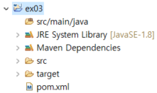
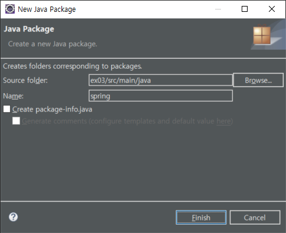
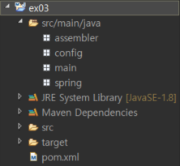
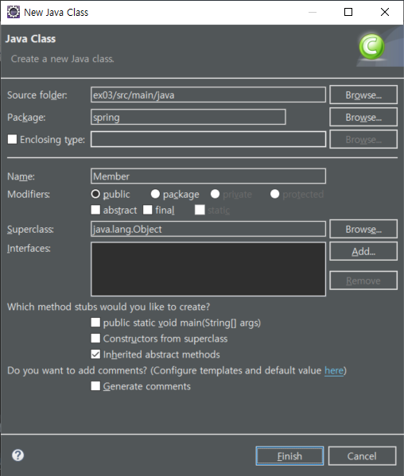
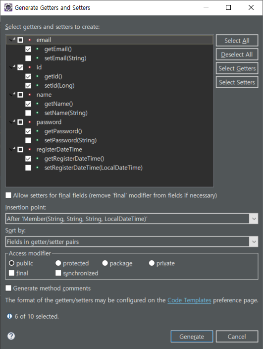
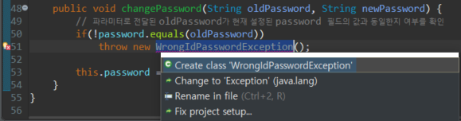
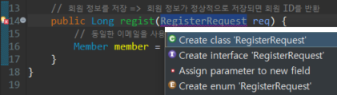
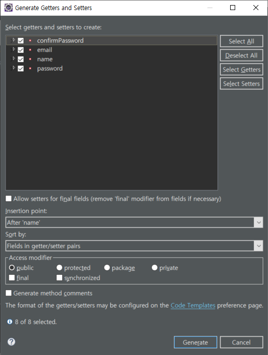
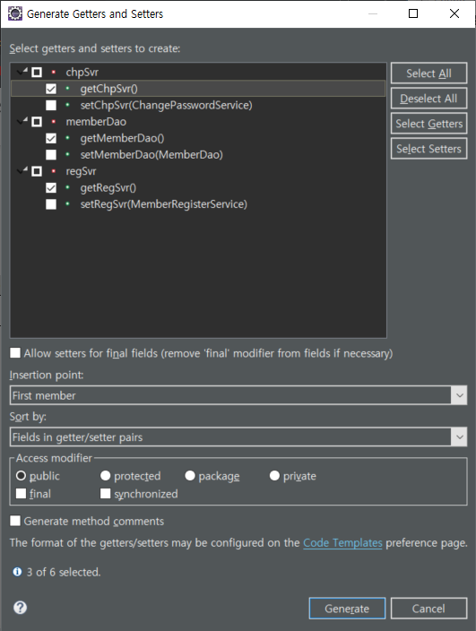

# Spring

## 의존(dependency)

한 클래스가 다른 클래스를 사용할 때 이것을 의존한다라고 표현


**[요구사항]**

이메일 중복 확인하고 회원 정보를 저장하는 기능을 구현하려고 할 때

```java
public class MemberRegisterService {
    private MemberDao memberDao = new MemberDao();    

    // 회원 정보 저장 처리
    public void regist(RegisterRequest req) {

        // 이메일 중복 여부를 조회
        Member member = memberDao.selectByEmail(req.getEmail());

        // 이메일 중복 시 예외 생성
        if (member != null) {
            throw new DuplicateMemberException("이메일 중복 " + req.getEmail());
        }

        // 이메일 중복이 아닌 경우 회원 정보를 저장 
        Member newMember = new Member(req.getEmail(), req.getPassword(), req.getName());
        memberDao.insert(newMember);
    }
}
```


**[추가 요구사항]**

패스워드 변경 기능을 추가

```java
public class ChangePasswordService {
	private MemberDao memberDao = new MemberDao(); 
						:
}
```


### 의존 객체를 구하는 방법

#### 의존 대상 객체를 직접 생성

```java
public class MemberRegisterService {
	private MemberDao memberDao = new MemberDao();    
					:
}
```

구현이 용이하다 ⇒ MemberRegisterService 객체를 생성하는 순간 MemberDao 객체도 함께 생성하므로 유지보수에 문제가 있을 수 있다.


#### DI(Dependency Injection : 의존성 주입)

의존하는 객체를 직접 생성하는 대신 의존 객체를 전달받는 방식

```java
public class MemberRegisterService {
    private MemberDao memberDao;

    // 생성자를 이용해서 의존하는 객체를 주입
    public MemberRegisterService(MemberDao memberDao) {
        this.memberDao = memberDao;
    }
    						:
}
```


#### DI를 이용하면 의존 객체 변경이 용이

의존 대상 객체를 직접 생성하는 방식으로 개발

```java
public class MemberRegisterService {
	private MemberDao memberDao = new MemberDao();    
						:
}

public class ChangePasswordService {
	private MemberDao memberDao = new MemberDao(); 
						:
}
```


의존 대상 객체에 변경이 발생하는 경우 ⇒ 의존 대상 객체에 의존하는 모든 객체가 변경

예) MemberDao에 캐시 기능을 추가

```
A ---> 홍길동 조회 ---> DAO -------> Repository (DB, File, LDAP, …)
                                        |
  <------------------ 캐시 <-------------+
                       |
B ---> 홍길동 조회 ---> DAO 
                       |
  <--------------------+
```


```java
public class CachedMemberDao extends MemberDao {
						:
}

public class MemberRegisterService {
	private MemberDao memberDao = new CachedMemberDao(); ⇐ 의존 대상 객체를 생성하는 모든 부분을 수정
						:
}

public class ChangePasswordService {
	private MemberDao memberDao = new CachedMemberDao();
						:
}
```


의존성 주입 방식의 경우

```java
public class MemberRegisterService {
    private MemberDao memberDao;

    public MemberRegisterService(MemberDao memberDao) {
        this.memberDao = memberDao;
    }
    						:
}

public class ChangePasswordService {
    private MemberDao memberDao;

    public ChangePasswordService(MemberDao memberDao) {
        this.memberDao = memberDao;
    }
    						:
}

public class Main() {
    // MemberDao memberDao = new MemberDao();
    MemberDao memberDao = new CachedMemberDao(); ⇐ 의존 대상 객체를 주입하는 곳만 수정
    MemberRegisterService mrs = new MemberRegisterService(memberDao);
    ChangePasswordService cps = new ChangePasswordService(memberDao);
    						:
}
```


### 예제

#### 프로젝트 폴더 생성

```bash
C:\>mkdir c:\eclipse-workspace\spring5\ex03\src\main\java
```


#### pom.xml 생성

```bash
C:\>code c:\eclipse-workspace\spring5\ex03\pom.xml
```


```xml
<project xmlns="http://maven.apache.org/POM/4.0.0" xmlns:xsi="http://www.w3.org/2001/XMLSchema-instance"
  xsi:schemaLocation="http://maven.apache.org/POM/4.0.0 http://maven.apache.org/xsd/maven-4.0.0.xsd">

  <modelVersion>4.0.0</modelVersion>
 
  <groupId>spring5</groupId>
  <artifactId>ex03</artifactId>
  <version>0.0.1-SNAPSHOT</version>
 
  <dependencies>
    <dependency>
      <groupId>org.springframework</groupId>
      <artifactId>spring-context</artifactId>
      <version>5.0.2.RELEASE</version>
    </dependency>
  </dependencies>

  <build>
    <plugins>
        <plugin>
            <artifactId>maven-compiler-plugin</artifactId>
            <version>3.7.0</version>
            <configuration>
                <source>1.8</source>
                <target>1.8</target>
                <encoding>utf-8</encoding>
            </configuration> 
        </plugin>
    </plugins> 
  </build>
</project>
```


```bash
C:\eclipse-workspace\spring5\ex03>mvn compile
```


#### 메이븐 프로젝트 임포트




#### 기능별 클래스를 생성

* 회원 데이터 관리
  * Member ⇐ 회원 정보를 나타내는 클래스
  * WrongIdPasswordException ⇐ 회원 정보(id/pw)가 일치하지 않는 경우 발생하는 예외
  * MemberDao ⇐ 회원 정보를 저장소에 추가, 수정, 삭제, 조회 등의 기능을 구현하는 클래스
* 회원 가입 처리
  * DuplicateMemberException ⇐ 동일한 회원 정보가 존재할 경우 발생하는 예외
  * RegisterRequest ⇐ 회원 가입을 위한 정보를 담고 있는 클래스 (사용자가 입력한 정보)
  * MemberRegisterService ⇐ 회원 가입(비즈니스 로직)을 처리하는 클래스
* 패스워드 변경
  * MemberNotFoundException ⇐ 패스워드 변경 대상 회원이 존재하지 않는 경우 발생하는 예외
  * ChangePasswordService ⇐ 패스워드 변경을 처리하는 클래스


spring, assembler, config, main 패키지 생성








```
/ex03/src/main/java/spring/Member.java
~~~~~~~~~~~~~~~~~~~ ~~~~~~ ~~~~~~~~~~~
Source folder         |             |
                      +-- Package   +-- Class Name
```





/ex03/src/main/java/spring/Member.java

```java
package spring;

import java.time.LocalDateTime;

// 회원 데이터
public class Member {
	private Long id;
	private String email;
	private String password;
	private String name;
	private LocalDateTime registerDateTime;  // LocalDateTime 클래스가 포함된 패키지를 포함시켜야 함 => Ctrl + Shift + O
	
	public Member(String email, String password, String name, LocalDateTime registerDateTime) {
		this.email = email;
		this.password = password;
		this.name = name;
		this.registerDateTime = registerDateTime;
	}

	public Long getId() {
		return id;
	}

	public void setId(Long id) {
		this.id = id;
	}

	public String getEmail() {
		return email;
	}

	public String getPassword() {
		return password;
	}

	public String getName() {
		return name;
	}

	public LocalDateTime getRegisterDateTime() {
		return registerDateTime;
	}
	
//	public void setPassword(String password) {
//		this.password = password;
//	}
	
	public void changePassword(String oldPassword, String newPassword) {
		// 파라미터로 전달된 oldPassword가 현재 설정된 password 필드의 값과 동일한지 여부를 확인
		if(!password.equals(oldPassword))
			throw new WrongIdPasswordException();
		
		this.password = newPassword;
	}
}
```





password 변경 요청 시 요청하는 사람이 권한이 있는 사람인지 확인해야 한다.





/ex03/src/main/java/spring/WrongIdPasswordException.java

```java
package spring;

public class WrongIdPasswordException extends RuntimeException {

}
```


/ex03/src/main/java/spring/MemberDao.java

```java
package spring;

import java.util.Collection;
import java.util.HashMap;
import java.util.Map;

// 저장소에 데이터를 저장, 수정, 조회 등을 처리
// 일반적으로 DB와 같은 저장소와 연동이 되나, 여기서는 자바의 맵 객체를 이용해서 간단히 구현
public class MemberDao {
	
	// 데이터가 저장될 맵을 선언
	private Map<String, Member> map = new HashMap<>();
	
	// Member 객체를 식별할 수 있는 고유한 값을 관리
	private static long nextId = 0;
	
	// Member 객체를 저장
	public void insert(Member member) {
		member.setId(++nextId);
		map.put(member.getEmail(), member);
	}
	
	// 저장된 Member 객체 전체를 조회
	public Collection<Member> selectAll() {
		return map.values();
	}
	
	// 저장된 Member 객체(데이터)를 조회
	public Member selectByEmail(String email) {
		return map.get(email);
	}
	
	// 저장된 Member 객체(데이터)를 수정
	public void update(Member member) {
		map.put(member.getEmail(), member);
	}
}
```


/ex03/src/main/java/spring/MemberRegisterService.java

```java
package spring;

import java.time.LocalDateTime;

// 회원 가입 기능을 제공
public class MemberRegisterService {

	private MemberDao memberDao;
	
	// 생성자를 이용한 의존성 주입
	public MemberRegisterService(MemberDao memberDao) {
		this.memberDao = memberDao;
	}
	
	// 회원 정보를 저장 => 회원 정보가 정상적으로 저장되면 회원 ID를 반환
	public Long regist(RegisterRequest req) {
		// 동일한 이메일을 사용하는 회원이 있는지 조회
		Member member = memberDao.selectByEmail(req.getEmail());
		
		if (member != null)
			throw new DuplicateMemberException("이메일 중복" + req.getEmail());
		
		Member newMember = new Member(
			req.getEmail(), req.getPassword(), req.getName(), LocalDateTime.now()	
		);
		memberDao.insert(newMember);
		
		return newMember.getId();
	}
}
```





/ex03/src/main/java/spring/RegisterRequest.java

```java
package spring;

// 사용자가 회원 가입 시 입력할 값
public class RegisterRequest {
	
	private String email;
	private String password;
	private String confirmPassword;
	private String name;
	
	public String getEmail() {
		return email;
	}
	public void setEmail(String email) {
		this.email = email;
	}
	public String getPassword() {
		return password;
	}
	public void setPassword(String password) {
		this.password = password;
	}
	public String getConfirmPassword() {
		return confirmPassword;
	}
	public void setConfirmPassword(String confirmPassword) {
		this.confirmPassword = confirmPassword;
	}
	public String getName() {
		return name;
	}
	public void setName(String name) {
		this.name = name;
	}
	
	public boolean isPasswordEqualToConfirmPassword() {
		return this.password.equals(this.confirmPassword);
	}
}
```





/ex03/src/main/java/spring/DuplicateMemberException.java

```java
package spring;

public class DuplicateMemberException extends RuntimeException {

	public DuplicateMemberException(String string) {
		super(string);
	}
}
```


패스워드를 변경하는 기능을 구현

/ex03/src/main/java/spring/ChangePasswordService.java

```java
package spring;

public class ChangePasswordService {

	private MemberDao memberDao;
	
//	// 생성자를 이용한 의존성 주입
//	public ChangePasswordService(MemberDao memberDao) {
//		this.memberDao = memberDao;
//	}
	
	// setter 메서드를 이용한 의존성 주입
	public void setMemberDao(MemberDao memberDao) {
		this.memberDao = memberDao;
	}

	public void changePassword(String email, String oldPw, String newPw) {
		// email 에 해당하는 사용자가 없는 경우 MemberNotFoundException을 발생
		Member member = memberDao.selectByEmail(email);
		if (member == null) 
			throw new MemberNotFoundException();
		
		// 현재 패스워드와 oldPw가 일치하지 않으면 WrongIdPasswordException을 발생
		member.changePassword(oldPw, newPw);
		
		memberDao.update(member);
	}
}
```


/ex03/src/main/java/spring/MemberNotFoundException.java

```java
package spring;

public class MemberNotFoundException extends RuntimeException {

}
```


#### 객체 조립기를 생성

객체를 생성하고 의존 객체를 주입하고, 생성된 객체들을 사용할 수 있도록 제공하는 기능을 제공하는 클래스


/ex03/src/main/java/assembler/Assembler.java

```java
package assembler;

import spring.ChangePasswordService;
import spring.MemberDao;
import spring.MemberRegisterService;

// #1
// MemberDao 인스턴스를 생성
// MemberDao에 의존하고 있는 MemberRegisterService, ChangePasswordService 객체에
// MemberDao 인스턴스를 주입

// #2
// 생성된 객체를 필요로 하는 곳에 사용할 수 있도록 반환(전달) => getter
public class Assembler {
	// #1
	private MemberDao memberDao;
	private MemberRegisterService regSvr;
	private ChangePasswordService chpSvr;
	
	public Assembler() {
		memberDao = new MemberDao();
		regSvr = new MemberRegisterService(memberDao);
		chpSvr = new ChangePasswordService();
		chpSvr.setMemberDao(memberDao);
	}
	
	// #2
	public MemberDao getMemberDao() {
		return memberDao;
	}

	public MemberRegisterService getRegSvr() {
		return regSvr;
	}

	public ChangePasswordService getChpSvr() {
		return chpSvr;
	}
}
```





#### 객체 조립기를 사용

/ex03/src/main/java/main/MainForAssembler.java

```java
package main;

import java.io.BufferedReader;
import java.io.IOException;
import java.io.InputStreamReader;

import assembler.Assembler;
import spring.ChangePasswordService;
import spring.DuplicateMemberException;
import spring.MemberNotFoundException;
import spring.MemberRegisterService;
import spring.RegisterRequest;
import spring.WrongIdPasswordException;

public class MainForAssembler {
	// 콘솔에서 사용자 입력을 받아서 처리
	//  - new ...... => 새로운 회원 데이터를 저장(추가) => MemberRegisterService
	//  - change ... => 기존 회원의 패스워드를 변경 => ChangePasswordService
	//  - exit => 프로그램을 종료
	public static void main(String[] args) throws IOException {
		// 화면 입력을 받아서 명령어에 따라 처리를 분기
		BufferedReader reader = new BufferedReader(new InputStreamReader(System.in));
		while(true) {  // 무한 루프
			System.out.println("명령어를 입력하세요.");
			String command = reader.readLine();
			if (command.equalsIgnoreCase("exit")) {
				System.out.println("프로그램을 종료합니다.");
				break;
			}
			
			// new 이메일 이름 패스워드 패스워드확인
			if (command.startsWith("new ")) {
				doMemberRegister(command.split(" "));
				continue;
			}
			// change 이메일 현재패스워드 새패스워드
			else if (command.startsWith("change ")) {
				doChangePassword(command.split(" "));
				continue;
			}
			else {
				System.out.println("정의되지 않은 명령입니다.");
				printHelp();
			}
		}
	}
	
	private static Assembler assembler = new Assembler();
	
	private static void doMemberRegister(String[] args) {
		if(args.length != 5) {
			printHelp();
			return;
		}
		
		MemberRegisterService regSvr = assembler.getRegSvr();
		
		RegisterRequest req = new RegisterRequest();
		req.setEmail(args[1]);
		req.setName(args[2]);
		req.setPassword(args[3]);
		req.setConfirmPassword(args[4]);
		
		if (!req.isPasswordEqualToConfirmPassword()) {
			System.out.println("패스워드와 패스워드 확인이 일치하지 않습니다.");
			return;
		}
		try {
			regSvr.regist(req);		
		} catch (DuplicateMemberException e) {
			System.out.println("이미 존재하는 이메일입니다.");
		}
	}
	
	private static void doChangePassword(String[] args) {
		if(args.length != 4) {
			printHelp();
			return;
		}
		
		ChangePasswordService chpSvr = assembler.getChpSvr();
		
		try {
			chpSvr.changePassword(args[1], args[2], args[3]);
		} catch (MemberNotFoundException mnfe) {
			System.out.println("일치하는 이메일 주소가 없습니다.");
		} catch (WrongIdPasswordException wipe) {
			System.out.println("사용자 패스워드가 일치하지 않습니다.");
		}
	}
	
	private static void printHelp() {
		System.out.println("프로그램 사용법 안내");
		System.out.println("new 이메일 이름 패스워드 패스워드확인");
		System.out.println("change 이메일 현재패스워드 새패스워드");
		System.out.println();
	}
}
```


#### 테스트

1. 존재하지 않는 명령어 입력 (new, change, exit 외)
2. 잘못된 형식의 명령어 입력 (파라미터의 개수가 다른 경우)
3. new 명령어에서 암호와 암호확인 파라미터의 값이 다른 경우
4. change 명령어에서 현재비번이 올바르지 않은 경우
5. 정상 입력
   * 명령어를 입력하세요:
     * new hong@test.com 홍길동 p@ssw0rd p@ssw0rd
   * 명령어를 입력하세요:
     * change hong@test.com p@ssw0rd password


```
명령어를 입력하세요.
abcd					<= 지원하지 않은 명령어 입력 (잘못된 입력)
정의되지 않은 명령입니다.
프로그램 사용법 안내
new 이메일 이름 패스워드 패스워드확인
change 이메일 현재패스워드 새패스워드

명령어를 입력하세요.
new aaa aaa aaa			<= 파라미터의 개수가 일치하지 않는 경우
프로그램 사용법 안내
new 이메일 이름 패스워드 패스워드확인
change 이메일 현재패스워드 새패스워드

명령어를 입력하세요.
change aaa bbb			<= 파라미터의 개수가 일치하지 않는 경우
프로그램 사용법 안내
new 이메일 이름 패스워드 패스워드확인
change 이메일 현재패스워드 새패스워드

명령어를 입력하세요.
new abc@test.com abc pw pw2		<= 패스워드와 패스워드 확인이 일치하지 않는 경우
패스워드와 패스워드 확인이 일치하지 않습니다.
명령어를 입력하세요.
new abc@test.com abc pw pw		<= 정상 입력
명령어를 입력하세요.
new abc@test.com xyz pswd pswd	<= 이미 등록된 이메일을 사용해서 등록하는 경우
이미 존재하는 이메일입니다.
명령어를 입력하세요.
change xyz@test.com aaa bbb		<= 존재하지 않는 이메일 주소의 사용자 패스워드를 변경할 경우
일치하는 이메일 주소가 없습니다.
명령어를 입력하세요.
change abc@test.com xyz abc		<= 이메일에 해당하는 사용자의 패스워드가 일치하지 않는 경우
사용자 패스워드가 일치하지 않습니다.
명령어를 입력하세요.
change abc@test.com pw pwsd		<= 정상 입력
명령어를 입력하세요.
```

테스트를 할 때 모든 경우의 수를 확인해야 한다.

정상 케이스와 비정상 케이스를 함께 고려해야 한다.


스프링 ⇒ 필요한 객체를 생성하고 생성한 객체에 의존을 주입하고 생성한 객체를 제공하는 **범용 조립기**


Assembler가 스프링에서 ApplicationContext의 역할을 한다.

