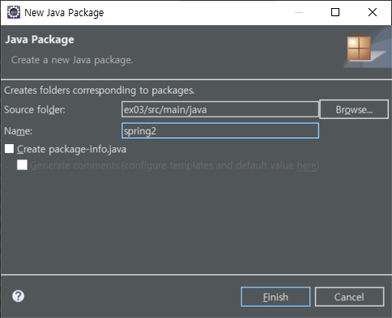
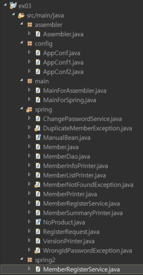

# Spring

## @Qualifier

자동 주입 가능한 빈이 두 개 이상인 경우, 자동 주입할 빈을 지정할 때 사용하는 애노테이션


/ex03/src/main/java/config/AppConf.java

```java
@Configuration
public class AppConf {

	@Bean
	public MemberDao memberDao() {
		return new MemberDao();
	}
	
	// 동일한 타입(MemberPrinter)의 빈 객체가 2개 존재 (memberPrinter1, memberPrinter2)
	@Bean
	public MemberPrinter memberPrinter1() {
		return new MemberPrinter();
	}

	@Bean
	public MemberPrinter memberPrinter2() {
		return new MemberPrinter();
	}
					:
```


/ex03/src/main/java/spring/MemberInfoPrinter.java

```java
public class MemberInfoPrinter {
	private MemberDao memberDao;
	private MemberPrinter memberPrinter;

	@Autowired
	public void setMemberDao(MemberDao memberDao) {
		this.memberDao = memberDao;
	}

	@Autowired
	public void setMemberPrinter(MemberPrinter memberPrinter) {
		this.memberPrinter = memberPrinter;
	}
					:
```


/ex03/src/main/java/spring/MemberListPrinter.java

```java
public class MemberListPrinter {
	
	@Autowired
	private MemberDao memberDao;
	@Autowired
	private MemberPrinter memberPrinter;
	
	public void printAll() {
		Collection<Member> members = memberDao.selectAll();		
		members.forEach(member -> memberPrinter.print(member));
	}
}
```

동일한 타입의 빈이 2개 존재하는데, 일치하는 이름(memberPrinter)의 빈이 존재하지 않기 때문에 오류가 발생


```
4월 11, 2020 9:44:16 오전 org.springframework.context.support.AbstractApplicationContext prepareRefresh
정보: Refreshing org.springframework.context.annotation.AnnotationConfigApplicationContext@41906a77: startup date [Sat Apr 11 09:44:16 KST 2020]; root of context hierarchy
4월 11, 2020 9:44:16 오전 org.springframework.context.support.AbstractApplicationContext refresh
경고: Exception encountered during context initialization - cancelling refresh attempt: org.springframework.beans.factory.UnsatisfiedDependencyException: Error creating bean with name 'memberListPrinter': Unsatisfied dependency expressed through field 'memberPrinter'; nested exception is org.springframework.beans.factory.NoUniqueBeanDefinitionException: No qualifying bean of type 'spring.MemberPrinter' available: expected single matching bean but found 2: memberPrinter1,memberPrinter2
Exception in thread "main" org.springframework.beans.factory.UnsatisfiedDependencyException: Error creating bean with name 'memberListPrinter': Unsatisfied dependency expressed through field 'memberPrinter'; nested exception is org.springframework.beans.factory.NoUniqueBeanDefinitionException: No qualifying bean of type 'spring.MemberPrinter' available: expected single matching bean but found 2: memberPrinter1,memberPrinter2
	at org.springframework.beans.factory.annotation.AutowiredAnnotationBeanPostProcessor$AutowiredFieldElement.inject(AutowiredAnnotationBeanPostProcessor.java:586)
	at org.springframework.beans.factory.annotation.InjectionMetadata.inject(InjectionMetadata.java:91)
	at org.springframework.beans.factory.annotation.AutowiredAnnotationBeanPostProcessor.postProcessPropertyValues(AutowiredAnnotationBeanPostProcessor.java:372)
	at org.springframework.beans.factory.support.AbstractAutowireCapableBeanFactory.populateBean(AbstractAutowireCapableBeanFactory.java:1344)
	at org.springframework.beans.factory.support.AbstractAutowireCapableBeanFactory.doCreateBean(AbstractAutowireCapableBeanFactory.java:582)
	at org.springframework.beans.factory.support.AbstractAutowireCapableBeanFactory.createBean(AbstractAutowireCapableBeanFactory.java:502)
	at org.springframework.beans.factory.support.AbstractBeanFactory.lambda$doGetBean$0(AbstractBeanFactory.java:312)
	at org.springframework.beans.factory.support.DefaultSingletonBeanRegistry.getSingleton(DefaultSingletonBeanRegistry.java:228)
	at org.springframework.beans.factory.support.AbstractBeanFactory.doGetBean(AbstractBeanFactory.java:310)
	at org.springframework.beans.factory.support.AbstractBeanFactory.getBean(AbstractBeanFactory.java:200)
	at org.springframework.beans.factory.support.DefaultListableBeanFactory.preInstantiateSingletons(DefaultListableBeanFactory.java:758)
	at org.springframework.context.support.AbstractApplicationContext.finishBeanFactoryInitialization(AbstractApplicationContext.java:868)
	at org.springframework.context.support.AbstractApplicationContext.refresh(AbstractApplicationContext.java:549)
	at org.springframework.context.annotation.AnnotationConfigApplicationContext.<init>(AnnotationConfigApplicationContext.java:88)
	at main.MainForSpring.main(MainForSpring.java:27)
Caused by: org.springframework.beans.factory.NoUniqueBeanDefinitionException: No qualifying bean of type 'spring.MemberPrinter' available: expected single matching bean but found 2: memberPrinter1,memberPrinter2
	at org.springframework.beans.factory.config.DependencyDescriptor.resolveNotUnique(DependencyDescriptor.java:215)
	at org.springframework.beans.factory.support.DefaultListableBeanFactory.doResolveDependency(DefaultListableBeanFactory.java:1113)
	at org.springframework.beans.factory.support.DefaultListableBeanFactory.resolveDependency(DefaultListableBeanFactory.java:1062)
	at org.springframework.beans.factory.annotation.AutowiredAnnotationBeanPostProcessor$AutowiredFieldElement.inject(AutowiredAnnotationBeanPostProcessor.java:583)
	... 14 more
```


---

memberPrinter 이름의 빈을 정의하면 정상적으로 동작

```java
@Configuration
public class AppConf {

	@Bean
	public MemberDao memberDao() {
		return new MemberDao();
	}
	
	@Bean
	public MemberPrinter memberPrinter() {
		return new MemberPrinter();
	}

	@Bean
	public MemberPrinter memberPrinter2() {
		return new MemberPrinter();
	}
					:
```


---

빈 이름은 기본적으로 메서드 명과 동일해야 하나 이름이 다르거나 여러개 있는 경우 빈을 특정할 때 @Qualifier 애노테이션을 사용


```java
@Configuration
public class AppConf {

	@Bean
	public MemberDao memberDao() {
		return new MemberDao();
	}
	
	@Bean
    @Qualifier("memberPrinter")
	public MemberPrinter memberPrinter1() {
		return new MemberPrinter();
	}

	@Bean
	public MemberPrinter memberPrinter2() {
		return new MemberPrinter();
	}
					:
```


```java
public class MemberInfoPrinter {
	private MemberDao memberDao;
	private MemberPrinter memberPrinter;

	@Autowired
	public void setMemberDao(MemberDao memberDao) {
		this.memberDao = memberDao;
	}

	@Autowired
    @Qualifier("memberPrinter")
	public void setMemberPrinter(MemberPrinter memberPrinter) {
		this.memberPrinter = memberPrinter;
	}
					:
```


```java
public class MemberListPrinter {
	
	@Autowired
	private MemberDao memberDao;
	@Autowired
    @Qualifier("memberPrinter")
	private MemberPrinter memberPrinter;
	
	public void printAll() {
		Collection<Member> members = memberDao.selectAll();		
		members.forEach(member -> memberPrinter.print(member));
	}
}
```


---


```java
@Configuration
public class AppConf {

	// 	빈 한정자(qualifier) = 빈 이름 ==> memberDao
	@Bean
	public MemberDao memberDao() {
		return new MemberDao();
	}
	
	//	빈 한정자(qualifier) = @Qualifier 애노테이션의 값 ==> memberPrinter
	@Bean
	@Qualifier("memberPrinter")
	public MemberPrinter memberPrinter1() {
		return new MemberPrinter();
	}
					:
```


```java
public class MemberListPrinter {
	
	//	한정자 = 필드 이름 ==> memberDao
	@Autowired
	private MemberDao memberDao;
	
	//	한정자 = @Qualifier 애노테이션의 값 ==> memberPrinter
	@Autowired
	@Qualifier("memberPrinter")
	private MemberPrinter memberPrinter;
					:
```


## 상속 관계에 있는 빈을 선언하는 경우

/ex03/src/main/java/spring/MemberSummaryPrinter.java

```java
package spring;

public class MemberSummaryPrinter extends MemberPrinter {

	@Override
	public void print(Member member) {
		System.out.printf(
			"회원 정보 : 아이디 = %d\t 이메일 = %s\t 이름 = %s\t\n", 
			member.getId(), member.getEmail(), member.getName()
		);
	}	
}
```


/ex03/src/main/java/config/AppConf.java

```java
@Configuration
public class AppConf {

	@Bean
	public MemberDao memberDao() {
		return new MemberDao();
	}
	
	@Bean
	public MemberPrinter memberPrinter1() {
		return new MemberPrinter();
	}

	@Bean
	public MemberSummaryPrinter memberPrinter2() {
		return new MemberSummaryPrinter();
	}
					:
```

memberPrinter1과 memberPrinter2의 타입이 다르다


/ex03/src/main/java/spring/MemberInfoPrinter.java

```java
public class MemberInfoPrinter {
	private MemberDao memberDao;
	private MemberPrinter memberPrinter;

	@Autowired
	public void setMemberDao(MemberDao memberDao) {
		this.memberDao = memberDao;
	}

	@Autowired
	public void setMemberPrinter(MemberPrinter memberPrinter) {
		this.memberPrinter = memberPrinter;
	}
            		:  
```


/ex03/src/main/java/spring/MemberListPrinter.java

```java
public class MemberListPrinter {
	
	@Autowired
	private MemberDao memberDao;
	
	@Autowired
	private MemberPrinter memberPrinter;
	
	public void printAll() {
		Collection<Member> members = memberDao.selectAll();		
		members.forEach(member -> memberPrinter.print(member));
	}
}
```


```
4월 11, 2020 10:15:49 오전 org.springframework.context.support.AbstractApplicationContext prepareRefresh
정보: Refreshing org.springframework.context.annotation.AnnotationConfigApplicationContext@41906a77: startup date [Sat Apr 11 10:15:49 KST 2020]; root of context hierarchy
4월 11, 2020 10:15:51 오전 org.springframework.context.support.AbstractApplicationContext refresh
경고: Exception encountered during context initialization - cancelling refresh attempt: org.springframework.beans.factory.UnsatisfiedDependencyException: Error creating bean with name 'memberListPrinter': Unsatisfied dependency expressed through field 'memberPrinter'; nested exception is org.springframework.beans.factory.NoUniqueBeanDefinitionException: No qualifying bean of type 'spring.MemberPrinter' available: expected single matching bean but found 2: memberPrinter1,memberPrinter2
Exception in thread "main" org.springframework.beans.factory.UnsatisfiedDependencyException: Error creating bean with name 'memberListPrinter': Unsatisfied dependency expressed through field 'memberPrinter'; nested exception is org.springframework.beans.factory.NoUniqueBeanDefinitionException: No qualifying bean of type 'spring.MemberPrinter' available: expected single matching bean but found 2: memberPrinter1,memberPrinter2
	at org.springframework.beans.factory.annotation.AutowiredAnnotationBeanPostProcessor$AutowiredFieldElement.inject(AutowiredAnnotationBeanPostProcessor.java:586)
	at org.springframework.beans.factory.annotation.InjectionMetadata.inject(InjectionMetadata.java:91)
	at org.springframework.beans.factory.annotation.AutowiredAnnotationBeanPostProcessor.postProcessPropertyValues(AutowiredAnnotationBeanPostProcessor.java:372)
	at org.springframework.beans.factory.support.AbstractAutowireCapableBeanFactory.populateBean(AbstractAutowireCapableBeanFactory.java:1344)
	at org.springframework.beans.factory.support.AbstractAutowireCapableBeanFactory.doCreateBean(AbstractAutowireCapableBeanFactory.java:582)
	at org.springframework.beans.factory.support.AbstractAutowireCapableBeanFactory.createBean(AbstractAutowireCapableBeanFactory.java:502)
	at org.springframework.beans.factory.support.AbstractBeanFactory.lambda$doGetBean$0(AbstractBeanFactory.java:312)
	at org.springframework.beans.factory.support.DefaultSingletonBeanRegistry.getSingleton(DefaultSingletonBeanRegistry.java:228)
	at org.springframework.beans.factory.support.AbstractBeanFactory.doGetBean(AbstractBeanFactory.java:310)
	at org.springframework.beans.factory.support.AbstractBeanFactory.getBean(AbstractBeanFactory.java:200)
	at org.springframework.beans.factory.support.DefaultListableBeanFactory.preInstantiateSingletons(DefaultListableBeanFactory.java:758)
	at org.springframework.context.support.AbstractApplicationContext.finishBeanFactoryInitialization(AbstractApplicationContext.java:868)
	at org.springframework.context.support.AbstractApplicationContext.refresh(AbstractApplicationContext.java:549)
	at org.springframework.context.annotation.AnnotationConfigApplicationContext.<init>(AnnotationConfigApplicationContext.java:88)
	at main.MainForSpring.main(MainForSpring.java:27)
Caused by: org.springframework.beans.factory.NoUniqueBeanDefinitionException: No qualifying bean of type 'spring.MemberPrinter' available: expected single matching bean but found 2: memberPrinter1,memberPrinter2
	at org.springframework.beans.factory.config.DependencyDescriptor.resolveNotUnique(DependencyDescriptor.java:215)
	at org.springframework.beans.factory.support.DefaultListableBeanFactory.doResolveDependency(DefaultListableBeanFactory.java:1113)
	at org.springframework.beans.factory.support.DefaultListableBeanFactory.resolveDependency(DefaultListableBeanFactory.java:1062)
	at org.springframework.beans.factory.annotation.AutowiredAnnotationBeanPostProcessor$AutowiredFieldElement.inject(AutowiredAnnotationBeanPostProcessor.java:583)
	... 14 more
```


### @Qualifier 애노테이션을 사용해서 주입할 빈을 한정

```java
@Configuration
public class AppConf {

	@Bean
	public MemberDao memberDao() {
		return new MemberDao();
	}
	
	@Bean
	@Qualifier("printer")
	public MemberPrinter memberPrinter1() {
		return new MemberPrinter();
	}

	@Bean
	@Qualifier("summaryPrinter")
	public MemberSummaryPrinter memberPrinter2() {
		return new MemberSummaryPrinter();
	}
					:
```


```java
public class MemberListPrinter {
	
	@Autowired
	private MemberDao memberDao;
	
	@Autowired
	@Qualifier("summaryPrinter")
	private MemberPrinter memberPrinter;
	
	public void printAll() {
		Collection<Member> members = memberDao.selectAll();		
		members.forEach(member -> memberPrinter.print(member));
	}
}
```


```java
public class MemberInfoPrinter {
	private MemberDao memberDao;
	private MemberPrinter memberPrinter;

	@Autowired
	public void setMemberDao(MemberDao memberDao) {
		this.memberDao = memberDao;
	}

	@Autowired
	@Qualifier("printer")
	public void setMemberPrinter(MemberPrinter memberPrinter) {
		this.memberPrinter = memberPrinter;
	}
	
	public void printMemberInfo(String email) {
		Member member = memberDao.selectByEmail(email);
		if (member == null) {
			System.out.println("일치하는 회원 정보 없음");
			return;
		}
		memberPrinter.print(member);
	}
}
```


### 테스트

```
4월 11, 2020 10:24:48 오전 org.springframework.context.support.AbstractApplicationContext prepareRefresh
정보: Refreshing org.springframework.context.annotation.AnnotationConfigApplicationContext@41906a77: startup date [Sat Apr 11 10:24:48 KST 2020]; root of context hierarchy
명령어를 입력하세요.
new aaa@test.com aaa 123 123
명령어를 입력하세요.
list
회원 정보 : 아이디 = 1	 이메일 = aaa@test.com	 이름 = aaa	
명령어를 입력하세요.
info aaa@test.com
회원 정보 : 아이디 = 1	 이메일 = aaa@test.com	 이름 = aaa	 등록일 = 2020-04-11
명령어를 입력하세요.
exit
프로그램을 종료합니다.
```


## 자동 주입이 필수가 아닌 경우


/ex03/src/main/java/spring/MemberPrinter.java

```java
public class MemberPrinter {
	
	private DateTimeFormatter dateTimeFormatter;
	
	public MemberPrinter() {
		dateTimeFormatter = DateTimeFormatter.ofPattern("yyyy년 MM월 dd일");
	}
	
	// 파라미터로 전달된 회원 정보를 형식에 맞춰서 출력
	public void print(Member member) {
		if (dateTimeFormatter == null) {
			System.out.printf(
				"회원 정보 : 아이디 = %d\t 이메일 = %s\t 이름 = %s\t 등록일 = %tF\n",
				member.getId(), member.getEmail(), member.getName(),
				member.getRegisterDateTime()
			);
		} else {
			System.out.printf(
				"회원 정보 : 아이디 = %d\t 이메일 = %s\t 이름 = %s\t 등록일 = %tF\n",
				member.getId(), member.getEmail(), member.getName(),
				dateTimeFormatter.format(member.getRegisterDateTime())
			);
		}
	}
	
	@Autowired
	public void setDateTimeFormatter(DateTimeFormatter dateTimeFormatter) {
		this.dateTimeFormatter = dateTimeFormatter;
	}
}
```


```
4월 11, 2020 10:40:51 오전 org.springframework.context.support.AbstractApplicationContext prepareRefresh
정보: Refreshing org.springframework.context.annotation.AnnotationConfigApplicationContext@41906a77: startup date [Sat Apr 11 10:40:50 KST 2020]; root of context hierarchy
4월 11, 2020 10:40:52 오전 org.springframework.context.support.AbstractApplicationContext refresh
경고: Exception encountered during context initialization - cancelling refresh attempt: org.springframework.beans.factory.UnsatisfiedDependencyException: Error creating bean with name 'memberPrinter1': Unsatisfied dependency expressed through method 'setDateTimeFormatter' parameter 0; nested exception is org.springframework.beans.factory.NoSuchBeanDefinitionException: No qualifying bean of type 'java.time.format.DateTimeFormatter' available: expected at least 1 bean which qualifies as autowire candidate. Dependency annotations: {}
Exception in thread "main" org.springframework.beans.factory.UnsatisfiedDependencyException: Error creating bean with name 'memberPrinter1': Unsatisfied dependency expressed through method 'setDateTimeFormatter' parameter 0; nested exception is org.springframework.beans.factory.NoSuchBeanDefinitionException: No qualifying bean of type 'java.time.format.DateTimeFormatter' available: expected at least 1 bean which qualifies as autowire candidate. Dependency annotations: {}
	at org.springframework.beans.factory.annotation.AutowiredAnnotationBeanPostProcessor$AutowiredMethodElement.inject(AutowiredAnnotationBeanPostProcessor.java:667)
	at org.springframework.beans.factory.annotation.InjectionMetadata.inject(InjectionMetadata.java:91)
	at org.springframework.beans.factory.annotation.AutowiredAnnotationBeanPostProcessor.postProcessPropertyValues(AutowiredAnnotationBeanPostProcessor.java:372)
	at org.springframework.beans.factory.support.AbstractAutowireCapableBeanFactory.populateBean(AbstractAutowireCapableBeanFactory.java:1344)
	at org.springframework.beans.factory.support.AbstractAutowireCapableBeanFactory.doCreateBean(AbstractAutowireCapableBeanFactory.java:582)
	at org.springframework.beans.factory.support.AbstractAutowireCapableBeanFactory.createBean(AbstractAutowireCapableBeanFactory.java:502)
	at org.springframework.beans.factory.support.AbstractBeanFactory.lambda$doGetBean$0(AbstractBeanFactory.java:312)
	at org.springframework.beans.factory.support.DefaultSingletonBeanRegistry.getSingleton(DefaultSingletonBeanRegistry.java:228)
	at org.springframework.beans.factory.support.AbstractBeanFactory.doGetBean(AbstractBeanFactory.java:310)
	at org.springframework.beans.factory.support.AbstractBeanFactory.getBean(AbstractBeanFactory.java:200)
	at org.springframework.beans.factory.support.DefaultListableBeanFactory.preInstantiateSingletons(DefaultListableBeanFactory.java:758)
	at org.springframework.context.support.AbstractApplicationContext.finishBeanFactoryInitialization(AbstractApplicationContext.java:868)
	at org.springframework.context.support.AbstractApplicationContext.refresh(AbstractApplicationContext.java:549)
	at org.springframework.context.annotation.AnnotationConfigApplicationContext.<init>(AnnotationConfigApplicationContext.java:88)
	at main.MainForSpring.main(MainForSpring.java:27)
Caused by: org.springframework.beans.factory.NoSuchBeanDefinitionException: No qualifying bean of type 'java.time.format.DateTimeFormatter' available: expected at least 1 bean which qualifies as autowire candidate. Dependency annotations: {}
	at org.springframework.beans.factory.support.DefaultListableBeanFactory.raiseNoMatchingBeanFound(DefaultListableBeanFactory.java:1504)
	at org.springframework.beans.factory.support.DefaultListableBeanFactory.doResolveDependency(DefaultListableBeanFactory.java:1101)
	at org.springframework.beans.factory.support.DefaultListableBeanFactory.resolveDependency(DefaultListableBeanFactory.java:1062)
	at org.springframework.beans.factory.annotation.AutowiredAnnotationBeanPostProcessor$AutowiredMethodElement.inject(AutowiredAnnotationBeanPostProcessor.java:659)
	... 14 more
```


### @Autowired 애노테이션의 required 속성을 false로 지정

```java
public class MemberPrinter {
	
	private DateTimeFormatter dateTimeFormatter;
	
	public MemberPrinter() {
		dateTimeFormatter = DateTimeFormatter.ofPattern("yyyy년 MM월 dd일");
	}
	
	// 파라미터로 전달된 회원 정보를 형식에 맞춰서 출력
	public void print(Member member) {
		if (dateTimeFormatter == null) {
			System.out.printf(
				"회원 정보 : 아이디 = %d\t 이메일 = %s\t 이름 = %s\t 등록일 = %tF\n",
				member.getId(), member.getEmail(), member.getName(),
				member.getRegisterDateTime()
			);
		} else {
			System.out.printf(
				"회원 정보 : 아이디 = %d\t 이메일 = %s\t 이름 = %s\t 등록일 = %s\n",
				member.getId(), member.getEmail(), member.getName(),
				dateTimeFormatter.format(member.getRegisterDateTime())
			);
		}
	}
	
	// 매칭되는 빈이 없어도 예외를 발생하지 않고 자동 주입을 수행하지 않음
	@Autowired(required = false)
	public void setDateTimeFormatter(DateTimeFormatter dateTimeFormatter) {
		this.dateTimeFormatter = dateTimeFormatter;
	}
}
```


```
4월 11, 2020 11:04:42 오전 org.springframework.context.support.AbstractApplicationContext prepareRefresh
정보: Refreshing org.springframework.context.annotation.AnnotationConfigApplicationContext@41906a77: startup date [Sat Apr 11 11:04:42 KST 2020]; root of context hierarchy
명령어를 입력하세요.
new aaa@test.com aaa 123 123
명령어를 입력하세요.
info aaa@test.com
회원 정보 : 아이디 = 1	 이메일 = aaa@test.com	 이름 = aaa	 등록일 = 2020년 04월 11일
명령어를 입력하세요.
```


### 의존 주입 대상에 Optional을 사용 (Java 8 이상, Spring 5 이상)

```java
public class MemberPrinter {
	
	private DateTimeFormatter dateTimeFormatter;
	
	public MemberPrinter() {
		dateTimeFormatter = DateTimeFormatter.ofPattern("yyyy년 MM월 dd일");
	}
	
	public void print(Member member) {
		if (dateTimeFormatter == null) {
			System.out.printf(
				"회원 정보 : 아이디 = %d\t 이메일 = %s\t 이름 = %s\t 등록일 = %tF\n",
				member.getId(), member.getEmail(), member.getName(),
				member.getRegisterDateTime()
			);
		} else {
			System.out.printf(
				"회원 정보 : 아이디 = %d\t 이메일 = %s\t 이름 = %s\t 등록일 = %s\n",
				member.getId(), member.getEmail(), member.getName(),
				dateTimeFormatter.format(member.getRegisterDateTime())
			);
		}
	}
	
//	@Autowired(required = false)
//	public void setDateTimeFormatter(DateTimeFormatter dateTimeFormatter) {
//		this.dateTimeFormatter = dateTimeFormatter;
//	}
	
	@Autowired
	public void setDateTimeFormatter(Optional<DateTimeFormatter> dateTimeFormatter) {
		if (dateTimeFormatter.isPresent()) {
			this.dateTimeFormatter = dateTimeFormatter.get();
		} else {
			this.dateTimeFormatter = null;
		}
	}
}
```


```java
4월 11, 2020 11:08:44 오전 org.springframework.context.support.AbstractApplicationContext prepareRefresh
정보: Refreshing org.springframework.context.annotation.AnnotationConfigApplicationContext@41906a77: startup date [Sat Apr 11 11:08:44 KST 2020]; root of context hierarchy
명령어를 입력하세요.
new aaa@test.com aaa 123 123
명령어를 입력하세요.
info aaa@test.com
회원 정보 : 아이디 = 1	 이메일 = aaa@test.com	 이름 = aaa	 등록일 = 2020-04-11
명령어를 입력하세요.
```


### @Nullable 애노테이션 사용

```java
public class MemberPrinter {
	
	private DateTimeFormatter dateTimeFormatter;
	
	public MemberPrinter() {
		dateTimeFormatter = DateTimeFormatter.ofPattern("yyyy년 MM월 dd일");
	}
	
	public void print(Member member) {
		if (dateTimeFormatter == null) {
			System.out.printf(
				"회원 정보 : 아이디 = %d\t 이메일 = %s\t 이름 = %s\t 등록일 = %tF\n",
				member.getId(), member.getEmail(), member.getName(),
				member.getRegisterDateTime()
			);
		} else {
			System.out.printf(
				"회원 정보 : 아이디 = %d\t 이메일 = %s\t 이름 = %s\t 등록일 = %s\n",
				member.getId(), member.getEmail(), member.getName(),
				dateTimeFormatter.format(member.getRegisterDateTime())
			);
		}
	}
	
//	@Autowired(required = false)
//	public void setDateTimeFormatter(DateTimeFormatter dateTimeFormatter) {
//		this.dateTimeFormatter = dateTimeFormatter;
//	}
	
//	@Autowired
//	public void setDateTimeFormatter(Optional<DateTimeFormatter> dateTimeFormatter) {
//		if (dateTimeFormatter.isPresent()) {
//			this.dateTimeFormatter = dateTimeFormatter.get();
//		} else {
//			this.dateTimeFormatter = null;
//		}
//	}
	
	@Autowired
	public void setDateTimeFormatter(@Nullable DateTimeFormatter dateTimeFormatter) {
		this.dateTimeFormatter = dateTimeFormatter;
	}
}
```


```
4월 11, 2020 11:29:51 오전 org.springframework.context.support.AbstractApplicationContext prepareRefresh
정보: Refreshing org.springframework.context.annotation.AnnotationConfigApplicationContext@41906a77: startup date [Sat Apr 11 11:29:51 KST 2020]; root of context hierarchy
명령어를 입력하세요.
new aaa@test.com aaa 123 123
명령어를 입력하세요.
info aaa@test.com
회원 정보 : 아이디 = 1	 이메일 = aaa@test.com	 이름 = aaa	 등록일 = 2020-04-11
명령어를 입력하세요.
```


### @Autowired(required = faluse)와 @Nullable 애노테이션의 차이

자동 주입할 빈 객체가 존재하지 않을 경우에,

@Autowired(required = false)는 setter 메서드를 실행하지 않는 반면,

@Nullable는 setter 메서드를 실행한다. 이때 setter 메서드에 전달되는 자동 주입할 빈 객체는 null이다.


```java
	@Autowired(required = false)
	public void setDateTimeFormatter(DateTimeFormatter dateTimeFormatter) {
		System.out.println("setDateTimeFormatter() called...");
		System.out.println(dateTimeFormatter);
		this.dateTimeFormatter = dateTimeFormatter;
	}
```

⇒ 실행 결과

[아무 내용이 출력되지 않음] ← setter 메서드가 실행되지 않음


```java
	@Autowired
	public void setDateTimeFormatter(@Nullable DateTimeFormatter dateTimeFormatter) {
		System.out.println("setDateTimeFormatter() called...");
		System.out.println(dateTimeFormatter);
		this.dateTimeFormatter = dateTimeFormatter;
	}
```

⇒ 실행 결과

```
setDateTimeFormatter() called...
null
```


---

### 실습

MemberPrinter.java를 아래와 같이 변경했을 때, @Autowired 애노테이션에서 오류가 발생하지 않도록 3가지 기법으로 수정

@Autowired(required = false)

Optional

@Nullable 


```java
public class MemberPrinter {

	@Autowired
	private DateTimeFormatter dateTimeFormatter;
	
	public MemberPrinter() {
		dateTimeFormatter = DateTimeFormatter.ofPattern("yyyy년 MM월 dd일");
	}
	
	public void print(Member member) {
		if (dateTimeFormatter == null) {
			System.out.printf(
				"회원 정보 : 아이디 = %d\t 이메일 = %s\t 이름 = %s\t 등록일 = %tF\n", 
					member.getId(), member.getEmail(), member.getName(), 
					member.getRegisterDateTime()
			);
		} else {
			System.out.printf(
				"회원 정보 : 아이디 = %d\t 이메일 = %s\t 이름 = %s\t 등록일 = %s\n", 
					member.getId(), member.getEmail(), member.getName(), 
					dateTimeFormatter.format(member.getRegisterDateTime())
			);
		}		
	}
}
```


#### 방법1.

```java
public class MemberPrinter {
	
	@Autowired(required = false)
	private DateTimeFormatter dateTimeFormatter;
    				:
```


#### 방법2.

```java
public class MemberPrinter {
	
	@Autowired
	private Optional<DateTimeFormatter> optFormatter;
	
//	public MemberPrinter() {
//		dateTimeFormatter = DateTimeFormatter.ofPattern("yyyy년 MM월 dd일");
//	}
	
	public void print(Member member) {
		if (!optFormatter.isPresent()) {
			System.out.printf(
				"회원 정보 : 아이디 = %d\t 이메일 = %s\t 이름 = %s\t 등록일 = %tF\n",
				member.getId(), member.getEmail(), member.getName(),
				member.getRegisterDateTime()
			);
		} else {
			DateTimeFormatter dateTimeFormatter = optFormatter.get();
			dateTimeFormatter = DateTimeFormatter.ofPattern("yyyy년 MM월 dd일");
			System.out.printf(
				"회원 정보 : 아이디 = %d\t 이메일 = %s\t 이름 = %s\t 등록일 = %s\n",
				member.getId(), member.getEmail(), member.getName(),
				dateTimeFormatter.format(member.getRegisterDateTime())
			);
		}
	}
}
```


#### 방법3.

```java
public class MemberPrinter {
	
	@Autowired
	@Nullable
	private DateTimeFormatter dateTimeFormatter;
    				:
```


## 명시적으로 의존성을 주입해 주는 것과 자동으로 의존성을 주입해 주는 것의 관계

직접 주입 방식과 자동 주입 방식이 같이 구현되어 있는 경우


/ex03/src/main/java/config/AppConf.java

```java
@Configuration
public class AppConf {
	
	@Bean
	public MemberDao memberDao() {
		return new MemberDao();
	}
	
	@Bean
	public MemberRegisterService memberRegisterService() {
		return new MemberRegisterService();
	}
	
	@Bean
	public ChangePasswordService changePasswordService() {
		return new ChangePasswordService();
	}
	
	@Bean
	@Qualifier("printer")
	public MemberPrinter memberPrinter1() {
		return new MemberPrinter();
	}

	@Bean
	@Qualifier("summaryPrinter")
	public MemberSummaryPrinter memberPrinter2() {
		return new MemberSummaryPrinter();
	}
	
	@Bean
	public MemberListPrinter memberListPrinter() {
		return new MemberListPrinter();
	}
	
	@Bean
	public MemberInfoPrinter memberInfoPrinter() {
		MemberInfoPrinter memberInfoPrinter = new MemberInfoPrinter();
		memberInfoPrinter.setMemberDao(memberDao());
		memberInfoPrinter.setMemberPrinter(memberPrinter2());
		return memberInfoPrinter;
	}
	
	@Bean
	public VersionPrinter versionPrinter() {
		VersionPrinter vp = new VersionPrinter();
		vp.setMajorVersion(5);
		vp.setMinerVersion(0);
		return vp;
	}
}
```


/ex03/src/main/java/spring/MemberInfoPrinter.java

```java
public class MemberInfoPrinter {
	private MemberDao memberDao;
	private MemberPrinter memberPrinter;

	@Autowired
	public void setMemberDao(MemberDao memberDao) {
		this.memberDao = memberDao;
	}

	@Autowired
	@Qualifier("printer")
	public void setMemberPrinter(MemberPrinter memberPrinter) {
		this.memberPrinter = memberPrinter;
	}
	
	public void printMemberInfo(String email) {
		Member member = memberDao.selectByEmail(email);
		if (member == null) {
			System.out.println("일치하는 회원 정보 없음");
			return;
		}
		memberPrinter.print(member);
	}
}
```


[실행 결과]

```
명령어를 입력하세요.
new aaa@test.com aaa 123 123
명령어를 입력하세요.
info aaa@test.com
회원 정보 : 아이디 = 1	 이메일 = aaa@test.com	 이름 = aaa	 등록일 = 2020년 04월 11일
```


* MemberInfoPrinter 객체는 MemberPrinter에 의존한다.
* 의존 객체(MemberPrinter)가 있어야 MemberInfoPrinter가 동작할 수 있다.
* 의존성 주입(DI) 기법을 이용하면 의존 객체를 외부에서 생성해서 주입해 줄 수 있다.
* 직접 주입하는 방법이 있고,
  * 외부에서 setter 메서드 또는 생성자를 이용해서 의존 객체를 주입
* 자동 주입하는 방법이 있다. 
  * @Autowired 애노테이션을 사용할 객체(의존 객체) 타입의 필드 선언부 또는 setter 메서드에 붙이면 스프링이 자동으로 의존 객체를 주입


위 예에서 자동 주입할 때는 MemberPrinter가 주입되고, 직접 주입할 때는 MemberSummaryPrinter가 주입되도록 되어 있는데, … 실행 결과에 등록일이 출력되는 것을 보아 MemberPrinter가 주입된 것을 알 수 있다.


**직접 주입하는 방법과 자동 주입하는 방법이 동시에 구현되어 있는 경우에는 자동 주입 방법이 우선적으로 적용**된다. 


## 컴포넌트 스캔

스프링이 클래스를 검색해서 빈으로 등록해 주는 기능

⇒ 설정 클래스에 빈으로 등록하지 않아도 원하는 클래스를 빈으로 등록 가능

⇒ 설정 클래스 코드가 감소


### @Component

컴포넌트 스캔 대상을 지정

@Component 애노테이션에 값을 설정하지 않으면 클래스 이름의 첫글자를 소문자로 바꾼 이름을 빈(bean) 이름으로 사용

@Component 애노테이션에 값을 설정하면 해당 값을 빈 이름으로 사용


```java
@Component
public class MemberDao {
    		:
```


```java
@Component
public class ChangePasswordService {
    		:
```


```java
@Component
public class MemberRegisterService {
    		:
```


```java
@Component("infoPrinter")
public class MemberInfoPrinter {
    		:
```


```java
@Component("listPrinter")
public class MemberListPrinter {
    		:
```


### @ComponentScan

@Compnonet 애노테이션을 붙인 클래스를 스캔해서 스프링 빈으로 등록

```java
@Configuration
@ComponentScan(basePackages = { "spring" }) // 스캔 대상 패키지 목록을 지정
public class AppConf {
	
	@Bean
	@Qualifier("printer")
	public MemberPrinter memberPrinter1() {
		return new MemberPrinter();
	}

	@Bean
	@Qualifier("summaryPrinter")
	public MemberSummaryPrinter memberPrinter2() {
		return new MemberSummaryPrinter();
	}

	@Bean
	public VersionPrinter versionPrinter() {
		VersionPrinter vp = new VersionPrinter();
		vp.setMajorVersion(5);
		vp.setMinerVersion(0);
		return vp;
	}
}
```


@Component 애노테이션으로 스캐닝 대상을 지정할 때 listPrinter, infoPrinter로 빈 이름을 변경했으므로 getBean() 메서드에서 변경한 이름을 사용해야 함


```java
public class MainForSpring {

	private static ApplicationContext ctx = null;
    
				:
    
	private static void doInfo(String[] args) {
		if (args.length != 2) {
			printHelp();
			return;
		}
		
		MemberInfoPrinter mip = ctx.getBean("infoPrinter", MemberInfoPrinter.class);
		mip.printMemberInfo(args[1]);
	}

	private static void doList() {
		MemberListPrinter mlp = ctx.getBean("listPrinter", MemberListPrinter.class);
		mlp.printAll();
	}
}
```


## 컴포넌트 스캔 대상에서 제외하거나 포함하기

### 참고자료 : 정규식

https://developer.mozilla.org/ko/docs/Web/JavaScript/Guide/%EC%A0%95%EA%B7%9C%EC%8B%9D


### excludeFilters 속성

정규식을 이용해서 제외 대상을 지정


```java
@Configuration
@ComponentScan(
	basePackages = { "spring" },
	excludeFilters = @Filter(type = FilterType.REGEX, pattern = "spring\\..*Dao")
)
public class AppConf {
    			:
```


=> 실행하면 오류가 난다.

```
4월 11, 2020 3:47:01 오후 org.springframework.context.support.AbstractApplicationContext prepareRefresh
정보: Refreshing org.springframework.context.annotation.AnnotationConfigApplicationContext@41906a77: startup date [Sat Apr 11 15:47:00 KST 2020]; root of context hierarchy
4월 11, 2020 3:47:01 오후 org.springframework.context.support.AbstractApplicationContext refresh
경고: Exception encountered during context initialization - cancelling refresh attempt: org.springframework.beans.factory.UnsatisfiedDependencyException: Error creating bean with name 'changePasswordService': Unsatisfied dependency expressed through method 'setMemberDao' parameter 0; nested exception is org.springframework.beans.factory.NoSuchBeanDefinitionException: No qualifying bean of type 'spring.MemberDao' available: expected at least 1 bean which qualifies as autowire candidate. Dependency annotations: {}
Exception in thread "main" org.springframework.beans.factory.UnsatisfiedDependencyException: Error creating bean with name 'changePasswordService': Unsatisfied dependency expressed through method 'setMemberDao' parameter 0; nested exception is org.springframework.beans.factory.NoSuchBeanDefinitionException: No qualifying bean of type 'spring.MemberDao' available: expected at least 1 bean which qualifies as autowire candidate. Dependency annotations: {}
	at org.springframework.beans.factory.annotation.AutowiredAnnotationBeanPostProcessor$AutowiredMethodElement.inject(AutowiredAnnotationBeanPostProcessor.java:667)
	at org.springframework.beans.factory.annotation.InjectionMetadata.inject(InjectionMetadata.java:91)
	at org.springframework.beans.factory.annotation.AutowiredAnnotationBeanPostProcessor.postProcessPropertyValues(AutowiredAnnotationBeanPostProcessor.java:372)
	at org.springframework.beans.factory.support.AbstractAutowireCapableBeanFactory.populateBean(AbstractAutowireCapableBeanFactory.java:1344)
	at org.springframework.beans.factory.support.AbstractAutowireCapableBeanFactory.doCreateBean(AbstractAutowireCapableBeanFactory.java:582)
	at org.springframework.beans.factory.support.AbstractAutowireCapableBeanFactory.createBean(AbstractAutowireCapableBeanFactory.java:502)
	at org.springframework.beans.factory.support.AbstractBeanFactory.lambda$doGetBean$0(AbstractBeanFactory.java:312)
	at org.springframework.beans.factory.support.DefaultSingletonBeanRegistry.getSingleton(DefaultSingletonBeanRegistry.java:228)
	at org.springframework.beans.factory.support.AbstractBeanFactory.doGetBean(AbstractBeanFactory.java:310)
	at org.springframework.beans.factory.support.AbstractBeanFactory.getBean(AbstractBeanFactory.java:200)
	at org.springframework.beans.factory.support.DefaultListableBeanFactory.preInstantiateSingletons(DefaultListableBeanFactory.java:758)
	at org.springframework.context.support.AbstractApplicationContext.finishBeanFactoryInitialization(AbstractApplicationContext.java:868)
	at org.springframework.context.support.AbstractApplicationContext.refresh(AbstractApplicationContext.java:549)
	at org.springframework.context.annotation.AnnotationConfigApplicationContext.<init>(AnnotationConfigApplicationContext.java:88)
	at main.MainForSpring.main(MainForSpring.java:27)
Caused by: org.springframework.beans.factory.NoSuchBeanDefinitionException: No qualifying bean of type 'spring.MemberDao' available: expected at least 1 bean which qualifies as autowire candidate. Dependency annotations: {}
	at org.springframework.beans.factory.support.DefaultListableBeanFactory.raiseNoMatchingBeanFound(DefaultListableBeanFactory.java:1504)
	at org.springframework.beans.factory.support.DefaultListableBeanFactory.doResolveDependency(DefaultListableBeanFactory.java:1101)
	at org.springframework.beans.factory.support.DefaultListableBeanFactory.resolveDependency(DefaultListableBeanFactory.java:1062)
	at org.springframework.beans.factory.annotation.AutowiredAnnotationBeanPostProcessor$AutowiredMethodElement.inject(AutowiredAnnotationBeanPostProcessor.java:659)
	... 14 more
```


```java
@Configuration
@ComponentScan(
	basePackages = { "spring" },
	excludeFilters = @Filter(type = FilterType.REGEX, pattern = "spring\\..*Dao")
)
public class AppConf {
	
	@Bean
	public MemberDao memberDao() {
		return new MemberDao();
	}
    			:
```


---


AspectJ 패턴으로 제외 대상을 지정

```java
@Configuration
@ComponentScan(
	basePackages = { "spring" }, 
	excludeFilters = @Filter(type = FilterType.ASPECTJ, pattern = "spring.*Dao")
)
public class AppConf {
				:
```


AspectJ 문법을 사용하기 위해서는 /ex03/pom.xml 파일에 aspectjweaver 모듈 추가가 필요

```xml
            :
  <dependencies>
    <dependency>
      <groupId>org.springframework</groupId>
      <artifactId>spring-context</artifactId>
      <version>5.0.2.RELEASE</version>
    </dependency>
    
    <!-- https://mvnrepository.com/artifact/org.aspectj/aspectjweaver -->
	<dependency>
	    <groupId>org.aspectj</groupId>
	    <artifactId>aspectjweaver</artifactId>
	    <version>1.8.13</version>
	</dependency>
	    
  </dependencies>
            :
```


---

아래 소스 코드에서 의존성을 가지고 있는 코드의 변경을 반영하지 않았기 때문에 컴파일 오류가 발생할 수 있다.

→ 원만한 테스트 진행을 위해서는 해당 파일을 삭제하거나 또는 클래스 정의 부분을 주석 처리 또는 파일의 확장자를 txt와 같은 것으로 변경 후 컴파일(빌드)을 진행해야 한다.


/ex03/src/main/java/assembler/Assembler.java

/ex03/src/main/java/config/AppConf1.java

/ex03/src/main/java/config/AppConf2.java

/ex03/src/main/java/main/MainForAssembler.java


#### 특정 애노테이션(@NoProduct, @ManualBean)이 붙은 타입은 컨포넌트 스캔 대상에서 제외

spring 패키지 마우스 오른쪽 클릭 => New => Annotation


/ex03/src/main/java/spring/NoProduct.java

```java
// @NoProduct 애노테이션을 정의
package spring;

import java.lang.annotation.ElementType;
import java.lang.annotation.Retention;
import java.lang.annotation.RetentionPolicy;
import java.lang.annotation.Target;

@Retention(RetentionPolicy.RUNTIME)
@Target(ElementType.TYPE)
public @interface NoProduct {

}
```


/ex03/src/main/java/spring/ManualBean.java

```java
// @ManualBean 애노테이션을 정의
package spring;

import java.lang.annotation.ElementType;
import java.lang.annotation.Retention;
import java.lang.annotation.RetentionPolicy;
import java.lang.annotation.Target;

@Retention(RetentionPolicy.RUNTIME)
@Target(ElementType.TYPE)
public @interface ManualBean {

}
```


```java
// 컴포넌트 스캔을 통해서 빈으로 등록할 클래스
@Component
@ManualBean
public class MemberDao {
    		:
```


```java
// @ManualBean 또는 @NoProduct 애노테이션이 붙어 있는 클래스를 컴포넌트 스캔 대상에서 제외
@Configuration
@ComponentScan(
	basePackages = { "spring" },
	excludeFilters = @Filter(type = FilterType.ANNOTATION, classes = { NoProduct.class, ManualBean.class })
)
public class AppConf {
    		:
```


다양한 환경에 따라 주입되어야 할 빈들이 달라져야 하는 경우가 있을 수 있다.

=> 컴포넌트를 설계할 때 어노테이션을 미리 붙여둔다.

선별적으로 작업할 때 유용하다.

개발 환경, 운영 환경 등


#### 특정 타입이나 그 하위 타입을 컴포넌트 스캔 대상에서 제외

```java
@Configuration
@ComponentScan(
	basePackages = { "spring" },
	excludeFilters = @Filter(type = FilterType.ASSIGNABLE_TYPE, classes = MemberDao.class)
)
public class AppConf {
    	:
}
```


#### 필터가 2개 이상인 경우

```java
@Configuration
@ComponentScan(
	basePackages = { "spring" }, 
	excludeFilters = {
		@Filter(type = FilterType.ASSIGNABLE_TYPE, classes = MemberDao.class),
		@Filter(type = FilterType.ANNOTATION, classes = { NoProduct.class, ManualBean.class })
	}
)
public class AppConf {
    	:
}
```

배열로 정의


## 컴포넌트 스캔에 기본 스캔 대상

아래 애노테이션을 붙인 클래스는 컴포넌트 스캔 대상에 포함

* @Component
* @Controller
* @Service
* @Repository
* @Aspect
* @Configuration


@Component 애노테이션을 제외한 나머지 애노테이션은 @Component 애노테이션에 대한 특수 애노테이션


https://github.com/spring-projects/spring-framework/blob/master/spring-context/src/main/java/org/springframework/stereotype/Controller.java


```java
@Target({ElementType.TYPE})
@Retention(RetentionPolicy.RUNTIME)
@Documented
@Component
public @interface Controller {

	/**
	 * The value may indicate a suggestion for a logical component name,
	 * to be turned into a Spring bean in case of an autodetected component.
	 * @return the suggested component name, if any (or empty String otherwise)
	 */
	@AliasFor(annotation = Component.class)
	String value() default "";
}
```


---


```java
public class MainForSpring {
	
	private static ApplicationContext ctx = null;
	
	public static void main(String[] args) throws IOException {

		ctx = new AnnotationConfigApplicationContext(AppConf.class);
		
		AppConf ac = ctx.getBean(AppConf.class);
		System.out.println(ac);
        			:
```


```
config.AppConf$$EnhancerBySpringCGLIB$$f4d47cb9@2b546384
명령어를 입력하세요.
```


AppConf도 빈으로 등록된다.


## 컴포넌트 스캔에 따른 충돌

테스트를 위해서 spring2 패키지를 생성





/ex03/src/main/java/spring2/MemberRegisterService.java

```java
package spring2;

import org.springframework.stereotype.Component;

@Component
public class MemberRegisterService {
	
	@Autowired
	private MemberDao memberDao;
	
	public Long regist(RegisterRequest req) {
		Member member = memberDao.selectByEmail(req.getEmail());
		
		if (member != null)
			throw new DuplicateMemberException("이메일 중복" + req.getEmail());
		
		Member newMember = new Member(
			req.getEmail(), req.getPassword(), req.getName(), LocalDateTime.now()	
		);
		memberDao.insert(newMember);
		
		return newMember.getId();
	}
}
```





/ex03/src/main/java/spring/MemberRegisterService.java

```java
@Component
public class MemberRegisterService {

	@Autowired
	private MemberDao memberDao;
	
	public Long regist(RegisterRequest req) {
		Member member = memberDao.selectByEmail(req.getEmail());
		
		if (member != null)
			throw new DuplicateMemberException("이메일 중복" + req.getEmail());
		
		Member newMember = new Member(
			req.getEmail(), req.getPassword(), req.getName(), LocalDateTime.now()	
		);
		memberDao.insert(newMember);
		
		return newMember.getId();
	}
}
```


@ComponentScan 애노테이션에 basePackages의 값이 "spring", "spring2"인 경우 어떤 결과가 발생할까?


/ex03/src/main/java/config/AppConf.java

```java
@Configuration
@ComponentScan(basePackages = { "spring" })
public class AppConf {
    	:
}
```

⇒ 컴포넌트 스캔 범위가 spring 패키지로 한정되어 있기 때문에 정상적으로 동작


/ex03/src/main/java/config/AppConf.java

```java
@Configuration
@ComponentScan(basePackages = { "spring", "spring2" })
public class AppConf {
    	:
}
```

⇒ 컴포넌트 스캔 범위에 동일한 이름의 컴포넌트가 여러 개 있는 경우 ConflictionBeanDefinitionException 예외가 발생


```
4월 13, 2020 9:35:11 오전 org.springframework.context.support.AbstractApplicationContext prepareRefresh
정보: Refreshing org.springframework.context.annotation.AnnotationConfigApplicationContext@5387f9e0: startup date [Mon Apr 13 09:35:11 KST 2020]; root of context hierarchy
4월 13, 2020 9:35:12 오전 org.springframework.context.support.AbstractApplicationContext refresh
경고: Exception encountered during context initialization - cancelling refresh attempt: org.springframework.beans.factory.BeanDefinitionStoreException: Failed to parse configuration class [config.AppConf]; nested exception is org.springframework.context.annotation.ConflictingBeanDefinitionException: Annotation-specified bean name 'memberRegisterService' for bean class [spring2.MemberRegisterService] conflicts with existing, non-compatible bean definition of same name and class [spring.MemberRegisterService]
Exception in thread "main" org.springframework.beans.factory.BeanDefinitionStoreException: Failed to parse configuration class [config.AppConf]; nested exception is org.springframework.context.annotation.ConflictingBeanDefinitionException: Annotation-specified bean name 'memberRegisterService' for bean class [spring2.MemberRegisterService] conflicts with existing, non-compatible bean definition of same name and class [spring.MemberRegisterService]
	at org.springframework.context.annotation.ConfigurationClassParser.parse(ConfigurationClassParser.java:180)
	at org.springframework.context.annotation.ConfigurationClassPostProcessor.processConfigBeanDefinitions(ConfigurationClassPostProcessor.java:316)
	at org.springframework.context.annotation.ConfigurationClassPostProcessor.postProcessBeanDefinitionRegistry(ConfigurationClassPostProcessor.java:233)
	at org.springframework.context.support.PostProcessorRegistrationDelegate.invokeBeanDefinitionRegistryPostProcessors(PostProcessorRegistrationDelegate.java:273)
	at org.springframework.context.support.PostProcessorRegistrationDelegate.invokeBeanFactoryPostProcessors(PostProcessorRegistrationDelegate.java:93)
	at org.springframework.context.support.AbstractApplicationContext.invokeBeanFactoryPostProcessors(AbstractApplicationContext.java:693)
	at org.springframework.context.support.AbstractApplicationContext.refresh(AbstractApplicationContext.java:531)
	at org.springframework.context.annotation.AnnotationConfigApplicationContext.<init>(AnnotationConfigApplicationContext.java:88)
	at main.MainForSpring.main(MainForSpring.java:27)
Caused by: org.springframework.context.annotation.ConflictingBeanDefinitionException: Annotation-specified bean name 'memberRegisterService' for bean class [spring2.MemberRegisterService] conflicts with existing, non-compatible bean definition of same name and class [spring.MemberRegisterService]
	at org.springframework.context.annotation.ClassPathBeanDefinitionScanner.checkCandidate(ClassPathBeanDefinitionScanner.java:348)
	at org.springframework.context.annotation.ClassPathBeanDefinitionScanner.doScan(ClassPathBeanDefinitionScanner.java:286)
	at org.springframework.context.annotation.ComponentScanAnnotationParser.parse(ComponentScanAnnotationParser.java:132)
	at org.springframework.context.annotation.ConfigurationClassParser.doProcessConfigurationClass(ConfigurationClassParser.java:284)
	at org.springframework.context.annotation.ConfigurationClassParser.processConfigurationClass(ConfigurationClassParser.java:241)
	at org.springframework.context.annotation.ConfigurationClassParser.parse(ConfigurationClassParser.java:198)
	at org.springframework.context.annotation.ConfigurationClassParser.parse(ConfigurationClassParser.java:166)
	... 8 more
```


⇒ 해결 방법 : 컴포넌트의 이름을 다르게 설정


/ex03/src/main/java/spring2/MemberRegisterService.java

```java
package spring2;

@Component("memberRegSvr")
public class MemberRegisterService {
    		:
}
```


