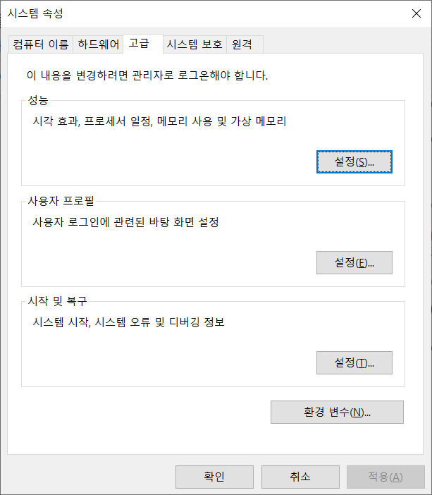
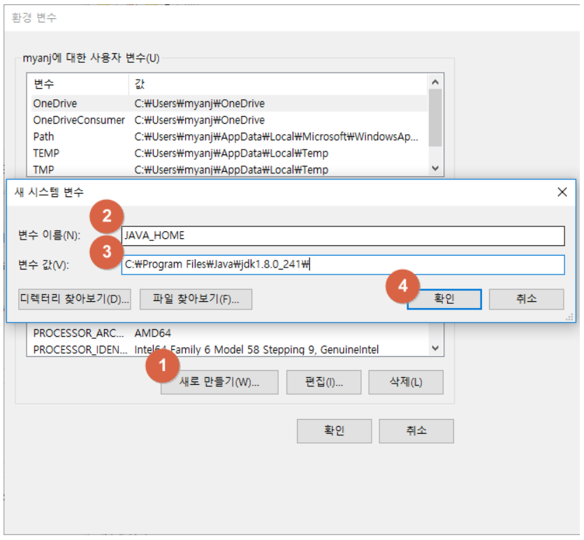
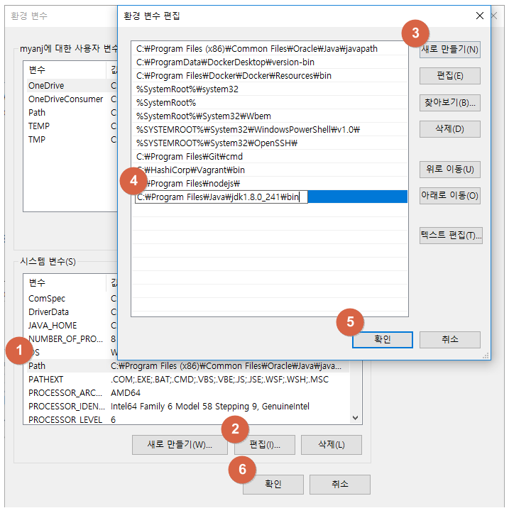
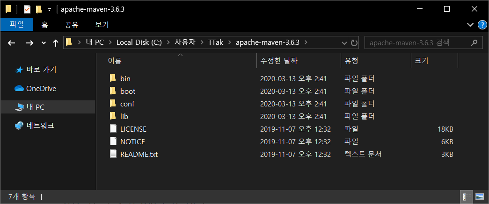

# 01. 개발환경 설정 - 윈도우에서 java, maven 설치하기


## JDK 설치

https://myanjini.tistory.com/122


### 오라클 계정 생성

https://profile.oracle.com/myprofile/account/create-account.jspx


### JDK 1.8 다운로드

https://www.oracle.com/java/technologies/javase/javase-jdk8-downloads.html


Windows x64

jdk-8u241-windows-x64.exe


### JAVA_HOME 및 Path 환경변수 등록


시작 => "시스템 환경 변수"검색 => 시스템 환경 변수 편집





환경 변수 => 시스템 변수 => 새로 만들기





변수 이름 : JAVA_HOME

변수 값 : C:\Program Files\Java\jdk1.8.0_241




C:\Program Files\Java\jdk1.8.0_241\bin


## Maven 설치

### Maven 다운로드

https://maven.apache.org/download.cgi#


최신 버전의 메이븐(zip파일) 다운로드

Binary zip archive


### 적절한 위치에 압축 풀기

C:\Users\TTak\apache-maven-3.6.3





### 환경 변수 설정


시작 => "시스템 환경 변수"검색 => 시스템 환경 변수 편집


환경 변수 => 시스템 변수 => 새로 만들기


변수 이름 : MAVEN_HOME

변수 값 : 압축 해제한 경로 (C:\Users\TTak\apache-maven-3.6.3)


시스템 변수 목록에서 Path를 찾아 더블 클릭 => 새로 만들기

%MAVEN_HOME%\bin 추가


### 메이븐 설치 확인

cmd 창에서 확인

```bash
C:\Users\TTak>mvn -version
Apache Maven 3.6.3 (cecedd343002696d0abb50b32b541b8a6ba2883f)
Maven home: C:\Users\TTak\apache-maven-3.6.3\bin\..
Java version: 1.8.0_241, vendor: Oracle Corporation, runtime: C:\Program Files\Java\jdk1.8.0_241\jre
Default locale: ko_KR, platform encoding: MS949
OS name: "windows 10", version: "10.0", arch: "amd64", family: "windows"
```


