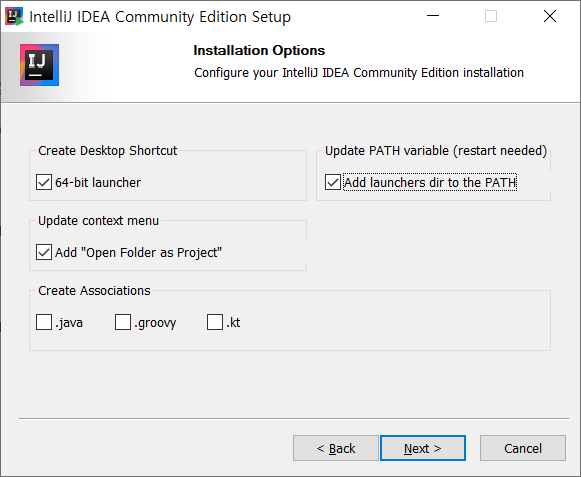
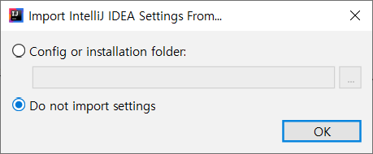
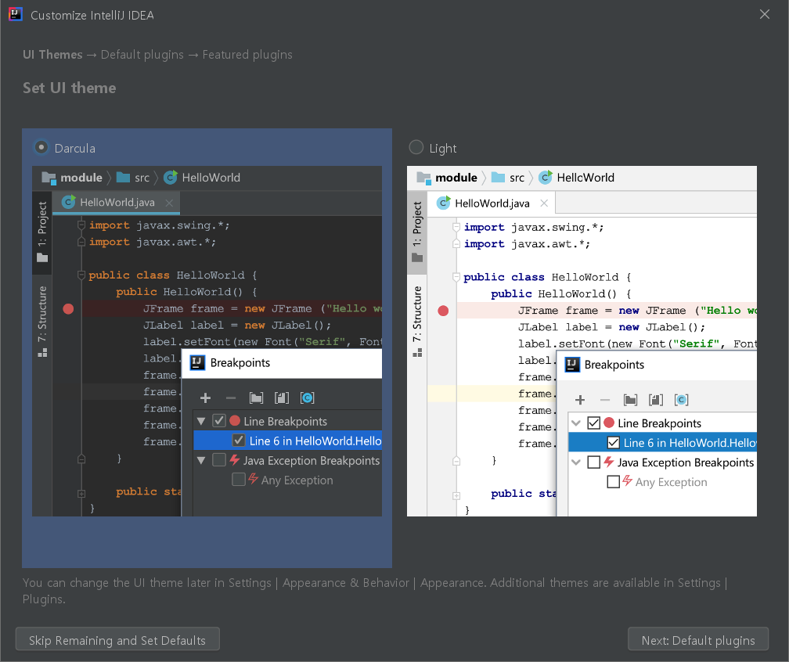
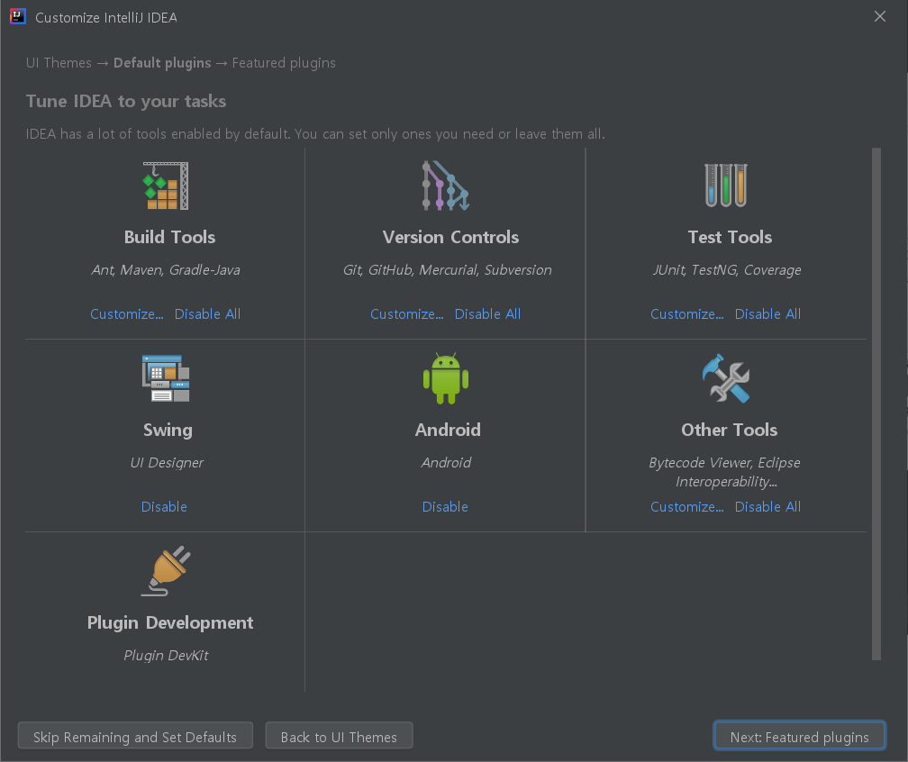
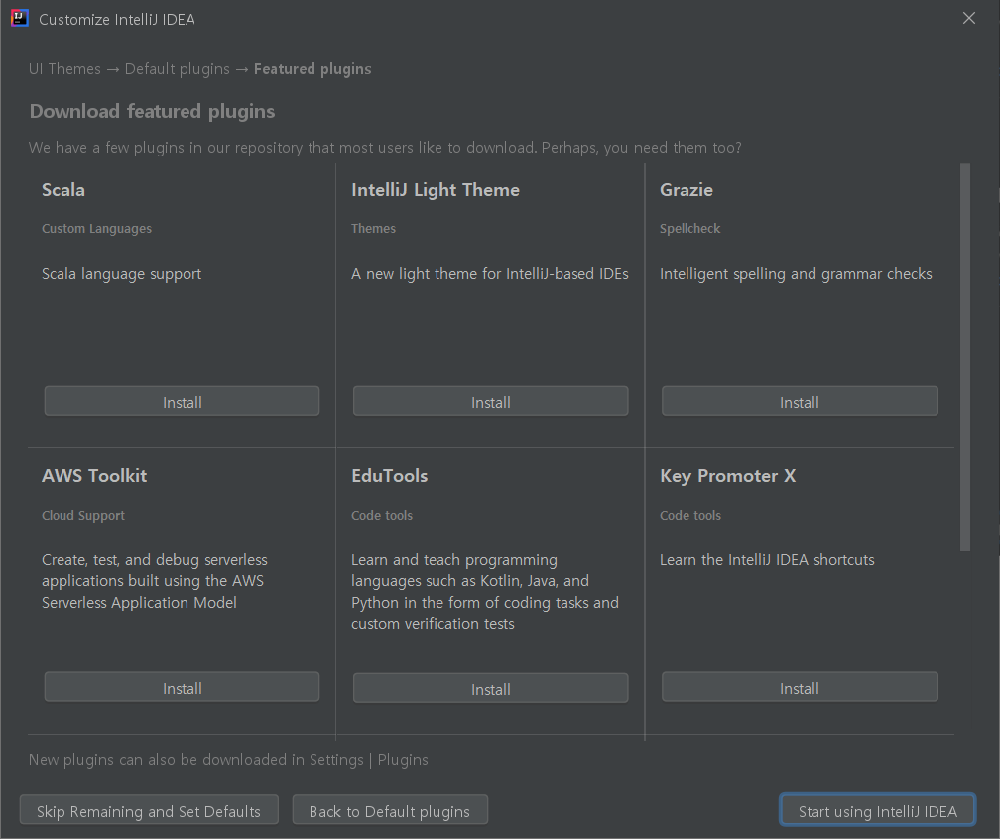
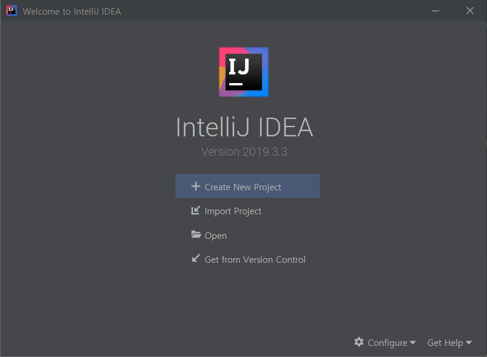
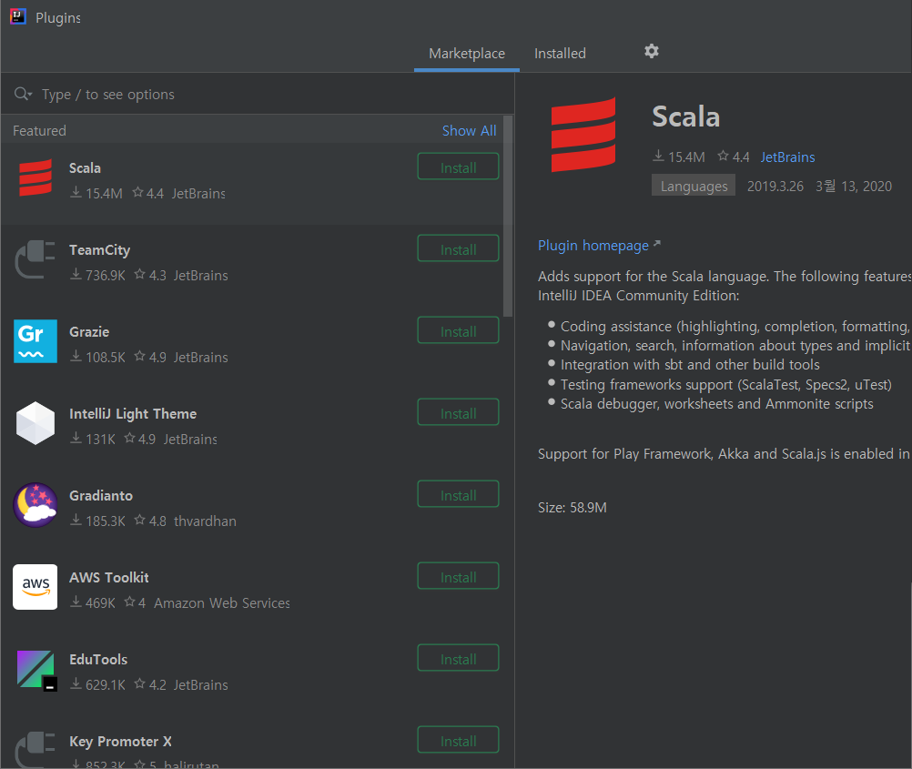
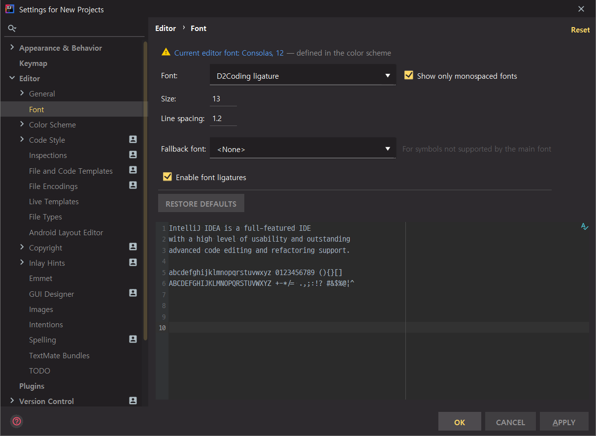

# 02. 개발환경 설정 - IntelliJ, 플러그인 설치

## IntelliJ 설치

IntelliJ IDEA는 JetBrains사에서 제작한 상용 자바 통합 개발 환경이다.

IntelliJ IDEA 사이트

https://www.jetbrains.com/idea/

DOWNLOAD 클릭

Ultimate 는 유료 버전, Community 는 무료 버전이다.

Community => Windows (.exe) 다운

설치 파일 실행

Next 클릭

64-bit launcher

context menu에 등록

Update PATH variable을 체크 => 명령 프롬프트 내에서 `idea`를 입력하면 IntelliJ가 실행된다.

Install

## 플러그인 설치

IntelliJ 실행

최초 IntelliJ가 설치되면 각종 setting에 대한 문의를 한다.

Do not import settings

confirm

Don't send

테마 설정

플러그인 설치

사용하지 않을 경우 Disable 클릭

Next 클릭

추가적으로 다운로드 받고 싶은 플러그인 선택 가능

Start using IntelliJ IDEA 클릭

필요한 플러그인들을 먼저 설치

Configure => Plugins

인터넷을 통해서 Marketplace라는 곳에서 다운로드 받을 수 있다.

Installed에서 설치되어 있는 것들을 확인할 수 있다.

IntelliJ를 사용하는 이유는 다양한 플러그인들을 통해서 특별히 고민하지 않고 자바 개발 환경을 구축할 수 있기 때문이다.

* 추가적으로 설치해야 할 것들
  * lombok
  * rainbow brackets
    * 브라켓들이 여러가지 색으로 나온다.
  * material theme ui
  * atom material icons

플러그인 이름을 누르면 상세 화면으로 이동할 수 있다.

Restart IDE

설치한 플러그인에 관련된 설정이 나온다.

원하는 테마 선택, Contrast Mode

## 폰트 설치

구글에 d2coding 검색

D2coding은 코딩에 최적화된 폰트이다.

고정폭 폰트

Ligature 문자 지원 : `!=`, `>=` 같은 문자들을 하나의 문자로 나타내준다.

https://github.com/naver/d2codingfont

releases 버튼 클릭

가장 최근 버전의 Assets를 다운로드 받는다.

D2Coding-Ver1.3.2-20180524.zip

압축 풀기

D2CodingAll 폰트 설치

IntelliJ에 폰트 적용하기

IntelliJ 재실행

Configure => Settings

Editor => Font

