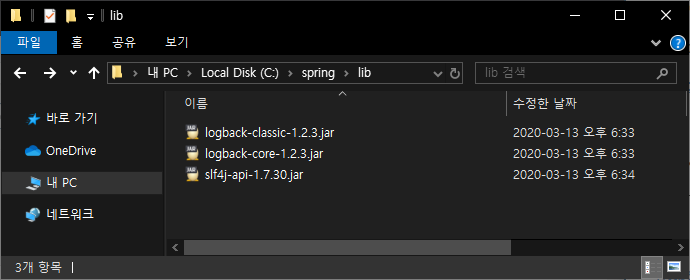
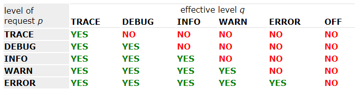
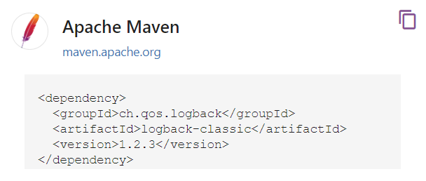
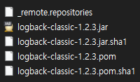

# 03. 스프링 학습 전 필요지식 - maven, logback


## Javac로 컴파일하기

디렉터리 생성

C:\spring


cmd 창 열기

```bash
C:\spring>notepad Main.java
```


Main.java

```java
class Main {
	public static void main(String[] args) {
		System.out.println("Hello world!!");
	}
}
```


```bash
C:\spring>javac Main.java

C:\spring>java Main
Hello world!!
```


Main 클래스를 패키지로 만들기

패키지는 디렉터리로 구분된다.

패키지명의 규칙은 보통 도메인의 역순이다.

Main.class 파일 삭제


C:\spring\kr\co\hello

Main.java 파일을 해당 디랙터리에 옮긴 뒤 수정

```java
package kr.co.hello;

class Main {
	public static void main(String[] args) {
		System.out.println("Hello world!!");
	}
}
```


```bash
C:\spring>javac kr\co\hello\Main.java

C:\spring>java -cp . kr.co.hello.Main
Hello world!!
```


class가 여러개 만들어질 수 있다. => 보통 jar로 묶게 된다.

```bash
C:\spring>jar -cf hello.jar kr\*
```

hello.jar 파일이 생성된다.

jar : 압축파일. 아카이빙이 목적이다. 여러개의 파일을 하나의 파일로 묶어서 관리하기 편하도록 하기 위한 목적

hello.jar 파일 압축을 풀면 jar 파일 설정을 위한 정보인 MANIFEST 파일이 있고, 그 외에는 앞에서 만들었던 Main.java 파일과 Main.class 파일이 있는 것을 확인할 수 있다.

jar 파일은 만들었던 프로그램의 컴파일된 파일들을 쉽게 아카이빙 하는 파일이다.


```bash
C:\spring>java -cp hello.jar kr.co.hello.Main
Hello world!!
```

jar를 실행

jar 파일을 현재 폴더에 압축을 풀어서 class path를 등록하고, root의 class path로부터 kr.co.hello.Main 클래스를 찾아서 실행하는 구조


jar 파일만 가지고 바로 실행하고 싶은 경우

```bash
C:\spring>java -jar hello.jar
hello.jar에 기본 Manifest 속성이 없습니다.
```

Manifest 추가하기

spring 디렉터리에 manifest.txt 파일 생성


manifest.txt

```
Main-Class: kr.co.hello.Main

```

Enter를 넣어줘야 한다.


```bash
C:\spring>jar -cmf manifest.txt hello.jar kr\*
```

hello.jar 파일이 새로 만들어진다.

해당 manifest 파일에 등록된 정보를 읽어서 executable jar가 되었다.


```bash
C:\spring>java -jar hello.jar
Hello world!!
```


## logback 라이브러리를 추가해서 간단한 logging 해보기

logback은 logging을 담당한다.


기존의 javac를 통해서 컴파일을 할 때 손이 많이 가게 된다.


구글에서 logback을 검색

Logback Home

http://logback.qos.ch/


logback은 Java에서 logging을 위한 라이브러리다.

spring boot에서 기본으로 사용하고 있는 logging 라이브러리다.


https://mvnrepository.com/

logback-core.jar

logback-classic.jar

slf4j-api.jar


C:\spring\lib 디렉터리 생성




Main.java 파일을 VSCode로 열기

```java
package kr.co.hello;
import org.slf4j.Logger;
import org.slf4j.LoggerFactory;

class Main {
	private static Logger logger = LoggerFactory.getLogger(Main.class);

	public static void main(String[] args) {
		logger.info("Hello world!!");
	}
}
```

logger.info

log4j 로그 레벨은 trace, debug, info, warn, error 로 구분되어진다.


```bash
C:\spring>javac kr\co\hello\Main.java
```

관련되어있는 jar 파일들을 인식시켜주지 않았기 때문에 컴파일이 안된다.

class path를 추가해줘야 한다.


```bash
C:\spring>javac -cp lib\logback-classic-1.2.3.jar;lib\logback-core-1.2.3.jar;lib\slf4j-api-1.7.30.jar kr\co\hello\Main.java
```


```bash
C:\spring>java -cp lib\logback-classic-1.2.3.jar;lib\logback-core-1.2.3.jar;lib\slf4j-api-1.7.30.jar;. kr.co.hello.Main
19:06:04.557 [main] INFO kr.co.hello.Main - Hello world!!
```

logback의 log 패턴에 맞춘 문자열과 Hello world!! 가 찍히는 것을 확인할 수 있다.


Executable Jar 만들기

manifest.txt

```
Main-Class: kr.co.hello.Main
Class-Path: lib\logback-classic-1.2.3.jar lib\logback-core-1.2.3.jar lib\slf4j-api-1.7.30.jar

```

Class-Path 잡기


```bash
C:\spring>jar -cmf manifest.txt hello.jar kr\*

C:\spring>java -jar hello.jar
19:20:09.362 [main] INFO kr.co.hello.Main - Hello world!!
```

의존성을 추가하고 XML 같은 설정 파일들을 추가할 수 있다.


Logback

http://logback.qos.ch/

documentation => The logback manual => Chapter 3: Configuration

http://logback.qos.ch/manual/configuration.html


logback configuration을 할 수 있는 XML 설정 복사

```xml
<configuration>
  <appender name="STDOUT" class="ch.qos.logback.core.ConsoleAppender">
    <encoder>
      <pattern>%d{HH:mm:ss.SSS} [%thread] %-5level %logger{36} - %msg%n</pattern>
    </encoder>
  </appender>

  <root level="debug">
    <appender-ref ref="STDOUT" />
  </root>
</configuration>
```


C:\spring 디렉터리에 logback.xml 파일 생성 => VSCode로 열기

복사했던 설정 붙여넣기


logback.xml은 logback에서 원하는 이름이고, class path 루트에 있으면 이 파일을 읽고 자동으로 logback의 설정으로 이용한다.


* appender
  * ConsoleAppender는 콘솔에서 내용이 추가된다.
  * log 내용이 순차적으로 appending 되기 때문에 appender 라고 부른다.
  * 종류가 많다.


name에 있는 STDOUT을 root 사이에 있는 appender-ref의 ref 속성값으로 넣어주면 appender 설정을 사용할 수 있다.

root element에서 level 설정이 가능하다.


http://logback.qos.ch/manual/architecture.html



하단으로 내려갈수록 log가 적게 찍힌다.

trace 때는 trace 로그들이 모두 찍힌다. error일 때에는 error log만 찍히고 나머지 하위에 있는 것도 다 찍힌다. error로 설정하고 trace 로그를 찍으면 찍히지 않는다.

log를 찍고싶지 않으면 OFF로 설정


패키지별로 설정 가능

spring 프레임워크 같은 경우는 info나 warn으로 로그 설정

개발 패키지 같은 경우는 debug, 운영 로그는 warn이나 error로 설정 가능


```bash
C:\spring>jar -cmf manifest.txt hello.jar kr\* logback.xml
```

jar를 만들 때 XML을 추가


```bash
C:\spring>java -jar hello.jar
20:32:47.207 [main] INFO  kr.co.hello.Main - Hello world!!
```

info level의 log가 찍힌다.


```xml
<configuration>
  <appender name="STDOUT" class="ch.qos.logback.core.ConsoleAppender">
    <encoder>
      <pattern>%d{HH:mm:ss.SSS} [%thread] %-5level %logger{36} - %msg%n</pattern>
    </encoder>
  </appender>

  <root level="error">
    <appender-ref ref="STDOUT" />
  </root>
</configuration>
```

log level을 error로 바꾸기

info 보다 error가 더 높은 log => log가 찍히지 않아야 한다.


```bash
C:\spring>jar -cmf manifest.txt hello.jar kr\* logback.xml

C:\spring>java -jar hello.jar
```

logging이 되지 않는다.


java command를 통해서 컴파일 해보고, jar로 아카이빙 해보고, 만들어진 jar를 실행해보는 작업을 했다.

이 과정들은 maven을 통해서 편리하게 할 수 있다.


## maven 사용하기

maven은 Java에서 빌드를 담당하고 있다.

구글에서 maven 검색

https://maven.apache.org/

메인 화면에서 Use 클릭 => [The 5 minute test](https://maven.apache.org/guides/getting-started/maven-in-five-minutes.html)


```bash
C:\spring>mvn -version
```

maven이 설치되어 있는지 확인


```
my-app
|-- pom.xml
`-- src
    |-- main
    |   `-- java
    |       `-- com
    |           `-- mycompany
    |               `-- app
    |                   `-- App.java
    `-- test
        `-- java
            `-- com
                `-- mycompany
                    `-- app
                        `-- AppTest.java
```

maven은 관례에 의한 설정을 이용한다.


C:\spring 디렉터리에 pom.xml 파일 생성

```xml
<project xmlns="http://maven.apache.org/POM/4.0.0" xmlns:xsi="http://www.w3.org/2001/XMLSchema-instance"
  xsi:schemaLocation="http://maven.apache.org/POM/4.0.0 http://maven.apache.org/xsd/maven-4.0.0.xsd">
  <modelVersion>4.0.0</modelVersion>
 
  <groupId>kr.co.hello</groupId>
  <artifactId>springbasic</artifactId>
  <version>1.0-SNAPSHOT</version>
 
  <properties>
    <maven.compiler.source>1.7</maven.compiler.source>
    <maven.compiler.target>1.7</maven.compiler.target>
  </properties>
 
  <dependencies>
  </dependencies>
</project>
```

* maven 설정에 관련된 부분
  * project element가 최상단에 있어야 한다.
  * modelVersion도 위쪽에 있다.
* 프로젝트에 대한 설정
  * groupId에 패키지 구조 입력
  * artifactId 부분은 프로젝트 이름으로 이해하면 된다. 나중에 jar 파일이 만들어질 때 이 이름으로 만들어진다.


pom.xml 파일이 문제가 없는지 확인해보기

```bash
C:\spring>mvn validate
[INFO] Scanning for projects...
[INFO]
[INFO] ----------------------< kr.co.hello:springbasic >-----------------------
[INFO] Building springbasic 1.0-SNAPSHOT
[INFO] --------------------------------[ jar ]---------------------------------
[INFO] ------------------------------------------------------------------------
[INFO] BUILD SUCCESS
[INFO] ------------------------------------------------------------------------
[INFO] Total time:  0.337 s
[INFO] Finished at: 2020-03-13T21:03:27+09:00
[INFO] ------------------------------------------------------------------------
```


maven 관례에 맞춰 폴더 구조를 만들어야 한다.

```
spring
|-- pom.xml
`-- src
    |-- main
    |	|-- java
    |   `-- resources
    `-- test
    	|-- java
        `-- resources
```


기존에 만들었던 패키지와 소스들이 담긴 kr 디렉터리를 C:\spring\src\main\java 로 옮긴다.

lib 폴더는 maven이 관리해줄 것이기 때문에 삭제해도 된다.

logback.xml과 같이 java 파일이 아닌 경우에는 C:\spring\src\main\resources 폴더로 옮긴다.

manifest.txt 파일은 빌드하는 과정에서 maven이 플러그인을 통해 자동으로 만들어준다. => 삭제

hello.jar 파일도 삭제


```bash
C:\spring>mvn compile
```

에러가 난다. Main 파일에서 필요한 org.slf4j 나 Logger 같은 것들에 대한 class 들을 찾을 수 없기 때문이다.

logback을 추가해줘야 한다.


구글에서 maven central 검색

[The Central Repository Search Engine](https://search.maven.org/)

logback-classic 검색


숫자 (75) 클릭 => 1.2.3 클릭



logback-classic을 사용하기 위한 dependency를 복사한다.

pom.xml 파일의 dependency element 사이에 붙여넣기

```xml
<project
    xmlns="http://maven.apache.org/POM/4.0.0"
    xmlns:xsi="http://www.w3.org/2001/XMLSchema-instance"
    xsi:schemaLocation="http://maven.apache.org/POM/4.0.0 http://maven.apache.org/xsd/maven-4.0.0.xsd">
    <modelVersion>4.0.0</modelVersion>

    <groupId>kr.co.hello</groupId>
    <artifactId>springbasic</artifactId>
    <version>1.0-SNAPSHOT</version>

    <properties>
        <maven.compiler.source>1.7</maven.compiler.source>
        <maven.compiler.target>1.7</maven.compiler.target>
    </properties>

    <dependencies>
        <dependency>
            <groupId>ch.qos.logback</groupId>
            <artifactId>logback-classic</artifactId>
            <version>1.2.3</version>
        </dependency>
    </dependencies>
</project>
```


```bash
C:\spring>mvn compile
...
[INFO] BUILD SUCCESS
[INFO] ------------------------------------------------------------------------
[INFO] Total time:  10.917 s
[INFO] Finished at: 2020-03-13T21:40:12+09:00
[INFO] ------------------------------------------------------------------------
```

target 폴더가 생성된다.

target 폴더에서 빌드가 된 것을 확인할 수 있다.

```bash
C:\spring>mvn clean
```

target 폴더를 지우고싶은 경우 mvn clean 명령을 사용하면 된다.


jar 파일을 직접 명시적으로 넣지 않았는데 어떻게 maven에서 jar 파일을 인식할까?

C:\Users\TTak\.m2\repository\ch\qos\logback\logback-classic\1.2.3



jar 파일이 있는 것을 확인할 수 있다.

maven은 repository 폴더에 jar 파일을 한 번에 모아놓고, 여기에서 직접 찾아가면서 빌드를 한다.

java 라는 command를 통해 실행할때에는 maven의 플러그인을 이용해서 실행 가능한 jar 파일을 만들면 된다.


구글에서 maven plugin 검색

[Maven – Available Plugins - Apache Maven - Apache Software](https://maven.apache.org/plugins/)

사용 가능한 플러그인들에 대해 조회할 수 있는 페이지


shade 를 이용해서 jar 파일 만들기

https://maven.apache.org/plugins/maven-shade-plugin/

Usage 클릭

https://maven.apache.org/plugins/maven-shade-plugin/usage.html

나와있는 설정을 복사해서 넣어주면 된다.


pom.xml

```xml
<project
    xmlns="http://maven.apache.org/POM/4.0.0"
    xmlns:xsi="http://www.w3.org/2001/XMLSchema-instance"
    xsi:schemaLocation="http://maven.apache.org/POM/4.0.0 http://maven.apache.org/xsd/maven-4.0.0.xsd">
    <modelVersion>4.0.0</modelVersion>

    <groupId>kr.co.hello</groupId>
    <artifactId>springbasic</artifactId>
    <version>1.0-SNAPSHOT</version>

    <properties>
        <maven.compiler.source>1.7</maven.compiler.source>
        <maven.compiler.target>1.7</maven.compiler.target>
    </properties>

    <dependencies>
        <dependency>
            <groupId>ch.qos.logback</groupId>
            <artifactId>logback-classic</artifactId>
            <version>1.2.3</version>
        </dependency>
    </dependencies>

    <build>
        <plugins>
            <plugin>
                <groupId>org.apache.maven.plugins</groupId>
                <artifactId>maven-shade-plugin</artifactId>
                <version>3.2.2</version>
                <configuration>
                    <!-- put your configurations here -->
                </configuration>
                <executions>
                    <execution>
                        <phase>package</phase>
                        <goals>
                            <goal>shade</goal>
                        </goals>
                    </execution>
                </executions>
            </plugin>
        </plugins>
    </build>
</project>
```

build element 밑에 build 할 때 플러그인들이 동작을 하는데 그 중에서 shade 플러그인을 동작하라는 것이다.

동작하는 phase는 package이다. package가 동작할 때 shade도 동작한다.

여기까지만 하면 단순하게 shade가 동작하는것 까지만 된다.


[Executable JAR](https://maven.apache.org/plugins/maven-shade-plugin/examples/executable-jar.html) 클릭

추가할 수 있는 옵션이 나온다. `<configuration>` 부분


pom.xml

```xml
<project
    xmlns="http://maven.apache.org/POM/4.0.0"
    xmlns:xsi="http://www.w3.org/2001/XMLSchema-instance"
    xsi:schemaLocation="http://maven.apache.org/POM/4.0.0 http://maven.apache.org/xsd/maven-4.0.0.xsd">
    <modelVersion>4.0.0</modelVersion>

    <groupId>kr.co.hello</groupId>
    <artifactId>springbasic</artifactId>
    <version>1.0-SNAPSHOT</version>

    <properties>
        <maven.compiler.source>1.7</maven.compiler.source>
        <maven.compiler.target>1.7</maven.compiler.target>
    </properties>

    <dependencies>
        <dependency>
            <groupId>ch.qos.logback</groupId>
            <artifactId>logback-classic</artifactId>
            <version>1.2.3</version>
        </dependency>
    </dependencies>

    <build>
        <plugins>
            <plugin>
                <groupId>org.apache.maven.plugins</groupId>
                <artifactId>maven-shade-plugin</artifactId>
                <version>3.2.2</version>
                <configuration>
                    <!-- put your configurations here -->
                </configuration>
                <executions>
                    <execution>
                        <phase>package</phase>
                        <goals>
                            <goal>shade</goal>
                        </goals>
                        <configuration>
                            <transformers>
                                <transformer
                                    implementation="org.apache.maven.plugins.shade.resource.ManifestResourceTransformer">
                                    <mainClass>kr.co.hello.Main</mainClass>
                                </transformer>
                            </transformers>
                        </configuration>
                    </execution>
                </executions>
            </plugin>
        </plugins>
    </build>
</project>
```

mainClass 변경


```bash
C:\spring>mvn package
```

jar 만들기

compile은 단순하게 javac를 통해서 class 파일을 만들기만 한 것이다.

package는 기존에 jar라는 command를 통해서 jar 아카이빙까지 해준다.


target 폴더로 가면 2개의 jar 파일이 생성된 것을 확인할 수 있다.

springbasic-1.0-SNAPSHOT.jar 파일 확인

기존에 kr 폴더 하나만 있던 jar과는 다르게 log4j에 관한 의존성들도 다 class 파일로 풀려서 jar에 포함되어 있는 것을 확인할 수 있다.


C:\spring\src\main\resources 에 있는 logback.xml 파일 내용 변경

```xml
<configuration>
  <appender name="STDOUT" class="ch.qos.logback.core.ConsoleAppender">
    <encoder>
      <pattern>%d{HH:mm:ss.SSS} [%thread] %-5level %logger{36} - %msg%n</pattern>
    </encoder>
  </appender>

  <root level="trace">
    <appender-ref ref="STDOUT" />
  </root>
</configuration>
```


```bash
C:\spring>mvn package
```


```bash
C:\spring>java -jar target\springbasic-1.0-SNAPSHOT.jar
22:10:41.252 [main] INFO  kr.co.hello.Main - Hello world!!
```


maven을 이용해서 logback의 의존성을 추가하여 빌드하고 Executable Jar를 만들어보았다.

