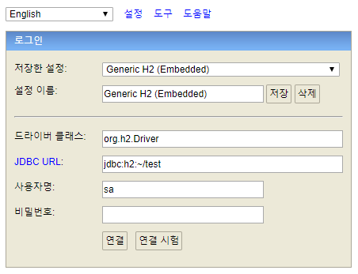
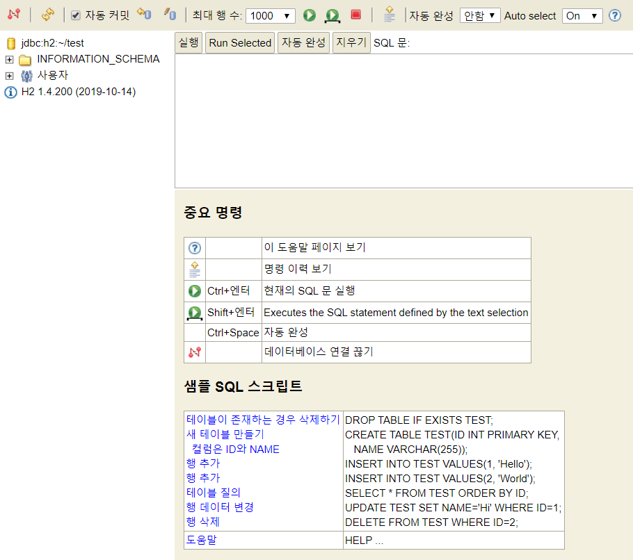
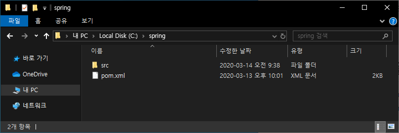
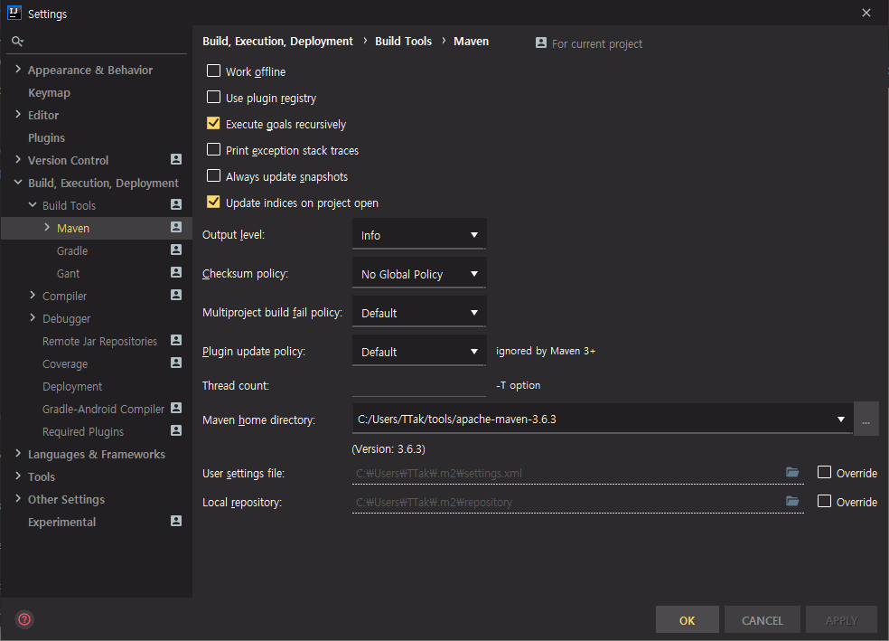
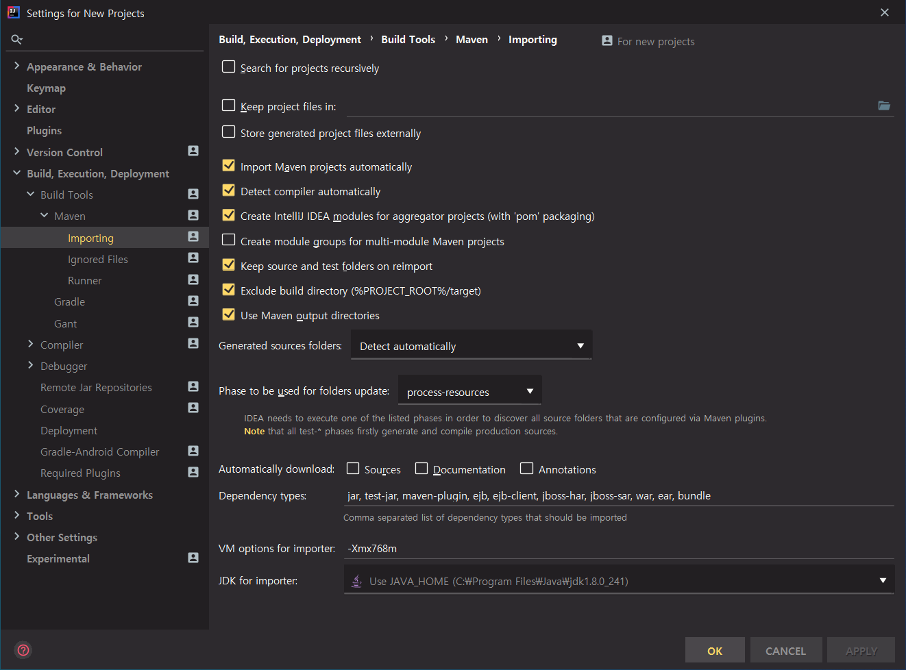
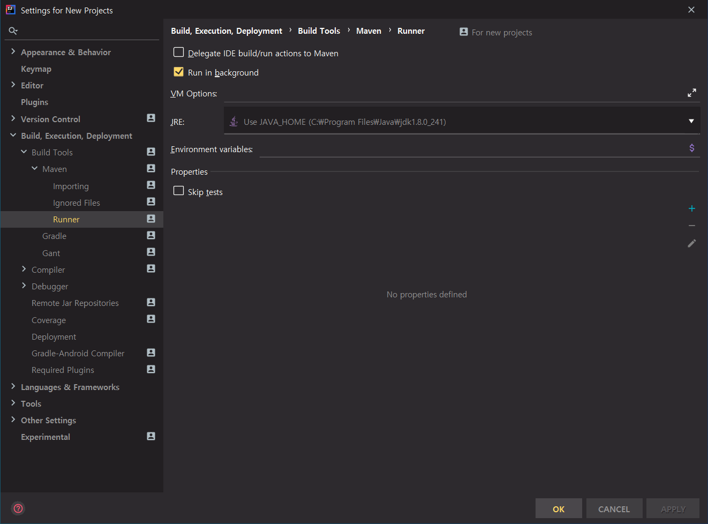
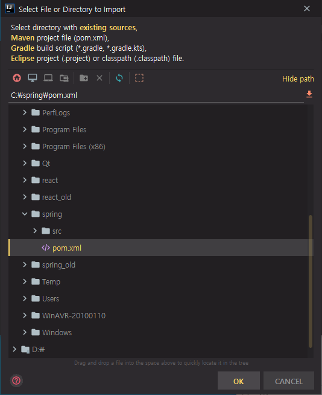
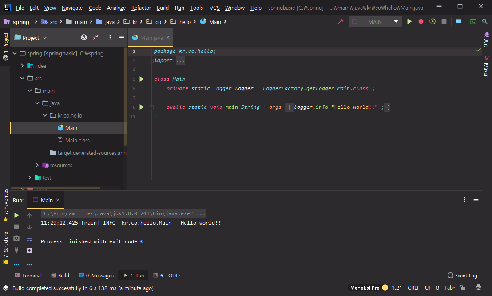
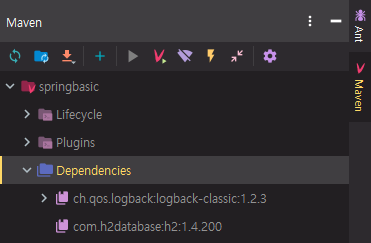
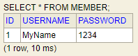

# 04. 스프링 학습 전 필요지식 - database(h2), jdbc

database를 설치하고, database를 자바를 통해서 프로그래밍 할 수 있는 jdbc를 진행한다.

database는 h2라고 하는 정형화된 database를 사용한다.


## h2 database

구글에서 h2 database 검색

h2는 Java로 작성된 관계형 데이터베이스이다. h2 database를 통해서 SQL을 작성하고, 원하는 SQL문의 결과를 받을 수 있다.


h2 database 사이트

[H2 Database Engine](https://www.h2database.com/)

간단한 h2 database 설명과 함께 다운로드를 받을 수 있다.

All Platforms를 누르고 다운로드 받는다.


다운로드가 완료되면 압축을 풀어준다.

bin 디렉터리로 들어가기

h2.bat 파일을 실행시켜도 되고, windows 같은 경우에는 jar 파일을 더블클릭하면 바로 실행시킬 수 있기 때문에 h2.bat 파일을 실행시키지 않아도 된다.

h2-1.4.200.jar 파일 더블클릭





내부적으로 h2 database 서버가 동작하였고, h2 database 관리 콘솔이 뜬다

h2 database를 사용하는 장점은 간단하게 클릭 한번으로 DB 서버가 동작하고, 특별히 DB 클라이언트를 설치하지 않더라도 웹을 통해서 DB 클라이언트를 사용할 수 있다.


기본적인 설정으로는 드라이버에 대한 것이 자동으로 되어있으니 따로 건드릴 필요 없다.

JDBC URL이 jdbc:h2:~/test 라는 이름으로 만들어진다.

사용자명은 default로 sa, 빈 문자열이 비밀번호이다.

연결 클릭




h2 database를 만들고 database를 test라는 이름으로 만들면 home 디렉터리(C:\Users\TTak) 하단에 test.mv.db 라는 파일이 생성된다.


create table member(); 입력 후 실행 클릭 => member table이 생성된다.

연결을 끊은 후 다시 연결해도 member table은 그대로 유지된다.


h2 database를 닫아보기

작업관리자 => Java(TM) Platform SE binary 마우스 오른쪽 클릭 => 작업 끝내기

h2 database 다시 연결

파일로 database 정보가 저장되어 있기 때문에 기존의 database 정보를 조회할 수 있다.


h2 database는 파일 모드와 메모리 모드를 지원, 호환 모드를 지원한다.

파일 모드는 홈 디렉터리 이하에 database 명으로 파일이 생성된 것처럼, 이후에 지속적으로 데이터가 유지되기를 원할 경우 사용

테스트 코드를 작성할 때 휘발성, 일회성으로 database를 만들고 없앨 때 h2 database를 이용하면 쉽게 만들 수 있다. 그 때는 메모리에 놓고 빠르게 테스트하고 빠르게 데이터를 날릴 수 있다.

메모리 모드를 사용하고 싶은 경우 JDBC URL을 변경해주면 된다.

jdbc:h2: 이후 특정 파일 경로가 들어가면 파일 모드로 동작한다.

jdbc:h2:mem: 이후 원하는 데이터베이스 이름을 넣으면 메모리 모드로 동작한다.

JDBC URL을 jdbc:h2:mem:hello 로 설정 후 연결

create table member(); 입력 후 실행 버튼 클릭

파일 모드가 아니기 때문에 홈 디렉터리 이하에 db가 생기지 않는다.

연결을 끊고 다시 연결해보면 기존에 만들었던 정보가 사라진 것을 확인할 수 있다.


애플리케이션이 한 번 실행되고, 메모리에서 만들고 바로 지울 수 있기 때문에 테스트 상황에서는 훨씬 더 빠르게 개발이 가능해진다.


h2 database의 호환 모드

https://www.h2database.com/html/main.html

Features => [Compatibility](https://www.h2database.com/html/features.html#compatibility)

호환하다 라는 뜻

h2는 ANSI SQL(표준 SQL)을 따른다.

여러 호환성 모드를 제공한다. => DB2, Derby, HSQLDB, MS SQL Server, MySQL, Oracle 등

h2가 여러 데이터베이스의 SQL을 해석하고, h2 database 엔진이 동작하기는 하지만 다른 DB의 SQL을 해석할 수 있기 때문에 h2 database로 테스트 코드를 작성할 수 있다.

h2 database를 통해서 테스트가 편리한 애플리케이션을 만들 수 있다.

h2 database 닫기


## h2 database를 애플리케이션 안에 포함시키기

h2 database는 jar로 배포하기 때문에 main project로 dependency를 추가해주고, 애플리케이션에 embedded 시켜서 embedded DB로 사용





IntelliJ 실행 => Configure => Settings => Build, Execution, Deployment => Build Tools => Maven



Maven home directory 변경




Import Maven projects automatically 체크

JDK for importer를 Use JAVA_HOME으로 변경




JRE를 Use JAVA_HOME으로 변경


Import Project 선택 => C:\spring\pom.xml 선택




```bash
C:\spring>idea64 pom.xml
```

명령 프롬프트를 이용한 방법도 가능하다.


Ctrl + Shift + F10 으로 실행



Hello world!! 가 찍힌 것을 확인할 수 있다.


pom.xml

```xml
...
    <properties>
        <maven.compiler.source>1.8</maven.compiler.source>
        <maven.compiler.target>1.8</maven.compiler.target>
    </properties>
...
```

1.8로 수정


처음 maven을 import 할 때 project module에 대한 설정을 IntelliJ가 자동으로 해준다.


https://search.maven.org/

h2-database 검색


99+ 클릭 => 최신 버전을 클릭한다.


Apache Maven에 있는 `<dependency>` 내용을 복사한다.


pom.xml

```xml
...
    <dependencies>
        <dependency>
            <groupId>ch.qos.logback</groupId>
            <artifactId>logback-classic</artifactId>
            <version>1.2.3</version>
        </dependency>
        <dependency>
            <groupId>com.h2database</groupId>
            <artifactId>h2</artifactId>
            <version>1.4.200</version>
        </dependency>
    </dependencies>
...
```

`<dependencies>` 안에 붙여넣기


maven dependencies에 h2database가 추가되었는지 확인




만약 dependency에 라이브러리가 추가되지 않은 경우 새로고침을 해주면 나온다.


## h2 database를 기반으로 JDBC를 이용해 프로그래밍

JDBC가 만들어지기 전에는 여러 database가 있었다. mysql, postgresql, oracle, ...

DB를 만드는 벤더들마다 자바로 프로그래밍 할 때에는 jar 파일을 따로 제공했다.

각각 벤더들마다 개발을 다르게 했다. 개발자는 각각의 DB를 사용할때마다 API 문서를 매번 읽어야하는 번거로움이 있었다.

RDBMS는 웹 개발할 때 거의 표준이 되었고, 개발할 때 편리성을 제공하기 위해 Java 쪽에서는 Java 1.1부터 JDBC라는 인터페이스를 이용해 다양한 DB에서 하나의 인터페이스를 통해 개발이 가능하도록 하였다.

개발자는 각각의 API를 다 숙지할 필요 없이 JDBC 인터페이스 API만 알고 있으면 데이터베이스 사용이 가능해졌다.

JDBC 인터페이스를 이용해서 다른 라이브러리가 만들어질 수 있다. MyBatis, Hibernate


구글에서 java jdbc api 검색

[Java JDBC API](https://docs.oracle.com/javase/8/docs/technotes/guides/jdbc/index.html)

오라클에서 제공하는 JDBC API를 볼 수 있다.

JDBC API는 java.sql 패키지와 javax.sql 패키지가 있다.

x는 기존 자바 패키지에서 확장했다는 뜻이다. Java SE에서 사용할 수 있는 것은 java.sql


구글에서 java api 검색

[Java 7 API - Overview (Java Platform SE 7 )](https://docs.oracle.com/javase/7/docs/api/)

URL에 있는 7을 8로 바꾸기

https://docs.oracle.com/javase/8/docs/api/


java.sql 클릭

Java programming language를 통해서 data source 안에 있는 것을 accessing 하고 data를 저장할 수 있도록 해주는 패키지

중요한 것은 Interface Summary에 있는 Interface들이다.

각각의 벤더들이 SQL 패키지에 있는 인터페이스를 구현한 것이고, 우리는 그것을 이용해서 프로그래밍을 하게 된다.


Java SE에 있는 기본 클래스들이므로 특별히 pom.xml에 dependency를 추가하지 않는다.


먼저 database에서 table이 만들어져 있어야 하기 때문에 h2 database를 다시 동작시킨다.

파일 모드로 동작 => jdbc:h2:~/test


```sql
drop table member;
```


member table을 기준으로 로그인이 가능하도록 진행할 것이다.

username, password 필드


```sql
create table member(
  id int auto_increment,
  username varchar(255) not null,
  password varchar(255) not null,
  primary key(id)
);
```


```sql
insert into member(username, password) values('MyName','1234');
```


table 명을 클릭하면 select 문이 만들어진다.




이 과정을 애플리케이션에서 작업하기

h2 database 프로세스 종료


Main.java

```java
package kr.co.hello;
import org.slf4j.Logger;
import org.slf4j.LoggerFactory;

import java.sql.*;

class Main {
	private static Logger logger = LoggerFactory.getLogger(Main.class);

	public static void main(String[] args) {
		logger.info("Hello world!!");

		Connection connection = null;
		Statement statement = null;
		try {
			Class.forName("org.h2.Driver");
			String url = "jdbc:h2:~/test;MODE=MySQL;";
			connection = DriverManager.getConnection(url, "sa", "");
			statement = connection.createStatement();

			ResultSet resultSet = statement.executeQuery("select id, username, password from member");
			while(resultSet.next()){
				int id = resultSet.getInt("id");
				String username = resultSet.getString("username");
				String password = resultSet.getString("password");

				logger.info("id: " + id + ", username: " + username + ", password: " + password);
			}

		} catch (ClassNotFoundException e) {
			e.printStackTrace();
		} catch (SQLException e) {
			e.printStackTrace();
		} finally {
			try {
				statement.close();
			} catch (SQLException e) {
				e.printStackTrace();
			}
			try {
				connection.close();
			} catch (SQLException e) {
				e.printStackTrace();
			}
		}
	}
}
```


DB와 연결. Java.sql 패키지에 있는 Connection 클래스 선언

드라이버를 로딩한다. 각각의 벤더들마다 드라이버를 제공한다.

External Libraries 에서 org.h2.Driver 확인 가능

forName 에 커서를 위치시키고 Alt + Enter => Surround with try/catch

접속할 url 등록

호환 모드로 설정

https://www.h2database.com/html/features.html#compatibility

MySQL 호환 모드에서 MODE=MySQL; 옵션을 추가한다.

MySQL의 SQL을 h2 database를 통해 사용할 수 있다.

Add 'catch' clause

SQL을 제어할 수 있는 statement 생성. statement를 이용해 데이터 조회

executeQuery를 통해서 resultSet에 데이터가 담긴다.

마지막에 모든 리소스를 정리해야 한다.


logback.xml

```xml
<configuration>
  <appender name="STDOUT" class="ch.qos.logback.core.ConsoleAppender">
    <encoder>
      <pattern>%-5level %logger{36} - %msg%n</pattern>
    </encoder>
  </appender>

  <root level="trace">
    <appender-ref ref="STDOUT" />
  </root>
</configuration>
```


Ctrl + Shift + F10 으로 실행

```bash
INFO  kr.co.hello.Main - Hello world!!
INFO  kr.co.hello.Main - id: 1, username: MyName, password: 1234
```

기존에 넣었던 데이터를 확인할 수 있다.

앞으로는 메모리 모드로만 개발


Main.java

```java
...
		try {
			Class.forName("org.h2.Driver");
			String url = "jdbc:h2:mem:test;MODE=MySQL;";
			connection = DriverManager.getConnection(url, "sa", "");
			statement = connection.createStatement();

			statement.execute("create table member(id int auto_increment, username varchar(255) not null, password varchar(255) not null, primary key(id));");

			statement.executeUpdate("insert into member(username, password) values('MyName', '1234')");
			
			ResultSet resultSet = statement.executeQuery("select id, username, password from member");
			while(resultSet.next()){
				int id = resultSet.getInt("id");
				String username = resultSet.getString("username");
				String password = resultSet.getString("password");

				logger.info("id: " + id + ", username: " + username + ", password: " + password);
			}
			
		}
...
```

메모리 모드로 실행

애플리케이션을 실행시킬 때마다 member table 만들기

데이터 추가


## 트랜잭션(Transaction)

**트랜잭션**(**Transaction**)은 데이터베이스의 상태를 변환시키는 하나의 논리적 기능을 수행하기 위한 작업의 단위 또는 한꺼번에 모두 수행되어야 할 일련의 연산들을 의미한다.

중간에 비즈니스 로직 중에서 에러가 난 경우, 에러에 대해서 기존에 데이터가 쌓이면 안되는 상황이 발생한다.

transaction begin, commit 과정 안에 있는 insert, update, delete 문은 하나의 transaction 이라는 개념으로 묶여서 중간에 exception이 발생하면 transaction이 rollback이 되면서 insert, update, delete 문이 취소가 되고, commit을 하게되면 transaction이 데이터베이스에 반영된다.


Main.java

```java
package kr.co.hello;
import org.slf4j.Logger;
import org.slf4j.LoggerFactory;

import java.sql.*;

class Main {
	private static Logger logger = LoggerFactory.getLogger(Main.class);

	public static void main(String[] args) {
		logger.info("Hello world!!");

		Connection connection = null;
		Statement statement = null;
		try {
			Class.forName("org.h2.Driver");
			String url = "jdbc:h2:mem:test;MODE=MySQL;";
			connection = DriverManager.getConnection(url, "sa", "");
			statement = connection.createStatement();

			connection.setAutoCommit(false);

			statement.execute("create table member(id int auto_increment, username varchar(255) not null, password varchar(255) not null, primary key(id));");
			statement.executeUpdate("insert into member(username, password) values('MyName', '1234')");

			ResultSet resultSet = statement.executeQuery("select id, username, password from member");
			while(resultSet.next()){
				int id = resultSet.getInt("id");
				String username = resultSet.getString("username");
				String password = resultSet.getString("password");

				logger.info("id: " + id + ", username: " + username + ", password: " + password);
			}

			connection.commit();
		} catch (ClassNotFoundException e) {
			e.printStackTrace();
		} catch (SQLException e) {
			e.printStackTrace();
			try {
				connection.rollback();
			} catch (SQLException ex) {
				ex.printStackTrace();
			}
		} finally {
			try {
				statement.close();
			} catch (SQLException e) {
				e.printStackTrace();
			}
			try {
				connection.close();
			} catch (SQLException e) {
				e.printStackTrace();
			}
		}
	}
}
```

setAutoCommit을 false로 설정

commit이 진행돼야 database에 데이터가 저장된다. commit이 진행되지 않으면 database에 저장되지 않는다.

보통 try문 맨 마지막에 commit문을 넣고, SQLException이 발생했을 때 rollback을 해주는 형태로 진행한다.

