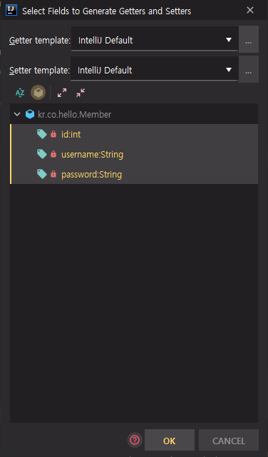
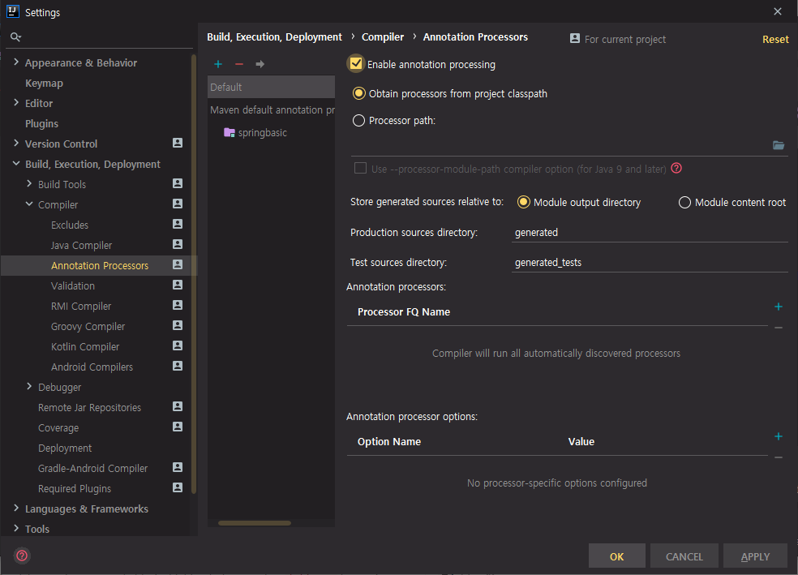
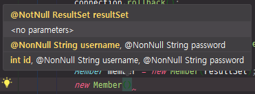

# 05. 스프링 학습 전 필요지식 - lombok

try catch 문이 많이 나오거나 코드가 길어지는 경우 코드의 가독성이 떨어질 수 있다.


## 기존 프로젝트 리팩토링(Refactoring)

try 문을 try-with-resource 구문으로 변경

try 문이 복잡한 이유중 하나는 catch 문에서 resource 를 close 할 때 try 문이 다시 또 추가되기 때문이다. close 할 때 다시 SQLException을 던지기 때문에 try catch 문을 넣어줘야 한다.

이런 불편함을 해결하기 위해서 Java 1.7 이후부터는 close가 필요한 부분에 대해서는 AutoCloseable 이라는 인터페이스를 추가했다.

AutoCloseable 인터페이스를 상속받은 객체들은 자동으로 close 메서드가 호출된다.


Main.java

```java
package kr.co.hello;
import org.slf4j.Logger;
import org.slf4j.LoggerFactory;

import java.sql.*;

class Main {
	private static Logger logger = LoggerFactory.getLogger(Main.class);

	public static void main(String[] args) throws ClassNotFoundException {
		logger.info("Hello world!!");

		Class.forName("org.h2.Driver");
		String url = "jdbc:h2:mem:test;MODE=MySQL;";

		try(Connection connection = DriverManager.getConnection(url, "sa", "");
			Statement statement = connection.createStatement()) {

			connection.setAutoCommit(false);
			statement.execute("create table member(id int auto_increment, username varchar(255) not null, password varchar(255) not null, primary key(id));");
			try {
				statement.executeUpdate("insert into member(username, password) values('MyName', '1234')");
				connection.commit();
			} catch (SQLException e) {
				connection.rollback();
			}

			ResultSet resultSet = statement.executeQuery("select id, username, password from member");
			while(resultSet.next()){
				int id = resultSet.getInt("id");
				String username = resultSet.getString("username");
				String password = resultSet.getString("password");
				Member member = new Member(id, username, password);

				logger.info(member.toString());
			}
		} catch (SQLException e) {
		}
	}
}
```

forName 에서 Alt + Enter => Add exception to method signature

finally 부분 지우기


보통은 value object라는 이름으로 데이터를 감싸는 객체를 만든다.

기존에는 id, username, password를 각각 선언해서 찍어줬다.

Member 라는 오브젝트를 만들어서 그 안에 값을 넣어줄것이다.

kr.co.hello 마우스 오른쪽 클릭 => New => Java Class

Name : Member

Member.java

```java
package kr.co.hello;

public class Member {
    private int id;
    private String username;
    private String password;

    public Member(int id, String username, String password) {
        this.id = id;
        this.username = username;
        this.password = password;
    }

    public int getId() {
        return id;
    }

    public void setId(int id) {
        this.id = id;
    }

    public String getUsername() {
        return username;
    }

    public void setUsername(String username) {
        this.username = username;
    }

    public String getPassword() {
        return password;
    }

    public void setPassword(String password) {
        this.password = password;
    }

    @Override
    public String toString() {
        return "id: " + id + ", username: " + username + ", password: " + password;
    }
}
```

id, username, password 그대로 가져오기

객체안에 있는 변수를 필드라고 한다. 필드를 private로 설정

Ctrl + Shift + a : find action. 원하는 메뉴를 이름으로 검색이 가능하다.

generate 검색 => getter and setter



생성자 만들기

Ctrl + Shift + a => constructor 검색

id, username, password 선택 후 OK


Ctrl + Shift + a => override 검색 => override methods

toString() 선택 후 OK


기존 코드와 똑같이 동작한다.


Main.java

```java
...
			ResultSet resultSet = statement.executeQuery("select id, username, password from member");
			while(resultSet.next()){
				Member member = new Member(resultSet);
				logger.info(member.toString());
			}
...
```

객체 지향 프로그래밍에서 객체에서 할 수 있는 것들은 최대한 넘겨주는 것이 좋다.

정의로 이동 : Ctrl + b


Member.java

```java
...
    public Member(ResultSet resultSet) {
        try {
            this.id = resultSet.getInt("id");
            this.username = resultSet.getString("username");
            this.password = resultSet.getString("password");
        } catch (SQLException e) {
            e.printStackTrace();
        }
    }
...
```

생성자를 만든다.


Main.java 마우스 오른쪽 클릭 => Local History => Show History

어떻게 변경되었는지 비교 가능

기존 코드 대비 가독성 증가


## lombok을 이용해서 가독성 증가시키기

lombok 프로젝트는 Java 라이브러리에 자동적으로 뭔가를 해주는 플러그인이다.

maven이나 Gradle 같은 빌드툴이 빌드를 할 때 플러그인으로 동작하는데, 그 때 컴파일 타임에 lombok이 내부적으로 어떤 동작을 해서 코드를 자동으로 generation 해준다.


구글에서 lombok 검색

[Project Lombok](https://projectlombok.org/)

Install => maven

```xml
	<dependency>
		<groupId>org.projectlombok</groupId>
		<artifactId>lombok</artifactId>
		<version>1.18.12</version>
		<scope>provided</scope>
	</dependency>
```

pom.xml 파일에 dependency를 추가해주면 된다.

maven에서 lombok이 추가된 것을 확인


Features => Stable

https://projectlombok.org/features/all

보통 코딩을 할 때 가장 많이 반복적으로 하는 것이 getter, setter이다.

멤버 객체에 필드를 정의하고 필드에 맞는 각각의 getter와 setter를 만들어줬다.

lombok을 사용하면 이 부분을 지워줄 수 있다.


IntelliJ에게 lombok을 사용한다고 알려줘야한다.

File => Settings => Build, Execution, Deployment => Compiler => Annotation Processors



Enable annotation processing 체크


Refactor 메뉴 하단에 Lombok과 Delombok이 추가되었다. 플러그인을 통해 사용할 수 있는 것이다.


Member.java

```java
package kr.co.hello;

import lombok.Getter;
import lombok.Setter;
import lombok.ToString;

import java.sql.ResultSet;
import java.sql.SQLException;

@Getter
@Setter
@ToString
public class Member {
    private int id;
    private String username;
    private String password;

    public Member(ResultSet resultSet) {
        try {
            this.id = resultSet.getInt("id");
            this.username = resultSet.getString("username");
            this.password = resultSet.getString("password");
        } catch (SQLException e) {
            e.printStackTrace();
        }
    }
}
```

getter와 setter는 반복적인 패턴 => 지우기

@Getter, @Setter 라고 어노테이션만 명시하면 자동적으로 getter와 setter가 만들어진다.

디테일하게 getter와 setter를 나누고싶으면 필드 앞에 명시하면 된다.

모든 필드들에 대해 getter와 setter를 추가할 것이기 때문에 class level로 getter와 setter를 추가

toString() 도 lombok을 사용해서 @ToString 어노테이션을 붙여준다.


```
INFO  kr.co.hello.Main - Hello world!!
INFO  kr.co.hello.Main - Member(id=1, username=MyName, password=1234)
```

Member class 명과 그 안에 있는 필드들이 정의된 toString이 오버라이딩 된 것을 확인할 수 있다.

Refactor => Delombok 메뉴를 보면 추가한 것들만 활성화 된 것을 볼 수 있다.

@ToString을 클릭해보면 원래 코드대로 돌아온다.

Delombok을 통해서 lombok이 코드를 이런 식으로 generate 한다는 것을 확인할 수 있다.

똑같이 Lombok 메뉴를 통해서도 lombok을 사용할 수 있다.


Member.java

```java
package kr.co.hello;

import lombok.*;

import java.sql.ResultSet;
import java.sql.SQLException;

@Getter
@Setter
@ToString
@NoArgsConstructor
@AllArgsConstructor
@RequiredArgsConstructor
public class Member {
    private int id;
    @NonNull private String username;
    @NonNull private String password;

    public Member(ResultSet resultSet) {
        try {
            this.id = resultSet.getInt("id");
            this.username = resultSet.getString("username");
            this.password = resultSet.getString("password");
        } catch (SQLException e) {
            e.printStackTrace();
        }
    }
}
```

@NoArgsConstructor, @AllArgsConstructor 를 이용해 생성자를 쉽게 만들 수 있다.

특정 부분만 Constructor로 만들고 싶은 경우 필드명 앞에 @NonNull 을 넣어주고, Member class 앞에 @RequiredArgsConstructor를 붙여주면 id를 제외한 NonNull 필드의 Constructor가 만들어진다.




4가지의 생성자가 만들어진 것을 확인할 수 있다.

어노테이션으로 반복적인 작업을 줄일 수 있다.


@EqualsAndHashCode 같은 것도 lombok을 통해서 편리하게 사용할 수 있다.

@Data라는 것으로 한번에 줄일 수도 있다.


```java
Member member = new Member("MyName", null);
```

@NonNull 부분은 내부적으로 null 체크를 해준다. => 에러 발생

action으로 delombok을 해보면 실제로 생성자에서 @NonNull 어노테이션이 붙은 것을 확인할 수 있다.


짧은 코드로 명시적으로 코드 개발 가능

