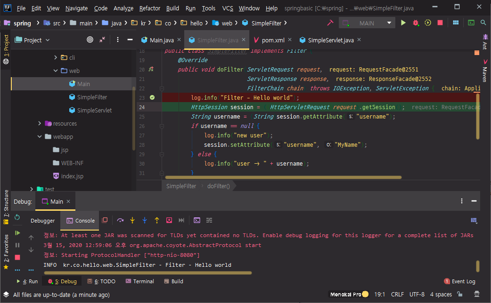

# 06. 스프링 학습 전 필요지식 - servlet

## 자바 서블릿

구글에서 servlet 검색

[자바 서블릿(위키백과)](https://ko.wikipedia.org/wiki/자바_서블릿)

자바를 이용해서 웹페이지를 동적으로 생성하는 서버측 프로그램 혹은 그 사양

서블릿 1.0 부터 서블릿 4.0 까지 계속 API 버전이 올라가고 있다.

서블릿 4.0 버전 사용. 자바 플랫폼이 JavaEE 8 인 것을 확인할 수 있다.

우리가 사용하는 것은 Java SE이다. Standard Edition

Java EE는 Enterprise Edition

SE에서 EE를 사용하기 위해서는 dependency를 추가해줘야 한다.


구글에서 java ee api 검색

[Java EE 7 - Overview (Java(TM) EE 7 Specification APIs)](https://docs.oracle.com/javaee/7/api/toc.htm)

그냥 자바가 아닌 확장이라는 뜻의 javax가 있다.

ejb, enterprise 등 여러가지가 있다.


javax.servlet

https://docs.oracle.com/javaee/7/api/toc.htm


apache tomcat

jeus (tmaxsoft)


tomcat은 servlet에 특화되어있는 반면에 jeus는 enterprise에 필요한 다양한 기능을 제공한다.

[자바 서블릿(위키백과)](https://ko.wikipedia.org/wiki/자바_서블릿)

보통 tomcat의 역사와 비슷하게 servlet의 역사를 얘기한다.

아파치 톰캣 호환정보로 servlet 버전과 톰캣 버전을 볼 수 있다.

[Java servlet - Wikipedia](https://en.wikipedia.org/wiki/Java_servlet)

하단에 [Java enterprise platform](https://en.wikipedia.org/wiki/Category:Java_enterprise_platform) 클릭

Java EE 엔터프라이즈 플랫폼을 지원하는 여러 벤더들의 제품들을 볼 수 있다.

[JEUS](https://en.wikipedia.org/wiki/JEUS)도 여기서 확인할 수 있다.

단순히 servlet 버전 뿐만 아니라 EE에서 제공하고 있는 많은 사양들을 JEUS에서 제공하고 있다.


tomcat 9 버전을 이용해서 servlet 기능을 살펴볼것이다.

https://docs.oracle.com/javaee/7/api/toc.htm

javax.servlet.jsp

javax.servlet.jsp.el

javax.validation

여기에 있는것은 API 스펙이고, tomcat은 이런 것들을 다 구현체로 구현을 해 두었다.


구글에 servlet spec 검색

[Java™ Servlet Specification - Java EE](https://javaee.github.io/servlet-spec/downloads/servlet-4.0/servlet-4_0_FINAL.pdf)

pdf 문서로 servlet spec에 대해 볼 수 있다.

web.xml 설정 부분 찾기 => `<web-app` 검색

p204 Basic Deployment Descriptor Example

이 example을 이용해서 servlet 만들기. 기존 프로젝트 그대로 사용

기존 프로젝트에서 2개의 Main.java 클래스가 생길 것이다.

첫 번째는 CLI 이다. 기존 콘솔창에서 실행했던 프로그램

두 번째는 servlet을 통해서 web 프로그램을 동작시킬 main이 필요하다.

package로 나눌 것이다. 프로젝트로 나누는게 더 맞지만 나중에 CLI 프로그램을 걷어낼 것이기 때문에 지금 단계에서는 cli라는 패키지, web 이라는 패키지로 구분지을 것이다.


kr.co.hello 마우스 오른쪽 클릭 => New => Package

또는 

Main에서 마우스 오른쪽 클릭 => Refactor => Move Class 클릭


REFACTOR => YES


main쪽 선택

DO REFACTOR

cli 패키지가 만들어지고, Member도 cli 패키지로 옮긴다.


pom.xml에 servlet 관련 의존성 추가

https://search.maven.org/

javax.servlet 검색


(20) 클릭 => 4.0.1

```xml
<dependency>
  <groupId>javax.servlet</groupId>
  <artifactId>javax.servlet-api</artifactId>
  <version>4.0.1</version>
</dependency>
```

pom.xml에 추가


끝에 -api 라고 postfix가 붙은 것은 구현체가 없는 것이다. api 이다.

Java EE를 만들고 있는 단체에서 api 설계만 해두면 각각의 벤더들이 실제 구현체를 만든다.

dependency에서 servlet-api가 추가된 것을 확인


maven 프로젝트를 jar가 아닌 war로 패키징하고 웹 애플리케이션으로 변경하려 한다.

=> war 플러그인을 사용해야한다.

구글에 maven war plugin 검색

[Apache Maven WAR Plugin – Introduction](http://maven.apache.org/plugins/maven-war-plugin/)

Usage 클릭

packaging에 war라는 값만 넣어주면 된다.


pom.xml

```xml
...
    <groupId>kr.co.hello</groupId>
    <artifactId>springbasic</artifactId>
    <version>1.0-SNAPSHOT</version>
    <packaging>war</packaging>
...
```


웹 애플리케이션 프로젝트 구조를 따라야한다.

```
 |-- pom.xml
 `-- src
     `-- main
         |-- java
         |   `-- com
         |       `-- example
         |           `-- projects
         |               `-- SampleAction.java
         |-- resources
         |   `-- images
         |       `-- sampleimage.jpg
         `-- webapp
             |-- WEB-INF
             |   `-- web.xml
             |-- index.jsp
             `-- jsp
                 `-- websource.jsp
```

webapp 이라는 폴더를 만들어야 한다.


[Java™ Servlet Specification - Java EE](https://javaee.github.io/servlet-spec/downloads/servlet-4.0/servlet-4_0_FINAL.pdf)

p204 코드 복사 => web.xml에 붙여넣기

```xml
<?xml version="1.0" encoding="UTF-8"?>
<web-app xmlns="http://xmlns.jcp.org/xml/ns/javaee"
         xmlns:xsi="http://www.w3.org/2001/XMLSchema-instance"
         xsi:schemaLocation="http://xmlns.jcp.org/xml/ns/javaee webapp_4_0.xsd"
         version="4.0">
    <display-name>A Simple Application</display-name>
    <servlet>
        <servlet-name>simple</servlet-name>
        <servlet-class>kr.co.hello.web.SimpleServlet</servlet-class>
    </servlet>
    <servlet-mapping>
        <servlet-name>simple</servlet-name>
        <url-pattern>/simple</url-pattern>
    </servlet-mapping>
    <welcome-file-list>
        <welcome-file>index.jsp</welcome-file>
    </welcome-file-list>
</web-app>
```

find action => reformat 검색

불필요한 부분 삭제 및 코드 수정

display-name : 이 애플리케이션을 설명하기 위한 것

servlet은 servlet-mapping과 한 쌍을 이룬다.

먼저 servlet을 정의하고, servlet java class를 정의하고, 원하는 servlet의 name을 servlet-name element를 통해서 mapping 하고, 특정 url로 접근했을 때 그 servlet을 동작하라고 하는 규약이다.


main 아래 java 폴더 마우스 오른쪽 클릭 => New => Java Class


kr.co.hello.web.SimpleServlet 입력 후 Enter


webapp 디렉터리에 index.jsp 파일 생성


index.jsp

```jsp
<html>
<body>
<h2> Welcome!! </h2>
</body>
</html>
```

IntelliJ Community 버전을 사용하면 tomcat이나 html, javascript에 대한 지원이 없다.

html이나 javascript 를 사용하고 싶다면 Ultimate 버전으로 업그레이드를 하거나 VSCode나 Eclipse 같은 툴을 사용하면 도움이 된다.


SimpleServlet.java

```java
package kr.co.hello.web;

import javax.servlet.ServletException;
import javax.servlet.http.HttpServlet;
import javax.servlet.http.HttpServletRequest;
import javax.servlet.http.HttpServletResponse;
import java.io.IOException;
import java.io.PrintWriter;

public class SimpleServlet extends HttpServlet {
    @Override
    protected void doGet(HttpServletRequest req, HttpServletResponse resp) throws ServletException, IOException {
        PrintWriter writer = resp.getWriter();
        writer.println("Hello world!!");
    }
}
```

HttpServlet을 상속받는다. Ctrl + b => 정의로 이동

HttpServlet는 GenericServlet을 상속받았고, 그 안에 Servlet이라는 인터페이스를 구현하였다.

Ctrl + Shift + a => override methods


doGet 선택

request를 받으면 "Hello world!!"를 응답하도록 한다.

소켓 통신으로 넘어온 http request를 다시 소켓 통신으로 사용자에게 응답해주는 구조이다.


root로 들어오면 index.jsp로 들어온다.

simple이라는 url mapping을 통해서 오면 SimpleServlet이 동작한다.


package 더블 클릭 => 해당 명령어들을 GUI를 통해서 진행할 수 있다.

target 폴더에 war가 생겨난 것을 볼 수 있다.


파일 이름이 복잡하다.

pom.xml

```xml
...
    <build>
        <finalName>springbasic</finalName>
        <plugins>
...
```

clean 후 다시 빌드한다.


war 파일 자체로는 실행이 불가능하다. servlet spec에 맞춰서 구현된 프로젝트를 동작시켜줄 수 있는 servlet spec이 동작된 구현체가 필요하다.

오픈소스로는 아파치 톰캣이 가장 유명하다. => 아파치 톰캣 설치


구글에 tomcat 검색

[Apache Tomcat® - Welcome!](http://tomcat.apache.org/)

아파치 톰캣은 오픈소스로 Java Servlet, JavaServer Pages, Java Expression Language,  Java WebSocket 등이 구현되어 있는 웹 서버이다.

tomcat 9 버전 설치. Servlet 4.0을 구현한 버전이다.

Documentation => Tomcat 9.0

특정 버전에 맞춰 구현되어 있는지 확인

Download => Tomcat 9 => Core => zip 으로 다운받기


다운받은 압축 파일을 같은 프로젝트에 넣는다. 원래는 다른 프로젝트에 넣는 것이 맞는데 지금은 편의상 같은 프로젝트에 tomcat을 설치

C:\spring 디렉터리에 tomcat 폴더 생성, 다운받은 압축 파일 옮기기

여기에 압축 풀기


기존에 빌드된 war 파일을 tomcat의 webapps 폴더에 넣어두면 자동적으로 tomcat이 war 파일 압축을 풀고, 프로젝트를 등록하고, 웹 애플리케이션으로 동작을 하게 된다.

war 파일 넣기 전에 tomcat 실행해보기

C:\spring\tomcat\apache-tomcat-9.0.31\bin

bash shell을 이용한다면 startup.sh 파일을 동작시키면 된다.

windows 에서는 startup.bat 파일을 실행


http://localhost:8080/


아파치 톰캣의 기본 포트는 8080이다.


springbasic.war 파일을 복사해서 webapps 폴더에 붙여넣기

C:\spring\tomcat\apache-tomcat-9.0.31\webapps


war 파일 패키지를 풀고 tomcat 인스턴스가 프로젝트를 불러들이고 동작할 수 있도록 자동으로 설정해준다.


http://localhost:8080/springbasic/


http://localhost:8080/springbasic/simple


## Servlet Filter

servlet이 동작하기 전 또는 후에 filter 기능을 하는 것. 예를 들어 인터셉터 같은 것

servlet이 동작하기 앞 뒤로 특정 기능을 원할 때에 넣는 기능이다.

주로 로그인한 사용자에 대한 인증 처리 등을 할 때 filter를 많이 사용한다.

실제로 spring security에서도 filter를 이용해서 인증을 처리한다.

filter도 servlet과 만드는 방법이 비슷하다.


web.xml

```xml
<?xml version="1.0" encoding="UTF-8"?>
<web-app xmlns="http://xmlns.jcp.org/xml/ns/javaee"
         xmlns:xsi="http://www.w3.org/2001/XMLSchema-instance"
         xsi:schemaLocation="http://xmlns.jcp.org/xml/ns/javaee webapp_4_0.xsd"
         version="4.0">
    <display-name>A Simple Application</display-name>
    <servlet>
        <servlet-name>simple</servlet-name>
        <servlet-class>kr.co.hello.web.SimpleServlet</servlet-class>
    </servlet>
    <servlet-mapping>
        <servlet-name>simple</servlet-name>
        <url-pattern>/simple</url-pattern>
    </servlet-mapping>

    <filter>
        <filter-name>simpleFilter</filter-name>
        <filter-class>kr.co.hello.web.SimpleFilter</filter-class>
    </filter>
    <filter-mapping>
        <filter-name>simpleFilter</filter-name>
        <url-pattern>/simple</url-pattern>
    </filter-mapping>

    <welcome-file-list>
        <welcome-file>index.jsp</welcome-file>
    </welcome-file-list>
</web-app>
```


web 디렉터리에 SimpleFilter.java 파일 생성

```java
package kr.co.hello.web;

import lombok.extern.slf4j.Slf4j;

import javax.servlet.*;
import java.io.IOException;
import java.io.PrintWriter;

@Slf4j
public class SimpleFilter implements Filter {
    @Override
    public void doFilter(ServletRequest request,
                         ServletResponse response,
                         FilterChain chain) throws IOException, ServletException {
        log.info("Filter - Hello world");
        chain.doFilter(request, response);
        PrintWriter writer = response.getWriter();
        writer.println("Filter - Hello world!!");
    }
}
```

Filter는 인터페이스이기 때문에 implements를 해주고, javax.servlet 패키지에 있는 filter 선택

인터페이스이기 때문에 implement methods 선택 => doFilter만 구현

servlet에 가기 전에 받은 request에 대한 처리

servlet이 작업이 끝난 후 response에 대한 처리

그 중간에 servlet으로 진행할지 말지를 chain으로 결정한다.

@Slf4j 어노테이션을 추가하면 log 라고 간단하게 사용할 수 있다. 기존과 다르게 선언을 하지 않아도 된다.


maven을 통해서 빌드

생성된 war 파일을 tomcat webapps 폴더에 붙여넣기

파일이 바뀌면 다시 압축을 풀고 servlet 애플리케이션을 로드한다.


http://localhost:8080/springbasic/simple


Filter - Hello world!! 라는 글자가 웹 브라우저에 추가되었다.

```
INFO  kr.co.hello.web.SimpleFilter - Filter - Hello world
```

log로 남겨두었던 Hello World가 찍히는 것을 확인할 수 있다.


## **세션**(**session**)

로그인된 사용자 정보를 세션을 통해서 관리한다.

세션은 servlet request에서 가져올 수 있다.


SimpleFilter.java

```java
package kr.co.hello.web;

import lombok.extern.slf4j.Slf4j;

import javax.servlet.*;
import javax.servlet.http.HttpServletRequest;
import javax.servlet.http.HttpSession;
import java.io.IOException;
import java.io.PrintWriter;

@Slf4j
public class SimpleFilter implements Filter {
    @Override
    public void doFilter(ServletRequest request,
                         ServletResponse response,
                         FilterChain chain) throws IOException, ServletException {
        log.info("Filter - Hello world");
        HttpSession session = ((HttpServletRequest)request).getSession();
        String username = (String)session.getAttribute("username");
        if(username == null){
            log.info("new user");
            session.setAttribute("username", "MyName");
        } else {
            log.info("user -> " + username);
        }

        chain.doFilter(request, response);
        PrintWriter writer = response.getWriter();
        writer.println("Filter - Hello world!!");
    }
}
```

request를 HttpServletRequest로 형변환한다. ServletRequest 자체는 인터페이스이다.

형변환된 타입에서 getSession을 해주면 세션을 가져올 수 있다.

http 헤더에 쿠키값을 이용해서 세션을 관리한다.

특정 username을 받는다.

username이 null 이라면 session에 값이 담겨있지 않기 때문에 최초로 접속한 사용자라고 볼 수 있다.

최초 로그인을 한 이후에는 session에 setAttribute를 한 뒤, 같은 key 값으로 username을 넣어준다.

session에 값이 담겨있는 경우(두 번째 부터 접속한 경우) session에 있는 이름을 출력한다.


다시 빌드한다. => webapps 폴더에 붙여넣기


SimpleServlet을 호출할 때 filter에서 어떻게 동작하는지, session을 잘 log를 찍는지 확인

```
INFO  kr.co.hello.web.SimpleFilter - Filter - Hello world
INFO  kr.co.hello.web.SimpleFilter - new user
```

처음에 찍을 때에는 session에서 값이 null이기 때문에 new user를 찍는다.

```
INFO  kr.co.hello.web.SimpleFilter - Filter - Hello world
INFO  kr.co.hello.web.SimpleFilter - user -> MyName
```

두 번째 이후부터는 user 이름이 나온다.


서버쪽에서는 어떻게 session이라는 정보를 관리할 수 있을까?

http는 상태가 없는 프로토콜이다. 상태라는 것이 없으면 기존의 사용자 구별이 안되기 때문에 보통 쿠키라는 정보를 이용해서, 헤더를 통해서 사용자 식별을 한다.


개발자 도구 => Network => simple


응답 헤더, 요청 헤더들을 볼 수 있다. 그 중에서 Cookie라고 하는 이름의 헤더가 JSESSIONID라고 하는 부분이 있다. JSESSIONID를 통해서 tomcat이 사용자 식별을 하고 있는 것이다. 이 값을 지우고 보낸다면 new user가 된다.


simple 마우스 오른쪽 클릭 => Clear browser cookies

새로고침

```
INFO  kr.co.hello.web.SimpleFilter - Filter - Hello world
INFO  kr.co.hello.web.SimpleFilter - new user
```


JSESSIONID가 없으면 tomcat은 응답 헤더에 Set-Cookie라고 하는 name으로 브라우저에게 쿠키를 set 하라고 응답 헤더를 명시해놓는다. JSESSIONID를 명시해놓는다.

그 다음부터는 새로고침을 하면 쿠키 정보에 JSESSIONID를 넣고 서버는 그 쿠키 정보를 이용해서 사용자 구별이 가능해지는 구조이다.

세션을 통해서 spring security의 로그인 처리를 진행할 것이다.


## Ultimate 버전을 사용하지 않고도 tomcat을 IntelliJ에서 띄우기

war를 빌드하고 war 파일을 복사해서 tomcat 쪽에 넣는 행위가 너무 번거롭다.

IntelliJ Community 버전에서는 tomcat과 관련해서 설정 파일을 제공하지 않는다.

tomcat을 IntelliJ에서 바로 연동해서 사용하고 싶으면 Ultimate 버전을 써야한다.

Ultimate 버전을 사용하지 않고도 tomcat을 IntelliJ에서 띄우는 방법

=> embedded tomcat을 사용

tomcat 자체도 jar로 된 라이브러리이기 때문에 인터넷에서 받아서 pom.xml에 의존성을 설정한 다음 그대로 처리해주면 된다.


기존에 떠 있던 tomcat 닫기


embedded tomcat 설정에 대한 pom 설정

pom.xml

```xml
<project
    xmlns="http://maven.apache.org/POM/4.0.0"
    xmlns:xsi="http://www.w3.org/2001/XMLSchema-instance"
    xsi:schemaLocation="http://maven.apache.org/POM/4.0.0 http://maven.apache.org/xsd/maven-4.0.0.xsd">
    <modelVersion>4.0.0</modelVersion>

    <groupId>kr.co.hello</groupId>
    <artifactId>springbasic</artifactId>
    <version>1.0-SNAPSHOT</version>
    <packaging>war</packaging>

    <properties>
        <maven.compiler.source>1.8</maven.compiler.source>
        <maven.compiler.target>1.8</maven.compiler.target>
        <tomcat.version>9.0.31</tomcat.version>
    </properties>

    <dependencies>
        <dependency>
            <groupId>ch.qos.logback</groupId>
            <artifactId>logback-classic</artifactId>
            <version>1.2.3</version>
        </dependency>
        <dependency>
            <groupId>com.h2database</groupId>
            <artifactId>h2</artifactId>
            <version>1.4.200</version>
        </dependency>
        <dependency>
            <groupId>org.projectlombok</groupId>
            <artifactId>lombok</artifactId>
            <version>1.18.12</version>
            <scope>provided</scope>
        </dependency>
        <dependency>
            <groupId>javax.servlet</groupId>
            <artifactId>javax.servlet-api</artifactId>
            <version>4.0.1</version>
        </dependency>

        <dependency>
            <groupId>org.apache.tomcat.embed</groupId>
            <artifactId>tomcat-embed-core</artifactId>
            <version>${tomcat.version}</version>
        </dependency>
        <dependency>
            <groupId>org.apache.tomcat.embed</groupId>
            <artifactId>tomcat-embed-jasper</artifactId>
            <version>${tomcat.version}</version>
        </dependency>
        <dependency>
            <groupId>org.apache.tomcat</groupId>
            <artifactId>tomcat-jasper</artifactId>
            <version>${tomcat.version}</version>
        </dependency>
        <dependency>
            <groupId>org.apache.tomcat</groupId>
            <artifactId>tomcat-jasper-el</artifactId>
            <version>${tomcat.version}</version>
        </dependency>
        <dependency>
            <groupId>org.apache.tomcat</groupId>
            <artifactId>tomcat-jsp-api</artifactId>
            <version>${tomcat.version}</version>
        </dependency>

    </dependencies>

    <build>
        <finalName>springbasic</finalName>
        <plugins>
            <plugin>
                <groupId>org.apache.maven.plugins</groupId>
                <artifactId>maven-shade-plugin</artifactId>
                <version>3.2.2</version>
                <configuration>
                    <!-- put your configurations here -->
                </configuration>
                <executions>
                    <execution>
                        <phase>package</phase>
                        <goals>
                            <goal>shade</goal>
                        </goals>
                        <configuration>
                            <transformers>
                                <transformer
                                    implementation="org.apache.maven.plugins.shade.resource.ManifestResourceTransformer">
                                    <mainClass>kr.co.hello.web.Main</mainClass>
                                </transformer>
                            </transformers>
                        </configuration>
                    </execution>
                </executions>
            </plugin>
        </plugins>
    </build>
</project>
```

properties에 tomcat.version 명시

의존성 추가

cli.Main이 shade 플러그인을 통해서 설정되어 있는데 web 패키지 하위에 있는 Main으로 변경한다.


이제 이 프로젝트는 내부적으로 tomcat을 가지고 있기 때문에 특별히 tomcat을 따로 띄워서 war 파일을 옮기지 않아도 애플리케이션 실행 자체로 war가 실행 가능하도록 한다.

web 폴더 아래에 Main.java 파일 생성

tomcat이 돌아갈 수 있는 코드 작성


web\Main.java

```java
package kr.co.hello.web;

import org.apache.catalina.LifecycleException;
import org.apache.catalina.WebResourceRoot;
import org.apache.catalina.connector.Connector;
import org.apache.catalina.core.StandardContext;
import org.apache.catalina.startup.Tomcat;
import org.apache.catalina.webresources.DirResourceSet;
import org.apache.catalina.webresources.StandardRoot;

import javax.servlet.ServletException;
import java.io.File;

public class Main {
    public static void main(String[] args) throws ServletException, LifecycleException {
        String webappDirLocation = "src/main/webapp/";
        Tomcat tomcat = new Tomcat();

        String webPort = System.getenv("PORT");

        if (webPort == null || webPort.isEmpty()) {
            webPort = "8080";
        }

        tomcat.setPort(Integer.valueOf(webPort));
        Connector connector = tomcat.getConnector();
        connector.setURIEncoding("UTF-8");

        StandardContext ctx = (StandardContext) tomcat.addWebapp("/", new File(webappDirLocation).getAbsolutePath());
        System.out.println("configuring app with basedir: " + new File("./" + webappDirLocation).getAbsolutePath());

        // Declare an alternative location for your "WEB-INF/classes" dir
        // Servlet 3.0 annotation will work
        File additionWebInfClasses = new File("target/classes");
        WebResourceRoot resources = new StandardRoot(ctx);
        resources.addPreResources(new DirResourceSet(resources, "/WEB-INF/classes",
                additionWebInfClasses.getAbsolutePath(), "/"));
        ctx.setResources(resources);

        tomcat.start();
        tomcat.getServer().await();
    }
}
```

포트는 8080을 사용

webapp 폴더가 webappDirLocation이라는 것을 알려준다.


Servlet 3.0 에서부터 추가된 어노테이션 기법을 이용해서 web.xml 없이 servlet 설정을 할 수 있도록 변경

WEB-INF 폴더의 web.xml 파일 삭제


SimpleServlet.java

```java
package kr.co.hello.web;

import javax.servlet.ServletException;
import javax.servlet.annotation.WebServlet;
import javax.servlet.http.HttpServlet;
import javax.servlet.http.HttpServletRequest;
import javax.servlet.http.HttpServletResponse;
import java.io.IOException;
import java.io.PrintWriter;

@WebServlet(
        name = "simple",
        urlPatterns = "/simple"
)

public class SimpleServlet extends HttpServlet {
    @Override
    protected void doGet(HttpServletRequest req, HttpServletResponse resp) throws ServletException, IOException {
        PrintWriter writer = resp.getWriter();
        writer.println("Hello world!!");
    }
}
```

기존 servlet에 이 class는 servlet이라고 알려줘야 하기 때문에 어노테이션을 추가해준다.


SimpleFilter.java

```java
package kr.co.hello.web;

import lombok.extern.slf4j.Slf4j;

import javax.servlet.*;
import javax.servlet.annotation.WebFilter;
import javax.servlet.http.HttpServletRequest;
import javax.servlet.http.HttpSession;
import java.io.IOException;
import java.io.PrintWriter;

@WebFilter(
        filterName = "simpleFilter",
        urlPatterns = "/simple"
)

@Slf4j
public class SimpleFilter implements Filter {
    @Override
    public void doFilter(ServletRequest request,
                         ServletResponse response,
                         FilterChain chain) throws IOException, ServletException {
        log.info("Filter - Hello world");
        HttpSession session = ((HttpServletRequest)request).getSession();
        String username = (String)session.getAttribute("username");
        if(username == null){
            log.info("new user");
            session.setAttribute("username", "MyName");
        } else {
            log.info("user -> " + username);
        }

        chain.doFilter(request, response);
        PrintWriter writer = response.getWriter();
        writer.println("Filter - Hello world!!");
    }
}
```


web\Main.java 파일에서 좌측의 실행 버튼을 눌러서 tomcat을 실행하기


http://localhost:8080/


index.jsp의 welcome page가 노출된 것을 확인할 수 있다.


http://localhost:8080/simple

servlet mapping 했던 부분 살펴보기


IntelliJ를 통해서 log를 확인할 수 있다.

```bash
INFO  kr.co.hello.web.SimpleFilter - Filter - Hello world
INFO  kr.co.hello.web.SimpleFilter - new user
```


IntelliJ에서 실행했을 때의 장점은 디버깅 모드가 가능하다는 것이다.



break point가 동작한다.

filter를 먼저 수행하다가 servlet을 수행을 마친 다음 chain 이후 다시 filter로 오는 것을 눈으로 확인할 수 있다.

