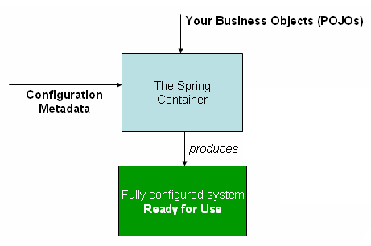
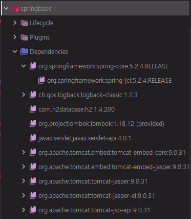
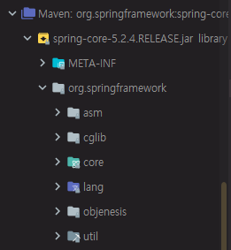
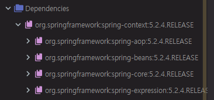
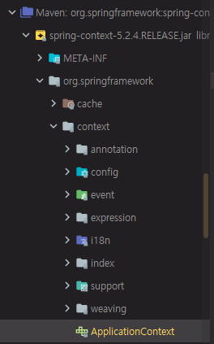

# 08. 스프링 프레임워크 코어 - The IoC Container - Container Overview

Spring Framework Documentation

https://docs.spring.io/spring/docs/5.2.0.M3/spring-framework-reference/

Core


* Core
  * IoC Container
  * Events
  * Resources
  * i18n
  * Validation
  * Data Binding
  * Type Conversion
  * SpEL
  * AOP.


https://docs.spring.io/spring/docs/5.2.0.M3/spring-framework-reference/core.html#spring-core


## IoC Container

### Introduction to the Spring IoC Container and Beans

Spring은 Inversion of Control (IoC) 라는 원칙을 구현한 프레임워크이다.


dependency injection (DI)


Spring Framework는 ApplicationContext라는 인터페이스를 통해서 IoC Container를 진행하고 있다.

BeanFactory는 ApplicationContext에 기능이 더 추가된 것이 있다.

AOP, Message resource handling, Event publication, Application-layer specific contexts


### Container Overview

org.springframework.context.ApplicationContext 가 IoC의 가장 핵심적인 것이다.


구글에 applicationcontext api 검색

[ApplicationContext (Spring Framework 5.2.4.RELEASE API)](https://docs.spring.io/spring-framework/docs/current/javadoc-api/org/springframework/context/ApplicationContext.html)

applicationcontext API에 대해 구현체들과 설명 확인 가능

여러가지 인터페이스들이 있다.


applicationcontext 라는 인터페이스를 통해서 Spring을 동작한다.

이것을 여러 구현체를 통해서 다양한 방법으로 IoC Container 기능을 구현하였다.



Spring Container를 통해서 POJO(Plain Old Java Object)로 만들어진 Business Object(간단하게 내가 만든 소스코드라고 생각하면 된다. 소스코드에서 만들어진 객체들) 을 Configuration Metadata(스프링에서 제공하는 특정 설정 방법)에 맞춰서 설정 정보를 만들어주면 스프링이 객체들을 자동으로 만들어주고 사용할 수 있도록 해준다.


#### Configuration Metadata

스프링을 설정하는 방법에 대해서 스프링에서 제공하는 방법이 여러가지가 있다.

그 중 한가지는 XML이다.

Annotation-based configuration

어노테이션을 통한 설정을 진행할 수 있다.


XML 기반으로 스프링을 설정하는 방법

XML-based configuration

```xml
<?xml version="1.0" encoding="UTF-8"?>
<beans xmlns="http://www.springframework.org/schema/beans"
    xmlns:xsi="http://www.w3.org/2001/XMLSchema-instance"
    xsi:schemaLocation="http://www.springframework.org/schema/beans
        https://www.springframework.org/schema/beans/spring-beans.xsd">

    <bean id="..." class="...">  
        <!-- collaborators and configuration for this bean go here -->
    </bean>

    <bean id="..." class="...">
        <!-- collaborators and configuration for this bean go here -->
    </bean>

    <!-- more bean definitions go here -->

</beans>
```

xml 이라는 root element 선언

beans라는 root element와 xmlns(xml namespace)들이 필요하다.

그 안에서는 bean이라고 하는 element와 id, class 패턴으로 설정한다.


xml namespace

http://www.springframework.org/schema/beans


spring-beans-4.3.xsd

복잡한 xml 이 나온다. xml 문서에 대해서 필요한 element, attribute 들이 무엇인지 정의한 것을 미리 선언해줘야 한다.

xmlns 부분은 위에 예시에 있는 것을 붙여넣으면 된다.


#### Instantiating a Container

```java
ApplicationContext context = new ClassPathXmlApplicationContext("services.xml", "daos.xml");
```

Container를 사용할 때에는 ApplicationContext의 인터페이스였기 때문에 구현체를 사용해야 한다.

ClassPathXmlApplicationContext 구현체를 사용

services.xml, daos.xml

이 구현체를 통해서 ApplicationContext를 사용하는 것을 볼 수 있다.


## 설정 방법대로 CLI 프로그램 리팩토링

설정 방법대로 기존에 만들었던 CLI 프로그램을 리팩토링


Spring Framework를 사용하기 위해 의존성 설정

https://search.maven.org/

org.springframework spring-core 검색


5.2.4.RELEASE 클릭 => dependency 복사


pom.xml 에 추가

```xml
<dependency>
  <groupId>org.springframework</groupId>
  <artifactId>spring-core</artifactId>
  <version>5.2.4.RELEASE</version>
</dependency>
```




spring-core는 spring-jcl이라는 모듈에 의존성이 있다. logging에 필요


spring-core 살펴보기



org.springframework.context.ApplicationContext을 사용해야 하는데 context가 없다.

spring framework core만 가지고는 spring framework IoC 기술을 사용할 수 없다.

실제로 의존성을 설정하고 싶을 때에는 spring framework core 말고 context라고 검색한다.

org.springframework spring-context


pom.xml에 추가(core 대신)

```xml
<dependency>
  <groupId>org.springframework</groupId>
  <artifactId>spring-context</artifactId>
  <version>5.2.4.RELEASE</version>
</dependency>
```








cli 폴더에 있는 기존 코드 수정

Spring framework에서는 bean이라는 것들을 만든다.

bean은 객체라고 생각하면 된다.

new를 이용해 인스턴스, 자바 객체를 만드는데 객체를 관리해주는 것이 Container이다.

Container를 통해서 객체를 관리하는 방법 살펴보기


먼저 코드를 리팩토링 해야한다.

DB에 관련된 코드들을 Dao(Database Access Object)라는 클래스로 몰아넣는다.

cli 디렉터리에 Dao.java 클래스 생성


Dao.java

```java
package kr.co.hello.cli;

import lombok.extern.slf4j.Slf4j;

import java.sql.*;

@Slf4j
public class Dao {
    public void run() {
        try {
            Class.forName("org.h2.Driver");
        } catch (ClassNotFoundException e) {
            e.printStackTrace();
        }
        String url = "jdbc:h2:mem:test;MODE=MySQL;";

        try(Connection connection = DriverManager.getConnection(url, "sa", "");
            Statement statement = connection.createStatement()) {

            connection.setAutoCommit(false);
            statement.execute("create table member(id int auto_increment, username varchar(255) not null, password varchar(255) not null, primary key(id));");
            try {
                statement.executeUpdate("insert into member(username, password) values('MyName', '1234')");
                connection.commit();
            } catch (SQLException e) {
                connection.rollback();
            }

            ResultSet resultSet = statement.executeQuery("select id, username, password from member");
            while(resultSet.next()){
                Member member = new Member(resultSet);
                log.info(member.toString());
            }
        } catch (SQLException e) {
        }
    }
}
```

run() 메서드 정의

cli\Main.java에 있던 코드를 잘라내기 => 붙여넣기

@Slf4j를 이용해 logger 대신 log라고 간단하게 사용

forName은 try/catch 문으로 감싸기


Main.java

```java
package kr.co.hello.cli;
import org.slf4j.Logger;
import org.slf4j.LoggerFactory;

import java.sql.*;

class Main {
	private static Logger logger = LoggerFactory.getLogger(Main.class);

	public static void main(String[] args) throws ClassNotFoundException {
		logger.info("Hello world!!");
		Dao dao = new Dao();
		dao.run();
	}
}
```

Dao 객체 생성, run 메서드 실행


```
INFO  kr.co.hello.cli.Main - Hello world!!
INFO  kr.co.hello.cli.Dao - Member(id=1, username=MyName, password=1234)
```


코드로 직접 프로그래밍 해서 객체를 만들었다.


먼저 XML을 이용해서 Configuration Metadata를 만들고 나의 Business Code를 만들고 Spring Container를 통해서 프로그램이 동작하도록 할 것이다.

ApplicationContext라고 하는 인터페이스를 구현한 것이 Spring Container이다.


Spring Container 설정

Main.java

```java
package kr.co.hello.cli;
import org.slf4j.Logger;
import org.slf4j.LoggerFactory;
import org.springframework.context.ApplicationContext;
import org.springframework.context.support.ClassPathXmlApplicationContext;

import java.sql.*;

class Main {
	private static Logger logger = LoggerFactory.getLogger(Main.class);

	public static void main(String[] args) throws ClassNotFoundException {
		logger.info("Hello world!!");

		ApplicationContext context = new ClassPathXmlApplicationContext("dao.xml");
		System.out.println(context);
//		Dao dao = new Dao();
//		dao.run();
	}
}
```

ClassPath 내에 Configuration Metadata를 XML형태의 파일이 필요하다.

context가 잘 만들어졌는지 확인


https://docs.spring.io/spring/docs/5.2.0.M3/spring-framework-reference/core.html#spring-core

`(services.xml)` configuration file 내용 복사

보통 자바 파일이 아닌 것들은 resources 폴더에 만들어두면 좋다.

resources 파일에 dao.xml 파일 생성

```xml
<?xml version="1.0" encoding="UTF-8"?>
<beans xmlns="http://www.springframework.org/schema/beans"
       xmlns:xsi="http://www.w3.org/2001/XMLSchema-instance"
       xsi:schemaLocation="http://www.springframework.org/schema/beans
        https://www.springframework.org/schema/beans/spring-beans.xsd">
    
</beans>
```

기본적인 특성만 넣는다.


logback.xml

```xml
<configuration>
  <appender name="STDOUT" class="ch.qos.logback.core.ConsoleAppender">
    <encoder>
      <pattern>%-5level %logger{36} - %msg%n</pattern>
    </encoder>
  </appender>

  <logger name="org.springframework" level="ERROR" />

  <root level="trace">
    <appender-ref ref="STDOUT" />
  </root>
</configuration>
```

log 설정 변경

org.springframework 이하로 되어있는 모든 log들은 error level 이상의 것만 찍히게 된다.


실행해보기

```
INFO  kr.co.hello.cli.Main - Hello world!!
org.springframework.context.support.ClassPathXmlApplicationContext@79698539, started on Sun Mar 15 21:15:35 KST 2020
```

객체 hash 값만 노출된다.


내가 만든 객체를 설정파일에 넣고, 설정 파일을 읽어서 객체를 spring framework이 조합을 한다.


dao.xml

```xml
<?xml version="1.0" encoding="UTF-8"?>
<beans xmlns="http://www.springframework.org/schema/beans"
       xmlns:xsi="http://www.w3.org/2001/XMLSchema-instance"
       xsi:schemaLocation="http://www.springframework.org/schema/beans
        https://www.springframework.org/schema/beans/spring-beans.xsd">

    <bean class="kr.co.hello.cli.Dao" />

</beans>
```

bean은 자바 프로그래밍 할 때의 new와 동일하다고 보면 된다. (내부적으로 동작은 다르다.)

spring이라는 컨테이너가 만들어주고 관리하는 인스턴스를 만들어준다.

class는 내가 객체를 만들고 싶은 class를 넣어준다.


Main.java

```java
package kr.co.hello.cli;
import org.slf4j.Logger;
import org.slf4j.LoggerFactory;
import org.springframework.context.ApplicationContext;
import org.springframework.context.support.ClassPathXmlApplicationContext;

import java.sql.*;

class Main {
	private static Logger logger = LoggerFactory.getLogger(Main.class);

	public static void main(String[] args) throws ClassNotFoundException {
		logger.info("Hello world!!");

		ApplicationContext context = new ClassPathXmlApplicationContext("dao.xml");
		System.out.println(context);
		Dao dao = context.getBean(Dao.class);
		dao.run();
	}
}
```

Dao class 타입의 객체를 context 내부에서 찾아서 dao 변수에 할당한다.


```
INFO  kr.co.hello.cli.Main - Hello world!!
org.springframework.context.support.ClassPathXmlApplicationContext@79698539, started on Sun Mar 15 21:23:15 KST 2020
INFO  kr.co.hello.cli.Dao - Member(id=1, username=MyName, password=1234)
```

기존과 다르게 spring framework가 객체를 만들어주는 것을 진행하였다.


context 를 통해서 설정 정보를 읽어 동작시킨다.

import라는 것을 통해서 다른 설정파일을 넣을 수도 있다.

Groovy라는 language를 통해서 bean 정의를 할 수 있다. 


