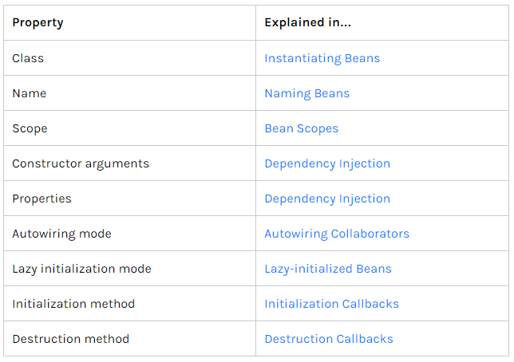

# 09. 스프링 프레임워크 코어 - The IoC Container - Bean Overview

https://docs.spring.io/spring/docs/5.2.0.M3/spring-framework-reference/core.html#spring-core

## Bean Overview

Spring IoC container는 하나 이상의 bean들을 관리한다.

bean은 configuration metadata(설정 메타데이터)를 통해 만들어진 것들로, bean이라고 하는 element로 설정할 수 있다.

* metadata
  * package와 class name, 구현 클래스 설정
  * bean의 동작에 대한 설정
    * scope, lifecycle, callback 등
  * 다른 bean에 대한 reference
  * 다른 configuration에 대한 설정
    * properties 설정 등


* Bean definition




singleton


### Naming Beans

Bean들은 모두 하나 이상의 id를 가져야한다.

앞에서는 bean에 id를 넣지 않았다. 이런 경우에도 bean은 spring이 자동적으로 유니크한 id 값을 만들어준다.

xml을 통한 설정에서는 id, name이라는 attribute를 통해서 bean 설정을 할 수 있다.

id는 딱 하나만 있어야한다.

name같은 경우 이름을 지어줄 수 있는데 comma (`,`), semicolon (`;`), 또는 white space 를 이용해 여러개의 이름을 지을 수 있다.


dao.xml

```xml
<?xml version="1.0" encoding="UTF-8"?>
<beans xmlns="http://www.springframework.org/schema/beans"
       xmlns:xsi="http://www.w3.org/2001/XMLSchema-instance"
       xsi:schemaLocation="http://www.springframework.org/schema/beans
        https://www.springframework.org/schema/beans/spring-beans.xsd">

    <bean id="dao" class="kr.co.hello.cli.Dao" />

</beans>
```

id 값 부여


Main.java

```java
...
		ApplicationContext context = new ClassPathXmlApplicationContext("dao.xml");
		Dao dao = context.getBean("dao", Dao.class);
		dao.run();
...
```

유니크한 id 값은 실제로는 기존의 class명만 넣었던 bean의 id 또는 name 속성으로 조회가 가능하다.

없는 이름으로 조회하는 경우 bean을 찾을 수 없다고 error를 던진다.


dao.xml

```xml
...
    <bean id="dao" name="dao1" class="kr.co.hello.cli.Dao" />
...
```


Main.java

```java
...
		Dao dao = context.getBean("dao1", Dao.class);
...
```

name 속성을 통해서 객체를 찾아서 사용한다.


dao.xml

```xml
...
    <bean id="dao" name="dao1, dao2, dao3" class="kr.co.hello.cli.Dao" />
...
```

name 속성 여러개 지정


왜 유니크한 값이 필요한가?

같은 클래스라도 스프링이 관리해야하는 bean이 다를 수 있다.


같은 클래스이지만 여러개의 다른 bean으로 만들 수 있다.


dao.xml

```xml
...
    <bean id="dao" name="dao1, dao2, dao3" class="kr.co.hello.cli.Dao" />

    <bean id="new_dao" class="kr.co.hello.cli.Dao" />
...
```

만약 같은 id 값을 넣게 되면 spring beans factory가 xml을 로딩할 때 같은 id가 이미 사용되고 있어서 사용할 수 없다는 에러가 발생한다.

중복된 id는 피해야한다.

spring이라는 container가 bean을 만든다. 두 개의 bean은 new를 통해서 새로 만들어진 객체이기 때문에 hash 값이 달라야한다.


Main.java

```java
...
		ApplicationContext context = new ClassPathXmlApplicationContext("dao.xml");
		Dao dao = context.getBean("dao", Dao.class);
		Dao new_dao = context.getBean("new_dao", Dao.class);
//		dao.run();
		System.out.println(dao == new_dao);
...
```


```
INFO  kr.co.hello.cli.Main - Hello world!!
false
```

같은 class라고 해도 bean으로 따로 설정했기 때문에 다른 객체로 두 번 인스턴스화 돼서 dao, new_dao로 사용할 수 있다.

다른 주소이므로 같은 객체가 아닌 것을 확인할 수 있다.


특정 bean에서 다른 bean을 참조해야하는 경우 ref 라는 element를 사용한다. name 또는 id 값을 사용


### Instantiating Beans

bean을 객체로 만들 때에는 생성자, Static Factory Method, Instance Factory Method를 통해서 만들 수 있다. 3가지 방법 제공


#### Instantiation with a Constructor

```xml
<bean id="exampleBean" class="examples.ExampleBean"/>

<bean name="anotherExample" class="examples.ExampleBeanTwo"/>
```

bean이라고 하고 class명만 넣으면 spring은 ExampleBean이라는 것의 기본 생성자를 통해서 객체를 만든다.


Dao 클래스에서 우리는 생성자 선언을 아무것도 하지 않았다.

컴파일 타임에 아무것도 인자를 받지 않는 기본 생성자를 만들어준다.

기본 생성자를 이용해서 spring이 내부적으로 객체를 만들어준다.


Dao.java

```java
    public Dao(String param) {
    }
```

Dao 클래스에 String 타입을 받는 생성자가 추가된다면 실행했을 때 에러가 난다.

사용자가 생성자를 하나라도 메뉴얼하게 정의한 경우는 기본 생성자를 만들지 않기 때문에다.

이런 경우에 대해서는 bean 설정을 통해서 생성 가능하게 할 수 있다.

생성자 코드 지우기


#### Instantiation with a Static Factory Method

Static Factory Method를 통해서 객체를 만들 수 있다.

```xml
<bean id="clientService"
    class="examples.ClientService"
    factory-method="createInstance"/>
```

기존과 다르게 factory-method 라는 attribute를 추가하고, 거기에 factory-method에 관련되어있는 method명을 명시해준다.


```java
public class ClientService {
    private static ClientService clientService = new ClientService();
    private ClientService() {}

    public static ClientService createInstance() {
        return clientService;
    }
}
```

static, method명, 자기 자신의 class(인스턴스화 할 타입의 클래스명)을 넣어준다.

반환을 해주는 형태의 메서드를 만든다.


Dao.java

```java
    public static Dao createDao() {
        return new Dao();
    }
```


dao.xml

```xml
<?xml version="1.0" encoding="UTF-8"?>
<beans xmlns="http://www.springframework.org/schema/beans"
       xmlns:xsi="http://www.w3.org/2001/XMLSchema-instance"
       xsi:schemaLocation="http://www.springframework.org/schema/beans
        https://www.springframework.org/schema/beans/spring-beans.xsd">

    <bean id="dao" class="kr.co.hello.cli.Dao" factory-method="createDao" />

</beans>
```


```
INFO  kr.co.hello.cli.Main - Hello world!!
INFO  kr.co.hello.cli.Dao - Member(id=1, username=MyName, password=1234)
```

실제로 createDao() 메서드가 동작하는지 디버깅을 통해 확인해보기


#### Instantiation by Using an Instance Factory Method

Instance Factory Method를 통해서 Instantiation하기

```xml
<!-- the factory bean, which contains a method called createInstance() -->
<bean id="serviceLocator" class="examples.DefaultServiceLocator">
    <!-- inject any dependencies required by this locator bean -->
</bean>

<!-- the bean to be created via the factory bean -->
<bean id="clientService"
    factory-bean="serviceLocator"
    factory-method="createClientServiceInstance"/>
```

두 개의 bean이 필요하다.

하나는 bean을 만들어줄 class가 정의된 bean

다른 하나는 우리가 사용할 bean인데 사용할 bean을 만들어줄 bean을 정의해주고, 그 bean에서 동작시킬 factory-method를 정의해주면 된다.


Static Factory Method의 경우에는 자기 자신이 factory-method를 가지고 있었고, 지금은 외부에 있는 class가 factory-method를 가지고 있는 경우이다.


보통 특정 외부 자원들을 사용할 때 factory-method를 통해 설정하는 경우를 종종 볼 수 있다.


cli 디렉터리에 Dao를 만드는 DaoFactory 클래스를 생성한다.

DaoFactory.java

```java
package kr.co.hello.cli;

public class DaoFactory {
    public Dao createDao() {
        return new Dao();
    }
}
```

보통 어떤 객체를 만들어주는 것을 Factory라고 부른다.


Dao.java 에 있던 createDao 메서드 지우기


dao.xml

```xml
    <bean id="daoFactory" class="kr.co.hello.cli.DaoFactory" />

    <bean id="dao" class="kr.co.hello.cli.Dao"
          factory-bean="daoFactory"
          factory-method="createDao" />
```

DaoFactory를 bean으로 만들기

factory-bean은 DaoFactory의 id 값을 넣어준다.


실행해보기

실제로 DaoFactory의 createDao가 호출되는지 디버깅으로 확인

Factory를 통해서 객체가 만들어진다.

