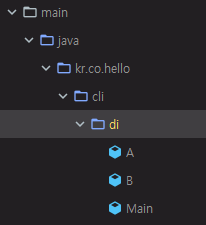
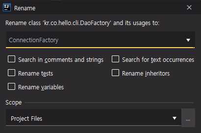
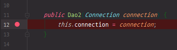
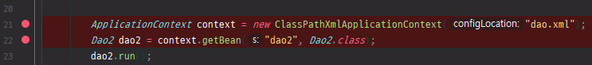
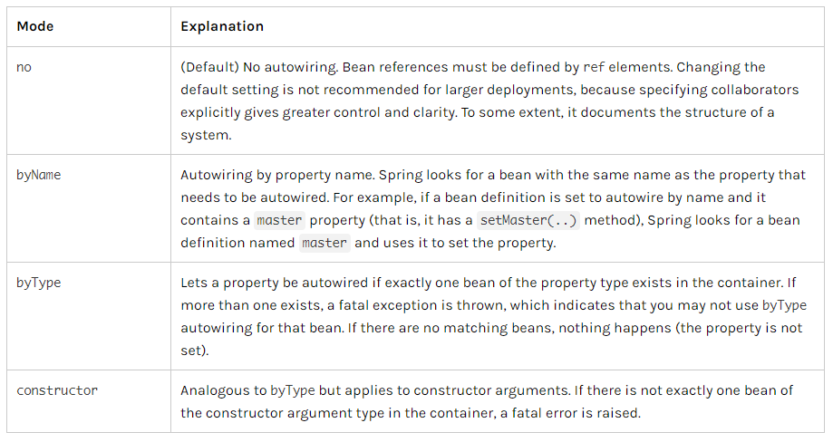

# 10. 스프링 프레임워크 코어 - The IoC Container - Dependencies

https://docs.spring.io/spring/docs/5.2.0.M3/spring-framework-reference/core.html#beans-dependencies

## Dependencies

Dependency injection(DI) 라는 개념이 나온다.

DI는 Spring IoC Container의 중요한 컨셉이다.


### Dependency Injection

애플리케이션은 하나 이상의 오브젝트로 구성된다.

오브젝트들간에 서로 함께 작업을 한다.




cli 디렉터리 아래에 di 디렉터리(Package) 생성

A class, B class와 그것들을 실행하는 Main class

psvm을 입력하면 main 메서드 쉽게 생성 가능


A.java

```java
package kr.co.hello.cli.di;

public class A {
    private B b = new B();

    public void print() {
        System.out.println(b.calc());
    }
}
```

A class는 필드로 B를 가진다.

print 메서드 => B의 calc를 출력


B.java

```java
package kr.co.hello.cli.di;

public class B {
    public int calc() {
        return 1;
    }
}
```

B에서는 메서드 하나만 있다.

1을 return하는 calc 메서드


Main.java

```java
package kr.co.hello.cli.di;

public class Main {
    public static void main(String[] args) {
        A a = new A();
        a.print();
    }
}
```

A를 실행


A라는 오브젝트는 B라는 오브젝트와 관계가 있고, A와 B는 함께 동작하고 있다. A에서 B를 호출

이런 관계를 A는 B라는 객체에 의존성이 있다고 말을한다.


객체와 객체간에 의존성이 있는 관계


B.java

```java
package kr.co.hello.cli.di;

public class B {
    boolean condition;

    public B(boolean condition) {
        this.condition = condition;
    }

    public int calc() {
        if(condition) {
            return 1;
        } else {
            return 0;
        }
    }
}
```

생성자 만들기

B에 의존성이 있는 A class에서 생성자에 값을 넣어야한다.

A class의 코드를 고쳐야한다.


A.java

```java
package kr.co.hello.cli.di;

public class A {
    private B b = new B(false);

    public void print() {
        System.out.println(b.calc());
    }
}
```

B라는 클래스를 바꾸기 위해서 A는 코드 레벨을 수정해야한다.

A와 B는 tight하게 관계가 맺어져있다.


실제로는 Main class에서 B에 있는 condition값을 제어하고 싶다.

Main.java

```java
package kr.co.hello.cli.di;

public class Main {
    public static void main(String[] args) {
        boolean condition = true;
        A a = new A(condition);
        a.print();
    }
}
```

Main class에서 condition이라는 값을 A라는 class에게 줘야한다.


A.java

```java
package kr.co.hello.cli.di;

public class A {
    private B b;

    public A(boolean condition) {
        this.b = new B(condition);
    }

    public void print() {
        System.out.println(b.calc());
    }
}
```


점점 복잡도가 증가한다.

Main에서 condition값을 제어하기 위해서 A class에 값을 주고, A class는 다시 B class에게 값을 주게된다. B class에서 해당 값을 사용한다.

객체와 객체의 관계가 복잡해질수록 사람은 더 이상 제어할 수 없는 단계가 되어버린다.


DI라는 원칙을 통해서 tight하게 맺어져 있는 관계들을 decoupling 하게된다.

decoupling 함으로써 더욱 유지보수가 편해지고 더 간결한 코드가 만들어진다.


DI 원칙은 간단하다.

직접 코드 레벨에서 관계를 맺어주는 것이 아니다.


A.java

```java
package kr.co.hello.cli.di;

public class A {
    private B b;

    public A(B b) {
        this.b = b;
    }

    public void print() {
        System.out.println(b.calc());
    }
}
```


Main.java

```java
package kr.co.hello.cli.di;

public class Main {
    public static void main(String[] args) {
        boolean condition = true;
        B b = new B(condition);
        A a = new A(b);
        a.print();
    }
}
```

A 객체에 B를 주입해줘야 한다.

B를 선언하고 condition을 넣게되면 Main 클래스에서 B의 condition을 제어할수 있게 된다.

A 객체에 B 객체를 주입해준다. 생성자 추가

Main 클래스가 A 객체와 B 객체를 만들고, A 객체에 B 객체를 주입해주었다.

A는 B가 가져야될 값을 몰라도 되는 상황이 되어서 decoupling 이 되었다.

코드의 복잡도가 줄어들고, 객체와 객체간의 관계를 더 이해하기 편하게 되었다.

기존에는 A가 boolean값을 가지고 A가 B를 만들고, B에 값을 주입해주는 형태였다.


#### Constructor-based Dependency Injection

DI 원칙이 객체지향의 주요 원칙이 되었다.

DI라는 개념을 프레임워크화, 도구화 한 것이 IoC Container이다.

Spring framework가 DI 원리를 이용해서 객체들의 관계를 만들어준다.


dao.xml

```xml
<?xml version="1.0" encoding="UTF-8"?>
<beans xmlns="http://www.springframework.org/schema/beans"
       xmlns:xsi="http://www.w3.org/2001/XMLSchema-instance"
       xsi:schemaLocation="http://www.springframework.org/schema/beans
        https://www.springframework.org/schema/beans/spring-beans.xsd">

    <bean id="daoFactory" class="kr.co.hello.cli.DaoFactory" />

    <bean id="dao" class="kr.co.hello.cli.Dao"
          factory-bean="daoFactory"
          factory-method="createDao" />

    <bean id="a" class="kr.co.hello.cli.di.A">
        <constructor-arg ref="b" />
    </bean>
    <bean id="b" class="kr.co.hello.cli.di.B">
        <constructor-arg value="true"/>
    </bean>
</beans>
```

bean 생성

constructor-arg를 이용해서 B class로 만들어진 객체에 reference를 연결해준다.

B type의 객체는 boolean type의 값을 원하기때문에 true라는 값을 넣어준다.


기존에 cli\Main.java에서 했던, ApplicationContext를 만들어서 getBean 했던것과 동일하게 xml로 setting하게 되었다.


di\Main.java

```java
package kr.co.hello.cli.di;

import org.springframework.context.ApplicationContext;
import org.springframework.context.support.ClassPathXmlApplicationContext;

public class Main {
    public static void main(String[] args) {
        ApplicationContext context = new ClassPathXmlApplicationContext("dao.xml");
        A a = context.getBean("a", A.class);
        a.print();
    }
}
```

DI 원칙을 이용해서 IoC Container가 만들어졌고, IoC Container로 spring을 이용해서 사용할 수 있게 된다.

객체와의 관계를 설정해줬다.

관계를 맺는 코드를 설정으로 뺌으로써 좋아지는 것은 먼저 설정을 보고 객체들에 대한 관계를 눈으로 볼 수 있다.

실제로는 Container 사용을 위한 코드를 제외한 나머지는 business logic에만 집중할 수 있기 때문에 훨씬 더 개발에 도움을 많이 준다.


Dependency Injection을 통해서 test를 더 쉽게 할 수 있게된다.

interfaces나 abstract 을 가지고 stub 이나 mock을 만들 수 있다.


#### Setter-based Dependency Injection

Setter base로 Dependency Injection을 할 수 있다.

lombok을 할 때 만들었던 getter, setter에서의 setter


A.java

```java
package kr.co.hello.cli.di;

public class A {
    private B b;

    public void setB(B b) {
        this.b = b;
    }

    public void print() {
        System.out.println(b.calc());
    }
}
```

A에 생성자 대신 b라는 필드의 setter 생성


dao.xml

```xml
...
    <bean id="a" class="kr.co.hello.cli.di.A">
        <property name="b" ref="b" />
    </bean>
    <bean id="b" class="kr.co.hello.cli.di.B">
        <constructor-arg value="true"/>
    </bean>
...
```

constructor-arg가 아닌 property로 b라고 해주면 된다.

property는 setter의 set을 빼고 남는 메서드의 이름(필드명)만 넣고, 관계를 맺을 bean의 id를 넣어주면 된다.


생성자는 객체가 만들어질때 단 한번만 동작되기 때문에 객체 생성할 때에만 필요한 코드를 넣고 싶으면 생성자만 사용

setter는 코드가 돌다가 객체의 dependency를 변경하고 싶을 때, 객체 생성에서 뿐만 아니라 run time의 어느 시점에든 간에 프로그램이 돌다가 관계를 재설정하고싶을 때 setter를 사용하면 가능하다.

보통 관계들은 한 번 객체가 생성될 때 관계를 맺고 변경을 안해주는 것이 좋다.

가능하면 setter쪽은 덜 사용하는 것이 좋다.

Spring 쪽에서는 Constructor-based의 DI를 권장한다.


#### Dependency Resolution Process

Dependency 처리 과정

* ApplicationContext가 XML, Java code, annotations을 통해서 configuration metadata를 읽어서 beans에 대한 설정을 확인한다.
* 각각의 bean들에 대해서는 properties, constructor, factory method를 통해서 bean들을 제공한다.


#### Circular dependencies

상호 참조


A.java

```java
package kr.co.hello.cli.di;

public class A {
    private B b = new B();

    public void print() {
        b.print();
    }
}
```


B.java

```java
package kr.co.hello.cli.di;

public class B {
    private A a = new A();

    public void print() {
        a.print();
    }
}
```

A와 B가 서로 관계가 맺어진 상태

A는 B에, B는 A에 의존성이 있다.


Main.java

```java
package kr.co.hello.cli.di;

import org.springframework.context.ApplicationContext;
import org.springframework.context.support.ClassPathXmlApplicationContext;

public class Main {
    public static void main(String[] args) {
//        ApplicationContext context = new ClassPathXmlApplicationContext("dao.xml");
//        A a = context.getBean("a", A.class);
        new A().print();
    }
}
```


```
Exception in thread "main" java.lang.StackOverflowError
	at kr.co.hello.cli.di.A.<init>(A.java:4)
	at kr.co.hello.cli.di.B.<init>(B.java:4)
	...
```

서로 참조되어있는 객체의 print 메서드를 계속 호출하기 때문에 stack overflow가 발생하면서 프로그램이 종료된다.


dao.xml

```xml
...
    <bean id="a" class="kr.co.hello.cli.di.A">
        <property name="b" ref="b" />
    </bean>
    <bean id="b" class="kr.co.hello.cli.di.B">
        <property name="a" ref="a" />
    </bean>
...
```

a는 b에 의존성이 있고, b는 a에 의존성이 있다.

spring framework는 서로간에 상호 참조가 되기 때문에 a bean를 만들다가 b bean을 만드는데 b bean은 a bean이 필요하기 때문에 서로 만들지 못하는 상황이 된다.

이것이 Circular dependency 이다. 이런 경우가 발생하면 error가 난다.

di 패키지 삭제, dao.xml에서 A, B class bean 삭제


### Dependencies and Configuration in Detail

기존에 우리가 만들었던 JDBC를 이용한 코드를 Spring을 통해서 객체지향적으로 코드 변경


#### 기존 코드의 문제점

Dao class의 문제점은 database를 처리하는 객체가 또 생겼을 때 발생한다.

객체지향이 아니더라도 반복되는 코드는 하나의 메서드로 빼줘야한다.

반복되는 부분은 class를 로딩하는 부분, database connection과 statement를 만드는 부분

나머지 부분, sql을 어떻게 넣는지, 어떻게 select를 하고 이런 것들에 대해서는 business logic에 따라 다를 수 있다.

Dao class 복사 => 붙여넣기 => Dao2 class 생성


#### 해결 방법

DriverManager를 통해서 만들어낸 connection을 bean으로 정의한다.

그 bean을 Dao와 Dao2가 같이 사용한다.


DaoFactory 대신 ConnectionFactory로 이름 변경(Shift + F6)




ConnectionFactory.java

```java
package kr.co.hello.cli;

import java.sql.Connection;
import java.sql.DriverManager;
import java.sql.SQLException;

public class ConnectionFactory {
    public Connection createConnection() throws SQLException {
        String url = "jdbc:h2:mem:test;MODE=MySQL;";
        return DriverManager.getConnection(url, "sa", "");
    }
}
```

java.sql의 connection을 만드는 역할을 한다.

getConnection은 Add exception to method signature

throws로 예외 처리


dao.xml

```xml
<?xml version="1.0" encoding="UTF-8"?>
<beans xmlns="http://www.springframework.org/schema/beans"
       xmlns:xsi="http://www.w3.org/2001/XMLSchema-instance"
       xsi:schemaLocation="http://www.springframework.org/schema/beans
        https://www.springframework.org/schema/beans/spring-beans.xsd">

    <bean id="connectionFactory" class="kr.co.hello.cli.ConnectionFactory" />

    <bean id="connection" class="java.sql.Connection"
          factory-bean="connectionFactory"
          factory-method="createConnection" />

    <bean id="dao" class="kr.co.hello.cli.Dao">
        <constructor-arg ref="connection" />
    </bean>
</beans>
```

기존에는 factory-bean을 통해서 만들도록 설정했었다. => 이 부분 제거

connection bean을 만든다.

dao에 해당 bean을 constructor-arg로 DI 한다.


Dao.java

```java
package kr.co.hello.cli;

import lombok.extern.slf4j.Slf4j;

import java.sql.*;

@Slf4j
public class Dao {
    private Connection connection;

    public Dao(Connection connection) {
        this.connection = connection;
    }

    public void run() throws SQLException {
        Statement statement = connection.createStatement();
        connection.setAutoCommit(false);
        statement.execute("create table member(id int auto_increment, username varchar(255) not null, password varchar(255) not null, primary key(id));");
        try {
            statement.executeUpdate("insert into member(username, password) values('MyName', '1234')");
            connection.commit();
        } catch (SQLException e) {
            connection.rollback();
        }

        ResultSet resultSet = statement.executeQuery("select id, username, password from member");
        while(resultSet.next()){
            Member member = new Member(resultSet);
            log.info(member.toString());
        }
    }
}
```

connection 코드를 지울 수 있다.

url 부분 지우기, connection 필드 추가, 생성자 만들기

이렇게 함으로써 dao 설정에 넣었던 constructor-arg로 bean이 주입된다.

createStatement => Add exception to method signature

Dao2도 Dao와 동일한 코드이므로 안의 내용을 그대로 복사해서 붙여넣기

Dao와 Dao2는 connection이라는 객체를 서로 공유하고 사용하고 있다.


Main.java

```java
package kr.co.hello.cli;
import org.slf4j.Logger;
import org.slf4j.LoggerFactory;
import org.springframework.context.ApplicationContext;
import org.springframework.context.support.ClassPathXmlApplicationContext;

import java.sql.*;

class Main {
	private static Logger logger = LoggerFactory.getLogger(Main.class);

	public static void main(String[] args) throws SQLException {
		logger.info("Hello world!!");

		try {
			Class.forName("org.h2.Driver");
		} catch (ClassNotFoundException e) {
			e.printStackTrace();
		}

		ApplicationContext context = new ClassPathXmlApplicationContext("dao.xml");
		Dao dao = context.getBean("dao", Dao.class);
		dao.run();
	}
}
```

Driver loading 부분은 Main class에서 loading하는 것으로 한다.

run에서 sql exception을 던진다


실행시켜보면 기존과 동일하게 동작한다.

connection은 spring이 주입하는 형태가 된다. 설정으로 connection을 만든다.


Dao2도 동일하게 동작하는지 확인

dao.xml

```xml
    <bean id="dao" class="kr.co.hello.cli.Dao">
        <constructor-arg ref="connection" />
    </bean>

    <bean id="dao2" class="kr.co.hello.cli.Dao2">
        <constructor-arg ref="connection" />
    </bean>
```

같은 connection이라는 ref를 가리키고 있다.


Main.java

```java
...
		ApplicationContext context = new ClassPathXmlApplicationContext("dao.xml");
		Dao2 dao2 = context.getBean("dao2", Dao2.class);
		dao2.run();
...
```


```
INFO  kr.co.hello.cli.Main - Hello world!!
INFO  kr.co.hello.cli.Dao2 - Member(id=1, username=MyName, password=1234)
```


둘 다 connection을 DI로 주입받았다.


ConnectionFactory.java 에 있는 url, user, password 같은 것들은 설정으로 뺄 수가 있다.

ConnectionFactory.java

```java
package kr.co.hello.cli;

import java.sql.Connection;
import java.sql.DriverManager;
import java.sql.SQLException;

public class ConnectionFactory {
    private String url;
    private String user;
    private String password;

    public ConnectionFactory(String url, String user, String password) {
        this.url = url;
        this.user = user;
        this.password = password;
    }

    public Connection createConnection() throws SQLException {
        return DriverManager.getConnection(this.url, this.user, this.password);
    }
}
```

필드를 선언, 생성자 추가

getConnection에 현재 객체의 필드명을 넣어준다.


dao.xml

```xml
<?xml version="1.0" encoding="UTF-8"?>
<beans xmlns="http://www.springframework.org/schema/beans"
       xmlns:xsi="http://www.w3.org/2001/XMLSchema-instance"
       xsi:schemaLocation="http://www.springframework.org/schema/beans
        https://www.springframework.org/schema/beans/spring-beans.xsd">

    <bean id="connectionFactory" class="kr.co.hello.cli.ConnectionFactory">
        <constructor-arg name="url" value="jdbc:h2:mem:test;MODE=MySQL;"/>
        <constructor-arg name="user" value="sa" />
        <constructor-arg name="password" value="" />
    </bean>

    <bean id="connection" class="java.sql.Connection"
          factory-bean="connectionFactory"
          factory-method="createConnection" />

    <bean id="dao" class="kr.co.hello.cli.Dao">
        <constructor-arg ref="connection" />
    </bean>

    <bean id="dao2" class="kr.co.hello.cli.Dao2">
        <constructor-arg ref="connection" />
    </bean>
</beans>
```

코드에서의 설정값 없이 spring의 xml configuration metadata 설정을 이용


IoC Container를 통해서 설정과 실제 Business logic을 분리

설정값이 바꼈을 때 설정에서 보는것이 아니라 Business code에 있다고 하면 디버깅하기 쉽지 않다.


#### Straight Values (Primitives, Strings, and so on)

DI에 대해서 Primitives 타입으로도 제공을 한다.

```xml
<bean id="myDataSource" class="org.apache.commons.dbcp.BasicDataSource" destroy-method="close">
    <!-- results in a setDriverClassName(String) call -->
    <property name="driverClassName" value="com.mysql.jdbc.Driver"/>
    <property name="url" value="jdbc:mysql://localhost:3306/mydb"/>
    <property name="username" value="root"/>
    <property name="password" value="masterkaoli"/>
</bean>
```

문자열 같은 경우에도 BasicDataSource라는 database connection을 관리하는 것이 있다.

property로 driverClassName, url, username, password를 설정

실제로는 문자열인데 DI 해서 값을 넣어줄 수 있다.


```xml
<beans xmlns="http://www.springframework.org/schema/beans"
    xmlns:xsi="http://www.w3.org/2001/XMLSchema-instance"
    xmlns:p="http://www.springframework.org/schema/p"
    xsi:schemaLocation="http://www.springframework.org/schema/beans
    https://www.springframework.org/schema/beans/spring-beans.xsd">

    <bean id="myDataSource" class="org.apache.commons.dbcp.BasicDataSource"
        destroy-method="close"
        p:driverClassName="com.mysql.jdbc.Driver"
        p:url="jdbc:mysql://localhost:3306/mydb"
        p:username="root"
        p:password="masterkaoli"/>

</beans>
```

property에 관련되어있는 것들은 xmlns:p(namespace p)라는 것을 추가해주면 하위 element로 만들지 않고 같은 bean element에 대해 attribute로 p prefix를 붙인 다음 내용을 집어넣을 수 있다.


```xml
<bean id="mappings"
    class="org.springframework.context.support.PropertySourcesPlaceholderConfigurer">

    <!-- typed as a java.util.Properties -->
    <property name="properties">
        <value>
            jdbc.driver.className=com.mysql.jdbc.Driver
            jdbc.url=jdbc:mysql://localhost:3306/mydb
        </value>
    </property>
</bean>
```

properties를 list 형태로 받을 수 있다.

PropertySourcesPlaceholderConfigurer라는 클래스를 통해서 property를 설정할 수 있다.


#### References to Other Beans (Collaborators)

ref를 통해서 다른 bean과 reference를 건다.

```xml
<ref bean="someBean"/>
```


#### Inner Beans

bean을 외부에 만들지 않고 bean 안에 bean을 설정할 수 있다.

많이 쓰이지는 않는다.

```xml
<bean id="outer" class="...">
    <!-- instead of using a reference to a target bean, simply define the target bean inline -->
    <property name="target">
        <bean class="com.example.Person"> <!-- this is the inner bean -->
            <property name="name" value="Fiona Apple"/>
            <property name="age" value="25"/>
        </bean>
    </property>
</bean>
```


#### Collections

bean을 설정할 때 Collections(`<list/>`, `<set/>`, `<map/>`, `<props/>`) 와 관련된 것들을 각각의 type과 관련되게 mapping을 해준다.

```xml
<bean id="moreComplexObject" class="example.ComplexObject">
    <!-- results in a setAdminEmails(java.util.Properties) call -->
    <property name="adminEmails">
        <props>
            <prop key="administrator">administrator@example.org</prop>
            <prop key="support">support@example.org</prop>
            <prop key="development">development@example.org</prop>
        </props>
    </property>
    <!-- results in a setSomeList(java.util.List) call -->
    <property name="someList">
        <list>
            <value>a list element followed by a reference</value>
            <ref bean="myDataSource" />
        </list>
    </property>
    <!-- results in a setSomeMap(java.util.Map) call -->
    <property name="someMap">
        <map>
            <entry key="an entry" value="just some string"/>
            <entry key ="a ref" value-ref="myDataSource"/>
        </map>
    </property>
    <!-- results in a setSomeSet(java.util.Set) call -->
    <property name="someSet">
        <set>
            <value>just some string</value>
            <ref bean="myDataSource" />
        </set>
    </property>
</bean>
```


#### XML Shortcut with the p-namespace

```xml
<beans xmlns="http://www.springframework.org/schema/beans"
    xmlns:xsi="http://www.w3.org/2001/XMLSchema-instance"
    xmlns:p="http://www.springframework.org/schema/p"
    xsi:schemaLocation="http://www.springframework.org/schema/beans
        https://www.springframework.org/schema/beans/spring-beans.xsd">

    <bean name="classic" class="com.example.ExampleBean">
        <property name="email" value="someone@somewhere.com"/>
    </bean>

    <bean name="p-namespace" class="com.example.ExampleBean"
        p:email="someone@somewhere.com"/>
</beans>
```

p namespace를 이용해서 Shortcut 으로 사용할 수 있다.


#### XML Shortcut with the c-namespace

c-namespace를 통한 shortcut

```xml
<beans xmlns="http://www.springframework.org/schema/beans"
    xmlns:xsi="http://www.w3.org/2001/XMLSchema-instance"
    xmlns:c="http://www.springframework.org/schema/c"
    xsi:schemaLocation="http://www.springframework.org/schema/beans
        https://www.springframework.org/schema/beans/spring-beans.xsd">

    <bean id="beanTwo" class="x.y.ThingTwo"/>
    <bean id="beanThree" class="x.y.ThingThree"/>

    <!-- traditional declaration with optional argument names -->
    <bean id="beanOne" class="x.y.ThingOne">
        <constructor-arg name="thingTwo" ref="beanTwo"/>
        <constructor-arg name="thingThree" ref="beanThree"/>
        <constructor-arg name="email" value="something@somewhere.com"/>
    </bean>

    <!-- c-namespace declaration with argument names -->
    <bean id="beanOne" class="x.y.ThingOne" c:thingTwo-ref="beanTwo"
        c:thingThree-ref="beanThree" c:email="something@somewhere.com"/>

</beans>
```

기존에 constructor-arg 했던것들을 c-namespace를 통해서 element로 선언하지 않고 shortcut으로 사용할 수 있다.


### Using `depends-on`

```xml
<bean id="beanOne" class="ExampleBean" depends-on="manager"/>
<bean id="manager" class="ManagerBean" />
```

depends-on은 두 개의 bean에 관계가 있을 때, 특히 만들어진 순서에 관계가 있을 때에는 beanOne이라고 하는 bean이 먼저 만들어질 때 depends-on이라고 하는 것에 값이 있으면 manager라고 하는 id의 값을 가진 bean을 먼저 만들고 그 다음에 beanOne bean을 만드는, 만드는 순서에 대해서 manual하게 정의할 수 있다.


### Lazy-initialized Beans

```xml
<bean id="lazy" class="com.something.ExpensiveToCreateBean" lazy-init="true"/>
<bean name="not.lazy" class="com.something.AnotherBean"/>
```

lazy-init="true" 라고 해주면 실제로 spring container가 맨 처음에 xml을 읽고 bean을 바로 만드는데, lazy-init="true"라고 하는 attribute에 속성값이 있으면 해당 bean을 사용하는 시점에서 bean을 만든다.


Dao2.java



Dao2는 지금은 생성자 방식으로 객체가 만들어지기 때문에 생성자에 break point를 건다.


Main.java



Main 메서드에서 ApplicationContext가 로딩이 될 때 생성자가 호출이 되는지 살펴보기


디버깅을 통해 동작 확인

ApplicationContext 로딩 => Dao2 생성자 호출 => getBean


dao.xml

```xml
...
    <bean id="dao2" class="kr.co.hello.cli.Dao2" lazy-init="true">
        <constructor-arg ref="connection" />
    </bean>
...
```

lazy-init="true"로 변경

디버깅을 통해 확인, 비교


ApplicationContext 로딩 => getBean => Dao2 생성자 호출

Dao2 생성자가 실행되는 것이 아니라 바로 그 다음으로 넘어간다.

lazy 이기 때문에 Dao2가 실행되는 시점에 bean이 만들어지는 것이다.


### Autowiring Collaborators

xml 설정을 사용할 때에는 Autowiring 을 사용하는 것을 추천하지는 않는다.

명시적으로 bean을 설정해주는 것이 좋다.


Autowiring 에 대한 attribute value로 no, byName, byType, constructor를 지원한다.




constructor

dao.xml

```xml
...
    <bean id="dao2" class="kr.co.hello.cli.Dao2" autowire="constructor" />
...
```

실제로는 constructor-arg ref 해서 bean의 관계를 명시해줬는데, autowire를 통해 자동으로 설정하라는 것으로 바꿨다.

main 메서드 실행 확인


나중에는 autowire가 어떤 bean과 관계가 맺어지는지를 찾는 것이 일이기 때문에 실제로 xml 설정에서는 명시적으로 설정을 걸어주는 것이 좋다.

